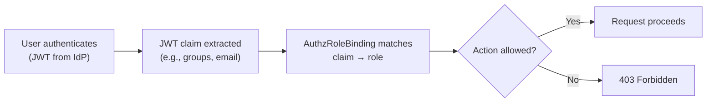

# OpenChoreo Authorization Guide

This guide explains how to configure role-based access control (RBAC) in OpenChoreo using AuthzRole and AuthzRoleBinding resources.

## Overview

OpenChoreo authorization controls who can perform what actions within the platform. It uses JWT-authenticated subjects (from your identity provider) and maps them to roles via role bindings.



## Key Concepts

| Concept | Description |
|---------|-------------|
| **AuthzRole** | Defines a named set of permitted actions (namespace-scoped) |
| **ClusterAuthzRole** | Same as AuthzRole, but cluster-scoped (applies across all namespaces) |
| **AuthzRoleBinding** | Grants a role to subjects matching a JWT claim (namespace-scoped) |
| **ClusterAuthzRoleBinding** | Same as AuthzRoleBinding, but cluster-scoped |
| **Entitlement** | A JWT claim name/value pair that identifies the subject |
| **Scope** | Optional narrowing of a role binding to specific projects and/or components |
| **Effect** | `allow` (default) or `deny` — deny bindings explicitly block actions |

## Available Actions

Actions follow the `<resource>:<verb>` pattern. Common actions include:

| Action | Description |
|--------|-------------|
| `component:create` | Create new components |
| `component:read` | View component details |
| `component:update` | Modify component configuration |
| `component:delete` | Delete components |
| `component:promote` | Promote releases across environments |
| `project:create` | Create new projects |
| `project:read` | View project details |
| `project:update` | Modify project settings |
| `project:delete` | Delete projects |
| `environment:read` | View environment configuration |
| `build:trigger` | Trigger new builds |
| `build:read` | View build status and logs |

> **Note:** Check the OpenChoreo source for the complete list of actions, as new actions may be added with new features.

## Examples

### Define a Developer Role

```yaml
apiVersion: openchoreo.dev/v1alpha1
kind: AuthzRole
metadata:
  name: developer
  namespace: my-org
spec:
  description: "Can create, read, and update components but not delete"
  actions:
    - "component:create"
    - "component:read"
    - "component:update"
    - "project:read"
    - "build:trigger"
    - "build:read"
    - "environment:read"
```

### Define a Platform Admin Role (Cluster-Wide)

```yaml
apiVersion: openchoreo.dev/v1alpha1
kind: ClusterAuthzRole
metadata:
  name: platform-admin
spec:
  description: "Full access to all OpenChoreo resources"
  actions:
    - "project:create"
    - "project:read"
    - "project:update"
    - "project:delete"
    - "component:create"
    - "component:read"
    - "component:update"
    - "component:delete"
    - "component:promote"
    - "environment:read"
    - "build:trigger"
    - "build:read"
```

### Bind a Role to an Identity Provider Group

```yaml
apiVersion: openchoreo.dev/v1alpha1
kind: AuthzRoleBinding
metadata:
  name: dev-team-binding
  namespace: my-org
spec:
  entitlement:
    claim: "groups"
    value: "engineering-team"
  roleMappings:
    - roleRef:
        kind: AuthzRole
        name: developer
```

### Scope a Binding to a Specific Project

```yaml
apiVersion: openchoreo.dev/v1alpha1
kind: AuthzRoleBinding
metadata:
  name: project-scoped-binding
  namespace: my-org
spec:
  entitlement:
    claim: "email"
    value: "dev@example.com"
  roleMappings:
    - roleRef:
        kind: AuthzRole
        name: developer
      scope:
        project: my-project
```

### Deny a Specific Action

```yaml
apiVersion: openchoreo.dev/v1alpha1
kind: AuthzRoleBinding
metadata:
  name: deny-delete-prod
  namespace: my-org
spec:
  entitlement:
    claim: "groups"
    value: "junior-devs"
  effect: deny
  roleMappings:
    - roleRef:
        kind: AuthzRole
        name: delete-role
      scope:
        project: production-project
```

## Scope Rules

| Binding Scope | Namespace-scoped | Cluster-scoped |
|---------------|-----------------|----------------|
| No scope | Applies to all resources in the namespace | Applies to all resources in all namespaces |
| `project` | Narrows to a specific project | Requires `namespace` to also be set |
| `project` + `component` | Narrows to a specific component within a project | Requires `namespace` and `project` |
| `namespace` | N/A (implicit from metadata.namespace) | Narrows to a specific namespace |

## Best Practices

1. **Use the principle of least privilege** — Start with minimal permissions and add more as needed
2. **Prefer namespace-scoped roles** — Use ClusterAuthzRole only when genuinely cross-namespace access is needed
3. **Use group claims, not individual emails** — Map roles to IdP groups for easier management
4. **Audit deny bindings carefully** — Deny effects override allow effects; document why each deny binding exists
5. **Separate developer and platform engineer roles** — Developers should not need access to environment or pipeline configuration
6. **Version your RBAC configuration** — Store AuthzRole and AuthzRoleBinding YAMLs in Git alongside your platform configuration
