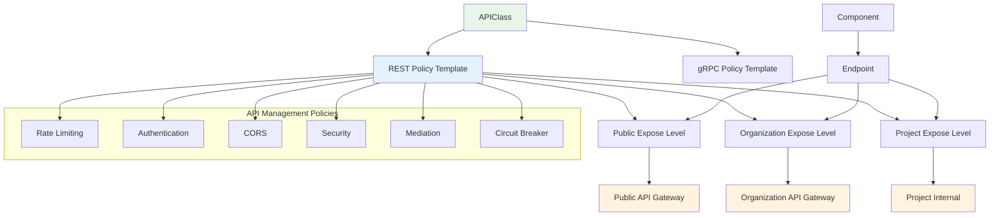

# APIClass CRD Design

The APIClass CRD defines reusable API management policies that can be applied to API endpoints in OpenChoreo. It provides a centralized way to configure authentication, rate limiting, CORS, security, and other API governance policies across different expose levels.

## Purpose

The APIClass controller is responsible for defining and managing API management policies that can be referenced by API endpoints. It provides a template-based approach to API governance, allowing organizations to standardize API behavior across multiple components and environments.

## Architecture Flow

The APIClass works in conjunction with endpoint definitions to provide comprehensive API management capabilities.



**Flow Explanation:**

1. **APIClass Definition**: Platform administrators create APIClass resources that define standard API management policies
2. **Policy Templates**: APIClass provides templates for REST and gRPC API policies with different configurations per expose level
3. **Endpoint Integration**: Components reference APIClass policies through their endpoint definitions
4. **Expose Level Application**: Different policies can be applied based on the network visibility level (public, organization, project)
5. **Gateway Configuration**: API management policies are applied to the appropriate API gateways based on the expose level

## Key Features

### Multi-Protocol Support

- **REST APIs**: Comprehensive support for REST API management with OpenAPI integration
- **gRPC APIs**: Extensible support for gRPC-specific policies (future implementation)
- **Protocol-Specific Policies**: Different policy sets for different API protocols

### Expose Level Policies

- **Default Policies**: Base policies that apply to all expose levels
- **Public Override**: Specific policies for publicly exposed APIs
- **Organization Override**: Policies for organization-internal APIs
- **Hierarchical Application**: Override policies inherit from defaults where not specified

### Comprehensive Policy Coverage

- **Rate Limiting**: Configurable request rate limits with flexible time windows
- **Authentication**: Multiple authentication methods (JWT, API Key, OAuth2, Basic)
- **CORS**: Cross-Origin Resource Sharing configuration
- **Security**: IP allowlisting/blocklisting, TLS requirements
- **Mediation**: Request/response transformation capabilities
- **Circuit Breaker**: Circuit breaker configuration for resilience

## CRD Structure

### APIClassSpec

```go
type APIClassSpec struct {
    // REST API management policies
    RESTPolicy *RESTAPIPolicy `json:"restPolicy,omitempty"`

    // gRPC API management policies (future implementation)
    GRPCPolicy *GRPCAPIPolicy `json:"grpcPolicy,omitempty"`
}

type RESTAPIPolicy struct {
    // Default policies that apply to all expose levels
    Defaults *RESTPolicy `json:"defaults,omitempty"`

    // Override policies for public expose level
    Public *RESTPolicy `json:"public,omitempty"`

    // Override policies for organization expose level
    Organization *RESTPolicy `json:"organization,omitempty"`
}
```

### REST Policy Configuration

```go
type RESTPolicy struct {
    // Rate limiting configuration
    RateLimit *RateLimitPolicy `json:"rateLimit,omitempty"`

    // Authentication and authorization configuration
    Authentication *AuthenticationPolicy `json:"authentication,omitempty"`

    // CORS configuration
    CORS *CORSPolicy `json:"cors,omitempty"`

    // Security policies
    Security *SecurityPolicy `json:"security,omitempty"`

    // Request and response mediation/transformation
    Mediation *MediationPolicy `json:"mediation,omitempty"`

    // Circuit breaker configuration
    CircuitBreaker *CircuitBreakerPolicy `json:"circuitBreaker,omitempty"`
}
```

### Rate Limiting Policy

```go
type RateLimitPolicy struct {
    // Number of requests allowed
    Requests int64 `json:"requests"`

    // Time window (e.g., "1m", "1h", "30s", "1d")
    Window string `json:"window"`
}
```

### Authentication Policy

```go
type AuthenticationPolicy struct {
    // Authentication type: jwt | apikey | oauth2 | basic
    Type string `json:"type"`

    // JWT authentication configuration
    JWT *JWTAuthConfig `json:"jwt,omitempty"`

    // API Key authentication configuration
    APIKey *APIKeyAuthConfig `json:"apikey,omitempty"`

    // OAuth2 authentication configuration
    OAuth2 *OAuth2AuthConfig `json:"oauth2,omitempty"`
}

type JWTAuthConfig struct {
    // JSON Web Key Set URL
    JWKS string `json:"jwks"`

    // JWT issuer
    Issuer string `json:"issuer"`

    // Expected audience values
    Audience []string `json:"audience,omitempty"`
}

type APIKeyAuthConfig struct {
    // Header name for API key
    Header *string `json:"header,omitempty"`

    // Query parameter name for API key
    QueryParam *string `json:"queryParam,omitempty"`
}

type OAuth2AuthConfig struct {
    // OAuth2 token URL
    TokenURL string `json:"tokenUrl"`

    // Required OAuth2 scopes
    Scopes []string `json:"scopes,omitempty"`
}
```

### CORS Policy

```go
type CORSPolicy struct {
    // Allowed origins
    AllowOrigins []string `json:"allowOrigins,omitempty"`

    // Allowed HTTP methods
    AllowMethods []string `json:"allowMethods,omitempty"`

    // Allowed headers
    AllowHeaders []string `json:"allowHeaders,omitempty"`

    // Headers to expose to the client
    ExposeHeaders []string `json:"exposeHeaders,omitempty"`

    // Maximum age for preflight cache
    MaxAge *int64 `json:"maxAge,omitempty"`
}
```

### Security Policy

```go
type SecurityPolicy struct {
    // IP addresses allowed to access the API
    AllowedIPs []string `json:"allowedIPs,omitempty"`

    // IP addresses blocked from accessing the API
    BlockedIPs []string `json:"blockedIPs,omitempty"`

    // Whether TLS is required
    RequireTLS *bool `json:"requireTLS,omitempty"`

    // Minimum TLS version required
    MinTLSVersion *string `json:"minTLSVersion,omitempty"`
}
```

### Mediation Policy

```go
type MediationPolicy struct {
    // Request transformation rules
    RequestTransformations []TransformationRule `json:"requestTransformations,omitempty"`

    // Response transformation rules
    ResponseTransformations []TransformationRule `json:"responseTransformations,omitempty"`
}

type TransformationRule struct {
    // Transformation type: json | xml
    Type string `json:"type"`

    // Transformation action: addFields | addHeader | removeHeaders | removeFields
    Action string `json:"action"`

    // Fields to transform
    Fields map[string]string `json:"fields,omitempty"`

    // Headers to transform
    Headers []string `json:"headers,omitempty"`

    // Header name for add operations
    HeaderName *string `json:"headerName,omitempty"`

    // Header value for add operations
    HeaderValue *string `json:"headerValue,omitempty"`
}
```

### Circuit Breaker Policy

```go
type CircuitBreakerPolicy struct {
    // Whether circuit breaker is enabled
    Enabled bool `json:"enabled"`

    // Maximum number of connections
    MaxConnections *int32 `json:"maxConnections,omitempty"`

    // Maximum number of pending requests
    MaxPendingRequests *int32 `json:"maxPendingRequests,omitempty"`

    // Maximum number of parallel requests
    MaxParallelRequests *int32 `json:"maxParallelRequests,omitempty"`

    // Maximum number of parallel retries
    MaxParallelRetries *int32 `json:"maxParallelRetries,omitempty"`
}
```

## Usage Patterns

### Basic APIClass Example

```yaml
apiVersion: openchoreo.dev/v1alpha1
kind: APIClass
metadata:
  name: standard-api
  namespace: my-org
  annotations:
    openchoreo.dev/display-name: Standard API Policy
    openchoreo.dev/description: Standard API management policies for REST APIs
  labels:
    openchoreo.dev/organization: my-org
spec:
  restPolicy:
    defaults:
      rateLimit:
        requests: 1000
        window: "1h"
      authentication:
        type: "jwt"
        jwt:
          jwks: "https://auth.example.com/.well-known/jwks.json"
          issuer: "https://auth.example.com"
          audience: ["api.example.com"]
      cors:
        allowOrigins: ["*"]
        allowMethods: ["GET", "POST", "PUT", "DELETE"]
        allowHeaders: ["Content-Type", "Authorization"]
        maxAge: 86400
      security:
        requireTLS: true
        minTLSVersion: "1.2"
    public:
      rateLimit:
        requests: 500
        window: "1h"
      authentication:
        type: "apikey"
        apikey:
          header: "X-API-Key"
    organization:
      rateLimit:
        requests: 2000
        window: "1h"
      cors:
        allowOrigins: ["https://internal.example.com"]
```

### Advanced APIClass with Mediation

```yaml
apiVersion: openchoreo.dev/v1alpha1
kind: APIClass
metadata:
  name: enterprise-api
  namespace: my-org
spec:
  restPolicy:
    defaults:
      rateLimit:
        requests: 5000
        window: "1h"
      authentication:
        type: "oauth2"
        oauth2:
          tokenUrl: "https://auth.example.com/oauth/token"
          scopes: ["read", "write"]
      security:
        allowedIPs: ["10.0.0.0/8", "172.16.0.0/12"]
        requireTLS: true
        minTLSVersion: "1.3"
      mediation:
        requestTransformations:
          - type: "json"
            action: "addHeader"
            headerName: "X-Request-ID"
            headerValue: "${uuid()}"
          - type: "json"
            action: "addFields"
            fields:
              "metadata.timestamp": "${timestamp()}"
              "metadata.source": "api-gateway"
        responseTransformations:
          - type: "json"
            action: "removeFields"
            fields:
              "internal_id": ""
              "debug_info": ""
      circuitBreaker:
        enabled: true
        maxConnections: 100
        maxPendingRequests: 50
        maxParallelRequests: 200
    public:
      rateLimit:
        requests: 1000
        window: "1h"
      security:
        allowedIPs: [] # Remove IP restrictions for public
      mediation:
        responseTransformations:
          - type: "json"
            action: "removeFields"
            fields:
              "internal_id": ""
              "debug_info": ""
              "user_email": "" # Additional privacy for public APIs
```

### Multi-Authentication APIClass

```yaml
apiVersion: openchoreo.dev/v1alpha1
kind: APIClass
metadata:
  name: flexible-auth-api
  namespace: my-org
spec:
  restPolicy:
    defaults:
      rateLimit:
        requests: 2000
        window: "1h"
      cors:
        allowOrigins: ["*"]
        allowMethods: ["GET", "POST", "PUT", "DELETE", "PATCH"]
        allowHeaders: ["Content-Type", "Authorization", "X-API-Key"]
    public:
      authentication:
        type: "apikey"
        apikey:
          header: "X-API-Key"
          queryParam: "api_key"
      rateLimit:
        requests: 1000
        window: "1h"
    organization:
      authentication:
        type: "jwt"
        jwt:
          jwks: "https://org-auth.example.com/.well-known/jwks.json"
          issuer: "https://org-auth.example.com"
          audience: ["internal-api"]
      rateLimit:
        requests: 5000
        window: "1h"
      cors:
        allowOrigins: ["https://*.example.com"]
```

## Integration with Endpoints

APIClass policies are applied to endpoints through the endpoint's network visibility configuration:

```yaml
apiVersion: openchoreo.dev/v1alpha1
kind: Endpoint
metadata:
  name: user-api
spec:
  type: REST
  service:
    port: 8080
    basePath: "/api/v1"
  # Reference to APIClass
  apiClassRef: "standard-api"
  networkVisibilities:
    organization:
      enabled: true
      # APIClass organization policies will be applied
    external:
      enabled: true
      # APIClass public policies will be applied
```

## Policy Inheritance and Override

### Inheritance Hierarchy

1. **APIClass Default Policies**: Base policies applied to all expose levels
2. **APIClass Expose Level Policies**: Override policies for specific expose levels (public, organization)
3. **Endpoint-Specific Overrides**: Final overrides defined directly in the endpoint specification

### Override Behavior

- **Complete Override**: When an expose level policy is defined, it completely overrides the default policy for that section
- **Additive for Lists**: For list-type fields (e.g., `allowedIPs`, `scopes`), the expose level policy replaces the entire list
- **Null Override**: Setting a policy section to `null` removes that policy type for the specific expose level

### Example Override Pattern

```yaml
apiVersion: openchoreo.dev/v1alpha1
kind: APIClass
metadata:
  name: tiered-api
spec:
  restPolicy:
    defaults:
      rateLimit:
        requests: 1000
        window: "1h"
      authentication:
        type: "jwt"
        jwt:
          jwks: "https://auth.example.com/.well-known/jwks.json"
          issuer: "https://auth.example.com"
      security:
        allowedIPs: ["10.0.0.0/8"]
        requireTLS: true
    public:
      rateLimit:
        requests: 100 # More restrictive for public
        window: "1h"
      authentication:
        type: "apikey" # Different auth for public
        apikey:
          header: "X-API-Key"
      security:
        allowedIPs: [] # Remove IP restrictions for public
        requireTLS: true # Keep TLS requirement
    organization:
      rateLimit:
        requests: 5000 # More generous for organization
        window: "1h"
      # Authentication and security inherit from defaults
```

## Design Benefits

### Centralized Policy Management

- **Reusability**: Single APIClass can be used across multiple endpoints and components
- **Consistency**: Ensures consistent API behavior across the organization
- **Governance**: Centralized control over API management policies

### Flexibility

- **Expose Level Differentiation**: Different policies for different network visibility levels
- **Protocol Support**: Extensible to support multiple API protocols
- **Override Capability**: Fine-grained control through inheritance and override mechanisms

### Operational Efficiency

- **Template-Based**: Reduces duplication and configuration overhead
- **Standardization**: Promotes best practices and organizational standards
- **Maintainability**: Changes to policies can be applied organization-wide through APIClass updates

## Implementation Details

### Controller Location

- **CRD Definition**: [`api/v1alpha1/apiclass_types.go`](../../api/v1alpha1/apiclass_types.go)
- **Controller**: To be implemented in `internal/controller/apiclass/`

### Key Dependencies

- **Endpoint Controller**: For applying APIClass policies to endpoints
- **API Gateway Integration**: For enforcing policies at the gateway level
- **Organization Management**: For scoping APIClass resources

### Configuration

- **Scope**: Namespaced resource (organization-scoped)
- **Labels**: `openchoreo.dev/organization` for organization association
- **Integration**: Referenced by endpoint `apiClassRef` field

## Future Enhancements

### gRPC Support

The APIClass is designed to support gRPC-specific policies through the `GRPCPolicy` field:

```go
type GRPCAPIPolicy struct {
    // Future gRPC-specific policies
    Authentication *GRPCAuthenticationPolicy `json:"authentication,omitempty"`
    RateLimit      *RateLimitPolicy         `json:"rateLimit,omitempty"`
    // Additional gRPC policies
}
```

### Advanced Mediation

- **Lua Scripting**: Support for custom transformation scripts
- **External Service Integration**: Callouts to external services for transformation
- **Content-Type Specific Transformations**: Different transformation rules based on content type

### Policy Validation

- **Schema Validation**: Validate APIClass policies against organizational schemas
- **Conflict Detection**: Detect and prevent conflicting policies
- **Testing Framework**: Simulate policy application for testing and validation
