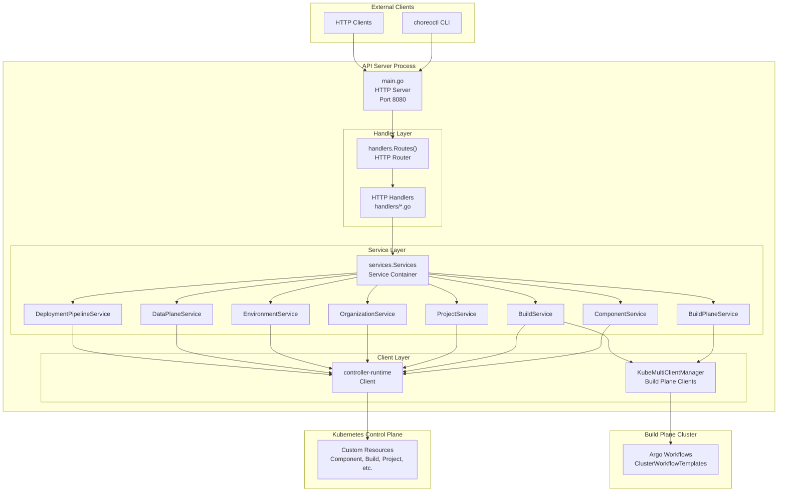
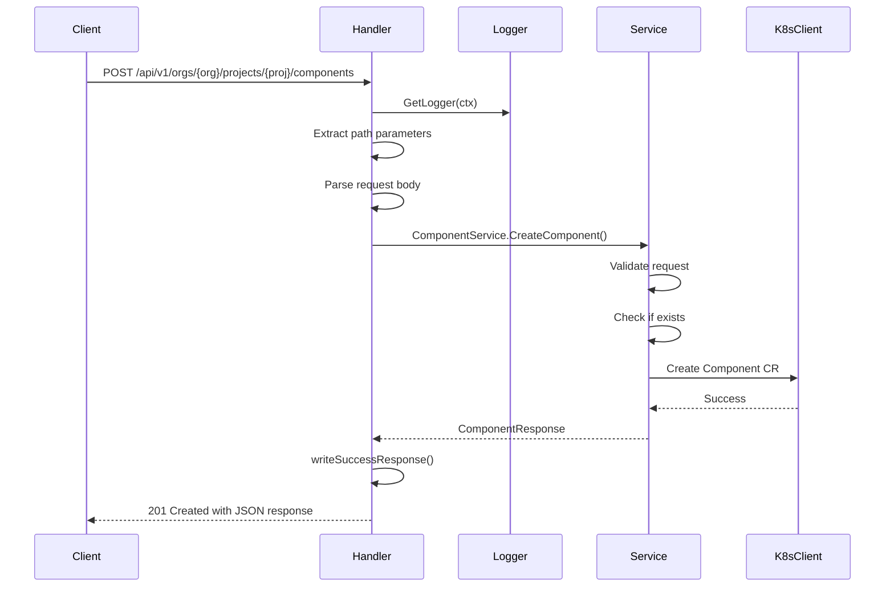
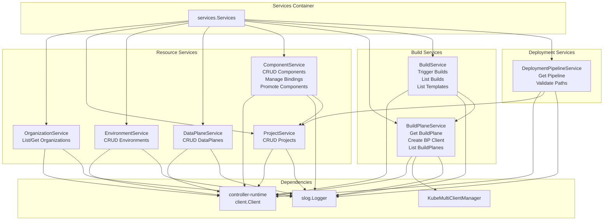
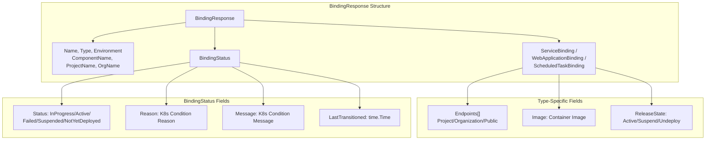
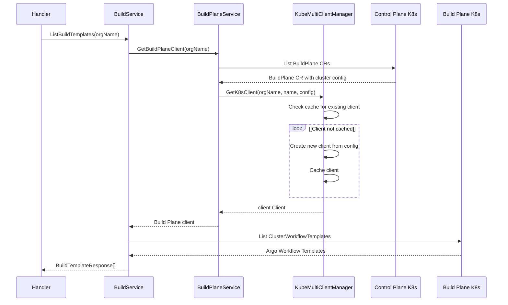
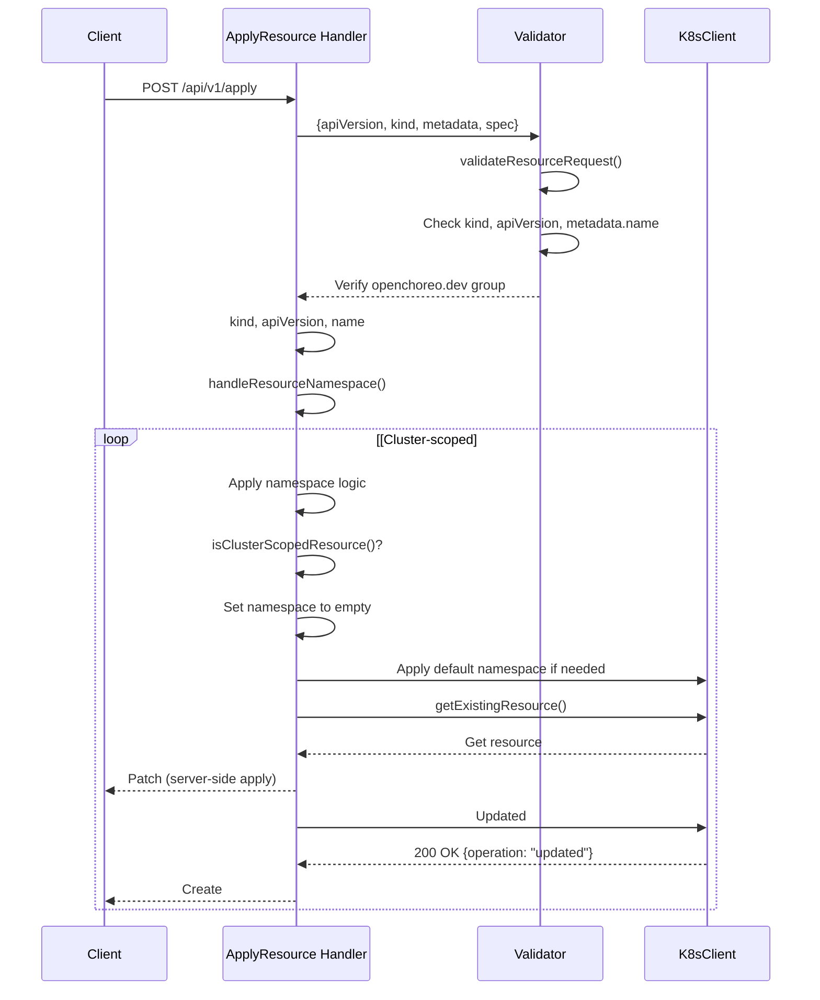
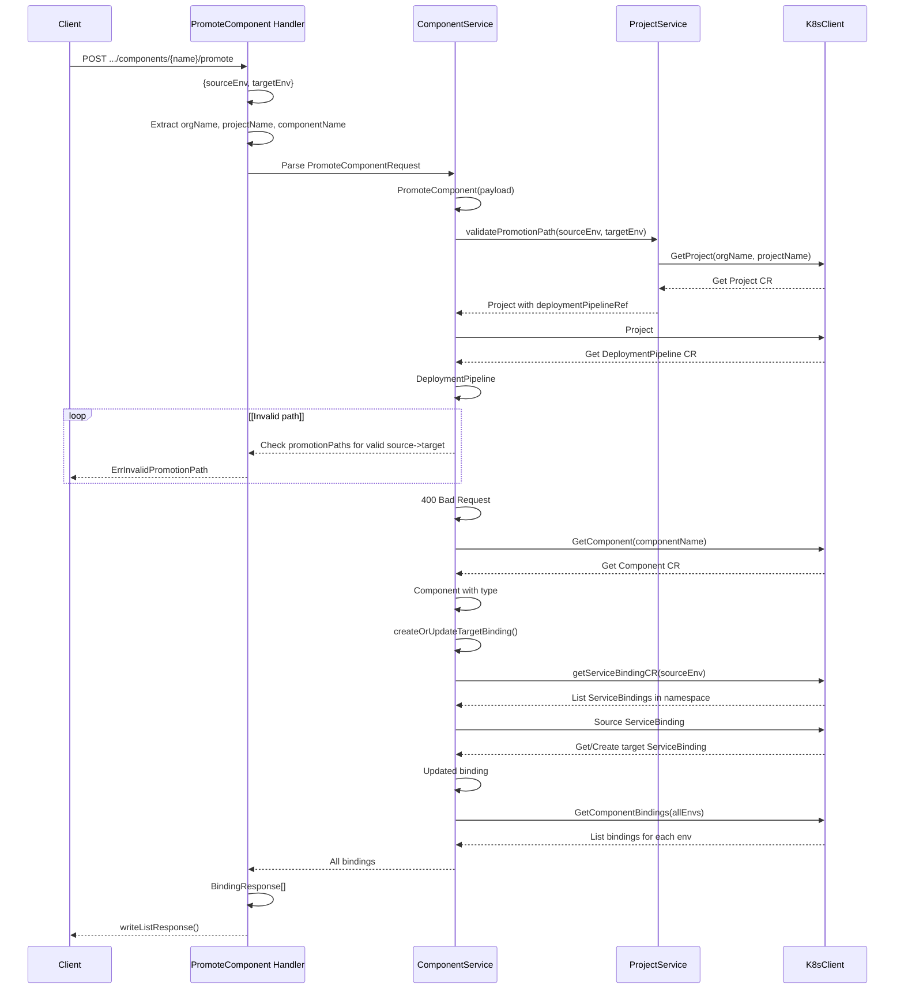

# API Server Architecture

> **Relevant source files**
> * [cmd/openchoreo-api/main.go](https://github.com/openchoreo/openchoreo/blob/a577e969/cmd/openchoreo-api/main.go)
> * [internal/choreoctl/resources/kinds/dataplane.go](https://github.com/openchoreo/openchoreo/blob/a577e969/internal/choreoctl/resources/kinds/dataplane.go)
> * [internal/openchoreo-api/clients/k8s.go](https://github.com/openchoreo/openchoreo/blob/a577e969/internal/openchoreo-api/clients/k8s.go)
> * [internal/openchoreo-api/handlers/apply.go](https://github.com/openchoreo/openchoreo/blob/a577e969/internal/openchoreo-api/handlers/apply.go)
> * [internal/openchoreo-api/handlers/buildplanes.go](https://github.com/openchoreo/openchoreo/blob/a577e969/internal/openchoreo-api/handlers/buildplanes.go)
> * [internal/openchoreo-api/handlers/builds.go](https://github.com/openchoreo/openchoreo/blob/a577e969/internal/openchoreo-api/handlers/builds.go)
> * [internal/openchoreo-api/handlers/components.go](https://github.com/openchoreo/openchoreo/blob/a577e969/internal/openchoreo-api/handlers/components.go)
> * [internal/openchoreo-api/handlers/dataplanes.go](https://github.com/openchoreo/openchoreo/blob/a577e969/internal/openchoreo-api/handlers/dataplanes.go)
> * [internal/openchoreo-api/handlers/environments.go](https://github.com/openchoreo/openchoreo/blob/a577e969/internal/openchoreo-api/handlers/environments.go)
> * [internal/openchoreo-api/handlers/handlers.go](https://github.com/openchoreo/openchoreo/blob/a577e969/internal/openchoreo-api/handlers/handlers.go)
> * [internal/openchoreo-api/handlers/helpers.go](https://github.com/openchoreo/openchoreo/blob/a577e969/internal/openchoreo-api/handlers/helpers.go)
> * [internal/openchoreo-api/handlers/organizations.go](https://github.com/openchoreo/openchoreo/blob/a577e969/internal/openchoreo-api/handlers/organizations.go)
> * [internal/openchoreo-api/handlers/workloads.go](https://github.com/openchoreo/openchoreo/blob/a577e969/internal/openchoreo-api/handlers/workloads.go)
> * [internal/openchoreo-api/models/request.go](https://github.com/openchoreo/openchoreo/blob/a577e969/internal/openchoreo-api/models/request.go)
> * [internal/openchoreo-api/models/response.go](https://github.com/openchoreo/openchoreo/blob/a577e969/internal/openchoreo-api/models/response.go)
> * [internal/openchoreo-api/services/build_service.go](https://github.com/openchoreo/openchoreo/blob/a577e969/internal/openchoreo-api/services/build_service.go)
> * [internal/openchoreo-api/services/buildplane_service.go](https://github.com/openchoreo/openchoreo/blob/a577e969/internal/openchoreo-api/services/buildplane_service.go)
> * [internal/openchoreo-api/services/component_service.go](https://github.com/openchoreo/openchoreo/blob/a577e969/internal/openchoreo-api/services/component_service.go)
> * [internal/openchoreo-api/services/dataplane_service.go](https://github.com/openchoreo/openchoreo/blob/a577e969/internal/openchoreo-api/services/dataplane_service.go)
> * [internal/openchoreo-api/services/environment_service.go](https://github.com/openchoreo/openchoreo/blob/a577e969/internal/openchoreo-api/services/environment_service.go)
> * [internal/openchoreo-api/services/errors.go](https://github.com/openchoreo/openchoreo/blob/a577e969/internal/openchoreo-api/services/errors.go)
> * [internal/openchoreo-api/services/organization_service.go](https://github.com/openchoreo/openchoreo/blob/a577e969/internal/openchoreo-api/services/organization_service.go)
> * [internal/openchoreo-api/services/project_service.go](https://github.com/openchoreo/openchoreo/blob/a577e969/internal/openchoreo-api/services/project_service.go)
> * [internal/openchoreo-api/services/services.go](https://github.com/openchoreo/openchoreo/blob/a577e969/internal/openchoreo-api/services/services.go)

## Purpose and Scope

This document describes the architecture of the OpenChoreo API Server, an HTTP REST service that provides programmatic access to OpenChoreo platform resources. The API Server acts as an abstraction layer over Kubernetes Custom Resources, translating HTTP requests into Kubernetes API operations. It is the primary interface used by the `choreoctl` CLI and external clients to interact with the OpenChoreo control plane.

For information about the underlying Custom Resources managed by this API, see [Custom Resources](/openchoreo/openchoreo/6-custom-resources). For details on the controller manager that reconciles these resources, see [Controller Manager](/openchoreo/openchoreo/2.4-controller-manager).

## Architecture Overview

The API Server follows a layered architecture with clear separation of concerns:



**Sources:** [cmd/openchoreo-api/main.go L1-L81](https://github.com/openchoreo/openchoreo/blob/a577e969/cmd/openchoreo-api/main.go#L1-L81)

 [internal/openchoreo-api/handlers/handlers.go L1-L109](https://github.com/openchoreo/openchoreo/blob/a577e969/internal/openchoreo-api/handlers/handlers.go#L1-L109)

 [internal/openchoreo-api/services/services.go L1-L68](https://github.com/openchoreo/openchoreo/blob/a577e969/internal/openchoreo-api/services/services.go#L1-L68)

The API Server is structured as a standard Go HTTP service with three primary layers:

| Layer | Package | Responsibility |
| --- | --- | --- |
| **Handler** | `internal/openchoreo-api/handlers` | HTTP request routing, parameter extraction, response formatting |
| **Service** | `internal/openchoreo-api/services` | Business logic, validation, orchestration across multiple resources |
| **Client** | `internal/openchoreo-api/clients` | Kubernetes API client initialization and management |

## Server Initialization and Lifecycle

The API server is initialized in [cmd/openchoreo-api/main.go L28-L80](https://github.com/openchoreo/openchoreo/blob/a577e969/cmd/openchoreo-api/main.go#L28-L80)

 The startup sequence is:

1. **Flag Parsing**: Server configuration (port) is read from command-line flags [cmd/openchoreo-api/main.go L29](https://github.com/openchoreo/openchoreo/blob/a577e969/cmd/openchoreo-api/main.go#L29-L29)
2. **Logger Setup**: JSON-formatted structured logging is initialized [cmd/openchoreo-api/main.go L31-L33](https://github.com/openchoreo/openchoreo/blob/a577e969/cmd/openchoreo-api/main.go#L31-L33)
3. **Kubernetes Client**: A controller-runtime client is created for the control plane cluster [cmd/openchoreo-api/main.go L39-L43](https://github.com/openchoreo/openchoreo/blob/a577e969/cmd/openchoreo-api/main.go#L39-L43)
4. **Service Initialization**: All service layer components are instantiated [cmd/openchoreo-api/main.go L46](https://github.com/openchoreo/openchoreo/blob/a577e969/cmd/openchoreo-api/main.go#L46-L46)
5. **Handler Setup**: HTTP routes are registered with handlers [cmd/openchoreo-api/main.go L49](https://github.com/openchoreo/openchoreo/blob/a577e969/cmd/openchoreo-api/main.go#L49-L49)
6. **Server Start**: The HTTP server begins listening on the configured port [cmd/openchoreo-api/main.go L51-L66](https://github.com/openchoreo/openchoreo/blob/a577e969/cmd/openchoreo-api/main.go#L51-L66)
7. **Graceful Shutdown**: Signal handling enables clean shutdown with a 30-second timeout [cmd/openchoreo-api/main.go L69-L79](https://github.com/openchoreo/openchoreo/blob/a577e969/cmd/openchoreo-api/main.go#L69-L79)

**Sources:** [cmd/openchoreo-api/main.go L28-L80](https://github.com/openchoreo/openchoreo/blob/a577e969/cmd/openchoreo-api/main.go#L28-L80)

## HTTP Handler Layer

### Route Structure

The API follows RESTful conventions with hierarchical URLs reflecting the resource ownership model. All routes are prefixed with `/api/v1` for versioning.

```mermaid
flowchart TD

Routes["Handler.Routes()"]
Mux["http.ServeMux"]
Health["/health"]
Ready["/ready"]
ListOrgs["/api/v1/orgs"]
GetOrg["/api/v1/orgs/{orgName}"]
ListDP["/api/v1/orgs/{orgName}/dataplanes"]
CreateDP["POST /api/v1/orgs/{orgName}/dataplanes"]
GetDP["/api/v1/orgs/{orgName}/dataplanes/{dpName}"]
ListEnv["/api/v1/orgs/{orgName}/environments"]
CreateEnv["POST /api/v1/orgs/{orgName}/environments"]
GetEnv["/api/v1/orgs/{orgName}/environments/{envName}"]
ListProj["/api/v1/orgs/{orgName}/projects"]
CreateProj["POST /api/v1/orgs/{orgName}/projects"]
GetProj["/api/v1/orgs/{orgName}/projects/{projectName}"]
GetPipeline["/api/v1/orgs/{orgName}/projects/{projectName}/deployment-pipeline"]
ListComp["/api/v1/orgs/{orgName}/projects/{projectName}/components"]
CreateComp["POST .../components"]
GetComp["GET .../components/{componentName}"]
GetBindings["GET .../components/{componentName}/bindings"]
UpdateBinding["PATCH .../bindings/{bindingName}"]
Promote["POST .../components/{componentName}/promote"]
ListTemplates["/api/v1/orgs/{orgName}/build-templates"]
TriggerBuild["POST .../components/{componentName}/builds"]
ListBuilds["GET .../components/{componentName}/builds"]
Apply["POST /api/v1/apply"]
Delete["DELETE /api/v1/delete"]

Mux --> Health
Mux --> Ready
Mux --> ListOrgs
Mux --> GetOrg
Mux --> ListDP
Mux --> CreateDP
Mux --> GetDP
Mux --> ListEnv
Mux --> CreateEnv
Mux --> GetEnv
Mux --> ListProj
Mux --> CreateProj
Mux --> GetProj
Mux --> GetPipeline
Mux --> ListComp
Mux --> CreateComp
Mux --> GetComp
Mux --> GetBindings
Mux --> UpdateBinding
Mux --> Promote
Mux --> ListTemplates
Mux --> TriggerBuild
Mux --> ListBuilds
Mux --> Apply
Mux --> Delete

subgraph subGraph8 ["Generic Operations"]
    Apply
    Delete
end

subgraph subGraph7 ["Build Resources"]
    ListTemplates
    TriggerBuild
    ListBuilds
end

subgraph subGraph6 ["Component Resources"]
    ListComp
    CreateComp
    GetComp
    GetBindings
    UpdateBinding
    Promote
end

subgraph subGraph5 ["Project Resources"]
    ListProj
    CreateProj
    GetProj
    GetPipeline
end

subgraph subGraph4 ["Environment Resources"]
    ListEnv
    CreateEnv
    GetEnv
end

subgraph subGraph3 ["DataPlane Resources"]
    ListDP
    CreateDP
    GetDP
end

subgraph subGraph2 ["Organization Resources"]
    ListOrgs
    GetOrg
end

subgraph subGraph1 ["Health Endpoints"]
    Health
    Ready
end

subgraph subGraph0 ["Route Registration"]
    Routes
    Mux
    Routes --> Mux
end
```



**Sources:** [internal/openchoreo-api/handlers/handlers.go L29-L95](https://github.com/openchoreo/openchoreo/blob/a577e969/internal/openchoreo-api/handlers/handlers.go#L29-L95)

The complete route table is defined in [internal/openchoreo-api/handlers/handlers.go L29-L95](https://github.com/openchoreo/openchoreo/blob/a577e969/internal/openchoreo-api/handlers/handlers.go#L29-L95)

 Routes follow a consistent pattern:

* **Collection resources**: `GET /orgs/{orgName}/projects` lists all projects
* **Individual resources**: `GET /orgs/{orgName}/projects/{projectName}` retrieves a specific project
* **Creation**: `POST /orgs/{orgName}/projects` creates a new project
* **Nested resources**: `/orgs/{orgName}/projects/{projectName}/components` represents ownership hierarchy

### Handler Implementation Pattern

All handlers follow a consistent implementation pattern demonstrated in [internal/openchoreo-api/handlers/components.go L17-L61](https://github.com/openchoreo/openchoreo/blob/a577e969/internal/openchoreo-api/handlers/components.go#L17-L61)

:



**Sources:** [internal/openchoreo-api/handlers/components.go L17-L61](https://github.com/openchoreo/openchoreo/blob/a577e969/internal/openchoreo-api/handlers/components.go#L17-L61)

The standard handler flow is:

1. **Context and Logger**: Extract logger from request context [internal/openchoreo-api/handlers/components.go L18-L20](https://github.com/openchoreo/openchoreo/blob/a577e969/internal/openchoreo-api/handlers/components.go#L18-L20)
2. **Parameter Extraction**: Read path parameters using `r.PathValue()` [internal/openchoreo-api/handlers/components.go L23-L29](https://github.com/openchoreo/openchoreo/blob/a577e969/internal/openchoreo-api/handlers/components.go#L23-L29)
3. **Request Parsing**: Decode JSON body into request model [internal/openchoreo-api/handlers/components.go L32-L38](https://github.com/openchoreo/openchoreo/blob/a577e969/internal/openchoreo-api/handlers/components.go#L32-L38)
4. **Service Invocation**: Call appropriate service method with context and parameters [internal/openchoreo-api/handlers/components.go L41](https://github.com/openchoreo/openchoreo/blob/a577e969/internal/openchoreo-api/handlers/components.go#L41-L41)
5. **Error Handling**: Map service errors to HTTP status codes [internal/openchoreo-api/handlers/components.go L42-L56](https://github.com/openchoreo/openchoreo/blob/a577e969/internal/openchoreo-api/handlers/components.go#L42-L56)
6. **Response Writing**: Format response using helper functions [internal/openchoreo-api/handlers/components.go L60](https://github.com/openchoreo/openchoreo/blob/a577e969/internal/openchoreo-api/handlers/components.go#L60-L60)

### Response Formatting

The API uses standardized response wrappers defined in [internal/openchoreo-api/models/response.go L12-L18](https://github.com/openchoreo/openchoreo/blob/a577e969/internal/openchoreo-api/models/response.go#L12-L18)

:

**Success Response Structure:**

```
{
  "success": true,
  "data": <resource object>
}
```

**Error Response Structure:**

```json
{
  "success": false,
  "error": "error message",
  "code": "ERROR_CODE"
}
```

**List Response Structure:**

```
{
  "success": true,
  "data": {
    "items": [<resource objects>],
    "totalCount": 10,
    "page": 1,
    "pageSize": 10
  }
}
```

Helper functions in [internal/openchoreo-api/handlers/helpers.go L1-L39](https://github.com/openchoreo/openchoreo/blob/a577e969/internal/openchoreo-api/handlers/helpers.go#L1-L39)

 ensure consistent formatting across all endpoints.

**Sources:** [internal/openchoreo-api/models/response.go L12-L26](https://github.com/openchoreo/openchoreo/blob/a577e969/internal/openchoreo-api/models/response.go#L12-L26)

 [internal/openchoreo-api/handlers/helpers.go L13-L38](https://github.com/openchoreo/openchoreo/blob/a577e969/internal/openchoreo-api/handlers/helpers.go#L13-L38)

## Service Layer Architecture

The service layer encapsulates business logic and orchestrates operations across multiple Kubernetes resources. Services are organized by domain and initialized together in a container.



**Sources:** [internal/openchoreo-api/services/services.go L13-L62](https://github.com/openchoreo/openchoreo/blob/a577e969/internal/openchoreo-api/services/services.go#L13-L62)

### Service Initialization

Services are initialized in [internal/openchoreo-api/services/services.go L26-L62](https://github.com/openchoreo/openchoreo/blob/a577e969/internal/openchoreo-api/services/services.go#L26-L62)

 with dependency injection:

| Service | Dependencies | Purpose |
| --- | --- | --- |
| `OrganizationService` | k8sClient, logger | List and retrieve Organization CRs |
| `ProjectService` | k8sClient, logger | CRUD operations on Project CRs |
| `EnvironmentService` | k8sClient, logger | CRUD operations on Environment CRs |
| `DataPlaneService` | k8sClient, logger | CRUD operations on DataPlane CRs |
| `ComponentService` | k8sClient, ProjectService, logger | CRUD Components, manage bindings, promote across environments |
| `BuildPlaneService` | k8sClient, KubeMultiClientManager, logger | Access BuildPlane cluster for workflow templates |
| `BuildService` | k8sClient, BuildPlaneService, KubeMultiClientManager, logger | Trigger and list builds |
| `DeploymentPipelineService` | k8sClient, ProjectService, logger | Retrieve and validate deployment pipelines |

**Sources:** [internal/openchoreo-api/services/services.go L26-L62](https://github.com/openchoreo/openchoreo/blob/a577e969/internal/openchoreo-api/services/services.go#L26-L62)

### Service Implementation Pattern

Services implement a consistent pattern for interacting with Kubernetes resources. Example from [internal/openchoreo-api/services/project_service.go L20-L33](https://github.com/openchoreo/openchoreo/blob/a577e969/internal/openchoreo-api/services/project_service.go#L20-L33)

:

```go
type ProjectService struct {
    k8sClient client.Client
    logger    *slog.Logger
}

func NewProjectService(k8sClient client.Client, logger *slog.Logger) *ProjectService {
    return &ProjectService{
        k8sClient: k8sClient,
        logger:    logger,
    }
}
```

**Common Service Operations:**

1. **List**: Query all resources in a namespace using `List()` with label selectors
2. **Get**: Retrieve a specific resource by name using `Get()` with ObjectKey
3. **Create**: Build CR from request model and use `Create()`
4. **Exists Check**: Use `Get()` with `IgnoreNotFound()` error handling
5. **Response Conversion**: Transform CRs to API response models

**Sources:** [internal/openchoreo-api/services/project_service.go L20-L33](https://github.com/openchoreo/openchoreo/blob/a577e969/internal/openchoreo-api/services/project_service.go#L20-L33)

 [internal/openchoreo-api/services/project_service.go L86-L106](https://github.com/openchoreo/openchoreo/blob/a577e969/internal/openchoreo-api/services/project_service.go#L86-L106)

### ComponentService: Complex Business Logic

The `ComponentService` is the most complex service, handling component lifecycle across environments. It demonstrates advanced patterns:

```mermaid
flowchart TD

CreateComp["CreateComponent()<br>Create Component CR"]
ListComp["ListComponents()<br>List by Project"]
GetComp["GetComponent()<br>Get with optional Type/Workload"]
GetBindings["GetComponentBindings()<br>Retrieve across environments"]
GetBinding["GetComponentBinding()<br>Get single environment"]
Promote["PromoteComponent()<br>Copy binding to target env"]
Update["UpdateComponentBinding()<br>Update release state"]
GetServiceBinding["getServiceBinding()<br>Get ServiceBinding CR"]
GetWebAppBinding["getWebApplicationBinding()<br>Get WebApplicationBinding CR"]
GetScheduledTaskBinding["getScheduledTaskBinding()<br>Get ScheduledTaskBinding CR"]
CreateServiceBinding["createOrUpdateServiceBinding()"]
CreateWebAppBinding["createOrUpdateWebApplicationBinding()"]
CreateScheduledTaskBinding["createOrUpdateScheduledTaskBinding()"]
ValidatePath["validatePromotionPath()<br>Check DeploymentPipeline"]
GetEnvs["getEnvironmentsFromDeploymentPipeline()"]
MapStatus["mapConditionToBindingStatus()<br>Map K8s condition to UI status"]
Registry["ComponentSpecFetcherRegistry"]
Fetchers["Type-specific Fetchers<br>Service, WebApp, Workload"]

GetComp --> Registry
GetBindings --> GetServiceBinding
GetBindings --> GetWebAppBinding
GetBindings --> GetScheduledTaskBinding
GetBindings --> GetEnvs
Promote --> ValidatePath
Promote --> CreateServiceBinding
Promote --> CreateWebAppBinding
Promote --> CreateScheduledTaskBinding
Update --> GetServiceBinding
Update --> GetWebAppBinding
Update --> GetScheduledTaskBinding

subgraph subGraph2 ["Registry Pattern"]
    Registry
    Fetchers
end

subgraph subGraph1 ["Helper Methods"]
    GetServiceBinding
    GetWebAppBinding
    GetScheduledTaskBinding
    CreateServiceBinding
    CreateWebAppBinding
    CreateScheduledTaskBinding
    ValidatePath
    GetEnvs
    MapStatus
    GetServiceBinding --> MapStatus
    GetWebAppBinding --> MapStatus
end

subgraph subGraph0 ["ComponentService Methods"]
    CreateComp
    ListComp
    GetComp
    GetBindings
    GetBinding
    Promote
    Update
end
```



**Sources:** [internal/openchoreo-api/services/component_service.go L27-L49](https://github.com/openchoreo/openchoreo/blob/a577e969/internal/openchoreo-api/services/component_service.go#L27-L49)

Key `ComponentService` responsibilities:

* **Component Creation**: [internal/openchoreo-api/services/component_service.go L53-L99](https://github.com/openchoreo/openchoreo/blob/a577e969/internal/openchoreo-api/services/component_service.go#L53-L99)  creates Component CRs with build configuration
* **Binding Retrieval**: [internal/openchoreo-api/services/component_service.go L364-L400](https://github.com/openchoreo/openchoreo/blob/a577e969/internal/openchoreo-api/services/component_service.go#L364-L400)  fetches bindings across multiple environments
* **Component Promotion**: [internal/openchoreo-api/services/component_service.go L660-L696](https://github.com/openchoreo/openchoreo/blob/a577e969/internal/openchoreo-api/services/component_service.go#L660-L696)  validates promotion paths and creates/updates target bindings
* **Binding Updates**: [internal/openchoreo-api/services/component_service.go L1018-L1122](https://github.com/openchoreo/openchoreo/blob/a577e969/internal/openchoreo-api/services/component_service.go#L1018-L1122)  manages release state transitions (Active/Suspend/Undeploy)
* **Status Mapping**: [internal/openchoreo-api/services/component_service.go L717-L737](https://github.com/openchoreo/openchoreo/blob/a577e969/internal/openchoreo-api/services/component_service.go#L717-L737)  translates Kubernetes conditions to user-friendly binding states

**Sources:** [internal/openchoreo-api/services/component_service.go L53-L99](https://github.com/openchoreo/openchoreo/blob/a577e969/internal/openchoreo-api/services/component_service.go#L53-L99)

 [internal/openchoreo-api/services/component_service.go L364-L400](https://github.com/openchoreo/openchoreo/blob/a577e969/internal/openchoreo-api/services/component_service.go#L364-L400)

 [internal/openchoreo-api/services/component_service.go L660-L696](https://github.com/openchoreo/openchoreo/blob/a577e969/internal/openchoreo-api/services/component_service.go#L660-L696)

## Request and Response Models

### Request Models

Request models define the API contract for creating resources. They provide validation and sanitization methods.

**Example from [internal/openchoreo-api/models/request.go L34-L41](https://github.com/openchoreo/openchoreo/blob/a577e969/internal/openchoreo-api/models/request.go#L34-L41)

:**

```
type CreateComponentRequest struct {
    Name        string      `json:"name"`
    DisplayName string      `json:"displayName,omitempty"`
    Description string      `json:"description,omitempty"`
    Type        string      `json:"type"`
    BuildConfig BuildConfig `json:"buildConfig,omitempty"`
}
```

Request models implement:

* `Validate()` - Validates request fields [internal/openchoreo-api/models/request.go L86-L89](https://github.com/openchoreo/openchoreo/blob/a577e969/internal/openchoreo-api/models/request.go#L86-L89)
* `Sanitize()` - Trims whitespace from string fields [internal/openchoreo-api/models/request.go L117-L123](https://github.com/openchoreo/openchoreo/blob/a577e969/internal/openchoreo-api/models/request.go#L117-L123)

**Sources:** [internal/openchoreo-api/models/request.go L34-L41](https://github.com/openchoreo/openchoreo/blob/a577e969/internal/openchoreo-api/models/request.go#L34-L41)

 [internal/openchoreo-api/models/request.go L86-L89](https://github.com/openchoreo/openchoreo/blob/a577e969/internal/openchoreo-api/models/request.go#L86-L89)

 [internal/openchoreo-api/models/request.go L117-L123](https://github.com/openchoreo/openchoreo/blob/a577e969/internal/openchoreo-api/models/request.go#L117-L123)

### Response Models

Response models provide consistent structure for API responses. They include computed fields like status and formatted timestamps.

**Example from [internal/openchoreo-api/models/response.go L39-L55](https://github.com/openchoreo/openchoreo/blob/a577e969/internal/openchoreo-api/models/response.go#L39-L55)

:**

```
type ComponentResponse struct {
    Name           string                                 `json:"name"`
    DisplayName    string                                 `json:"displayName,omitempty"`
    Description    string                                 `json:"description,omitempty"`
    Type           string                                 `json:"type"`
    ProjectName    string                                 `json:"projectName"`
    OrgName        string                                 `json:"orgName"`
    CreatedAt      time.Time                              `json:"createdAt"`
    Status         string                                 `json:"status,omitempty"`
    Service        *openchoreov1alpha1.ServiceSpec        `json:"service,omitempty"`
    WebApplication *openchoreov1alpha1.WebApplicationSpec `json:"webApplication,omitempty"`
    ScheduledTask  *openchoreov1alpha1.ScheduledTaskSpec  `json:"scheduledTask,omitempty"`
    API            *openchoreov1alpha1.APISpec            `json:"api,omitempty"`
    Workload       *openchoreov1alpha1.WorkloadSpec       `json:"workload,omitempty"`
    BuildConfig    *BuildConfig                           `json:"buildConfig,omitempty"`
}
```

Services convert Kubernetes CRs to response models using conversion methods like [internal/openchoreo-api/services/component_service.go L312-L362](https://github.com/openchoreo/openchoreo/blob/a577e969/internal/openchoreo-api/services/component_service.go#L312-L362)

**Sources:** [internal/openchoreo-api/models/response.go L39-L55](https://github.com/openchoreo/openchoreo/blob/a577e969/internal/openchoreo-api/models/response.go#L39-L55)

 [internal/openchoreo-api/services/component_service.go L312-L362](https://github.com/openchoreo/openchoreo/blob/a577e969/internal/openchoreo-api/services/component_service.go#L312-L362)

### Binding Response Model

The binding response model is particularly important as it represents the deployment state of components:



**Sources:** [internal/openchoreo-api/models/response.go L57-L119](https://github.com/openchoreo/openchoreo/blob/a577e969/internal/openchoreo-api/models/response.go#L57-L119)

The status mapping logic in [internal/openchoreo-api/services/component_service.go L717-L737](https://github.com/openchoreo/openchoreo/blob/a577e969/internal/openchoreo-api/services/component_service.go#L717-L737)

 translates Kubernetes condition types and reasons to user-friendly states:

| Condition Status | Condition Reason | Binding Status |
| --- | --- | --- |
| `True` | Any | `Active` |
| `False` | `ResourcesSuspended`, `ResourcesUndeployed` | `Suspended` |
| `False` | `ResourceHealthProgressing` | `InProgress` |
| `False` | `ResourceHealthDegraded`, `*ClassNotFound`, `*Failed` | `Failed` |
| Any | Unknown/Initial | `NotYetDeployed` |

**Sources:** [internal/openchoreo-api/models/response.go L71-L86](https://github.com/openchoreo/openchoreo/blob/a577e969/internal/openchoreo-api/models/response.go#L71-L86)

 [internal/openchoreo-api/services/component_service.go L717-L737](https://github.com/openchoreo/openchoreo/blob/a577e969/internal/openchoreo-api/services/component_service.go#L717-L737)

## Multi-Cluster Client Management

The API Server supports multi-cluster operations for accessing Build Plane resources. This is managed by the `KubeMultiClientManager` pattern.



**Sources:** [internal/openchoreo-api/services/buildplane_service.go L60-L83](https://github.com/openchoreo/openchoreo/blob/a577e969/internal/openchoreo-api/services/buildplane_service.go#L60-L83)

 [internal/openchoreo-api/services/build_service.go L42-L89](https://github.com/openchoreo/openchoreo/blob/a577e969/internal/openchoreo-api/services/build_service.go#L42-L89)

### BuildPlaneService Implementation

The `BuildPlaneService` manages access to build plane clusters:

1. **Get BuildPlane CR**: [internal/openchoreo-api/services/buildplane_service.go L36-L58](https://github.com/openchoreo/openchoreo/blob/a577e969/internal/openchoreo-api/services/buildplane_service.go#L36-L58)  retrieves the BuildPlane resource for an organization
2. **Create Client**: [internal/openchoreo-api/services/buildplane_service.go L60-L83](https://github.com/openchoreo/openchoreo/blob/a577e969/internal/openchoreo-api/services/buildplane_service.go#L60-L83)  uses `KubeMultiClientManager` to get or create a client
3. **Query Resources**: Services use the client to list Argo Workflows resources in the build plane

The `BuildService` then uses this client to list available build templates [internal/openchoreo-api/services/build_service.go L42-L89](https://github.com/openchoreo/openchoreo/blob/a577e969/internal/openchoreo-api/services/build_service.go#L42-L89)

**Sources:** [internal/openchoreo-api/services/buildplane_service.go L36-L83](https://github.com/openchoreo/openchoreo/blob/a577e969/internal/openchoreo-api/services/buildplane_service.go#L36-L83)

 [internal/openchoreo-api/services/build_service.go L42-L89](https://github.com/openchoreo/openchoreo/blob/a577e969/internal/openchoreo-api/services/build_service.go#L42-L89)

## Generic Apply and Delete Endpoints

The API provides generic endpoints that mimic `kubectl apply` and `kubectl delete` functionality, allowing clients to manage any OpenChoreo custom resource.

### Apply Endpoint Flow



**Sources:** [internal/openchoreo-api/handlers/apply.go L30-L117](https://github.com/openchoreo/openchoreo/blob/a577e969/internal/openchoreo-api/handlers/apply.go#L30-L117)

Key aspects of the apply implementation:

1. **Resource Validation**: [internal/openchoreo-api/handlers/apply.go L266-L300](https://github.com/openchoreo/openchoreo/blob/a577e969/internal/openchoreo-api/handlers/apply.go#L266-L300)  validates required fields and ensures the resource belongs to `openchoreo.dev` group
2. **Namespace Handling**: [internal/openchoreo-api/handlers/apply.go L205-L261](https://github.com/openchoreo/openchoreo/blob/a577e969/internal/openchoreo-api/handlers/apply.go#L205-L261)  determines if a resource is cluster-scoped and applies appropriate namespace defaulting
3. **Server-Side Apply**: [internal/openchoreo-api/handlers/apply.go L84-L117](https://github.com/openchoreo/openchoreo/blob/a577e969/internal/openchoreo-api/handlers/apply.go#L84-L117)  uses Kubernetes server-side apply with field manager `"choreoctl"`
4. **Idempotency**: The endpoint returns `"created"` or `"updated"` based on whether the resource existed

**Cluster-scoped resources** (like `Organization`) have no namespace. **Namespaced resources** (like `Project`, `Component`) use the namespace from the request or apply a default.

**Sources:** [internal/openchoreo-api/handlers/apply.go L30-L117](https://github.com/openchoreo/openchoreo/blob/a577e969/internal/openchoreo-api/handlers/apply.go#L30-L117)

 [internal/openchoreo-api/handlers/apply.go L205-L261](https://github.com/openchoreo/openchoreo/blob/a577e969/internal/openchoreo-api/handlers/apply.go#L205-L261)

 [internal/openchoreo-api/handlers/apply.go L266-L300](https://github.com/openchoreo/openchoreo/blob/a577e969/internal/openchoreo-api/handlers/apply.go#L266-L300)

### Delete Endpoint Flow

The delete endpoint [internal/openchoreo-api/handlers/apply.go L129-L202](https://github.com/openchoreo/openchoreo/blob/a577e969/internal/openchoreo-api/handlers/apply.go#L129-L202)

 follows a similar pattern:

1. Parse and validate the resource specification
2. Handle namespace logic for the resource type
3. Check if the resource exists
4. Delete if found, return `"not_found"` if already absent

**Sources:** [internal/openchoreo-api/handlers/apply.go L129-L202](https://github.com/openchoreo/openchoreo/blob/a577e969/internal/openchoreo-api/handlers/apply.go#L129-L202)

## Error Handling Strategy

The API uses typed errors and consistent error codes across all services.

### Service Error Definitions

[internal/openchoreo-api/services/errors.go L9-L22](https://github.com/openchoreo/openchoreo/blob/a577e969/internal/openchoreo-api/services/errors.go#L9-L22)

 defines common service errors:

```javascript
var (
    ErrProjectAlreadyExists       = errors.New("project already exists")
    ErrProjectNotFound            = errors.New("project not found")
    ErrComponentAlreadyExists     = errors.New("component already exists")
    ErrComponentNotFound          = errors.New("component not found")
    ErrOrganizationNotFound       = errors.New("organization not found")
    ErrEnvironmentNotFound        = errors.New("environment not found")
    // ... more errors
)
```

These are paired with error codes [internal/openchoreo-api/services/errors.go L25-L40](https://github.com/openchoreo/openchoreo/blob/a577e969/internal/openchoreo-api/services/errors.go#L25-L40)

 for API responses:

```javascript
const (
    CodeProjectExists              = "PROJECT_EXISTS"
    CodeProjectNotFound            = "PROJECT_NOT_FOUND"
    CodeComponentExists            = "COMPONENT_EXISTS"
    // ... more codes
)
```

**Sources:** [internal/openchoreo-api/services/errors.go L9-L40](https://github.com/openchoreo/openchoreo/blob/a577e969/internal/openchoreo-api/services/errors.go#L9-L40)

### Handler Error Mapping

Handlers map service errors to HTTP status codes using `errors.Is()` checks:

```
if errors.Is(err, services.ErrComponentNotFound) {
    writeErrorResponse(w, http.StatusNotFound, "Component not found", services.CodeComponentNotFound)
    return
}
```

This pattern appears throughout handler implementations, e.g., [internal/openchoreo-api/handlers/components.go L124-L137](https://github.com/openchoreo/openchoreo/blob/a577e969/internal/openchoreo-api/handlers/components.go#L124-L137)

**Standard HTTP Status Code Mapping:**

| Error Type | HTTP Status | Example |
| --- | --- | --- |
| Resource not found | 404 Not Found | `ErrProjectNotFound`, `ErrComponentNotFound` |
| Resource already exists | 409 Conflict | `ErrProjectAlreadyExists`, `ErrComponentAlreadyExists` |
| Invalid input | 400 Bad Request | Validation failures, malformed JSON |
| Internal errors | 500 Internal Server Error | Kubernetes API failures, unexpected errors |

**Sources:** [internal/openchoreo-api/handlers/components.go L124-L137](https://github.com/openchoreo/openchoreo/blob/a577e969/internal/openchoreo-api/handlers/components.go#L124-L137)

 [internal/openchoreo-api/services/errors.go L9-L40](https://github.com/openchoreo/openchoreo/blob/a577e969/internal/openchoreo-api/services/errors.go#L9-L40)

## Request Flow Example: Component Promotion

Component promotion demonstrates the full request flow through all layers:



**Sources:** [internal/openchoreo-api/handlers/components.go L190-L261](https://github.com/openchoreo/openchoreo/blob/a577e969/internal/openchoreo-api/handlers/components.go#L190-L261)

 [internal/openchoreo-api/services/component_service.go L660-L696](https://github.com/openchoreo/openchoreo/blob/a577e969/internal/openchoreo-api/services/component_service.go#L660-L696)

 [internal/openchoreo-api/services/component_service.go L739-L782](https://github.com/openchoreo/openchoreo/blob/a577e969/internal/openchoreo-api/services/component_service.go#L739-L782)

The promotion flow demonstrates:

1. **Multi-service coordination**: ComponentService interacts with ProjectService for deployment pipeline validation
2. **Complex validation**: Promotion paths must be defined in the DeploymentPipeline resource
3. **Type-aware operations**: The service determines component type and operates on the correct binding type (ServiceBinding, WebApplicationBinding, or ScheduledTaskBinding)
4. **Transactional nature**: All operations succeed or fail together, maintaining consistency

**Sources:** [internal/openchoreo-api/handlers/components.go L190-L261](https://github.com/openchoreo/openchoreo/blob/a577e969/internal/openchoreo-api/handlers/components.go#L190-L261)

 [internal/openchoreo-api/services/component_service.go L660-L696](https://github.com/openchoreo/openchoreo/blob/a577e969/internal/openchoreo-api/services/component_service.go#L660-L696)

## Observability and Logging

The API Server uses structured logging throughout all layers.

### Logger Integration

1. **Base Logger**: Initialized in [cmd/openchoreo-api/main.go L31-L33](https://github.com/openchoreo/openchoreo/blob/a577e969/cmd/openchoreo-api/main.go#L31-L33)  as JSON handler
2. **Service Loggers**: Each service receives a logger with context [internal/openchoreo-api/services/services.go L28-L49](https://github.com/openchoreo/openchoreo/blob/a577e969/internal/openchoreo-api/services/services.go#L28-L49)
3. **Handler Logger**: Extracted from request context [internal/openchoreo-api/handlers/components.go L18-L20](https://github.com/openchoreo/openchoreo/blob/a577e969/internal/openchoreo-api/handlers/components.go#L18-L20)

### Logging Patterns

Services log at appropriate levels:

* **Debug**: Operational details like "Creating component", "Listing projects" [internal/openchoreo-api/services/component_service.go L54](https://github.com/openchoreo/openchoreo/blob/a577e969/internal/openchoreo-api/services/component_service.go#L54-L54)
* **Info**: Significant operations like "Build created successfully" [internal/openchoreo-api/services/build_service.go L145](https://github.com/openchoreo/openchoreo/blob/a577e969/internal/openchoreo-api/services/build_service.go#L145-L145)
* **Warn**: Expected errors like "Component not found", "Invalid promotion path" [internal/openchoreo-api/services/component_service.go L76-L77](https://github.com/openchoreo/openchoreo/blob/a577e969/internal/openchoreo-api/services/component_service.go#L76-L77)
* **Error**: Unexpected failures like "Failed to create component resources" [internal/openchoreo-api/services/component_service.go L82](https://github.com/openchoreo/openchoreo/blob/a577e969/internal/openchoreo-api/services/component_service.go#L82-L82)

Log messages include relevant context fields:

```
s.logger.Debug("Creating component", "org", orgName, "project", projectName, "component", req.Name)
```

**Sources:** [cmd/openchoreo-api/main.go L31-L33](https://github.com/openchoreo/openchoreo/blob/a577e969/cmd/openchoreo-api/main.go#L31-L33)

 [internal/openchoreo-api/services/component_service.go L54](https://github.com/openchoreo/openchoreo/blob/a577e969/internal/openchoreo-api/services/component_service.go#L54-L54)

 [internal/openchoreo-api/services/build_service.go L145](https://github.com/openchoreo/openchoreo/blob/a577e969/internal/openchoreo-api/services/build_service.go#L145-L145)

## Summary

The OpenChoreo API Server provides a well-structured HTTP interface to the platform:

* **Layered Architecture**: Clear separation between handlers, services, and client operations
* **RESTful Design**: Hierarchical URLs reflecting resource ownership
* **Service-Oriented**: Each domain has a dedicated service with focused responsibilities
* **Multi-Cluster Support**: Build plane operations use a client manager for cross-cluster access
* **Generic Operations**: Apply/delete endpoints enable flexible resource management
* **Consistent Patterns**: All handlers and services follow standardized implementations
* **Type Safety**: Strong typing with validated request/response models
* **Structured Logging**: Comprehensive observability across all operations

The architecture supports both high-level domain-specific operations (like component promotion) and low-level generic operations (like apply/delete), making it flexible for different client needs while maintaining consistency and reliability.

**Sources:** [cmd/openchoreo-api/main.go L1-L81](https://github.com/openchoreo/openchoreo/blob/a577e969/cmd/openchoreo-api/main.go#L1-L81)

 [internal/openchoreo-api/handlers/handlers.go L1-L109](https://github.com/openchoreo/openchoreo/blob/a577e969/internal/openchoreo-api/handlers/handlers.go#L1-L109)

 [internal/openchoreo-api/services/services.go L1-L68](https://github.com/openchoreo/openchoreo/blob/a577e969/internal/openchoreo-api/services/services.go#L1-L68)