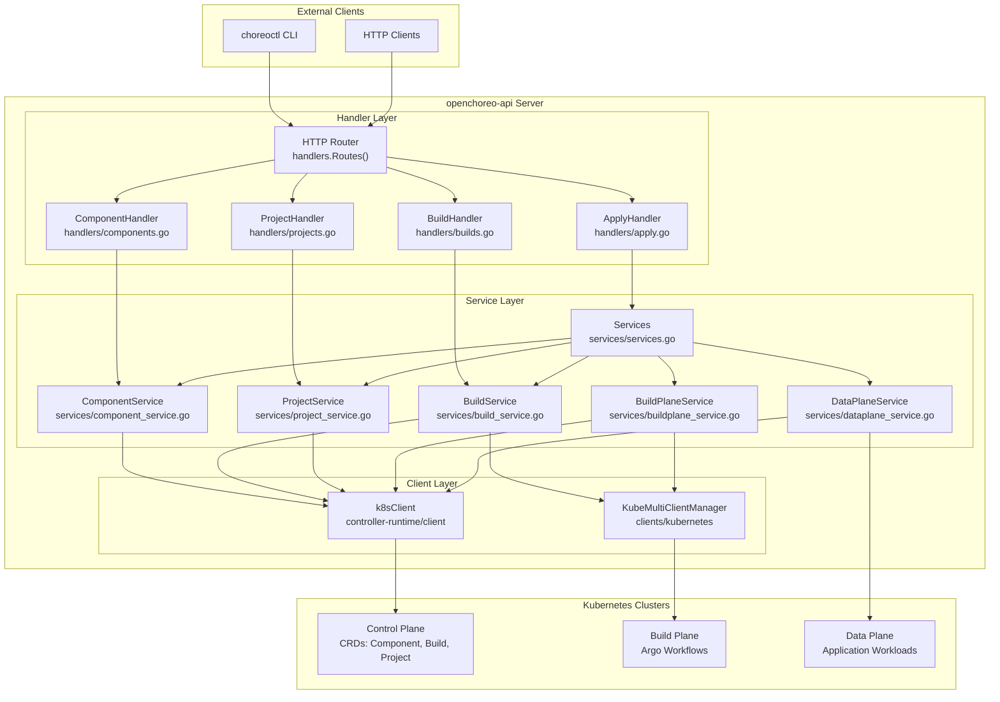
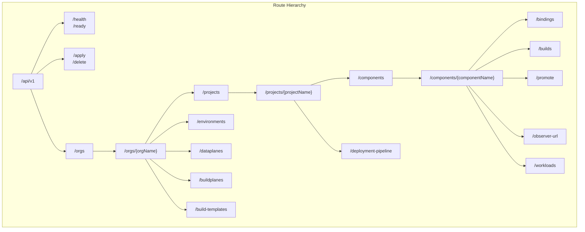
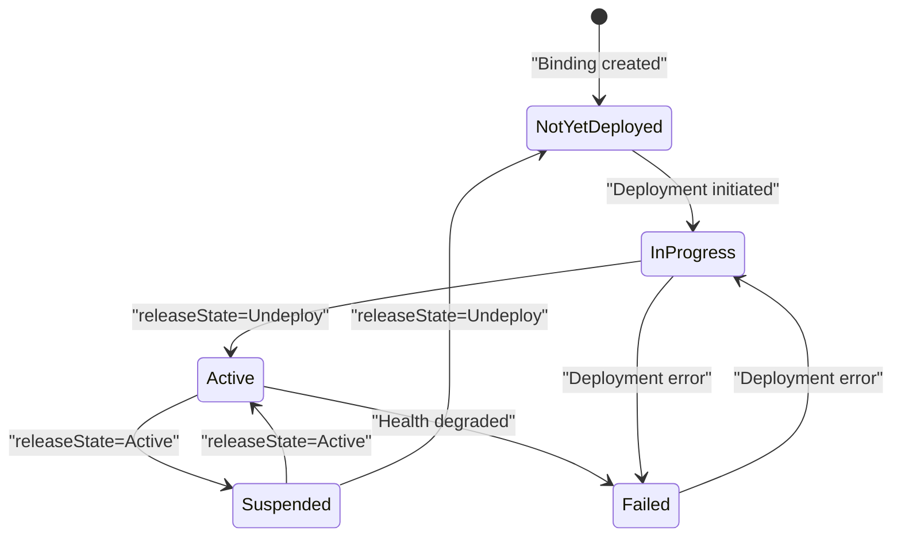
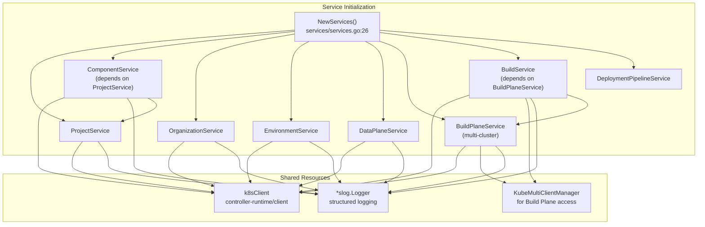
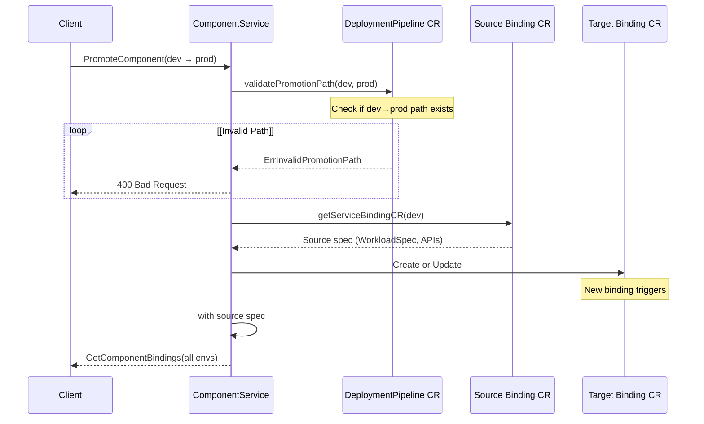
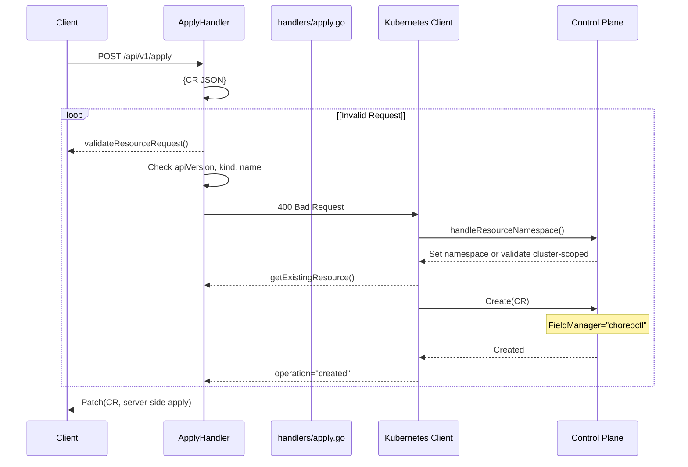
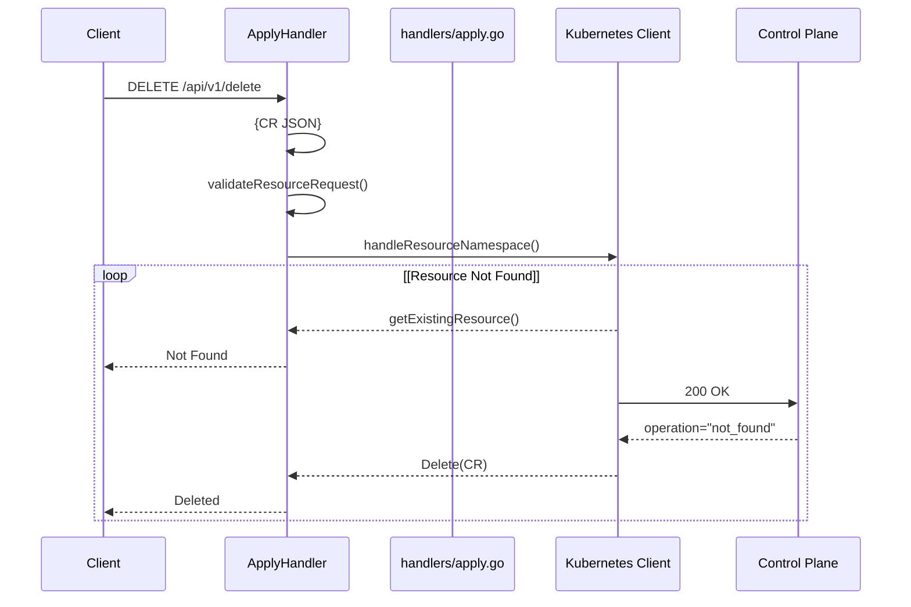
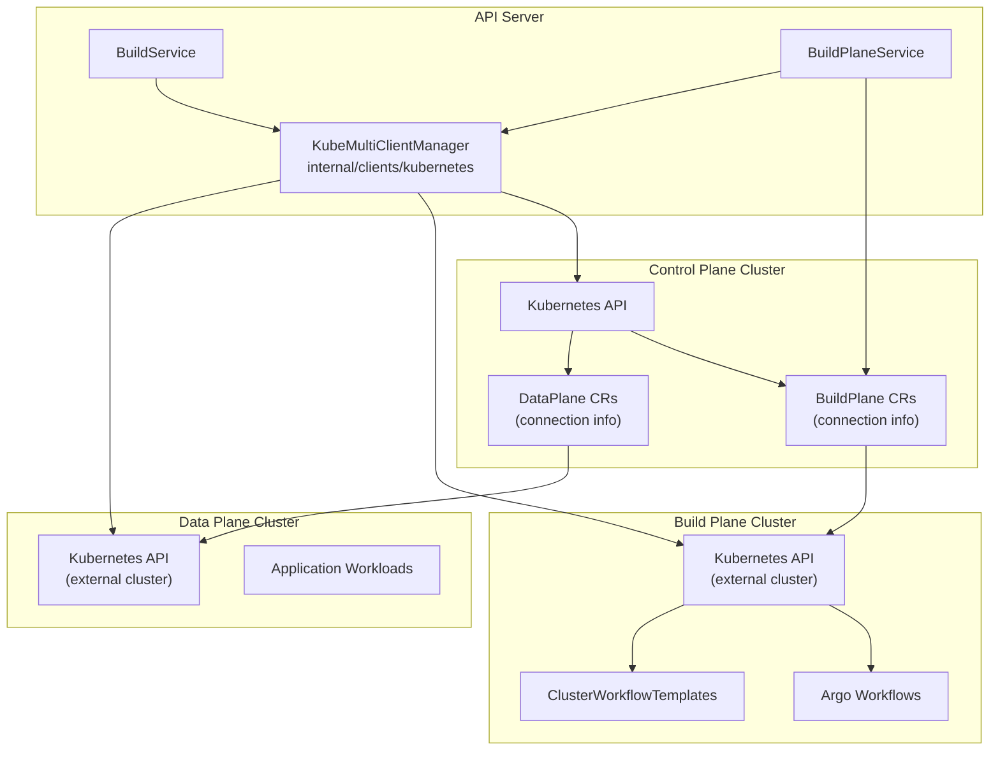

# API and Services

> **Relevant source files**
> * [cmd/openchoreo-api/main.go](https://github.com/openchoreo/openchoreo/blob/a577e969/cmd/openchoreo-api/main.go)
> * [internal/choreoctl/resources/kinds/dataplane.go](https://github.com/openchoreo/openchoreo/blob/a577e969/internal/choreoctl/resources/kinds/dataplane.go)
> * [internal/openchoreo-api/clients/k8s.go](https://github.com/openchoreo/openchoreo/blob/a577e969/internal/openchoreo-api/clients/k8s.go)
> * [internal/openchoreo-api/handlers/apply.go](https://github.com/openchoreo/openchoreo/blob/a577e969/internal/openchoreo-api/handlers/apply.go)
> * [internal/openchoreo-api/handlers/buildplanes.go](https://github.com/openchoreo/openchoreo/blob/a577e969/internal/openchoreo-api/handlers/buildplanes.go)
> * [internal/openchoreo-api/handlers/builds.go](https://github.com/openchoreo/openchoreo/blob/a577e969/internal/openchoreo-api/handlers/builds.go)
> * [internal/openchoreo-api/handlers/components.go](https://github.com/openchoreo/openchoreo/blob/a577e969/internal/openchoreo-api/handlers/components.go)
> * [internal/openchoreo-api/handlers/dataplanes.go](https://github.com/openchoreo/openchoreo/blob/a577e969/internal/openchoreo-api/handlers/dataplanes.go)
> * [internal/openchoreo-api/handlers/environments.go](https://github.com/openchoreo/openchoreo/blob/a577e969/internal/openchoreo-api/handlers/environments.go)
> * [internal/openchoreo-api/handlers/handlers.go](https://github.com/openchoreo/openchoreo/blob/a577e969/internal/openchoreo-api/handlers/handlers.go)
> * [internal/openchoreo-api/handlers/helpers.go](https://github.com/openchoreo/openchoreo/blob/a577e969/internal/openchoreo-api/handlers/helpers.go)
> * [internal/openchoreo-api/handlers/organizations.go](https://github.com/openchoreo/openchoreo/blob/a577e969/internal/openchoreo-api/handlers/organizations.go)
> * [internal/openchoreo-api/handlers/workloads.go](https://github.com/openchoreo/openchoreo/blob/a577e969/internal/openchoreo-api/handlers/workloads.go)
> * [internal/openchoreo-api/models/request.go](https://github.com/openchoreo/openchoreo/blob/a577e969/internal/openchoreo-api/models/request.go)
> * [internal/openchoreo-api/models/response.go](https://github.com/openchoreo/openchoreo/blob/a577e969/internal/openchoreo-api/models/response.go)
> * [internal/openchoreo-api/services/build_service.go](https://github.com/openchoreo/openchoreo/blob/a577e969/internal/openchoreo-api/services/build_service.go)
> * [internal/openchoreo-api/services/buildplane_service.go](https://github.com/openchoreo/openchoreo/blob/a577e969/internal/openchoreo-api/services/buildplane_service.go)
> * [internal/openchoreo-api/services/component_service.go](https://github.com/openchoreo/openchoreo/blob/a577e969/internal/openchoreo-api/services/component_service.go)
> * [internal/openchoreo-api/services/dataplane_service.go](https://github.com/openchoreo/openchoreo/blob/a577e969/internal/openchoreo-api/services/dataplane_service.go)
> * [internal/openchoreo-api/services/environment_service.go](https://github.com/openchoreo/openchoreo/blob/a577e969/internal/openchoreo-api/services/environment_service.go)
> * [internal/openchoreo-api/services/errors.go](https://github.com/openchoreo/openchoreo/blob/a577e969/internal/openchoreo-api/services/errors.go)
> * [internal/openchoreo-api/services/organization_service.go](https://github.com/openchoreo/openchoreo/blob/a577e969/internal/openchoreo-api/services/organization_service.go)
> * [internal/openchoreo-api/services/project_service.go](https://github.com/openchoreo/openchoreo/blob/a577e969/internal/openchoreo-api/services/project_service.go)
> * [internal/openchoreo-api/services/services.go](https://github.com/openchoreo/openchoreo/blob/a577e969/internal/openchoreo-api/services/services.go)

## Overview

The OpenChoreo API server (`openchoreo-api`) provides an HTTP REST interface that abstracts Kubernetes Custom Resource operations into user-friendly endpoints. It serves as the primary programmatic interface for external clients, including the `choreoctl` CLI and other HTTP-based integrations. The API layer translates HTTP requests into Kubernetes CR CRUD operations while maintaining multi-cluster awareness for Build Plane and Data Plane resources.

This page covers the API server architecture, service layer organization, and HTTP request handling patterns. For controller-side reconciliation logic that responds to CR changes, see [Controller Manager](/openchoreo/openchoreo/2.4-controller-manager). For deployment provisioning workflows, see [Deployment System](/openchoreo/openchoreo/4-deployment-system).

## API Server Architecture

The API server follows a three-layer architecture that separates HTTP concerns from business logic and Kubernetes operations.



**Sources:** [cmd/openchoreo-api/main.go L1-L81](https://github.com/openchoreo/openchoreo/blob/a577e969/cmd/openchoreo-api/main.go#L1-L81)

 [internal/openchoreo-api/handlers/handlers.go L1-L109](https://github.com/openchoreo/openchoreo/blob/a577e969/internal/openchoreo-api/handlers/handlers.go#L1-L109)

 [internal/openchoreo-api/services/services.go L1-L68](https://github.com/openchoreo/openchoreo/blob/a577e969/internal/openchoreo-api/services/services.go#L1-L68)

### Layer Responsibilities

| Layer | Package | Responsibility |
| --- | --- | --- |
| **Handler Layer** | `internal/openchoreo-api/handlers/` | HTTP request parsing, path parameter extraction, response formatting, error code mapping |
| **Service Layer** | `internal/openchoreo-api/services/` | Business logic, validation, CR lifecycle management, multi-cluster orchestration |
| **Client Layer** | `controller-runtime/client`, `internal/clients/kubernetes/` | Kubernetes API operations, multi-cluster client management |

### Initialization Sequence

The API server initializes in the following order:

1. **Kubernetes Client Creation** - [cmd/openchoreo-api/main.go L39-L43](https://github.com/openchoreo/openchoreo/blob/a577e969/cmd/openchoreo-api/main.go#L39-L43)  creates the controller-runtime client with OpenChoreo scheme
2. **Service Layer Initialization** - [internal/openchoreo-api/services/services.go L26-L62](https://github.com/openchoreo/openchoreo/blob/a577e969/internal/openchoreo-api/services/services.go#L26-L62)  instantiates all service objects with dependency injection
3. **Handler Registration** - [cmd/openchoreo-api/main.go L49](https://github.com/openchoreo/openchoreo/blob/a577e969/cmd/openchoreo-api/main.go#L49-L49)  creates the handler with service references
4. **Route Setup** - [internal/openchoreo-api/handlers/handlers.go L30-L95](https://github.com/openchoreo/openchoreo/blob/a577e969/internal/openchoreo-api/handlers/handlers.go#L30-L95)  registers all HTTP endpoints
5. **Server Start** - [cmd/openchoreo-api/main.go L60-L66](https://github.com/openchoreo/openchoreo/blob/a577e969/cmd/openchoreo-api/main.go#L60-L66)  starts the HTTP server with graceful shutdown support

**Sources:** [cmd/openchoreo-api/main.go L1-L81](https://github.com/openchoreo/openchoreo/blob/a577e969/cmd/openchoreo-api/main.go#L1-L81)

 [internal/openchoreo-api/services/services.go L1-L68](https://github.com/openchoreo/openchoreo/blob/a577e969/internal/openchoreo-api/services/services.go#L1-L68)

## HTTP Routes and Handlers

The API server exposes versioned REST endpoints under `/api/v1/` with organizational hierarchy reflected in the URL structure.

### Route Organization



**Sources:** [internal/openchoreo-api/handlers/handlers.go L30-L95](https://github.com/openchoreo/openchoreo/blob/a577e969/internal/openchoreo-api/handlers/handlers.go#L30-L95)

### Route to Handler Mapping

| HTTP Route | Handler Method | Service Method | Purpose |
| --- | --- | --- | --- |
| `GET /orgs` | `ListOrganizations` | `OrganizationService.ListOrganizations` | List all organizations |
| `GET /orgs/{orgName}/projects` | `ListProjects` | `ProjectService.ListProjects` | List projects in org |
| `POST /orgs/{orgName}/projects` | `CreateProject` | `ProjectService.CreateProject` | Create new project |
| `GET /orgs/{orgName}/projects/{projectName}/components` | `ListComponents` | `ComponentService.ListComponents` | List components in project |
| `POST /orgs/{orgName}/projects/{projectName}/components` | `CreateComponent` | `ComponentService.CreateComponent` | Create new component |
| `GET /orgs/{orgName}/projects/{projectName}/components/{componentName}/bindings` | `GetComponentBinding` | `ComponentService.GetComponentBindings` | Get component bindings across environments |
| `POST /orgs/{orgName}/projects/{projectName}/components/{componentName}/promote` | `PromoteComponent` | `ComponentService.PromoteComponent` | Promote component between environments |
| `POST /orgs/{orgName}/projects/{projectName}/components/{componentName}/builds` | `TriggerBuild` | `BuildService.TriggerBuild` | Trigger new build |
| `POST /api/v1/apply` | `ApplyResource` | Direct Kubernetes client | Apply CR like kubectl |
| `DELETE /api/v1/delete` | `DeleteResource` | Direct Kubernetes client | Delete CR like kubectl |

**Sources:** [internal/openchoreo-api/handlers/handlers.go L30-L95](https://github.com/openchoreo/openchoreo/blob/a577e969/internal/openchoreo-api/handlers/handlers.go#L30-L95)

## Request and Response Models

The API uses typed request and response models to ensure contract stability and provide clear documentation.

### Request Models

Request models are defined in [internal/openchoreo-api/models/request.go L1-L190](https://github.com/openchoreo/openchoreo/blob/a577e969/internal/openchoreo-api/models/request.go#L1-L190)

 and include validation and sanitization methods.

| Model | Purpose | Key Fields |
| --- | --- | --- |
| `CreateProjectRequest` | Project creation | `Name`, `DisplayName`, `Description`, `DeploymentPipeline` |
| `CreateComponentRequest` | Component creation | `Name`, `Type`, `BuildConfig` (optional) |
| `PromoteComponentRequest` | Component promotion | `SourceEnvironment`, `TargetEnvironment` |
| `UpdateBindingRequest` | Binding state update | `ReleaseState` ("Active", "Suspend", "Undeploy") |
| `CreateEnvironmentRequest` | Environment creation | `Name`, `DataPlaneRef`, `IsProduction`, `DNSPrefix` |
| `CreateDataPlaneRequest` | DataPlane creation | `Name`, `KubernetesClusterName`, `APIServerURL`, `CACert`, `ClientCert`, `ClientKey` |

All request models implement:

* `Validate() error` - Validates required fields and business rules
* `Sanitize()` - Trims whitespace from string fields

**Sources:** [internal/openchoreo-api/models/request.go L1-L190](https://github.com/openchoreo/openchoreo/blob/a577e969/internal/openchoreo-api/models/request.go#L1-L190)

### Response Models

Response models are defined in [internal/openchoreo-api/models/response.go L1-L252](https://github.com/openchoreo/openchoreo/blob/a577e969/internal/openchoreo-api/models/response.go#L1-L252)

 and provide consistent structure across all endpoints.

#### Standard Response Wrapper

All API responses use the `APIResponse[T]` wrapper:

```
type APIResponse[T any] struct {
    Success bool   `json:"success"`
    Data    T      `json:"data,omitempty"`
    Error   string `json:"error,omitempty"`
    Code    string `json:"code,omitempty"`
}
```

**Sources:** [internal/openchoreo-api/models/response.go L13-L18](https://github.com/openchoreo/openchoreo/blob/a577e969/internal/openchoreo-api/models/response.go#L13-L18)

#### Resource Response Models

| Model | CR Type | Key Fields |
| --- | --- | --- |
| `ComponentResponse` | `Component` | `Name`, `Type`, `Status`, `BuildConfig`, `Service`, `WebApplication`, `Workload` |
| `BindingResponse` | `ServiceBinding`, `WebApplicationBinding`, `ScheduledTaskBinding` | `Name`, `Type`, `Environment`, `BindingStatus`, type-specific bindings with `Endpoints`, `Image` |
| `BuildResponse` | `Build` | `Name`, `UUID`, `ComponentName`, `Commit`, `Status`, `Image` |
| `ProjectResponse` | `Project` | `Name`, `OrgName`, `DeploymentPipeline`, `Status` |
| `EnvironmentResponse` | `Environment` | `Name`, `DataPlaneRef`, `IsProduction`, `DNSPrefix` |
| `DataPlaneResponse` | `DataPlane` | `Name`, `APIServerURL`, `PublicVirtualHost`, `OrganizationVirtualHost`, `ObserverURL` |

**Sources:** [internal/openchoreo-api/models/response.go L28-L252](https://github.com/openchoreo/openchoreo/blob/a577e969/internal/openchoreo-api/models/response.go#L28-L252)

### Binding Status State Machine

Component bindings transition through multiple states tracked via `BindingStatusType`:



Status mapping is implemented in [internal/openchoreo-api/services/component_service.go L717-L737](https://github.com/openchoreo/openchoreo/blob/a577e969/internal/openchoreo-api/services/component_service.go#L717-L737)

 The mapping translates Kubernetes condition reasons to user-friendly states:

| Condition Reason | Binding Status | Description |
| --- | --- | --- |
| `Ready` (True) | `Active` | Component is deployed and healthy |
| `ResourcesSuspended` | `Suspended` | Component is suspended (scaled to zero) |
| `ResourcesUndeployed` | `Suspended` | Component resources removed |
| `ResourceHealthProgressing` | `InProgress` | Deployment in progress |
| `ResourceHealthDegraded` | `Failed` | Component unhealthy or errored |
| Other | `NotYetDeployed` | Initial or unknown state |

**Sources:** [internal/openchoreo-api/models/response.go L71-L86](https://github.com/openchoreo/openchoreo/blob/a577e969/internal/openchoreo-api/models/response.go#L71-L86)

 [internal/openchoreo-api/services/component_service.go L717-L737](https://github.com/openchoreo/openchoreo/blob/a577e969/internal/openchoreo-api/services/component_service.go#L717-L737)

## Service Layer Architecture

The service layer encapsulates business logic and provides a clean abstraction over Kubernetes operations. Services are organized by resource domain and initialized with dependency injection.



**Sources:** [internal/openchoreo-api/services/services.go L26-L62](https://github.com/openchoreo/openchoreo/blob/a577e969/internal/openchoreo-api/services/services.go#L26-L62)

### Service Responsibilities

#### ComponentService

The `ComponentService` handles component lifecycle, promotion workflows, and binding management across environments.

**Key Methods:**

* `CreateComponent(ctx, orgName, projectName, *CreateComponentRequest)` - [internal/openchoreo-api/services/component_service.go L53-L99](https://github.com/openchoreo/openchoreo/blob/a577e969/internal/openchoreo-api/services/component_service.go#L53-L99)  - Creates Component CR with optional build configuration
* `GetComponent(ctx, orgName, projectName, componentName, additionalResources)` - [internal/openchoreo-api/services/component_service.go L137-L223](https://github.com/openchoreo/openchoreo/blob/a577e969/internal/openchoreo-api/services/component_service.go#L137-L223)  - Retrieves component with optional type-specific specs (Service, WebApplication, Workload)
* `GetComponentBindings(ctx, orgName, projectName, componentName, environments)` - [internal/openchoreo-api/services/component_service.go L366-L400](https://github.com/openchoreo/openchoreo/blob/a577e969/internal/openchoreo-api/services/component_service.go#L366-L400)  - Retrieves bindings across multiple environments, defaults to all pipeline environments if none specified
* `PromoteComponent(ctx, *PromoteComponentPayload)` - [internal/openchoreo-api/services/component_service.go L660-L696](https://github.com/openchoreo/openchoreo/blob/a577e969/internal/openchoreo-api/services/component_service.go#L660-L696)  - Validates promotion path against DeploymentPipeline, copies source binding to target environment
* `UpdateComponentBinding(ctx, orgName, projectName, componentName, bindingName, *UpdateBindingRequest)` - Updates binding `ReleaseState` to control deployment lifecycle

**Promotion Workflow:**



**Sources:** [internal/openchoreo-api/services/component_service.go L660-L696](https://github.com/openchoreo/openchoreo/blob/a577e969/internal/openchoreo-api/services/component_service.go#L660-L696)

 [internal/openchoreo-api/services/component_service.go L740-L782](https://github.com/openchoreo/openchoreo/blob/a577e969/internal/openchoreo-api/services/component_service.go#L740-L782)

**Component Spec Fetcher Registry:**

The `ComponentSpecFetcherRegistry` pattern allows fetching type-specific resources (Service, WebApplication, Workload) dynamically:

* Registry maps resource type keys to fetcher implementations
* Each fetcher implements `FetchSpec(ctx, client, orgName, componentName)` interface
* Used in `GetComponent` when `additionalResources` query parameter includes "type" or "workload"

**Sources:** [internal/openchoreo-api/services/component_service.go L164-L214](https://github.com/openchoreo/openchoreo/blob/a577e969/internal/openchoreo-api/services/component_service.go#L164-L214)

#### BuildService

The `BuildService` orchestrates build operations and queries Build Plane resources.

**Key Methods:**

* `TriggerBuild(ctx, orgName, projectName, componentName, commit)` - [internal/openchoreo-api/services/build_service.go L92-L161](https://github.com/openchoreo/openchoreo/blob/a577e969/internal/openchoreo-api/services/build_service.go#L92-L161)  - Creates Build CR from Component spec, generates unique build ID
* `ListBuilds(ctx, orgName, projectName, componentName)` - [internal/openchoreo-api/services/build_service.go L164-L202](https://github.com/openchoreo/openchoreo/blob/a577e969/internal/openchoreo-api/services/build_service.go#L164-L202)  - Lists builds filtered by component, extracts status from conditions
* `ListBuildTemplates(ctx, orgName)` - [internal/openchoreo-api/services/build_service.go L43-L89](https://github.com/openchoreo/openchoreo/blob/a577e969/internal/openchoreo-api/services/build_service.go#L43-L89)  - Queries ClusterWorkflowTemplates from Build Plane cluster

**Build Status Mapping:**

Build status is derived from condition priority order (latest first):

1. `WorkloadUpdated` (True) → "Completed"
2. `BuildCompleted` → Condition reason
3. `BuildTriggered` → Condition reason
4. `BuildInitiated` → Condition reason

Implemented in [internal/openchoreo-api/services/build_service.go L204-L231](https://github.com/openchoreo/openchoreo/blob/a577e969/internal/openchoreo-api/services/build_service.go#L204-L231)

**Sources:** [internal/openchoreo-api/services/build_service.go L1-L232](https://github.com/openchoreo/openchoreo/blob/a577e969/internal/openchoreo-api/services/build_service.go#L1-L232)

#### ProjectService

The `ProjectService` manages project lifecycle and deployment pipeline references.

**Key Methods:**

* `CreateProject(ctx, orgName, *CreateProjectRequest)` - [internal/openchoreo-api/services/project_service.go L35-L61](https://github.com/openchoreo/openchoreo/blob/a577e969/internal/openchoreo-api/services/project_service.go#L35-L61)  - Creates Project CR with deployment pipeline reference, defaults to "default-pipeline" if not specified
* `GetProject(ctx, orgName, projectName)` - [internal/openchoreo-api/services/project_service.go L87-L106](https://github.com/openchoreo/openchoreo/blob/a577e969/internal/openchoreo-api/services/project_service.go#L87-L106)  - Retrieves project, used for validation in component operations
* `ListProjects(ctx, orgName)` - [internal/openchoreo-api/services/project_service.go L64-L84](https://github.com/openchoreo/openchoreo/blob/a577e969/internal/openchoreo-api/services/project_service.go#L64-L84)  - Lists all projects in organization namespace

**Sources:** [internal/openchoreo-api/services/project_service.go L1-L185](https://github.com/openchoreo/openchoreo/blob/a577e969/internal/openchoreo-api/services/project_service.go#L1-L185)

#### DataPlaneService and BuildPlaneService

These services handle infrastructure plane resources and provide multi-cluster client access.

**DataPlaneService:**

* `CreateDataPlane(ctx, orgName, *CreateDataPlaneRequest)` - [internal/openchoreo-api/services/dataplane_service.go L80-L106](https://github.com/openchoreo/openchoreo/blob/a577e969/internal/openchoreo-api/services/dataplane_service.go#L80-L106)  - Creates DataPlane CR with Kubernetes cluster connection details and gateway configuration
* `GetDataPlane(ctx, orgName, dpName)` - Retrieves specific DataPlane
* `ListDataPlanes(ctx, orgName)` - Lists all DataPlanes in organization

**BuildPlaneService:**

* `GetBuildPlane(ctx, orgName)` - [internal/openchoreo-api/services/buildplane_service.go L36-L58](https://github.com/openchoreo/openchoreo/blob/a577e969/internal/openchoreo-api/services/buildplane_service.go#L36-L58)  - Returns first BuildPlane in organization (single BuildPlane per org)
* `GetBuildPlaneClient(ctx, orgName)` - [internal/openchoreo-api/services/buildplane_service.go L61-L83](https://github.com/openchoreo/openchoreo/blob/a577e969/internal/openchoreo-api/services/buildplane_service.go#L61-L83)  - Creates Kubernetes client for Build Plane cluster using `KubeMultiClientManager`
* `ListBuildPlanes(ctx, orgName)` - Lists all BuildPlanes in organization

**Sources:** [internal/openchoreo-api/services/dataplane_service.go L1-L244](https://github.com/openchoreo/openchoreo/blob/a577e969/internal/openchoreo-api/services/dataplane_service.go#L1-L244)

 [internal/openchoreo-api/services/buildplane_service.go L1-L134](https://github.com/openchoreo/openchoreo/blob/a577e969/internal/openchoreo-api/services/buildplane_service.go#L1-L134)

## Generic Apply and Delete Operations

The API server provides kubectl-like `apply` and `delete` endpoints that accept arbitrary OpenChoreo CRs and forward them to the Kubernetes API with server-side apply semantics.

### Apply Endpoint

**Route:** `POST /api/v1/apply`

**Request Body:** Any OpenChoreo CR in JSON format with `apiVersion`, `kind`, and `metadata.name`

**Workflow:**



**Key Implementation Details:**

1. **Group Validation** - [internal/openchoreo-api/handlers/apply.go L279-L287](https://github.com/openchoreo/openchoreo/blob/a577e969/internal/openchoreo-api/handlers/apply.go#L279-L287)  - Only accepts `openchoreo.dev` group resources
2. **Cluster-Scoped Detection** - [internal/openchoreo-api/handlers/apply.go L238-L245](https://github.com/openchoreo/openchoreo/blob/a577e969/internal/openchoreo-api/handlers/apply.go#L238-L245)  - Organization is the only cluster-scoped resource
3. **Namespace Defaulting** - [internal/openchoreo-api/handlers/apply.go L248-L261](https://github.com/openchoreo/openchoreo/blob/a577e969/internal/openchoreo-api/handlers/apply.go#L248-L261)  - Sets default namespace for namespaced resources if not specified
4. **Server-Side Apply** - [internal/openchoreo-api/handlers/apply.go L106-L116](https://github.com/openchoreo/openchoreo/blob/a577e969/internal/openchoreo-api/handlers/apply.go#L106-L116)  - Uses `client.Apply` patch with `ForceOwnership` and field manager "choreoctl"

**Sources:** [internal/openchoreo-api/handlers/apply.go L30-L117](https://github.com/openchoreo/openchoreo/blob/a577e969/internal/openchoreo-api/handlers/apply.go#L30-L117)

### Delete Endpoint

**Route:** `DELETE /api/v1/delete`

**Request Body:** Any OpenChoreo CR in JSON format with sufficient identification fields

**Workflow:**



**Sources:** [internal/openchoreo-api/handlers/apply.go L129-L202](https://github.com/openchoreo/openchoreo/blob/a577e969/internal/openchoreo-api/handlers/apply.go#L129-L202)

### Resource Namespace Handling

The `handleResourceNamespace` function implements namespace logic for both cluster-scoped and namespaced resources:

| Resource Type | Namespace Behavior |
| --- | --- |
| `Organization` | Cluster-scoped - namespace ignored/cleared |
| All other OpenChoreo resources | Namespaced - defaults to "default" if not specified |

**Sources:** [internal/openchoreo-api/handlers/apply.go L205-L261](https://github.com/openchoreo/openchoreo/blob/a577e969/internal/openchoreo-api/handlers/apply.go#L205-L261)

## Multi-Cluster Support

The API server supports multi-cluster operations for Build Plane and Data Plane resources using the `KubeMultiClientManager` pattern.

### KubeMultiClientManager Architecture



**Sources:** [internal/openchoreo-api/services/buildplane_service.go L61-L83](https://github.com/openchoreo/openchoreo/blob/a577e969/internal/openchoreo-api/services/buildplane_service.go#L61-L83)

### Build Plane Client Creation

The `BuildPlaneService.GetBuildPlaneClient()` method demonstrates multi-cluster client creation:

1. **Retrieve BuildPlane CR** - Query BuildPlane in organization namespace to get cluster connection details
2. **Extract Cluster Spec** - Get `KubernetesCluster` spec containing server URL, TLS CA, and mTLS credentials
3. **Create Client** - Call `kubernetesClient.GetK8sClient(bpClientMgr, orgName, planeName, clusterSpec)`
4. **Cache Client** - `KubeMultiClientManager` caches clients per organization/cluster combination

**Example Usage in BuildService:**

The `ListBuildTemplates` method queries ClusterWorkflowTemplates from the Build Plane:

```javascript
buildPlaneClient := buildPlaneService.GetBuildPlaneClient(orgName)
var templates argo.ClusterWorkflowTemplateList
buildPlaneClient.List(ctx, &templates)
```

**Sources:** [internal/openchoreo-api/services/buildplane_service.go L61-L83](https://github.com/openchoreo/openchoreo/blob/a577e969/internal/openchoreo-api/services/buildplane_service.go#L61-L83)

 [internal/openchoreo-api/services/build_service.go L43-L89](https://github.com/openchoreo/openchoreo/blob/a577e969/internal/openchoreo-api/services/build_service.go#L43-L89)

## Error Handling and Codes

The API uses typed errors and standardized error codes for consistent client handling.

### Service-Level Errors

Defined in [internal/openchoreo-api/services/errors.go L9-L22](https://github.com/openchoreo/openchoreo/blob/a577e969/internal/openchoreo-api/services/errors.go#L9-L22)

:

| Error Variable | Error Code | HTTP Status |
| --- | --- | --- |
| `ErrProjectNotFound` | `PROJECT_NOT_FOUND` | 404 |
| `ErrComponentNotFound` | `COMPONENT_NOT_FOUND` | 404 |
| `ErrBindingNotFound` | `BINDING_NOT_FOUND` | 404 |
| `ErrDeploymentPipelineNotFound` | `DEPLOYMENT_PIPELINE_NOT_FOUND` | 404 |
| `ErrProjectAlreadyExists` | `PROJECT_EXISTS` | 409 |
| `ErrComponentAlreadyExists` | `COMPONENT_EXISTS` | 409 |
| `ErrInvalidPromotionPath` | `INVALID_PROMOTION_PATH` | 400 |

### Error Response Format

All errors return the standard `APIResponse` wrapper:

```json
{
  "success": false,
  "error": "Component not found",
  "code": "COMPONENT_NOT_FOUND"
}
```

Handlers map service errors to HTTP status codes using `errors.Is()` checks. Example from [internal/openchoreo-api/handlers/components.go L123-L137](https://github.com/openchoreo/openchoreo/blob/a577e969/internal/openchoreo-api/handlers/components.go#L123-L137)

**Sources:** [internal/openchoreo-api/services/errors.go L1-L41](https://github.com/openchoreo/openchoreo/blob/a577e969/internal/openchoreo-api/services/errors.go#L1-L41)

 [internal/openchoreo-api/models/response.go L245-L251](https://github.com/openchoreo/openchoreo/blob/a577e969/internal/openchoreo-api/models/response.go#L245-L251)

## Request Flow Example

The following diagram traces a complete request flow for component promotion:

```mermaid
sequenceDiagram
  participant choreoctl
  participant handlers.Routes()
  participant handlers.PromoteComponent
  participant ComponentService
  participant DeploymentPipeline
  participant Kubernetes Client

  choreoctl->>handlers.Routes(): POST /api/v1/orgs/myorg/projects/myproj/
  note over choreoctl,handlers.Routes(): Body: {sourceEnv:"dev", targetEnv:"prod"}
  handlers.Routes()->>handlers.PromoteComponent: components/mycomp/promote
  handlers.PromoteComponent->>handlers.PromoteComponent: r.PathValue("orgName")
  handlers.PromoteComponent->>handlers.PromoteComponent: r.PathValue("projectName")
  handlers.PromoteComponent->>handlers.PromoteComponent: r.PathValue("componentName")
  handlers.PromoteComponent->>ComponentService: json.Decode(body)
  ComponentService->>ComponentService: req.Sanitize()
  ComponentService->>Kubernetes Client: Create PromoteComponentPayload
  Kubernetes Client-->>ComponentService: PromoteComponent(ctx, payload)
  loop [Invalid Path]
    ComponentService-->>handlers.PromoteComponent: validatePromotionPath(org, proj, dev, prod)
    handlers.PromoteComponent-->>choreoctl: Get(DeploymentPipeline)
    ComponentService->>ComponentService: Pipeline with PromotionPaths
    ComponentService->>Kubernetes Client: ErrInvalidPromotionPath
    Kubernetes Client-->>ComponentService: 400 Bad Request
    ComponentService->>ComponentService: getComponentBinding(dev)
    ComponentService->>Kubernetes Client: List(ServiceBindingList)
    ComponentService->>Kubernetes Client: Source binding
    ComponentService->>Kubernetes Client: createOrUpdateTargetBinding(prod)
  end
  ComponentService->>ComponentService: Check if binding exists in prod
  ComponentService->>Kubernetes Client: Update(existing binding)
  Kubernetes Client-->>ComponentService: Create(new binding)
  ComponentService-->>handlers.PromoteComponent: GetComponentBindings(all envs)
  handlers.PromoteComponent->>handlers.PromoteComponent: List bindings across all environments
  handlers.PromoteComponent-->>choreoctl: All bindings
```

**Sources:** [internal/openchoreo-api/handlers/components.go L190-L261](https://github.com/openchoreo/openchoreo/blob/a577e969/internal/openchoreo-api/handlers/components.go#L190-L261)

 [internal/openchoreo-api/services/component_service.go L660-L696](https://github.com/openchoreo/openchoreo/blob/a577e969/internal/openchoreo-api/services/component_service.go#L660-L696)

## Logging and Observability

The API server uses structured logging with `slog` for consistent observability.

### Logger Configuration

* **Format:** JSON for structured parsing
* **Level:** Info (configurable via handler options)
* **Context Propagation:** Logger attached to request context via middleware

**Sources:** [cmd/openchoreo-api/main.go L31-L33](https://github.com/openchoreo/openchoreo/blob/a577e969/cmd/openchoreo-api/main.go#L31-L33)

 [internal/openchoreo-api/middleware/logger](https://github.com/openchoreo/openchoreo/blob/a577e969/internal/openchoreo-api/middleware/logger)

### Log Patterns

Each service method logs:

* **Entry:** Debug-level with operation and parameters
* **Success:** Debug-level with result count/identifiers
* **Error:** Error-level with full error details

Example from ComponentService:

```
s.logger.Debug("Creating component", "org", orgName, "project", projectName, "component", req.Name)
// ... operation ...
s.logger.Debug("Component created successfully", "org", orgName, "project", projectName, "component", req.Name)
```

**Sources:** [internal/openchoreo-api/services/component_service.go L54](https://github.com/openchoreo/openchoreo/blob/a577e969/internal/openchoreo-api/services/component_service.go#L54-L54)

 [internal/openchoreo-api/services/component_service.go L86](https://github.com/openchoreo/openchoreo/blob/a577e969/internal/openchoreo-api/services/component_service.go#L86-L86)