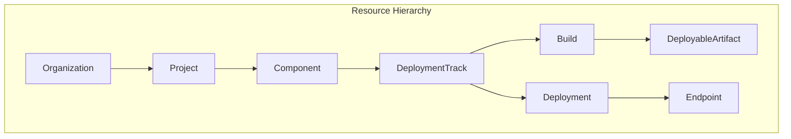
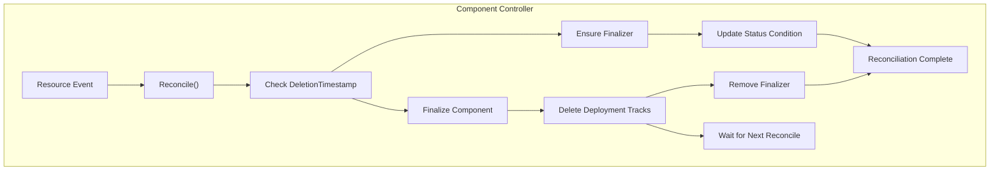
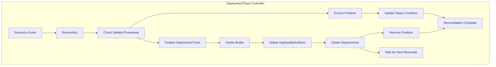
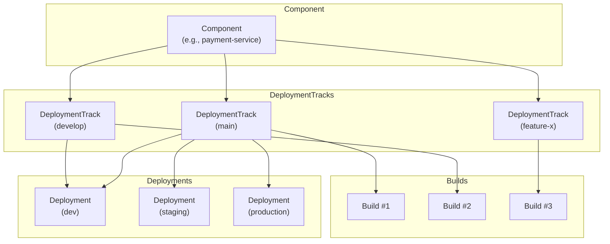
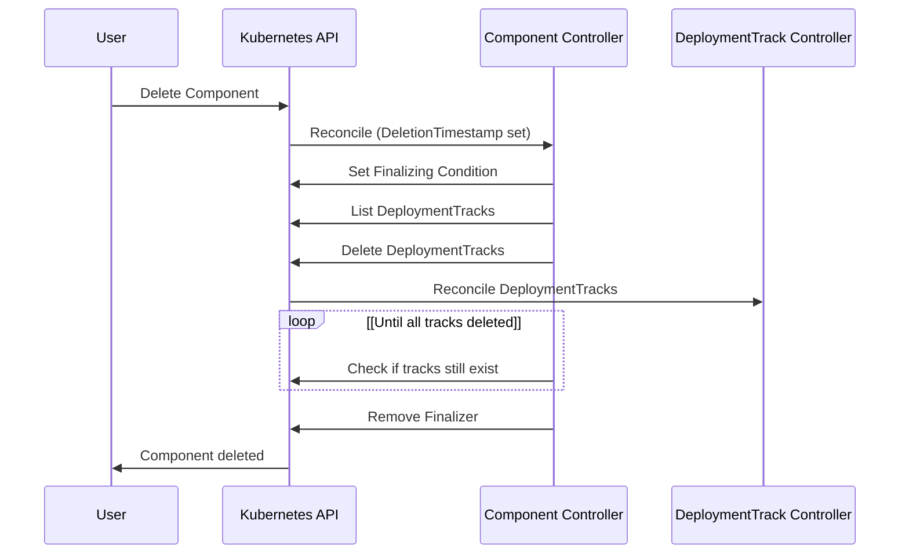
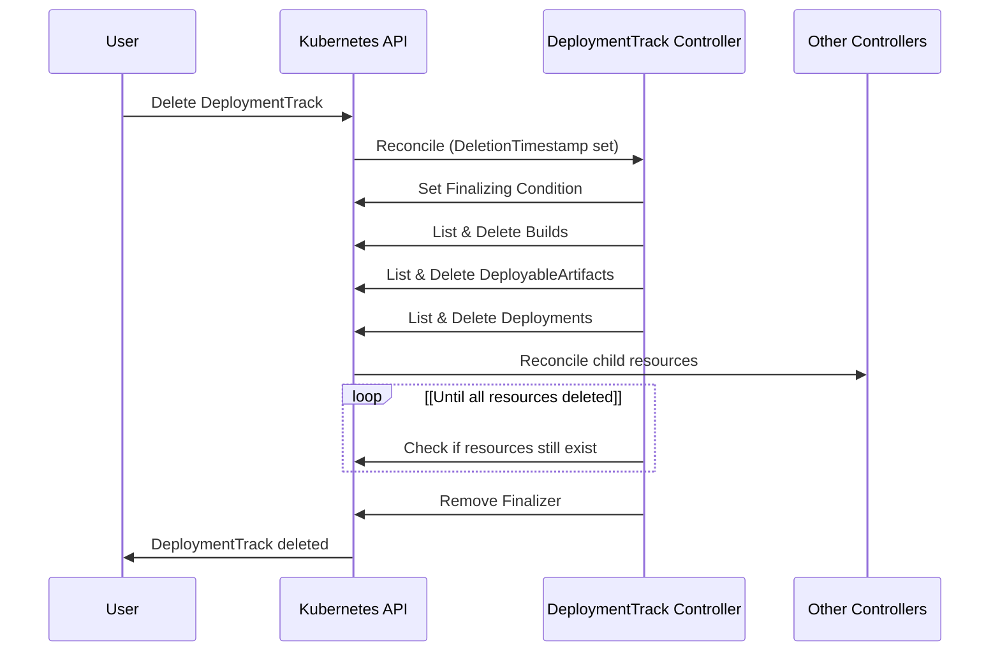

# Component and DeploymentTrack

> **Relevant source files**
> * [PROJECT](https://github.com/openchoreo/openchoreo/blob/a577e969/PROJECT)
> * [cmd/main.go](https://github.com/openchoreo/openchoreo/blob/a577e969/cmd/main.go)
> * [cmd/openchoreo-api/main.go](https://github.com/openchoreo/openchoreo/blob/a577e969/cmd/openchoreo-api/main.go)
> * [config/crd/kustomization.yaml](https://github.com/openchoreo/openchoreo/blob/a577e969/config/crd/kustomization.yaml)
> * [config/rbac/kustomization.yaml](https://github.com/openchoreo/openchoreo/blob/a577e969/config/rbac/kustomization.yaml)
> * [config/rbac/role.yaml](https://github.com/openchoreo/openchoreo/blob/a577e969/config/rbac/role.yaml)
> * [config/samples/kustomization.yaml](https://github.com/openchoreo/openchoreo/blob/a577e969/config/samples/kustomization.yaml)
> * [internal/choreoctl/resources/kinds/dataplane.go](https://github.com/openchoreo/openchoreo/blob/a577e969/internal/choreoctl/resources/kinds/dataplane.go)
> * [internal/openchoreo-api/clients/k8s.go](https://github.com/openchoreo/openchoreo/blob/a577e969/internal/openchoreo-api/clients/k8s.go)
> * [internal/openchoreo-api/handlers/apply.go](https://github.com/openchoreo/openchoreo/blob/a577e969/internal/openchoreo-api/handlers/apply.go)
> * [internal/openchoreo-api/handlers/buildplanes.go](https://github.com/openchoreo/openchoreo/blob/a577e969/internal/openchoreo-api/handlers/buildplanes.go)
> * [internal/openchoreo-api/handlers/builds.go](https://github.com/openchoreo/openchoreo/blob/a577e969/internal/openchoreo-api/handlers/builds.go)
> * [internal/openchoreo-api/handlers/components.go](https://github.com/openchoreo/openchoreo/blob/a577e969/internal/openchoreo-api/handlers/components.go)
> * [internal/openchoreo-api/handlers/dataplanes.go](https://github.com/openchoreo/openchoreo/blob/a577e969/internal/openchoreo-api/handlers/dataplanes.go)
> * [internal/openchoreo-api/handlers/environments.go](https://github.com/openchoreo/openchoreo/blob/a577e969/internal/openchoreo-api/handlers/environments.go)
> * [internal/openchoreo-api/handlers/handlers.go](https://github.com/openchoreo/openchoreo/blob/a577e969/internal/openchoreo-api/handlers/handlers.go)
> * [internal/openchoreo-api/handlers/helpers.go](https://github.com/openchoreo/openchoreo/blob/a577e969/internal/openchoreo-api/handlers/helpers.go)
> * [internal/openchoreo-api/handlers/organizations.go](https://github.com/openchoreo/openchoreo/blob/a577e969/internal/openchoreo-api/handlers/organizations.go)
> * [internal/openchoreo-api/handlers/workloads.go](https://github.com/openchoreo/openchoreo/blob/a577e969/internal/openchoreo-api/handlers/workloads.go)
> * [internal/openchoreo-api/models/request.go](https://github.com/openchoreo/openchoreo/blob/a577e969/internal/openchoreo-api/models/request.go)
> * [internal/openchoreo-api/models/response.go](https://github.com/openchoreo/openchoreo/blob/a577e969/internal/openchoreo-api/models/response.go)
> * [internal/openchoreo-api/services/build_service.go](https://github.com/openchoreo/openchoreo/blob/a577e969/internal/openchoreo-api/services/build_service.go)
> * [internal/openchoreo-api/services/buildplane_service.go](https://github.com/openchoreo/openchoreo/blob/a577e969/internal/openchoreo-api/services/buildplane_service.go)
> * [internal/openchoreo-api/services/component_service.go](https://github.com/openchoreo/openchoreo/blob/a577e969/internal/openchoreo-api/services/component_service.go)
> * [internal/openchoreo-api/services/dataplane_service.go](https://github.com/openchoreo/openchoreo/blob/a577e969/internal/openchoreo-api/services/dataplane_service.go)
> * [internal/openchoreo-api/services/environment_service.go](https://github.com/openchoreo/openchoreo/blob/a577e969/internal/openchoreo-api/services/environment_service.go)
> * [internal/openchoreo-api/services/errors.go](https://github.com/openchoreo/openchoreo/blob/a577e969/internal/openchoreo-api/services/errors.go)
> * [internal/openchoreo-api/services/organization_service.go](https://github.com/openchoreo/openchoreo/blob/a577e969/internal/openchoreo-api/services/organization_service.go)
> * [internal/openchoreo-api/services/project_service.go](https://github.com/openchoreo/openchoreo/blob/a577e969/internal/openchoreo-api/services/project_service.go)
> * [internal/openchoreo-api/services/services.go](https://github.com/openchoreo/openchoreo/blob/a577e969/internal/openchoreo-api/services/services.go)

This document details the Component and DeploymentTrack custom resources in OpenChoreo, their purpose, relationships, and how they are managed by their respective controllers. For information about parent resources like Organization and Project, see [Organization and Project](/openchoreo/openchoreo/5.1-api-server-architecture).

## Resource Hierarchy

Component and DeploymentTrack form essential layers in OpenChoreo's resource hierarchy. Understanding this hierarchy is crucial for comprehending how these resources work together.

*Diagram: OpenChoreo Resource Hierarchy*

Sources: [internal/controller/hierarchy.go L34-L381](https://github.com/openchoreo/openchoreo/blob/a577e969/internal/controller/hierarchy.go#L34-L381)

## Component Resource

A Component represents a deployable unit in OpenChoreo - typically a microservice, web application, or any other standalone unit of functionality within a Project.

### Purpose and Characteristics

* Belongs to a specific Project and Organization
* Represents a logical application or service
* Can contain multiple DeploymentTracks for different versions or branches
* Has a lifecycle managed by the Component controller

### Component Controller

The Component controller handles the creation, update, and deletion lifecycle of Component resources:

*Diagram: Component Controller Reconciliation Flow*

Sources: [internal/controller/component/controller.go L19-L127](https://github.com/openchoreo/openchoreo/blob/a577e969/internal/controller/component/controller.go#L19-L127)

 [internal/controller/component/controller_finalize.go L19-L159](https://github.com/openchoreo/openchoreo/blob/a577e969/internal/controller/component/controller_finalize.go#L19-L159)

### Component Status Conditions

The Component controller uses status conditions to track the state of the resource:

| Condition | Status | Reason | Description |
| --- | --- | --- | --- |
| Created | True | ComponentCreated | Component has been successfully created |
| Finalizing | True | ComponentFinalizing | Component is being finalized (child resources are being deleted) |

Sources: [internal/controller/component/controller_conditions.go L19-L63](https://github.com/openchoreo/openchoreo/blob/a577e969/internal/controller/component/controller_conditions.go#L19-L63)

## DeploymentTrack Resource

A DeploymentTrack represents a specific version or track of a Component that can be built and deployed. Common examples include "main", "develop", "feature-x", or any other branch or version identifiers.

### Purpose and Characteristics

* Belongs to a specific Component, Project, and Organization
* Represents a specific version or branch of a Component
* Can have multiple Builds that produce DeployableArtifacts
* Can have multiple Deployments across different Environments
* Has a lifecycle managed by the DeploymentTrack controller

### DeploymentTrack Controller

The DeploymentTrack controller handles the creation, update, and deletion lifecycle of DeploymentTrack resources:

*Diagram: DeploymentTrack Controller Reconciliation Flow*

Sources: [internal/controller/deploymenttrack/controller.go L19-L141](https://github.com/openchoreo/openchoreo/blob/a577e969/internal/controller/deploymenttrack/controller.go#L19-L141)

 [internal/controller/deploymenttrack/controller_finalize.go L19-L337](https://github.com/openchoreo/openchoreo/blob/a577e969/internal/controller/deploymenttrack/controller_finalize.go#L19-L337)

### DeploymentTrack Status Conditions

The DeploymentTrack controller uses status conditions to track the state of the resource:

| Condition | Status | Reason | Description |
| --- | --- | --- | --- |
| Available | True | DeploymentTrackAvailable | DeploymentTrack has been successfully created |
| Finalizing | True | DeploymentTrackFinalizing | DeploymentTrack is being finalized (child resources are being deleted) |

Sources: [internal/controller/deploymenttrack/controller_conditions.go L19-L63](https://github.com/openchoreo/openchoreo/blob/a577e969/internal/controller/deploymenttrack/controller_conditions.go#L19-L63)

## Relationship Between Component and DeploymentTrack

The relationship between Component and DeploymentTrack forms the foundation for the application lifecycle management in OpenChoreo.

*Diagram: Component and DeploymentTrack Relationship Example*

Sources: [internal/controller/hierarchy.go L149-L199](https://github.com/openchoreo/openchoreo/blob/a577e969/internal/controller/hierarchy.go#L149-L199)

### Key Relationships

1. A Component can have multiple DeploymentTracks
2. Each DeploymentTrack represents a specific version or branch of the Component
3. A DeploymentTrack can have multiple Builds that produce DeployableArtifacts
4. A DeploymentTrack can have multiple Deployments across different Environments

## Resource Deletion and Cleanup

When a Component or DeploymentTrack is deleted, the controllers ensure that all dependent resources are properly cleaned up through finalizers.

### Component Deletion

*Diagram: Component Deletion Flow*

Sources: [internal/controller/component/controller_finalize.go L57-L159](https://github.com/openchoreo/openchoreo/blob/a577e969/internal/controller/component/controller_finalize.go#L57-L159)

### DeploymentTrack Deletion

*Diagram: DeploymentTrack Deletion Flow*

Sources: [internal/controller/deploymenttrack/controller_finalize.go L57-L336](https://github.com/openchoreo/openchoreo/blob/a577e969/internal/controller/deploymenttrack/controller_finalize.go#L57-L336)

## Labels and Hierarchy Navigation

OpenChoreo uses labels to establish and navigate the resource hierarchy. These labels help controllers find parent and child resources efficiently.

### Key Labels for Component and DeploymentTrack

| Label Key | Purpose | Example |
| --- | --- | --- |
| core.choreo.dev/organization-name | Identifies the Organization | "my-organization" |
| core.choreo.dev/project-name | Identifies the Project | "my-project" |
| core.choreo.dev/component-name | Identifies the Component | "payment-service" |
| core.choreo.dev/deploymenttrack-name | Identifies the DeploymentTrack | "main" |
| core.choreo.dev/name | Resource's own name | "payment-service" or "main" |

Sources: [internal/controller/metadata.go L19-L97](https://github.com/openchoreo/openchoreo/blob/a577e969/internal/controller/metadata.go#L19-L97)

 [internal/controller/hierarchy.go L34-L381](https://github.com/openchoreo/openchoreo/blob/a577e969/internal/controller/hierarchy.go#L34-L381)

## Watching Child Resources

Both Component and DeploymentTrack controllers watch for changes in their child resources to ensure the resource hierarchy remains consistent and up-to-date.

### Component Controller Watches

* DeploymentTrack resources - to reconcile the Component when its tracks change

### DeploymentTrack Controller Watches

* Build resources - to reconcile the DeploymentTrack when its builds change
* DeployableArtifact resources - to reconcile the DeploymentTrack when artifacts change
* Deployment resources - to reconcile the DeploymentTrack when deployments change

Sources: [internal/controller/component/controller.go L110-L127](https://github.com/openchoreo/openchoreo/blob/a577e969/internal/controller/component/controller.go#L110-L127)

 [internal/controller/deploymenttrack/controller.go L112-L140](https://github.com/openchoreo/openchoreo/blob/a577e969/internal/controller/deploymenttrack/controller.go#L112-L140)