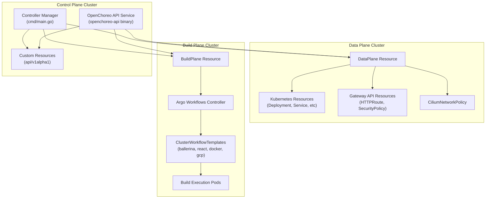
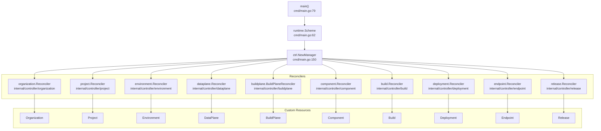
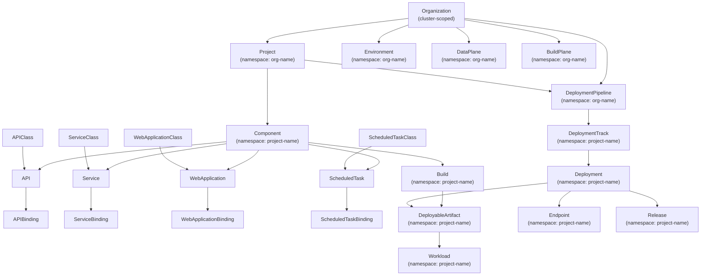
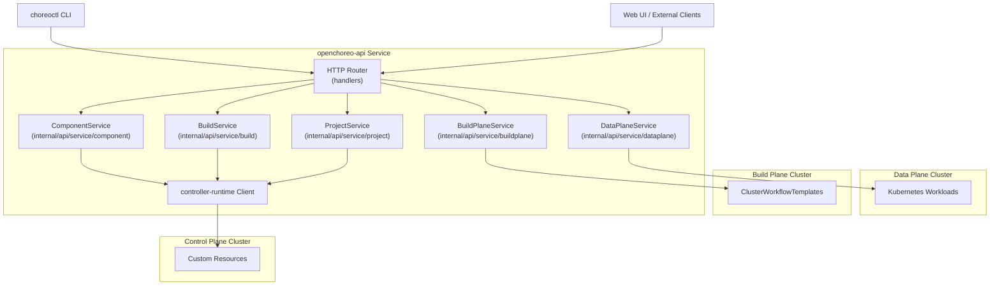
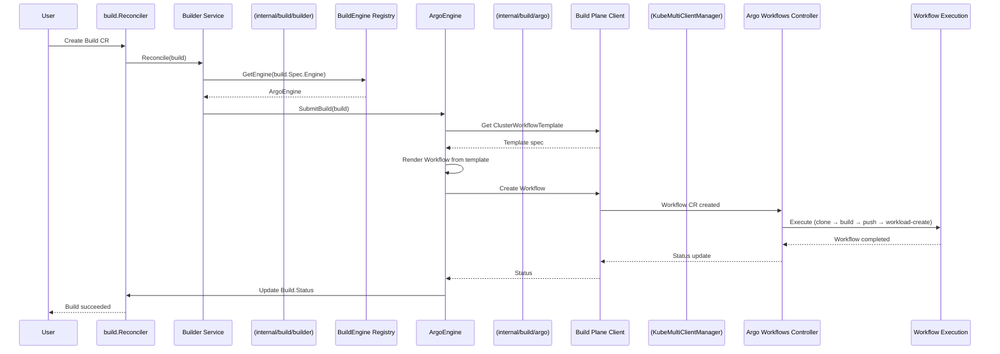
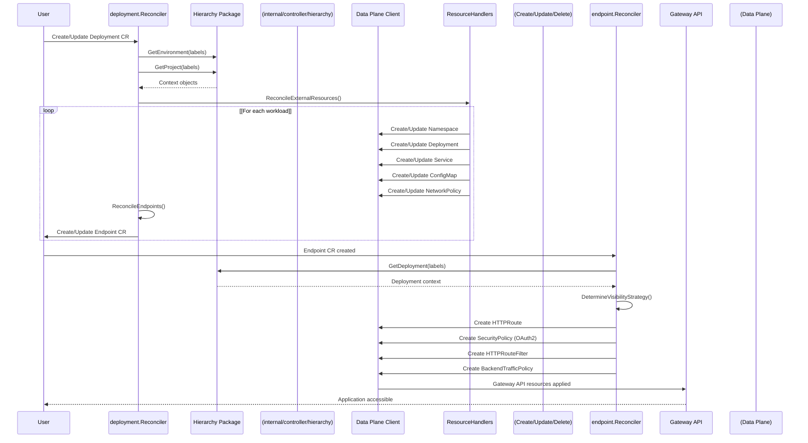
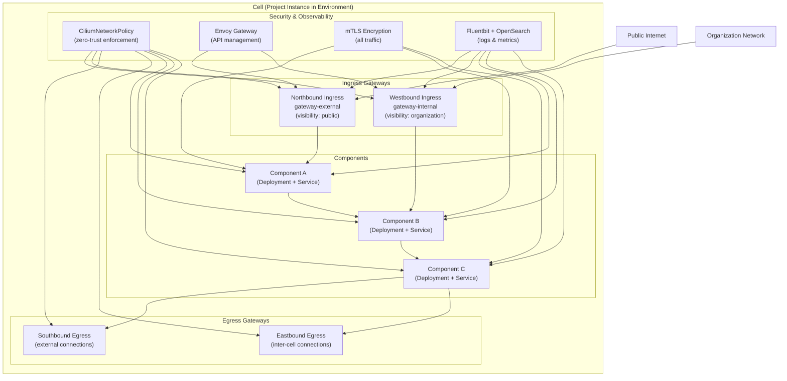

# Architecture

> **Relevant source files**
> * [PROJECT](https://github.com/openchoreo/openchoreo/blob/a577e969/PROJECT)
> * [README.md](https://github.com/openchoreo/openchoreo/blob/a577e969/README.md)
> * [cmd/main.go](https://github.com/openchoreo/openchoreo/blob/a577e969/cmd/main.go)
> * [config/crd/kustomization.yaml](https://github.com/openchoreo/openchoreo/blob/a577e969/config/crd/kustomization.yaml)
> * [config/rbac/kustomization.yaml](https://github.com/openchoreo/openchoreo/blob/a577e969/config/rbac/kustomization.yaml)
> * [config/rbac/role.yaml](https://github.com/openchoreo/openchoreo/blob/a577e969/config/rbac/role.yaml)
> * [config/samples/kustomization.yaml](https://github.com/openchoreo/openchoreo/blob/a577e969/config/samples/kustomization.yaml)
> * [docs/images/openchoreo-cell-runtime-view.png](https://github.com/openchoreo/openchoreo/blob/a577e969/docs/images/openchoreo-cell-runtime-view.png)
> * [docs/images/openchoreo-ddd-to-cell-mapping.png](https://github.com/openchoreo/openchoreo/blob/a577e969/docs/images/openchoreo-ddd-to-cell-mapping.png)
> * [docs/images/openchoreo-development-abstractions.png](https://github.com/openchoreo/openchoreo/blob/a577e969/docs/images/openchoreo-development-abstractions.png)
> * [docs/images/openchoreo-overall-architecture.png](https://github.com/openchoreo/openchoreo/blob/a577e969/docs/images/openchoreo-overall-architecture.png)
> * [docs/images/openchoreo-platform-abstractions.png](https://github.com/openchoreo/openchoreo/blob/a577e969/docs/images/openchoreo-platform-abstractions.png)

## Purpose and Scope

This document provides an overview of OpenChoreo's architectural patterns, design principles, and system organization. It covers the three-plane architecture, controller-based reconciliation model, Custom Resource Definitions (CRDs), and how these components interact to deliver an Internal Developer Platform.

For detailed information about specific subsystems:

* Platform abstractions (Organization, DataPlane, Environment): see [Platform Abstractions](/openchoreo/openchoreo/2.1-platform-abstractions)
* Cell runtime security and networking: see [Cell Runtime Model](/openchoreo/openchoreo/2.2-cell-runtime-model)
* Cross-cluster communication: see [Multi-Cluster Architecture](/openchoreo/openchoreo/2.3-multi-cluster-architecture)
* Individual controllers: see [Controller Manager](/openchoreo/openchoreo/2.4-controller-manager)

---

## Three-Plane Architecture

OpenChoreo separates concerns across three distinct Kubernetes clusters, each with specialized responsibilities:

**Control Plane**: Hosts the controller manager and API service. All OpenChoreo CRDs live here. Controllers watch for changes and orchestrate actions across the other planes. The control plane cluster stores the desired state and reconciles it continuously.

**Build Plane**: Dedicated to build execution. The `BuildPlane` CRD references an external cluster where Argo Workflows runs. Controllers trigger workflow executions by creating Argo `Workflow` resources remotely. Build artifacts (container images) are pushed to a registry accessible to the Data Plane.

**Data Plane**: Runs application workloads. The `DataPlane` CRD references a cluster where user applications are deployed. Controllers provision Kubernetes resources (`Deployment`, `Service`, `ConfigMap`), Gateway API resources (`HTTPRoute`, `SecurityPolicy`), and network policies (`CiliumNetworkPolicy`) in this cluster.

**Sources:**

* [README.md L120-L126](https://github.com/openchoreo/openchoreo/blob/a577e969/README.md#L120-L126)
* [cmd/main.go L1-L410](https://github.com/openchoreo/openchoreo/blob/a577e969/cmd/main.go#L1-L410)
* [api/v1alpha1](https://github.com/openchoreo/openchoreo/blob/a577e969/api/v1alpha1)  (CRD definitions)

---

## Controller Manager and Reconciliation Pattern

OpenChoreo uses the Kubernetes controller pattern. A single manager binary registers multiple reconcilers, each responsible for a specific CRD.

### Key Architectural Patterns

**Single Manager Binary**: The `main()` function in [cmd/main.go L79-L409](https://github.com/openchoreo/openchoreo/blob/a577e969/cmd/main.go#L79-L409)

 initializes a controller-runtime manager and registers all reconcilers. This ensures shared configuration, metrics, and health checks.

**Scheme Registration**: All API types are registered into a runtime scheme [cmd/main.go L66-L76](https://github.com/openchoreo/openchoreo/blob/a577e969/cmd/main.go#L66-L76)

 This includes OpenChoreo CRDs, Gateway API types, Cilium types, and Argo Workflow types, enabling the manager to work with resources across multiple APIs.

**Reconciler Pattern**: Each reconciler implements a `Reconcile(ctx, req)` method that:

1. Fetches the resource by name
2. Computes desired state
3. Applies changes to achieve desired state
4. Updates status subresource
5. Requeues if needed

**Leader Election**: The manager supports leader election [cmd/main.go L155](https://github.com/openchoreo/openchoreo/blob/a577e969/cmd/main.go#L155-L155)

 to enable high availability with multiple controller replicas.

| Reconciler | CRD | Namespace Scope | Primary Responsibility |
| --- | --- | --- | --- |
| `organization.Reconciler` | Organization | Cluster | Creates org namespace, sets up RBAC |
| `project.Reconciler` | Project | Namespaced | Creates project namespaces in org |
| `environment.Reconciler` | Environment | Namespaced | Manages environment metadata |
| `dataplane.Reconciler` | DataPlane | Namespaced | Tracks data plane cluster connection |
| `buildplane.BuildPlaneReconciler` | BuildPlane | Namespaced | Tracks build plane cluster connection |
| `component.Reconciler` | Component | Namespaced | Orchestrates component lifecycle |
| `build.Reconciler` | Build | Namespaced | Triggers Argo Workflows in build plane |
| `deployment.Reconciler` | Deployment | Namespaced | Provisions workloads in data plane |
| `endpoint.Reconciler` | Endpoint | Namespaced | Creates Gateway API resources |
| `release.Reconciler` | Release | Namespaced | Applies arbitrary K8s resources |

**Sources:**

* [cmd/main.go L79-L409](https://github.com/openchoreo/openchoreo/blob/a577e969/cmd/main.go#L79-L409)
* [PROJECT L1-L202](https://github.com/openchoreo/openchoreo/blob/a577e969/PROJECT#L1-L202)  (CRD definitions)
* [config/rbac/role.yaml L1-L227](https://github.com/openchoreo/openchoreo/blob/a577e969/config/rbac/role.yaml#L1-L227)  (RBAC permissions)

---

## Custom Resource Hierarchy

OpenChoreo CRDs form a logical hierarchy that mirrors organizational structure and application deployment workflows:

### Organizational Layer

Resources that define the platform structure:

* **Organization** (cluster-scoped): Top-level tenant. Contains all other resources for an org. [api/v1alpha1/organization_types.go](https://github.com/openchoreo/openchoreo/blob/a577e969/api/v1alpha1/organization_types.go)
* **Project**: A bounded context containing components. Maps to namespaces in data planes. [api/v1alpha1/project_types.go](https://github.com/openchoreo/openchoreo/blob/a577e969/api/v1alpha1/project_types.go)
* **Environment**: Runtime context (dev/test/prod). [api/v1alpha1/environment_types.go](https://github.com/openchoreo/openchoreo/blob/a577e969/api/v1alpha1/environment_types.go)
* **DataPlane**: Reference to a Kubernetes cluster for running workloads. [api/v1alpha1/dataplane_types.go](https://github.com/openchoreo/openchoreo/blob/a577e969/api/v1alpha1/dataplane_types.go)
* **BuildPlane**: Reference to a Kubernetes cluster for build execution. [api/v1alpha1/buildplane_types.go](https://github.com/openchoreo/openchoreo/blob/a577e969/api/v1alpha1/buildplane_types.go)
* **DeploymentPipeline**: Defines promotion rules across environments. [api/v1alpha1/deploymentpipeline_types.go](https://github.com/openchoreo/openchoreo/blob/a577e969/api/v1alpha1/deploymentpipeline_types.go)

### Application Layer

Resources that define application components:

* **Component**: Base resource for deployable units. [api/v1alpha1/component_types.go](https://github.com/openchoreo/openchoreo/blob/a577e969/api/v1alpha1/component_types.go)
* **API / Service / WebApplication / ScheduledTask**: Typed specializations of Component [api/v1alpha1/api_types.go](https://github.com/openchoreo/openchoreo/blob/a577e969/api/v1alpha1/api_types.go)  etc.
* **Class Resources** (APIClass, etc.): Templates that define defaults for component types
* **Binding Resources** (APIBinding, etc.): Bind component instances to environments with deployment state

**Class-Instance-Binding Pattern**: Components are instantiated from a Class (template), then bound to environments via Binding resources. The binding tracks deployment state (active/suspended/undeployed).

### Build and Deployment Layer

Resources that manage the software delivery lifecycle:

* **Build**: Triggers a build in the build plane. [api/v1alpha1/build_types.go](https://github.com/openchoreo/openchoreo/blob/a577e969/api/v1alpha1/build_types.go)
* **DeployableArtifact**: Output of a build, containing workload specs and metadata. [api/v1alpha1/deployableartifact_types.go](https://github.com/openchoreo/openchoreo/blob/a577e969/api/v1alpha1/deployableartifact_types.go)
* **Workload**: Individual workload specification within a DeployableArtifact. [api/v1alpha1/workload_types.go](https://github.com/openchoreo/openchoreo/blob/a577e969/api/v1alpha1/workload_types.go)
* **DeploymentTrack**: Represents a deployment target (environment + data plane). [api/v1alpha1/deploymenttrack_types.go](https://github.com/openchoreo/openchoreo/blob/a577e969/api/v1alpha1/deploymenttrack_types.go)
* **Deployment**: Provisions workloads in a data plane. [api/v1alpha1/deployment_types.go](https://github.com/openchoreo/openchoreo/blob/a577e969/api/v1alpha1/deployment_types.go)
* **Endpoint**: Network-accessible interface for a component. [api/v1alpha1/endpoint_types.go](https://github.com/openchoreo/openchoreo/blob/a577e969/api/v1alpha1/endpoint_types.go)
* **Release**: Server-side apply of arbitrary Kubernetes resources. [api/v1alpha1/release_types.go](https://github.com/openchoreo/openchoreo/blob/a577e969/api/v1alpha1/release_types.go)

**Sources:**

* [api/v1alpha1/](https://github.com/openchoreo/openchoreo/blob/a577e969/api/v1alpha1/)  (all CRD type definitions)
* [config/crd/kustomization.yaml L1-L48](https://github.com/openchoreo/openchoreo/blob/a577e969/config/crd/kustomization.yaml#L1-L48)
* [PROJECT L10-L201](https://github.com/openchoreo/openchoreo/blob/a577e969/PROJECT#L10-L201)

---

## API Service Layer

The OpenChoreo API service provides an HTTP abstraction over Kubernetes Custom Resources, enabling easier integration for CLIs, UIs, and external systems.

### Service Layer Architecture

The API service is organized into domain-specific services that encapsulate business logic:

| Service | Responsibilities | Multi-Cluster |
| --- | --- | --- |
| ComponentService | Component promotion, binding state management | No |
| BuildService | Build triggering, status queries | No |
| ProjectService | Project creation, metadata management | No |
| DataPlaneService | Data plane registration, resource queries | Yes |
| BuildPlaneService | Build plane registration, template queries | Yes |
| EnvironmentService | Environment management | No |
| OrganizationService | Organization setup | No |

**HTTP Handler Layer**: Receives requests, validates input, delegates to service layer, formats responses. Handles authentication/authorization before reaching services.

**Service Layer**: Encapsulates business logic. Uses `controller-runtime` client to perform CRUD operations on CRDs in the control plane.

**Multi-Cluster Services**: `DataPlaneService` and `BuildPlaneService` manage connections to external clusters. They use the `KubeMultiClientManager` (see [Multi-Cluster Architecture](/openchoreo/openchoreo/2.3-multi-cluster-architecture)) to communicate with build and data plane clusters.

**Component Promotion Workflow**: The `ComponentService` implements component promotion logic, which validates that the component's `DeploymentPipeline` allows promotion from the source to target environment before updating the component's binding.

**Sources:**

* [internal/api/](https://github.com/openchoreo/openchoreo/blob/a577e969/internal/api/)  (API service implementation)
* [README.md L120-L135](https://github.com/openchoreo/openchoreo/blob/a577e969/README.md#L120-L135)

---

## Build Pipeline Architecture

OpenChoreo orchestrates container image builds using Argo Workflows in a dedicated build plane cluster.

### Build System Components

**Build Controller** ([internal/controller/build](https://github.com/openchoreo/openchoreo/blob/a577e969/internal/controller/build)

): Watches `Build` CRs and delegates to the `Builder` service.

**Builder Service** ([internal/build/builder](https://github.com/openchoreo/openchoreo/blob/a577e969/internal/build/builder)

): Abstraction over build engines. Maintains a registry of `BuildEngine` implementations (currently only Argo).

**BuildEngine Interface**: Defines `SubmitBuild()`, `GetBuildStatus()`, `CancelBuild()` methods. The `ArgoEngine` implements this interface.

**ArgoEngine** ([internal/build/argo](https://github.com/openchoreo/openchoreo/blob/a577e969/internal/build/argo)

): Translates `Build` CRs into Argo `Workflow` resources. Fetches `ClusterWorkflowTemplate` from the build plane, renders it with build parameters, and submits it.

**KubeMultiClientManager**: Provides authenticated clients for external clusters. The `ArgoEngine` uses this to interact with the build plane cluster.

### Workflow Execution

Argo Workflows execute a four-step pipeline:

1. **clone-step**: Uses `alpine/git` to clone the source repository
2. **build-step**: Executes buildpack (Ballerina, React, Docker, GCP) using `podman-runner`
3. **push-step**: Pushes the built image to a container registry using `podman-runner`
4. **workload-create-step**: Uses `openchoreo-cli` to generate a `Workload` CR from the build output

**Caching**: Builds use a HostPath volume (`/shared/podman/cache`) for layer caching across builds.

**Workspace**: A PersistentVolume is shared between steps to pass artifacts (cloned code, built image, workload spec).

**Sources:**

* [internal/controller/build/](https://github.com/openchoreo/openchoreo/blob/a577e969/internal/controller/build/)
* [internal/build/builder/](https://github.com/openchoreo/openchoreo/blob/a577e969/internal/build/builder/)
* [internal/build/argo/](https://github.com/openchoreo/openchoreo/blob/a577e969/internal/build/argo/)
* Build Plane Diagram (provided context)

---

## Deployment Pipeline Architecture

The deployment system provisions application workloads in data plane clusters and exposes them via Gateway API.

### Deployment Controller

The `deployment.Reconciler` ([internal/controller/deployment](https://github.com/openchoreo/openchoreo/blob/a577e969/internal/controller/deployment)

) orchestrates workload provisioning:

1. **Fetch Context**: Uses the `hierarchy` package to resolve `Environment`, `Project`, `DataPlane` from labels
2. **Reconcile External Resources**: Delegates to `ResourceHandler` implementations for each resource type (Namespace, Deployment, Service, ConfigMap, NetworkPolicy)
3. **Reconcile Endpoints**: Creates/updates `Endpoint` CRs based on `EndpointTemplate` specs in the `DeployableArtifact`

**ResourceHandler Pattern**: Each Kubernetes resource type has a handler implementing `Create()`, `Update()`, `Delete()` methods. Handlers compute the desired state and apply changes to the data plane cluster.

| Handler | Provisions |
| --- | --- |
| NamespaceHandler | Project namespace in data plane |
| DeploymentHandler | Kubernetes Deployment for workloads |
| ServiceHandler | Kubernetes Service for workloads |
| ConfigMapHandler | ConfigMap with environment variables |
| NetworkPolicyHandler | CiliumNetworkPolicy for zero-trust |
| SecretProviderClassHandler | SecretProviderClass for external secrets |

### Endpoint Controller

The `endpoint.Reconciler` ([internal/controller/endpoint](https://github.com/openchoreo/openchoreo/blob/a577e969/internal/controller/endpoint)

) translates `Endpoint` CRs into Gateway API resources:

1. **Determine Visibility**: Based on `Endpoint.Spec.Visibility` (public/organization/project), selects the appropriate gateway
2. **Create HTTPRoute**: Maps HTTP paths to backend services
3. **Create SecurityPolicy**: Applies OAuth2 authentication if configured
4. **Create HTTPRouteFilter**: Adds request/response transformations
5. **Create BackendTrafficPolicy**: Configures timeout, retry, circuit breaker settings

**Gateway Selection**:

* `visibility: public` → Routes to `gateway-external` (public internet)
* `visibility: organization` → Routes to `gateway-internal` (org-internal)

### Release Controller

The `release.Reconciler` ([internal/controller/release](https://github.com/openchoreo/openchoreo/blob/a577e969/internal/controller/release)

) applies arbitrary Kubernetes resources using server-side apply:

1. **Parse Resources**: Reads YAML manifests from `Release.Spec.Resources`
2. **Apply**: Uses server-side apply with field manager `openchoreo-release-controller`
3. **Track Inventory**: Maintains a list of applied resources in `Release.Status.Inventory`
4. **Prune**: Deletes resources in inventory that are no longer in the spec

**Sources:**

* [internal/controller/deployment/](https://github.com/openchoreo/openchoreo/blob/a577e969/internal/controller/deployment/)
* [internal/controller/endpoint/](https://github.com/openchoreo/openchoreo/blob/a577e969/internal/controller/endpoint/)
* [internal/controller/release/](https://github.com/openchoreo/openchoreo/blob/a577e969/internal/controller/release/)
* [internal/controller/hierarchy/](https://github.com/openchoreo/openchoreo/blob/a577e969/internal/controller/hierarchy/)
* Deployment Diagram (provided context)

---

## Cell-Based Runtime Model

OpenChoreo implements a **Cell** runtime architecture where each `Project` is deployed as an isolated, secure unit with explicit ingress/egress control.

### Cell Characteristics

**Isolation Boundary**: Each Cell (Project) runs in its own Kubernetes namespace with dedicated network policies. Components within a Cell can communicate freely; communication across Cells is explicitly declared.

**Directional Traffic Paths**:

* **Northbound Ingress**: External (internet) traffic to `Endpoint` resources with `visibility: public`
* **Westbound Ingress**: Organization-internal traffic to `Endpoint` resources with `visibility: organization`
* **Southbound Egress**: Outbound traffic from components to external services (internet)
* **Eastbound Egress**: Outbound traffic from components to other Cells or internal services

**Zero-Trust Security**: All traffic is governed by `CiliumNetworkPolicy` resources that enforce:

* Ingress rules based on endpoint visibility
* Egress rules based on declared `Connection` resources
* Default-deny policy for undeclared communication

**API Management**: Envoy Gateway provides:

* Routing based on HTTP path and headers
* Rate limiting, authentication (OAuth2), and authorization
* Request/response transformation
* Observability (metrics, traces)

**mTLS Encryption**: All communication, including intra-Cell component-to-component traffic, is encrypted using mutual TLS.

**Built-in Observability**: Each Cell is instrumented with:

* Fluentbit log collectors shipping to OpenSearch
* Metrics scraped by Prometheus
* Distributed tracing via OpenTelemetry

### Mapping Domain-Driven Design to Infrastructure

The Cell model enforces **Domain-Driven Design** principles at the infrastructure level:

| DDD Concept | OpenChoreo Mapping |
| --- | --- |
| Bounded Context | Project (Cell) |
| Aggregate | Component |
| Domain Event | Outbound Connection |
| Published Language | Endpoint (API contract) |
| Anti-Corruption Layer | Gateway with transformation filters |

**Sources:**

* [README.md L66-L119](https://github.com/openchoreo/openchoreo/blob/a577e969/README.md#L66-L119)
* Endpoint controller implementation (inferred from RBAC)
* [config/rbac/role.yaml L64-L101](https://github.com/openchoreo/openchoreo/blob/a577e969/config/rbac/role.yaml#L64-L101)  (Gateway API and Cilium permissions)
* Cell Runtime Diagram (provided context)

---

## Summary

OpenChoreo's architecture delivers a production-grade Internal Developer Platform through:

1. **Three-plane separation**: Control, Build, and Data planes for scalability and security isolation
2. **Controller-based reconciliation**: Kubernetes-native operators ensuring continuous state convergence
3. **Hierarchical CRD model**: Organization → Project → Component → Deployment abstractions matching org structure
4. **HTTP API abstraction**: Developer-friendly interface over Kubernetes primitives
5. **Pluggable build system**: Argo Workflows with extensible buildpack support
6. **Gateway-based networking**: Envoy Gateway for API management with zero-trust policies
7. **Cell runtime**: DDD-aligned isolation with explicit traffic boundaries

This architecture enables platform teams to provide self-service application deployment while maintaining security, observability, and operational control.

**Sources:**

* [README.md L1-L176](https://github.com/openchoreo/openchoreo/blob/a577e969/README.md#L1-L176)
* [cmd/main.go L1-L410](https://github.com/openchoreo/openchoreo/blob/a577e969/cmd/main.go#L1-L410)
* All architecture diagrams provided in context