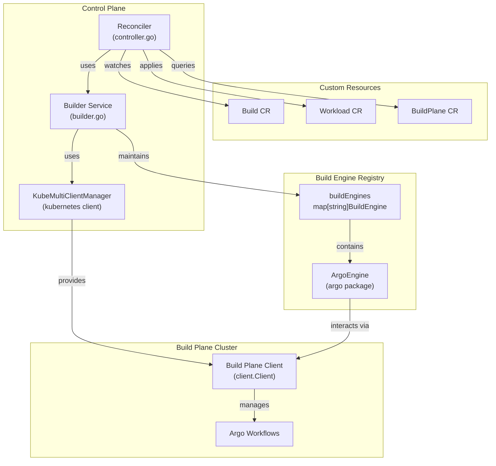
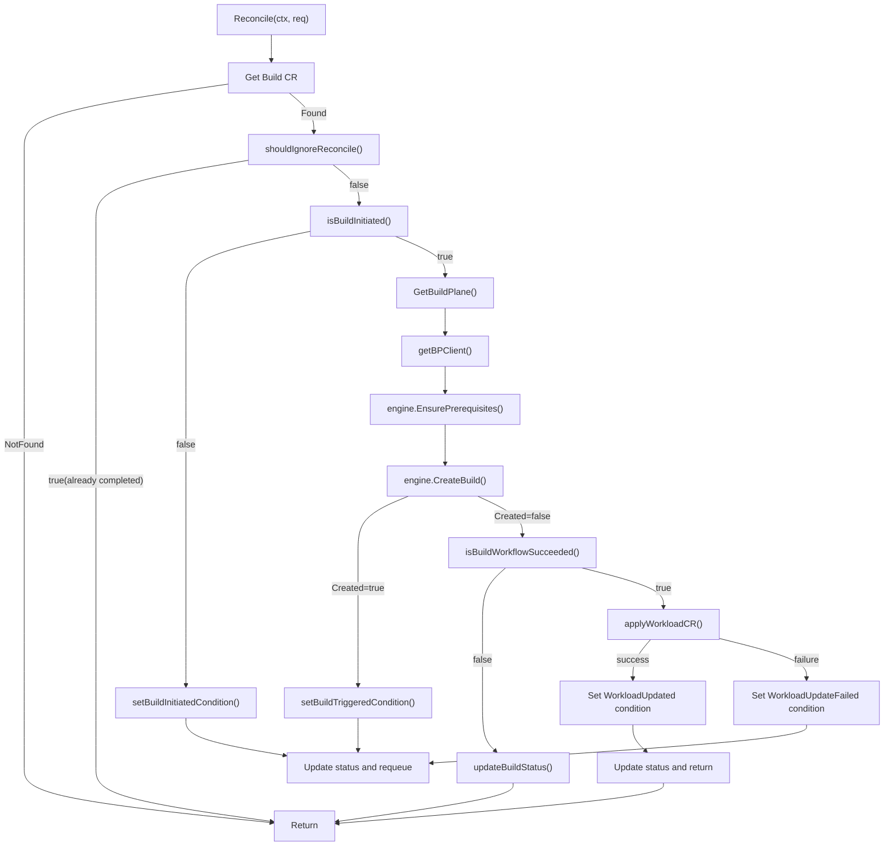
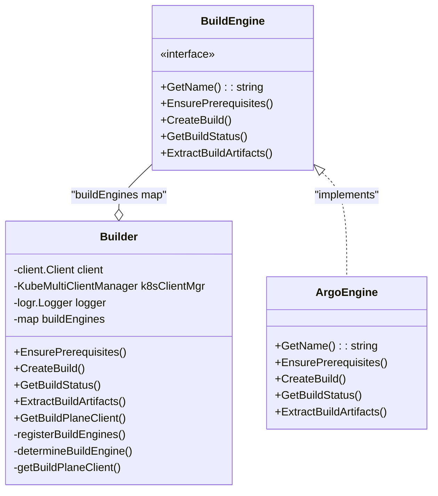
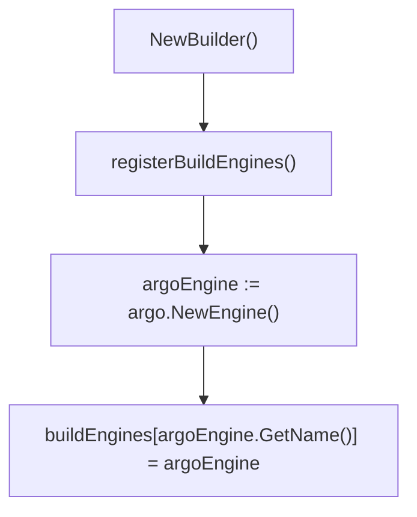
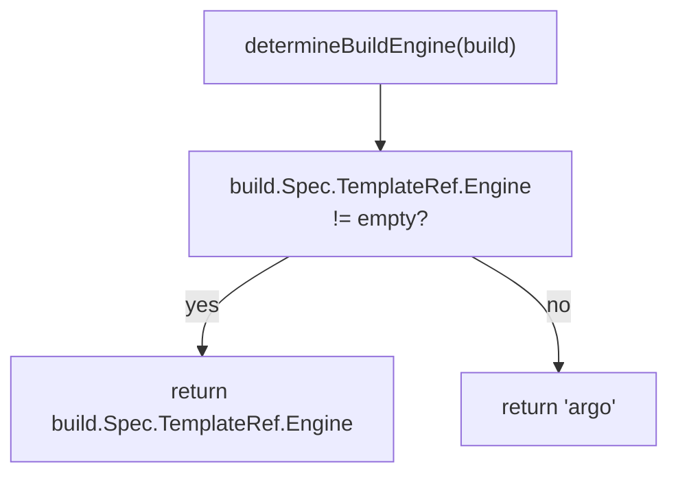
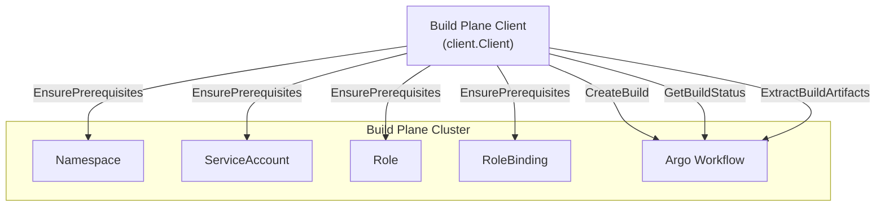

# Build Controller

> **Relevant source files**
> * [internal/controller/build/builder.go](https://github.com/openchoreo/openchoreo/blob/a577e969/internal/controller/build/builder.go)
> * [internal/controller/build/controller.go](https://github.com/openchoreo/openchoreo/blob/a577e969/internal/controller/build/controller.go)
> * [internal/controller/build/controller_conditions.go](https://github.com/openchoreo/openchoreo/blob/a577e969/internal/controller/build/controller_conditions.go)
> * [internal/dataplane/kubernetes/name.go](https://github.com/openchoreo/openchoreo/blob/a577e969/internal/dataplane/kubernetes/name.go)

The Build Controller manages the lifecycle of `Build` custom resources in OpenChoreo. It orchestrates the build process by delegating to the Builder service, which uses a pluggable BuildEngine architecture to execute builds in the Build Plane cluster. For information about the overall build system architecture, see [Build System](/openchoreo/openchoreo/3-build-system).

The controller follows the Kubernetes operator pattern, implementing a reconciliation loop that monitors `Build` resources, coordinates with the Build Plane via cross-cluster clients, and manages the resulting `Workload` resources.

Sources: [internal/controller/build/controller.go L1-L287](https://github.com/openchoreo/openchoreo/blob/a577e969/internal/controller/build/controller.go#L1-L287)

## Architecture Overview

The Build Controller consists of three main layers: the `Reconciler` that implements the reconciliation loop, the `Builder` service that abstracts build operations, and the `BuildEngine` interface that provides pluggable build implementations.

### Component Architecture



Sources: [internal/controller/build/controller.go L30-L37](https://github.com/openchoreo/openchoreo/blob/a577e969/internal/controller/build/controller.go#L30-L37)

 [internal/controller/build/builder.go L23-L44](https://github.com/openchoreo/openchoreo/blob/a577e969/internal/controller/build/builder.go#L23-L44)

### Reconciler Structure

The `Reconciler` struct implements the controller-runtime reconciliation interface:

| Field | Type | Purpose |
| --- | --- | --- |
| `Client` | `client.Client` | Kubernetes client for the control plane |
| `IsGitOpsMode` | `bool` | Indicates whether GitOps mode is enabled |
| `Scheme` | `*runtime.Scheme` | Runtime scheme for API types |
| `engine` | `*Builder` | Builder service instance |

Sources: [internal/controller/build/controller.go L30-L37](https://github.com/openchoreo/openchoreo/blob/a577e969/internal/controller/build/controller.go#L30-L37)

## Reconciliation Loop

The `Reconcile` method implements the main reconciliation logic, progressing through several phases based on status conditions.

### Reconciliation Flow



Sources: [internal/controller/build/controller.go L45-L115](https://github.com/openchoreo/openchoreo/blob/a577e969/internal/controller/build/controller.go#L45-L115)

### Reconciliation Phases

The reconciliation process progresses through distinct phases, tracked by status conditions:

| Phase | Condition | Description |
| --- | --- | --- |
| Initialization | `BuildInitiated` | Build CR acknowledged, initial setup |
| Triggering | `BuildTriggered` | Build workflow created in Build Plane |
| Monitoring | `BuildCompleted` | Workflow execution monitored (Running/Succeeded/Failed) |
| Finalization | `WorkloadUpdated` | Workload CR applied to control plane |

Sources: [internal/controller/build/controller_conditions.go L14-L31](https://github.com/openchoreo/openchoreo/blob/a577e969/internal/controller/build/controller_conditions.go#L14-L31)

### Status Update Flow

The controller monitors the build status in the Build Plane and updates the Build CR accordingly:

```mermaid
sequenceDiagram
  participant Reconciler.Reconcile()
  participant Builder.GetBuildStatus()
  participant Build Plane Client
  participant ArgoEngine

  Reconciler.Reconcile()->>Builder.GetBuildStatus(): GetBuildStatus(ctx, build, bpClient)
  Builder.GetBuildStatus()->>ArgoEngine: GetBuildStatus(ctx, bpClient, build)
  ArgoEngine->>Build Plane Client: Get Workflow resource
  Build Plane Client-->>ArgoEngine: Workflow status
  ArgoEngine-->>Builder.GetBuildStatus(): BuildStatus{Phase, Message}
  Builder.GetBuildStatus()-->>Reconciler.Reconcile(): BuildStatus
  loop [Phase = Running]
    Reconciler.Reconcile()->>Reconciler.Reconcile(): setBuildInProgressCondition()
    Reconciler.Reconcile()->>Reconciler.Reconcile(): RequeueAfter(20s)
    Reconciler.Reconcile()->>Reconciler.Reconcile(): setBuildCompletedCondition()
    Reconciler.Reconcile()->>Builder.GetBuildStatus(): ExtractBuildArtifacts()
    Builder.GetBuildStatus()-->>Reconciler.Reconcile(): BuildArtifacts{Image, WorkloadCR}
    Reconciler.Reconcile()->>Reconciler.Reconcile(): Update ImageStatus
    Reconciler.Reconcile()->>Reconciler.Reconcile(): setBuildFailedCondition()
  end
```

Sources: [internal/controller/build/controller.go L240-L273](https://github.com/openchoreo/openchoreo/blob/a577e969/internal/controller/build/controller.go#L240-L273)

## Builder Service

The `Builder` struct provides a service layer that abstracts build operations and manages the BuildEngine registry. It separates the controller's reconciliation logic from the actual build execution details.

### Builder Structure



Sources: [internal/controller/build/builder.go L23-L44](https://github.com/openchoreo/openchoreo/blob/a577e969/internal/controller/build/builder.go#L23-L44)

### Builder Methods

The Builder provides high-level methods that delegate to the appropriate BuildEngine:

| Method | Parameters | Purpose |
| --- | --- | --- |
| `EnsurePrerequisites` | `ctx`, `build`, `bpClient` | Creates namespace, ServiceAccount, RBAC in Build Plane |
| `CreateBuild` | `ctx`, `build`, `bpClient` | Creates or retrieves build workflow |
| `GetBuildStatus` | `ctx`, `build`, `bpClient` | Queries current build status |
| `ExtractBuildArtifacts` | `ctx`, `build`, `bpClient` | Retrieves image name and Workload CR from completed build |
| `GetBuildPlaneClient` | `ctx`, `buildPlane` | Obtains cross-cluster client for Build Plane |

Sources: [internal/controller/build/builder.go L57-L145](https://github.com/openchoreo/openchoreo/blob/a577e969/internal/controller/build/builder.go#L57-L145)

## BuildEngine Registry Pattern

The Builder maintains a registry of BuildEngine implementations, allowing for pluggable build backends. Currently, only the Argo Workflows engine is implemented.

### Engine Registration



The `registerBuildEngines` method is called during Builder initialization:

```go
// From builder.go:46-55
func (s *Builder) registerBuildEngines() {
	// Register Argo engine
	argoEngine := argo.NewEngine()
	s.buildEngines[argoEngine.GetName()] = argoEngine

	// Future engines can be registered here:
	// tektonEngine := tekton.NewEngine()
	// s.buildEngines[tektonEngine.GetName()] = tektonEngine
}
```

Sources: [internal/controller/build/builder.go L46-L55](https://github.com/openchoreo/openchoreo/blob/a577e969/internal/controller/build/builder.go#L46-L55)

### Engine Selection

The `determineBuildEngine` method selects which engine to use based on the Build spec:



Sources: [internal/controller/build/builder.go L193-L201](https://github.com/openchoreo/openchoreo/blob/a577e969/internal/controller/build/builder.go#L193-L201)

### BuildEngine Interface

The `BuildEngine` interface defines the contract that all build engines must implement:

| Method | Return Type | Purpose |
| --- | --- | --- |
| `GetName()` | `string` | Returns the engine name (e.g., "argo") |
| `EnsurePrerequisites()` | `error` | Creates required resources in Build Plane |
| `CreateBuild()` | `BuildCreationResponse, error` | Creates build workflow |
| `GetBuildStatus()` | `BuildStatus, error` | Returns current build phase and message |
| `ExtractBuildArtifacts()` | `*BuildArtifacts, error` | Extracts image and Workload CR from completed build |

This abstraction allows future integration with other build systems (e.g., Tekton Pipelines) without modifying the controller logic.

Sources: [internal/controller/build/engines/interface.go](https://github.com/openchoreo/openchoreo/blob/a577e969/internal/controller/build/engines/interface.go)

 (referenced in builder.go)

## Cross-Cluster Communication

The Build Controller communicates with the Build Plane cluster using the `KubeMultiClientManager`, which manages Kubernetes clients for multiple clusters.

### Client Acquisition Flow

```mermaid
sequenceDiagram
  participant Reconciler
  participant controller.GetBuildPlane()
  participant Builder
  participant KubeMultiClientManager
  participant kubernetes.GetK8sClient()

  Reconciler->>controller.GetBuildPlane(): GetBuildPlane(ctx, client, build)
  controller.GetBuildPlane()-->>Reconciler: BuildPlane CR
  Reconciler->>Builder: GetBuildPlaneClient(ctx, buildPlane)
  Builder->>kubernetes.GetK8sClient(): GetK8sClient(k8sClientMgr, namespace, name, kubernetesCluster)
  kubernetes.GetK8sClient()->>KubeMultiClientManager: Get or create client for cluster
  KubeMultiClientManager-->>kubernetes.GetK8sClient(): client.Client
  kubernetes.GetK8sClient()-->>Builder: Build Plane client
  Builder-->>Reconciler: Build Plane client
  Reconciler->>Builder: CreateBuild(ctx, build, bpClient)
  Builder->>Builder: Select engine from registry
  Builder->>Builder: engine.CreateBuild(ctx, bpClient, build)
```

The `GetBuildPlane` function (from the controller package) uses labels to find the BuildPlane resource for the Build's organization:

```python
// Conceptual flow from controller.go:73-77
buildPlane, err := controller.GetBuildPlane(ctx, r.Client, build)
bpClient, err := r.getBPClient(ctx, buildPlane)
```

Sources: [internal/controller/build/controller.go L73-L84](https://github.com/openchoreo/openchoreo/blob/a577e969/internal/controller/build/controller.go#L73-L84)

 [internal/controller/build/builder.go L218-L226](https://github.com/openchoreo/openchoreo/blob/a577e969/internal/controller/build/builder.go#L218-L226)

### Build Plane Operations

Once the Build Plane client is obtained, the Builder performs operations in the remote cluster:



Sources: [internal/controller/build/builder.go L57-L70](https://github.com/openchoreo/openchoreo/blob/a577e969/internal/controller/build/builder.go#L57-L70)

 [internal/controller/build/builder.go L72-L87](https://github.com/openchoreo/openchoreo/blob/a577e969/internal/controller/build/builder.go#L72-L87)

## Status Conditions

The Build Controller tracks build progress through a series of status conditions:

| Condition Type | Status | Reason | Description |
| --- | --- | --- | --- |
| `BuildInitiated` | True | `BuildInitiated` | Build CR acknowledged and processing started |
| `BuildTriggered` | True | `BuildTriggered` | Workflow created in Build Plane |
| `BuildCompleted` | False | `BuildInProgress` | Workflow is executing |
| `BuildCompleted` | True | `BuildCompleted` | Workflow succeeded |
| `BuildCompleted` | False | `BuildFailed` | Workflow failed |
| `WorkloadUpdated` | True | `WorkloadUpdated` | Workload CR applied successfully |
| `WorkloadUpdated` | False | `WorkloadUpdateFailed` | Failed to apply Workload CR |

Conditions are managed using the `k8s.io/apimachinery/pkg/api/meta` package's `SetStatusCondition` and `FindStatusCondition` functions.

Sources: [internal/controller/build/controller_conditions.go L14-L31](https://github.com/openchoreo/openchoreo/blob/a577e969/internal/controller/build/controller_conditions.go#L14-L31)

 [internal/controller/build/controller_conditions.go L33-L108](https://github.com/openchoreo/openchoreo/blob/a577e969/internal/controller/build/controller_conditions.go#L33-L108)

### Condition Helpers

The controller provides helper functions to check and set conditions:

| Function | Purpose |
| --- | --- |
| `isBuildInitiated()` | Checks if `BuildInitiated` condition is True |
| `isBuildWorkflowSucceeded()` | Checks if `BuildCompleted` condition is True with reason `BuildCompleted` |
| `isBuildCompleted()` | Checks if build has reached terminal state (`WorkloadUpdated` = True) |
| `shouldIgnoreReconcile()` | Determines if reconciliation should be skipped (build already completed) |
| `setBuildInitiatedCondition()` | Sets `BuildInitiated` condition |
| `setBuildTriggeredCondition()` | Sets `BuildTriggered` condition |
| `setBuildInProgressCondition()` | Sets `BuildCompleted` = False with reason `BuildInProgress` |
| `setBuildCompletedCondition()` | Sets `BuildCompleted` = True |
| `setBuildFailedCondition()` | Sets `BuildCompleted` = False with reason `BuildFailed` |

Sources: [internal/controller/build/controller_conditions.go L110-L186](https://github.com/openchoreo/openchoreo/blob/a577e969/internal/controller/build/controller_conditions.go#L110-L186)

## Workload CR Application

After a successful build, the controller applies the Workload CR generated by the build process. The Workload CR is embedded in the workflow's output ConfigMap.

### Workload Application Flow

```mermaid
sequenceDiagram
  participant Reconciler.applyWorkloadCR()
  participant Builder.ExtractBuildArtifacts()
  participant Build Plane Client
  participant Control Plane API

  Reconciler.applyWorkloadCR()->>Builder.ExtractBuildArtifacts(): ExtractBuildArtifacts(ctx, build, bpClient)
  Builder.ExtractBuildArtifacts()->>Build Plane Client: Get workflow ConfigMap
  Build Plane Client-->>Builder.ExtractBuildArtifacts(): ConfigMap with Workload CR YAML
  Builder.ExtractBuildArtifacts()-->>Reconciler.applyWorkloadCR(): BuildArtifacts{Image, WorkloadCR}
  loop [WorkloadCR is empty]
    Reconciler.applyWorkloadCR()->>Reconciler.applyWorkloadCR(): Log warning and return
    Reconciler.applyWorkloadCR()->>Reconciler.applyWorkloadCR(): yaml.Unmarshal(WorkloadCR)
    Reconciler.applyWorkloadCR()->>Reconciler.applyWorkloadCR(): Set namespace = build.Namespace
    Reconciler.applyWorkloadCR()->>Control Plane API: Patch(workload, Apply, FieldOwner="build-controller")
    Control Plane API-->>Reconciler.applyWorkloadCR(): Success
    Reconciler.applyWorkloadCR()->>Reconciler.applyWorkloadCR(): Set WorkloadUpdated condition
  end
```

The controller uses server-side apply with field ownership to create or update the Workload CR:

```
// From controller.go:186-189
if err := r.Patch(ctx, workload, client.Apply, 
    client.FieldOwner(ControllerName), 
    client.ForceOwnership); err != nil {
    // handle error
}
```

Sources: [internal/controller/build/controller.go L161-L193](https://github.com/openchoreo/openchoreo/blob/a577e969/internal/controller/build/controller.go#L161-L193)

### Field Indexing

The controller sets up field indexes on Workload resources to enable efficient lookups by project and component:

| Index Key | Indexed Field | Purpose |
| --- | --- | --- |
| `spec.owner.projectName` | `Workload.Spec.Owner.ProjectName` | Find workloads by project |
| `spec.owner.componentName` | `Workload.Spec.Owner.ComponentName` | Find workloads by component |

These indexes are registered in `SetupWithManager`:

```
// From controller.go:133-142
if err := mgr.GetFieldIndexer().IndexField(ctx, &openchoreov1alpha1.Workload{}, 
    workloadProjectIndexKey,
    func(obj client.Object) []string {
        if wl, ok := obj.(*openchoreov1alpha1.Workload); ok {
            return []string{wl.Spec.Owner.ProjectName}
        }
        return nil
    }); err != nil {
    return fmt.Errorf("index owner.projectName: %w", err)
}
```

Sources: [internal/controller/build/controller.go L117-L153](https://github.com/openchoreo/openchoreo/blob/a577e969/internal/controller/build/controller.go#L117-L153)

## Auto-Deployment

The Build Controller supports automatic deployment of successful builds when `DeploymentTrack.Spec.AutoDeploy` is enabled:

1. Retrieves the target environment from the project's DeploymentPipeline
2. Checks for an existing Deployment in that environment
3. If found, updates it to reference the new build
4. If not found, creates a new Deployment

This feature streamlines the development workflow by automatically promoting new builds to the environment.

Sources: [internal/controller/build/controller.go L432-L491](https://github.com/openchoreo/openchoreo/blob/a577e969/internal/controller/build/controller.go#L432-L491)

## Integration Points

### With Argo Workflows

The Build Controller interacts with Argo Workflows to execute the build process:

1. Creates Argo Workflow resources with the appropriate build steps
2. Monitors workflow progress and extracts status information
3. Retrieves the final image name from workflow outputs

Sources: [internal/controller/build/controller.go L273-L305](https://github.com/openchoreo/openchoreo/blob/a577e969/internal/controller/build/controller.go#L273-L305)

 [internal/controller/build/controller.go L364-L406](https://github.com/openchoreo/openchoreo/blob/a577e969/internal/controller/build/controller.go#L364-L406)

### With Source Code Management

The Build Controller integrates with source code management systems (GitHub):

1. Fetches component configuration from the repository
2. Extracts endpoint configurations for service components
3. Supports authentication for private repositories

Sources: [internal/controller/build/controller.go L525-L585](https://github.com/openchoreo/openchoreo/blob/a577e969/internal/controller/build/controller.go#L525-L585)

### With Deployment System

The Build Controller integrates with the deployment system:

1. Creates DeployableArtifact resources that serve as immutable references to built images
2. Optionally creates or updates Deployment resources for auto-deployment
3. Ensures proper ownership references for garbage collection

Sources: [internal/controller/build/controller.go L408-L429](https://github.com/openchoreo/openchoreo/blob/a577e969/internal/controller/build/controller.go#L408-L429)

 [internal/controller/build/controller.go L446-L491](https://github.com/openchoreo/openchoreo/blob/a577e969/internal/controller/build/controller.go#L446-L491)