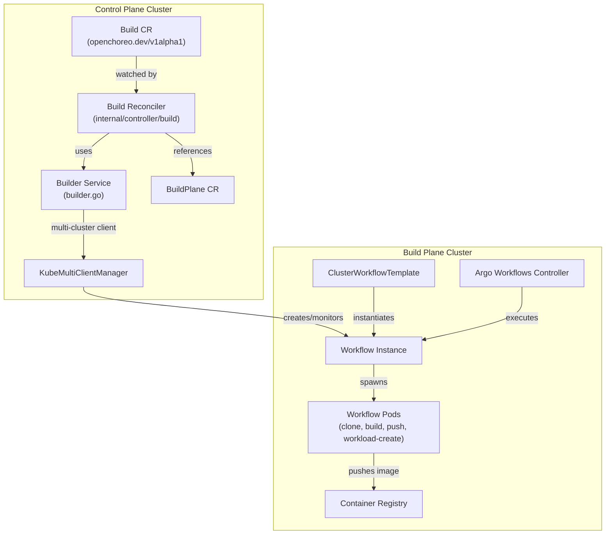
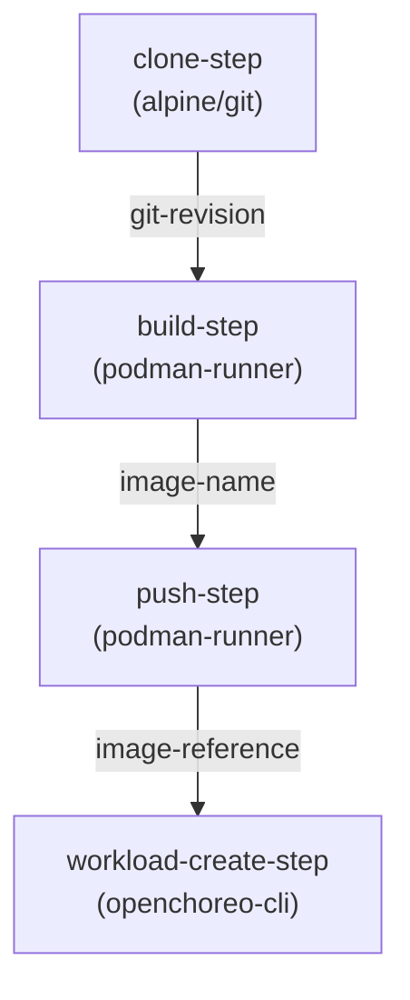
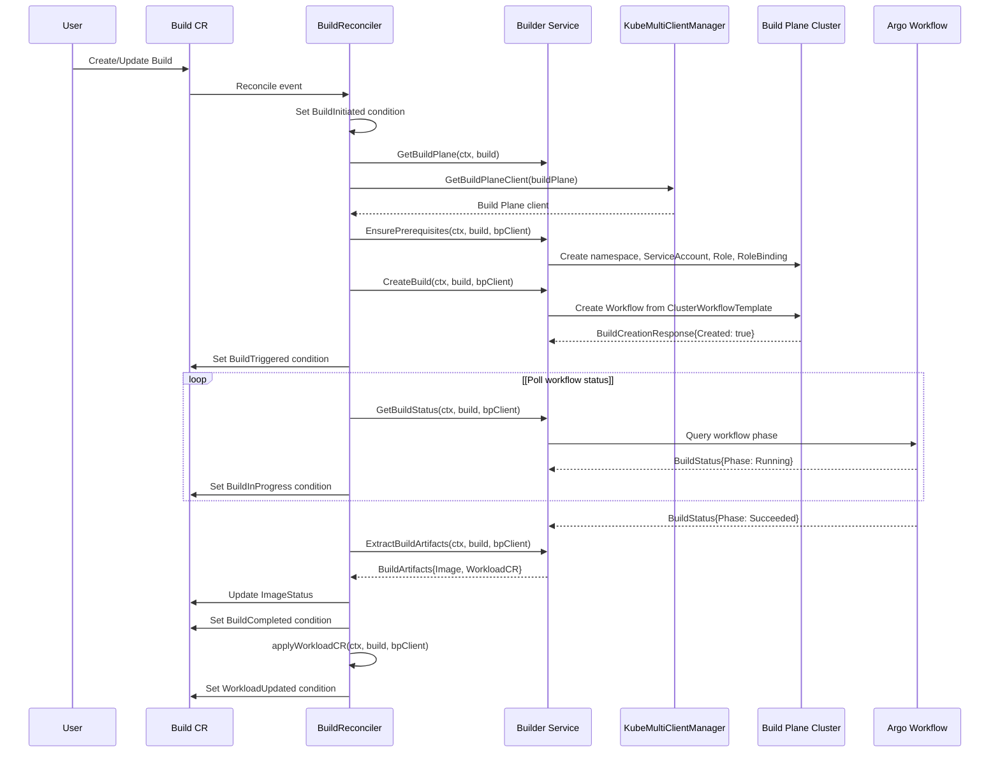
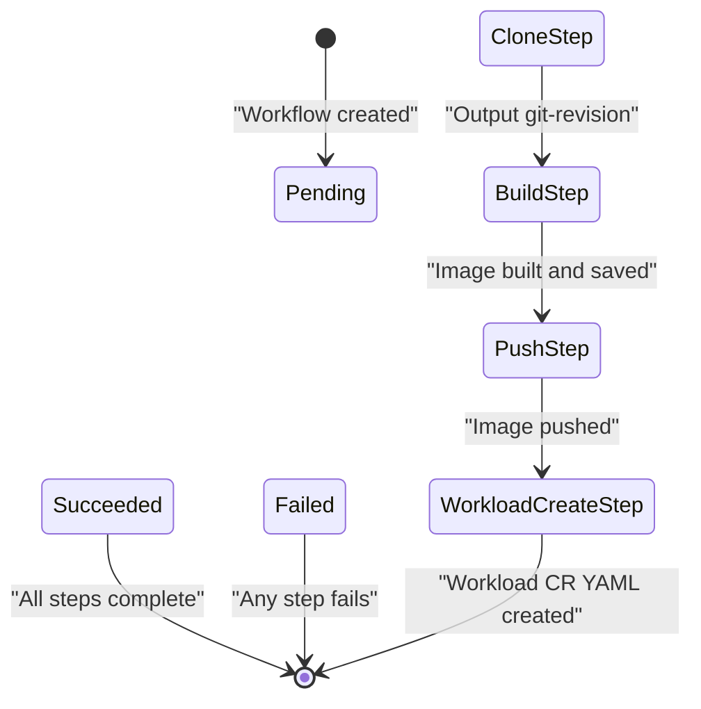
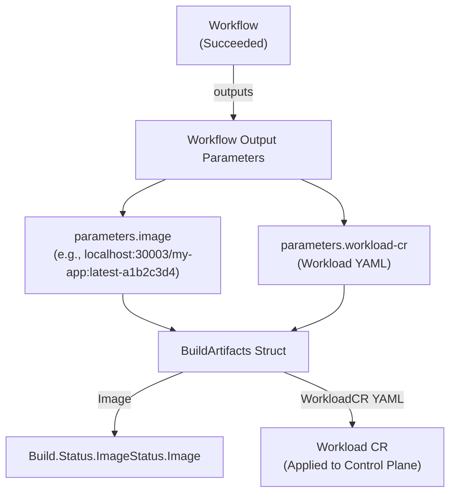
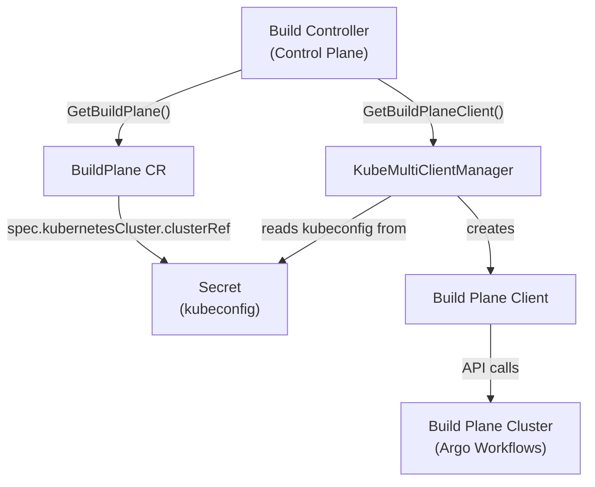
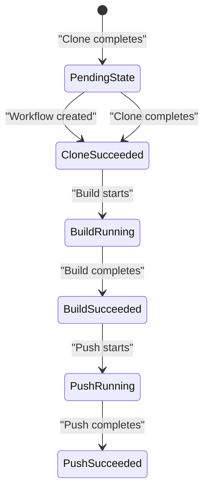

# Build Plane and Argo Integration

> **Relevant source files**
> * [docs/configure-build-plane.md](https://github.com/openchoreo/openchoreo/blob/a577e969/docs/configure-build-plane.md)
> * [install/helm/openchoreo-build-plane/templates/_helpers.tpl](https://github.com/openchoreo/openchoreo/blob/a577e969/install/helm/openchoreo-build-plane/templates/_helpers.tpl)
> * [install/helm/openchoreo-build-plane/templates/workflow-templates/ballerina-buildpack.yaml](https://github.com/openchoreo/openchoreo/blob/a577e969/install/helm/openchoreo-build-plane/templates/workflow-templates/ballerina-buildpack.yaml)
> * [install/helm/openchoreo-build-plane/templates/workflow-templates/docker.yaml](https://github.com/openchoreo/openchoreo/blob/a577e969/install/helm/openchoreo-build-plane/templates/workflow-templates/docker.yaml)
> * [install/helm/openchoreo-build-plane/templates/workflow-templates/google-cloud-buildpacks.yaml](https://github.com/openchoreo/openchoreo/blob/a577e969/install/helm/openchoreo-build-plane/templates/workflow-templates/google-cloud-buildpacks.yaml)
> * [install/helm/openchoreo-build-plane/templates/workflow-templates/react.yaml](https://github.com/openchoreo/openchoreo/blob/a577e969/install/helm/openchoreo-build-plane/templates/workflow-templates/react.yaml)
> * [install/helm/openchoreo-build-plane/values.yaml](https://github.com/openchoreo/openchoreo/blob/a577e969/install/helm/openchoreo-build-plane/values.yaml)
> * [install/quick-start/install-helpers.sh](https://github.com/openchoreo/openchoreo/blob/a577e969/install/quick-start/install-helpers.sh)
> * [internal/choreoctl/cmd/logs/logs.go](https://github.com/openchoreo/openchoreo/blob/a577e969/internal/choreoctl/cmd/logs/logs.go)
> * [internal/controller/build/builder.go](https://github.com/openchoreo/openchoreo/blob/a577e969/internal/controller/build/builder.go)
> * [internal/controller/build/controller.go](https://github.com/openchoreo/openchoreo/blob/a577e969/internal/controller/build/controller.go)
> * [internal/controller/build/controller_conditions.go](https://github.com/openchoreo/openchoreo/blob/a577e969/internal/controller/build/controller_conditions.go)
> * [internal/dataplane/kubernetes/name.go](https://github.com/openchoreo/openchoreo/blob/a577e969/internal/dataplane/kubernetes/name.go)

This page details the Build Plane architecture, how Argo Workflows is configured within it, the mechanism for triggering builds from the Control Plane, and the relationship between `Build` custom resources and Workflow executions in the Build Plane cluster.

For information about the Build controller's reconciliation logic, see page 3.1. For details about individual workflow templates and the build process steps, see page 3.3.

## Overview

The Build Plane is a dedicated Kubernetes cluster responsible for executing build workloads. OpenChoreo uses **Argo Workflows** as the build execution engine. The separation of build operations into a dedicated plane provides isolation, resource management, and the ability to scale build capacity independently from application workloads.

When a `Build` CR is created in the Control Plane, the Build controller communicates with the Build Plane cluster via the `KubeMultiClientManager` to create an Argo `Workflow` resource. This workflow executes the build process and produces a container image that is pushed to a registry.

**Build Plane Architecture Overview:**



Sources: [internal/controller/build/controller.go L25-L115](https://github.com/openchoreo/openchoreo/blob/a577e969/internal/controller/build/controller.go#L25-L115)

 [internal/controller/build/builder.go L23-L44](https://github.com/openchoreo/openchoreo/blob/a577e969/internal/controller/build/builder.go#L23-L44)

## Build Plane Architecture

### Namespace Structure

The Build Plane operates within a dedicated namespace in the target cluster. By convention, build namespaces follow the pattern `openchoreo-ci-<organization-name>` for isolation between organizations.

**Key Resources in the Build Plane:**

| Resource Type | Name/Pattern | Purpose |
| --- | --- | --- |
| Namespace | `openchoreo-ci-{org}` | Isolates build resources per organization |
| ServiceAccount | `workflow-sa` | Provides identity for workflow pods |
| Role | `workflow-role` | Grants necessary permissions for workflow execution |
| RoleBinding | `workflow-role-binding` | Binds role to service account |
| ClusterWorkflowTemplate | `ballerina-buildpack`, `react`, `docker`, `google-cloud-buildpacks` | Reusable workflow definitions |
| HostPath Volume | `/shared/podman/cache` | Caches build layers across workflow executions |

Sources: [install/helm/openchoreo-build-plane/templates/workflow-templates/ballerina-buildpack.yaml L1-L310](https://github.com/openchoreo/openchoreo/blob/a577e969/install/helm/openchoreo-build-plane/templates/workflow-templates/ballerina-buildpack.yaml#L1-L310)

 [install/helm/openchoreo-build-plane/values.yaml L1-L129](https://github.com/openchoreo/openchoreo/blob/a577e969/install/helm/openchoreo-build-plane/values.yaml#L1-L129)

### Build Plane Configuration

The Build Plane cluster is referenced by a `BuildPlane` CR in the Control Plane:

```yaml
apiVersion: openchoreo.dev/v1alpha1
kind: BuildPlane
metadata:
  name: default-build-plane
  namespace: {organization}
spec:
  kubernetesCluster:
    clusterRef:
      name: build-plane-kubeconfig
      namespace: openchoreo-control-plane
```

The Build controller retrieves this CR to obtain the kubeconfig needed to communicate with the Build Plane cluster.

Sources: [internal/controller/build/controller.go L72-L84](https://github.com/openchoreo/openchoreo/blob/a577e969/internal/controller/build/controller.go#L72-L84)

### Registry Configuration

The Build Plane Helm chart supports two registry types:

| Type | Description | Configuration |
| --- | --- | --- |
| `local` | Uses an in-cluster registry deployed by the Data Plane Helm chart | Separate push and pull endpoints |
| `external` | Uses an external registry (e.g., Docker Hub, GCR, Harbor) | Single endpoint for both push and pull |

The registry configuration is injected into workflow templates at Helm install time:

```yaml
# values.yaml excerpt
registry:
  type: local
  local:
    pushEndpoint: "registry.openchoreo-data-plane:5000"
    pullEndpoint: "localhost:30003"
  external:
    endpoint: ""
```

Sources: [install/helm/openchoreo-build-plane/values.yaml L10-L31](https://github.com/openchoreo/openchoreo/blob/a577e969/install/helm/openchoreo-build-plane/values.yaml#L10-L31)

## Argo Workflows Setup

### Installation

Argo Workflows is installed in the Build Plane cluster via the `openchoreo-build-plane` Helm chart. The chart includes Argo Workflows as a subchart dependency:

```yaml
# Chart.yaml (conceptual)
dependencies:
  - name: argo-workflows
    version: ~3.x.x
    repository: https://argoproj.github.io/argo-helm
```

The Argo controller is configured to watch the `argo-build` namespace for workflow resources:

```yaml
# values.yaml excerpt
argo-workflows:
  controller:
    resources:
      limits:
        memory: 64Mi
        cpu: 50m
  workflowNamespaces:
    - argo-build
```

Sources: [install/helm/openchoreo-build-plane/values.yaml L33-L53](https://github.com/openchoreo/openchoreo/blob/a577e969/install/helm/openchoreo-build-plane/values.yaml#L33-L53)

### ClusterWorkflowTemplates

The Build Plane includes several `ClusterWorkflowTemplate` resources that define reusable build pipelines. These templates are installed as part of the Helm chart:

| Template Name | Build Strategy | File |
| --- | --- | --- |
| `ballerina-buildpack` | Ballerina applications using Cloud Native Buildpacks | `ballerina-buildpack.yaml` |
| `react` | React/Node.js applications using multi-stage Docker builds | `react.yaml` |
| `docker` | Generic Dockerfile-based builds | `docker.yaml` |
| `google-cloud-buildpacks` | Applications using Google Cloud Buildpacks | `google-cloud-buildpacks.yaml` |

Each template defines a four-step workflow:



Sources: [install/helm/openchoreo-build-plane/templates/workflow-templates/ballerina-buildpack.yaml L13-L35](https://github.com/openchoreo/openchoreo/blob/a577e969/install/helm/openchoreo-build-plane/templates/workflow-templates/ballerina-buildpack.yaml#L13-L35)

 [install/helm/openchoreo-build-plane/templates/workflow-templates/react.yaml L17-L38](https://github.com/openchoreo/openchoreo/blob/a577e969/install/helm/openchoreo-build-plane/templates/workflow-templates/react.yaml#L17-L38)

### Node Affinity

All workflow pods are scheduled on nodes with the label `openchoreo.dev/noderole=workflow-runner` to isolate build workloads:

```yaml
affinity:
  nodeAffinity:
    requiredDuringSchedulingIgnoredDuringExecution:
      nodeSelectorTerms:
        - matchExpressions:
            - key: openchoreo.dev/noderole
              operator: In
              values:
                - workflow-runner
```

Sources: [install/helm/openchoreo-build-plane/templates/workflow-templates/ballerina-buildpack.yaml L284-L292](https://github.com/openchoreo/openchoreo/blob/a577e969/install/helm/openchoreo-build-plane/templates/workflow-templates/ballerina-buildpack.yaml#L284-L292)

## Build Triggering Flow

### Build Controller Reconciliation

When a `Build` CR is created or updated, the Build controller initiates the following sequence:

**Build Reconciliation Flow:**



Sources: [internal/controller/build/controller.go L45-L115](https://github.com/openchoreo/openchoreo/blob/a577e969/internal/controller/build/controller.go#L45-L115)

 [internal/controller/build/builder.go L57-L145](https://github.com/openchoreo/openchoreo/blob/a577e969/internal/controller/build/builder.go#L57-L145)

### BuildEngine Interface

The `Builder` service uses a registry of `BuildEngine` implementations. Currently, only the Argo engine is registered:

```go
// Builder structure (conceptual)
type Builder struct {
    client       client.Client
    k8sClientMgr *KubeMultiClientManager
    buildEngines map[string]engines.BuildEngine
}

// Engine registration
func (s *Builder) registerBuildEngines() {
    argoEngine := argo.NewEngine()
    s.buildEngines[argoEngine.GetName()] = argoEngine
}
```

The engine is responsible for:

* **EnsurePrerequisites**: Creating namespace, RBAC, and other required resources
* **CreateBuild**: Creating the Argo Workflow resource
* **GetBuildStatus**: Querying the workflow's current phase
* **ExtractBuildArtifacts**: Retrieving output parameters (image name, workload CR YAML)

Sources: [internal/controller/build/builder.go L23-L55](https://github.com/openchoreo/openchoreo/blob/a577e969/internal/controller/build/builder.go#L23-L55)

### Workflow Creation

When `CreateBuild` is called, the Argo engine creates a `Workflow` resource by referencing a `ClusterWorkflowTemplate`:

```css
apiVersion: argoproj.io/v1alpha1
kind: Workflow
metadata:
  name: build-{org}-{project}-{component}-{buildID}
  namespace: openchoreo-ci-{org}
spec:
  workflowTemplateRef:
    name: react  # or ballerina-buildpack, docker, google-cloud-buildpacks
    clusterScope: true
  arguments:
    parameters:
      - name: git-repo
        value: "https://github.com/user/repo"
      - name: branch
        value: "main"
      - name: commit
        value: ""
      - name: image-name
        value: "my-app"
      - name: image-tag
        value: "latest"
      - name: app-path
        value: "/"
      - name: project-name
        value: "my-project"
      - name: component-name
        value: "my-component"
```

The workflow parameters are extracted from the `Build` CR's spec.

Sources: [internal/controller/build/controller.go L92-L100](https://github.com/openchoreo/openchoreo/blob/a577e969/internal/controller/build/controller.go#L92-L100)

## Workflow Execution and Monitoring

### Workflow Instance Lifecycle

Once created, the Argo Workflows controller in the Build Plane executes the workflow:

**Workflow Execution States:**



Sources: [internal/controller/build/controller.go L240-L273](https://github.com/openchoreo/openchoreo/blob/a577e969/internal/controller/build/controller.go#L240-L273)

### Build Status Conditions

The Build controller updates the `Build` CR's status conditions as the workflow progresses:

| Condition Type | Reason | Status | Description |
| --- | --- | --- | --- |
| `BuildInitiated` | `BuildInitiated` | True | Build reconciliation has started |
| `BuildTriggered` | `BuildTriggered` | True | Workflow resource created in Build Plane |
| `BuildCompleted` | `BuildInProgress` | False | Workflow is currently executing |
| `BuildCompleted` | `BuildCompleted` | True | Workflow succeeded, image built |
| `BuildCompleted` | `BuildFailed` | False | Workflow failed |
| `WorkloadUpdated` | `WorkloadUpdated` | True | Workload CR applied to control plane |
| `WorkloadUpdated` | `WorkloadUpdateFailed` | False | Failed to apply Workload CR |

Sources: [internal/controller/build/controller_conditions.go L14-L108](https://github.com/openchoreo/openchoreo/blob/a577e969/internal/controller/build/controller_conditions.go#L14-L108)

### Polling and Status Updates

The Build controller polls the workflow status every 20 seconds while the build is in progress:

```go
// From controller.go (conceptual)
switch buildStatus.Phase {
case engines.BuildPhaseRunning:
    setBuildInProgressCondition(build)
    return r.updateStatusAndRequeueAfter(ctx, oldBuild, build, 20*time.Second)
case engines.BuildPhaseSucceeded:
    setBuildCompletedCondition(build, "Build completed successfully")
    build.Status.ImageStatus.Image = buildArtifacts.Image
    return ctrl.Result{Requeue: true}, nil
case engines.BuildPhaseFailed:
    setBuildFailedCondition(build, ReasonBuildFailed, "Build workflow failed")
    return r.updateStatusAndReturn(ctx, oldBuild, build)
}
```

Sources: [internal/controller/build/controller.go L240-L273](https://github.com/openchoreo/openchoreo/blob/a577e969/internal/controller/build/controller.go#L240-L273)

### Extracting Build Artifacts

After a successful workflow, the Build controller extracts output parameters from the workflow:



Sources: [internal/controller/build/controller.go L161-L193](https://github.com/openchoreo/openchoreo/blob/a577e969/internal/controller/build/controller.go#L161-L193)

The `workload-create-step` in each workflow template generates a `Workload` CR using the `openchoreo-cli` container. This CR includes container specifications, environment variables, and port mappings derived from the `workload.yaml` descriptor in the source repository.

Sources: [install/helm/openchoreo-build-plane/templates/workflow-templates/ballerina-buildpack.yaml L220-L282](https://github.com/openchoreo/openchoreo/blob/a577e969/install/helm/openchoreo-build-plane/templates/workflow-templates/ballerina-buildpack.yaml#L220-L282)

## Relationship Between Build CRs and Workflows

### Naming Convention

The workflow name is derived from the Build CR to ensure uniqueness and traceability:

```
Workflow name: {build-cr-kubernetes-name}
Namespace:     openchoreo-ci-{organization}
```

The workflow includes labels that reference the originating Build CR:

```yaml
metadata:
  labels:
    workflow: {build-k8s-name}
    organization-name: {org}
    project-name: {project}
    component-name: {component}
```

This allows the Build controller to query workflow status and logs by matching labels.

Sources: [internal/choreoctl/cmd/logs/logs.go L116-L131](https://github.com/openchoreo/openchoreo/blob/a577e969/internal/choreoctl/cmd/logs/logs.go#L116-L131)

### Logs Retrieval

Build logs can be retrieved via `choreoctl logs build`:

1. The CLI queries the Control Plane for the `Build` CR
2. It extracts the Build's Kubernetes name
3. It connects to the Build Plane cluster (via the default BuildPlane kubeconfig)
4. It lists all pods with label `workflow={build-k8s-name}`
5. It retrieves logs from each pod's `main` container

The pods correspond to the workflow steps: `clone-step`, `build-step`, `push-step`, `workload-create-step`.

Sources: [internal/choreoctl/cmd/logs/logs.go L60-L146](https://github.com/openchoreo/openchoreo/blob/a577e969/internal/choreoctl/cmd/logs/logs.go#L60-L146)

### Build Name Generation

Kubernetes resource names must comply with DNS subdomain naming rules (max 253 characters). The `GenerateK8sName` function creates deterministic names by concatenating inputs and appending a hash:

```
Generated name: {org}-{project}-{component}-{buildID}-{hash}
```

Sources: [internal/dataplane/kubernetes/name.go L36-L94](https://github.com/openchoreo/openchoreo/blob/a577e969/internal/dataplane/kubernetes/name.go#L36-L94)

## Multi-Cluster Communication

### KubeMultiClientManager

The `KubeMultiClientManager` provides the mechanism for the Build controller to communicate with the Build Plane cluster:

**Multi-Cluster Client Flow:**



The `BuildPlane` CR specifies a reference to a Secret containing the kubeconfig:

```yaml
spec:
  kubernetesCluster:
    clusterRef:
      name: build-plane-kubeconfig
      namespace: openchoreo-control-plane
```

The Build controller retrieves this kubeconfig and uses it to instantiate a Kubernetes client for the Build Plane cluster.

Sources: [internal/controller/build/controller.go L230-L238](https://github.com/openchoreo/openchoreo/blob/a577e969/internal/controller/build/controller.go#L230-L238)

 [internal/controller/build/builder.go L203-L216](https://github.com/openchoreo/openchoreo/blob/a577e969/internal/controller/build/builder.go#L203-L216)

### Prerequisites Creation

Before creating a workflow, the Build engine ensures required resources exist in the Build Plane:

```
// Prerequisite resources (conceptual)
type Prerequisites struct {
    Namespace      *corev1.Namespace
    ServiceAccount *corev1.ServiceAccount
    Role           *rbacv1.Role
    RoleBinding    *rbacv1.RoleBinding
}
```

The `EnsurePrerequisites` method uses the Build Plane client to create these resources if they don't already exist.

Sources: [internal/controller/build/builder.go L57-L70](https://github.com/openchoreo/openchoreo/blob/a577e969/internal/controller/build/builder.go#L57-L70)

## Workflow Status and Monitoring

OpenChoreo tracks the status of Argo Workflows to update the Build resource status:



Sources: [internal/controller/build/integrations/kubernetes/ci/argo/workflow_handler.go L99-L125](https://github.com/openchoreo/openchoreo/blob/a577e969/internal/controller/build/integrations/kubernetes/ci/argo/workflow_handler.go#L99-L125)

The Build controller monitors:

* Step phases (Pending, Running, Succeeded, Failed)
* Logs from each step for diagnostics
* Output parameters for creating downstream resources

## Conclusion

Argo Workflow integration is a central part of OpenChoreo's build system. It provides a reliable, container-native way to execute multi-step build pipelines with proper resource isolation. The integration includes:

1. Creating and managing Argo Workflows for building container images
2. Supporting multiple build strategies (Dockerfile, Buildpacks)
3. Seamless integration with OpenChoreo's resource model
4. Automatic creation of deployable artifacts from successful builds

This integration enables OpenChoreo to offer a flexible, powerful CI/CD system for building containerized applications from source code.