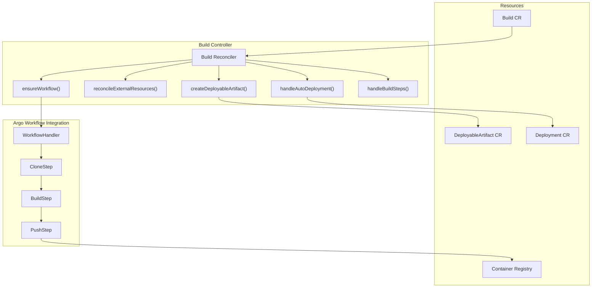
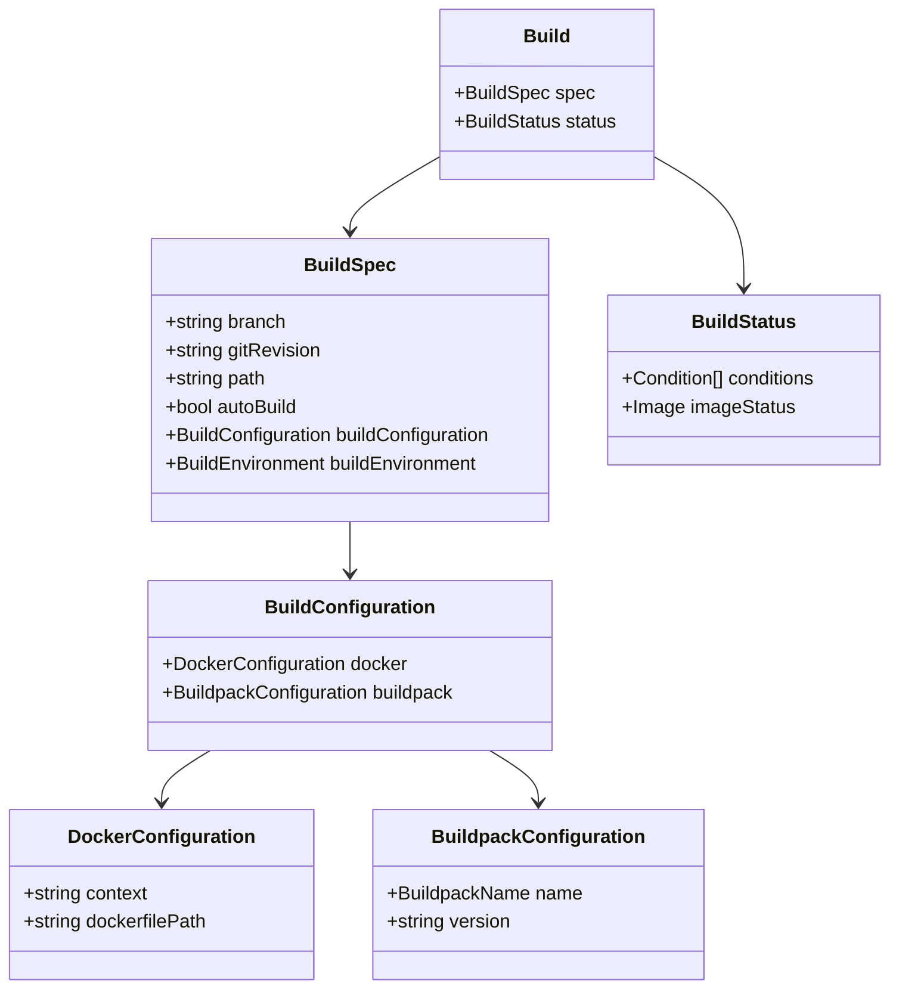
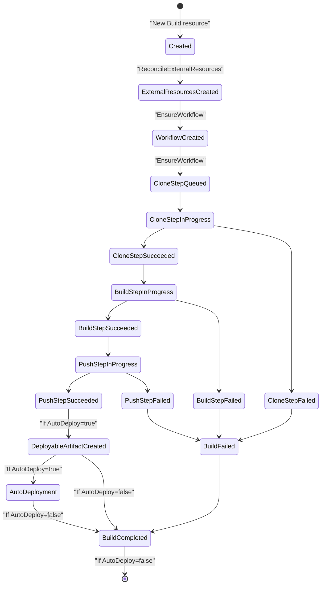

# Build System

> **Relevant source files**
> * [docs/configure-build-plane.md](https://github.com/openchoreo/openchoreo/blob/a577e969/docs/configure-build-plane.md)
> * [install/helm/openchoreo-build-plane/templates/_helpers.tpl](https://github.com/openchoreo/openchoreo/blob/a577e969/install/helm/openchoreo-build-plane/templates/_helpers.tpl)
> * [install/helm/openchoreo-build-plane/templates/workflow-templates/ballerina-buildpack.yaml](https://github.com/openchoreo/openchoreo/blob/a577e969/install/helm/openchoreo-build-plane/templates/workflow-templates/ballerina-buildpack.yaml)
> * [install/helm/openchoreo-build-plane/templates/workflow-templates/docker.yaml](https://github.com/openchoreo/openchoreo/blob/a577e969/install/helm/openchoreo-build-plane/templates/workflow-templates/docker.yaml)
> * [install/helm/openchoreo-build-plane/templates/workflow-templates/google-cloud-buildpacks.yaml](https://github.com/openchoreo/openchoreo/blob/a577e969/install/helm/openchoreo-build-plane/templates/workflow-templates/google-cloud-buildpacks.yaml)
> * [install/helm/openchoreo-build-plane/templates/workflow-templates/react.yaml](https://github.com/openchoreo/openchoreo/blob/a577e969/install/helm/openchoreo-build-plane/templates/workflow-templates/react.yaml)
> * [install/helm/openchoreo-build-plane/values.yaml](https://github.com/openchoreo/openchoreo/blob/a577e969/install/helm/openchoreo-build-plane/values.yaml)
> * [install/quick-start/install-helpers.sh](https://github.com/openchoreo/openchoreo/blob/a577e969/install/quick-start/install-helpers.sh)
> * [internal/choreoctl/cmd/logs/logs.go](https://github.com/openchoreo/openchoreo/blob/a577e969/internal/choreoctl/cmd/logs/logs.go)
> * [internal/controller/build/builder.go](https://github.com/openchoreo/openchoreo/blob/a577e969/internal/controller/build/builder.go)
> * [internal/controller/build/controller.go](https://github.com/openchoreo/openchoreo/blob/a577e969/internal/controller/build/controller.go)
> * [internal/controller/build/controller_conditions.go](https://github.com/openchoreo/openchoreo/blob/a577e969/internal/controller/build/controller_conditions.go)
> * [internal/dataplane/kubernetes/name.go](https://github.com/openchoreo/openchoreo/blob/a577e969/internal/dataplane/kubernetes/name.go)

The OpenChoreo Build System is responsible for building container images from source code repositories and creating deployable artifacts that can be used in the deployment process. This page documents the architecture, components, and workflow of the build system.

For information about deploying applications using the build artifacts, see [Deployment System](/openchoreo/openchoreo/4-deployment-system).

## Architecture Overview

The Build System in OpenChoreo is built around the Kubernetes operator pattern and leverages Argo Workflows for the execution of build pipelines. It supports both Dockerfile-based builds and Buildpack-based builds for various programming languages and frameworks.



Sources: [internal/controller/build/controller.go L52-L177](https://github.com/openchoreo/openchoreo/blob/a577e969/internal/controller/build/controller.go#L52-L177)

 [internal/controller/build/controller.go L273-L305](https://github.com/openchoreo/openchoreo/blob/a577e969/internal/controller/build/controller.go#L273-L305)

## Build Resource Definition

The Build resource defines what to build and how to build it. It's created as part of a Component's DeploymentTrack and represents a specific version of the application that should be built.

### Build Specification

The Build custom resource has the following key fields:



Sources: [api/v1/build_types.go L88-L96](https://github.com/openchoreo/openchoreo/blob/a577e969/api/v1/build_types.go#L88-L96)

 [api/v1/build_types.go L80-L86](https://github.com/openchoreo/openchoreo/blob/a577e969/api/v1/build_types.go#L80-L86)

 [api/v1/build_types.go L68-L78](https://github.com/openchoreo/openchoreo/blob/a577e969/api/v1/build_types.go#L68-L78)

### Supported Buildpacks

OpenChoreo supports the following buildpacks for building applications without Dockerfiles:

| Buildpack Name | Supported Versions |
| --- | --- |
| React | 18.20.6, 19.9.0, 20.18.3, 21.7.3, 22.14.0, 23.7.0 |
| Go | 1.x |
| Ballerina | 2201.7.5, 2201.8.9, 2201.9.6, 2201.10.4, 2201.11.0 |
| Node.js | 12.x.x, 14.x.x, 16.x.x, 18.x.x, 20.x.x, 22.x.x |
| Python | 3.10.x, 3.11.x, 3.12.x |
| Ruby | 3.1.x, 3.2.x, 3.3.x |
| PHP | 8.1.x, 8.2.x, 8.3.x |

Sources: [api/v1/build_types.go L42-L53](https://github.com/openchoreo/openchoreo/blob/a577e969/api/v1/build_types.go#L42-L53)

 [api/v1/build_types.go L57-L66](https://github.com/openchoreo/openchoreo/blob/a577e969/api/v1/build_types.go#L57-L66)

## Build Process Workflow

The build process follows a well-defined workflow of steps and state transitions:



Each step in the workflow is represented by a condition in the Build status. The build controller continuously monitors these conditions and updates them based on the state of the underlying Argo Workflow.

Sources: [internal/controller/build/controller_conditions.go L31-L49](https://github.com/openchoreo/openchoreo/blob/a577e969/internal/controller/build/controller_conditions.go#L31-L49)

 [internal/controller/build/controller_conditions.go L82-L103](https://github.com/openchoreo/openchoreo/blob/a577e969/internal/controller/build/controller_conditions.go#L82-L103)

### Build Conditions

The Build resource uses conditions to track the state of the build process. These are the primary conditions managed by the build controller:

| Condition | Description |
| --- | --- |
| StepCloneSucceeded | Indicates the status of the source code clone step |
| StepBuildSucceeded | Indicates the status of the image build step |
| StepPushSucceeded | Indicates the status of the image push step |
| DeployableArtifactCreated | Indicates whether the deployable artifact has been created |
| DeploymentApplied | Indicates whether auto-deployment has been applied (if enabled) |
| Completed | Indicates whether the build process is completed |
| Finalizing | Indicates the build resource is being deleted |

Sources: [internal/controller/build/controller_conditions.go L31-L49](https://github.com/openchoreo/openchoreo/blob/a577e969/internal/controller/build/controller_conditions.go#L31-L49)

 [internal/controller/build/controller_conditions.go L53-L80](https://github.com/openchoreo/openchoreo/blob/a577e969/internal/controller/build/controller_conditions.go#L53-L80)

## Argo Workflow Integration

The OpenChoreo Build System uses Argo Workflows to execute the actual build process. Each build creates a dedicated Argo workflow that runs in a namespace specific to the build.

### Workflow Structure

The Argo workflow consists of three main steps:

1. **Clone Step**: Clones the source code repository
2. **Build Step**: Builds the container image using either Dockerfile or Buildpack
3. **Push Step**: Pushes the built image to the container registry

The build controller monitors the progress of these steps by tracking the corresponding nodes in the Argo workflow and updates the Build conditions accordingly.

Sources: [internal/controller/build/controller.go L273-L305](https://github.com/openchoreo/openchoreo/blob/a577e969/internal/controller/build/controller.go#L273-L305)

 [internal/controller/build/controller.go L364-L406](https://github.com/openchoreo/openchoreo/blob/a577e969/internal/controller/build/controller.go#L364-L406)

### External Resources Setup

Before creating the Argo workflow, the build controller sets up the necessary external resources:

1. Namespace for workflow execution
2. ServiceAccount for the workflow
3. Role for the workflow permissions
4. RoleBinding to bind the ServiceAccount to the Role

These resources are created by the `reconcileExternalResources` function using a chain of resource handlers.

Sources: [internal/controller/build/controller.go L212-L271](https://github.com/openchoreo/openchoreo/blob/a577e969/internal/controller/build/controller.go#L212-L271)

## DeployableArtifact Creation

After a successful build, the build controller creates a DeployableArtifact resource. This resource represents the built container image and contains all the necessary information for deploying it.

For service components, the controller also extracts endpoint configurations from the component.yaml file in the source repository.

Sources: [internal/controller/build/controller.go L408-L430](https://github.com/openchoreo/openchoreo/blob/a577e969/internal/controller/build/controller.go#L408-L430)

 [internal/controller/build/controller.go L537-L585](https://github.com/openchoreo/openchoreo/blob/a577e969/internal/controller/build/controller.go#L537-L585)

## Auto-Deployment Mechanism

If auto-deploy is enabled on the DeploymentTrack, the build controller automatically creates or updates a Deployment resource to deploy the newly built artifact to the first environment in the deployment pipeline.

This automation streamlines the development workflow, allowing developers to see their changes in a development environment as soon as the build completes successfully.

Sources: [internal/controller/build/controller.go L432-L443](https://github.com/openchoreo/openchoreo/blob/a577e969/internal/controller/build/controller.go#L432-L443)

 [internal/controller/build/controller.go L446-L491](https://github.com/openchoreo/openchoreo/blob/a577e969/internal/controller/build/controller.go#L446-L491)

## Resource Cleanup and Finalization

When a Build resource is deleted, the controller ensures proper cleanup of associated resources using a finalizer. The cleanup process:

1. Deletes the Argo workflow resource
2. Attempts to delete the DeployableArtifact

If the DeployableArtifact is still referenced by other resources (like Deployments), the controller blocks deletion until the references are removed, ensuring data integrity.

Sources: [internal/controller/build/controller_finalize.go L41-L102](https://github.com/openchoreo/openchoreo/blob/a577e969/internal/controller/build/controller_finalize.go#L41-L102)

 [internal/controller/build/controller_finalize.go L112-L150](https://github.com/openchoreo/openchoreo/blob/a577e969/internal/controller/build/controller_finalize.go#L112-L150)

## Build Controller Lifecycle

The diagram below illustrates the reconciliation lifecycle of the Build controller:

```

```

Sources: [internal/controller/build/controller.go L69-L177](https://github.com/openchoreo/openchoreo/blob/a577e969/internal/controller/build/controller.go#L69-L177)

## Integration with Component and DeploymentTrack

The Build resource is part of a hierarchy in OpenChoreo:

```css
#mermaid-vdqt4171oft{font-family:ui-sans-serif,-apple-system,system-ui,Segoe UI,Helvetica;font-size:16px;fill:#333;}@keyframes edge-animation-frame{from{stroke-dashoffset:0;}}@keyframes dash{to{stroke-dashoffset:0;}}#mermaid-vdqt4171oft .edge-animation-slow{stroke-dasharray:9,5!important;stroke-dashoffset:900;animation:dash 50s linear infinite;stroke-linecap:round;}#mermaid-vdqt4171oft .edge-animation-fast{stroke-dasharray:9,5!important;stroke-dashoffset:900;animation:dash 20s linear infinite;stroke-linecap:round;}#mermaid-vdqt4171oft .error-icon{fill:#dddddd;}#mermaid-vdqt4171oft .error-text{fill:#222222;stroke:#222222;}#mermaid-vdqt4171oft .edge-thickness-normal{stroke-width:1px;}#mermaid-vdqt4171oft .edge-thickness-thick{stroke-width:3.5px;}#mermaid-vdqt4171oft .edge-pattern-solid{stroke-dasharray:0;}#mermaid-vdqt4171oft .edge-thickness-invisible{stroke-width:0;fill:none;}#mermaid-vdqt4171oft .edge-pattern-dashed{stroke-dasharray:3;}#mermaid-vdqt4171oft .edge-pattern-dotted{stroke-dasharray:2;}#mermaid-vdqt4171oft .marker{fill:#999;stroke:#999;}#mermaid-vdqt4171oft .marker.cross{stroke:#999;}#mermaid-vdqt4171oft svg{font-family:ui-sans-serif,-apple-system,system-ui,Segoe UI,Helvetica;font-size:16px;}#mermaid-vdqt4171oft p{margin:0;}#mermaid-vdqt4171oft .entityBox{fill:#ffffff;stroke:#dddddd;}#mermaid-vdqt4171oft .relationshipLabelBox{fill:#dddddd;opacity:0.7;background-color:#dddddd;}#mermaid-vdqt4171oft .relationshipLabelBox rect{opacity:0.5;}#mermaid-vdqt4171oft .labelBkg{background-color:rgba(221, 221, 221, 0.5);}#mermaid-vdqt4171oft .edgeLabel .label{fill:#dddddd;font-size:14px;}#mermaid-vdqt4171oft .label{font-family:ui-sans-serif,-apple-system,system-ui,Segoe UI,Helvetica;color:#333;}#mermaid-vdqt4171oft .edge-pattern-dashed{stroke-dasharray:8,8;}#mermaid-vdqt4171oft .node rect,#mermaid-vdqt4171oft .node circle,#mermaid-vdqt4171oft .node ellipse,#mermaid-vdqt4171oft .node polygon{fill:#ffffff;stroke:#dddddd;stroke-width:1px;}#mermaid-vdqt4171oft .relationshipLine{stroke:#999;stroke-width:1;fill:none;}#mermaid-vdqt4171oft .marker{fill:none!important;stroke:#999!important;stroke-width:1;}#mermaid-vdqt4171oft :root{--mermaid-font-family:"trebuchet ms",verdana,arial,sans-serif;}containscontainscontainscontainscreatesdeployed asconfigured byOrganizationProjectComponentDeploymentTrackBuildDeployableArtifactDeploymentBuildConfiguration
```

This hierarchy is maintained through owner references and labels, ensuring that builds are properly associated with their parent resources and facilitating queries and filtering.

Sources: [internal/controller/build/controller.go L192-L208](https://github.com/openchoreo/openchoreo/blob/a577e969/internal/controller/build/controller.go#L192-L208)