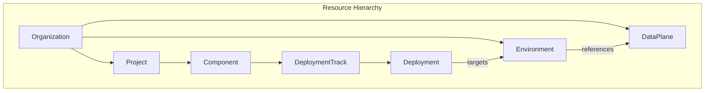
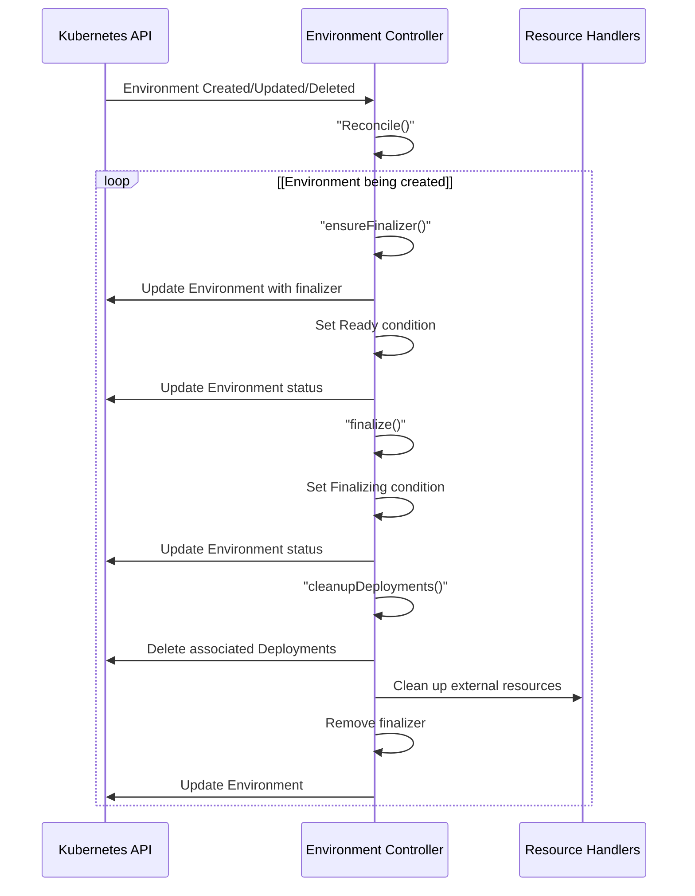
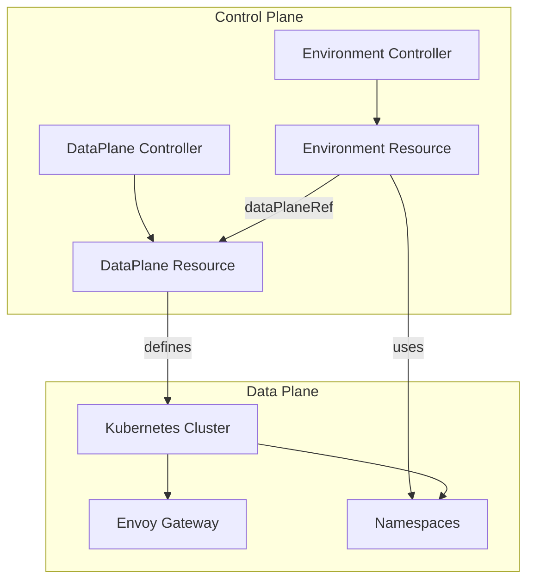
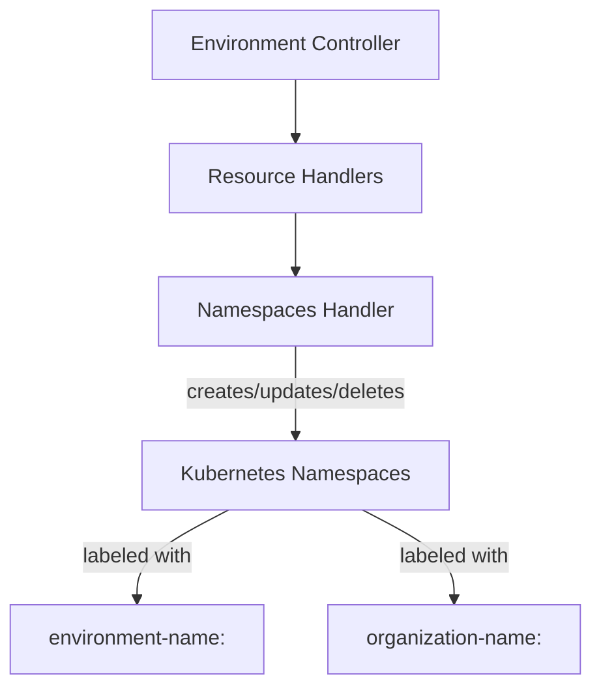
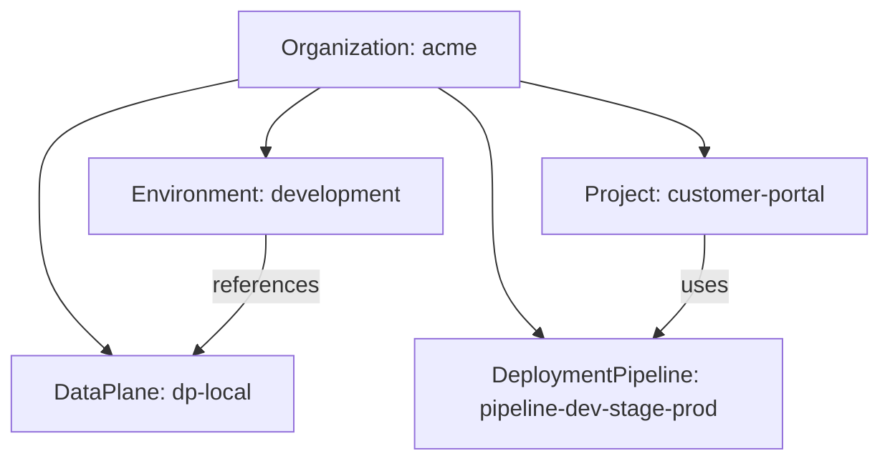

# Environment and DataPlane

> **Relevant source files**
> * [PROJECT](https://github.com/openchoreo/openchoreo/blob/a577e969/PROJECT)
> * [cmd/main.go](https://github.com/openchoreo/openchoreo/blob/a577e969/cmd/main.go)
> * [config/crd/kustomization.yaml](https://github.com/openchoreo/openchoreo/blob/a577e969/config/crd/kustomization.yaml)
> * [config/rbac/kustomization.yaml](https://github.com/openchoreo/openchoreo/blob/a577e969/config/rbac/kustomization.yaml)
> * [config/rbac/role.yaml](https://github.com/openchoreo/openchoreo/blob/a577e969/config/rbac/role.yaml)
> * [config/samples/kustomization.yaml](https://github.com/openchoreo/openchoreo/blob/a577e969/config/samples/kustomization.yaml)
> * [internal/controller/build/builder.go](https://github.com/openchoreo/openchoreo/blob/a577e969/internal/controller/build/builder.go)
> * [internal/controller/build/controller.go](https://github.com/openchoreo/openchoreo/blob/a577e969/internal/controller/build/controller.go)
> * [internal/controller/build/controller_conditions.go](https://github.com/openchoreo/openchoreo/blob/a577e969/internal/controller/build/controller_conditions.go)
> * [internal/dataplane/kubernetes/name.go](https://github.com/openchoreo/openchoreo/blob/a577e969/internal/dataplane/kubernetes/name.go)

This document explains the Environment and DataPlane custom resources in OpenChoreo, how they relate to each other, and their role in the deployment infrastructure. These resources are fundamental to organizing application deployments across different stages of the application lifecycle. For information about Organization and Project resources, see [Organization and Project](/openchoreo/openchoreo/5.1-api-server-architecture). For information about deploying applications to environments, see [Deployment System](/openchoreo/openchoreo/4-deployment-system).

## 1. Overview

Environments in OpenChoreo represent the different stages in an application's lifecycle (such as Development, Staging, and Production), while DataPlanes define the underlying Kubernetes infrastructure where applications are deployed. Each Environment is bound to a specific DataPlane, creating a clear separation of concerns between the logical application lifecycle stages and the physical infrastructure.



Sources: [samples/README.md L9-L24](https://github.com/openchoreo/openchoreo/blob/a577e969/samples/README.md#L9-L24)

 [internal/dataplane/types.go L60-L66](https://github.com/openchoreo/openchoreo/blob/a577e969/internal/dataplane/types.go#L60-L66)

## 2. Environment Resource

The Environment resource represents a deployment environment like Development, Staging, or Production. It provides a logical grouping for deployments and associates them with a specific DataPlane.

### 2.1 Environment Resource Definition

An Environment resource in OpenChoreo has the following key properties:

| Field | Description |
| --- | --- |
| `spec.dataPlaneRef` | Reference to the DataPlane where the environment will run |
| `spec.isProduction` | Boolean indicating if this is a production environment |
| `spec.gateway.dnsPrefix` | DNS prefix for the environment's gateway |

Example Environment resource:

```yaml
apiVersion: core.choreo.dev/v1
kind: Environment
metadata:
  name: development
  namespace: acme
  annotations:
    core.choreo.dev/display-name: Development Environment
    core.choreo.dev/description: The environment where you can play around
  labels:
    core.choreo.dev/organization: acme
    core.choreo.dev/name: development
spec:
  dataPlaneRef: dp-local 
  isProduction: false
  gateway:
    dnsPrefix: local-dev
```

Sources: [samples/configuring-choreo/create-new-organization/complete-organization.yaml L65-L82](https://github.com/openchoreo/openchoreo/blob/a577e969/samples/configuring-choreo/create-new-organization/complete-organization.yaml#L65-L82)

 [samples/configuring-choreo/create-new-environments/README.md L1-L33](https://github.com/openchoreo/openchoreo/blob/a577e969/samples/configuring-choreo/create-new-environments/README.md#L1-L33)

### 2.2 Environment Controller

The Environment controller is responsible for reconciling Environment resources. It ensures the Environment is in the desired state and manages its lifecycle.



Sources: [internal/controller/environment/controller.go L40-L108](https://github.com/openchoreo/openchoreo/blob/a577e969/internal/controller/environment/controller.go#L40-L108)

 [internal/controller/environment/controller_finalize.go L18-L175](https://github.com/openchoreo/openchoreo/blob/a577e969/internal/controller/environment/controller_finalize.go#L18-L175)

The Environment controller uses the following conditions to represent the state of an Environment:

| Condition | Status | Reason | Description |
| --- | --- | --- | --- |
| Ready | True | EnvironmentReady | Environment is ready |
| Ready | False | EnvironmentFinalizing | Environment is being deleted |

Sources: [internal/controller/environment/controller_conditions.go L27-L59](https://github.com/openchoreo/openchoreo/blob/a577e969/internal/controller/environment/controller_conditions.go#L27-L59)

## 3. DataPlane Resource

The DataPlane resource represents a Kubernetes cluster where applications can be deployed. It defines the infrastructure configuration and gateway settings.

### 3.1 DataPlane Resource Definition

A DataPlane resource in OpenChoreo has the following key properties:

| Field | Description |
| --- | --- |
| `spec.kubernetesCluster.name` | Name of the Kubernetes cluster |
| `spec.kubernetesCluster.connectionConfigRef` | Reference to connection configuration |
| `spec.kubernetesCluster.featureFlags` | Feature flags for the cluster (Cilium, scale-to-zero, gateway type) |
| `spec.gateway.publicVirtualHost` | Public domain for the gateway |
| `spec.gateway.organizationVirtualHost` | Internal domain for the gateway |

Example DataPlane resource:

```yaml
apiVersion: core.choreo.dev/v1
kind: DataPlane
metadata:
  name: dp-local
  namespace: acme
  annotations:
    core.choreo.dev/display-name: Local Data Plane
    core.choreo.dev/description: Data plane in Kind cluster
  labels:
    core.choreo.dev/organization: acme
    core.choreo.dev/name: dp-local
spec:
  kubernetesCluster:
    name: kind-cluster-1
    connectionConfigRef: kind-cluster-1-connection-config
    featureFlags:
      cilium: true
      scaleToZero: true
      gatewayType: envoy
  gateway:
    publicVirtualHost: choreoapis.local
    organizationVirtualHost: internal.choreoapis.local
```

Sources: [samples/configuring-choreo/create-new-organization/complete-organization.yaml L14-L37](https://github.com/openchoreo/openchoreo/blob/a577e969/samples/configuring-choreo/create-new-organization/complete-organization.yaml#L14-L37)

## 4. Environment and DataPlane Relationship

The Environment and DataPlane resources are related through a reference in the Environment's specification. This relationship establishes where applications deployed to a particular environment will run.



Sources: [internal/dataplane/types.go L60-L66](https://github.com/openchoreo/openchoreo/blob/a577e969/internal/dataplane/types.go#L60-L66)

 [internal/controller/environment/environment_context.go L30-L40](https://github.com/openchoreo/openchoreo/blob/a577e969/internal/controller/environment/environment_context.go#L30-L40)

### 4.1 EnvironmentContext

In the OpenChoreo codebase, the relationship between Environment and DataPlane is represented by the `EnvironmentContext` structure, which contains references to both the Environment and DataPlane resources.

```
type EnvironmentContext struct {
    Environment *choreov1.Environment
    DataPlane   *choreov1.DataPlane
}
```

The Environment controller uses this context to manage external resources for the Environment:

```go
func (r *Reconciler) makeEnvironmentContext(ctx context.Context, environment *choreov1.Environment) (*dataplane.EnvironmentContext, error) {
    dataPlane, err := controller.GetDataPlane(ctx, r.Client, environment)
    if err != nil {
        return nil, fmt.Errorf("cannot retrieve the dataplane: %w", err)
    }

    return &dataplane.EnvironmentContext{
        DataPlane:   dataPlane,
        Environment: environment,
    }, nil
}
```

Sources: [internal/dataplane/types.go L60-L66](https://github.com/openchoreo/openchoreo/blob/a577e969/internal/dataplane/types.go#L60-L66)

 [internal/controller/environment/environment_context.go L30-L40](https://github.com/openchoreo/openchoreo/blob/a577e969/internal/controller/environment/environment_context.go#L30-L40)

## 5. External Resource Management

Environments in OpenChoreo manage external resources like Kubernetes namespaces. The Environment controller uses resource handlers to manage these external resources.

### 5.1 Kubernetes Namespaces

The primary external resource managed by the Environment controller is Kubernetes namespaces. Namespaces are created with labels to associate them with a specific Environment and Organization.



Sources: [internal/controller/environment/integrations/kubernetes/namespaces_handler.go L19-L110](https://github.com/openchoreo/openchoreo/blob/a577e969/internal/controller/environment/integrations/kubernetes/namespaces_handler.go#L19-L110)

 [internal/controller/environment/controller.go L127-L134](https://github.com/openchoreo/openchoreo/blob/a577e969/internal/controller/environment/controller.go#L127-L134)

The `NamespacesHandler` is responsible for listing, creating, and deleting namespaces associated with an Environment:

```go
func (h *namespacesHandler) GetCurrentState(ctx context.Context, envCtx *dataplane.EnvironmentContext) (interface{}, error) {
    namespaceList := &corev1.NamespaceList{}
    labelSelector := client.MatchingLabels{
        k8s.LabelKeyEnvironmentName:  envCtx.Environment.Name,
        k8s.LabelKeyOrganizationName: envCtx.Environment.Namespace,
    }
    if err := h.kubernetesClient.List(ctx, namespaceList, labelSelector); err != nil {
        if k8sapierrors.IsNotFound(err) {
            return nil, nil
        }
        return nil, fmt.Errorf("error listing namespaces: %w", err)
    }
    if len(namespaceList.Items) > 0 {
        return namespaceList, nil
    }
    return nil, nil
}
```

Sources: [internal/controller/environment/integrations/kubernetes/namespaces_handler.go L53-L72](https://github.com/openchoreo/openchoreo/blob/a577e969/internal/controller/environment/integrations/kubernetes/namespaces_handler.go#L53-L72)

## 6. Environment Lifecycle and Cleanup

When an Environment is deleted, the Environment controller ensures all associated resources are cleaned up properly.

### 6.1 Cleaning Up Deployments

The finalization process first deletes all deployments associated with the Environment:

```go
func (r *Reconciler) cleanupDeployments(ctx context.Context, environment *choreov1.Environment) (bool, error) {
    // List all deployments with the label `core.choreo.dev/environment=<environment.Name>`
    deploymentList := &choreov1.DeploymentList{}
    listOpts := []client.ListOption{
        client.InNamespace(environment.Namespace),
        client.MatchingLabels{
            labels.LabelKeyEnvironmentName:  environment.Name,
            labels.LabelKeyOrganizationName: environment.Labels[labels.LabelKeyOrganizationName],
        },
    }

    if err := r.List(ctx, deploymentList, listOpts...); err != nil {
        return false, fmt.Errorf("error listing deployments: %w", err)
    }

    // Delete each deployment
    for _, deployment := range deploymentList.Items {
        // Check if the deployment is being already deleting
        if !deployment.DeletionTimestamp.IsZero() {
            continue
        }

        if err := r.Delete(ctx, &deployment); err != nil {
            if k8sapierrors.IsNotFound(err) {
                // The deployment is already deleted, no need to retry
                continue
            }
            return false, fmt.Errorf("error deleting deployment %s: %w", deployment.Name, err)
        }
    }

    // Reaching this point means the deployment deletion is either still in progress or has just been initiated.
    return true, nil
}
```

Sources: [internal/controller/environment/controller_finalize.go L132-L175](https://github.com/openchoreo/openchoreo/blob/a577e969/internal/controller/environment/controller_finalize.go#L132-L175)

### 6.2 Cleaning Up External Resources

After deployments are deleted, the finalization process cleans up external resources like Kubernetes namespaces:

```sql
resourceHandlers := r.makeExternalResourceHandlers()
pendingDeletion := false

for _, resourceHandler := range resourceHandlers {
    // Check if the resource is still being deleted
    exists, err := resourceHandler.GetCurrentState(ctx, envCtx)
    if err != nil {
        return ctrl.Result{}, fmt.Errorf("failed to check existence of external resource %s: %w", resourceHandler.Name(), err)
    }

    if exists == nil {
        continue
    }

    pendingDeletion = true
    // Trigger deletion of the resource as it is still exists
    if err := resourceHandler.Delete(ctx, envCtx); err != nil {
        return ctrl.Result{}, fmt.Errorf("failed to delete external resource %s: %w", resourceHandler.Name(), err)
    }
}
```

Sources: [internal/controller/environment/controller_finalize.go L96-L114](https://github.com/openchoreo/openchoreo/blob/a577e969/internal/controller/environment/controller_finalize.go#L96-L114)

## 7. Practical Examples

OpenChoreo provides samples for creating and managing Environments and associated resources.

### 7.1 Creating a New Organization with Environments



Sources: [samples/configuring-choreo/create-new-organization/complete-organization.yaml L1-L98](https://github.com/openchoreo/openchoreo/blob/a577e969/samples/configuring-choreo/create-new-organization/complete-organization.yaml#L1-L98)

### 7.2 Creating New Environments

You can create multiple environments in an organization:

```
choreoctl apply -f development-environment.yaml
choreoctl apply -f staging-environment.yaml
choreoctl apply -f production-environment.yaml
```

Sources: [samples/configuring-choreo/create-new-environments/README.md L16-L30](https://github.com/openchoreo/openchoreo/blob/a577e969/samples/configuring-choreo/create-new-environments/README.md#L16-L30)

### 7.3 Updating Deployment Pipelines

Environments are used in Deployment Pipelines to define promotion paths for applications:

```yaml
spec:
  promotionPaths:
    - sourceEnvironmentRef: development
      targetEnvironmentRefs:
      - name: test
        requiresApproval: false
    - sourceEnvironmentRef: test
      targetEnvironmentRefs:
        - name: staging
          requiresApproval: false
        - name: production
          isManualApprovalRequired: true
```

Sources: [samples/configuring-choreo/update-deployment-pipeline/deployment-pipeline.yaml L14-L28](https://github.com/openchoreo/openchoreo/blob/a577e969/samples/configuring-choreo/update-deployment-pipeline/deployment-pipeline.yaml#L14-L28)

 [samples/configuring-choreo/create-new-deployment-pipeline/README.md L1-L27](https://github.com/openchoreo/openchoreo/blob/a577e969/samples/configuring-choreo/create-new-deployment-pipeline/README.md#L1-L27)

## 8. Summary

Environment and DataPlane resources are fundamental to the OpenChoreo deployment infrastructure:

1. **Environment** represents a stage in the application lifecycle (Development, Staging, Production)
2. **DataPlane** represents the Kubernetes infrastructure where applications run
3. Each Environment is linked to a DataPlane through the `dataPlaneRef` field
4. The Environment controller manages the lifecycle of Environments and associated resources
5. When an Environment is deleted, all associated Deployments and external resources are cleaned up

Understanding these resources is essential for setting up the deployment infrastructure in OpenChoreo.