# Build and Infrastructure Services

> **Relevant source files**
> * [cmd/openchoreo-api/main.go](https://github.com/openchoreo/openchoreo/blob/a577e969/cmd/openchoreo-api/main.go)
> * [internal/choreoctl/resources/kinds/dataplane.go](https://github.com/openchoreo/openchoreo/blob/a577e969/internal/choreoctl/resources/kinds/dataplane.go)
> * [internal/openchoreo-api/clients/k8s.go](https://github.com/openchoreo/openchoreo/blob/a577e969/internal/openchoreo-api/clients/k8s.go)
> * [internal/openchoreo-api/handlers/apply.go](https://github.com/openchoreo/openchoreo/blob/a577e969/internal/openchoreo-api/handlers/apply.go)
> * [internal/openchoreo-api/handlers/buildplanes.go](https://github.com/openchoreo/openchoreo/blob/a577e969/internal/openchoreo-api/handlers/buildplanes.go)
> * [internal/openchoreo-api/handlers/builds.go](https://github.com/openchoreo/openchoreo/blob/a577e969/internal/openchoreo-api/handlers/builds.go)
> * [internal/openchoreo-api/handlers/components.go](https://github.com/openchoreo/openchoreo/blob/a577e969/internal/openchoreo-api/handlers/components.go)
> * [internal/openchoreo-api/handlers/dataplanes.go](https://github.com/openchoreo/openchoreo/blob/a577e969/internal/openchoreo-api/handlers/dataplanes.go)
> * [internal/openchoreo-api/handlers/environments.go](https://github.com/openchoreo/openchoreo/blob/a577e969/internal/openchoreo-api/handlers/environments.go)
> * [internal/openchoreo-api/handlers/handlers.go](https://github.com/openchoreo/openchoreo/blob/a577e969/internal/openchoreo-api/handlers/handlers.go)
> * [internal/openchoreo-api/handlers/helpers.go](https://github.com/openchoreo/openchoreo/blob/a577e969/internal/openchoreo-api/handlers/helpers.go)
> * [internal/openchoreo-api/handlers/organizations.go](https://github.com/openchoreo/openchoreo/blob/a577e969/internal/openchoreo-api/handlers/organizations.go)
> * [internal/openchoreo-api/handlers/workloads.go](https://github.com/openchoreo/openchoreo/blob/a577e969/internal/openchoreo-api/handlers/workloads.go)
> * [internal/openchoreo-api/models/request.go](https://github.com/openchoreo/openchoreo/blob/a577e969/internal/openchoreo-api/models/request.go)
> * [internal/openchoreo-api/models/response.go](https://github.com/openchoreo/openchoreo/blob/a577e969/internal/openchoreo-api/models/response.go)
> * [internal/openchoreo-api/services/build_service.go](https://github.com/openchoreo/openchoreo/blob/a577e969/internal/openchoreo-api/services/build_service.go)
> * [internal/openchoreo-api/services/buildplane_service.go](https://github.com/openchoreo/openchoreo/blob/a577e969/internal/openchoreo-api/services/buildplane_service.go)
> * [internal/openchoreo-api/services/component_service.go](https://github.com/openchoreo/openchoreo/blob/a577e969/internal/openchoreo-api/services/component_service.go)
> * [internal/openchoreo-api/services/dataplane_service.go](https://github.com/openchoreo/openchoreo/blob/a577e969/internal/openchoreo-api/services/dataplane_service.go)
> * [internal/openchoreo-api/services/environment_service.go](https://github.com/openchoreo/openchoreo/blob/a577e969/internal/openchoreo-api/services/environment_service.go)
> * [internal/openchoreo-api/services/errors.go](https://github.com/openchoreo/openchoreo/blob/a577e969/internal/openchoreo-api/services/errors.go)
> * [internal/openchoreo-api/services/organization_service.go](https://github.com/openchoreo/openchoreo/blob/a577e969/internal/openchoreo-api/services/organization_service.go)
> * [internal/openchoreo-api/services/project_service.go](https://github.com/openchoreo/openchoreo/blob/a577e969/internal/openchoreo-api/services/project_service.go)
> * [internal/openchoreo-api/services/services.go](https://github.com/openchoreo/openchoreo/blob/a577e969/internal/openchoreo-api/services/services.go)

## Purpose and Scope

This page documents the infrastructure-oriented services in the OpenChoreo API layer: **BuildService**, **BuildPlaneService**, and **DataPlaneService**. These services provide HTTP abstractions over Build and cluster configuration Custom Resources, enabling multi-cluster build orchestration and data plane management. For information about component promotion and binding management, see [Component Service](/openchoreo/openchoreo/5.2-component-service). For details on the overall API server architecture and request handling, see [API Server Architecture](/openchoreo/openchoreo/5.1-api-server-architecture).

---

## Service Architecture Overview

The build and infrastructure services form a bridge between the HTTP API layer and multi-cluster Kubernetes operations. They handle build triggering, cluster credential management, and cross-cluster client creation.

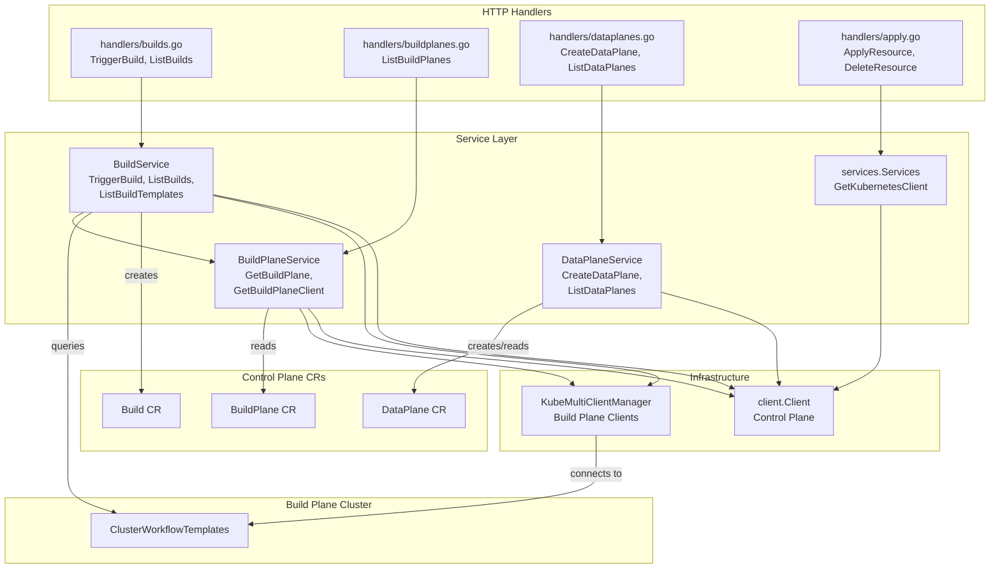

**Sources:** [internal/openchoreo-api/services/build_service.go L1-L232](https://github.com/openchoreo/openchoreo/blob/a577e969/internal/openchoreo-api/services/build_service.go#L1-L232)

 [internal/openchoreo-api/services/buildplane_service.go L1-L134](https://github.com/openchoreo/openchoreo/blob/a577e969/internal/openchoreo-api/services/buildplane_service.go#L1-L134)

 [internal/openchoreo-api/services/dataplane_service.go L1-L244](https://github.com/openchoreo/openchoreo/blob/a577e969/internal/openchoreo-api/services/dataplane_service.go#L1-L244)

 [internal/openchoreo-api/services/services.go L1-L68](https://github.com/openchoreo/openchoreo/blob/a577e969/internal/openchoreo-api/services/services.go#L1-L68)

---

## BuildService

The `BuildService` handles build-related operations, including triggering builds and querying build templates from the build plane cluster.

### Structure and Dependencies

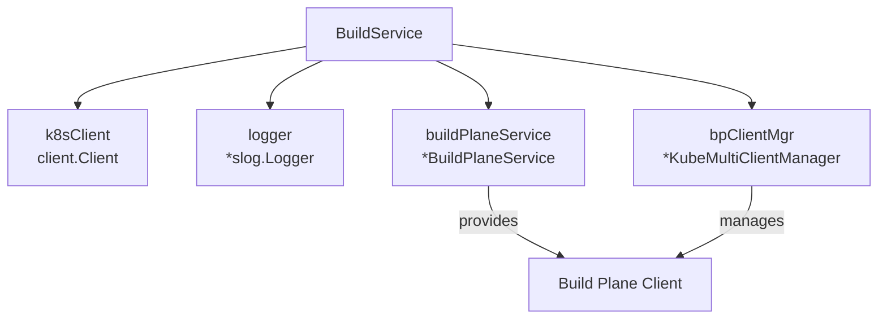

The `BuildService` is initialized with four dependencies that enable cross-cluster operations:

| Dependency | Type | Purpose |
| --- | --- | --- |
| `k8sClient` | `client.Client` | Control plane Kubernetes client for Build CR operations |
| `buildPlaneService` | `*BuildPlaneService` | Provides access to BuildPlane resources and clients |
| `bpClientMgr` | `*KubeMultiClientManager` | Manages multi-cluster client connections |
| `logger` | `*slog.Logger` | Structured logging |

**Sources:** [internal/openchoreo-api/services/build_service.go L24-L40](https://github.com/openchoreo/openchoreo/blob/a577e969/internal/openchoreo-api/services/build_service.go#L24-L40)

### Key Operations

#### TriggerBuild

Creates a new Build CR in the control plane, which triggers the Build controller to orchestrate execution in the build plane.

**Flow:**

1. Retrieve Component CR to extract build configuration
2. Generate unique build ID from UUID
3. Create Build CR with repository details and template reference
4. Return build response with metadata

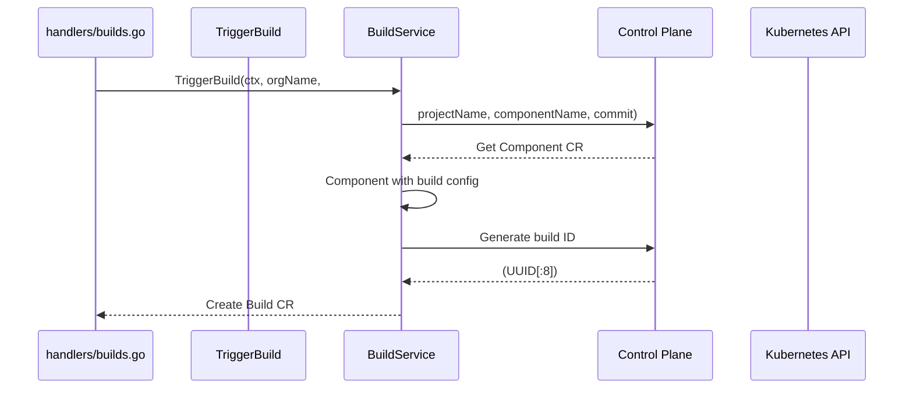

**Implementation Details:**

* Build name format: `{componentName}-build-{buildID}`
* Labels applied: `LabelKeyOrganizationName`, `LabelKeyProjectName`, `LabelKeyComponentName`
* Template reference and parameters copied from Component spec
* Commit defaults to "latest" if not provided

**Sources:** [internal/openchoreo-api/services/build_service.go L92-L161](https://github.com/openchoreo/openchoreo/blob/a577e969/internal/openchoreo-api/services/build_service.go#L92-L161)

 [internal/openchoreo-api/handlers/builds.go L36-L74](https://github.com/openchoreo/openchoreo/blob/a577e969/internal/openchoreo-api/handlers/builds.go#L36-L74)

#### ListBuilds

Retrieves all Build CRs for a specific component using spec-based filtering rather than label-based filtering.

**Implementation:**

```python
1. List all Builds in organization namespace
2. Filter by spec.owner.projectName and spec.owner.componentName
3. Extract status from conditions using GetLatestBuildStatus
4. Return BuildResponse list with image and status
```

**Build Status Priority:** The `GetLatestBuildStatus` function determines build status by examining conditions in priority order:

1. `WorkloadUpdated` (True) → "Completed"
2. `BuildCompleted` → condition reason
3. `BuildTriggered` → condition reason
4. `BuildInitiated` → condition reason

**Sources:** [internal/openchoreo-api/services/build_service.go L164-L231](https://github.com/openchoreo/openchoreo/blob/a577e969/internal/openchoreo-api/services/build_service.go#L164-L231)

 [internal/openchoreo-api/handlers/builds.go L76-L114](https://github.com/openchoreo/openchoreo/blob/a577e969/internal/openchoreo-api/handlers/builds.go#L76-L114)

#### ListBuildTemplates

Queries `ClusterWorkflowTemplate` resources from the build plane cluster to discover available build templates.

**Multi-Cluster Operation:**

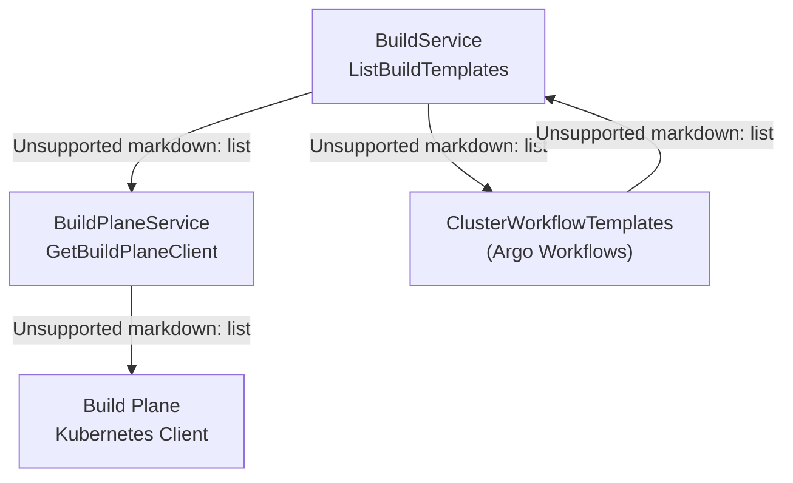

**Response Mapping:**

* Template name from `ClusterWorkflowTemplate.name`
* Parameters extracted from `spec.arguments.parameters`
* Default values included when present

**Sources:** [internal/openchoreo-api/services/build_service.go L42-L89](https://github.com/openchoreo/openchoreo/blob/a577e969/internal/openchoreo-api/services/build_service.go#L42-L89)

 [internal/openchoreo-api/handlers/builds.go L12-L34](https://github.com/openchoreo/openchoreo/blob/a577e969/internal/openchoreo-api/handlers/builds.go#L12-L34)

### HTTP Endpoints

| Method | Path | Handler | Service Method |
| --- | --- | --- | --- |
| POST | `/api/v1/orgs/{orgName}/projects/{projectName}/components/{componentName}/builds` | `TriggerBuild` | `TriggerBuild` |
| GET | `/api/v1/orgs/{orgName}/projects/{projectName}/components/{componentName}/builds` | `ListBuilds` | `ListBuilds` |
| GET | `/api/v1/orgs/{orgName}/build-templates` | `ListBuildTemplates` | `ListBuildTemplates` |

**Sources:** [internal/openchoreo-api/handlers/handlers.go L61-L83](https://github.com/openchoreo/openchoreo/blob/a577e969/internal/openchoreo-api/handlers/handlers.go#L61-L83)

---

## BuildPlaneService

The `BuildPlaneService` manages BuildPlane resources and provides authenticated Kubernetes clients for build plane clusters. This enables the API layer to query build-related resources (like ClusterWorkflowTemplates) that exist in a separate cluster.

### Structure

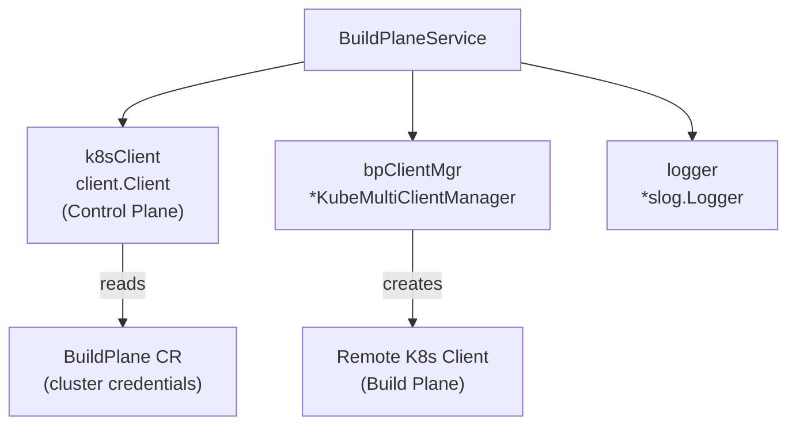

**Sources:** [internal/openchoreo-api/services/buildplane_service.go L19-L33](https://github.com/openchoreo/openchoreo/blob/a577e969/internal/openchoreo-api/services/buildplane_service.go#L19-L33)

### Key Operations

#### GetBuildPlane

Retrieves the first BuildPlane CR found in the organization namespace. The current implementation assumes one build plane per organization.

**Implementation:**

```
1. List BuildPlane CRs in organization namespace
2. Return first BuildPlane (index 0)
3. Error if no build planes found
```

**Sources:** [internal/openchoreo-api/services/buildplane_service.go L36-L58](https://github.com/openchoreo/openchoreo/blob/a577e969/internal/openchoreo-api/services/buildplane_service.go#L36-L58)

#### GetBuildPlaneClient

Creates a Kubernetes client for the build plane cluster using credentials stored in the BuildPlane CR.

**Client Creation Flow:**

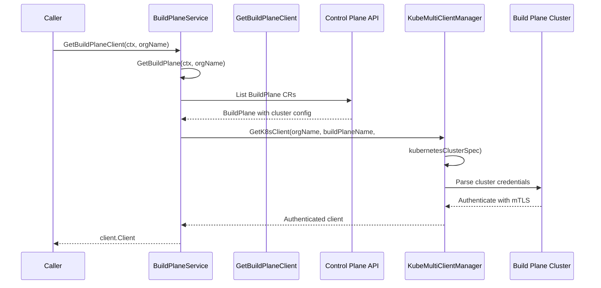

**Sources:** [internal/openchoreo-api/services/buildplane_service.go L60-L83](https://github.com/openchoreo/openchoreo/blob/a577e969/internal/openchoreo-api/services/buildplane_service.go#L60-L83)

#### ListBuildPlanes

Lists all BuildPlane CRs in an organization with metadata extraction.

**Response Fields:**

* `Name`, `Namespace` from ObjectMeta
* `DisplayName`, `Description` from annotations
* `KubernetesClusterName` = BuildPlane.Name
* `APIServerURL` from `spec.kubernetesCluster.server`
* `ObserverURL`, `ObserverUsername` from `spec.observer` (if configured)

**Sources:** [internal/openchoreo-api/services/buildplane_service.go L86-L133](https://github.com/openchoreo/openchoreo/blob/a577e969/internal/openchoreo-api/services/buildplane_service.go#L86-L133)

### HTTP Endpoints

| Method | Path | Handler | Service Method |
| --- | --- | --- | --- |
| GET | `/api/v1/orgs/{orgName}/buildplanes` | `ListBuildPlanes` | `ListBuildPlanes` |

**Sources:** [internal/openchoreo-api/handlers/handlers.go L61](https://github.com/openchoreo/openchoreo/blob/a577e969/internal/openchoreo-api/handlers/handlers.go#L61-L61)

 [internal/openchoreo-api/handlers/buildplanes.go L39-L61](https://github.com/openchoreo/openchoreo/blob/a577e969/internal/openchoreo-api/handlers/buildplanes.go#L39-L61)

---

## DataPlaneService

The `DataPlaneService` manages DataPlane resources, which represent data plane cluster configurations including cluster credentials, registry settings, and gateway virtual hosts.

### Structure

The service has a simpler structure than BuildService as it doesn't require multi-cluster client management—DataPlane CRs are only stored in the control plane, and the deployment controllers handle data plane cluster connections.

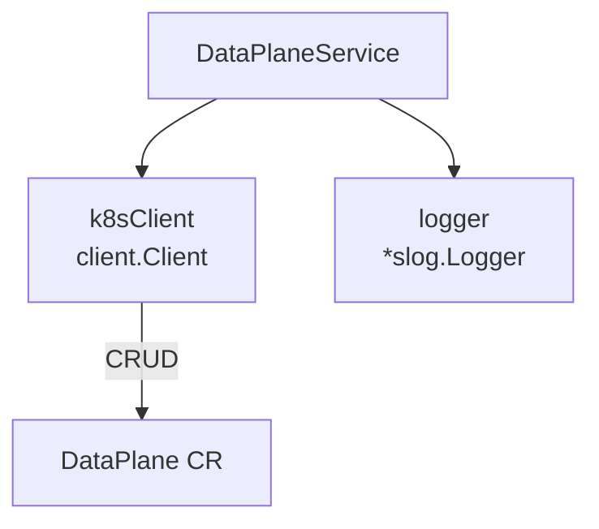

**Sources:** [internal/openchoreo-api/services/dataplane_service.go L20-L32](https://github.com/openchoreo/openchoreo/blob/a577e969/internal/openchoreo-api/services/dataplane_service.go#L20-L32)

### Key Operations

#### CreateDataPlane

Creates a new DataPlane CR with cluster credentials and configuration. This is the primary way to register a data plane cluster with OpenChoreo.

**DataPlane CR Structure:**

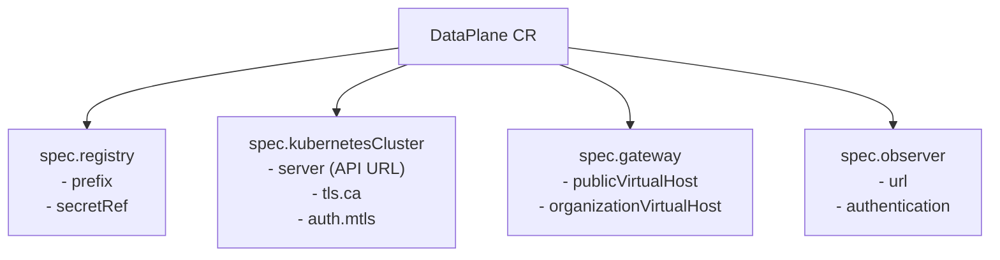

**Implementation Steps:**

1. Sanitize input via `req.Sanitize()`
2. Check if DataPlane already exists
3. Build DataPlane CR using `buildDataPlaneCR`
4. Create CR in control plane
5. Return response with all configuration details

**Authentication Support:**

* mTLS authentication via client certificate and key
* Values stored directly in CR (base64 encoded)
* Alternative: reference to secrets via `ValueFrom.SecretRef` (not implemented in API)

**Sources:** [internal/openchoreo-api/services/dataplane_service.go L79-L200](https://github.com/openchoreo/openchoreo/blob/a577e969/internal/openchoreo-api/services/dataplane_service.go#L79-L200)

 [internal/openchoreo-api/handlers/dataplanes.go L64-L100](https://github.com/openchoreo/openchoreo/blob/a577e969/internal/openchoreo-api/handlers/dataplanes.go#L64-L100)

#### ListDataPlanes and GetDataPlane

Standard CRUD operations for DataPlane resources with response transformation.

**Response Transformation:**

* Extracts annotations for display name and description
* Derives status from conditions (Ready/NotReady/Unknown)
* Includes observer configuration (URL and username only, password excluded)
* Maps registry prefix, API server URL, and gateway virtual hosts

**Sources:** [internal/openchoreo-api/services/dataplane_service.go L34-L243](https://github.com/openchoreo/openchoreo/blob/a577e969/internal/openchoreo-api/services/dataplane_service.go#L34-L243)

 [internal/openchoreo-api/handlers/dataplanes.go L15-L62](https://github.com/openchoreo/openchoreo/blob/a577e969/internal/openchoreo-api/handlers/dataplanes.go#L15-L62)

### HTTP Endpoints

| Method | Path | Handler | Service Method |
| --- | --- | --- | --- |
| POST | `/api/v1/orgs/{orgName}/dataplanes` | `CreateDataPlane` | `CreateDataPlane` |
| GET | `/api/v1/orgs/{orgName}/dataplanes` | `ListDataPlanes` | `ListDataPlanes` |
| GET | `/api/v1/orgs/{orgName}/dataplanes/{dpName}` | `GetDataPlane` | `GetDataPlane` |

**Sources:** [internal/openchoreo-api/handlers/handlers.go L51-L53](https://github.com/openchoreo/openchoreo/blob/a577e969/internal/openchoreo-api/handlers/handlers.go#L51-L53)

---

## Generic Apply and Delete Endpoints

The API server provides generic `apply` and `delete` endpoints that function similarly to `kubectl apply` and `kubectl delete`, enabling direct manipulation of OpenChoreo Custom Resources.

### ApplyResource Endpoint

**Handler:** [internal/openchoreo-api/handlers/apply.go L30-L82](https://github.com/openchoreo/openchoreo/blob/a577e969/internal/openchoreo-api/handlers/apply.go#L30-L82)

**Flow:**

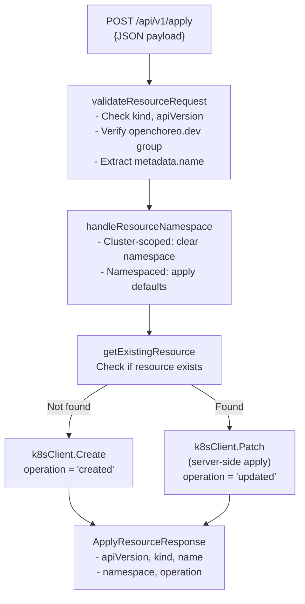

**Cluster-Scoped Resources:** Currently only `Organization` is cluster-scoped. The handler automatically clears the namespace field for cluster-scoped resources.

**Server-Side Apply:** Uses `client.Apply` patch type with `ForceOwnership` and `FieldOwner("choreoctl")`.

**Sources:** [internal/openchoreo-api/handlers/apply.go L30-L261](https://github.com/openchoreo/openchoreo/blob/a577e969/internal/openchoreo-api/handlers/apply.go#L30-L261)

### DeleteResource Endpoint

**Handler:** [internal/openchoreo-api/handlers/apply.go L129-L202](https://github.com/openchoreo/openchoreo/blob/a577e969/internal/openchoreo-api/handlers/apply.go#L129-L202)

**Flow:**

```csharp
1. Decode JSON payload to unstructured object
2. Validate resource using validateResourceRequest
3. Handle namespace logic via handleResourceNamespace
4. Check if resource exists via getExistingResource
5. If exists: k8sClient.Delete, return "deleted"
6. If not found: return "not_found"
```

**Sources:** [internal/openchoreo-api/handlers/apply.go L129-L202](https://github.com/openchoreo/openchoreo/blob/a577e969/internal/openchoreo-api/handlers/apply.go#L129-L202)

### Shared Validation Logic

Both endpoints use common helper functions:

| Function | Purpose | Location |
| --- | --- | --- |
| `validateResourceRequest` | Validates kind, apiVersion, metadata.name; ensures `openchoreo.dev` group | [apply.go L266-L300](https://github.com/openchoreo/openchoreo/blob/a577e969/apply.go#L266-L300) |
| `handleResourceNamespace` | Manages namespace defaulting for namespaced resources | [apply.go L205-L235](https://github.com/openchoreo/openchoreo/blob/a577e969/apply.go#L205-L235) |
| `isClusterScopedResource` | Determines if resource is cluster-scoped | [apply.go L238-L245](https://github.com/openchoreo/openchoreo/blob/a577e969/apply.go#L238-L245) |
| `handleNamespacedResource` | Applies default namespace if not specified | [apply.go L248-L261](https://github.com/openchoreo/openchoreo/blob/a577e969/apply.go#L248-L261) |
| `getExistingResource` | Checks resource existence | [apply.go L315-L325](https://github.com/openchoreo/openchoreo/blob/a577e969/apply.go#L315-L325) |

**Sources:** [internal/openchoreo-api/handlers/apply.go L264-L325](https://github.com/openchoreo/openchoreo/blob/a577e969/internal/openchoreo-api/handlers/apply.go#L264-L325)

### HTTP Endpoints

| Method | Path | Handler | Purpose |
| --- | --- | --- | --- |
| POST | `/api/v1/apply` | `ApplyResource` | Create or update any OpenChoreo resource |
| DELETE | `/api/v1/delete` | `DeleteResource` | Delete any OpenChoreo resource |

**Sources:** [internal/openchoreo-api/handlers/handlers.go L41-L44](https://github.com/openchoreo/openchoreo/blob/a577e969/internal/openchoreo-api/handlers/handlers.go#L41-L44)

---

## Service Initialization

All services are initialized together in the `NewServices` function, which establishes dependency relationships.

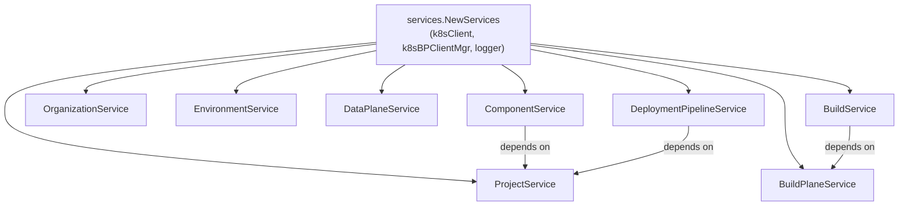

**Initialization Order:**

1. Independent services (Project, Organization, Environment, DataPlane)
2. BuildPlaneService (requires k8sBPClientMgr)
3. Dependent services (Component, Build, DeploymentPipeline)

**Sources:** [internal/openchoreo-api/services/services.go L13-L68](https://github.com/openchoreo/openchoreo/blob/a577e969/internal/openchoreo-api/services/services.go#L13-L68)

---

## Multi-Cluster Client Management

The `KubeMultiClientManager` (referenced but not detailed in provided files) is a key infrastructure component that manages authenticated Kubernetes clients for multiple clusters.

### Usage Pattern

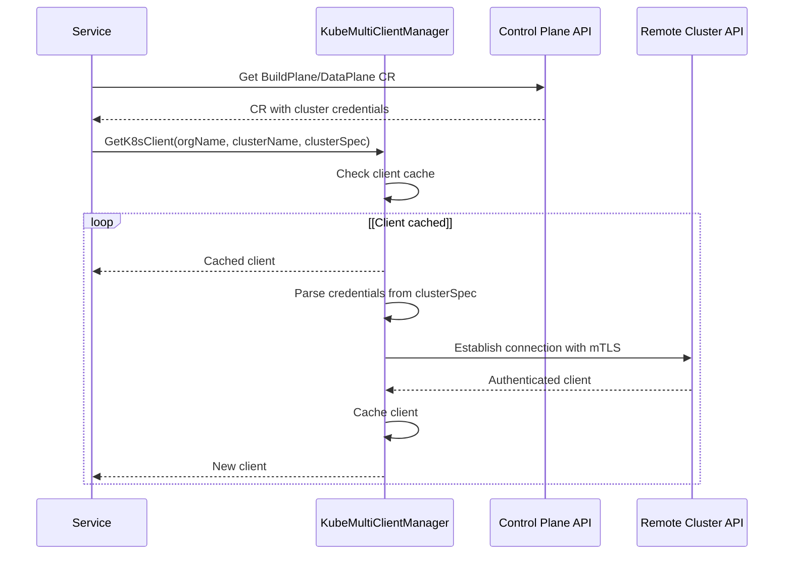

**Sources:** [internal/openchoreo-api/services/build_service.go L29](https://github.com/openchoreo/openchoreo/blob/a577e969/internal/openchoreo-api/services/build_service.go#L29-L29)

 [internal/openchoreo-api/services/buildplane_service.go L22](https://github.com/openchoreo/openchoreo/blob/a577e969/internal/openchoreo-api/services/buildplane_service.go#L22-L22)

---

## Error Handling

All services follow consistent error handling patterns defined in [internal/openchoreo-api/services/errors.go L1-L41](https://github.com/openchoreo/openchoreo/blob/a577e969/internal/openchoreo-api/services/errors.go#L1-L41)

:

### Service Errors

| Error | Code | HTTP Status | Usage |
| --- | --- | --- | --- |
| `ErrDataPlaneNotFound` | `DATAPLANE_NOT_FOUND` | 404 | DataPlane CR doesn't exist |
| `ErrDataPlaneAlreadyExists` | `DATAPLANE_EXISTS` | 409 | Duplicate DataPlane creation |
| `ErrBindingNotFound` | `BINDING_NOT_FOUND` | 404 | Referenced in build observer URL logic |

### Status Determination

Services use condition-based status determination with consistent logic:

```
status := statusUnknown
if len(resource.Status.Conditions) > 0 {
    latestCondition := resource.Status.Conditions[len(resource.Status.Conditions)-1]
    if latestCondition.Status == metav1.ConditionTrue {
        status = statusReady
    } else {
        status = statusNotReady
    }
}
```

**Status Constants:**

* `statusReady = "Ready"`
* `statusNotReady = "NotReady"`
* `statusUnknown = "Unknown"`

**Sources:** [internal/openchoreo-api/services/dataplane_service.go L209-L218](https://github.com/openchoreo/openchoreo/blob/a577e969/internal/openchoreo-api/services/dataplane_service.go#L209-L218)

 [internal/openchoreo-api/services/buildplane_service.go L106](https://github.com/openchoreo/openchoreo/blob/a577e969/internal/openchoreo-api/services/buildplane_service.go#L106-L106)

---

## Request/Response Models

### BuildResponse

Returned by `TriggerBuild` and `ListBuilds`:

```json
{
  "name": "component-build-abc123",
  "uuid": "k8s-uid",
  "componentName": "my-service",
  "projectName": "my-project",
  "orgName": "my-org",
  "commit": "abc123def456",
  "status": "Completed",
  "createdAt": "2024-01-15T10:30:00Z",
  "image": "registry.example.com/my-org/my-service:abc123"
}
```

**Sources:** [internal/openchoreo-api/models/response.go L200-L211](https://github.com/openchoreo/openchoreo/blob/a577e969/internal/openchoreo-api/models/response.go#L200-L211)

### BuildTemplateResponse

Returned by `ListBuildTemplates`:

```json
{
  "name": "ballerina-buildpack",
  "parameters": [
    {
      "name": "ballerinaVersion",
      "default": "2201.8.0"
    }
  ],
  "createdAt": "2024-01-10T08:00:00Z"
}
```

**Sources:** [internal/openchoreo-api/models/response.go L213-L225](https://github.com/openchoreo/openchoreo/blob/a577e969/internal/openchoreo-api/models/response.go#L213-L225)

### DataPlaneResponse

Returned by `CreateDataPlane`, `GetDataPlane`, and `ListDataPlanes`:

```json
{
  "name": "prod-dataplane",
  "namespace": "my-org",
  "displayName": "Production Data Plane",
  "description": "Production environment cluster",
  "registryPrefix": "registry.openchoreo-data-plane:5000",
  "registrySecretRef": "registry-credentials",
  "kubernetesClusterName": "prod-dataplane",
  "apiServerURL": "https://k8s-api.example.com:6443",
  "publicVirtualHost": "*.apps.example.com",
  "organizationVirtualHost": "*.org.example.com",
  "observerURL": "https://opensearch.example.com",
  "observerUsername": "admin",
  "createdAt": "2024-01-12T14:00:00Z",
  "status": "Ready"
}
```

**Sources:** [internal/openchoreo-api/models/response.go L168-L184](https://github.com/openchoreo/openchoreo/blob/a577e969/internal/openchoreo-api/models/response.go#L168-L184)

### CreateDataPlaneRequest

Used to create DataPlane CRs:

```html
{
  "name": "prod-dataplane",
  "displayName": "Production Data Plane",
  "description": "Production cluster",
  "registryPrefix": "registry.openchoreo-data-plane:5000",
  "registrySecretRef": "registry-credentials",
  "kubernetesClusterName": "prod-cluster",
  "apiServerURL": "https://k8s-api.example.com:6443",
  "caCert": "<base64-encoded-ca-cert>",
  "clientCert": "<base64-encoded-client-cert>",
  "clientKey": "<base64-encoded-client-key>",
  "publicVirtualHost": "*.apps.example.com",
  "organizationVirtualHost": "*.org.example.com",
  "observerURL": "https://opensearch.example.com",
  "observerUsername": "admin",
  "observerPassword": "<password>"
}
```

**Sources:** [internal/openchoreo-api/models/request.go L60-L77](https://github.com/openchoreo/openchoreo/blob/a577e969/internal/openchoreo-api/models/request.go#L60-L77)

---

## Integration with Controllers

These services create Custom Resources that are reconciled by controllers:

| Service Operation | CR Created | Controller | Purpose |
| --- | --- | --- | --- |
| `BuildService.TriggerBuild` | `Build` | BuildController | Triggers Argo Workflow in build plane |
| `DataPlaneService.CreateDataPlane` | `DataPlane` | None (read-only) | Stores cluster credentials for deployment controllers |

The services act as the **write path** for infrastructure configuration, while controllers act as the **reconciliation path** that ensures desired state matches actual state.

**Sources:** [internal/openchoreo-api/services/build_service.go L112-L143](https://github.com/openchoreo/openchoreo/blob/a577e969/internal/openchoreo-api/services/build_service.go#L112-L143)

 [internal/openchoreo-api/services/dataplane_service.go L98-L102](https://github.com/openchoreo/openchoreo/blob/a577e969/internal/openchoreo-api/services/dataplane_service.go#L98-L102)