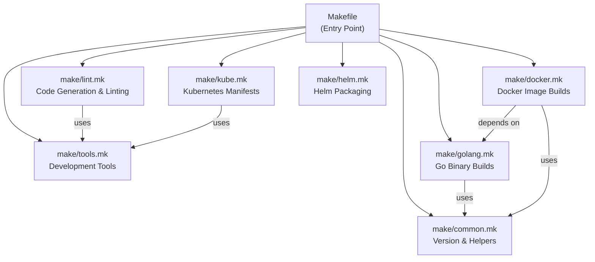
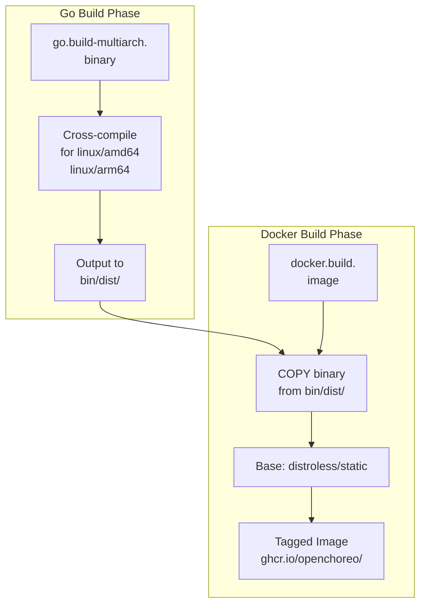
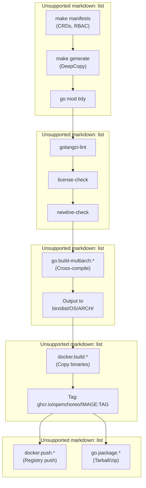

# Building from Source

> **Relevant source files**
> * [.github/actions/setup-go/action.yml](https://github.com/openchoreo/openchoreo/blob/a577e969/.github/actions/setup-go/action.yml)
> * [Makefile](https://github.com/openchoreo/openchoreo/blob/a577e969/Makefile)
> * [cmd/choreoctl/Dockerfile](https://github.com/openchoreo/openchoreo/blob/a577e969/cmd/choreoctl/Dockerfile)
> * [cmd/observer/Dockerfile](https://github.com/openchoreo/openchoreo/blob/a577e969/cmd/observer/Dockerfile)
> * [docs/observability-logging.md](https://github.com/openchoreo/openchoreo/blob/a577e969/docs/observability-logging.md)
> * [go.mod](https://github.com/openchoreo/openchoreo/blob/a577e969/go.mod)
> * [go.sum](https://github.com/openchoreo/openchoreo/blob/a577e969/go.sum)
> * [install/helm/openchoreo-identity-provider/templates/post-install-hook.yaml](https://github.com/openchoreo/openchoreo/blob/a577e969/install/helm/openchoreo-identity-provider/templates/post-install-hook.yaml)
> * [internal/controller/conditions_test.go](https://github.com/openchoreo/openchoreo/blob/a577e969/internal/controller/conditions_test.go)
> * [internal/controller/deployment/controller_conditions.go](https://github.com/openchoreo/openchoreo/blob/a577e969/internal/controller/deployment/controller_conditions.go)
> * [make/common.mk](https://github.com/openchoreo/openchoreo/blob/a577e969/make/common.mk)
> * [make/docker.mk](https://github.com/openchoreo/openchoreo/blob/a577e969/make/docker.mk)
> * [make/golang.mk](https://github.com/openchoreo/openchoreo/blob/a577e969/make/golang.mk)
> * [make/kube.mk](https://github.com/openchoreo/openchoreo/blob/a577e969/make/kube.mk)
> * [make/lint.mk](https://github.com/openchoreo/openchoreo/blob/a577e969/make/lint.mk)
> * [make/tools.mk](https://github.com/openchoreo/openchoreo/blob/a577e969/make/tools.mk)

This page documents the build system for compiling OpenChoreo binaries and Docker images from source code. It covers the Makefile-based build targets, multi-architecture compilation, code generation, and image creation workflows. For setting up a local development environment, see [Development Environment Setup](/openchoreo/openchoreo/9.1-development-environment-setup). For packaging and releasing builds, see [Release Process](/openchoreo/openchoreo/9.4-release-process).

## Prerequisites

Building from source requires:

* **Go 1.24.2+** (specified in [go.mod L3](https://github.com/openchoreo/openchoreo/blob/a577e969/go.mod#L3-L3) )
* **Docker** or compatible container runtime
* **Make** (GNU Make)
* **Git** (for version metadata)

Optional for multi-architecture builds:

* **Docker Buildx** with QEMU emulation support

## Build System Architecture

The build system is organized across multiple Makefile modules that are imported by the root [Makefile L1-L16](https://github.com/openchoreo/openchoreo/blob/a577e969/Makefile#L1-L16)



**Sources:** [Makefile L1-L16](https://github.com/openchoreo/openchoreo/blob/a577e969/Makefile#L1-L16)

 [make/common.mk L1-L46](https://github.com/openchoreo/openchoreo/blob/a577e969/make/common.mk#L1-L46)

### Version Management

Build versions are derived from two sources:

| Source | Variable | Location | Purpose |
| --- | --- | --- | --- |
| VERSION file | `RELEASE_VERSION` | [make/common.mk L11](https://github.com/openchoreo/openchoreo/blob/a577e969/make/common.mk#L11-L11) | Semantic version |
| Git commit | `GIT_REV` | [make/common.mk L14](https://github.com/openchoreo/openchoreo/blob/a577e969/make/common.mk#L14-L14) | Short commit SHA |

These values are injected into binaries via linker flags at [make/golang.mk L29-L32](https://github.com/openchoreo/openchoreo/blob/a577e969/make/golang.mk#L29-L32)

:

```
GO_LDFLAGS_BUILD_DATA = \
  -X github.com/openchoreo/openchoreo/internal/version.buildTime=... \
  -X github.com/openchoreo/openchoreo/internal/version.gitRevision=$(GIT_REV) \
  -X github.com/openchoreo/openchoreo/internal/version.version=$(RELEASE_VERSION)
```

**Sources:** [make/common.mk L10-L14](https://github.com/openchoreo/openchoreo/blob/a577e969/make/common.mk#L10-L14)

 [make/golang.mk L25-L32](https://github.com/openchoreo/openchoreo/blob/a577e969/make/golang.mk#L25-L32)

## Building Go Binaries

### Binary Targets

The build system compiles five Go binaries defined in [make/golang.mk L14-L19](https://github.com/openchoreo/openchoreo/blob/a577e969/make/golang.mk#L14-L19)

:

| Binary Name | Source Path | Purpose | Image |
| --- | --- | --- | --- |
| `manager` | `cmd/main.go` | Controller manager (CRD reconcilers) | `controller` |
| `choreoctl` | `cmd/choreoctl/main.go` | CLI tool | `openchoreo-cli` |
| `openchoreo-api` | `cmd/openchoreo-api/main.go` | HTTP REST API server | `openchoreo-api` |
| `observer` | `cmd/observer/main.go` | Observability query service | `observer` |
| `openchoreo-cli` | `cmd/choreoctl/main.go` | CLI (alias for quick-start) | `quick-start` |

**Sources:** [make/golang.mk L14-L19](https://github.com/openchoreo/openchoreo/blob/a577e969/make/golang.mk#L14-L19)

 [make/docker.mk L28-L33](https://github.com/openchoreo/openchoreo/blob/a577e969/make/docker.mk#L28-L33)

### Single-Architecture Builds

Build a binary for your current platform:

```markdown
# Build specific binary
make go.build.manager
make go.build.choreoctl
make go.build.openchoreo-api
make go.build.observer

# Build all binaries
make go.build
```

Artifacts are written to `bin/dist/$(GOOS)/$(GOARCH)/` as determined by [make/golang.mk L42](https://github.com/openchoreo/openchoreo/blob/a577e969/make/golang.mk#L42-L42)

**Example output structure:**

```
bin/dist/
└── linux/
    └── amd64/
        ├── manager
        ├── choreoctl
        ├── openchoreo-api
        └── observer
```

**Sources:** [make/golang.mk L81-L90](https://github.com/openchoreo/openchoreo/blob/a577e969/make/golang.mk#L81-L90)

### Multi-Architecture Builds

Build binaries for all supported platforms defined in [make/golang.mk L10](https://github.com/openchoreo/openchoreo/blob/a577e969/make/golang.mk#L10-L10)

:

```markdown
# Build specific binary for all platforms
make go.build-multiarch.choreoctl

# Build all binaries for all platforms
make go.build-multiarch
```

**Supported platforms:**

* `linux/amd64`
* `linux/arm64`
* `darwin/amd64` (macOS Intel)
* `darwin/arm64` (macOS Apple Silicon)
* `windows/amd64`
* `windows/arm64`

The `go_build` function at [make/golang.mk L37-L51](https://github.com/openchoreo/openchoreo/blob/a577e969/make/golang.mk#L37-L51)

 handles cross-compilation:

```
CGO_ENABLED=0 GOOS=$(OS) GOARCH=$(ARCH) \
  $(GO) build -o $(OUTPUT_PATH)/$(COMMAND) -ldflags "$(GO_LDFLAGS)" \
  $(MAIN_PACKAGE_PATH)
```

**Sources:** [make/golang.mk L9-L10](https://github.com/openchoreo/openchoreo/blob/a577e969/make/golang.mk#L9-L10)

 [make/golang.mk L94-L105](https://github.com/openchoreo/openchoreo/blob/a577e969/make/golang.mk#L94-L105)

 [make/golang.mk L37-L51](https://github.com/openchoreo/openchoreo/blob/a577e969/make/golang.mk#L37-L51)

### Packaging Binaries

Create distribution archives for multi-architecture binaries:

```markdown
# Package specific binary
make go.package.choreoctl

# Package all binaries
make go.package
```

This creates `.tar.gz` files (Unix) or `.zip` files (Windows) with the naming pattern:

```
<binary>_v<VERSION>_<OS>_<ARCH>.<ext>
```

Example: `choreoctl_v0.1.0_linux_amd64.tar.gz`

**Sources:** [make/golang.mk L111-L122](https://github.com/openchoreo/openchoreo/blob/a577e969/make/golang.mk#L111-L122)

 [make/golang.mk L53-L70](https://github.com/openchoreo/openchoreo/blob/a577e969/make/golang.mk#L53-L70)

## Building Docker Images

### Image Build Workflow



**Sources:** [make/docker.mk L45-L54](https://github.com/openchoreo/openchoreo/blob/a577e969/make/docker.mk#L45-L54)

 [make/docker.mk L69-L76](https://github.com/openchoreo/openchoreo/blob/a577e969/make/docker.mk#L69-L76)

### Image Definitions

Five Docker images are built, defined in [make/docker.mk L28-L33](https://github.com/openchoreo/openchoreo/blob/a577e969/make/docker.mk#L28-L33)

:

| Image Name | Dockerfile | Context | Dependencies |
| --- | --- | --- | --- |
| `controller` | `Dockerfile` | `$(PROJECT_DIR)` | `manager` binary |
| `quick-start` | `install/quick-start/Dockerfile` | `$(PROJECT_DIR)` | `choreoctl` binary |
| `openchoreo-api` | `cmd/openchoreo-api/Dockerfile` | `$(PROJECT_DIR)` | `openchoreo-api` binary |
| `observer` | `cmd/observer/Dockerfile` | `$(PROJECT_DIR)` | `observer` binary |
| `openchoreo-cli` | `cmd/choreoctl/Dockerfile` | `$(PROJECT_DIR)` | `choreoctl` binary |

**Sources:** [make/docker.mk L28-L33](https://github.com/openchoreo/openchoreo/blob/a577e969/make/docker.mk#L28-L33)

### Single-Architecture Image Builds

Build images for your current platform (requires pre-built Go binaries):

```markdown
# Build specific image
make docker.build.controller
make docker.build.openchoreo-api

# Build all images
make docker.build
```

The build dependencies at [make/docker.mk L70-L73](https://github.com/openchoreo/openchoreo/blob/a577e969/make/docker.mk#L70-L73)

 ensure Go binaries are compiled first:

```
docker.build.controller: go.build-multiarch.manager
docker.build.quick-start: go.build-multiarch.choreoctl
docker.build.openchoreo-api: go.build-multiarch.openchoreo-api
docker.build.observer: go.build-multiarch.observer
```

Images are tagged as `ghcr.io/openchoreo/<image>:latest-dev` by default (configurable via `TAG` and `IMAGE_REPO_PREFIX` variables).

**Sources:** [make/docker.mk L61-L79](https://github.com/openchoreo/openchoreo/blob/a577e969/make/docker.mk#L61-L79)

 [make/docker.mk L10-L11](https://github.com/openchoreo/openchoreo/blob/a577e969/make/docker.mk#L10-L11)

### Multi-Architecture Image Builds

Build and push multi-arch images using Docker Buildx:

```markdown
# Setup buildx (one-time)
make docker.setup-multiarch

# Build multi-arch image (doesn't push)
make docker.build-multiarch.controller

# Build and push multi-arch image
make docker.push-multiarch.controller

# Push all multi-arch images
make docker.push-multiarch
```

The `docker.setup-multiarch` target at [make/docker.mk L100-L102](https://github.com/openchoreo/openchoreo/blob/a577e969/make/docker.mk#L100-L102)

 creates a buildx builder:

```sql
docker buildx create --name open-choreo-builder --use \
  --platform "linux/amd64,linux/arm64"
```

Target platforms are defined in [make/docker.mk L17](https://github.com/openchoreo/openchoreo/blob/a577e969/make/docker.mk#L17-L17)

 as `linux/amd64` and `linux/arm64`.

**Sources:** [make/docker.mk L95-L132](https://github.com/openchoreo/openchoreo/blob/a577e969/make/docker.mk#L95-L132)

 [make/docker.mk L17](https://github.com/openchoreo/openchoreo/blob/a577e969/make/docker.mk#L17-L17)

### Dockerfile Structure

All service Dockerfiles follow the same pattern using distroless base images. Example from [cmd/observer/Dockerfile L3-L25](https://github.com/openchoreo/openchoreo/blob/a577e969/cmd/observer/Dockerfile#L3-L25)

:

```dockerfile
FROM gcr.io/distroless/static:nonroot
ARG TARGETOS
ARG TARGETARCH

WORKDIR /
COPY bin/dist/${TARGETOS}/${TARGETARCH}/observer .
USER 65532:65532
ENTRYPOINT ["/observer"]
```

This pattern:

* Uses minimal distroless base for security
* Copies pre-built binary from `bin/dist/$(TARGETOS)/$(TARGETARCH)/`
* Runs as non-root user (65532)
* Single-stage build (binaries built separately)

**Sources:** [cmd/observer/Dockerfile L1-L26](https://github.com/openchoreo/openchoreo/blob/a577e969/cmd/observer/Dockerfile#L1-L26)

 [cmd/choreoctl/Dockerfile L1-L22](https://github.com/openchoreo/openchoreo/blob/a577e969/cmd/choreoctl/Dockerfile#L1-L22)

## Code Generation

### CRD and Manifest Generation

Generate Kubernetes manifests (CRDs, RBAC, webhooks):

```
make manifests
```

This target at [make/kube.mk L8-L9](https://github.com/openchoreo/openchoreo/blob/a577e969/make/kube.mk#L8-L9)

 uses controller-gen:

```yaml
$(CONTROLLER_GEN) rbac:roleName=manager-role \
  crd:generateEmbeddedObjectMeta=true \
  webhook paths="./api/...;./internal/controller/..." \
  output:crd:artifacts:config=config/crd/bases
```

Generated artifacts:

* **CRDs:** `config/crd/bases/*.yaml`
* **RBAC:** ClusterRole manifests for the controller manager
* **Webhooks:** Webhook configurations

**Sources:** [make/kube.mk L7-L9](https://github.com/openchoreo/openchoreo/blob/a577e969/make/kube.mk#L7-L9)

### DeepCopy Method Generation

Generate DeepCopy, DeepCopyInto, and DeepCopyObject methods for API types:

```
make generate
```

This target at [make/kube.mk L12-L13](https://github.com/openchoreo/openchoreo/blob/a577e969/make/kube.mk#L12-L13)

 processes types in `api/`:

```
$(CONTROLLER_GEN) object:headerFile="hack/boilerplate.go.txt" \
  paths="./api/..."
```

Generated file: [api/v1alpha1/zz_generated.deepcopy.go](https://github.com/openchoreo/openchoreo/blob/a577e969/api/v1alpha1/zz_generated.deepcopy.go)

 (excluded from version control linting at [make/lint.mk L9](https://github.com/openchoreo/openchoreo/blob/a577e969/make/lint.mk#L9-L9)

).

**Sources:** [make/kube.mk L11-L13](https://github.com/openchoreo/openchoreo/blob/a577e969/make/kube.mk#L11-L13)

 [make/lint.mk L8-L9](https://github.com/openchoreo/openchoreo/blob/a577e969/make/lint.mk#L8-L9)

### Complete Code Generation

Run all code generation and linting:

```markdown
# Generate code and run formatters
make code.gen

# Verify git status is clean after generation (CI check)
make code.gen-check
```

The `code.gen` target at [make/lint.mk L77](https://github.com/openchoreo/openchoreo/blob/a577e969/make/lint.mk#L77-L77)

 runs:

1. `manifests` - Generate CRDs/RBAC/webhooks
2. `generate` - Generate DeepCopy methods
3. `go.mod.lint` - Tidy go.mod
4. `helm-generate` - Generate Helm charts

**Sources:** [make/lint.mk L76-L85](https://github.com/openchoreo/openchoreo/blob/a577e969/make/lint.mk#L76-L85)

## Linting and Validation

### License Header Checking

All Go files must have Apache 2.0 license headers:

```markdown
# Check for missing headers
make license-check

# Add missing headers
make license-fix
```

Implements custom license tool at [make/lint.mk L13-L22](https://github.com/openchoreo/openchoreo/blob/a577e969/make/lint.mk#L13-L22)

 that processes all Go files except generated code.

**Sources:** [make/lint.mk L5-L22](https://github.com/openchoreo/openchoreo/blob/a577e969/make/lint.mk#L5-L22)

### Linter Execution

Run golangci-lint for code quality:

```markdown
# Check code
make golangci-lint-check

# Auto-fix issues
make golangci-lint-fix

# Run all linters (golangci-lint + license + newline)
make lint
```

**Sources:** [make/lint.mk L62-L74](https://github.com/openchoreo/openchoreo/blob/a577e969/make/lint.mk#L62-L74)

## Complete Build Workflow



**Sources:** [make/golang.mk L94-L105](https://github.com/openchoreo/openchoreo/blob/a577e969/make/golang.mk#L94-L105)

 [make/docker.mk L108-L114](https://github.com/openchoreo/openchoreo/blob/a577e969/make/docker.mk#L108-L114)

 [make/lint.mk L76-L85](https://github.com/openchoreo/openchoreo/blob/a577e969/make/lint.mk#L76-L85)

## Common Build Scenarios

### Local Development Build

Build controller for local testing:

```markdown
# Generate code
make manifests generate

# Build manager binary
make go.build.manager

# Binary at: bin/dist/linux/amd64/manager
```

### Release Build

Build all artifacts for release:

```markdown
# 1. Generate and validate
make code.gen
make lint

# 2. Build all binaries for all platforms
make go.build-multiarch

# 3. Package binaries
make go.package

# 4. Build and push multi-arch images
make docker.setup-multiarch
make docker.push-multiarch

# Artifacts:
# - bin/dist/OS/ARCH/*.tar.gz (binaries)
# - ghcr.io/openchoreo/* (images)
```

### Quick-Start Image Build

Build the containerized development environment:

```markdown
# Build quick-start image (includes choreoctl)
make docker.build.quick-start

# Image: ghcr.io/openchoreo/quick-start:latest-dev
```

**Sources:** [make/docker.mk L28-L33](https://github.com/openchoreo/openchoreo/blob/a577e969/make/docker.mk#L28-L33)

## Environment Variables

Customize builds with these variables:

| Variable | Default | Purpose | Example |
| --- | --- | --- | --- |
| `TAG` | `latest-dev` | Docker image tag | `TAG=v0.1.0 make docker.build` |
| `IMAGE_REPO_PREFIX` | `ghcr.io/openchoreo` | Image repository | `IMAGE_REPO_PREFIX=myregistry make docker.build` |
| `GO_TARGET_PLATFORMS` | 6 platforms | Build platforms | `GO_TARGET_PLATFORMS="linux/amd64" make go.build-multiarch` |
| `RELEASE_VERSION` | From VERSION file | Version string | Set in VERSION file |

**Sources:** [make/common.mk L10-L14](https://github.com/openchoreo/openchoreo/blob/a577e969/make/common.mk#L10-L14)

 [make/docker.mk L10-L11](https://github.com/openchoreo/openchoreo/blob/a577e969/make/docker.mk#L10-L11)

 [make/golang.mk L10](https://github.com/openchoreo/openchoreo/blob/a577e969/make/golang.mk#L10-L10)

## Build Artifacts

### Directory Structure

```go
openchoreo/
├── bin/
│   ├── dist/                    # Compiled binaries
│   │   ├── linux/
│   │   │   ├── amd64/
│   │   │   │   ├── manager
│   │   │   │   ├── choreoctl
│   │   │   │   ├── openchoreo-api
│   │   │   │   ├── observer
│   │   │   │   ├── choreoctl_v*.tar.gz
│   │   │   │   └── ...
│   │   │   └── arm64/
│   │   ├── darwin/
│   │   └── windows/
│   └── tools/                   # Development tools
│       ├── controller-gen-*
│       ├── kustomize-*
│       └── golangci-lint-*
├── config/
│   └── crd/
│       └── bases/               # Generated CRDs
└── api/
    └── v1alpha1/
        └── zz_generated.deepcopy.go  # Generated DeepCopy
```

**Sources:** [make/golang.mk L23](https://github.com/openchoreo/openchoreo/blob/a577e969/make/golang.mk#L23-L23)

 [make/tools.mk L21-L24](https://github.com/openchoreo/openchoreo/blob/a577e969/make/tools.mk#L21-L24)

 [make/kube.mk L9](https://github.com/openchoreo/openchoreo/blob/a577e969/make/kube.mk#L9-L9)