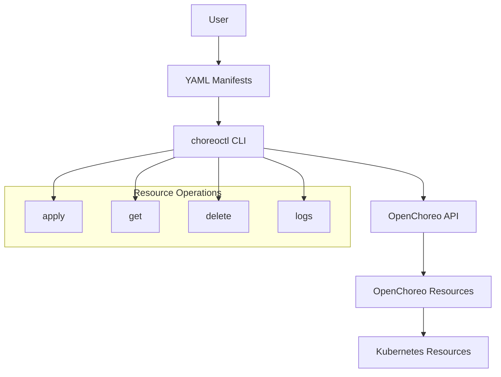
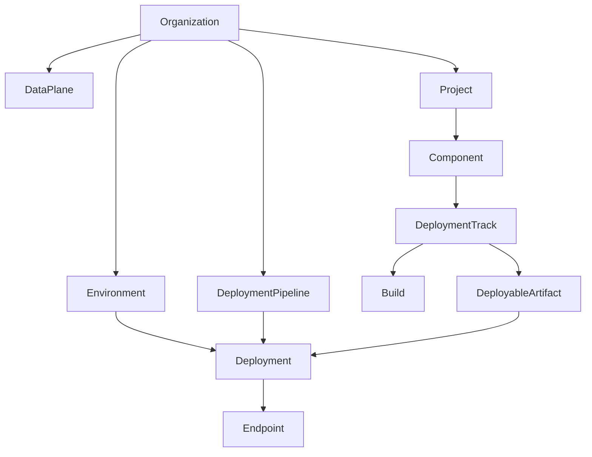
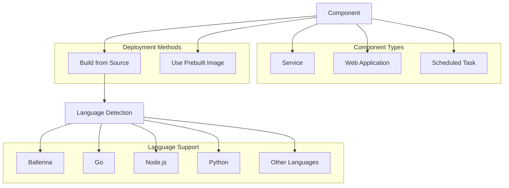
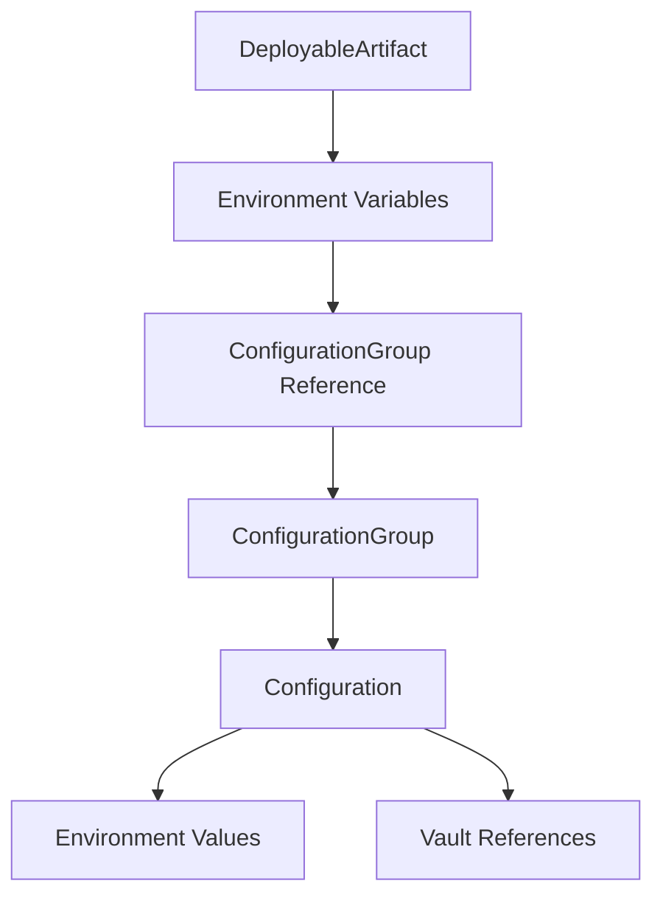
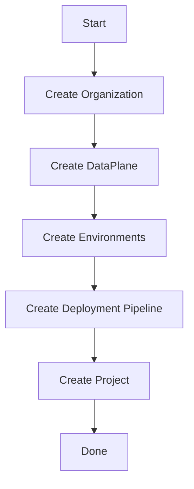
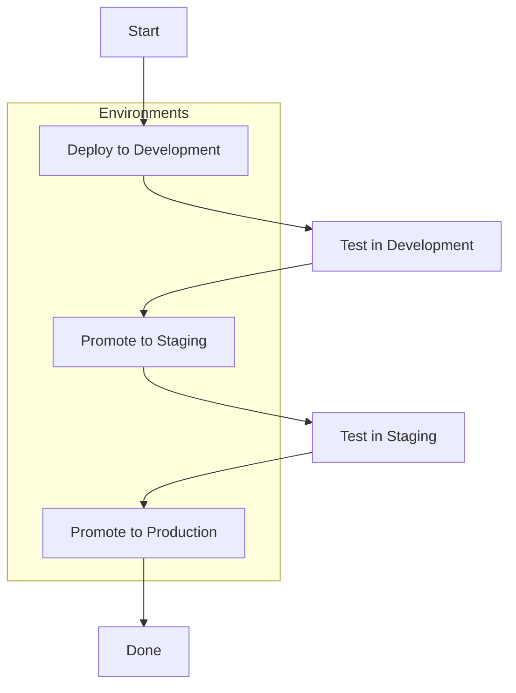

# CLI and Usage

> **Relevant source files**
> * [cmd/openchoreo-api/main.go](https://github.com/openchoreo/openchoreo/blob/a577e969/cmd/openchoreo-api/main.go)
> * [install/quick-start/Dockerfile](https://github.com/openchoreo/openchoreo/blob/a577e969/install/quick-start/Dockerfile)
> * [install/quick-start/deploy_web_application.sh](https://github.com/openchoreo/openchoreo/blob/a577e969/install/quick-start/deploy_web_application.sh)
> * [install/quick-start/install.sh](https://github.com/openchoreo/openchoreo/blob/a577e969/install/quick-start/install.sh)
> * [install/quick-start/uninstall.sh](https://github.com/openchoreo/openchoreo/blob/a577e969/install/quick-start/uninstall.sh)
> * [internal/choreoctl/resources/kinds/dataplane.go](https://github.com/openchoreo/openchoreo/blob/a577e969/internal/choreoctl/resources/kinds/dataplane.go)
> * [internal/openchoreo-api/clients/k8s.go](https://github.com/openchoreo/openchoreo/blob/a577e969/internal/openchoreo-api/clients/k8s.go)
> * [internal/openchoreo-api/handlers/apply.go](https://github.com/openchoreo/openchoreo/blob/a577e969/internal/openchoreo-api/handlers/apply.go)
> * [internal/openchoreo-api/handlers/buildplanes.go](https://github.com/openchoreo/openchoreo/blob/a577e969/internal/openchoreo-api/handlers/buildplanes.go)
> * [internal/openchoreo-api/handlers/builds.go](https://github.com/openchoreo/openchoreo/blob/a577e969/internal/openchoreo-api/handlers/builds.go)
> * [internal/openchoreo-api/handlers/components.go](https://github.com/openchoreo/openchoreo/blob/a577e969/internal/openchoreo-api/handlers/components.go)
> * [internal/openchoreo-api/handlers/dataplanes.go](https://github.com/openchoreo/openchoreo/blob/a577e969/internal/openchoreo-api/handlers/dataplanes.go)
> * [internal/openchoreo-api/handlers/environments.go](https://github.com/openchoreo/openchoreo/blob/a577e969/internal/openchoreo-api/handlers/environments.go)
> * [internal/openchoreo-api/handlers/handlers.go](https://github.com/openchoreo/openchoreo/blob/a577e969/internal/openchoreo-api/handlers/handlers.go)
> * [internal/openchoreo-api/handlers/helpers.go](https://github.com/openchoreo/openchoreo/blob/a577e969/internal/openchoreo-api/handlers/helpers.go)
> * [internal/openchoreo-api/handlers/organizations.go](https://github.com/openchoreo/openchoreo/blob/a577e969/internal/openchoreo-api/handlers/organizations.go)
> * [internal/openchoreo-api/handlers/workloads.go](https://github.com/openchoreo/openchoreo/blob/a577e969/internal/openchoreo-api/handlers/workloads.go)
> * [internal/openchoreo-api/models/request.go](https://github.com/openchoreo/openchoreo/blob/a577e969/internal/openchoreo-api/models/request.go)
> * [internal/openchoreo-api/models/response.go](https://github.com/openchoreo/openchoreo/blob/a577e969/internal/openchoreo-api/models/response.go)
> * [internal/openchoreo-api/services/build_service.go](https://github.com/openchoreo/openchoreo/blob/a577e969/internal/openchoreo-api/services/build_service.go)
> * [internal/openchoreo-api/services/buildplane_service.go](https://github.com/openchoreo/openchoreo/blob/a577e969/internal/openchoreo-api/services/buildplane_service.go)
> * [internal/openchoreo-api/services/component_service.go](https://github.com/openchoreo/openchoreo/blob/a577e969/internal/openchoreo-api/services/component_service.go)
> * [internal/openchoreo-api/services/dataplane_service.go](https://github.com/openchoreo/openchoreo/blob/a577e969/internal/openchoreo-api/services/dataplane_service.go)
> * [internal/openchoreo-api/services/environment_service.go](https://github.com/openchoreo/openchoreo/blob/a577e969/internal/openchoreo-api/services/environment_service.go)
> * [internal/openchoreo-api/services/errors.go](https://github.com/openchoreo/openchoreo/blob/a577e969/internal/openchoreo-api/services/errors.go)
> * [internal/openchoreo-api/services/organization_service.go](https://github.com/openchoreo/openchoreo/blob/a577e969/internal/openchoreo-api/services/organization_service.go)
> * [internal/openchoreo-api/services/project_service.go](https://github.com/openchoreo/openchoreo/blob/a577e969/internal/openchoreo-api/services/project_service.go)
> * [internal/openchoreo-api/services/services.go](https://github.com/openchoreo/openchoreo/blob/a577e969/internal/openchoreo-api/services/services.go)

This document provides an overview of the OpenChoreo command-line interface (CLI) tool called `choreoctl`, which serves as the primary way to interact with the OpenChoreo platform. This page covers CLI installation, command syntax, common operations, and workflows for managing the platform and deploying applications. For in-depth information about specific resource kinds, see [Custom Resources](/openchoreo/openchoreo/5-api-and-services).

## Overview

OpenChoreo follows a Kubernetes-style declarative approach where resources are defined in YAML manifests and applied to the platform using the `choreoctl` CLI tool. This enables users to version control their platform configuration and application deployments using GitOps workflows.



Sources: samples/README.md, samples/configuring-choreo/create-new-organization/README.md

## Installation

The `choreoctl` CLI is available for various operating systems. Installation details will vary based on your platform.

### Prerequisites

* Kubernetes cluster with OpenChoreo installed
* `kubectl` configured to access your cluster

### Installing choreoctl

Download and install the appropriate version of `choreoctl` for your operating system, then add it to your PATH.

## Basic Commands

The `choreoctl` CLI follows similar patterns to other Kubernetes-based tools like `kubectl`. Here are the core commands:

| Command | Description | Example |
| --- | --- | --- |
| `apply` | Create or update resources | `choreoctl apply -f manifest.yaml` |
| `delete` | Remove resources | `choreoctl delete -f manifest.yaml` |
| `get` | Retrieve resource information | `choreoctl get components` |
| `logs` | View logs for deployments | `choreoctl logs deployment/my-app` |

### Apply Command

The `apply` command is used to create or update resources defined in YAML manifests:

```
choreoctl apply -f <filename>
```

You can also apply manifests directly from a URL:

```sql
choreoctl apply -f https://raw.githubusercontent.com/openchoreo/openchoreo/main/samples/configuring-choreo/create-new-organization/organization.yaml
```

Sources: samples/configuring-choreo/create-new-organization/README.md, samples/configuring-choreo/create-new-environments/README.md

### Delete Command

The `delete` command removes resources defined in YAML manifests:

```sql
choreoctl delete -f <filename>
```

Example of removing all resources defined in a manifest:

```sql
choreoctl delete -f https://raw.githubusercontent.com/openchoreo/openchoreo/main/samples/configuring-choreo/create-new-organization/complete-organization.yaml
```

Sources: samples/configuring-choreo/create-new-organization/README.md

## Resource Management Workflow

OpenChoreo follows a hierarchical resource model. Understanding this hierarchy is key to effective resource management.



Sources: samples/README.md, samples/configuring-choreo/complete-organization.yaml

### Organization Setup

Organizations are the top-level resource that contain all other resources. To create a new organization:

```
choreoctl apply -f organization.yaml
```

A complete organization setup includes:

* Organization resource
* DataPlane configuration
* Environments (Development, Staging, Production)
* Deployment Pipeline
* Projects

Sources: samples/configuring-choreo/create-new-organization/README.md, samples/configuring-choreo/create-new-organization/complete-organization.yaml

### Environment Management

Environments represent different deployment targets such as Development, Staging, and Production. Create environments with:

```
choreoctl apply -f development-environment.yaml
choreoctl apply -f staging-environment.yaml
choreoctl apply -f production-environment.yaml
```

Sources: samples/configuring-choreo/create-new-environments/README.md

### Deployment Pipeline Configuration

Deployment Pipelines define promotion paths between environments, allowing applications to move from Development to Staging to Production:

```
choreoctl apply -f deployment-pipeline.yaml
```

You can update existing deployment pipelines to add or modify promotion paths:

```
choreoctl apply -f updated-deployment-pipeline.yaml
```

Sources: samples/configuring-choreo/create-new-deployment-pipeline/README.md, samples/configuring-choreo/update-deployment-pipeline/README.md

### Project Creation

Projects organize related components:

```
choreoctl apply -f project.yaml
```

Sources: samples/deploying-applications/add-new-project/README.md

## Application Deployment

OpenChoreo supports different deployment methods and application types.



Sources: samples/README.md

### Deploying From Source Code

For source code deployments, OpenChoreo uses BuildPacks to automatically detect and build applications in supported languages:

1. Define a Component with source code reference
2. Create a DeploymentTrack
3. A Build will be created automatically
4. When the Build completes, a DeployableArtifact is created
5. Create a Deployment to deploy the artifact to an environment

Supported languages include:

* Ballerina
* Go
* Node.js
* Python
* And more

Sources: samples/README.md

### Using Pre-built Images

For pre-built container images:

1. Define a Component with container registry reference
2. Create a DeploymentTrack
3. Create a DeployableArtifact referencing the image
4. Create a Deployment to deploy the artifact to an environment

Example:

```yaml
apiVersion: core.choreo.dev/v1
kind: Component
metadata:
  name: my-component
  namespace: default-org
spec:
  type: Service
  source:
    containerRegistry:
      imageName: ghcr.io/myorg/myapp
```

Sources: samples/deploying-applications/use-prebuilt-image/github-issue-reporter-task/github-issue-reporter.yaml

## Configuration Management

OpenChoreo provides a powerful configuration management system through ConfigurationGroups that separate configuration from deployment.



Key features:

* Environment-specific configuration values
* Secure secret management via Vault integration
* Environment grouping to reduce duplication
* Environment variable mapping from configuration

Example of referencing configurations:

```yaml
configuration:
  application:
    env:
      - key: DATABASE_URL
        valueFrom:
          configurationGroupRef:
            name: database
            key: url
```

Sources: samples/deploying-applications/use-prebuilt-image/github-issue-reporter-task/github-issue-reporter.yaml

## Common CLI Workflows

### Setting up a Complete Organization



```markdown
# Apply the complete organization manifest
choreoctl apply -f complete-organization.yaml
```

Sources: samples/configuring-choreo/create-new-organization/README.md, samples/configuring-choreo/create-new-organization/complete-organization.yaml

### Deploying and Promoting Applications



The promotion flow follows the paths defined in the DeploymentPipeline resource, which can require approvals for production environments.

## Summary

The `choreoctl` CLI provides a comprehensive interface for managing the OpenChoreo platform and deploying applications. By using YAML manifests and following GitOps practices, you can create reproducible deployments and platform configurations that are version controlled and easy to audit.

For more detailed information about specific resource types, see [Custom Resources](/openchoreo/openchoreo/5-api-and-services). For information about the build system, see [Build System](/openchoreo/openchoreo/3-build-system).

Sources: samples/README.md, go.mod