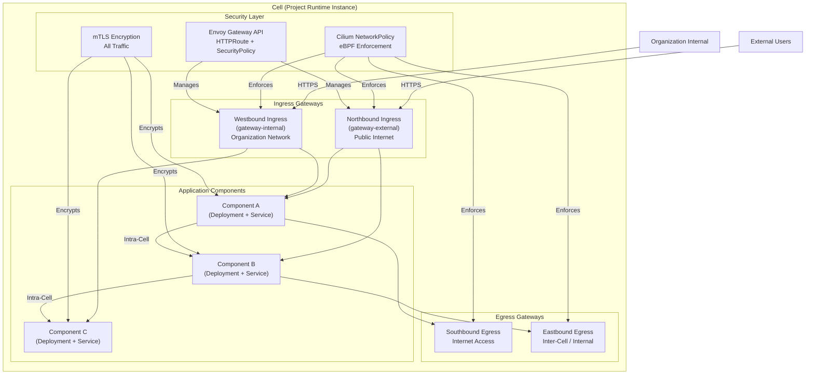
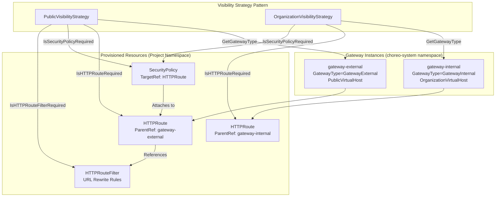
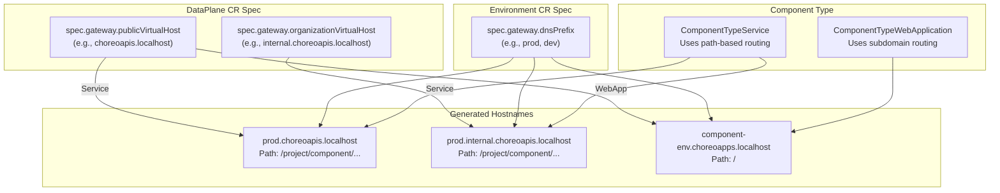
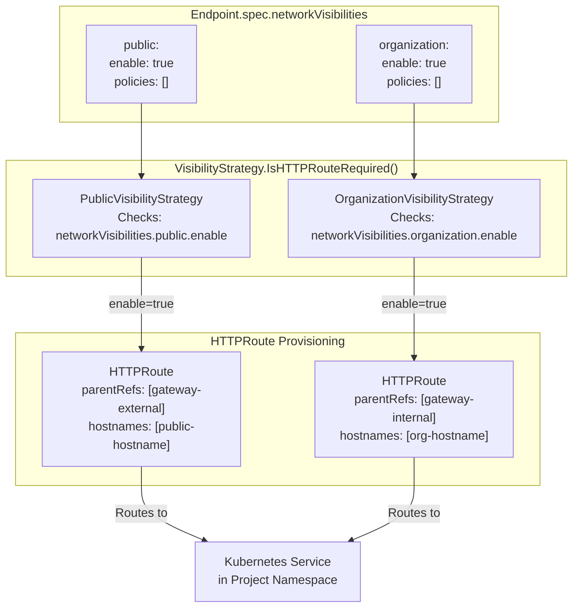
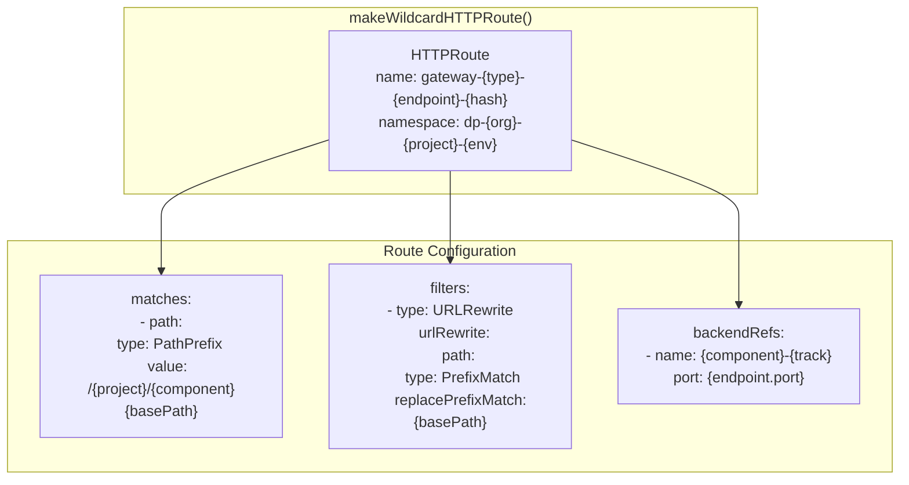
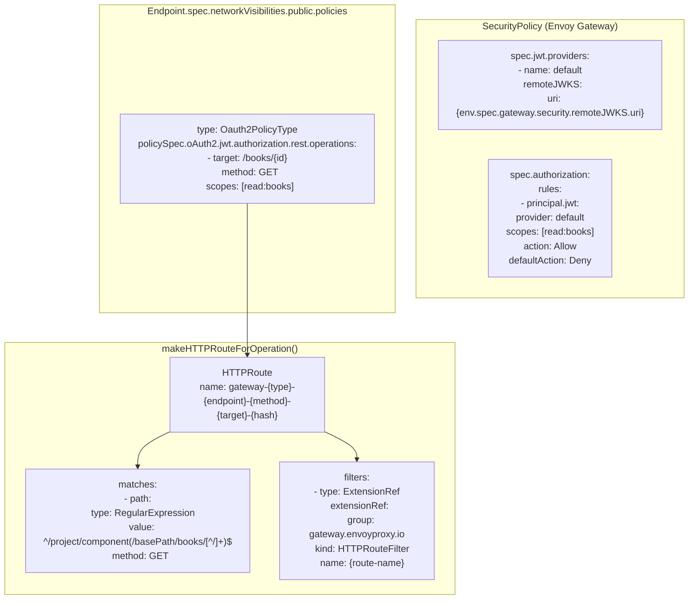
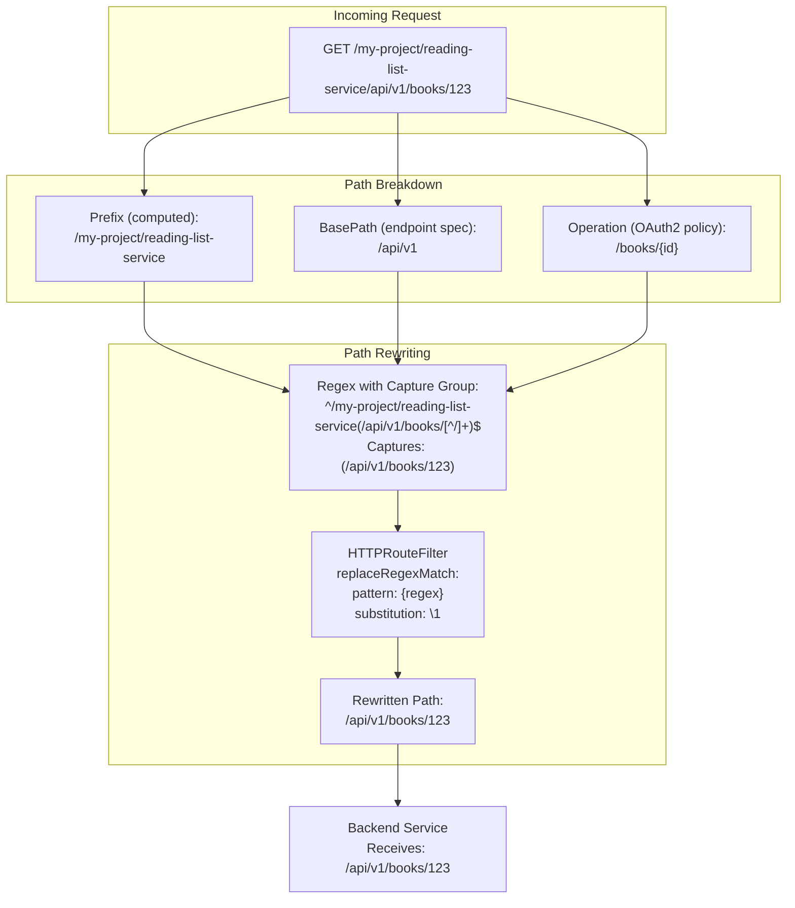
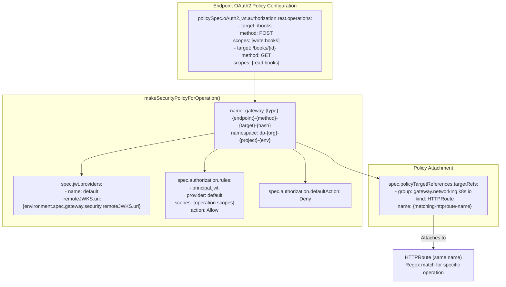
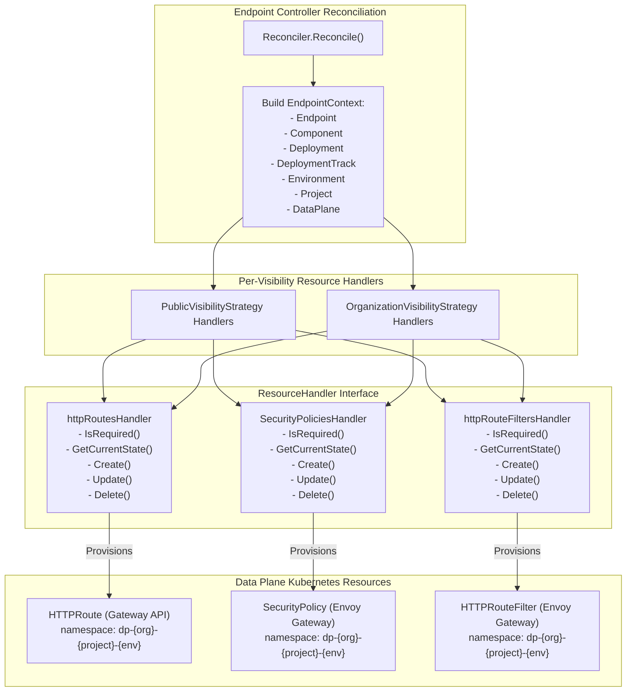
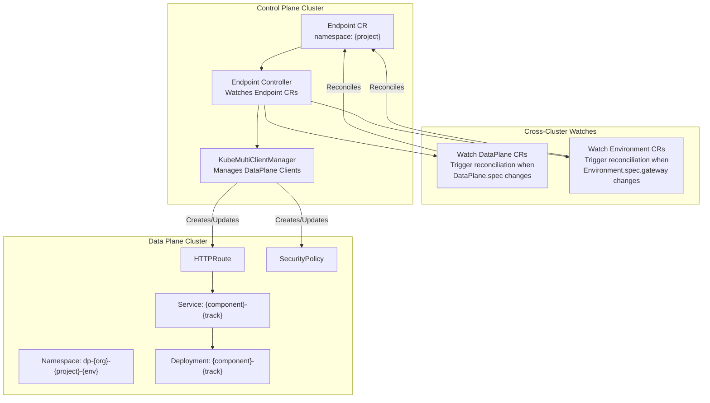

# Cell Runtime Model

> **Relevant source files**
> * [README.md](https://github.com/openchoreo/openchoreo/blob/a577e969/README.md)
> * [docs/images/openchoreo-cell-runtime-view.png](https://github.com/openchoreo/openchoreo/blob/a577e969/docs/images/openchoreo-cell-runtime-view.png)
> * [docs/images/openchoreo-ddd-to-cell-mapping.png](https://github.com/openchoreo/openchoreo/blob/a577e969/docs/images/openchoreo-ddd-to-cell-mapping.png)
> * [docs/images/openchoreo-development-abstractions.png](https://github.com/openchoreo/openchoreo/blob/a577e969/docs/images/openchoreo-development-abstractions.png)
> * [docs/images/openchoreo-overall-architecture.png](https://github.com/openchoreo/openchoreo/blob/a577e969/docs/images/openchoreo-overall-architecture.png)
> * [docs/images/openchoreo-platform-abstractions.png](https://github.com/openchoreo/openchoreo/blob/a577e969/docs/images/openchoreo-platform-abstractions.png)
> * [internal/controller/deployment/integrations/kubernetes/ports.go](https://github.com/openchoreo/openchoreo/blob/a577e969/internal/controller/deployment/integrations/kubernetes/ports.go)
> * [internal/controller/endpoint/controller_test.go](https://github.com/openchoreo/openchoreo/blob/a577e969/internal/controller/endpoint/controller_test.go)
> * [internal/controller/endpoint/controller_watch.go](https://github.com/openchoreo/openchoreo/blob/a577e969/internal/controller/endpoint/controller_watch.go)
> * [internal/controller/endpoint/integrations/kubernetes/http_route.go](https://github.com/openchoreo/openchoreo/blob/a577e969/internal/controller/endpoint/integrations/kubernetes/http_route.go)
> * [internal/controller/endpoint/integrations/kubernetes/http_route_test.go](https://github.com/openchoreo/openchoreo/blob/a577e969/internal/controller/endpoint/integrations/kubernetes/http_route_test.go)
> * [internal/controller/endpoint/integrations/kubernetes/httproute_filters.go](https://github.com/openchoreo/openchoreo/blob/a577e969/internal/controller/endpoint/integrations/kubernetes/httproute_filters.go)
> * [internal/controller/endpoint/integrations/kubernetes/security_policy.go](https://github.com/openchoreo/openchoreo/blob/a577e969/internal/controller/endpoint/integrations/kubernetes/security_policy.go)
> * [internal/controller/endpoint/integrations/kubernetes/visibility/strategy.go](https://github.com/openchoreo/openchoreo/blob/a577e969/internal/controller/endpoint/integrations/kubernetes/visibility/strategy.go)

## Purpose and Scope

This document describes the Cell runtime model, which is OpenChoreo's foundational infrastructure pattern for isolating and securing applications at runtime. A Cell is the runtime instantiation of a Project, transforming the logical grouping of Components into a secure, observable execution unit with explicitly controlled ingress and egress paths.

This page focuses on the runtime architecture, traffic flow patterns, and security enforcement mechanisms. For information about the development-time abstractions (Project, Component, Endpoint), see [Platform Abstractions](/openchoreo/openchoreo/2.1-platform-abstractions). For details on how Endpoints are provisioned and exposed, see [Endpoint Controller](/openchoreo/openchoreo/4.3-endpoint-controller).

---

## Overview

A **Cell** encapsulates all Components of a Project and enforces domain boundaries through infrastructure. Each Cell has four well-defined traffic paths, each served by dedicated gateways and enforced by network policies:

| Traffic Path | Direction | Purpose | Gateway Type | Visibility Level |
| --- | --- | --- | --- | --- |
| **Northbound Ingress** | Inbound | Public internet traffic | `gateway-external` | `public` |
| **Westbound Ingress** | Inbound | Organization-internal traffic | `gateway-internal` | `organization` |
| **Southbound Egress** | Outbound | External service connections | Egress gateway | External |
| **Eastbound Egress** | Outbound | Inter-cell communication | Egress gateway | Internal |



**Sources:**

* [README.md L72-L88](https://github.com/openchoreo/openchoreo/blob/a577e969/README.md#L72-L88)
* [README.md L109-L115](https://github.com/openchoreo/openchoreo/blob/a577e969/README.md#L109-L115)

---

## Gateway Architecture

### Gateway Types and Visibility Strategies

OpenChoreo uses the Kubernetes Gateway API to expose Endpoints through two distinct gateway instances, each serving a specific visibility level. The mapping between endpoint visibility and gateway selection is implemented through the `VisibilityStrategy` pattern.



**Gateway Type Constants:**

| Constant | Value | Purpose |
| --- | --- | --- |
| `visibility.GatewayExternal` | `"gateway-external"` | Public-facing gateway for Northbound ingress |
| `visibility.GatewayInternal` | `"gateway-internal"` | Organization-facing gateway for Westbound ingress |

**Sources:**

* [internal/controller/endpoint/integrations/kubernetes/visibility/strategy.go L11-L20](https://github.com/openchoreo/openchoreo/blob/a577e969/internal/controller/endpoint/integrations/kubernetes/visibility/strategy.go#L11-L20)
* [internal/controller/endpoint/integrations/kubernetes/http_route.go L252-L257](https://github.com/openchoreo/openchoreo/blob/a577e969/internal/controller/endpoint/integrations/kubernetes/http_route.go#L252-L257)

### Hostname Resolution

Each gateway serves requests for distinct virtual hosts, determined by the Environment and DataPlane configuration:



**Hostname Construction Logic:**

For Service components, hostnames use environment DNS prefix:

* Public: `{env.spec.gateway.dnsPrefix}.{dataplane.spec.gateway.publicVirtualHost}`
* Organization: `{env.spec.gateway.dnsPrefix}.{dataplane.spec.gateway.organizationVirtualHost}`

For WebApplication components, hostnames use component-specific subdomains:

* Public: `{component-name}-{env-name}.choreoapps.localhost`

**Sources:**

* [internal/controller/endpoint/integrations/kubernetes/http_route_test.go L669-L670](https://github.com/openchoreo/openchoreo/blob/a577e969/internal/controller/endpoint/integrations/kubernetes/http_route_test.go#L669-L670)
* [internal/controller/endpoint/integrations/kubernetes/http_route_test.go L101-L102](https://github.com/openchoreo/openchoreo/blob/a577e969/internal/controller/endpoint/integrations/kubernetes/http_route_test.go#L101-L102)
* [internal/controller/endpoint/integrations/kubernetes/http_route_test.go L275-L276](https://github.com/openchoreo/openchoreo/blob/a577e969/internal/controller/endpoint/integrations/kubernetes/http_route_test.go#L275-L276)

---

## Network Visibility and Endpoint Exposure

### Visibility Configuration Model

Endpoints declare their intended visibility through the `NetworkVisibilities` specification, which determines which gateways will expose them:



**Key Implementation Details:**

1. **Public Visibility** (Northbound Ingress): * Checked by `PublicVisibilityStrategy.IsHTTPRouteRequired()` * Creates HTTPRoute with `parentRefs: [{name: "gateway-external", namespace: "choreo-system"}]` * WebApplication components always get public visibility regardless of configuration
2. **Organization Visibility** (Westbound Ingress): * Checked by `OrganizationVisibilityStrategy.IsHTTPRouteRequired()` * Creates HTTPRoute with `parentRefs: [{name: "gateway-internal", namespace: "choreo-system"}]` * WebApplication components explicitly disable organization visibility

**Sources:**

* [internal/controller/endpoint/integrations/kubernetes/visibility/strategy.go L61-L67](https://github.com/openchoreo/openchoreo/blob/a577e969/internal/controller/endpoint/integrations/kubernetes/visibility/strategy.go#L61-L67)
* [internal/controller/endpoint/integrations/kubernetes/visibility/strategy.go L99-L105](https://github.com/openchoreo/openchoreo/blob/a577e969/internal/controller/endpoint/integrations/kubernetes/visibility/strategy.go#L99-L105)
* [internal/controller/endpoint/integrations/kubernetes/http_route.go L150-L186](https://github.com/openchoreo/openchoreo/blob/a577e969/internal/controller/endpoint/integrations/kubernetes/http_route.go#L150-L186)

### HTTPRoute Resource Structure

The Endpoint Controller provisions `HTTPRoute` resources in the data plane to configure traffic routing. Each endpoint may result in multiple HTTPRoute objects depending on OAuth2 policy configuration.

**Wildcard HTTPRoute (Default):**

When no OAuth2 operations are defined, a single wildcard HTTPRoute is created that matches all requests to the endpoint's base path:



**Operation-Specific HTTPRoutes (OAuth2):**

When OAuth2 policies with REST operations are configured, additional HTTPRoutes are created per operation with regex path matching:



**Sources:**

* [internal/controller/endpoint/integrations/kubernetes/http_route.go L229-L296](https://github.com/openchoreo/openchoreo/blob/a577e969/internal/controller/endpoint/integrations/kubernetes/http_route.go#L229-L296)
* [internal/controller/endpoint/integrations/kubernetes/http_route.go L298-L366](https://github.com/openchoreo/openchoreo/blob/a577e969/internal/controller/endpoint/integrations/kubernetes/http_route.go#L298-L366)
* [internal/controller/endpoint/integrations/kubernetes/security_policy.go L175-L232](https://github.com/openchoreo/openchoreo/blob/a577e969/internal/controller/endpoint/integrations/kubernetes/security_policy.go#L175-L232)

---

## Path Rewriting and URL Normalization

Service endpoints use path-based routing with a prefix structure: `/{project-name}/{component-name}/{base-path}`. The HTTPRoute and HTTPRouteFilter resources handle path rewriting to ensure backend services receive normalized paths.

### Path Structure for Service Components



**Regex Generation Algorithm:**

The `GenerateRegexWithCaptureGroup()` function constructs regex patterns that:

1. Match the full path including project/component prefix
2. Capture the base path + operation portion in a group
3. Substitute only the captured group, removing the prefix

**Example Transformation:**

* Request: `/default-project/reading-list-service/api/v1/reading-list/books/123`
* Regex: `^/default-project/reading-list-service(/api/v1/reading-list/books/[^/]+)$`
* Captured: `/api/v1/reading-list/books/123`
* Substitution: `\1` (replaces entire path with captured group)
* Result: `/api/v1/reading-list/books/123`

**Sources:**

* [internal/controller/endpoint/integrations/kubernetes/http_route.go L391-L447](https://github.com/openchoreo/openchoreo/blob/a577e969/internal/controller/endpoint/integrations/kubernetes/http_route.go#L391-L447)
* [internal/controller/endpoint/integrations/kubernetes/httproute_filters.go L175-L205](https://github.com/openchoreo/openchoreo/blob/a577e969/internal/controller/endpoint/integrations/kubernetes/httproute_filters.go#L175-L205)
* [internal/controller/endpoint/integrations/kubernetes/http_route_test.go L676-L697](https://github.com/openchoreo/openchoreo/blob/a577e969/internal/controller/endpoint/integrations/kubernetes/http_route_test.go#L676-L697)

---

## Security Enforcement

### OAuth2 Authorization with JWT

When Endpoints define OAuth2 policies with scope-based authorization, the Endpoint Controller provisions SecurityPolicy resources (Envoy Gateway CRD) that enforce JWT validation and scope checking.



**Authorization Flow:**

1. **JWT Validation**: SecurityPolicy references an OIDC provider's JWKS endpoint configured in `Environment.spec.gateway.security.remoteJWKS.uri`
2. **Scope Verification**: For each REST operation, required scopes are extracted from the JWT and matched against the policy's `scopes` list
3. **Default Deny**: Any request not matching an explicit Allow rule is denied
4. **Per-Operation Enforcement**: Each HTTP method + path combination gets its own SecurityPolicy attached to a specific HTTPRoute

**Visibility Strategy Check:**

Both `PublicVisibilityStrategy` and `OrganizationVisibilityStrategy` implement `IsSecurityPolicyRequired()` to determine if policies should be created based on:

* Visibility is enabled for that gateway type
* OAuth2 policy type is present
* JWT authorization with REST operations is configured
* At least one operation is defined

**Sources:**

* [internal/controller/endpoint/integrations/kubernetes/security_policy.go L146-L173](https://github.com/openchoreo/openchoreo/blob/a577e969/internal/controller/endpoint/integrations/kubernetes/security_policy.go#L146-L173)
* [internal/controller/endpoint/integrations/kubernetes/security_policy.go L175-L232](https://github.com/openchoreo/openchoreo/blob/a577e969/internal/controller/endpoint/integrations/kubernetes/security_policy.go#L175-L232)
* [internal/controller/endpoint/integrations/kubernetes/visibility/strategy.go L77-L87](https://github.com/openchoreo/openchoreo/blob/a577e969/internal/controller/endpoint/integrations/kubernetes/visibility/strategy.go#L77-L87)
* [internal/controller/endpoint/integrations/kubernetes/visibility/strategy.go L127-L174](https://github.com/openchoreo/openchoreo/blob/a577e969/internal/controller/endpoint/integrations/kubernetes/visibility/strategy.go#L127-L174)

### Network Policy Enforcement (Cilium)

While the provided code focuses on Gateway API resource provisioning, the README indicates that Cilium NetworkPolicies are used to enforce fine-grained network segmentation. These policies ensure that:

* Only traffic through designated ingress gateways can reach Cell components
* Egress traffic is routed through designated egress gateways
* Intra-Cell communication follows declared Connection dependencies

**Sources:**

* [README.md L77-L78](https://github.com/openchoreo/openchoreo/blob/a577e969/README.md#L77-L78)
* [README.md L111-L112](https://github.com/openchoreo/openchoreo/blob/a577e969/README.md#L111-L112)

---

## Resource Provisioning Flow

The Endpoint Controller orchestrates Cell ingress configuration through a handler-based reconciliation pattern:



**Handler Lifecycle:**

1. **IsRequired()**: Visibility strategy determines if resource is needed based on endpoint configuration
2. **GetCurrentState()**: Queries data plane cluster for existing resources via labels
3. **Create()**: Provisions new resources when none exist
4. **Update()**: Reconciles differences between desired and current state
5. **Delete()**: Removes resources when endpoint is deleted or visibility is disabled

**Label-Based Resource Selection:**

Resources are labeled with Cell-specific identifiers to enable cleanup and drift detection:

```yaml
labels:
  choreo.dev/organization-name: {org}
  choreo.dev/project-name: {project}
  choreo.dev/environment-name: {env}
  choreo.dev/component-name: {component}
  choreo.dev/endpoint-name: {endpoint}
  choreo.dev/gateway-type: {gateway-external|gateway-internal}
```

**Sources:**

* [internal/controller/endpoint/integrations/kubernetes/http_route.go L26-L46](https://github.com/openchoreo/openchoreo/blob/a577e969/internal/controller/endpoint/integrations/kubernetes/http_route.go#L26-L46)
* [internal/controller/endpoint/integrations/kubernetes/security_policy.go L24-L37](https://github.com/openchoreo/openchoreo/blob/a577e969/internal/controller/endpoint/integrations/kubernetes/security_policy.go#L24-L37)
* [internal/controller/endpoint/integrations/kubernetes/httproute_filters.go L23-L43](https://github.com/openchoreo/openchoreo/blob/a577e969/internal/controller/endpoint/integrations/kubernetes/httproute_filters.go#L23-L43)

---

## Cross-Cluster Reconciliation

The Endpoint Controller operates in the **Control Plane cluster** but provisions resources in the **Data Plane cluster**. This is enabled by the `KubeMultiClientManager` pattern, which maintains Kubernetes clients for multiple clusters.



**Watch Relationships:**

The Endpoint Controller sets up field indexes and watches to trigger reconciliation when dependent resources change:

* **DataPlane Changes**: `listEndpointsForDataplane()` finds all Endpoints in Environments using that DataPlane
* **Environment Changes**: `listEndpointsForEnvironment()` finds all Endpoints in that Environment

This ensures that gateway configuration changes (e.g., virtual host updates, security settings) automatically propagate to all affected Endpoints.

**Sources:**

* [internal/controller/endpoint/controller_watch.go L23-L36](https://github.com/openchoreo/openchoreo/blob/a577e969/internal/controller/endpoint/controller_watch.go#L23-L36)
* [internal/controller/endpoint/controller_watch.go L39-L73](https://github.com/openchoreo/openchoreo/blob/a577e969/internal/controller/endpoint/controller_watch.go#L39-L73)
* [internal/controller/endpoint/controller_watch.go L76-L104](https://github.com/openchoreo/openchoreo/blob/a577e969/internal/controller/endpoint/controller_watch.go#L76-L104)

---

## Summary

The Cell Runtime Model provides infrastructure-level enforcement of application boundaries through:

1. **Directional Traffic Paths**: Four distinct ingress/egress paths, each with dedicated gateways and policies
2. **Gateway API Integration**: HTTPRoute resources map visibility levels to gateway instances (`gateway-external` / `gateway-internal`)
3. **Path-Based Routing**: Service components use project/component prefixes with path rewriting for backend normalization
4. **OAuth2 Authorization**: Per-operation SecurityPolicy resources enforce JWT validation and scope-based access control
5. **Cross-Cluster Provisioning**: Control plane controllers provision data plane resources using multi-cluster client management
6. **Visibility Strategies**: Pluggable pattern for determining which gateways expose which endpoints based on configuration

This architecture ensures that every Cell operates as a secure, isolated unit with explicit, auditable communication paths, aligning with zero-trust security principles and Domain-Driven Design boundaries.