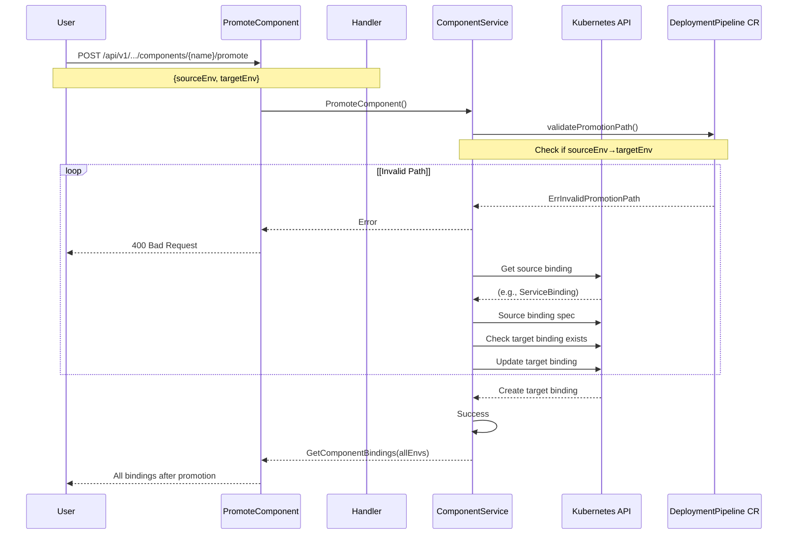
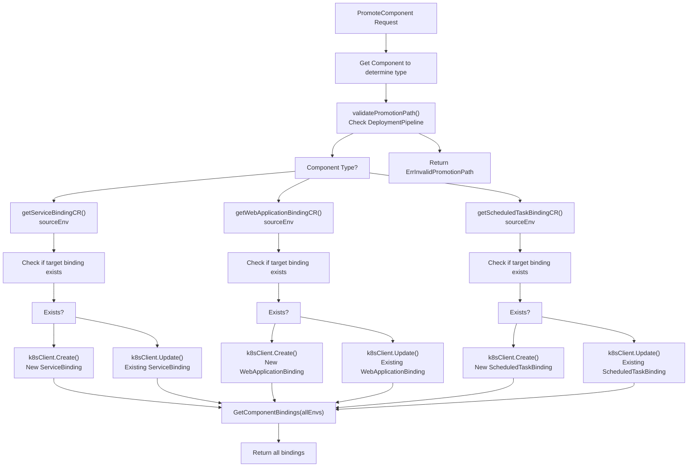
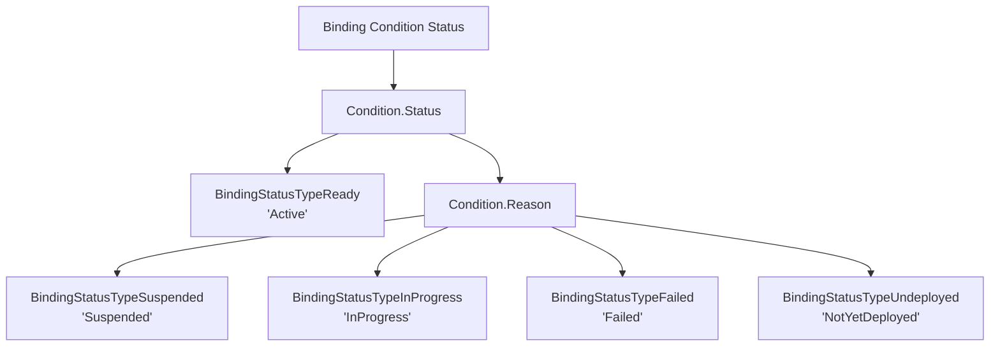
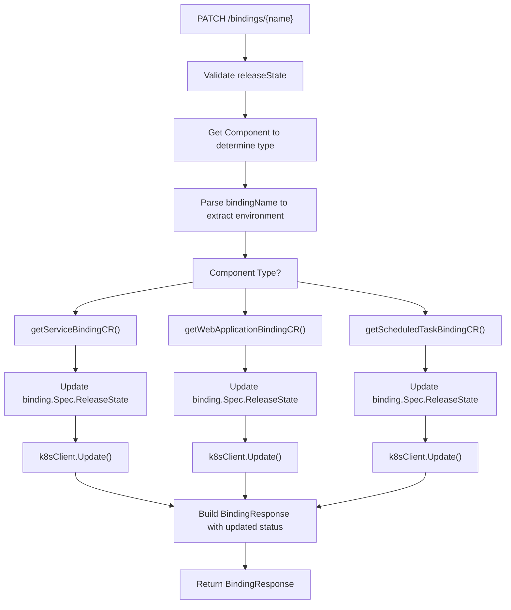
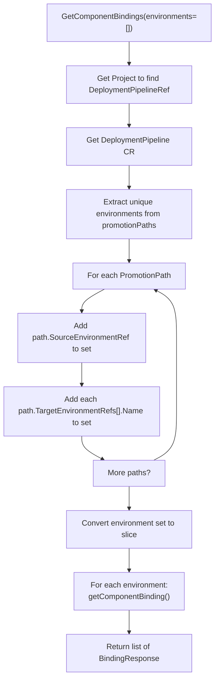
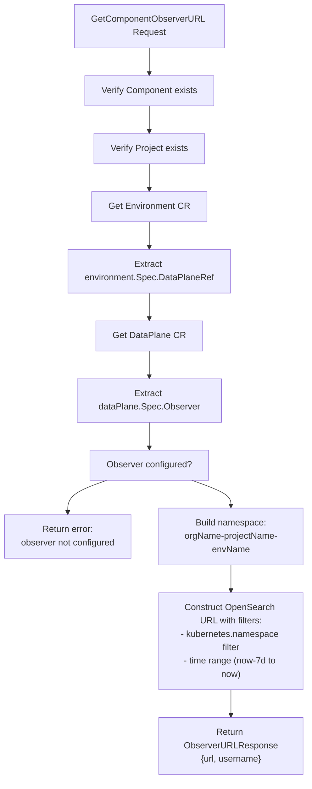

# Component Management

> **Relevant source files**
> * [cmd/openchoreo-api/main.go](https://github.com/openchoreo/openchoreo/blob/a577e969/cmd/openchoreo-api/main.go)
> * [internal/choreoctl/resources/kinds/dataplane.go](https://github.com/openchoreo/openchoreo/blob/a577e969/internal/choreoctl/resources/kinds/dataplane.go)
> * [internal/openchoreo-api/clients/k8s.go](https://github.com/openchoreo/openchoreo/blob/a577e969/internal/openchoreo-api/clients/k8s.go)
> * [internal/openchoreo-api/handlers/apply.go](https://github.com/openchoreo/openchoreo/blob/a577e969/internal/openchoreo-api/handlers/apply.go)
> * [internal/openchoreo-api/handlers/buildplanes.go](https://github.com/openchoreo/openchoreo/blob/a577e969/internal/openchoreo-api/handlers/buildplanes.go)
> * [internal/openchoreo-api/handlers/builds.go](https://github.com/openchoreo/openchoreo/blob/a577e969/internal/openchoreo-api/handlers/builds.go)
> * [internal/openchoreo-api/handlers/components.go](https://github.com/openchoreo/openchoreo/blob/a577e969/internal/openchoreo-api/handlers/components.go)
> * [internal/openchoreo-api/handlers/dataplanes.go](https://github.com/openchoreo/openchoreo/blob/a577e969/internal/openchoreo-api/handlers/dataplanes.go)
> * [internal/openchoreo-api/handlers/environments.go](https://github.com/openchoreo/openchoreo/blob/a577e969/internal/openchoreo-api/handlers/environments.go)
> * [internal/openchoreo-api/handlers/handlers.go](https://github.com/openchoreo/openchoreo/blob/a577e969/internal/openchoreo-api/handlers/handlers.go)
> * [internal/openchoreo-api/handlers/helpers.go](https://github.com/openchoreo/openchoreo/blob/a577e969/internal/openchoreo-api/handlers/helpers.go)
> * [internal/openchoreo-api/handlers/organizations.go](https://github.com/openchoreo/openchoreo/blob/a577e969/internal/openchoreo-api/handlers/organizations.go)
> * [internal/openchoreo-api/handlers/workloads.go](https://github.com/openchoreo/openchoreo/blob/a577e969/internal/openchoreo-api/handlers/workloads.go)
> * [internal/openchoreo-api/models/request.go](https://github.com/openchoreo/openchoreo/blob/a577e969/internal/openchoreo-api/models/request.go)
> * [internal/openchoreo-api/models/response.go](https://github.com/openchoreo/openchoreo/blob/a577e969/internal/openchoreo-api/models/response.go)
> * [internal/openchoreo-api/services/build_service.go](https://github.com/openchoreo/openchoreo/blob/a577e969/internal/openchoreo-api/services/build_service.go)
> * [internal/openchoreo-api/services/buildplane_service.go](https://github.com/openchoreo/openchoreo/blob/a577e969/internal/openchoreo-api/services/buildplane_service.go)
> * [internal/openchoreo-api/services/component_service.go](https://github.com/openchoreo/openchoreo/blob/a577e969/internal/openchoreo-api/services/component_service.go)
> * [internal/openchoreo-api/services/dataplane_service.go](https://github.com/openchoreo/openchoreo/blob/a577e969/internal/openchoreo-api/services/dataplane_service.go)
> * [internal/openchoreo-api/services/environment_service.go](https://github.com/openchoreo/openchoreo/blob/a577e969/internal/openchoreo-api/services/environment_service.go)
> * [internal/openchoreo-api/services/errors.go](https://github.com/openchoreo/openchoreo/blob/a577e969/internal/openchoreo-api/services/errors.go)
> * [internal/openchoreo-api/services/organization_service.go](https://github.com/openchoreo/openchoreo/blob/a577e969/internal/openchoreo-api/services/organization_service.go)
> * [internal/openchoreo-api/services/project_service.go](https://github.com/openchoreo/openchoreo/blob/a577e969/internal/openchoreo-api/services/project_service.go)
> * [internal/openchoreo-api/services/services.go](https://github.com/openchoreo/openchoreo/blob/a577e969/internal/openchoreo-api/services/services.go)

## Purpose and Scope

This page documents operational management of components after initial creation. It covers promoting components across environments, managing binding lifecycle states (Active/Suspend/Undeploy), querying component deployment status, and retrieving observer URLs for log access.

For creating and building components, see [Deploying Applications](/openchoreo/openchoreo/8.2-deploying-applications). For general CLI usage, see [choreoctl Commands](/openchoreo/openchoreo/8.1-choreoctl-commands).

---

## Component Promotion

Component promotion moves a component's deployment from a source environment to a target environment. The promotion operation validates the path against the project's `DeploymentPipeline` before creating or updating the binding in the target environment.

### Promotion Workflow



**Sources**: [internal/openchoreo-api/handlers/components.go L190-L261](https://github.com/openchoreo/openchoreo/blob/a577e969/internal/openchoreo-api/handlers/components.go#L190-L261)

 [internal/openchoreo-api/services/component_service.go L659-L696](https://github.com/openchoreo/openchoreo/blob/a577e969/internal/openchoreo-api/services/component_service.go#L659-L696)

### Promotion Path Validation

The promotion validates against `DeploymentPipeline.Spec.PromotionPaths`:

| Field | Type | Description |
| --- | --- | --- |
| `SourceEnvironmentRef` | string | Source environment name |
| `TargetEnvironmentRefs` | []TargetEnvironmentRef | List of allowed target environments |
| `TargetEnvironmentRefs[].Name` | string | Target environment name |
| `TargetEnvironmentRefs[].RequiresApproval` | bool | Whether promotion requires approval |

The validation logic in `validatePromotionPath()` iterates through promotion paths to find a matching source→target pair.

**Sources**: [internal/openchoreo-api/services/component_service.go L740-L782](https://github.com/openchoreo/openchoreo/blob/a577e969/internal/openchoreo-api/services/component_service.go#L740-L782)

### API Endpoint

**Request**:

```
POST /api/v1/orgs/{orgName}/projects/{projectName}/components/{componentName}/promote
```

**Request Body**:

```json
{
  "sourceEnv": "development",
  "targetEnv": "staging"
}
```

**Response**: Returns a list of `BindingResponse` objects for all environments after promotion.

**Sources**: [internal/openchoreo-api/handlers/components.go L190-L261](https://github.com/openchoreo/openchoreo/blob/a577e969/internal/openchoreo-api/handlers/components.go#L190-L261)

 [internal/openchoreo-api/models/request.go L43-L48](https://github.com/openchoreo/openchoreo/blob/a577e969/internal/openchoreo-api/models/request.go#L43-L48)

### Binding Copy Process



**Sources**: [internal/openchoreo-api/services/component_service.go L659-L696](https://github.com/openchoreo/openchoreo/blob/a577e969/internal/openchoreo-api/services/component_service.go#L659-L696)

 [internal/openchoreo-api/services/component_service.go L784-L796](https://github.com/openchoreo/openchoreo/blob/a577e969/internal/openchoreo-api/services/component_service.go#L784-L796)

 [internal/openchoreo-api/services/component_service.go L817-L875](https://github.com/openchoreo/openchoreo/blob/a577e969/internal/openchoreo-api/services/component_service.go#L817-L875)

 [internal/openchoreo-api/services/component_service.go L896-L954](https://github.com/openchoreo/openchoreo/blob/a577e969/internal/openchoreo-api/services/component_service.go#L896-L954)

 [internal/openchoreo-api/services/component_service.go L976-L1012](https://github.com/openchoreo/openchoreo/blob/a577e969/internal/openchoreo-api/services/component_service.go#L976-L1012)

---

## Binding Management

Bindings represent the deployment of a component in a specific environment. Each component type has its own binding resource: `ServiceBinding`, `WebApplicationBinding`, or `ScheduledTaskBinding`.

### Binding Lifecycle States

Bindings support three release states that control the lifecycle of deployed resources:

| Release State | Kubernetes Mapping | Description |
| --- | --- | --- |
| `Active` | Release with full resources | Component is deployed and serving traffic |
| `Suspend` | Release marked suspended | Resources exist but traffic routing is disabled |
| `Undeploy` | Release deleted | All deployed resources are removed |

**Sources**: [internal/openchoreo-api/models/request.go L160-L166](https://github.com/openchoreo/openchoreo/blob/a577e969/internal/openchoreo-api/models/request.go#L160-L166)

 [internal/openchoreo-api/services/component_service.go L1014-L1132](https://github.com/openchoreo/openchoreo/blob/a577e969/internal/openchoreo-api/services/component_service.go#L1014-L1132)

### Binding Status Mapping

The system maps Kubernetes condition statuses to user-friendly binding statuses:



**Sources**: [internal/openchoreo-api/services/component_service.go L717-L737](https://github.com/openchoreo/openchoreo/blob/a577e969/internal/openchoreo-api/services/component_service.go#L717-L737)

 [internal/openchoreo-api/models/response.go L71-L86](https://github.com/openchoreo/openchoreo/blob/a577e969/internal/openchoreo-api/models/response.go#L71-L86)

### Update Binding API

**Request**:

```
PATCH /api/v1/orgs/{orgName}/projects/{projectName}/components/{componentName}/bindings/{bindingName}
```

**Request Body**:

```json
{
  "releaseState": "Suspend"
}
```

Valid values: `Active`, `Suspend`, `Undeploy`

**Response**: Returns updated `BindingResponse` with current status.

**Sources**: [internal/openchoreo-api/handlers/components.go L263-L321](https://github.com/openchoreo/openchoreo/blob/a577e969/internal/openchoreo-api/handlers/components.go#L263-L321)

 [internal/openchoreo-api/models/request.go L168-L189](https://github.com/openchoreo/openchoreo/blob/a577e969/internal/openchoreo-api/models/request.go#L168-L189)

### Binding Update Implementation

The `UpdateComponentBinding` method handles all three binding types:



**Sources**: [internal/openchoreo-api/services/component_service.go L1014-L1132](https://github.com/openchoreo/openchoreo/blob/a577e969/internal/openchoreo-api/services/component_service.go#L1014-L1132)

---

## Querying Component Status

### Get Bindings Across Environments

The `GetComponentBindings` operation retrieves binding status for a component across multiple environments.

**Request**:

```
GET /api/v1/orgs/{orgName}/projects/{projectName}/components/{componentName}/bindings?environment=dev&environment=staging
```

If no `environment` query parameters are provided, the system retrieves all environments from the project's `DeploymentPipeline`.

**Sources**: [internal/openchoreo-api/handlers/components.go L144-L188](https://github.com/openchoreo/openchoreo/blob/a577e969/internal/openchoreo-api/handlers/components.go#L144-L188)

 [internal/openchoreo-api/services/component_service.go L364-L400](https://github.com/openchoreo/openchoreo/blob/a577e969/internal/openchoreo-api/services/component_service.go#L364-L400)

### Binding Response Structure

```json
{
  "success": true,
  "data": {
    "items": [
      {
        "name": "myservice-dev",
        "type": "Service",
        "componentName": "myservice",
        "projectName": "myproject",
        "orgName": "myorg",
        "environment": "development",
        "status": {
          "status": "Active",
          "reason": "ResourcesReady",
          "message": "All resources are healthy",
          "lastTransitioned": "2024-01-15T10:30:00Z"
        },
        "serviceBinding": {
          "endpoints": [
            {
              "name": "http",
              "type": "REST",
              "public": {
                "host": "myservice.example.com",
                "port": 443,
                "scheme": "HTTPS",
                "basePath": "/api",
                "uri": "https://myservice.example.com/api"
              }
            }
          ],
          "image": "registry.example.com/myorg/myservice:abc123"
        }
      }
    ]
  }
}
```

**Sources**: [internal/openchoreo-api/models/response.go L57-L119](https://github.com/openchoreo/openchoreo/blob/a577e969/internal/openchoreo-api/models/response.go#L57-L119)

### Binding Status Types

| Status Type | Constant | Description |
| --- | --- | --- |
| InProgress | `BindingStatusTypeInProgress` | Deployment in progress, resources being provisioned |
| Active | `BindingStatusTypeReady` | Component is running and healthy |
| Failed | `BindingStatusTypeFailed` | Deployment failed or resources unhealthy |
| Suspended | `BindingStatusTypeSuspended` | Resources suspended, not serving traffic |
| NotYetDeployed | `BindingStatusTypeUndeployed` | No deployment exists for this environment |

**Sources**: [internal/openchoreo-api/models/response.go L71-L79](https://github.com/openchoreo/openchoreo/blob/a577e969/internal/openchoreo-api/models/response.go#L71-L79)

### Environment Resolution

When no environments are specified, the system extracts them from the `DeploymentPipeline`:



**Sources**: [internal/openchoreo-api/services/component_service.go L607-L657](https://github.com/openchoreo/openchoreo/blob/a577e969/internal/openchoreo-api/services/component_service.go#L607-L657)

---

## Observer URLs

Observer URLs provide access to centralized logging for components and builds via the OpenSearch/Observer infrastructure.

### Component Observer URL

Retrieves the log viewer URL for a component deployed in a specific environment.

**Request**:

```
GET /api/v1/orgs/{orgName}/projects/{projectName}/components/{componentName}/environments/{environmentName}/observer-url
```

**Response**:

```css
{
  "success": true,
  "data": {
    "url": "https://observer.example.com/app/discover#/?_g=(filters:!(),time:(from:now-7d,to:now))&_a=(filters:!(('$state':(store:appState),meta:(alias:!n,disabled:!f,key:kubernetes.namespace,negate:!f,params:(query:myorg-myproject-dev)),query:(match_phrase:(kubernetes.namespace:myorg-myproject-dev)))),query:(language:kuery,query:''))",
    "username": "observer-user"
  }
}
```

**Sources**: [internal/openchoreo-api/handlers/components.go L323-L371](https://github.com/openchoreo/openchoreo/blob/a577e969/internal/openchoreo-api/handlers/components.go#L323-L371)

 [internal/openchoreo-api/services/component_service.go L1134-L1195](https://github.com/openchoreo/openchoreo/blob/a577e969/internal/openchoreo-api/services/component_service.go#L1134-L1195)

### Build Observer URL

Retrieves the log viewer URL for builds of a component.

**Request**:

```
GET /api/v1/orgs/{orgName}/projects/{projectName}/components/{componentName}/observer-url
```

**Response**: Same structure as component observer URL, but filtered for build logs.

**Sources**: [internal/openchoreo-api/handlers/components.go L373-L410](https://github.com/openchoreo/openchoreo/blob/a577e969/internal/openchoreo-api/handlers/components.go#L373-L410)

 [internal/openchoreo-api/services/component_service.go L1197-L1235](https://github.com/openchoreo/openchoreo/blob/a577e969/internal/openchoreo-api/services/component_service.go#L1197-L1235)

### Observer URL Construction Flow



**Sources**: [internal/openchoreo-api/services/component_service.go L1134-L1195](https://github.com/openchoreo/openchoreo/blob/a577e969/internal/openchoreo-api/services/component_service.go#L1134-L1195)

### Observer Configuration

Observer URLs are derived from the `DataPlane.Spec.Observer` configuration:

| Field | Type | Description |
| --- | --- | --- |
| `URL` | string | Base URL of the OpenSearch/Observer instance |
| `Authentication.BasicAuth.Username` | string | Username for authentication (returned to client) |
| `Authentication.BasicAuth.Password` | string | Password (not exposed in API responses) |

The observer service must be configured in the `DataPlane` resource for observer URLs to be available.

**Sources**: [internal/openchoreo-api/services/component_service.go L1134-L1195](https://github.com/openchoreo/openchoreo/blob/a577e969/internal/openchoreo-api/services/component_service.go#L1134-L1195)

 [internal/openchoreo-api/services/dataplane_service.go L169-L179](https://github.com/openchoreo/openchoreo/blob/a577e969/internal/openchoreo-api/services/dataplane_service.go#L169-L179)

---

## Service Layer Architecture

The following diagram shows the key service methods and their relationships in the component management workflow:

```mermaid
flowchart TD

PromoteHandler["PromoteComponent()<br>handlers/components.go:190"]
UpdateBindingHandler["UpdateComponentBinding()<br>handlers/components.go:263"]
GetBindingsHandler["GetComponentBinding()<br>handlers/components.go:144"]
GetObserverHandler["GetComponentObserverURL()<br>handlers/components.go:323"]
PromoteMethod["PromoteComponent()<br>component_service.go:660"]
UpdateMethod["UpdateComponentBinding()<br>component_service.go:1014"]
GetBindingsMethod["GetComponentBindings()<br>component_service.go:366"]
GetObserverMethod["GetComponentObserverURL()<br>component_service.go:1134"]
ValidatePromotion["validatePromotionPath()<br>component_service.go:740"]
CreateOrUpdateBinding["createOrUpdateTargetBinding()<br>component_service.go:785"]
GetServiceBinding["getServiceBindingCR()<br>component_service.go:799"]
GetWebAppBinding["getWebApplicationBindingCR()<br>component_service.go:878"]
GetScheduledTaskBinding["getScheduledTaskBindingCR()<br>component_service.go:957"]
MapCondition["mapConditionToBindingStatus()<br>component_service.go:718"]
ConvertEndpoints["convertEndpointStatus()<br>component_service.go:561"]
ProjectService["ProjectService.GetProject()"]
EnvironmentService["EnvironmentService.GetEnvironment()"]
DataPlaneService["DataPlaneService.GetDataPlane()"]
K8sClient["k8sClient<br>(controller-runtime)"]
ServiceBindingCR["ServiceBinding CR"]
WebAppBindingCR["WebApplicationBinding CR"]
ScheduledTaskBindingCR["ScheduledTaskBinding CR"]
DeploymentPipelineCR["DeploymentPipeline CR"]

PromoteHandler --> PromoteMethod
UpdateBindingHandler --> UpdateMethod
GetBindingsHandler --> GetBindingsMethod
GetObserverHandler --> GetObserverMethod
ValidatePromotion --> ProjectService
ValidatePromotion --> K8sClient
GetServiceBinding --> K8sClient
GetWebAppBinding --> K8sClient
GetScheduledTaskBinding --> K8sClient
GetObserverMethod --> EnvironmentService
GetObserverMethod --> DataPlaneService

subgraph subGraph3 ["Kubernetes API"]
    K8sClient
    ServiceBindingCR
    WebAppBindingCR
    ScheduledTaskBindingCR
    DeploymentPipelineCR
    K8sClient --> DeploymentPipelineCR
    K8sClient --> ServiceBindingCR
    K8sClient --> WebAppBindingCR
    K8sClient --> ScheduledTaskBindingCR
end

subgraph subGraph2 ["Other Services"]
    ProjectService
    EnvironmentService
    DataPlaneService
end

subgraph ComponentService ["ComponentService"]
    PromoteMethod
    UpdateMethod
    GetBindingsMethod
    GetObserverMethod
    ValidatePromotion
    CreateOrUpdateBinding
    GetServiceBinding
    GetWebAppBinding
    GetScheduledTaskBinding
    MapCondition
    ConvertEndpoints
    PromoteMethod --> ValidatePromotion
    PromoteMethod --> CreateOrUpdateBinding
    PromoteMethod --> GetBindingsMethod
    CreateOrUpdateBinding --> GetServiceBinding
    CreateOrUpdateBinding --> GetWebAppBinding
    CreateOrUpdateBinding --> GetScheduledTaskBinding
    UpdateMethod --> GetServiceBinding
    UpdateMethod --> GetWebAppBinding
    UpdateMethod --> GetScheduledTaskBinding
    GetBindingsMethod --> GetServiceBinding
    GetBindingsMethod --> GetWebAppBinding
    GetBindingsMethod --> GetScheduledTaskBinding
    GetBindingsMethod --> MapCondition
    GetBindingsMethod --> ConvertEndpoints
end

subgraph subGraph0 ["HTTP Handlers"]
    PromoteHandler
    UpdateBindingHandler
    GetBindingsHandler
    GetObserverHandler
end
```



**Sources**: [internal/openchoreo-api/handlers/components.go L1-L411](https://github.com/openchoreo/openchoreo/blob/a577e969/internal/openchoreo-api/handlers/components.go#L1-L411)

 [internal/openchoreo-api/services/component_service.go L1-L1340](https://github.com/openchoreo/openchoreo/blob/a577e969/internal/openchoreo-api/services/component_service.go#L1-L1340)