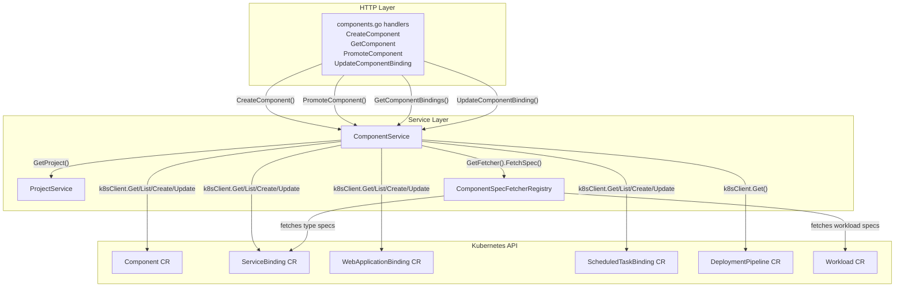
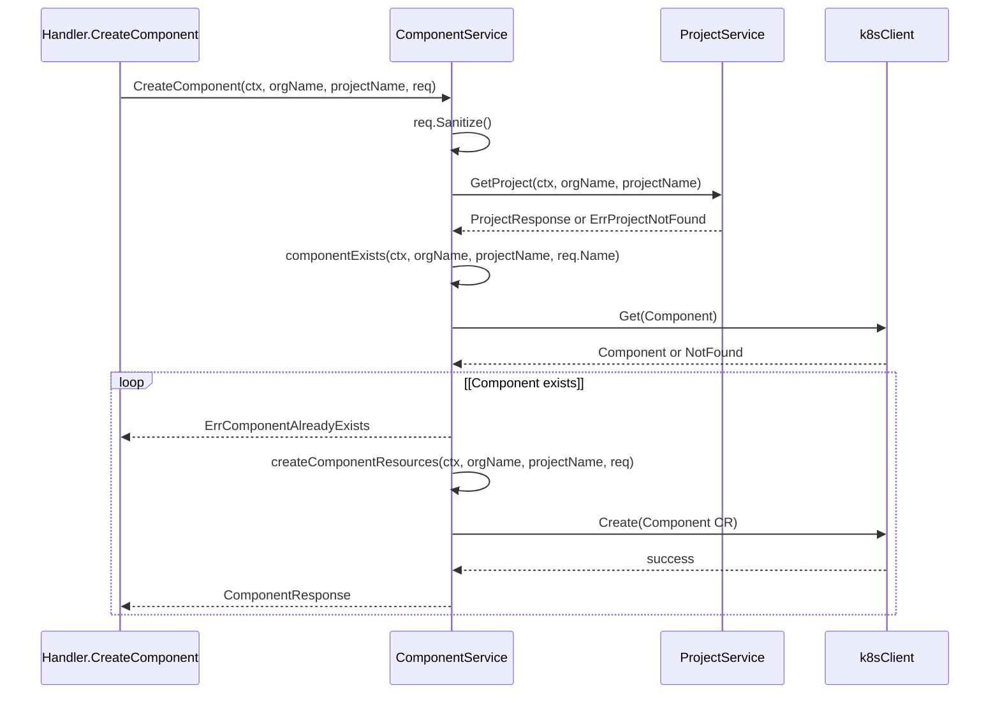
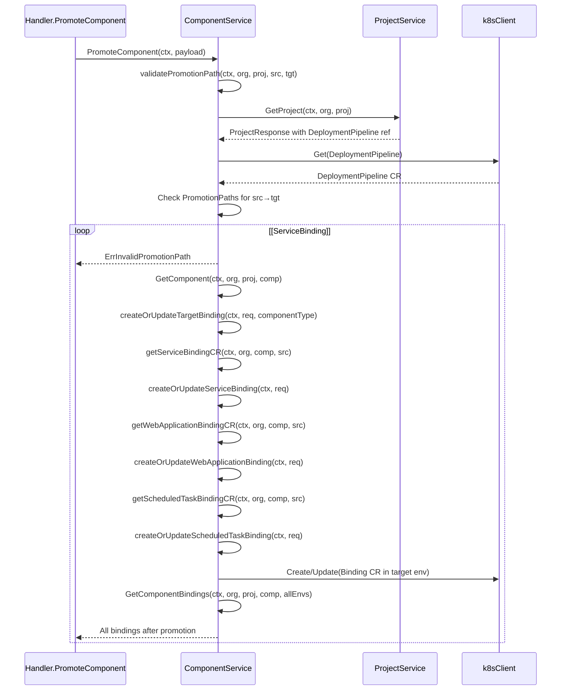
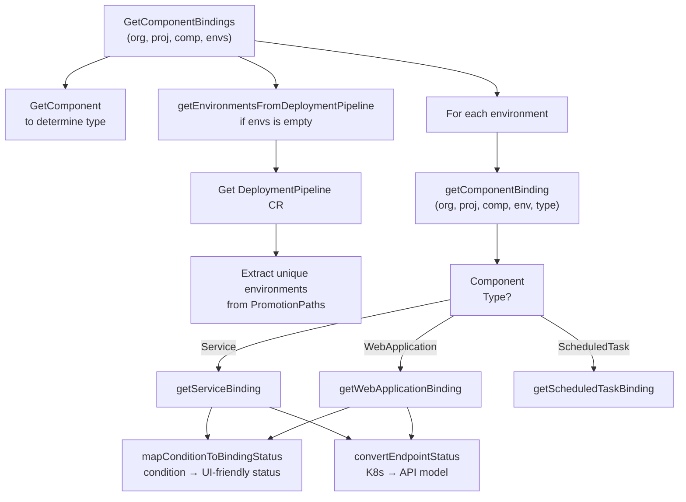
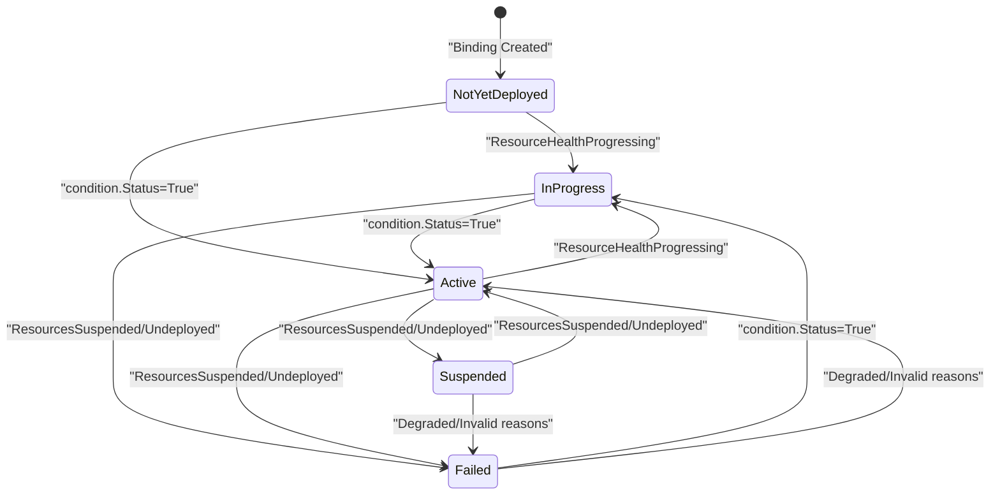
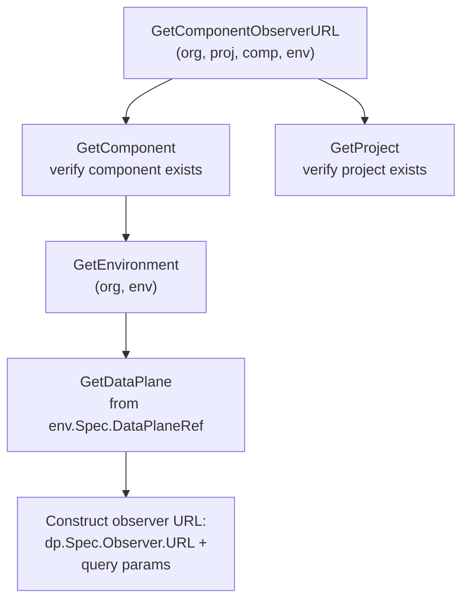

# Component Service

> **Relevant source files**
> * [cmd/openchoreo-api/main.go](https://github.com/openchoreo/openchoreo/blob/a577e969/cmd/openchoreo-api/main.go)
> * [internal/choreoctl/resources/kinds/dataplane.go](https://github.com/openchoreo/openchoreo/blob/a577e969/internal/choreoctl/resources/kinds/dataplane.go)
> * [internal/openchoreo-api/clients/k8s.go](https://github.com/openchoreo/openchoreo/blob/a577e969/internal/openchoreo-api/clients/k8s.go)
> * [internal/openchoreo-api/handlers/apply.go](https://github.com/openchoreo/openchoreo/blob/a577e969/internal/openchoreo-api/handlers/apply.go)
> * [internal/openchoreo-api/handlers/buildplanes.go](https://github.com/openchoreo/openchoreo/blob/a577e969/internal/openchoreo-api/handlers/buildplanes.go)
> * [internal/openchoreo-api/handlers/builds.go](https://github.com/openchoreo/openchoreo/blob/a577e969/internal/openchoreo-api/handlers/builds.go)
> * [internal/openchoreo-api/handlers/components.go](https://github.com/openchoreo/openchoreo/blob/a577e969/internal/openchoreo-api/handlers/components.go)
> * [internal/openchoreo-api/handlers/dataplanes.go](https://github.com/openchoreo/openchoreo/blob/a577e969/internal/openchoreo-api/handlers/dataplanes.go)
> * [internal/openchoreo-api/handlers/environments.go](https://github.com/openchoreo/openchoreo/blob/a577e969/internal/openchoreo-api/handlers/environments.go)
> * [internal/openchoreo-api/handlers/handlers.go](https://github.com/openchoreo/openchoreo/blob/a577e969/internal/openchoreo-api/handlers/handlers.go)
> * [internal/openchoreo-api/handlers/helpers.go](https://github.com/openchoreo/openchoreo/blob/a577e969/internal/openchoreo-api/handlers/helpers.go)
> * [internal/openchoreo-api/handlers/organizations.go](https://github.com/openchoreo/openchoreo/blob/a577e969/internal/openchoreo-api/handlers/organizations.go)
> * [internal/openchoreo-api/handlers/workloads.go](https://github.com/openchoreo/openchoreo/blob/a577e969/internal/openchoreo-api/handlers/workloads.go)
> * [internal/openchoreo-api/models/request.go](https://github.com/openchoreo/openchoreo/blob/a577e969/internal/openchoreo-api/models/request.go)
> * [internal/openchoreo-api/models/response.go](https://github.com/openchoreo/openchoreo/blob/a577e969/internal/openchoreo-api/models/response.go)
> * [internal/openchoreo-api/services/build_service.go](https://github.com/openchoreo/openchoreo/blob/a577e969/internal/openchoreo-api/services/build_service.go)
> * [internal/openchoreo-api/services/buildplane_service.go](https://github.com/openchoreo/openchoreo/blob/a577e969/internal/openchoreo-api/services/buildplane_service.go)
> * [internal/openchoreo-api/services/component_service.go](https://github.com/openchoreo/openchoreo/blob/a577e969/internal/openchoreo-api/services/component_service.go)
> * [internal/openchoreo-api/services/dataplane_service.go](https://github.com/openchoreo/openchoreo/blob/a577e969/internal/openchoreo-api/services/dataplane_service.go)
> * [internal/openchoreo-api/services/environment_service.go](https://github.com/openchoreo/openchoreo/blob/a577e969/internal/openchoreo-api/services/environment_service.go)
> * [internal/openchoreo-api/services/errors.go](https://github.com/openchoreo/openchoreo/blob/a577e969/internal/openchoreo-api/services/errors.go)
> * [internal/openchoreo-api/services/organization_service.go](https://github.com/openchoreo/openchoreo/blob/a577e969/internal/openchoreo-api/services/organization_service.go)
> * [internal/openchoreo-api/services/project_service.go](https://github.com/openchoreo/openchoreo/blob/a577e969/internal/openchoreo-api/services/project_service.go)
> * [internal/openchoreo-api/services/services.go](https://github.com/openchoreo/openchoreo/blob/a577e969/internal/openchoreo-api/services/services.go)

## Purpose and Scope

The Component Service (`ComponentService`) is a service layer class within the OpenChoreo API server that provides HTTP API abstractions for managing Components and their deployment Bindings across Environments. It handles component creation, promotion between environments with DeploymentPipeline validation, and binding lifecycle management (Active/Suspend/Undeploy states).

For information about the overall API server architecture and other services, see [API Server Architecture](/openchoreo/openchoreo/5.1-api-server-architecture). For details on build operations, see [Build and Infrastructure Services](/openchoreo/openchoreo/5.3-build-and-infrastructure-services).

**Sources:** [internal/openchoreo-api/services/component_service.go L27-L49](https://github.com/openchoreo/openchoreo/blob/a577e969/internal/openchoreo-api/services/component_service.go#L27-L49)

---

## Service Architecture

The `ComponentService` sits in the service layer between HTTP handlers and Kubernetes Custom Resources. It orchestrates component and binding operations while delegating to other services and the Kubernetes API client.

### ComponentService Context Diagram



**Sources:** [internal/openchoreo-api/services/component_service.go L27-L49](https://github.com/openchoreo/openchoreo/blob/a577e969/internal/openchoreo-api/services/component_service.go#L27-L49)

 [internal/openchoreo-api/handlers/components.go L1-L411](https://github.com/openchoreo/openchoreo/blob/a577e969/internal/openchoreo-api/handlers/components.go#L1-L411)

---

## Component Management

### Component Creation

The `CreateComponent` method creates a Component CR with optional build configuration. It validates that the parent Project exists and that the component name is unique within the project.

| Operation | Method | Key Validations |
| --- | --- | --- |
| Create | `CreateComponent()` | Project existence, component uniqueness |
| List | `ListComponents()` | Project existence, filter by project owner |
| Get | `GetComponent()` | Project existence, component existence, project ownership |

**Component Creation Flow:**



**Component CR Structure:**

The service constructs a Component CR with the following structure at [internal/openchoreo-api/services/component_service.go L261-L303](https://github.com/openchoreo/openchoreo/blob/a577e969/internal/openchoreo-api/services/component_service.go#L261-L303)

:

* **ObjectMeta**: Contains name, namespace (org), annotations (display name, description)
* **Spec.Owner**: References the parent project via `ProjectName`
* **Spec.Type**: Component type (Service, WebApplication, ScheduledTask, API)
* **Spec.Build**: Optional build configuration including repository URL, branch, component path, template reference, and parameters

**Sources:** [internal/openchoreo-api/services/component_service.go L52-L99](https://github.com/openchoreo/openchoreo/blob/a577e969/internal/openchoreo-api/services/component_service.go#L52-L99)

 [internal/openchoreo-api/services/component_service.go L249-L310](https://github.com/openchoreo/openchoreo/blob/a577e969/internal/openchoreo-api/services/component_service.go#L249-L310)

 [internal/openchoreo-api/handlers/components.go L17-L61](https://github.com/openchoreo/openchoreo/blob/a577e969/internal/openchoreo-api/handlers/components.go#L17-L61)

### Component Retrieval with Additional Resources

The `GetComponent` method supports optional resource inclusion via the `additionalResources` parameter. This uses the `ComponentSpecFetcherRegistry` pattern to fetch type-specific or workload specifications.

**Supported Additional Resources:**

| Resource Type | Fetcher Key | Fetches |
| --- | --- | --- |
| `type` | Component's Spec.Type value | Service/WebApplication/ScheduledTask spec from binding CRs |
| `workload` | `"Workload"` | WorkloadSpec from Workload CR |

The fetcher registry is populated at service construction and provides extensibility for adding new component types without modifying core service logic.

**Sources:** [internal/openchoreo-api/services/component_service.go L136-L223](https://github.com/openchoreo/openchoreo/blob/a577e969/internal/openchoreo-api/services/component_service.go#L136-L223)

 [internal/openchoreo-api/services/component_service.go L164-L214](https://github.com/openchoreo/openchoreo/blob/a577e969/internal/openchoreo-api/services/component_service.go#L164-L214)

---

## Component Promotion Workflow

Component promotion moves a component deployment from a source environment to a target environment. This operation validates the promotion path against the Project's DeploymentPipeline before creating or updating the target binding.

### Promotion Flow with DeploymentPipeline Validation



**DeploymentPipeline Validation Logic:**

The validation at [internal/openchoreo-api/services/component_service.go L739-L782](https://github.com/openchoreo/openchoreo/blob/a577e969/internal/openchoreo-api/services/component_service.go#L739-L782)

 checks:

1. Retrieves the Project's `DeploymentPipelineRef` (defaults to `"default-pipeline"` if not specified)
2. Gets the DeploymentPipeline CR from the organization namespace
3. Iterates through `pipeline.Spec.PromotionPaths` to find a path where: * `path.SourceEnvironmentRef == sourceEnv` * One of `path.TargetEnvironmentRefs[].Name == targetEnv`
4. Returns `ErrInvalidPromotionPath` if no matching path is found

**Sources:** [internal/openchoreo-api/services/component_service.go L659-L696](https://github.com/openchoreo/openchoreo/blob/a577e969/internal/openchoreo-api/services/component_service.go#L659-L696)

 [internal/openchoreo-api/services/component_service.go L739-L782](https://github.com/openchoreo/openchoreo/blob/a577e969/internal/openchoreo-api/services/component_service.go#L739-L782)

 [internal/openchoreo-api/handlers/components.go L190-L261](https://github.com/openchoreo/openchoreo/blob/a577e969/internal/openchoreo-api/handlers/components.go#L190-L261)

### Binding Creation/Update Logic

When creating or updating target bindings at [internal/openchoreo-api/services/component_service.go L817-L875](https://github.com/openchoreo/openchoreo/blob/a577e969/internal/openchoreo-api/services/component_service.go#L817-L875)

 (for ServiceBinding), the service:

1. Retrieves the source binding from the source environment
2. Checks if a binding already exists in the target environment for the same component
3. Generates a new name (`{componentName}-{environment}`) or reuses the existing binding name
4. Creates a new binding CR or updates the existing one with: * `Spec.Owner`: ProjectName and ComponentName * `Spec.Environment`: Target environment name * `Spec.ClassName`: Copied from source binding * `Spec.WorkloadSpec`: Copied from source binding (contains container images, etc.) * `Spec.APIs` (for ServiceBinding): Copied from source binding

Similar logic applies to WebApplicationBinding at [internal/openchoreo-api/services/component_service.go L897-L954](https://github.com/openchoreo/openchoreo/blob/a577e969/internal/openchoreo-api/services/component_service.go#L897-L954)

 and ScheduledTaskBinding at [internal/openchoreo-api/services/component_service.go L976-L1016](https://github.com/openchoreo/openchoreo/blob/a577e969/internal/openchoreo-api/services/component_service.go#L976-L1016)

**Sources:** [internal/openchoreo-api/services/component_service.go L784-L796](https://github.com/openchoreo/openchoreo/blob/a577e969/internal/openchoreo-api/services/component_service.go#L784-L796)

 [internal/openchoreo-api/services/component_service.go L817-L875](https://github.com/openchoreo/openchoreo/blob/a577e969/internal/openchoreo-api/services/component_service.go#L817-L875)

 [internal/openchoreo-api/services/component_service.go L897-L954](https://github.com/openchoreo/openchoreo/blob/a577e969/internal/openchoreo-api/services/component_service.go#L897-L954)

---

## Binding Management

Bindings link a Component to a specific Environment and manage the deployment lifecycle. Each component type has a corresponding binding CR type.

### Binding Type Mapping

| Component Type | Binding CR Type | API Fields |
| --- | --- | --- |
| `Service` | `ServiceBinding` | `.Spec.APIs`, `.Status.Endpoints` |
| `WebApplication` | `WebApplicationBinding` | `.Spec.Overrides`, `.Status.Endpoints` |
| `ScheduledTask` | `ScheduledTaskBinding` | (No endpoints) |

### Binding Retrieval Flow



**Environment Resolution:**

When no environments are specified, the service resolves them from the Project's DeploymentPipeline at [internal/openchoreo-api/services/component_service.go L607-L657](https://github.com/openchoreo/openchoreo/blob/a577e969/internal/openchoreo-api/services/component_service.go#L607-L657)

:

1. Gets the Project to determine the `DeploymentPipelineRef`
2. Retrieves the DeploymentPipeline CR
3. Iterates through all `PromotionPaths` and collects: * Each `path.SourceEnvironmentRef` * Each `path.TargetEnvironmentRefs[].Name`
4. Returns a deduplicated list of all environments

**Sources:** [internal/openchoreo-api/services/component_service.go L364-L400](https://github.com/openchoreo/openchoreo/blob/a577e969/internal/openchoreo-api/services/component_service.go#L364-L400)

 [internal/openchoreo-api/services/component_service.go L607-L657](https://github.com/openchoreo/openchoreo/blob/a577e969/internal/openchoreo-api/services/component_service.go#L607-L657)

 [internal/openchoreo-api/services/component_service.go L415-L442](https://github.com/openchoreo/openchoreo/blob/a577e969/internal/openchoreo-api/services/component_service.go#L415-L442)

---

## Binding State Machine

Bindings have a lifecycle managed through status conditions and release states. The service maps Kubernetes condition statuses to UI-friendly binding statuses.

### Binding Status Mapping



**Condition to Status Mapping Logic:**

The `mapConditionToBindingStatus` method at [internal/openchoreo-api/services/component_service.go L717-L737](https://github.com/openchoreo/openchoreo/blob/a577e969/internal/openchoreo-api/services/component_service.go#L717-L737)

 maps conditions:

| Condition Status | Condition Reason | Binding Status |
| --- | --- | --- |
| `True` | (any) | `Active` (Ready) |
| `False` | `ResourcesSuspended`, `ResourcesUndeployed` | `Suspended` |
| `False` | `ResourceHealthProgressing` | `InProgress` |
| `False` | `ResourceHealthDegraded`, `*ClassNotFound`, `InvalidConfiguration`, `Release*Failed` | `Failed` |
| `False` | (other/unknown) | `NotYetDeployed` (default) |

The method examines the `Ready` condition type from binding status at [internal/openchoreo-api/services/component_service.go L464-L474](https://github.com/openchoreo/openchoreo/blob/a577e969/internal/openchoreo-api/services/component_service.go#L464-L474)

 (for ServiceBinding):

```
for _, condition := range binding.Status.Conditions {
    if condition.Type == statusReady {
        response.BindingStatus.Reason = condition.Reason
        response.BindingStatus.Message = condition.Message
        response.BindingStatus.LastTransitioned = condition.LastTransitionTime.Time
        response.BindingStatus.Status = s.mapConditionToBindingStatus(condition)
        break
    }
}
```

**Sources:** [internal/openchoreo-api/services/component_service.go L717-L737](https://github.com/openchoreo/openchoreo/blob/a577e969/internal/openchoreo-api/services/component_service.go#L717-L737)

 [internal/openchoreo-api/services/component_service.go L444-L484](https://github.com/openchoreo/openchoreo/blob/a577e969/internal/openchoreo-api/services/component_service.go#L444-L484)

 [internal/openchoreo-api/services/component_service.go L486-L526](https://github.com/openchoreo/openchoreo/blob/a577e969/internal/openchoreo-api/services/component_service.go#L486-L526)

### Binding Update API

The `UpdateComponentBinding` method allows updating a binding's release state through the HTTP API at [internal/openchoreo-api/services/component_service.go L1018-L1119](https://github.com/openchoreo/openchoreo/blob/a577e969/internal/openchoreo-api/services/component_service.go#L1018-L1119)

**Supported Release States:**

* `Active`: Deploy/activate the release
* `Suspend`: Suspend the release (scale to zero, preserve configuration)
* `Undeploy`: Remove the release entirely

The update operation:

1. Validates the component exists and determines its type
2. Retrieves the appropriate binding CR by name
3. Updates the binding's `Spec.ReleaseState` field
4. Calls `k8sClient.Update()` to persist changes

The binding controllers will react to the `ReleaseState` change and update the underlying Release CR accordingly.

**Sources:** [internal/openchoreo-api/services/component_service.go L1018-L1119](https://github.com/openchoreo/openchoreo/blob/a577e969/internal/openchoreo-api/services/component_service.go#L1018-L1119)

 [internal/openchoreo-api/models/request.go L160-L189](https://github.com/openchoreo/openchoreo/blob/a577e969/internal/openchoreo-api/models/request.go#L160-L189)

 [internal/openchoreo-api/handlers/components.go L263-L321](https://github.com/openchoreo/openchoreo/blob/a577e969/internal/openchoreo-api/handlers/components.go#L263-L321)

---

## Endpoint Status Conversion

The service converts Kubernetes endpoint status to API response models for ServiceBinding and WebApplicationBinding (ScheduledTaskBinding has no endpoints).

**Endpoint Visibility Levels:**

Bindings can expose endpoints at three visibility levels, each with its own host, port, scheme, base path, and URI:

| Visibility Level | Field in EndpointStatus | Usage |
| --- | --- | --- |
| `Project` | `.Project` | Project-scoped internal access |
| `Organization` | `.Organization` | Organization-wide internal access |
| `Public` | `.Public` | Public internet access |

The conversion at [internal/openchoreo-api/services/component_service.go L560-L605](https://github.com/openchoreo/openchoreo/blob/a577e969/internal/openchoreo-api/services/component_service.go#L560-L605)

 transforms each level:

```yaml
if ep.Project != nil {
    endpointStatus.Project = &models.ExposedEndpoint{
        Host:     ep.Project.Host,
        Port:     int(ep.Project.Port),
        Scheme:   ep.Project.Scheme,
        BasePath: ep.Project.BasePath,
        URI:      ep.Project.URI,
    }
}
```

**Sources:** [internal/openchoreo-api/services/component_service.go L560-L605](https://github.com/openchoreo/openchoreo/blob/a577e969/internal/openchoreo-api/services/component_service.go#L560-L605)

 [internal/openchoreo-api/services/component_service.go L477-L481](https://github.com/openchoreo/openchoreo/blob/a577e969/internal/openchoreo-api/services/component_service.go#L477-L481)

 [internal/openchoreo-api/models/response.go L105-L119](https://github.com/openchoreo/openchoreo/blob/a577e969/internal/openchoreo-api/models/response.go#L105-L119)

---

## Observer URL Resolution

The ComponentService provides methods to retrieve observer (log/metrics) URLs for components in specific environments or for builds.

### Component Observer URL Retrieval

The `GetComponentObserverURL` method at [internal/openchoreo-api/services/component_service.go L1121-L1192](https://github.com/openchoreo/openchoreo/blob/a577e969/internal/openchoreo-api/services/component_service.go#L1121-L1192)

 retrieves the observer URL for a deployed component:



**Observer URL Construction:**

The URL is constructed at [internal/openchoreo-api/services/component_service.go L1167-L1190](https://github.com/openchoreo/openchoreo/blob/a577e969/internal/openchoreo-api/services/component_service.go#L1167-L1190)

 using:

* Base URL: `dataPlane.Spec.Observer.URL`
* Query parameters: * `org`: Organization name * `project`: Project name * `component`: Component name * `environment`: Environment name * `username`: `dataPlane.Spec.Observer.Authentication.BasicAuth.Username` * `password`: `dataPlane.Spec.Observer.Authentication.BasicAuth.Password`

### Build Observer URL Retrieval

The `GetBuildObserverURL` method at [internal/openchoreo-api/services/component_service.go L1194-L1243](https://github.com/openchoreo/openchoreo/blob/a577e969/internal/openchoreo-api/services/component_service.go#L1194-L1243)

 retrieves the observer URL for build logs:

1. Verifies component and project existence
2. Gets the first BuildPlane from the organization namespace
3. Constructs URL using `buildPlane.Spec.Observer.URL` with query parameters: org, project, component, username, password

**Sources:** [internal/openchoreo-api/services/component_service.go L1121-L1192](https://github.com/openchoreo/openchoreo/blob/a577e969/internal/openchoreo-api/services/component_service.go#L1121-L1192)

 [internal/openchoreo-api/services/component_service.go L1194-L1243](https://github.com/openchoreo/openchoreo/blob/a577e969/internal/openchoreo-api/services/component_service.go#L1194-L1243)

 [internal/openchoreo-api/handlers/components.go L323-L410](https://github.com/openchoreo/openchoreo/blob/a577e969/internal/openchoreo-api/handlers/components.go#L323-L410)

---

## Component Spec Fetcher Registry

The `ComponentSpecFetcherRegistry` provides an extensible pattern for fetching type-specific or auxiliary resources associated with a component. This is used by `GetComponent` to optionally include additional resource specs in the response.

**Registry Structure:**

At [internal/openchoreo-api/services/component_service.go L1245-L1399](https://github.com/openchoreo/openchoreo/blob/a577e969/internal/openchoreo-api/services/component_service.go#L1245-L1399)

 the registry maintains a map of fetcher keys to `ComponentSpecFetcher` implementations:

```
type ComponentSpecFetcher interface {
    FetchSpec(ctx context.Context, k8sClient client.Client, namespace, componentName string) (interface{}, error)
}

type ComponentSpecFetcherRegistry struct {
    fetchers map[string]ComponentSpecFetcher
}
```

**Built-in Fetchers:**

| Fetcher Key | Implementation | Fetches From |
| --- | --- | --- |
| `"Service"` | `ServiceSpecFetcher` | ServiceBinding CR |
| `"WebApplication"` | `WebApplicationSpecFetcher` | WebApplicationBinding CR |
| `"Workload"` | `WorkloadSpecFetcher` | Workload CR |

Each fetcher lists all CRs of its type in the namespace, finds the one matching the component name via `Spec.Owner.ComponentName`, and returns the relevant spec field.

**Example - ServiceSpecFetcher:**

At [internal/openchoreo-api/services/component_service.go L1285-L1312](https://github.com/openchoreo/openchoreo/blob/a577e969/internal/openchoreo-api/services/component_service.go#L1285-L1312)

:

```javascript
func (f *ServiceSpecFetcher) FetchSpec(ctx context.Context, k8sClient client.Client, namespace, componentName string) (interface{}, error) {
    var serviceList openchoreov1alpha1.ServiceList
    if err := k8sClient.List(ctx, &serviceList, client.InNamespace(namespace)); err != nil {
        return nil, err
    }
    
    for _, service := range serviceList.Items {
        if service.Spec.Owner.ComponentName == componentName {
            return &service.Spec, nil
        }
    }
    
    return nil, ErrServiceNotFound
}
```

**Sources:** [internal/openchoreo-api/services/component_service.go L1245-L1399](https://github.com/openchoreo/openchoreo/blob/a577e969/internal/openchoreo-api/services/component_service.go#L1245-L1399)

 [internal/openchoreo-api/services/component_service.go L174-L214](https://github.com/openchoreo/openchoreo/blob/a577e969/internal/openchoreo-api/services/component_service.go#L174-L214)

---

## Key Data Structures

### PromoteComponentPayload

```
type PromoteComponentPayload struct {
    models.PromoteComponentRequest
    ComponentName string `json:"componentName"`
    ProjectName   string `json:"projectName"`
    OrgName       string `json:"orgName"`
}
```

Combines the HTTP request model with extracted path parameters for internal service operations.

**Sources:** [internal/openchoreo-api/services/component_service.go L35-L40](https://github.com/openchoreo/openchoreo/blob/a577e969/internal/openchoreo-api/services/component_service.go#L35-L40)

### ComponentResponse

Defined at [internal/openchoreo-api/models/response.go L39-L55](https://github.com/openchoreo/openchoreo/blob/a577e969/internal/openchoreo-api/models/response.go#L39-L55)

 includes:

* Basic metadata: name, display name, description, type, org, project, creation time, status
* Optional type-specific specs: `Service`, `WebApplication`, `ScheduledTask`, `API`
* Optional `Workload` spec
* Optional `BuildConfig` with repository and template information

### BindingResponse

Defined at [internal/openchoreo-api/models/response.go L57-L69](https://github.com/openchoreo/openchoreo/blob/a577e969/internal/openchoreo-api/models/response.go#L57-L69)

 includes:

* Metadata: name, type, component name, project name, org name, environment
* `BindingStatus`: status (Active/InProgress/Failed/Suspended/NotYetDeployed), reason, message, last transition time
* Type-specific binding data: `ServiceBinding`, `WebApplicationBinding`, or `ScheduledTaskBinding`

Each binding type contains:

* `Endpoints`: Array of endpoint status (for Service and WebApplication)
* `Image`: Container image reference extracted from WorkloadSpec
* `ReleaseState`: Current release state (optional)

**Sources:** [internal/openchoreo-api/models/response.go L39-L119](https://github.com/openchoreo/openchoreo/blob/a577e969/internal/openchoreo-api/models/response.go#L39-L119)

 [internal/openchoreo-api/services/component_service.go L312-L362](https://github.com/openchoreo/openchoreo/blob/a577e969/internal/openchoreo-api/services/component_service.go#L312-L362)

---

## Error Handling

The ComponentService uses sentinel errors for common failure cases:

| Error | Code | HTTP Status | Returned When |
| --- | --- | --- | --- |
| `ErrProjectNotFound` | `PROJECT_NOT_FOUND` | 404 | Referenced project doesn't exist |
| `ErrComponentAlreadyExists` | `COMPONENT_EXISTS` | 409 | Component name already used in project |
| `ErrComponentNotFound` | `COMPONENT_NOT_FOUND` | 404 | Component doesn't exist |
| `ErrBindingNotFound` | `BINDING_NOT_FOUND` | 404 | Binding doesn't exist for component/environment |
| `ErrDeploymentPipelineNotFound` | `DEPLOYMENT_PIPELINE_NOT_FOUND` | 404 | Referenced pipeline doesn't exist |
| `ErrInvalidPromotionPath` | `INVALID_PROMOTION_PATH` | 400 | Promotion path not allowed by pipeline |
| `ErrEnvironmentNotFound` | `ENVIRONMENT_NOT_FOUND` | 404 | Referenced environment doesn't exist |
| `ErrDataPlaneNotFound` | `DATAPLANE_NOT_FOUND` | 404 | Referenced data plane doesn't exist |

These errors are defined at [internal/openchoreo-api/services/errors.go L9-L22](https://github.com/openchoreo/openchoreo/blob/a577e969/internal/openchoreo-api/services/errors.go#L9-L22)

 and mapped to HTTP responses in handlers at [internal/openchoreo-api/handlers/components.go L42-L56](https://github.com/openchoreo/openchoreo/blob/a577e969/internal/openchoreo-api/handlers/components.go#L42-L56)

**Sources:** [internal/openchoreo-api/services/errors.go L9-L41](https://github.com/openchoreo/openchoreo/blob/a577e969/internal/openchoreo-api/services/errors.go#L9-L41)

 [internal/openchoreo-api/handlers/components.go L17-L261](https://github.com/openchoreo/openchoreo/blob/a577e969/internal/openchoreo-api/handlers/components.go#L17-L261)