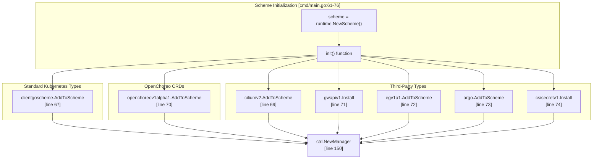
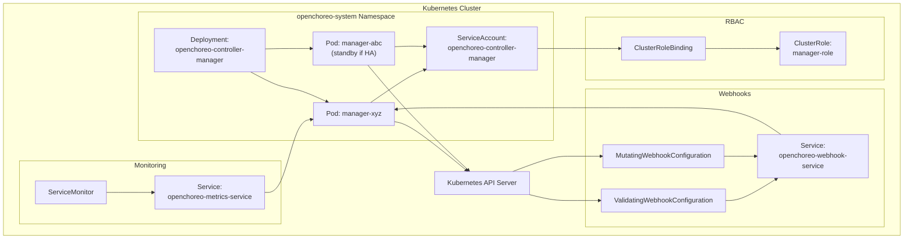

# Controller Manager

> **Relevant source files**
> * [PROJECT](https://github.com/openchoreo/openchoreo/blob/a577e969/PROJECT)
> * [cmd/main.go](https://github.com/openchoreo/openchoreo/blob/a577e969/cmd/main.go)
> * [config/crd/kustomization.yaml](https://github.com/openchoreo/openchoreo/blob/a577e969/config/crd/kustomization.yaml)
> * [config/rbac/kustomization.yaml](https://github.com/openchoreo/openchoreo/blob/a577e969/config/rbac/kustomization.yaml)
> * [config/rbac/role.yaml](https://github.com/openchoreo/openchoreo/blob/a577e969/config/rbac/role.yaml)
> * [config/samples/kustomization.yaml](https://github.com/openchoreo/openchoreo/blob/a577e969/config/samples/kustomization.yaml)

## Purpose and Scope

The Controller Manager is the main binary that orchestrates all Kubernetes controllers in OpenChoreo. It is responsible for initializing the controller-runtime manager, registering the runtime scheme with all Custom Resource Definitions, instantiating and registering all reconciler implementations, configuring webhooks, and managing the overall lifecycle of the control plane.

This document covers the manager initialization, scheme setup, controller registration patterns, and runtime configuration. For details on individual controller reconciliation logic, see the Build System (#3), Deployment System (#4), and Custom Resources (#6) sections. For multi-cluster client management used by controllers, see Multi-Cluster Architecture (#2.3).

## Manager Binary Entrypoint

The controller manager is implemented as a single Go binary defined in [cmd/main.go L1-L409](https://github.com/openchoreo/openchoreo/blob/a577e969/cmd/main.go#L1-L409)

 This file serves as the entrypoint for all control plane operations and follows the standard controller-runtime patterns established by Kubebuilder.

The main function performs the following sequence of operations:

1. Parse command-line flags for metrics, health probes, leader election, and HTTP/2 configuration
2. Initialize the controller-runtime manager with the appropriate options
3. Register all reconcilers with the manager
4. Setup webhooks if enabled
5. Add health and readiness checks
6. Start the manager with signal handling for graceful shutdown

**Sources:** [cmd/main.go L78-L409](https://github.com/openchoreo/openchoreo/blob/a577e969/cmd/main.go#L78-L409)

## Runtime Scheme Registration

The controller manager maintains a global runtime scheme that defines all Kubernetes API types the system can interact with. The scheme is initialized at package level and populated during the `init()` function.



### Registered Type Categories

The scheme includes the following categories of types:

| Category | Package | Purpose | Line Reference |
| --- | --- | --- | --- |
| **Core Kubernetes** | `clientgoscheme` | Standard resources (Namespace, Service, Deployment, ConfigMap, etc.) | [cmd/main.go L67](https://github.com/openchoreo/openchoreo/blob/a577e969/cmd/main.go#L67-L67) |
| **OpenChoreo CRDs** | `openchoreov1alpha1` | All custom resources (Organization, Project, Component, Build, etc.) | [cmd/main.go L70](https://github.com/openchoreo/openchoreo/blob/a577e969/cmd/main.go#L70-L70) |
| **Cilium** | `ciliumv2` | CiliumNetworkPolicy for network security | [cmd/main.go L69](https://github.com/openchoreo/openchoreo/blob/a577e969/cmd/main.go#L69-L69) |
| **Gateway API** | `gwapiv1` | HTTPRoute and other Gateway API resources | [cmd/main.go L71](https://github.com/openchoreo/openchoreo/blob/a577e969/cmd/main.go#L71-L71) |
| **Envoy Gateway** | `egv1a1` | SecurityPolicy, HTTPRouteFilter extensions | [cmd/main.go L72](https://github.com/openchoreo/openchoreo/blob/a577e969/cmd/main.go#L72-L72) |
| **Argo Workflows** | `argo` | Workflow resources for build plane operations | [cmd/main.go L73](https://github.com/openchoreo/openchoreo/blob/a577e969/cmd/main.go#L73-L73) |
| **CSI Secrets** | `csisecretv1` | SecretProviderClass for secrets management | [cmd/main.go L74](https://github.com/openchoreo/openchoreo/blob/a577e969/cmd/main.go#L74-L74) |

The scheme must include all types that controllers will create, update, delete, or watch. The `utilruntime.Must()` wrapper ensures that any registration failure causes immediate program termination, preventing the manager from starting with an incomplete type system.

**Sources:** [cmd/main.go L61-L76](https://github.com/openchoreo/openchoreo/blob/a577e969/cmd/main.go#L61-L76)

## Manager Configuration

The controller manager is created using `ctrl.NewManager()` with various configuration options:

```yaml
mgr, err := ctrl.NewManager(ctrl.GetConfigOrDie(), ctrl.Options{
    Scheme:                 scheme,
    Metrics:                metricsServerOptions,
    WebhookServer:          webhookServer,
    HealthProbeBindAddress: probeAddr,
    LeaderElection:         enableLeaderElection,
    LeaderElectionID:       "43500532.openchoreo.dev",
})
```

### Configuration Options

| Option | Default/Value | Purpose |
| --- | --- | --- |
| `Scheme` | Initialized scheme | Type registry for all API objects |
| `Metrics.BindAddress` | `"0"` (disabled) | Metrics endpoint address; `:8443` for HTTPS, `:8080` for HTTP |
| `Metrics.SecureServing` | `true` | Enable HTTPS for metrics with authn/authz |
| `HealthProbeBindAddress` | `:8081` | Health and readiness probe endpoint |
| `LeaderElection` | `false` | Enable leader election for HA deployments |
| `LeaderElectionID` | `"43500532.openchoreo.dev"` | Unique identifier for leader election |
| `WebhookServer` | Configured with TLS options | Admission webhook server |

### Security Considerations

The metrics endpoint is configured with authentication and authorization when `secureMetrics` is enabled. The `FilterProvider` uses controller-runtime's built-in RBAC checks to ensure only authorized users and service accounts can access metrics:

```
if secureMetrics {
    metricsServerOptions.FilterProvider = filters.WithAuthenticationAndAuthorization
}
```

HTTP/2 is disabled by default to prevent CVE vulnerabilities (GHSA-qppj-fm5r-hxr3, GHSA-4374-p667-p6c8). This can be overridden with the `--enable-http2` flag.

**Sources:** [cmd/main.go L79-L172](https://github.com/openchoreo/openchoreo/blob/a577e969/cmd/main.go#L79-L172)

## Controller Registration

The manager registers multiple reconcilers, each responsible for managing a specific Custom Resource type. Controllers are registered in a specific order, with organizational hierarchy controllers first, followed by application model controllers, and finally build/deployment controllers.

```mermaid
flowchart TD

Mgr["ctrl.Manager"]
OrgRecon["organization.Reconciler"]
ProjRecon["project.Reconciler"]
EnvRecon["environment.Reconciler"]
DPRecon["dataplane.Reconciler"]
DPipeRecon["deploymentpipeline.Reconciler"]
DTrackRecon["deploymenttrack.Reconciler"]
DARecon["deployableartifact.Reconciler"]
DeployRecon["deployment.Reconciler"]
EPRecon["endpoint.Reconciler"]
WLRecon["workload.Reconciler"]
CompRecon["component.Reconciler"]
GitRecon["gitcommitrequest.Reconciler"]
APIRecon["api.Reconciler"]
APIClassRecon["apiclass.Reconciler"]
APIBindRecon["apibinding.Reconciler"]
SvcRecon["service.Reconciler"]
SvcClassRecon["serviceclass.Reconciler"]
SvcBindRecon["servicebinding.Reconciler"]
WebRecon["webapplication.Reconciler"]
WebClassRecon["webapplicationclass.Reconciler"]
WebBindRecon["webapplicationbinding.Reconciler"]
SchedRecon["scheduledtask.Reconciler"]
SchedClassRecon["scheduledtaskclass.Reconciler"]
SchedBindRecon["scheduledtaskbinding.Reconciler"]
ReleaseRecon["release.Reconciler"]
BuildRecon["build.Reconciler"]
BPRecon["buildplane.BuildPlaneReconciler"]

Mgr --> OrgRecon
Mgr --> ProjRecon
Mgr --> EnvRecon
Mgr --> DPRecon
Mgr --> DPipeRecon
Mgr --> DTrackRecon
Mgr --> DARecon
Mgr --> DeployRecon
Mgr --> EPRecon
Mgr --> WLRecon
Mgr --> CompRecon
Mgr --> GitRecon
Mgr --> APIRecon
Mgr --> APIClassRecon
Mgr --> APIBindRecon
Mgr --> SvcRecon
Mgr --> SvcClassRecon
Mgr --> SvcBindRecon
Mgr --> WebRecon
Mgr --> WebClassRecon
Mgr --> WebBindRecon
Mgr --> SchedRecon
Mgr --> SchedClassRecon
Mgr --> SchedBindRecon
Mgr --> ReleaseRecon
Mgr --> BuildRecon
Mgr --> BPRecon

subgraph subGraph7 ["Build/Release Controllers [lines 359-380]"]
    ReleaseRecon
    BuildRecon
    BPRecon
end

subgraph subGraph6 ["ScheduledTask Controllers [lines 337-357]"]
    SchedRecon
    SchedClassRecon
    SchedBindRecon
end

subgraph subGraph5 ["WebApp Controllers [lines 314-334]"]
    WebRecon
    WebClassRecon
    WebBindRecon
end

subgraph subGraph4 ["Service Controllers [lines 291-311]"]
    SvcRecon
    SvcClassRecon
    SvcBindRecon
end

subgraph subGraph3 ["API Controllers [lines 268-288]"]
    APIRecon
    APIClassRecon
    APIBindRecon
end

subgraph subGraph2 ["Core Controllers [lines 251-265]"]
    CompRecon
    GitRecon
end

subgraph subGraph1 ["Legacy CRDs [lines 178-249]"]
    OrgRecon
    ProjRecon
    EnvRecon
    DPRecon
    DPipeRecon
    DTrackRecon
    DARecon
    DeployRecon
    EPRecon
    WLRecon
end

subgraph subGraph0 ["Manager [cmd/main.go:150]"]
    Mgr
end
```



### Controller Registration Pattern

All controllers follow the same registration pattern:

```sql
if err = (&controller.Reconciler{
    Client: mgr.GetClient(),
    Scheme: mgr.GetScheme(),
}).SetupWithManager(mgr); err != nil {
    setupLog.Error(err, "unable to create controller", "controller", "ControllerName")
    os.Exit(1)
}
```

This pattern:

1. Instantiates a new reconciler with the manager's client and scheme
2. Calls `SetupWithManager()` to register watches and configure the controller
3. Terminates the program if registration fails

**Sources:** [cmd/main.go L174-L381](https://github.com/openchoreo/openchoreo/blob/a577e969/cmd/main.go#L174-L381)

### Complete Controller Registry

The following table lists all registered controllers in the order they are initialized:

| Controller | Package | Watched Resource | Legacy Flag Required | Line Reference |
| --- | --- | --- | --- | --- |
| **Organization** | `organization` | `Organization` | Yes | [cmd/main.go L179-L185](https://github.com/openchoreo/openchoreo/blob/a577e969/cmd/main.go#L179-L185) |
| **Project** | `project` | `Project` | Yes | [cmd/main.go L186-L192](https://github.com/openchoreo/openchoreo/blob/a577e969/cmd/main.go#L186-L192) |
| **Environment** | `environment` | `Environment` | Yes | [cmd/main.go L193-L199](https://github.com/openchoreo/openchoreo/blob/a577e969/cmd/main.go#L193-L199) |
| **DataPlane** | `dataplane` | `DataPlane` | Yes | [cmd/main.go L200-L206](https://github.com/openchoreo/openchoreo/blob/a577e969/cmd/main.go#L200-L206) |
| **DeploymentPipeline** | `deploymentpipeline` | `DeploymentPipeline` | Yes | [cmd/main.go L207-L213](https://github.com/openchoreo/openchoreo/blob/a577e969/cmd/main.go#L207-L213) |
| **DeploymentTrack** | `deploymenttrack` | `DeploymentTrack` | Yes | [cmd/main.go L214-L220](https://github.com/openchoreo/openchoreo/blob/a577e969/cmd/main.go#L214-L220) |
| **DeployableArtifact** | `deployableartifact` | `DeployableArtifact` | Yes | [cmd/main.go L221-L227](https://github.com/openchoreo/openchoreo/blob/a577e969/cmd/main.go#L221-L227) |
| **Deployment** | `deployment` | `Deployment` | Yes | [cmd/main.go L228-L234](https://github.com/openchoreo/openchoreo/blob/a577e969/cmd/main.go#L228-L234) |
| **Endpoint** | `endpoint` | `Endpoint` | Yes | [cmd/main.go L235-L241](https://github.com/openchoreo/openchoreo/blob/a577e969/cmd/main.go#L235-L241) |
| **Workload** | `workload` | `Workload` | Yes | [cmd/main.go L242-L248](https://github.com/openchoreo/openchoreo/blob/a577e969/cmd/main.go#L242-L248) |
| **Component** | `component` | `Component` | No | [cmd/main.go L251-L257](https://github.com/openchoreo/openchoreo/blob/a577e969/cmd/main.go#L251-L257) |
| **GitCommitRequest** | `gitcommitrequest` | `GitCommitRequest` | No | [cmd/main.go L259-L265](https://github.com/openchoreo/openchoreo/blob/a577e969/cmd/main.go#L259-L265) |
| **API** | `api` | `API` | No | [cmd/main.go L268-L274](https://github.com/openchoreo/openchoreo/blob/a577e969/cmd/main.go#L268-L274) |
| **APIClass** | `apiclass` | `APIClass` | No | [cmd/main.go L275-L281](https://github.com/openchoreo/openchoreo/blob/a577e969/cmd/main.go#L275-L281) |
| **APIBinding** | `apibinding` | `APIBinding` | No | [cmd/main.go L282-L288](https://github.com/openchoreo/openchoreo/blob/a577e969/cmd/main.go#L282-L288) |
| **Service** | `service` | `Service` | No | [cmd/main.go L291-L297](https://github.com/openchoreo/openchoreo/blob/a577e969/cmd/main.go#L291-L297) |
| **ServiceClass** | `serviceclass` | `ServiceClass` | No | [cmd/main.go L298-L304](https://github.com/openchoreo/openchoreo/blob/a577e969/cmd/main.go#L298-L304) |
| **ServiceBinding** | `servicebinding` | `ServiceBinding` | No | [cmd/main.go L305-L311](https://github.com/openchoreo/openchoreo/blob/a577e969/cmd/main.go#L305-L311) |
| **WebApplication** | `webapplication` | `WebApplication` | No | [cmd/main.go L314-L320](https://github.com/openchoreo/openchoreo/blob/a577e969/cmd/main.go#L314-L320) |
| **WebApplicationClass** | `webapplicationclass` | `WebApplicationClass` | No | [cmd/main.go L321-L327](https://github.com/openchoreo/openchoreo/blob/a577e969/cmd/main.go#L321-L327) |
| **WebApplicationBinding** | `webapplicationbinding` | `WebApplicationBinding` | No | [cmd/main.go L328-L334](https://github.com/openchoreo/openchoreo/blob/a577e969/cmd/main.go#L328-L334) |
| **ScheduledTask** | `scheduledtask` | `ScheduledTask` | No | [cmd/main.go L337-L343](https://github.com/openchoreo/openchoreo/blob/a577e969/cmd/main.go#L337-L343) |
| **ScheduledTaskClass** | `scheduledtaskclass` | `ScheduledTaskClass` | No | [cmd/main.go L344-L350](https://github.com/openchoreo/openchoreo/blob/a577e969/cmd/main.go#L344-L350) |
| **ScheduledTaskBinding** | `scheduledtaskbinding` | `ScheduledTaskBinding` | No | [cmd/main.go L351-L357](https://github.com/openchoreo/openchoreo/blob/a577e969/cmd/main.go#L351-L357) |
| **Release** | `release` | `Release` | No | [cmd/main.go L359-L365](https://github.com/openchoreo/openchoreo/blob/a577e969/cmd/main.go#L359-L365) |
| **Build** | `build` | `Build` | No | [cmd/main.go L367-L373](https://github.com/openchoreo/openchoreo/blob/a577e969/cmd/main.go#L367-L373) |
| **BuildPlane** | `buildplane` | `BuildPlane` | No | [cmd/main.go L374-L380](https://github.com/openchoreo/openchoreo/blob/a577e969/cmd/main.go#L374-L380) |

### Legacy CRD Flag

The `--enable-legacy-crds` flag controls whether organizational hierarchy and deployment pipeline controllers are registered. This flag is intended for backward compatibility during migration and will be removed in future versions:

```
if enableLegacyCRDs {
    // Register Organization, Project, Environment, DataPlane, DeploymentPipeline,
    // DeploymentTrack, DeployableArtifact, Deployment, Endpoint, Workload controllers
}
```

When the flag is disabled, only the newer component-based controllers and the Class-Instance-Binding pattern controllers are active.

**Sources:** [cmd/main.go L85-L86](https://github.com/openchoreo/openchoreo/blob/a577e969/cmd/main.go#L85-L86)

 [cmd/main.go L97-L98](https://github.com/openchoreo/openchoreo/blob/a577e969/cmd/main.go#L97-L98)

 [cmd/main.go L178-L249](https://github.com/openchoreo/openchoreo/blob/a577e969/cmd/main.go#L178-L249)

## Controller Reconciler Interface

Each registered controller implements the `Reconciler` interface from controller-runtime. The interface contract requires:

1. A `Reconcile(ctx context.Context, req ctrl.Request) (ctrl.Result, error)` method
2. A `SetupWithManager(mgr ctrl.Manager) error` method that configures watches

The `SetupWithManager()` method typically:

* Registers the primary watch on the controller's owned resource type
* Configures secondary watches on dependent resources
* Sets up predicates to filter events
* Configures concurrency and rate limiting options

Example structure from a typical reconciler:

```go
type Reconciler struct {
    Client client.Client
    Scheme *runtime.Scheme
}

func (r *Reconciler) SetupWithManager(mgr ctrl.Manager) error {
    return ctrl.NewControllerManagedBy(mgr).
        For(&openchoreov1alpha1.ResourceType{}).
        Owns(&corev1.Service{}).
        Complete(r)
}
```

**Sources:** [cmd/main.go L179-L380](https://github.com/openchoreo/openchoreo/blob/a577e969/cmd/main.go#L179-L380)

 [config/rbac/role.yaml L1-L227](https://github.com/openchoreo/openchoreo/blob/a577e969/config/rbac/role.yaml#L1-L227)

## Webhook Configuration

The controller manager can optionally register admission webhooks when the `ENABLE_WEBHOOKS` environment variable is not set to `"false"`. Currently, only the Project webhook is configured:

```sql
if os.Getenv("ENABLE_WEBHOOKS") != "false" {
    if err = webhookcorev1.SetupProjectWebhookWithManager(mgr); err != nil {
        setupLog.Error(err, "unable to create webhook", "webhook", "Project")
        os.Exit(1)
    }
}
```

The webhook server is initialized with TLS options and registered with the manager during initialization. Webhooks provide validation and mutation capabilities for Custom Resources before they are persisted to etcd.

**Sources:** [cmd/main.go L124-L126](https://github.com/openchoreo/openchoreo/blob/a577e969/cmd/main.go#L124-L126)

 [cmd/main.go L388-L393](https://github.com/openchoreo/openchoreo/blob/a577e969/cmd/main.go#L388-L393)

## Health and Readiness Checks

The controller manager exposes health and readiness endpoints for Kubernetes probes. Both endpoints use a simple ping check:

```
if err := mgr.AddHealthzCheck("healthz", healthz.Ping); err != nil {
    setupLog.Error(err, "unable to set up health check")
    os.Exit(1)
}
if err := mgr.AddReadyzCheck("readyz", healthz.Ping); err != nil {
    setupLog.Error(err, "unable to set up ready check")
    os.Exit(1)
}
```

These endpoints are served on the health probe bind address (default `:8081`) and allow Kubernetes to:

* **Liveness (`/healthz`)**: Determine if the manager process is alive and should be restarted if failing
* **Readiness (`/readyz`)**: Determine if the manager is ready to accept traffic and process reconciliation requests

**Sources:** [cmd/main.go L89](https://github.com/openchoreo/openchoreo/blob/a577e969/cmd/main.go#L89-L89)

 [cmd/main.go L395-L402](https://github.com/openchoreo/openchoreo/blob/a577e969/cmd/main.go#L395-L402)

## Manager Lifecycle and Signal Handling

The manager starts its control loops and blocks until a termination signal is received:

```
setupLog.Info("starting manager")
if err := mgr.Start(ctrl.SetupSignalHandler()); err != nil {
    setupLog.Error(err, "problem running manager")
    os.Exit(1)
}
```

The `ctrl.SetupSignalHandler()` creates a context that is cancelled when the process receives `SIGTERM` or `SIGINT` (Ctrl+C). When the signal is received:

1. The manager initiates a graceful shutdown
2. All running reconciliation loops are cancelled via context propagation
3. In-flight reconciliations are allowed to complete or time out
4. The manager closes connections to the Kubernetes API server
5. The process exits

This ensures that the controller can be safely stopped without leaving resources in inconsistent states.

**Sources:** [cmd/main.go L404-L408](https://github.com/openchoreo/openchoreo/blob/a577e969/cmd/main.go#L404-L408)

## RBAC Configuration

The controller manager requires extensive RBAC permissions to manage resources across the control plane. The permissions are defined in [config/rbac/role.yaml L1-L227](https://github.com/openchoreo/openchoreo/blob/a577e969/config/rbac/role.yaml#L1-L227)

 and include:

### Resource Categories

| Resource Group | Resources | Verbs | Purpose |
| --- | --- | --- | --- |
| **Core** | `configmaps`, `namespaces`, `services` | Full CRUD | Manage core Kubernetes resources |
| **Core Events** | `events` | `create`, `patch` | Record events for debugging and auditing |
| **Apps** | `deployments` | Full CRUD | Manage application deployments in data plane |
| **Batch** | `cronjobs` | Full CRUD | Manage scheduled tasks |
| **Cilium** | `ciliumnetworkpolicies` | Full CRUD | Enforce network segmentation |
| **Gateway API** | `httproutes` | Full CRUD | Configure ingress routing |
| **Envoy Gateway** | `securitypolicies`, `httproutefilters`, `backendtrafficpolicies` | Full CRUD | Configure OAuth2, CORS, rate limiting |
| **OpenChoreo** | All CRDs | Full CRUD + status + finalizers | Manage OpenChoreo resources |
| **Secrets Store CSI** | `secretproviderclasses` | Full CRUD | Integrate with external secret managers |

### OpenChoreo CRD Permissions

The manager requires permissions on all OpenChoreo Custom Resources:

* `organizations`, `projects`, `environments`, `dataplanes`, `buildplanes`
* `deploymentpipelines`, `deploymenttracks`
* `components`, `apis`, `apiclasses`, `apibindings`
* `services`, `serviceclasses`, `servicebindings`
* `webapplications`, `webapplicationclasses`, `webapplicationbindings`
* `scheduledtasks`, `scheduledtaskclasses`, `scheduledtaskbindings`
* `builds`, `deployableartifacts`, `workloads`
* `deployments`, `endpoints`, `releases`
* `gitcommitrequests`, `configurationgroups`

For each resource, the manager needs:

* Full CRUD operations (`create`, `delete`, `get`, `list`, `patch`, `update`, `watch`)
* Status subresource access (`get`, `patch`, `update`)
* Finalizer management (`update` on finalizers subresource)

**Sources:** [config/rbac/role.yaml L1-L227](https://github.com/openchoreo/openchoreo/blob/a577e969/config/rbac/role.yaml#L1-L227)

## Manager Deployment Architecture



The controller manager is deployed as a Kubernetes Deployment in the `openchoreo-system` namespace. In high-availability configurations with leader election enabled, multiple replicas can run with only one active leader performing reconciliation. The standby replicas automatically take over if the leader fails.

**Sources:** [cmd/main.go L1-L409](https://github.com/openchoreo/openchoreo/blob/a577e969/cmd/main.go#L1-L409)

 [config/rbac/role.yaml L1-L227](https://github.com/openchoreo/openchoreo/blob/a577e969/config/rbac/role.yaml#L1-L227)