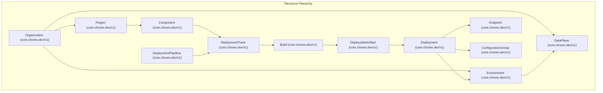
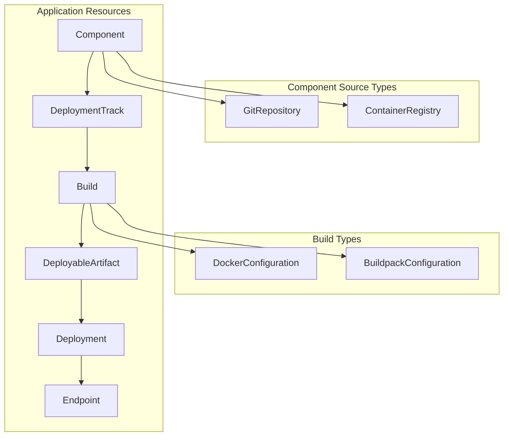
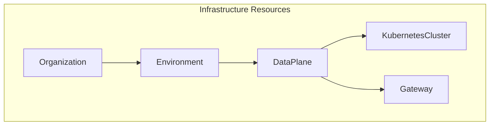
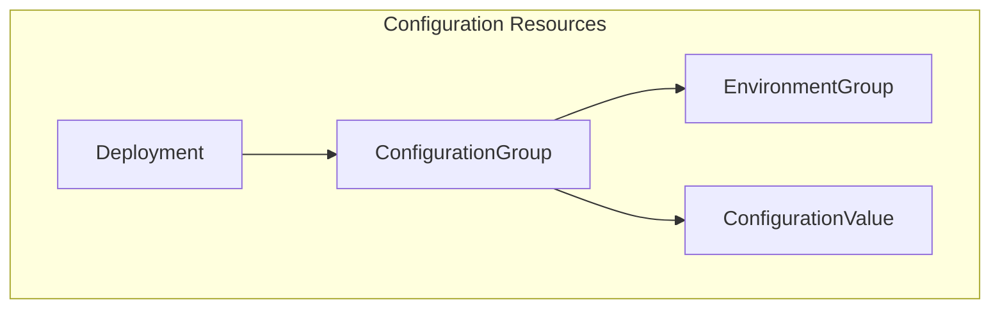
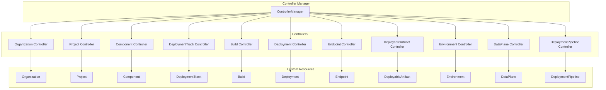

# Custom Resources

> **Relevant source files**
> * [PROJECT](https://github.com/openchoreo/openchoreo/blob/a577e969/PROJECT)
> * [cmd/main.go](https://github.com/openchoreo/openchoreo/blob/a577e969/cmd/main.go)
> * [config/crd/kustomization.yaml](https://github.com/openchoreo/openchoreo/blob/a577e969/config/crd/kustomization.yaml)
> * [config/rbac/kustomization.yaml](https://github.com/openchoreo/openchoreo/blob/a577e969/config/rbac/kustomization.yaml)
> * [config/rbac/role.yaml](https://github.com/openchoreo/openchoreo/blob/a577e969/config/rbac/role.yaml)
> * [config/samples/kustomization.yaml](https://github.com/openchoreo/openchoreo/blob/a577e969/config/samples/kustomization.yaml)

This page provides a comprehensive overview of the custom resources defined by OpenChoreo. Custom resources extend the Kubernetes API, allowing OpenChoreo to define domain-specific objects that represent application deployments, configurations, and infrastructure components in a structured way. For detailed implementation of the controllers that manage these resources, see [Architecture](/openchoreo/openchoreo/2-architecture).

## Resource Hierarchy and Relationships

OpenChoreo organizes resources in a hierarchical structure that models typical application deployment workflows. This hierarchy establishes ownership relationships and ensures proper resource isolation and management.



Sources:

* [cmd/main.go L71-L76](https://github.com/openchoreo/openchoreo/blob/a577e969/cmd/main.go#L71-L76)
* [cmd/main.go L175-L251](https://github.com/openchoreo/openchoreo/blob/a577e969/cmd/main.go#L175-L251)
* [config/crd/kustomization.yaml L4-L16](https://github.com/openchoreo/openchoreo/blob/a577e969/config/crd/kustomization.yaml#L4-L16)
* [config/samples/kustomization.yaml L2-L17](https://github.com/openchoreo/openchoreo/blob/a577e969/config/samples/kustomization.yaml#L2-L17)

## Custom Resource Types

OpenChoreo defines the following custom resources, each serving a specific purpose in the application deployment lifecycle:

### Organization and Project Resources

| Resource | Group | Version | Scope | Purpose |
| --- | --- | --- | --- | --- |
| Organization | core.choreo.dev | v1 | Cluster | Top-level resource that groups Projects and Environments |
| Project | core.choreo.dev | v1 | Namespaced | Contains Components and represents a logical application grouping |

Organizations are cluster-scoped resources that act as the top-level grouping mechanism, while Projects are namespace-scoped and contain related Components.

Sources:

* [config/crd/kustomization.yaml L5-L6](https://github.com/openchoreo/openchoreo/blob/a577e969/config/crd/kustomization.yaml#L5-L6)
* [PROJECT L11-L27](https://github.com/openchoreo/openchoreo/blob/a577e969/PROJECT#L11-L27)

### Application Resources



#### Component

A Component represents an application or service that can be deployed. It defines the source of the application code or container image.

```yaml
# Basic Component structure
apiVersion: core.choreo.dev/v1
kind: Component
metadata:
  name: example-component
spec:
  source:
    gitRepository:
      url: https://github.com/example/repo
    # OR
    containerRegistry:
      image: example/image:tag
```

Sources:

* [api/v1/zz_generated.deepcopy.go L385-L410](https://github.com/openchoreo/openchoreo/blob/a577e969/api/v1/zz_generated.deepcopy.go#L385-L410)
* [config/crd/kustomization.yaml L12](https://github.com/openchoreo/openchoreo/blob/a577e969/config/crd/kustomization.yaml#L12-L12)

#### DeploymentTrack

DeploymentTrack represents a specific deployment pathway for a Component, such as "development", "staging", or a feature branch.

Sources:

* [api/v1/zz_generated.deepcopy.go L1074-L1099](https://github.com/openchoreo/openchoreo/blob/a577e969/api/v1/zz_generated.deepcopy.go#L1074-L1099)
* [config/crd/kustomization.yaml L13](https://github.com/openchoreo/openchoreo/blob/a577e969/config/crd/kustomization.yaml#L13-L13)

#### Build

The Build resource defines how to build a container image from source code. It supports both Dockerfile-based builds and Buildpack-based builds.

```yaml
# Example Build with Buildpack
apiVersion: core.choreo.dev/v1
kind: Build
metadata:
  name: example-build
spec:
  branch: main
  buildConfiguration:
    buildpack:
      name: "NodeJS"
      version: "18.x.x"
  buildEnvironment:
    env:
      - name: NODE_ENV
        value: production
```

OpenChoreo supports the following buildpacks:

| Buildpack | Supported Versions |
| --- | --- |
| React | 18.20.6, 19.9.0, 20.18.3, 21.7.3, 22.14.0, 23.7.0 |
| Go | 1.x |
| Ballerina | 2201.7.5, 2201.8.9, 2201.9.6, 2201.10.4, 2201.11.0 |
| Node.js | 12.x.x, 14.x.x, 16.x.x, 18.x.x, 20.x.x, 22.x.x |
| Python | 3.10.x, 3.11.x, 3.12.x |
| Ruby | 3.1.x, 3.2.x, 3.3.x |
| PHP | 8.1.x, 8.2.x, 8.3.x |

Sources:

* [api/v1/build_types.go L28-L143](https://github.com/openchoreo/openchoreo/blob/a577e969/api/v1/build_types.go#L28-L143)
* [api/v1/zz_generated.deepcopy.go L135-L185](https://github.com/openchoreo/openchoreo/blob/a577e969/api/v1/zz_generated.deepcopy.go#L135-L185)
* [config/crd/bases/core.choreo.dev_builds.yaml L1-L181](https://github.com/openchoreo/openchoreo/blob/a577e969/config/crd/bases/core.choreo.dev_builds.yaml#L1-L181)

#### DeployableArtifact

DeployableArtifact represents a built container image with its configuration that is ready for deployment.

Sources:

* [api/v1/zz_generated.deepcopy.go L914-L970](https://github.com/openchoreo/openchoreo/blob/a577e969/api/v1/zz_generated.deepcopy.go#L914-L970)
* [config/crd/kustomization.yaml L14](https://github.com/openchoreo/openchoreo/blob/a577e969/config/crd/kustomization.yaml#L14-L14)

#### Deployment

The Deployment resource defines how a DeployableArtifact is deployed to a specific Environment, including configuration overrides.

```yaml
# Basic Deployment structure
apiVersion: core.choreo.dev/v1
kind: Deployment
metadata:
  name: example-deployment
spec:
  deployableArtifactRef: example-artifact
  environmentRef: dev
  configurationOverrides:
    application:
      resourceLimits:
        cpu: "0.5"
        memory: "512Mi"
```

Sources:

* [api/v1/zz_generated.deepcopy.go L1015-L1072](https://github.com/openchoreo/openchoreo/blob/a577e969/api/v1/zz_generated.deepcopy.go#L1015-L1072)
* [config/crd/kustomization.yaml L15](https://github.com/openchoreo/openchoreo/blob/a577e969/config/crd/kustomization.yaml#L15-L15)

#### Endpoint

The Endpoint resource defines how a deployed service is exposed externally, managing network ingress and security.

Sources:

* [config/crd/kustomization.yaml L16](https://github.com/openchoreo/openchoreo/blob/a577e969/config/crd/kustomization.yaml#L16-L16)
* [config/rbac/kustomization.yaml L53-L55](https://github.com/openchoreo/openchoreo/blob/a577e969/config/rbac/kustomization.yaml#L53-L55)

### Infrastructure Resources



#### Environment

An Environment represents a deployment target for applications, such as "development", "staging", or "production".

Sources:

* [api/v1/zz_generated.deepcopy.go L1074-L1099](https://github.com/openchoreo/openchoreo/blob/a577e969/api/v1/zz_generated.deepcopy.go#L1074-L1099)
* [config/crd/kustomization.yaml L9](https://github.com/openchoreo/openchoreo/blob/a577e969/config/crd/kustomization.yaml#L9-L9)

#### DataPlane

The DataPlane resource defines the infrastructure where applications are deployed, including the Kubernetes cluster and gateway configuration.

```yaml
# Basic DataPlane structure
apiVersion: core.choreo.dev/v1
kind: DataPlane
metadata:
  name: example-dataplane
spec:
  kubernetesCluster:
    contextName: my-cluster
  gateway:
    host: gateway.example.com
```

Sources:

* [api/v1/zz_generated.deepcopy.go L784-L881](https://github.com/openchoreo/openchoreo/blob/a577e969/api/v1/zz_generated.deepcopy.go#L784-L881)
* [config/crd/kustomization.yaml L10](https://github.com/openchoreo/openchoreo/blob/a577e969/config/crd/kustomization.yaml#L10-L10)

### Configuration Resources



#### ConfigurationGroup

The ConfigurationGroup resource manages application configuration across different environments, supporting configuration overrides.

Sources:

* [api/v1/zz_generated.deepcopy.go L539-L631](https://github.com/openchoreo/openchoreo/blob/a577e969/api/v1/zz_generated.deepcopy.go#L539-L631)
* [config/crd/kustomization.yaml L17](https://github.com/openchoreo/openchoreo/blob/a577e969/config/crd/kustomization.yaml#L17-L17)

#### DeploymentPipeline

The DeploymentPipeline resource defines promotion paths between environments, enabling automated or approval-based promotions.

```yaml
# Basic DeploymentPipeline structure
apiVersion: core.choreo.dev/v1
kind: DeploymentPipeline
metadata:
  name: example-pipeline
spec:
  promotionPaths:
    - from: dev
      to: staging
      type: AutoPromote
    - from: staging
      to: production
      type: ManualApproval
```

Sources:

* [api/v1/zz_generated.deepcopy.go L1074-L1175](https://github.com/openchoreo/openchoreo/blob/a577e969/api/v1/zz_generated.deepcopy.go#L1074-L1175)
* [config/crd/kustomization.yaml L11](https://github.com/openchoreo/openchoreo/blob/a577e969/config/crd/kustomization.yaml#L11-L11)

## Resource Lifecycle and Controller Integration

The custom resources are managed by corresponding controllers that reconcile the desired state with the actual state. Each controller is registered with the controller manager in the OpenChoreo control plane.



Each controller follows the Kubernetes reconciliation pattern:

1. Observe the current state of the resource
2. Compare with the desired state
3. Take actions to reconcile differences
4. Update the resource status with conditions reflecting the current state

Sources:

* [cmd/main.go L175-L251](https://github.com/openchoreo/openchoreo/blob/a577e969/cmd/main.go#L175-L251)

## Role-Based Access Control

OpenChoreo generates Editor and Viewer roles for each custom resource, enabling fine-grained access control:

| Resource | Roles |
| --- | --- |
| Organization | Editor, Viewer |
| Project | Editor, Viewer |
| Component | Editor, Viewer |
| Build | Editor, Viewer |
| DeploymentTrack | Editor, Viewer |
| Deployment | Editor, Viewer |
| Endpoint | Admin, Editor, Viewer |
| DeployableArtifact | Editor, Viewer |
| Environment | Editor, Viewer |
| DataPlane | Editor, Viewer |
| ConfigurationGroup | Editor, Viewer |
| DeploymentPipeline | Editor, Viewer |

These roles are used to manage permissions at different levels of the resource hierarchy.

Sources:

* [config/rbac/kustomization.yaml L25-L62](https://github.com/openchoreo/openchoreo/blob/a577e969/config/rbac/kustomization.yaml#L25-L62)

## Schema Registration and API Extensions

Custom resources are registered with the Kubernetes API server using the SchemeBuilder pattern, allowing them to be recognized and processed by the Kubernetes API machinery.

Sources:

* [cmd/main.go L67-L78](https://github.com/openchoreo/openchoreo/blob/a577e969/cmd/main.go#L67-L78)
* [api/v1/build_types.go L141-L143](https://github.com/openchoreo/openchoreo/blob/a577e969/api/v1/build_types.go#L141-L143)

## Conclusion

The custom resources in OpenChoreo provide a high-level abstraction for deploying and managing applications on Kubernetes. They form a cohesive model that represents the application deployment lifecycle, from source code to running services, while maintaining proper isolation, security, and configuration management.

For more details on how these resources interact with the build system, see [Build System](/openchoreo/openchoreo/3-build-system), and for deployment mechanics, see [Deployment System](/openchoreo/openchoreo/4-deployment-system).