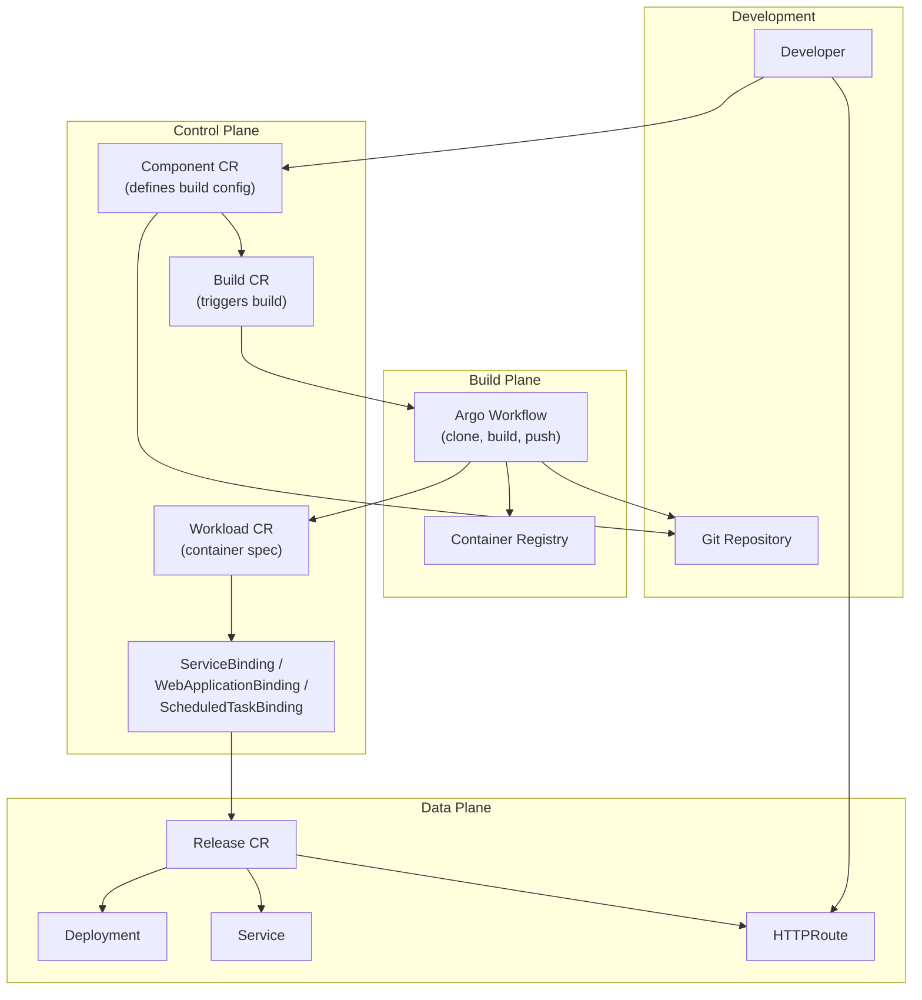
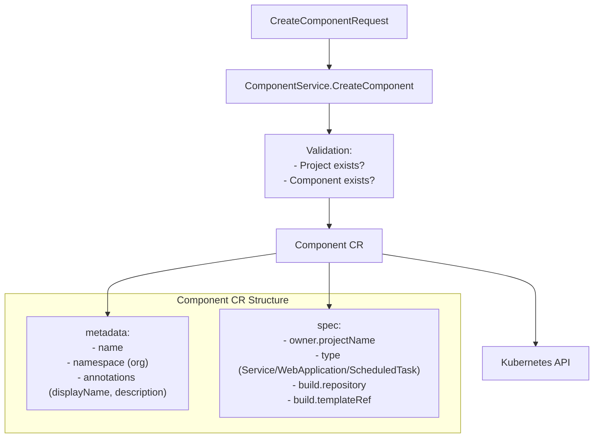
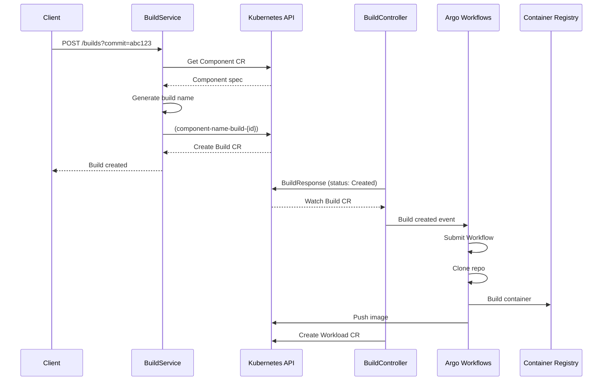
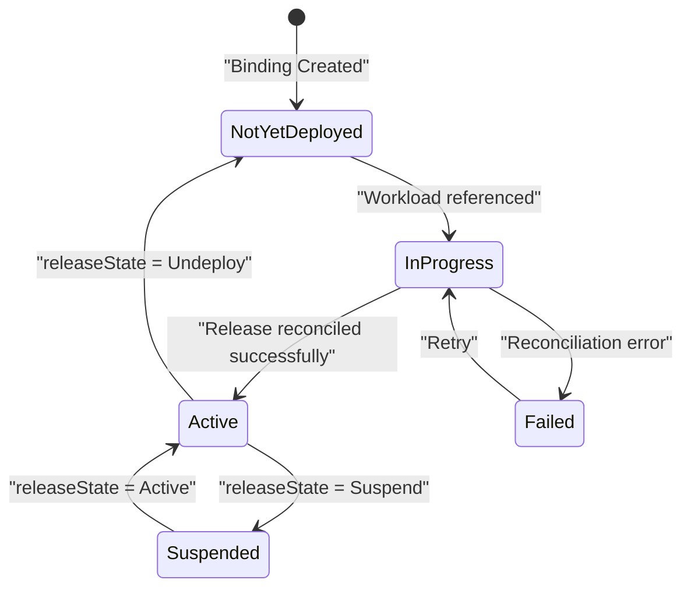
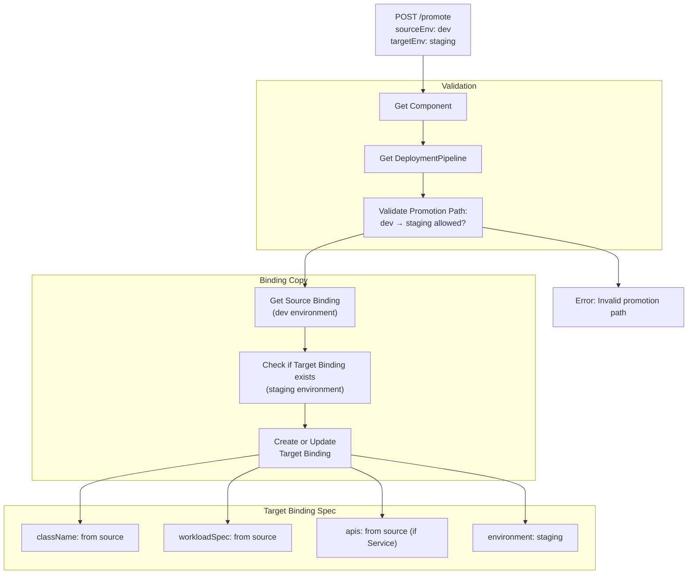
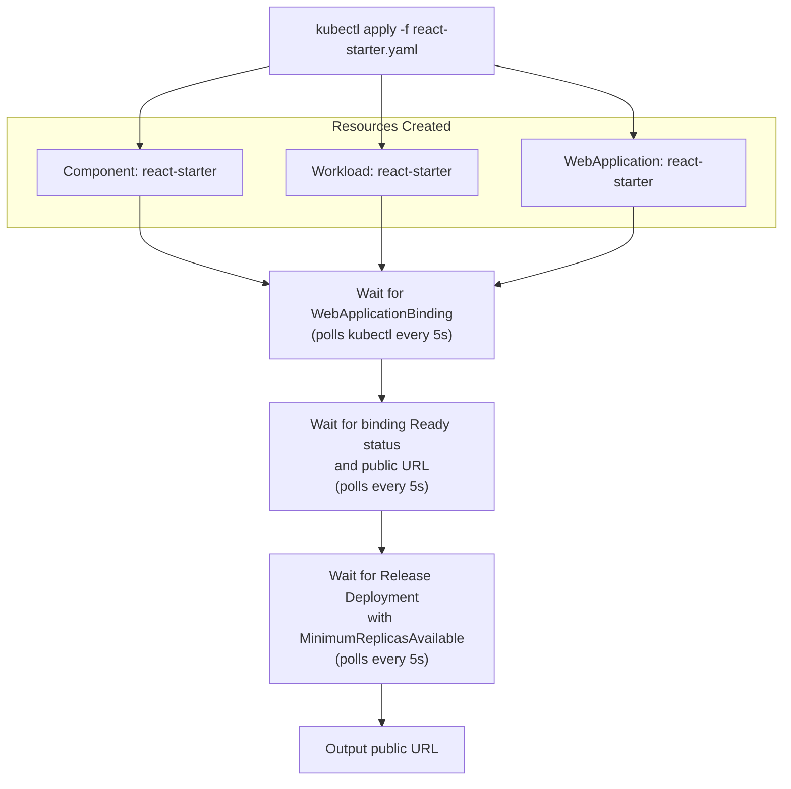

# Deploying Applications

> **Relevant source files**
> * [cmd/openchoreo-api/main.go](https://github.com/openchoreo/openchoreo/blob/a577e969/cmd/openchoreo-api/main.go)
> * [install/quick-start/Dockerfile](https://github.com/openchoreo/openchoreo/blob/a577e969/install/quick-start/Dockerfile)
> * [install/quick-start/deploy_web_application.sh](https://github.com/openchoreo/openchoreo/blob/a577e969/install/quick-start/deploy_web_application.sh)
> * [install/quick-start/install.sh](https://github.com/openchoreo/openchoreo/blob/a577e969/install/quick-start/install.sh)
> * [install/quick-start/uninstall.sh](https://github.com/openchoreo/openchoreo/blob/a577e969/install/quick-start/uninstall.sh)
> * [internal/choreoctl/resources/kinds/dataplane.go](https://github.com/openchoreo/openchoreo/blob/a577e969/internal/choreoctl/resources/kinds/dataplane.go)
> * [internal/openchoreo-api/clients/k8s.go](https://github.com/openchoreo/openchoreo/blob/a577e969/internal/openchoreo-api/clients/k8s.go)
> * [internal/openchoreo-api/handlers/apply.go](https://github.com/openchoreo/openchoreo/blob/a577e969/internal/openchoreo-api/handlers/apply.go)
> * [internal/openchoreo-api/handlers/buildplanes.go](https://github.com/openchoreo/openchoreo/blob/a577e969/internal/openchoreo-api/handlers/buildplanes.go)
> * [internal/openchoreo-api/handlers/builds.go](https://github.com/openchoreo/openchoreo/blob/a577e969/internal/openchoreo-api/handlers/builds.go)
> * [internal/openchoreo-api/handlers/components.go](https://github.com/openchoreo/openchoreo/blob/a577e969/internal/openchoreo-api/handlers/components.go)
> * [internal/openchoreo-api/handlers/dataplanes.go](https://github.com/openchoreo/openchoreo/blob/a577e969/internal/openchoreo-api/handlers/dataplanes.go)
> * [internal/openchoreo-api/handlers/environments.go](https://github.com/openchoreo/openchoreo/blob/a577e969/internal/openchoreo-api/handlers/environments.go)
> * [internal/openchoreo-api/handlers/handlers.go](https://github.com/openchoreo/openchoreo/blob/a577e969/internal/openchoreo-api/handlers/handlers.go)
> * [internal/openchoreo-api/handlers/helpers.go](https://github.com/openchoreo/openchoreo/blob/a577e969/internal/openchoreo-api/handlers/helpers.go)
> * [internal/openchoreo-api/handlers/organizations.go](https://github.com/openchoreo/openchoreo/blob/a577e969/internal/openchoreo-api/handlers/organizations.go)
> * [internal/openchoreo-api/handlers/workloads.go](https://github.com/openchoreo/openchoreo/blob/a577e969/internal/openchoreo-api/handlers/workloads.go)
> * [internal/openchoreo-api/models/request.go](https://github.com/openchoreo/openchoreo/blob/a577e969/internal/openchoreo-api/models/request.go)
> * [internal/openchoreo-api/models/response.go](https://github.com/openchoreo/openchoreo/blob/a577e969/internal/openchoreo-api/models/response.go)
> * [internal/openchoreo-api/services/build_service.go](https://github.com/openchoreo/openchoreo/blob/a577e969/internal/openchoreo-api/services/build_service.go)
> * [internal/openchoreo-api/services/buildplane_service.go](https://github.com/openchoreo/openchoreo/blob/a577e969/internal/openchoreo-api/services/buildplane_service.go)
> * [internal/openchoreo-api/services/component_service.go](https://github.com/openchoreo/openchoreo/blob/a577e969/internal/openchoreo-api/services/component_service.go)
> * [internal/openchoreo-api/services/dataplane_service.go](https://github.com/openchoreo/openchoreo/blob/a577e969/internal/openchoreo-api/services/dataplane_service.go)
> * [internal/openchoreo-api/services/environment_service.go](https://github.com/openchoreo/openchoreo/blob/a577e969/internal/openchoreo-api/services/environment_service.go)
> * [internal/openchoreo-api/services/errors.go](https://github.com/openchoreo/openchoreo/blob/a577e969/internal/openchoreo-api/services/errors.go)
> * [internal/openchoreo-api/services/organization_service.go](https://github.com/openchoreo/openchoreo/blob/a577e969/internal/openchoreo-api/services/organization_service.go)
> * [internal/openchoreo-api/services/project_service.go](https://github.com/openchoreo/openchoreo/blob/a577e969/internal/openchoreo-api/services/project_service.go)
> * [internal/openchoreo-api/services/services.go](https://github.com/openchoreo/openchoreo/blob/a577e969/internal/openchoreo-api/services/services.go)

This page provides a comprehensive guide to deploying applications in OpenChoreo, from component creation through build execution to production deployment. It covers the end-to-end workflow using both the HTTP API and kubectl. For managing existing deployments (updating bindings, checking status, retrieving logs), see [Component Management](/openchoreo/openchoreo/8.3-component-management). For CLI command reference, see [choreoctl Commands](/openchoreo/openchoreo/8.1-choreoctl-commands).

## Deployment Workflow Overview

OpenChoreo applications follow a structured deployment pipeline where Components are built into container images, wrapped as Workloads, and then bound to specific Environments through Binding resources. The platform handles the provisioning of Kubernetes resources, network policies, and gateway configurations automatically.



**Sources:** [internal/openchoreo-api/services/component_service.go L249-L310](https://github.com/openchoreo/openchoreo/blob/a577e969/internal/openchoreo-api/services/component_service.go#L249-L310)

 [internal/openchoreo-api/services/build_service.go L91-L161](https://github.com/openchoreo/openchoreo/blob/a577e969/internal/openchoreo-api/services/build_service.go#L91-L161)

 [install/quick-start/deploy_web_application.sh L19-L83](https://github.com/openchoreo/openchoreo/blob/a577e969/install/quick-start/deploy_web_application.sh#L19-L83)

## API Endpoints for Deployment

The OpenChoreo API provides RESTful endpoints for all deployment operations:

| Operation | HTTP Method | Endpoint | Request Body |
| --- | --- | --- | --- |
| Create Component | POST | `/api/v1/orgs/{orgName}/projects/{projectName}/components` | `CreateComponentRequest` |
| Get Component | GET | `/api/v1/orgs/{orgName}/projects/{projectName}/components/{componentName}` | - |
| List Components | GET | `/api/v1/orgs/{orgName}/projects/{projectName}/components` | - |
| Trigger Build | POST | `/api/v1/orgs/{orgName}/projects/{projectName}/components/{componentName}/builds` | Query param: `commit` |
| List Builds | GET | `/api/v1/orgs/{orgName}/projects/{projectName}/components/{componentName}/builds` | - |
| Get Bindings | GET | `/api/v1/orgs/{orgName}/projects/{projectName}/components/{componentName}/bindings` | Query params: `environment[]` |
| Promote Component | POST | `/api/v1/orgs/{orgName}/projects/{projectName}/components/{componentName}/promote` | `PromoteComponentRequest` |
| Update Binding | PATCH | `/api/v1/orgs/{orgName}/projects/{projectName}/components/{componentName}/bindings/{bindingName}` | `UpdateBindingRequest` |

**Sources:** [internal/openchoreo-api/handlers/handlers.go L70-L92](https://github.com/openchoreo/openchoreo/blob/a577e969/internal/openchoreo-api/handlers/handlers.go#L70-L92)

 [internal/openchoreo-api/handlers/components.go L17-L321](https://github.com/openchoreo/openchoreo/blob/a577e969/internal/openchoreo-api/handlers/components.go#L17-L321)

 [internal/openchoreo-api/handlers/builds.go L36-L114](https://github.com/openchoreo/openchoreo/blob/a577e969/internal/openchoreo-api/handlers/builds.go#L36-L114)

## Creating a Component

### Component Specification

A Component defines the application's build configuration and type. The build configuration includes the Git repository, branch, component path, and build template reference.



**Sources:** [internal/openchoreo-api/services/component_service.go L52-L99](https://github.com/openchoreo/openchoreo/blob/a577e969/internal/openchoreo-api/services/component_service.go#L52-L99)

 [internal/openchoreo-api/handlers/components.go L17-L61](https://github.com/openchoreo/openchoreo/blob/a577e969/internal/openchoreo-api/handlers/components.go#L17-L61)

### Component Creation via HTTP API

The `CreateComponentRequest` model specifies the required fields:

```json
{
  "name": "my-service",
  "displayName": "My Service",
  "description": "A sample service",
  "type": "Service",
  "buildConfig": {
    "repoUrl": "https://github.com/myorg/myrepo",
    "repoBranch": "main",
    "componentPath": "/services/my-service",
    "buildTemplateRef": "ballerina-buildpack",
    "buildTemplateParams": [
      {
        "name": "BALLERINA_VERSION",
        "value": "2201.8.0"
      }
    ]
  }
}
```

The API handler validates the request and delegates to `ComponentService.CreateComponent()`:

**Request Processing Flow:**

1. `CreateComponent` handler extracts `orgName` and `projectName` from URL path
2. Parses `CreateComponentRequest` from request body
3. Calls `ComponentService.CreateComponent(ctx, orgName, projectName, &req)`
4. Service validates project exists via `ProjectService.GetProject()`
5. Checks component uniqueness with `componentExists()`
6. Creates Component CR via `createComponentResources()`
7. Returns `ComponentResponse` with status `"Creating"`

**Sources:** [internal/openchoreo-api/handlers/components.go L17-L61](https://github.com/openchoreo/openchoreo/blob/a577e969/internal/openchoreo-api/handlers/components.go#L17-L61)

 [internal/openchoreo-api/services/component_service.go L52-L99](https://github.com/openchoreo/openchoreo/blob/a577e969/internal/openchoreo-api/services/component_service.go#L52-L99)

 [internal/openchoreo-api/models/request.go L34-L41](https://github.com/openchoreo/openchoreo/blob/a577e969/internal/openchoreo-api/models/request.go#L34-L41)

### Component Creation via kubectl

Components can also be created directly using kubectl:

```yaml
apiVersion: openchoreo.dev/v1alpha1
kind: Component
metadata:
  name: react-starter
  namespace: default  # organization namespace
  annotations:
    openchoreo.dev/display-name: "React Starter"
    openchoreo.dev/description: "Sample React application"
spec:
  owner:
    projectName: sample-project
  type: WebApplication
  build:
    repository:
      url: https://github.com/openchoreo/openchoreo
      revision:
        branch: main
      appPath: /samples/react-starter
    templateRef:
      name: react
      parameters:
        - name: NODE_VERSION
          value: "18"
```

**Sources:** [install/quick-start/deploy_web_application.sh L16-L36](https://github.com/openchoreo/openchoreo/blob/a577e969/install/quick-start/deploy_web_application.sh#L16-L36)

 [internal/openchoreo-api/services/component_service.go L249-L310](https://github.com/openchoreo/openchoreo/blob/a577e969/internal/openchoreo-api/services/component_service.go#L249-L310)

## Triggering Builds

### Build Workflow



**Sources:** [internal/openchoreo-api/services/build_service.go L91-L161](https://github.com/openchoreo/openchoreo/blob/a577e969/internal/openchoreo-api/services/build_service.go#L91-L161)

 [internal/openchoreo-api/handlers/builds.go L36-L74](https://github.com/openchoreo/openchoreo/blob/a577e969/internal/openchoreo-api/handlers/builds.go#L36-L74)

### Build Trigger API

Triggering a build creates a Build CR that references the Component's build configuration:

**Endpoint:** `POST /api/v1/orgs/{orgName}/projects/{projectName}/components/{componentName}/builds`

**Query Parameters:**

* `commit` (optional): Git commit SHA. If not provided, builds from the latest commit on the configured branch.

**Build CR Structure:**

* **Name:** `{componentName}-build-{8-char-uuid}`
* **Namespace:** Organization name
* **Labels:** `openchoreo.dev/organization`, `openchoreo.dev/project`, `openchoreo.dev/component`
* **Spec:** * `owner.projectName`: Project owning this build * `owner.componentName`: Component being built * `repository.url`: Git repository URL (from Component) * `repository.revision.branch`: Branch name (from Component) * `repository.revision.commit`: Specific commit SHA (from request) * `repository.appPath`: Path to application code (from Component) * `templateRef`: Build template reference (from Component)

**Sources:** [internal/openchoreo-api/services/build_service.go L91-L161](https://github.com/openchoreo/openchoreo/blob/a577e969/internal/openchoreo-api/services/build_service.go#L91-L161)

 [internal/openchoreo-api/handlers/builds.go L36-L74](https://github.com/openchoreo/openchoreo/blob/a577e969/internal/openchoreo-api/handlers/builds.go#L36-L74)

### Monitoring Build Status

List builds for a component to track progress:

**Endpoint:** `GET /api/v1/orgs/{orgName}/projects/{projectName}/components/{componentName}/builds`

**Build Status Values:**
The status is derived from Build CR conditions with priority order:

1. `WorkloadUpdated` + True → `"Completed"`
2. Other conditions → Returns the `reason` field

Build condition types (in execution order):

* `BuildInitiated`: Build process started
* `BuildTriggered`: Argo Workflow submitted
* `BuildCompleted`: Container image built and pushed
* `WorkloadUpdated`: Workload CR created/updated with new image

**Sources:** [internal/openchoreo-api/services/build_service.go L163-L231](https://github.com/openchoreo/openchoreo/blob/a577e969/internal/openchoreo-api/services/build_service.go#L163-L231)

 [internal/openchoreo-api/handlers/builds.go L76-L114](https://github.com/openchoreo/openchoreo/blob/a577e969/internal/openchoreo-api/handlers/builds.go#L76-L114)

## Understanding Bindings

### Binding Types and Lifecycle

OpenChoreo uses typed Bindings to deploy Components to specific Environments. Each Component type has a corresponding Binding type:

| Component Type | Binding Type | Provisions |
| --- | --- | --- |
| Service | ServiceBinding | Deployment, Service, NetworkPolicy, HTTPRoute (REST/gRPC) |
| WebApplication | WebApplicationBinding | Deployment, Service, NetworkPolicy, HTTPRoute (static content) |
| ScheduledTask | ScheduledTaskBinding | CronJob |



**Sources:** [internal/openchoreo-api/services/component_service.go L416-L558](https://github.com/openchoreo/openchoreo/blob/a577e969/internal/openchoreo-api/services/component_service.go#L416-L558)

 [internal/openchoreo-api/models/response.go L71-L103](https://github.com/openchoreo/openchoreo/blob/a577e969/internal/openchoreo-api/models/response.go#L71-L103)

### Binding Status Types

Bindings track deployment state through status conditions:

| Status Type | Condition Status | Condition Reason | Description |
| --- | --- | --- | --- |
| `NotYetDeployed` | False | (initial/unknown) | Binding created, no deployment yet |
| `InProgress` | False | `ResourceHealthProgressing` | Deployment in progress |
| `Active` | True | - | Deployment healthy and serving traffic |
| `Suspended` | False | `ResourcesSuspended` | Deployment scaled to zero |
| `Failed` | False | `ResourceHealthDegraded`, `*ClassNotFound`, `ReleaseCreationFailed`, etc. | Deployment failed |

**Sources:** [internal/openchoreo-api/services/component_service.go L717-L737](https://github.com/openchoreo/openchoreo/blob/a577e969/internal/openchoreo-api/services/component_service.go#L717-L737)

 [internal/openchoreo-api/models/response.go L71-L86](https://github.com/openchoreo/openchoreo/blob/a577e969/internal/openchoreo-api/models/response.go#L71-L86)

### Retrieving Binding Information

**Endpoint:** `GET /api/v1/orgs/{orgName}/projects/{projectName}/components/{componentName}/bindings`

**Query Parameters:**

* `environment[]` (optional, repeatable): Filter by environment names. If omitted, returns bindings for all environments in the project's DeploymentPipeline.

**Response Structure:**

```json
{
  "success": true,
  "data": {
    "items": [
      {
        "name": "my-service-dev",
        "type": "Service",
        "componentName": "my-service",
        "projectName": "my-project",
        "orgName": "default",
        "environment": "dev",
        "status": {
          "status": "Active",
          "reason": "",
          "message": "",
          "lastTransitioned": "2024-01-15T10:30:00Z"
        },
        "serviceBinding": {
          "endpoints": [
            {
              "name": "http",
              "type": "HTTP",
              "public": {
                "host": "my-service.dev.openchoreo.dev",
                "port": 443,
                "scheme": "https",
                "basePath": "/",
                "uri": "https://my-service.dev.openchoreo.dev"
              }
            }
          ],
          "image": "registry.openchoreo.dev/my-service:build-abc123"
        }
      }
    ]
  }
}
```

**Sources:** [internal/openchoreo-api/services/component_service.go L364-L400](https://github.com/openchoreo/openchoreo/blob/a577e969/internal/openchoreo-api/services/component_service.go#L364-L400)

 [internal/openchoreo-api/handlers/components.go L144-L188](https://github.com/openchoreo/openchoreo/blob/a577e969/internal/openchoreo-api/handlers/components.go#L144-L188)

 [internal/openchoreo-api/models/response.go L57-L119](https://github.com/openchoreo/openchoreo/blob/a577e969/internal/openchoreo-api/models/response.go#L57-L119)

## Promoting Between Environments

### Promotion Workflow

Component promotion copies a Binding from a source environment to a target environment, subject to DeploymentPipeline validation:



**Sources:** [internal/openchoreo-api/services/component_service.go L659-L696](https://github.com/openchoreo/openchoreo/blob/a577e969/internal/openchoreo-api/services/component_service.go#L659-L696)

 [internal/openchoreo-api/services/component_service.go L739-L782](https://github.com/openchoreo/openchoreo/blob/a577e969/internal/openchoreo-api/services/component_service.go#L739-L782)

### Promotion Path Validation

Promotion paths are defined in the Project's DeploymentPipeline CR. The API validates that the requested source→target path exists:

**DeploymentPipeline Structure:**

```yaml
apiVersion: openchoreo.dev/v1alpha1
kind: DeploymentPipeline
metadata:
  name: default-pipeline
  namespace: default
spec:
  promotionPaths:
    - sourceEnvironmentRef: dev
      targetEnvironmentRefs:
        - name: staging
          requiresApproval: false
    - sourceEnvironmentRef: staging
      targetEnvironmentRefs:
        - name: prod
          requiresApproval: true
```

**Validation Logic:**

1. Get Project to determine `deploymentPipelineRef` (defaults to `"default-pipeline"`)
2. Get DeploymentPipeline CR
3. Iterate through `spec.promotionPaths`
4. Check if any path has `sourceEnvironmentRef == sourceEnv` and contains `targetEnvironmentRefs` with matching `name == targetEnv`
5. If no match found, return `ErrInvalidPromotionPath`

**Sources:** [internal/openchoreo-api/services/component_service.go L739-L782](https://github.com/openchoreo/openchoreo/blob/a577e969/internal/openchoreo-api/services/component_service.go#L739-L782)

### Promotion API

**Endpoint:** `POST /api/v1/orgs/{orgName}/projects/{projectName}/components/{componentName}/promote`

**Request Body:**

```json
{
  "sourceEnv": "dev",
  "targetEnv": "staging"
}
```

**Process:**

1. Validate promotion path via DeploymentPipeline
2. Get component type (Service, WebApplication, ScheduledTask)
3. Retrieve source binding from source environment
4. Check if target binding already exists
5. Create new binding with name `{componentName}-{targetEnv}` OR update existing binding
6. Copy `className`, `workloadSpec`, `apis` (for Service) from source binding
7. Set `environment` to target environment
8. Return all bindings for the component across environments

**Sources:** [internal/openchoreo-api/services/component_service.go L659-L696](https://github.com/openchoreo/openchoreo/blob/a577e969/internal/openchoreo-api/services/component_service.go#L659-L696)

 [internal/openchoreo-api/handlers/components.go L190-L261](https://github.com/openchoreo/openchoreo/blob/a577e969/internal/openchoreo-api/handlers/components.go#L190-L261)

 [internal/openchoreo-api/models/request.go L43-L48](https://github.com/openchoreo/openchoreo/blob/a577e969/internal/openchoreo-api/models/request.go#L43-L48)

## Accessing Deployed Applications

### Endpoint URLs

Bindings expose endpoints based on the Environment's visibility configuration. Each endpoint can have up to three visibility levels:

| Visibility Level | Access Scope | Gateway | URL Pattern |
| --- | --- | --- | --- |
| Public | Internet | `gateway-external` | `{component}.{env}.{publicVirtualHost}` |
| Organization | Organization-wide | `gateway-internal` | `{component}.{env}.{organizationVirtualHost}` |
| Project | Project-only | `gateway-internal` | Internal service name |

**Endpoint Information in Binding Response:**

```json
{
  "endpoints": [
    {
      "name": "http",
      "type": "HTTP",
      "public": {
        "host": "my-service.dev.openchoreo.dev",
        "port": 443,
        "scheme": "https",
        "basePath": "/api",
        "uri": "https://my-service.dev.openchoreo.dev/api"
      },
      "organization": {
        "host": "my-service.dev.internal.openchoreo.dev",
        "port": 443,
        "scheme": "https",
        "basePath": "/api",
        "uri": "https://my-service.dev.internal.openchoreo.dev/api"
      }
    }
  ]
}
```

**Sources:** [internal/openchoreo-api/services/component_service.go L560-L605](https://github.com/openchoreo/openchoreo/blob/a577e969/internal/openchoreo-api/services/component_service.go#L560-L605)

 [internal/openchoreo-api/models/response.go L105-L119](https://github.com/openchoreo/openchoreo/blob/a577e969/internal/openchoreo-api/models/response.go#L105-L119)

### Observability URLs

Retrieve observer URLs for viewing application logs:

**For Deployed Applications:**

```
GET /api/v1/orgs/{orgName}/projects/{projectName}/components/{componentName}/environments/{environmentName}/observer-url
```

**For Build Logs:**

```
GET /api/v1/orgs/{orgName}/projects/{projectName}/components/{componentName}/observer-url
```

The observer URL includes authentication credentials and filters for the specific component:

* Data Plane observer URL includes deployment namespace and component filters
* Build Plane observer URL includes build workflow filters

**Sources:** [internal/openchoreo-api/handlers/components.go L323-L410](https://github.com/openchoreo/openchoreo/blob/a577e969/internal/openchoreo-api/handlers/components.go#L323-L410)

## Complete Deployment Example

### Step-by-Step: Deploying a React Web Application

This example demonstrates deploying the `react-starter` sample application from the OpenChoreo repository.

**1. Create the Component:**

```
curl -X POST http://localhost:8080/api/v1/orgs/default/projects/sample-project/components \
  -H "Content-Type: application/json" \
  -d '{
    "name": "react-starter",
    "displayName": "React Starter",
    "description": "Sample React application",
    "type": "WebApplication",
    "buildConfig": {
      "repoUrl": "https://github.com/openchoreo/openchoreo",
      "repoBranch": "main",
      "componentPath": "/samples/react-starter",
      "buildTemplateRef": "react"
    }
  }'
```

**2. Trigger a Build:**

```
curl -X POST "http://localhost:8080/api/v1/orgs/default/projects/sample-project/components/react-starter/builds?commit=main" \
  -H "Content-Type: application/json"
```

Response:

```json
{
  "success": true,
  "data": {
    "name": "react-starter-build-a1b2c3d4",
    "uuid": "550e8400-e29b-41d4-a716-446655440000",
    "componentName": "react-starter",
    "projectName": "sample-project",
    "orgName": "default",
    "commit": "main",
    "status": "Created",
    "createdAt": "2024-01-15T10:00:00Z"
  }
}
```

**3. Monitor Build Progress:**

```
curl -X GET "http://localhost:8080/api/v1/orgs/default/projects/sample-project/components/react-starter/builds"
```

Poll until status shows `"Completed"`.

**4. Create Workload (from Build Output):**

The Build controller automatically creates a Workload CR when the build completes. Alternatively, create manually:

```
curl -X POST "http://localhost:8080/api/v1/orgs/default/projects/sample-project/components/react-starter/workloads" \
  -H "Content-Type: application/json" \
  -d '{
    "containers": [
      {
        "name": "react-starter",
        "image": "registry.openchoreo-data-plane:5000/react-starter:build-a1b2c3d4",
        "ports": [
          {
            "name": "http",
            "containerPort": 8080,
            "protocol": "HTTP"
          }
        ]
      }
    ]
  }'
```

**5. Create WebApplication and Binding (via kubectl):**

```yaml
apiVersion: openchoreo.dev/v1alpha1
kind: WebApplication
metadata:
  name: react-starter
  namespace: default
spec:
  owner:
    componentName: react-starter
  endpoints:
    - name: http
      port: 8080
      type: HTTP
      visibility: Public
---
apiVersion: openchoreo.dev/v1alpha1
kind: WebApplicationBinding
metadata:
  name: react-starter-dev
  namespace: default
spec:
  owner:
    projectName: sample-project
    componentName: react-starter
  environment: dev
  className: react-starter
  workloadSpec:
    containers:
      - name: react-starter
        image: registry.openchoreo-data-plane:5000/react-starter:build-a1b2c3d4
        ports:
          - name: http
            containerPort: 8080
            protocol: HTTP
```

**6. Check Binding Status:**

```
curl -X GET "http://localhost:8080/api/v1/orgs/default/projects/sample-project/components/react-starter/bindings?environment=dev"
```

Wait for `status.status` to be `"Active"`.

**7. Access the Application:**

Extract the public URI from the binding response and access it in a browser:

```yaml
https://react-starter.dev.openchoreo.dev
```

**8. Promote to Staging:**

```
curl -X POST "http://localhost:8080/api/v1/orgs/default/projects/sample-project/components/react-starter/promote" \
  -H "Content-Type: application/json" \
  -d '{
    "sourceEnv": "dev",
    "targetEnv": "staging"
  }'
```

This creates a `react-starter-staging` binding with the same workload spec as dev.

**Sources:** [install/quick-start/deploy_web_application.sh L16-L83](https://github.com/openchoreo/openchoreo/blob/a577e969/install/quick-start/deploy_web_application.sh#L16-L83)

 [internal/openchoreo-api/handlers/components.go L17-L321](https://github.com/openchoreo/openchoreo/blob/a577e969/internal/openchoreo-api/handlers/components.go#L17-L321)

 [internal/openchoreo-api/handlers/builds.go L36-L114](https://github.com/openchoreo/openchoreo/blob/a577e969/internal/openchoreo-api/handlers/builds.go#L36-L114)

## Deployment Verification Script

The quick-start installation includes an automated deployment script that demonstrates the complete workflow:



**Key Checks Performed:**

1. **Component Creation:** Verifies `component.openchoreo.dev/react-starter created`
2. **Workload Creation:** Verifies `workload.openchoreo.dev/react-starter created`
3. **WebApplication Creation:** Verifies `webapplication.openchoreo.dev/react-starter created`
4. **Binding Created:** Polls until WebApplicationBinding with name containing `react-starter` exists
5. **Binding Ready:** Polls until `status.conditions[type=Ready].status == True` and `status.endpoints[].public.uri` is populated
6. **Deployment Available:** Polls Release resources with label `openchoreo.dev/component=react-starter` until Deployment has condition `Available` with reason `MinimumReplicasAvailable`

**Sources:** [install/quick-start/deploy_web_application.sh L1-L83](https://github.com/openchoreo/openchoreo/blob/a577e969/install/quick-start/deploy_web_application.sh#L1-L83)