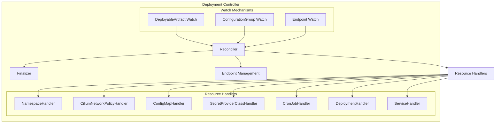
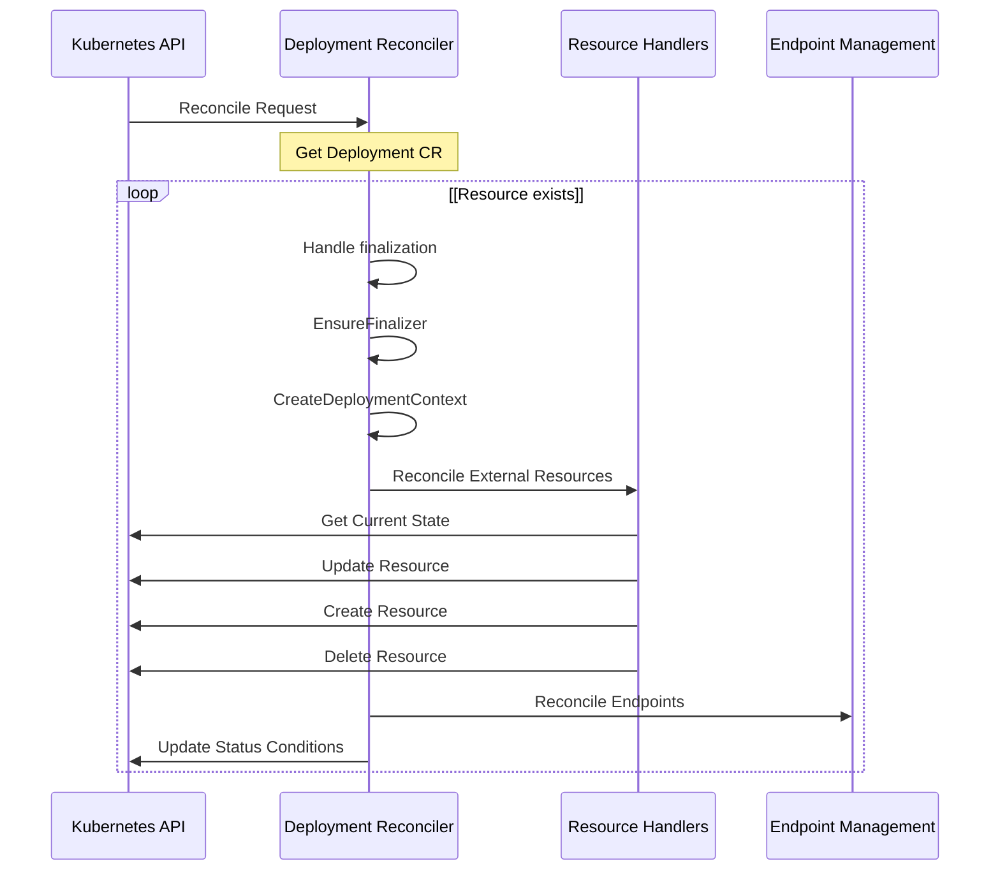
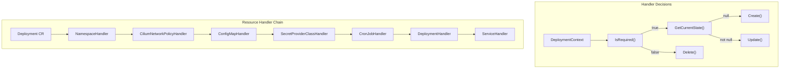
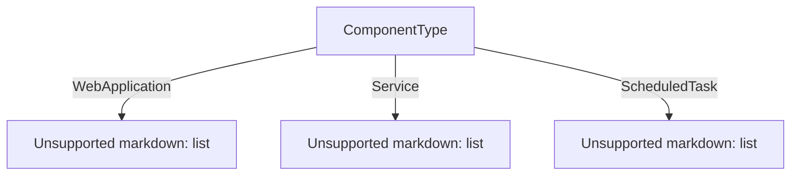
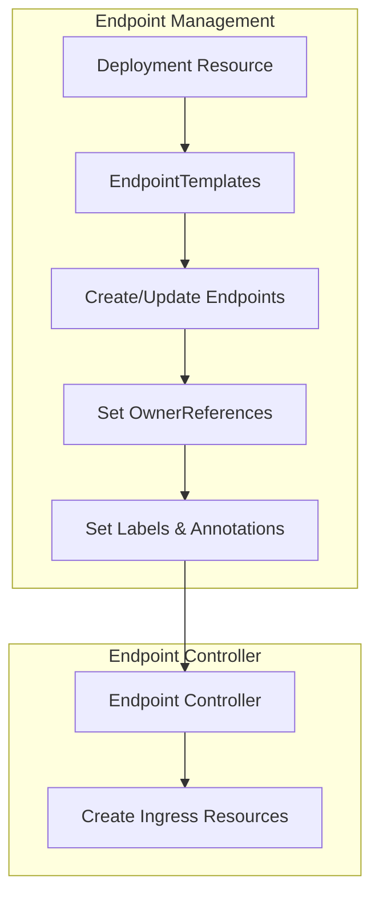
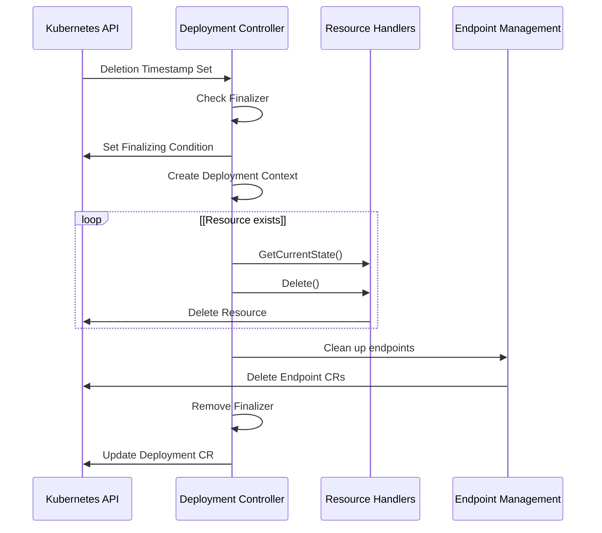
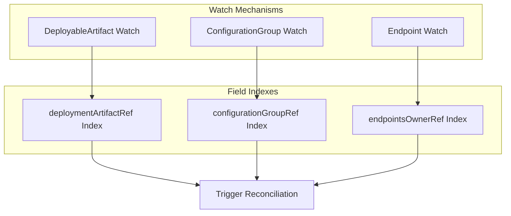
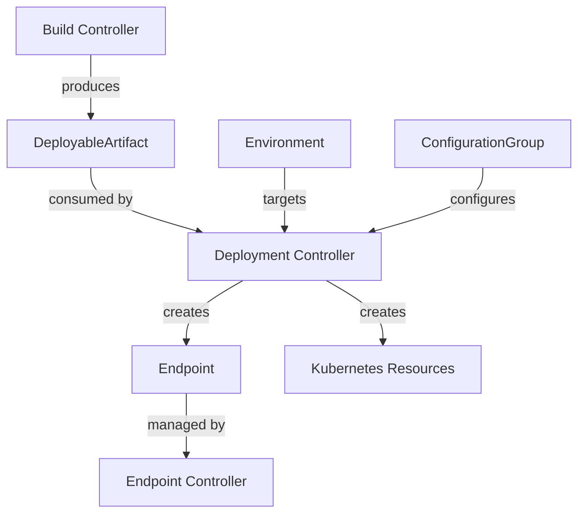

# Deployment Controller

> **Relevant source files**
> * [internal/controller/annotations.go](https://github.com/openchoreo/openchoreo/blob/a577e969/internal/controller/annotations.go)
> * [internal/controller/deployment/controller.go](https://github.com/openchoreo/openchoreo/blob/a577e969/internal/controller/deployment/controller.go)
> * [internal/controller/deployment/controller_endpoints.go](https://github.com/openchoreo/openchoreo/blob/a577e969/internal/controller/deployment/controller_endpoints.go)
> * [internal/controller/deployment/controller_endpoints_test.go](https://github.com/openchoreo/openchoreo/blob/a577e969/internal/controller/deployment/controller_endpoints_test.go)
> * [internal/controller/deployment/controller_finalize.go](https://github.com/openchoreo/openchoreo/blob/a577e969/internal/controller/deployment/controller_finalize.go)
> * [internal/controller/deployment/controller_test.go](https://github.com/openchoreo/openchoreo/blob/a577e969/internal/controller/deployment/controller_test.go)
> * [internal/controller/deployment/controller_watch.go](https://github.com/openchoreo/openchoreo/blob/a577e969/internal/controller/deployment/controller_watch.go)
> * [internal/controller/endpoint/controller.go](https://github.com/openchoreo/openchoreo/blob/a577e969/internal/controller/endpoint/controller.go)
> * [internal/controller/endpoint/controller_conditions.go](https://github.com/openchoreo/openchoreo/blob/a577e969/internal/controller/endpoint/controller_conditions.go)
> * [internal/controller/endpoint/controller_finalize.go](https://github.com/openchoreo/openchoreo/blob/a577e969/internal/controller/endpoint/controller_finalize.go)
> * [internal/controller/hierarchy.go](https://github.com/openchoreo/openchoreo/blob/a577e969/internal/controller/hierarchy.go)
> * [internal/controller/release/controller.go](https://github.com/openchoreo/openchoreo/blob/a577e969/internal/controller/release/controller.go)
> * [internal/controller/watch.go](https://github.com/openchoreo/openchoreo/blob/a577e969/internal/controller/watch.go)

The Deployment Controller is responsible for reconciling the state of Deployment custom resources in the OpenChoreo platform. It creates and manages the necessary Kubernetes resources to run applications in the data plane based on the specifications defined in Deployment resources. This controller plays a critical role in the application lifecycle management, ensuring that the actual state of deployed applications matches the desired state.

For information about build processes that create deployable artifacts, see [Build System](/openchoreo/openchoreo/3-build-system) and [Build Controller](/openchoreo/openchoreo/3.1-build-controller).

## Controller Architecture

The Deployment Controller follows the Kubernetes operator pattern, implementing a controller that watches for changes to Deployment resources and reconciles the actual state with the desired state.

Sources: [internal/controller/deployment/controller.go L41-L46](https://github.com/openchoreo/openchoreo/blob/a577e969/internal/controller/deployment/controller.go#L41-L46)

 [internal/controller/deployment/controller.go L183-L197](https://github.com/openchoreo/openchoreo/blob/a577e969/internal/controller/deployment/controller.go#L183-L197)

## Reconciliation Process

The reconciliation process is the core of the Deployment Controller. It handles the main logic for ensuring that all the necessary Kubernetes resources are created, updated, or deleted based on the Deployment specification.

The main reconcile function performs the following steps:

1. Fetches the Deployment instance
2. Handles deletion if the Deployment is being deleted
3. Ensures the finalizer is added
4. Creates a deployment context with relevant hierarchy objects
5. Reconciles external resources using resource handlers
6. Reconciles Choreo endpoints
7. Updates status conditions

Sources: [internal/controller/deployment/controller.go L48-L136](https://github.com/openchoreo/openchoreo/blob/a577e969/internal/controller/deployment/controller.go#L48-L136)

## Resource Handlers

The Deployment Controller uses a chain of resource handlers to manage different Kubernetes resources. Each handler is responsible for a specific resource type and follows a consistent interface pattern.

### Resource Handler Interface

Each resource handler implements the following methods:

* `Name()`: Returns the name of the handler
* `IsRequired()`: Determines if the resource should be created based on the deployment context
* `GetCurrentState()`: Retrieves the current state of the resource
* `Create()`: Creates the resource
* `Update()`: Updates the resource if it exists
* `Delete()`: Deletes the resource

### Resource Handler Chain

The following resource handlers are utilized in the order they appear:

| Handler | Purpose | Component Types |
| --- | --- | --- |
| NamespaceHandler | Creates and manages the namespace for the deployment | All |
| CiliumNetworkPolicyHandler | Creates network policies for deployment isolation | All |
| ConfigMapHandler | Manages configuration maps | All |
| SecretProviderClassHandler | Sets up secret providers | All |
| CronJobHandler | Creates and manages cron jobs | Scheduled Tasks |
| DeploymentHandler | Creates and manages Kubernetes deployments | Web Applications, Services |
| ServiceHandler | Creates and manages Kubernetes services | Web Applications, Services |

The order of handlers is important because some resources depend on others. For example, all resources depend on the namespace existing first.

Sources: [internal/controller/deployment/controller.go L183-L197](https://github.com/openchoreo/openchoreo/blob/a577e969/internal/controller/deployment/controller.go#L183-L197)

 [internal/controller/deployment/controller.go L198-L244](https://github.com/openchoreo/openchoreo/blob/a577e969/internal/controller/deployment/controller.go#L198-L244)

 [internal/controller/deployment/integrations/kubernetes/deployment_handler.go](https://github.com/openchoreo/openchoreo/blob/a577e969/internal/controller/deployment/integrations/kubernetes/deployment_handler.go)

 [internal/controller/deployment/integrations/kubernetes/service_handler.go](https://github.com/openchoreo/openchoreo/blob/a577e969/internal/controller/deployment/integrations/kubernetes/service_handler.go)

 [internal/controller/deployment/integrations/kubernetes/cronjob_handler.go](https://github.com/openchoreo/openchoreo/blob/a577e969/internal/controller/deployment/integrations/kubernetes/cronjob_handler.go)

 [internal/controller/deployment/integrations/kubernetes/namespace_handler.go](https://github.com/openchoreo/openchoreo/blob/a577e969/internal/controller/deployment/integrations/kubernetes/namespace_handler.go)

## Component Type Specific Handlers

The Deployment Controller handles different types of components differently:

1. **Web Applications and Services**: * Uses Kubernetes Deployments for running the application * Creates Kubernetes Services for internal connectivity * Sets up endpoint templates for external access
2. **Scheduled Tasks**: * Uses Kubernetes CronJobs for scheduling and execution * Configures schedules, timezone, and run policies

Each handler makes decisions based on the component type:

Sources: [internal/controller/deployment/integrations/kubernetes/deployment_handler.go L54-L60](https://github.com/openchoreo/openchoreo/blob/a577e969/internal/controller/deployment/integrations/kubernetes/deployment_handler.go#L54-L60)

 [internal/controller/deployment/integrations/kubernetes/service_handler.go L53-L57](https://github.com/openchoreo/openchoreo/blob/a577e969/internal/controller/deployment/integrations/kubernetes/service_handler.go#L53-L57)

 [internal/controller/deployment/integrations/kubernetes/cronjob_handler.go L55-L57](https://github.com/openchoreo/openchoreo/blob/a577e969/internal/controller/deployment/integrations/kubernetes/cronjob_handler.go#L55-L57)

## Deployment Context

To reconcile effectively, the controller creates a deployment context that contains all the necessary information about the deployment and its related resources. This context includes:

* The Deployment resource
* The Component resource
* The DeploymentTrack resource
* The Project resource
* The Environment resource
* The DeployableArtifact resource

This deployment context is passed to each resource handler, providing all the information needed to create, update, or delete external resources.

Sources: [internal/controller/deployment/controller.go L91-L100](https://github.com/openchoreo/openchoreo/blob/a577e969/internal/controller/deployment/controller.go#L91-L100)

## Endpoint Management

The Deployment Controller also manages the lifecycle of Endpoint custom resources. It creates, updates, and deletes endpoints based on the endpoint templates defined in the DeployableArtifact specification.

The endpoint management process:

1. Creates Endpoint custom resources with ownership references to the Deployment
2. Sets up labels and annotations from the Deployment
3. Uses the endpoint controller to manage the actual ingress resources

Sources: [internal/controller/deployment/controller_endpoints.go L37-L159](https://github.com/openchoreo/openchoreo/blob/a577e969/internal/controller/deployment/controller_endpoints.go#L37-L159)

## Finalization Process

When a Deployment is deleted, the controller ensures that all associated resources are cleaned up properly. This is done through a finalization process that uses a finalizer named `core.choreo.dev/data-plane-cleanup`.

The finalization process:

1. Marks the deployment as finalizing
2. Deletes the external resources in reverse order
3. Cleans up associated endpoints
4. Removes the finalizer when all resources are cleaned up

Sources: [internal/controller/deployment/controller_finalize.go L43-L183](https://github.com/openchoreo/openchoreo/blob/a577e969/internal/controller/deployment/controller_finalize.go#L43-L183)

## Watch Mechanisms

The Deployment Controller sets up watch mechanisms to trigger reconciliation when related resources change:

1. **DeployableArtifact Watch**: Reconciles Deployments when associated DeployableArtifacts change
2. **ConfigurationGroup Watch**: Reconciles Deployments when ConfigurationGroups used by DeployableArtifacts change
3. **Endpoint Watch**: Reconciles Deployments when associated Endpoints change

These watches are set up using field indexes to efficiently find related resources.

Sources: [internal/controller/deployment/controller_watch.go L34-L203](https://github.com/openchoreo/openchoreo/blob/a577e969/internal/controller/deployment/controller_watch.go#L34-L203)

 [internal/controller/deployment/controller.go L159-L179](https://github.com/openchoreo/openchoreo/blob/a577e969/internal/controller/deployment/controller.go#L159-L179)

## Integration with Other Systems

The Deployment Controller integrates with several other components of the OpenChoreo platform:

1. **Build System**: Consumes DeployableArtifacts produced by the Build Controller
2. **Environment System**: Targets specific environments for deployment
3. **Configuration System**: Uses ConfigurationGroups for application configuration
4. **Endpoint Controller**: Creates Endpoints that are then managed by the Endpoint Controller

Sources: [internal/controller/deployment/controller.go L163-L176](https://github.com/openchoreo/openchoreo/blob/a577e969/internal/controller/deployment/controller.go#L163-L176)

 [internal/controller/deployment/controller_watch.go L82-L113](https://github.com/openchoreo/openchoreo/blob/a577e969/internal/controller/deployment/controller_watch.go#L82-L113)

 [internal/controller/deployment/controller_watch.go L162-L203](https://github.com/openchoreo/openchoreo/blob/a577e969/internal/controller/deployment/controller_watch.go#L162-L203)

## Conclusion

The Deployment Controller is a core component of the OpenChoreo platform that manages the deployment lifecycle of applications. It handles the creation, updating, and deletion of all necessary Kubernetes resources based on the Deployment specifications. By using a chain of resource handlers and managing endpoints, it provides a flexible and extensible system for deploying different types of applications.