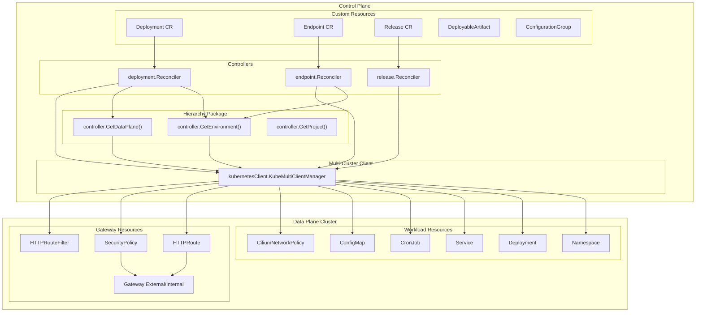
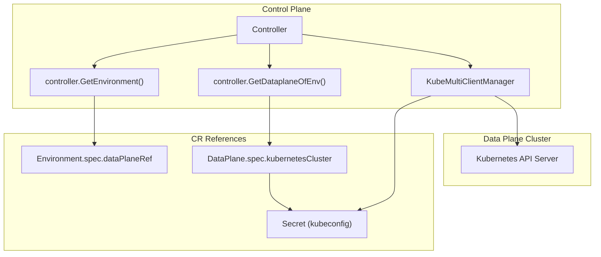
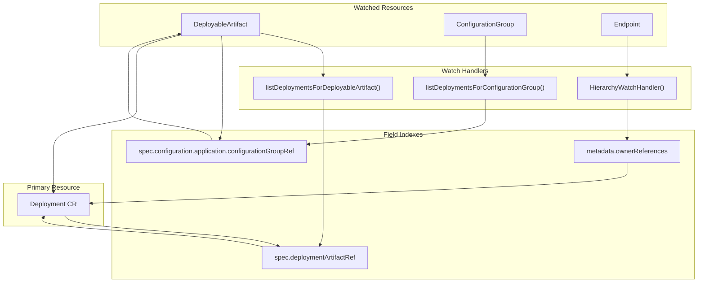
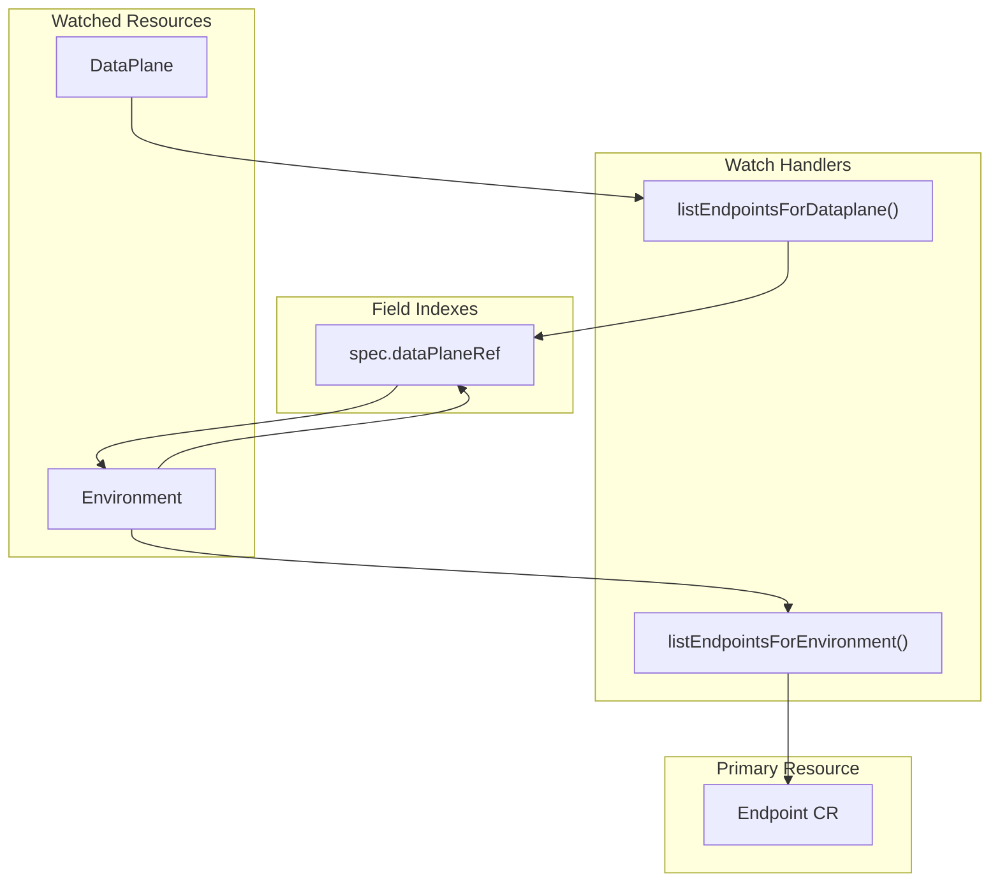

# Deployment System

> **Relevant source files**
> * [internal/controller/annotations.go](https://github.com/openchoreo/openchoreo/blob/a577e969/internal/controller/annotations.go)
> * [internal/controller/deployment/controller.go](https://github.com/openchoreo/openchoreo/blob/a577e969/internal/controller/deployment/controller.go)
> * [internal/controller/deployment/controller_endpoints.go](https://github.com/openchoreo/openchoreo/blob/a577e969/internal/controller/deployment/controller_endpoints.go)
> * [internal/controller/deployment/controller_endpoints_test.go](https://github.com/openchoreo/openchoreo/blob/a577e969/internal/controller/deployment/controller_endpoints_test.go)
> * [internal/controller/deployment/controller_finalize.go](https://github.com/openchoreo/openchoreo/blob/a577e969/internal/controller/deployment/controller_finalize.go)
> * [internal/controller/deployment/controller_test.go](https://github.com/openchoreo/openchoreo/blob/a577e969/internal/controller/deployment/controller_test.go)
> * [internal/controller/deployment/controller_watch.go](https://github.com/openchoreo/openchoreo/blob/a577e969/internal/controller/deployment/controller_watch.go)
> * [internal/controller/deployment/integrations/kubernetes/ports.go](https://github.com/openchoreo/openchoreo/blob/a577e969/internal/controller/deployment/integrations/kubernetes/ports.go)
> * [internal/controller/endpoint/controller.go](https://github.com/openchoreo/openchoreo/blob/a577e969/internal/controller/endpoint/controller.go)
> * [internal/controller/endpoint/controller_conditions.go](https://github.com/openchoreo/openchoreo/blob/a577e969/internal/controller/endpoint/controller_conditions.go)
> * [internal/controller/endpoint/controller_finalize.go](https://github.com/openchoreo/openchoreo/blob/a577e969/internal/controller/endpoint/controller_finalize.go)
> * [internal/controller/endpoint/controller_test.go](https://github.com/openchoreo/openchoreo/blob/a577e969/internal/controller/endpoint/controller_test.go)
> * [internal/controller/endpoint/controller_watch.go](https://github.com/openchoreo/openchoreo/blob/a577e969/internal/controller/endpoint/controller_watch.go)
> * [internal/controller/endpoint/integrations/kubernetes/http_route.go](https://github.com/openchoreo/openchoreo/blob/a577e969/internal/controller/endpoint/integrations/kubernetes/http_route.go)
> * [internal/controller/endpoint/integrations/kubernetes/http_route_test.go](https://github.com/openchoreo/openchoreo/blob/a577e969/internal/controller/endpoint/integrations/kubernetes/http_route_test.go)
> * [internal/controller/endpoint/integrations/kubernetes/httproute_filters.go](https://github.com/openchoreo/openchoreo/blob/a577e969/internal/controller/endpoint/integrations/kubernetes/httproute_filters.go)
> * [internal/controller/endpoint/integrations/kubernetes/security_policy.go](https://github.com/openchoreo/openchoreo/blob/a577e969/internal/controller/endpoint/integrations/kubernetes/security_policy.go)
> * [internal/controller/endpoint/integrations/kubernetes/visibility/strategy.go](https://github.com/openchoreo/openchoreo/blob/a577e969/internal/controller/endpoint/integrations/kubernetes/visibility/strategy.go)
> * [internal/controller/hierarchy.go](https://github.com/openchoreo/openchoreo/blob/a577e969/internal/controller/hierarchy.go)
> * [internal/controller/release/controller.go](https://github.com/openchoreo/openchoreo/blob/a577e969/internal/controller/release/controller.go)
> * [internal/controller/watch.go](https://github.com/openchoreo/openchoreo/blob/a577e969/internal/controller/watch.go)

The Deployment System orchestrates the deployment and exposure of applications within OpenChoreo. It translates `Deployment` custom resources into Kubernetes workloads in the data plane cluster, manages network routing through `Endpoint` resources, and handles arbitrary resource deployment via the `Release` controller. The system operates across multiple controllers that reconcile desired state with actual cluster state.

This page provides an overview of the deployment architecture. For detailed information about specific components, see:

* [Deployment Controller](/openchoreo/openchoreo/4.1-deployment-controller) - Workload provisioning and lifecycle management
* [Resource Handlers](/openchoreo/openchoreo/4.2-resource-handlers) - External resource reconciliation patterns
* [Endpoint Controller](/openchoreo/openchoreo/4.3-endpoint-controller) - Network visibility and Gateway API integration
* [Release Controller](/openchoreo/openchoreo/4.4-release-controller) - Generic resource deployment with server-side apply
* [Hierarchy and Finalization](/openchoreo/openchoreo/4.5-hierarchy-and-finalization) - Label-based resolution and cleanup patterns

Sources: [internal/controller/deployment/controller.go L1-L262](https://github.com/openchoreo/openchoreo/blob/a577e969/internal/controller/deployment/controller.go#L1-L262)

 [internal/controller/endpoint/controller.go L1-L234](https://github.com/openchoreo/openchoreo/blob/a577e969/internal/controller/endpoint/controller.go#L1-L234)

 [internal/controller/release/controller.go L1-L147](https://github.com/openchoreo/openchoreo/blob/a577e969/internal/controller/release/controller.go#L1-L147)

## Architecture Overview

The Deployment System consists of three primary controllers that work together to provision and expose applications:

**System Architecture Diagram**



The system operates through three specialized controllers:

1. **`deployment.Reconciler`** - Provisions application workloads (Deployments, CronJobs, Services, ConfigMaps) in the data plane
2. **`endpoint.Reconciler`** - Manages network exposure through Gateway API resources (HTTPRoute, SecurityPolicy)
3. **`release.Reconciler`** - Handles arbitrary Kubernetes resource deployment with inventory-based cleanup

All controllers use `kubernetesClient.KubeMultiClientManager` to communicate with remote data plane clusters. They resolve organizational hierarchy using functions from the `controller` package like `GetEnvironment()`, `GetDataPlane()`, and `GetProject()`.

Sources: [internal/controller/deployment/controller.go L27-L177](https://github.com/openchoreo/openchoreo/blob/a577e969/internal/controller/deployment/controller.go#L27-L177)

 [internal/controller/endpoint/controller.go L29-L234](https://github.com/openchoreo/openchoreo/blob/a577e969/internal/controller/endpoint/controller.go#L29-L234)

 [internal/controller/release/controller.go L32-L170](https://github.com/openchoreo/openchoreo/blob/a577e969/internal/controller/release/controller.go#L32-L170)

 [internal/controller/hierarchy.go L1-L408](https://github.com/openchoreo/openchoreo/blob/a577e969/internal/controller/hierarchy.go#L1-L408)

## Deployment Flow

The following sequence shows how a `Deployment` CR is reconciled into running workloads and network endpoints:

**End-to-End Deployment Flow**

```mermaid
sequenceDiagram
  participant User
  participant Deployment CR
  participant deployment.Reconciler
  participant controller.GetEnvironment()
  participant controller.GetDataPlane()
  participant Data Plane Client
  participant endpoint.Reconciler

  User->>Deployment CR: Create/Update Deployment
  Deployment CR->>deployment.Reconciler: Reconcile Event
  deployment.Reconciler->>deployment.Reconciler: ensureFinalizer()
  deployment.Reconciler->>controller.GetEnvironment(): makeDeploymentContext()
  controller.GetEnvironment()-->>deployment.Reconciler: Environment, DataPlane, etc.
  deployment.Reconciler->>Data Plane Client: getDPClient()
  Data Plane Client-->>deployment.Reconciler: client.Client
  deployment.Reconciler->>Data Plane Client: reconcileExternalResources()
  note over Data Plane Client: Create Namespace, Deployment,
  deployment.Reconciler->>deployment.Reconciler: reconcileChoreoEndpoints()
  deployment.Reconciler->>endpoint.Reconciler: Create/Update Endpoint CRs
  endpoint.Reconciler->>Data Plane Client: Reconcile HTTPRoute,
  deployment.Reconciler->>Deployment CR: SecurityPolicy, HTTPRouteFilter
```

Key stages:

1. **Finalization Setup** - `ensureFinalizer()` adds `DataPlaneCleanupFinalizer` for proper cleanup
2. **Context Resolution** - `makeDeploymentContext()` uses hierarchy functions to resolve Environment, Project, Component, etc.
3. **Client Acquisition** - `getDPClient()` obtains a Kubernetes client for the data plane cluster
4. **Workload Provisioning** - `reconcileExternalResources()` creates Namespace, Deployment, Service, ConfigMap, CiliumNetworkPolicy in order
5. **Endpoint Creation** - `reconcileChoreoEndpoints()` generates Endpoint CRs from `DeployableArtifact.spec.configuration.endpointTemplates`
6. **Network Exposure** - Endpoint controller provisions HTTPRoute and SecurityPolicy for Gateway API

Sources: [internal/controller/deployment/controller.go L44-L129](https://github.com/openchoreo/openchoreo/blob/a577e969/internal/controller/deployment/controller.go#L44-L129)

 [internal/controller/deployment/controller.go L196-L261](https://github.com/openchoreo/openchoreo/blob/a577e969/internal/controller/deployment/controller.go#L196-L261)

 [internal/controller/deployment/controller_endpoints.go L24-L75](https://github.com/openchoreo/openchoreo/blob/a577e969/internal/controller/deployment/controller_endpoints.go#L24-L75)

## Controller Responsibilities

### Deployment Controller

The `deployment.Reconciler` provisions application workloads in the data plane cluster. It manages:

| Resource Type | Handler | Purpose |
| --- | --- | --- |
| Namespace | `k8sintegrations.NewNamespaceHandler` | Isolate workloads by project/environment |
| CiliumNetworkPolicy | `k8sintegrations.NewCiliumNetworkPolicyHandler` | Enforce network segmentation |
| ConfigMap | `k8sintegrations.NewConfigMapHandler` | Application configuration |
| SecretProviderClass | `k8sintegrations.NewSecretProviderClassHandler` | Secret injection from external stores |
| CronJob | `k8sintegrations.NewCronJobHandler` | Scheduled task workloads |
| Deployment | `k8sintegrations.NewDeploymentHandler` | Long-running service workloads |
| Service | `k8sintegrations.NewServiceHandler` | Internal service discovery |

The controller also creates `Endpoint` CRs in the control plane based on `endpointTemplates` from the `DeployableArtifact`. See [Deployment Controller](/openchoreo/openchoreo/4.1-deployment-controller) for details.

Sources: [internal/controller/deployment/controller.go L180-L194](https://github.com/openchoreo/openchoreo/blob/a577e969/internal/controller/deployment/controller.go#L180-L194)

 [internal/controller/deployment/controller_endpoints.go L24-L91](https://github.com/openchoreo/openchoreo/blob/a577e969/internal/controller/deployment/controller_endpoints.go#L24-L91)

### Endpoint Controller

The `endpoint.Reconciler` translates `Endpoint` CRs into Gateway API resources for network visibility:

| Visibility Type | Gateway | Resources Created |
| --- | --- | --- |
| Public | `gateway-external` | HTTPRoute, SecurityPolicy, HTTPRouteFilter |
| Organization | `gateway-internal` | HTTPRoute, SecurityPolicy, HTTPRouteFilter |

For Service components, paths are prefixed with `/<project>/<component>`. For WebApplication components, custom hostnames are used. OAuth2 policies generate operation-specific HTTPRoutes with JWT validation. See [Endpoint Controller](/openchoreo/openchoreo/4.3-endpoint-controller) for details.

Sources: [internal/controller/endpoint/controller.go L122-L134](https://github.com/openchoreo/openchoreo/blob/a577e969/internal/controller/endpoint/controller.go#L122-L134)

 [internal/controller/endpoint/integrations/kubernetes/http_route.go L150-L186](https://github.com/openchoreo/openchoreo/blob/a577e969/internal/controller/endpoint/integrations/kubernetes/http_route.go#L150-L186)

 [internal/controller/endpoint/integrations/kubernetes/security_policy.go L146-L232](https://github.com/openchoreo/openchoreo/blob/a577e969/internal/controller/endpoint/integrations/kubernetes/security_policy.go#L146-L232)

### Release Controller

The `release.Reconciler` implements server-side apply for arbitrary Kubernetes resources with inventory-based cleanup:

1. **Apply Phase** - Patches resources using `client.Apply` with field manager `"release-controller"`
2. **Discovery Phase** - Lists live resources by GVK using label selector `openchoreo.dev/release-uid`
3. **Prune Phase** - Deletes stale resources not in desired spec
4. **Status Phase** - Updates inventory in `Release.status.resources`

This pattern supports any Kubernetes resource type (Deployments, Services, CRDs) without hardcoded handlers. See [Release Controller](/openchoreo/openchoreo/4.4-release-controller) for details.

Sources: [internal/controller/release/controller.go L100-L146](https://github.com/openchoreo/openchoreo/blob/a577e969/internal/controller/release/controller.go#L100-L146)

 [internal/controller/release/controller.go L172-L184](https://github.com/openchoreo/openchoreo/blob/a577e969/internal/controller/release/controller.go#L172-L184)

 [internal/controller/release/controller.go L326-L427](https://github.com/openchoreo/openchoreo/blob/a577e969/internal/controller/release/controller.go#L326-L427)

## Multi-Cluster Communication

All deployment controllers use `kubernetesClient.KubeMultiClientManager` to communicate with remote data plane clusters:

**Data Plane Client Resolution**



The resolution flow:

1. Controller calls `controller.GetEnvironment(ctx, client, obj)` using label `openchoreo.dev/environment`
2. Retrieves `Environment.spec.dataPlaneRef` to get DataPlane name
3. Calls `controller.GetDataplaneOfEnv(ctx, client, env)` to fetch DataPlane CR
4. Extracts `DataPlane.spec.kubernetesCluster.secretRef` pointing to kubeconfig Secret
5. Calls `kubernetesClient.GetK8sClient(mgr, namespace, name, kubernetesCluster)` to get cached client
6. Client manager creates/caches `client.Client` for remote cluster

Each controller follows this pattern in its `getDPClient()` method. See [Hierarchy and Finalization](/openchoreo/openchoreo/4.5-hierarchy-and-finalization) for label-based resolution details.

Sources: [internal/controller/deployment/controller.go L196-L214](https://github.com/openchoreo/openchoreo/blob/a577e969/internal/controller/deployment/controller.go#L196-L214)

 [internal/controller/endpoint/controller.go L211-L233](https://github.com/openchoreo/openchoreo/blob/a577e969/internal/controller/endpoint/controller.go#L211-L233)

 [internal/controller/hierarchy.go L214-L235](https://github.com/openchoreo/openchoreo/blob/a577e969/internal/controller/hierarchy.go#L214-L235)

 [internal/controller/hierarchy.go L349-L365](https://github.com/openchoreo/openchoreo/blob/a577e969/internal/controller/hierarchy.go#L349-L365)

## Cross-Resource Watches

Controllers watch related resources to trigger reconciliation when dependencies change:

**Deployment Controller Watches**



**Endpoint Controller Watches**



Field indexes enable efficient lookups:

* `deploymentArtifactRefIndexKey` (`"spec.deploymentArtifactRef"`) - Maps Deployment to DeployableArtifact
* `configurationGroupRefIndexKey` (`"spec.configuration.application.configurationGroupRef"`) - Maps DeployableArtifact to ConfigurationGroup
* `dataPlaneRefIndexKey` (`"spec.dataPlaneRef"`) - Maps Environment to DataPlane

The `HierarchyWatchHandler` pattern provides generic parent-to-child watching using label selectors.

Sources: [internal/controller/deployment/controller_watch.go L19-L188](https://github.com/openchoreo/openchoreo/blob/a577e969/internal/controller/deployment/controller_watch.go#L19-L188)

 [internal/controller/endpoint/controller_watch.go L17-L104](https://github.com/openchoreo/openchoreo/blob/a577e969/internal/controller/endpoint/controller_watch.go#L17-L104)

 [internal/controller/watch.go L13-L38](https://github.com/openchoreo/openchoreo/blob/a577e969/internal/controller/watch.go#L13-L38)

## Conclusion

The OpenChoreo Deployment System provides a robust mechanism for managing application deployments across environments. It uses the Kubernetes operator pattern to ensure that the desired state defined in `Deployment` resources is reflected in the actual state of the cluster. Through specialized resource handlers and endpoint management, it abstracts away the complexity of managing Kubernetes resources while providing powerful deployment capabilities.