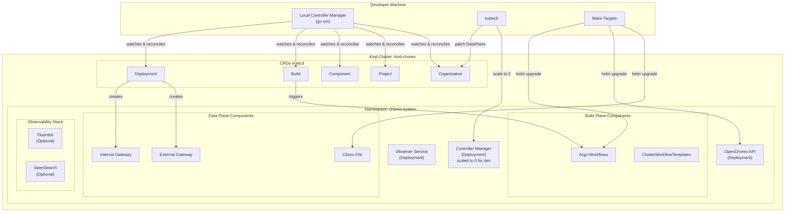
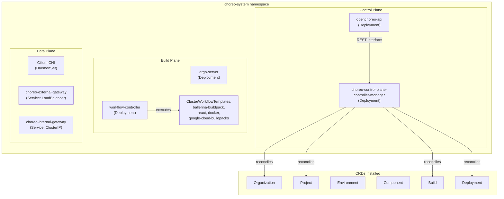
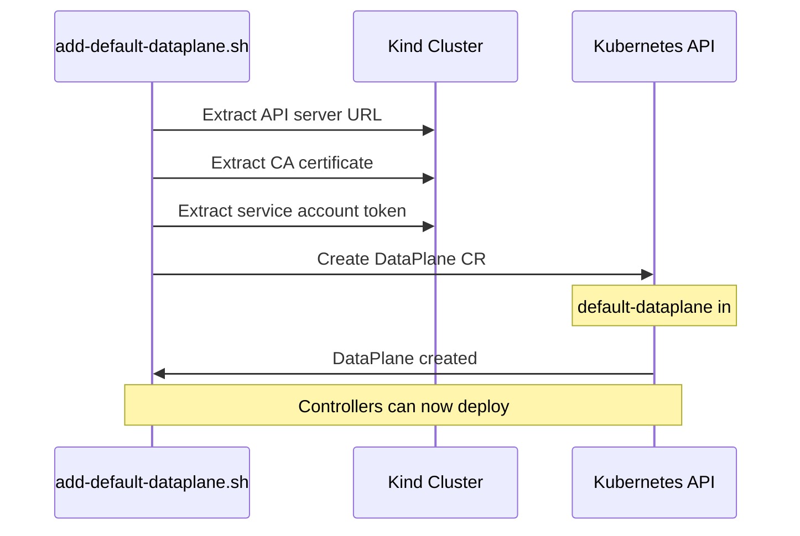
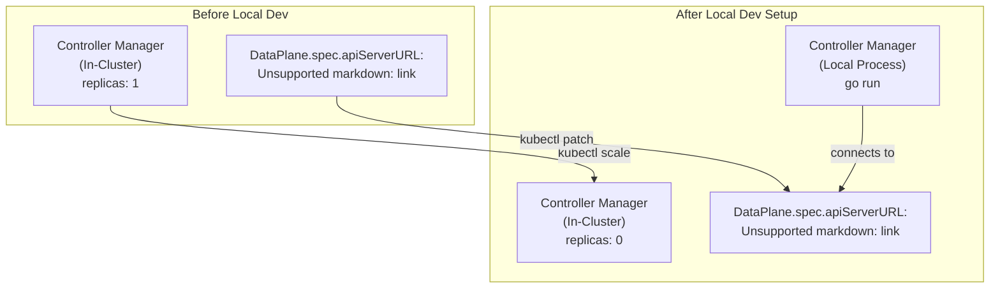
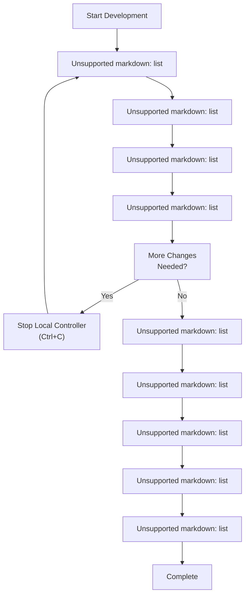

# Development Environment Setup

> **Relevant source files**
> * [.github/CODEOWNERS](https://github.com/openchoreo/openchoreo/blob/a577e969/.github/CODEOWNERS)
> * [.github/ISSUE_TEMPLATE/01-bug-report.yml](https://github.com/openchoreo/openchoreo/blob/a577e969/.github/ISSUE_TEMPLATE/01-bug-report.yml)
> * [.github/ISSUE_TEMPLATE/02-task.yml](https://github.com/openchoreo/openchoreo/blob/a577e969/.github/ISSUE_TEMPLATE/02-task.yml)
> * [.github/ISSUE_TEMPLATE/03-release.md](https://github.com/openchoreo/openchoreo/blob/a577e969/.github/ISSUE_TEMPLATE/03-release.md)
> * [.github/pull_request_template.md](https://github.com/openchoreo/openchoreo/blob/a577e969/.github/pull_request_template.md)
> * [Makefile](https://github.com/openchoreo/openchoreo/blob/a577e969/Makefile)
> * [cmd/choreoctl/Dockerfile](https://github.com/openchoreo/openchoreo/blob/a577e969/cmd/choreoctl/Dockerfile)
> * [cmd/observer/Dockerfile](https://github.com/openchoreo/openchoreo/blob/a577e969/cmd/observer/Dockerfile)
> * [docs/contributors/README.md](https://github.com/openchoreo/openchoreo/blob/a577e969/docs/contributors/README.md)
> * [docs/contributors/contribute.md](https://github.com/openchoreo/openchoreo/blob/a577e969/docs/contributors/contribute.md)
> * [docs/contributors/release.md](https://github.com/openchoreo/openchoreo/blob/a577e969/docs/contributors/release.md)
> * [docs/install-guide-multi-cluster.md](https://github.com/openchoreo/openchoreo/blob/a577e969/docs/install-guide-multi-cluster.md)
> * [docs/observability-logging.md](https://github.com/openchoreo/openchoreo/blob/a577e969/docs/observability-logging.md)
> * [install/helm/openchoreo-identity-provider/templates/post-install-hook.yaml](https://github.com/openchoreo/openchoreo/blob/a577e969/install/helm/openchoreo-identity-provider/templates/post-install-hook.yaml)
> * [make/common.mk](https://github.com/openchoreo/openchoreo/blob/a577e969/make/common.mk)
> * [make/docker.mk](https://github.com/openchoreo/openchoreo/blob/a577e969/make/docker.mk)
> * [make/golang.mk](https://github.com/openchoreo/openchoreo/blob/a577e969/make/golang.mk)
> * [make/kube.mk](https://github.com/openchoreo/openchoreo/blob/a577e969/make/kube.mk)
> * [make/lint.mk](https://github.com/openchoreo/openchoreo/blob/a577e969/make/lint.mk)
> * [make/tools.mk](https://github.com/openchoreo/openchoreo/blob/a577e969/make/tools.mk)

## Purpose and Scope

This page provides instructions for setting up a local development environment for contributing to OpenChoreo. It covers creating a Kind cluster, deploying OpenChoreo components, and configuring the environment for local controller development. This setup uses a **single-cluster mode** where both Control Plane and Data Plane components run in the same Kubernetes cluster for simplified development.

For information about multi-cluster production installations, see [Multi-Cluster Installation](/openchoreo/openchoreo/7.2-multi-cluster-installation). For building binaries and Docker images, see [Building from Source](/openchoreo/openchoreo/9.2-building-from-source). For testing procedures, see [Testing](/openchoreo/openchoreo/9.3-testing).

---

## Prerequisites

The following tools are required for local development:

| Tool | Required Version | Verification Command |
| --- | --- | --- |
| Go | v1.24.0+ | `go version` |
| Docker | 23.0+ | `docker version` |
| Make | 3.81+ | `make --version` |
| Kind | v0.27.0+ | `kind version` |
| Kubectl | v1.30.0+ | `kubectl version --client` |
| Helm | v3.16.0+ | `helm version` |

A verification script is provided in the repository:

```
./check-tools.sh
```

**Sources:** [docs/contributors/contribute.md L4-L16](https://github.com/openchoreo/openchoreo/blob/a577e969/docs/contributors/contribute.md#L4-L16)

---

## Development Environment Architecture

The development environment runs all OpenChoreo components in a single Kind cluster, simplifying the development workflow. The following diagram illustrates the architecture:



**Development Environment Components in Single-Cluster Mode**

In this setup, the in-cluster `Controller Manager` deployment is scaled to 0 replicas, and the developer runs the controller locally using `go run` for rapid iteration. All Custom Resources are stored in the same cluster's etcd, and the local controller communicates with the Kubernetes API server.

**Sources:** [make/kube.mk L36-L44](https://github.com/openchoreo/openchoreo/blob/a577e969/make/kube.mk#L36-L44)

 [docs/contributors/contribute.md L28-L66](https://github.com/openchoreo/openchoreo/blob/a577e969/docs/contributors/contribute.md#L28-L66)

---

## Creating a Local Kind Cluster

OpenChoreo provides a Kind configuration that sets up a cluster with appropriate network settings and port mappings.

### Create the Cluster

```sql
kind create cluster --config=install/kind/kind-config.yaml
```

This creates a Kind cluster named `kind-choreo` with the configuration from [install/kind/kind-config.yaml](https://github.com/openchoreo/openchoreo/blob/a577e969/install/kind/kind-config.yaml)

### Verify the Cluster

```markdown
# Check the current context
kubectl config current-context
# Should output: kind-choreo

# Verify cluster is running
kubectl cluster-info
```

**Sources:** [docs/contributors/contribute.md L28-L42](https://github.com/openchoreo/openchoreo/blob/a577e969/docs/contributors/contribute.md#L28-L42)

---

## Deploying OpenChoreo Components

The `dev-deploy` Make target installs all required OpenChoreo components into the Kind cluster using Helm charts.

### Deploy All Components

```
make dev-deploy
```

This command performs the following operations:

1. Packages Helm charts using `make helm-package`
2. Installs Cilium CNI in `choreo-system` namespace
3. Installs `choreo-control-plane` Helm chart
4. Installs `choreo-dataplane` Helm chart with `certmanager.enabled=false`

The deployment typically takes 5-15 minutes depending on network bandwidth.

### What Gets Deployed

The following diagram shows the components installed by `dev-deploy`:



**Components Installed by dev-deploy Target**

**Sources:** [make/kube.mk L36-L44](https://github.com/openchoreo/openchoreo/blob/a577e969/make/kube.mk#L36-L44)

 [docs/contributors/contribute.md L43-L58](https://github.com/openchoreo/openchoreo/blob/a577e969/docs/contributors/contribute.md#L43-L58)

### Verify the Deployment

Use the provided status check script:

```
./install/check-status.sh
```

This script verifies that all pods in the `choreo-system` namespace are running and healthy.

**Sources:** [docs/contributors/contribute.md L54-L58](https://github.com/openchoreo/openchoreo/blob/a577e969/docs/contributors/contribute.md#L54-L58)

---

## Adding Default DataPlane

OpenChoreo requires a `DataPlane` Custom Resource that references the Kubernetes cluster where applications will be deployed. In single-cluster development mode, the DataPlane points to the same cluster.

### Create Default DataPlane

```
bash ./install/add-default-dataplane.sh
```

This script:

1. Extracts the Kubernetes API server URL and credentials from the Kind cluster
2. Creates a `DataPlane` CR named `default-dataplane` in the `default-org` namespace
3. Configures the DataPlane to point to the Kind cluster

### DataPlane Configuration Flow



**Default DataPlane Creation Process**

**Sources:** [docs/contributors/contribute.md L60-L66](https://github.com/openchoreo/openchoreo/blob/a577e969/docs/contributors/contribute.md#L60-L66)

 [docs/install-guide-multi-cluster.md L125-L142](https://github.com/openchoreo/openchoreo/blob/a577e969/docs/install-guide-multi-cluster.md#L125-L142)

---

## Running Controller Manager Locally

For rapid development iteration, run the controller manager locally instead of in-cluster. This allows for quick code changes without rebuilding Docker images.

### Prepare for Local Development

**Step 1: Scale Down In-Cluster Controller**

```
kubectl -n choreo-system scale deployment choreo-control-plane-controller-manager --replicas=0
```

This stops the in-cluster controller to prevent conflicts with the local instance.

**Step 2: Reconfigure DataPlane for Local Access**

The DataPlane CR must be updated to use the Kind cluster's API server URL accessible from the host machine:

```
kubectl get dataplane default-dataplane -n default-org -o json | \
  jq --arg url "$(kubectl config view --raw -o jsonpath="{.clusters[?(@.name=='kind-choreo')].cluster.server}")" \
  '.spec.kubernetesCluster.credentials.apiServerURL = $url' | \
  kubectl apply -f -
```

This command:

1. Gets the current `default-dataplane` CR
2. Extracts the API server URL from the kubeconfig (usually `https://127.0.0.1:<port>`)
3. Updates the `spec.kubernetesCluster.credentials.apiServerURL` field
4. Applies the updated CR

### Local Development Configuration Flow



**Local Development Environment Configuration Changes**

**Sources:** [docs/contributors/contribute.md L68-L82](https://github.com/openchoreo/openchoreo/blob/a577e969/docs/contributors/contribute.md#L68-L82)

### Run the Controller Locally

```
make go.run.manager
```

Or with webhooks disabled for simpler local development:

```
make go.run.manager ENABLE_WEBHOOKS=false
```

This executes the `manager` binary directly from source using `go run`. The controller connects to the Kind cluster using the kubeconfig at `~/.kube/config`.

The local controller will:

* Watch for changes to Custom Resources
* Execute reconciliation loops
* Log output to the terminal for immediate debugging
* Support live code reloading (restart the process after code changes)

**Sources:** [make/golang.mk L128-L136](https://github.com/openchoreo/openchoreo/blob/a577e969/make/golang.mk#L128-L136)

 [docs/contributors/contribute.md L99-L107](https://github.com/openchoreo/openchoreo/blob/a577e969/docs/contributors/contribute.md#L99-L107)

---

## Building and Running Binaries

OpenChoreo provides Make targets for building all Go binaries used in the platform.

### Available Binaries

The following binaries are defined in [make/golang.mk L14-L19](https://github.com/openchoreo/openchoreo/blob/a577e969/make/golang.mk#L14-L19)

:

| Binary Name | Source Path | Purpose |
| --- | --- | --- |
| `manager` | [cmd/main.go](https://github.com/openchoreo/openchoreo/blob/a577e969/cmd/main.go) | Controller manager (reconciliation loops) |
| `choreoctl` | [cmd/choreoctl/main.go](https://github.com/openchoreo/openchoreo/blob/a577e969/cmd/choreoctl/main.go) | CLI tool for interacting with OpenChoreo |
| `openchoreo-api` | [cmd/openchoreo-api/main.go](https://github.com/openchoreo/openchoreo/blob/a577e969/cmd/openchoreo-api/main.go) | HTTP REST API server |
| `observer` | [cmd/observer/main.go](https://github.com/openchoreo/openchoreo/blob/a577e969/cmd/observer/main.go) | Observability service for logs |

### Build All Binaries

```
make go.build
```

This builds all binaries for the current platform and places them in:

```
bin/dist/<os>/<arch>/<binary-name>
```

For example, on an M1 Mac:

```
bin/dist/darwin/arm64/manager
bin/dist/darwin/arm64/choreoctl
bin/dist/darwin/arm64/openchoreo-api
bin/dist/darwin/arm64/observer
```

### Build a Specific Binary

```
make go.build.manager
make go.build.choreoctl
make go.build.openchoreo-api
```

### Run Binaries Directly

For rapid iteration without building, use `go run`:

```markdown
# Run choreoctl with arguments
make go.run.choreoctl GO_RUN_ARGS="version"

# Run the manager
make go.run.manager

# Run the API server
make go.run.openchoreo-api
```

### Binary Build Configuration

The build process injects version information at compile time using linker flags defined in [make/golang.mk L25-L32](https://github.com/openchoreo/openchoreo/blob/a577e969/make/golang.mk#L25-L32)

:

* `github.com/openchoreo/openchoreo/internal/version.buildTime`: Build timestamp
* `github.com/openchoreo/openchoreo/internal/version.gitRevision`: Git commit SHA
* `github.com/openchoreo/openchoreo/internal/version.version`: Version from `VERSION` file
* `github.com/openchoreo/openchoreo/internal/version.componentName`: Binary name

**Sources:** [make/golang.mk L1-L150](https://github.com/openchoreo/openchoreo/blob/a577e969/make/golang.mk#L1-L150)

 [docs/contributors/contribute.md L83-L107](https://github.com/openchoreo/openchoreo/blob/a577e969/docs/contributors/contribute.md#L83-L107)

---

## Incremental Development Workflow

The following workflow optimizes for rapid iteration during development:



**Recommended Development Workflow**

### Key Workflow Commands

```markdown
# 1. Start local controller
make go.run.manager

# 2. In another terminal: apply test resources
kubectl apply -f test-resources.yaml

# 3. Make code changes, stop controller (Ctrl+C), restart
# (Repeat steps 1-3 as needed)

# 4. Before committing: check code quality
make lint-fix
make test
make code.gen-check

# 5. Build and test Docker image
make docker.build.controller
```

**Sources:** [docs/contributors/contribute.md L95-L151](https://github.com/openchoreo/openchoreo/blob/a577e969/docs/contributors/contribute.md#L95-L151)

 [make/lint.mk L70-L85](https://github.com/openchoreo/openchoreo/blob/a577e969/make/lint.mk#L70-L85)

---

## Code Generation and Validation

OpenChoreo uses code generation for Kubernetes Custom Resources and other boilerplate. Always regenerate code after API changes.

### Generate Required Code

```
make code.gen
```

This target executes:

1. `make manifests`: Generates CRD YAML, RBAC roles, webhooks
2. `make generate`: Generates DeepCopy methods for API types
3. `make go.mod.tidy`: Cleans up Go module dependencies
4. `make helm-generate`: Regenerates Helm chart templates

### Verify Code Generation

Before submitting a pull request, verify that all generated code is up-to-date:

```
make code.gen-check
```

This target fails if there are uncommitted changes after running code generation, indicating that generated files are out of sync.

**Sources:** [make/lint.mk L76-L85](https://github.com/openchoreo/openchoreo/blob/a577e969/make/lint.mk#L76-L85)

 [make/kube.mk L7-L13](https://github.com/openchoreo/openchoreo/blob/a577e969/make/kube.mk#L7-L13)

---

## Testing Locally

Run the test suite to verify changes:

```markdown
# Run all unit tests
make test

# Run linters
make lint

# Fix common lint issues
make lint-fix
```

The `test` target:

1. Generates manifests and code
2. Runs `go fmt` and `go vet`
3. Downloads Kubebuilder test assets
4. Executes all tests with coverage reporting

For end-to-end tests, see [Testing](/openchoreo/openchoreo/9.3-testing).

**Sources:** [make/golang.mk L164-L169](https://github.com/openchoreo/openchoreo/blob/a577e969/make/golang.mk#L164-L169)

 [docs/contributors/contribute.md L109-L151](https://github.com/openchoreo/openchoreo/blob/a577e969/docs/contributors/contribute.md#L109-L151)

---

## Common Development Tasks

### Undeploy Development Environment

To clean up the development deployment:

```
make dev-undeploy
```

This uninstalls all Helm releases from the `choreo-system` namespace.

### Delete Kind Cluster

```sql
kind delete cluster --name choreo
```

### Rebuild After API Changes

When modifying CRD definitions in [api/v1alpha1/](https://github.com/openchoreo/openchoreo/blob/a577e969/api/v1alpha1/)

:

```markdown
# 1. Regenerate all code and manifests
make code.gen

# 2. Reinstall CRDs
make install

# 3. Restart local controller
make go.run.manager
```

### View Controller Logs

When running the controller locally, logs appear in the terminal. To view in-cluster controller logs:

```markdown
# Scale up the in-cluster controller
kubectl -n choreo-system scale deployment choreo-control-plane-controller-manager --replicas=1

# View logs
kubectl -n choreo-system logs -f deployment/choreo-control-plane-controller-manager
```

**Sources:** [make/kube.mk L46-L50](https://github.com/openchoreo/openchoreo/blob/a577e969/make/kube.mk#L46-L50)

 [docs/contributors/contribute.md L68-L107](https://github.com/openchoreo/openchoreo/blob/a577e969/docs/contributors/contribute.md#L68-L107)

---

## Next Steps

After setting up your development environment:

* **Try the Samples**: Deploy sample applications from [samples/](https://github.com/openchoreo/openchoreo/blob/a577e969/samples/)  to understand the platform
* **Read Architecture Docs**: See [Architecture](/openchoreo/openchoreo/2-architecture) for system design details
* **Understand Controllers**: Read [Controller Manager](/openchoreo/openchoreo/2.4-controller-manager) and individual controller docs
* **Submit Changes**: Follow [GitHub Workflow](https://github.com/openchoreo/openchoreo/blob/a577e969/GitHub Workflow)  for contributing
* **Run E2E Tests**: See [Testing](/openchoreo/openchoreo/9.3-testing) for comprehensive testing

**Sources:** [docs/contributors/contribute.md L149-L156](https://github.com/openchoreo/openchoreo/blob/a577e969/docs/contributors/contribute.md#L149-L156)

 [docs/contributors/README.md L1-L18](https://github.com/openchoreo/openchoreo/blob/a577e969/docs/contributors/README.md#L1-L18)