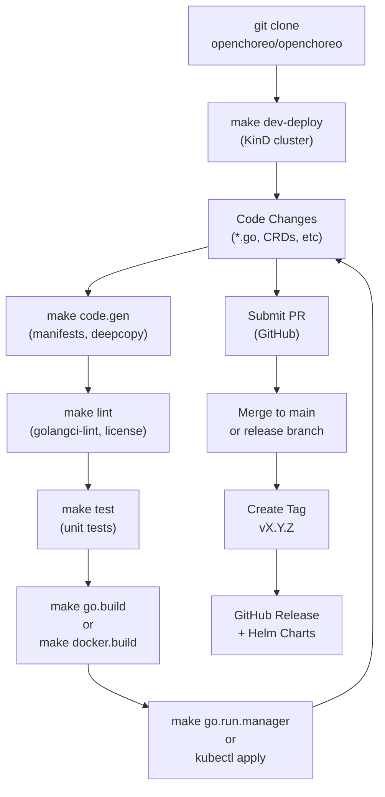
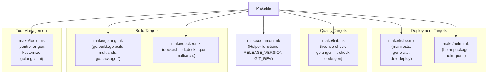
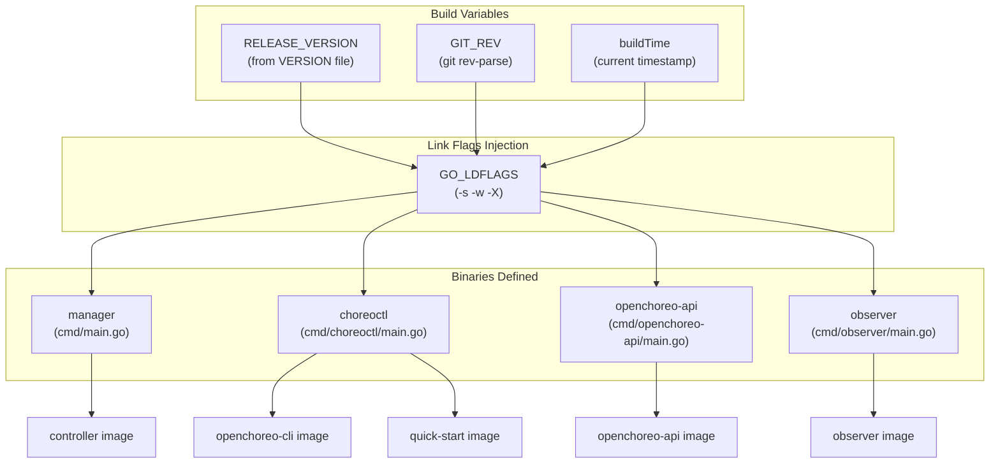
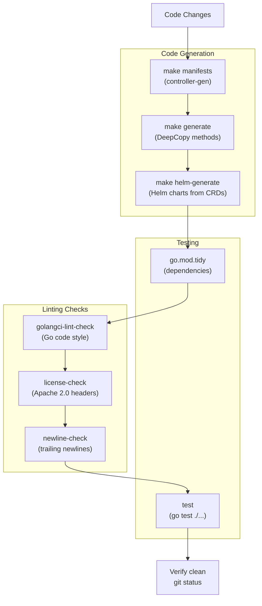
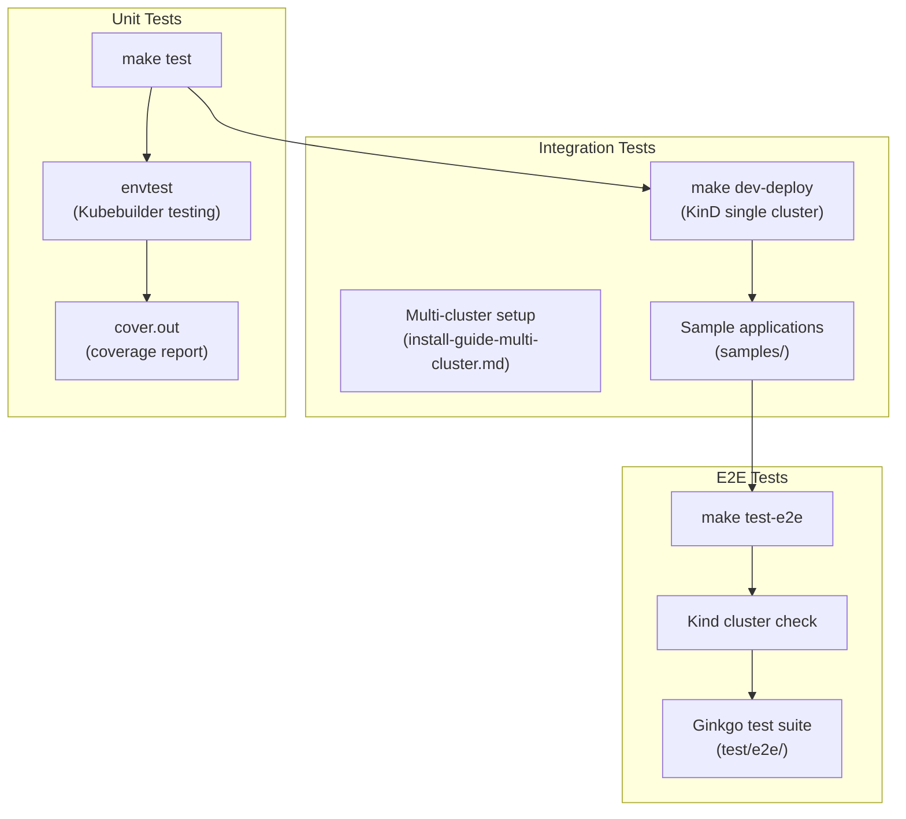
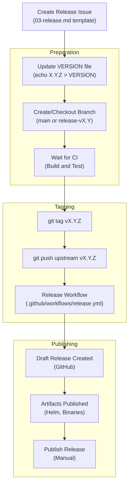
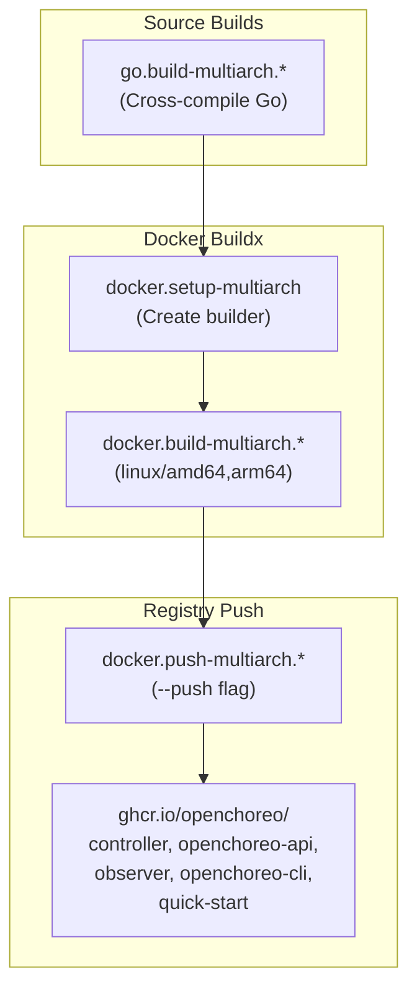

# Development and Contribution

> **Relevant source files**
> * [.github/CODEOWNERS](https://github.com/openchoreo/openchoreo/blob/a577e969/.github/CODEOWNERS)
> * [.github/ISSUE_TEMPLATE/01-bug-report.yml](https://github.com/openchoreo/openchoreo/blob/a577e969/.github/ISSUE_TEMPLATE/01-bug-report.yml)
> * [.github/ISSUE_TEMPLATE/02-task.yml](https://github.com/openchoreo/openchoreo/blob/a577e969/.github/ISSUE_TEMPLATE/02-task.yml)
> * [.github/ISSUE_TEMPLATE/03-release.md](https://github.com/openchoreo/openchoreo/blob/a577e969/.github/ISSUE_TEMPLATE/03-release.md)
> * [.github/pull_request_template.md](https://github.com/openchoreo/openchoreo/blob/a577e969/.github/pull_request_template.md)
> * [Makefile](https://github.com/openchoreo/openchoreo/blob/a577e969/Makefile)
> * [cmd/choreoctl/Dockerfile](https://github.com/openchoreo/openchoreo/blob/a577e969/cmd/choreoctl/Dockerfile)
> * [cmd/observer/Dockerfile](https://github.com/openchoreo/openchoreo/blob/a577e969/cmd/observer/Dockerfile)
> * [docs/contributors/README.md](https://github.com/openchoreo/openchoreo/blob/a577e969/docs/contributors/README.md)
> * [docs/contributors/contribute.md](https://github.com/openchoreo/openchoreo/blob/a577e969/docs/contributors/contribute.md)
> * [docs/contributors/release.md](https://github.com/openchoreo/openchoreo/blob/a577e969/docs/contributors/release.md)
> * [docs/install-guide-multi-cluster.md](https://github.com/openchoreo/openchoreo/blob/a577e969/docs/install-guide-multi-cluster.md)
> * [docs/observability-logging.md](https://github.com/openchoreo/openchoreo/blob/a577e969/docs/observability-logging.md)
> * [install/helm/openchoreo-identity-provider/templates/post-install-hook.yaml](https://github.com/openchoreo/openchoreo/blob/a577e969/install/helm/openchoreo-identity-provider/templates/post-install-hook.yaml)
> * [make/common.mk](https://github.com/openchoreo/openchoreo/blob/a577e969/make/common.mk)
> * [make/docker.mk](https://github.com/openchoreo/openchoreo/blob/a577e969/make/docker.mk)
> * [make/golang.mk](https://github.com/openchoreo/openchoreo/blob/a577e969/make/golang.mk)
> * [make/kube.mk](https://github.com/openchoreo/openchoreo/blob/a577e969/make/kube.mk)
> * [make/lint.mk](https://github.com/openchoreo/openchoreo/blob/a577e969/make/lint.mk)
> * [make/tools.mk](https://github.com/openchoreo/openchoreo/blob/a577e969/make/tools.mk)

This page provides an overview of the development and contribution workflow for OpenChoreo, including the build system architecture, testing strategy, code quality requirements, and release process. It is designed to orient new contributors to the project structure and development practices.

For specific setup instructions, see [Development Environment Setup](/openchoreo/openchoreo/9.1-development-environment-setup). For detailed build commands, see [Building from Source](/openchoreo/openchoreo/9.2-building-from-source). For testing procedures, see [Testing](/openchoreo/openchoreo/9.3-testing). For release procedures, see [Release Process](/openchoreo/openchoreo/9.4-release-process). For Helm chart development, see [Helm Charts and Configuration](/openchoreo/openchoreo/9.5-helm-charts-and-configuration).

## Development Workflow Overview

OpenChoreo is built using the [Kubebuilder](https://book.kubebuilder.io/) framework and uses GNU Make as the build automation tool. The project produces multiple artifacts including Go binaries, Docker images, and Helm charts for deployment across Control Plane, Data Plane, and Build Plane clusters.

### Development Workflow Diagram

**Sources:** [docs/contributors/contribute.md L1-L156](https://github.com/openchoreo/openchoreo/blob/a577e969/docs/contributors/contribute.md#L1-L156)

 [.github/pull_request_template.md L1-L16](https://github.com/openchoreo/openchoreo/blob/a577e969/.github/pull_request_template.md#L1-L16)

 [.github/ISSUE_TEMPLATE/03-release.md L1-L117](https://github.com/openchoreo/openchoreo/blob/a577e969/.github/ISSUE_TEMPLATE/03-release.md#L1-L117)

### Contribution Process

The contribution workflow follows standard GitHub practices:

1. **Fork and clone** the repository
2. **Set up development environment** with KinD cluster and required tools
3. **Make changes** to code, CRDs, or configuration
4. **Run code generation** to update manifests and generated code
5. **Run linting and tests** to ensure code quality
6. **Build and test locally** using make targets or local controller execution
7. **Submit pull request** with clear description and checklist completion

**Sources:** [docs/contributors/contribute.md L1-L156](https://github.com/openchoreo/openchoreo/blob/a577e969/docs/contributors/contribute.md#L1-L156)

 [.github/pull_request_template.md L1-L16](https://github.com/openchoreo/openchoreo/blob/a577e969/.github/pull_request_template.md#L1-L16)

## Build System Architecture

The build system is organized into modular Makefile components under the `make/` directory. The root [Makefile L1-L16](https://github.com/openchoreo/openchoreo/blob/a577e969/Makefile#L1-L16)

 includes all sub-makefiles, each responsible for a specific domain.

### Makefile Organization

**Sources:** [Makefile L1-L16](https://github.com/openchoreo/openchoreo/blob/a577e969/Makefile#L1-L16)

 [make/common.mk L1-L46](https://github.com/openchoreo/openchoreo/blob/a577e969/make/common.mk#L1-L46)

 [make/tools.mk L1-L73](https://github.com/openchoreo/openchoreo/blob/a577e969/make/tools.mk#L1-L73)

 [make/golang.mk L1-L178](https://github.com/openchoreo/openchoreo/blob/a577e969/make/golang.mk#L1-L178)

 [make/lint.mk L1-L86](https://github.com/openchoreo/openchoreo/blob/a577e969/make/lint.mk#L1-L86)

 [make/docker.mk L1-L133](https://github.com/openchoreo/openchoreo/blob/a577e969/make/docker.mk#L1-L133)

 [make/kube.mk L1-L51](https://github.com/openchoreo/openchoreo/blob/a577e969/make/kube.mk#L1-L51)

### Build Artifacts and Targets

OpenChoreo produces multiple types of artifacts for different deployment scenarios:

| Artifact Type | Make Target | Output Location | Purpose |
| --- | --- | --- | --- |
| Go Binaries (single arch) | `go.build.manager``go.build.choreoctl``go.build.openchoreo-api``go.build.observer` | `bin/dist/<os>/<arch>/` | Local development and testing |
| Go Binaries (multi-arch) | `go.build-multiarch.manager``go.build-multiarch.choreoctl` | `bin/dist/<os>/<arch>/` | Cross-platform releases |
| Docker Images (single arch) | `docker.build.controller``docker.build.openchoreo-api``docker.build.quick-start` | Local Docker registry | Local testing in KinD |
| Docker Images (multi-arch) | `docker.build-multiarch.controller``docker.push-multiarch.*` | `ghcr.io/openchoreo/*` | Production releases |
| Helm Charts | `helm-package` | `bin/helm/` | Kubernetes deployments |
| Packaged Binaries | `go.package.choreoctl` | `bin/dist/<os>/<arch>/*.tar.gz` | Distribution archives |

**Sources:** [make/golang.mk L14-L19](https://github.com/openchoreo/openchoreo/blob/a577e969/make/golang.mk#L14-L19)

 [make/docker.mk L28-L33](https://github.com/openchoreo/openchoreo/blob/a577e969/make/docker.mk#L28-L33)

### Binary Build Configuration

The Go build system uses the following configuration:

**Sources:** [make/golang.mk L14-L51](https://github.com/openchoreo/openchoreo/blob/a577e969/make/golang.mk#L14-L51)

 [make/common.mk L10-L14](https://github.com/openchoreo/openchoreo/blob/a577e969/make/common.mk#L10-L14)

 [make/docker.mk L28-L33](https://github.com/openchoreo/openchoreo/blob/a577e969/make/docker.mk#L28-L33)

## Code Quality and Generation

OpenChoreo enforces strict code quality standards through automated linting and code generation verification.

### Code Quality Pipeline

**Sources:** [make/lint.mk L1-L86](https://github.com/openchoreo/openchoreo/blob/a577e969/make/lint.mk#L1-L86)

 [make/golang.mk L156-L178](https://github.com/openchoreo/openchoreo/blob/a577e969/make/golang.mk#L156-L178)

 [make/kube.mk L7-L13](https://github.com/openchoreo/openchoreo/blob/a577e969/make/kube.mk#L7-L13)

### Code Generation Targets

The code generation process produces several artifacts:

| Target | Tool | Output | Purpose |
| --- | --- | --- | --- |
| `manifests` | controller-gen | `config/crd/bases/*.yaml` | CRD manifests from Go types |
| `generate` | controller-gen | `api/v1alpha1/zz_generated.deepcopy.go` | DeepCopy methods for CRDs |
| `helm-generate` | Custom tool | `install/helm/*/templates/*.yaml` | Helm chart templates from CRDs |
| `go.mod.tidy` | go mod tidy | `go.mod`, `go.sum` | Clean dependency tree |

**Sources:** [make/kube.mk L7-L13](https://github.com/openchoreo/openchoreo/blob/a577e969/make/kube.mk#L7-L13)

 [make/lint.mk L76-L86](https://github.com/openchoreo/openchoreo/blob/a577e969/make/lint.mk#L76-L86)

### Linting Rules

OpenChoreo enforces three types of linting:

1. **golangci-lint**: Comprehensive Go code linting covering style, errors, and best practices [make/lint.mk L62-L68](https://github.com/openchoreo/openchoreo/blob/a577e969/make/lint.mk#L62-L68)
2. **License headers**: All Go files must have Apache 2.0 license headers with "The OpenChoreo Authors" [make/lint.mk L16-L22](https://github.com/openchoreo/openchoreo/blob/a577e969/make/lint.mk#L16-L22)
3. **Trailing newlines**: All text files must end with a newline character [make/lint.mk L30-L60](https://github.com/openchoreo/openchoreo/blob/a577e969/make/lint.mk#L30-L60)

The `make lint` target runs all checks, while `make lint-fix` automatically fixes issues where possible.

**Sources:** [make/lint.mk L1-L86](https://github.com/openchoreo/openchoreo/blob/a577e969/make/lint.mk#L1-L86)

## Testing Strategy

OpenChoreo uses a multi-layered testing approach:

### Test Types and Execution

**Sources:** [make/golang.mk L164-L169](https://github.com/openchoreo/openchoreo/blob/a577e969/make/golang.mk#L164-L169)

 [make/kube.mk L24-L34](https://github.com/openchoreo/openchoreo/blob/a577e969/make/kube.mk#L24-L34)

 [docs/contributors/contribute.md L109-L116](https://github.com/openchoreo/openchoreo/blob/a577e969/docs/contributors/contribute.md#L109-L116)

### Test Execution Targets

| Make Target | Environment | ENVTEST Version | Purpose |
| --- | --- | --- | --- |
| `make test` | Local | v1.32.0 | Unit tests with mocked Kubernetes API |
| `make test-e2e` | KinD cluster | N/A | End-to-end tests with real cluster |
| `make dev-deploy` | KinD cluster | N/A | Deploy for manual integration testing |

**Sources:** [make/golang.mk L164-L169](https://github.com/openchoreo/openchoreo/blob/a577e969/make/golang.mk#L164-L169)

 [make/kube.mk L24-L34](https://github.com/openchoreo/openchoreo/blob/a577e969/make/kube.mk#L24-L34)

 [make/kube.mk L36-L44](https://github.com/openchoreo/openchoreo/blob/a577e969/make/kube.mk#L36-L44)

## Development Tools

OpenChoreo uses several specialized tools for development, automatically downloaded to `bin/tools/` when needed:

| Tool | Version | Purpose | Make Target |
| --- | --- | --- | --- |
| controller-gen | v0.16.4 | Generate CRDs and RBAC manifests | `controller-gen` |
| kustomize | v5.5.0 | Kubernetes manifest customization | `kustomize` |
| golangci-lint | v1.64.8 | Go code linting | `golangci-lint` |
| envtest | release-0.19 | Kubernetes API testing | `envtest` |
| helmify | v0.4.17 | Generate Helm charts | `helmify` |
| yq | v4.45.1 | YAML processing | `yq` |

The `go_install_tool` function in [make/tools.mk L7-L17](https://github.com/openchoreo/openchoreo/blob/a577e969/make/tools.mk#L7-L17)

 manages tool versioning by appending version suffixes and creating symlinks.

**Sources:** [make/tools.mk L1-L73](https://github.com/openchoreo/openchoreo/blob/a577e969/make/tools.mk#L1-L73)

## Release Process Overview

OpenChoreo follows a structured release process tracked through GitHub issues using the [release template](https://github.com/openchoreo/openchoreo/blob/a577e969/release template)

(). The process supports both major/minor releases (e.g., v1.4.0) and patch releases (e.g., v1.4.1).

### Release Workflow

**Sources:** [.github/ISSUE_TEMPLATE/03-release.md L1-L117](https://github.com/openchoreo/openchoreo/blob/a577e969/.github/ISSUE_TEMPLATE/03-release.md#L1-L117)

 [docs/contributors/release.md L1-L10](https://github.com/openchoreo/openchoreo/blob/a577e969/docs/contributors/release.md#L1-L10)

 [make/common.mk L10-L14](https://github.com/openchoreo/openchoreo/blob/a577e969/make/common.mk#L10-L14)

### Version Management

The release version is managed through the `VERSION` file at the project root:

* The `RELEASE_VERSION` variable is read from this file [make/common.mk L11](https://github.com/openchoreo/openchoreo/blob/a577e969/make/common.mk#L11-L11)
* This version is injected into binaries via ldflags [make/golang.mk L28-L32](https://github.com/openchoreo/openchoreo/blob/a577e969/make/golang.mk#L28-L32)
* Docker images are tagged with this version [make/docker.mk L11](https://github.com/openchoreo/openchoreo/blob/a577e969/make/docker.mk#L11-L11)
* Helm charts use this version [make/helm.mk](https://github.com/openchoreo/openchoreo/blob/a577e969/make/helm.mk)  (referenced but not provided)

**Sources:** [make/common.mk L10-L14](https://github.com/openchoreo/openchoreo/blob/a577e969/make/common.mk#L10-L14)

 [make/golang.mk L25-L32](https://github.com/openchoreo/openchoreo/blob/a577e969/make/golang.mk#L25-L32)

 [make/docker.mk L10-L11](https://github.com/openchoreo/openchoreo/blob/a577e969/make/docker.mk#L10-L11)

## Docker Image Build Process

OpenChoreo produces five Docker images for different components:

### Multi-Architecture Build Pipeline

**Sources:** [make/docker.mk L1-L133](https://github.com/openchoreo/openchoreo/blob/a577e969/make/docker.mk#L1-L133)

### Image Definitions

Each image is defined with dockerfile path and context in `DOCKER_BUILD_IMAGES` [make/docker.mk L28-L33](https://github.com/openchoreo/openchoreo/blob/a577e969/make/docker.mk#L28-L33)

:

| Image | Dockerfile | Context | Base Image |
| --- | --- | --- | --- |
| controller | `Dockerfile` | PROJECT_DIR | distroless/static:nonroot |
| openchoreo-api | `cmd/openchoreo-api/Dockerfile` | PROJECT_DIR | distroless/static:nonroot |
| observer | `cmd/observer/Dockerfile` | PROJECT_DIR | distroless/static:nonroot |
| openchoreo-cli | `cmd/choreoctl/Dockerfile` | PROJECT_DIR | distroless/static:nonroot |
| quick-start | `install/quick-start/Dockerfile` | PROJECT_DIR | (custom) |

**Sources:** [make/docker.mk L25-L33](https://github.com/openchoreo/openchoreo/blob/a577e969/make/docker.mk#L25-L33)

 [cmd/choreoctl/Dockerfile L1-L22](https://github.com/openchoreo/openchoreo/blob/a577e969/cmd/choreoctl/Dockerfile#L1-L22)

 [cmd/observer/Dockerfile L1-L26](https://github.com/openchoreo/openchoreo/blob/a577e969/cmd/observer/Dockerfile#L1-L26)

## Prerequisites and Environment

Contributors need the following tools installed:

| Tool | Minimum Version | Purpose |
| --- | --- | --- |
| Go | v1.24.0+ | Build Go binaries |
| Docker | 23.0+ | Build and run containers |
| Make | 3.81+ | Execute build targets |
| Kubernetes | v1.30.0+ | Deploy and test |
| kubectl | v1.30.0+ | Interact with cluster |
| Helm | v3.16.0+ | Deploy Helm charts |
| Kind | v0.27.0+ | Local cluster for development |

A verification script is available at `check-tools.sh` to validate tool versions [docs/contributors/contribute.md L13-L16](https://github.com/openchoreo/openchoreo/blob/a577e969/docs/contributors/contribute.md#L13-L16)

**Sources:** [docs/contributors/contribute.md L3-L16](https://github.com/openchoreo/openchoreo/blob/a577e969/docs/contributors/contribute.md#L3-L16)

 [docs/install-guide-multi-cluster.md L20-L39](https://github.com/openchoreo/openchoreo/blob/a577e969/docs/install-guide-multi-cluster.md#L20-L39)

## Contribution Guidelines

### Pull Request Requirements

All pull requests must:

1. Include clear **purpose** and **approach** descriptions [.github/pull_request_template.md L1-L16](https://github.com/openchoreo/openchoreo/blob/a577e969/.github/pull_request_template.md#L1-L16)
2. Add or update **tests** for changed functionality
3. Update **samples** if API or behavior changes
4. Pass all **CI checks** (build, test, lint)
5. Include appropriate **documentation** updates

### Issue Types

OpenChoreo uses three issue templates:

1. **Bug Report** [.github/ISSUE_TEMPLATE/01-bug-report.yml L1-L34](https://github.com/openchoreo/openchoreo/blob/a577e969/.github/ISSUE_TEMPLATE/01-bug-report.yml#L1-L34)  - For reporting bugs with description, reproduction steps, and environment details
2. **Task** [.github/ISSUE_TEMPLATE/02-task.yml L1-L14](https://github.com/openchoreo/openchoreo/blob/a577e969/.github/ISSUE_TEMPLATE/02-task.yml#L1-L14)  - For tracking work items
3. **Release** [.github/ISSUE_TEMPLATE/03-release.md L1-L117](https://github.com/openchoreo/openchoreo/blob/a577e969/.github/ISSUE_TEMPLATE/03-release.md#L1-L117)  - For managing release process with checklist

**Sources:** [.github/ISSUE_TEMPLATE/01-bug-report.yml L1-L34](https://github.com/openchoreo/openchoreo/blob/a577e969/.github/ISSUE_TEMPLATE/01-bug-report.yml#L1-L34)

 [.github/ISSUE_TEMPLATE/02-task.yml L1-L14](https://github.com/openchoreo/openchoreo/blob/a577e969/.github/ISSUE_TEMPLATE/02-task.yml#L1-L14)

 [.github/ISSUE_TEMPLATE/03-release.md L1-L117](https://github.com/openchoreo/openchoreo/blob/a577e969/.github/ISSUE_TEMPLATE/03-release.md#L1-L117)

 [.github/pull_request_template.md L1-L16](https://github.com/openchoreo/openchoreo/blob/a577e969/.github/pull_request_template.md#L1-L16)

### Code Ownership

The project uses [CODEOWNERS](https://github.com/openchoreo/openchoreo/blob/a577e969/CODEOWNERS)

() to automatically request reviews from maintainers. All files are owned by the core team listed in the CODEOWNERS file.

**Sources:** [.github/CODEOWNERS L1-L3](https://github.com/openchoreo/openchoreo/blob/a577e969/.github/CODEOWNERS#L1-L3)

## Related Documentation

* For detailed setup instructions including KinD cluster creation and local controller execution, see [Development Environment Setup](/openchoreo/openchoreo/9.1-development-environment-setup)
* For comprehensive build target documentation and multi-architecture builds, see [Building from Source](/openchoreo/openchoreo/9.2-building-from-source)
* For unit test, integration test, and E2E test execution details, see [Testing](/openchoreo/openchoreo/9.3-testing)
* For step-by-step release procedures and version management, see [Release Process](/openchoreo/openchoreo/9.4-release-process)
* For Helm chart development and customization, see [Helm Charts and Configuration](/openchoreo/openchoreo/9.5-helm-charts-and-configuration)
* For installation procedures, see [Installation Overview](/openchoreo/openchoreo/7.1-installation-overview)
* For CLI usage, see [choreoctl Commands](/openchoreo/openchoreo/8.1-choreoctl-commands)

**Sources:** [docs/contributors/README.md L1-L18](https://github.com/openchoreo/openchoreo/blob/a577e969/docs/contributors/README.md#L1-L18)

 [docs/contributors/contribute.md L1-L156](https://github.com/openchoreo/openchoreo/blob/a577e969/docs/contributors/contribute.md#L1-L156)