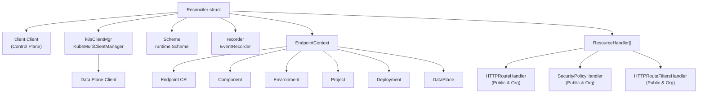
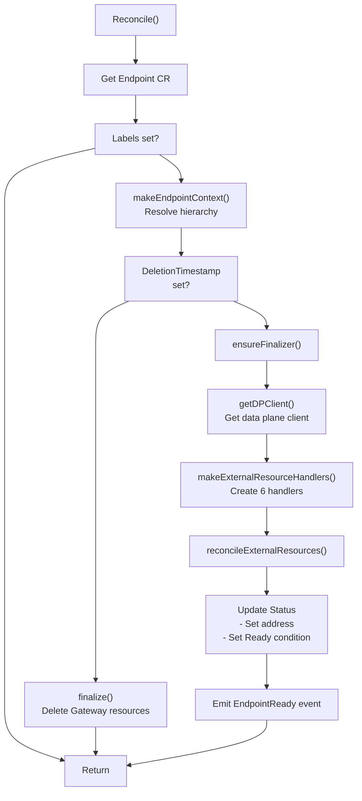
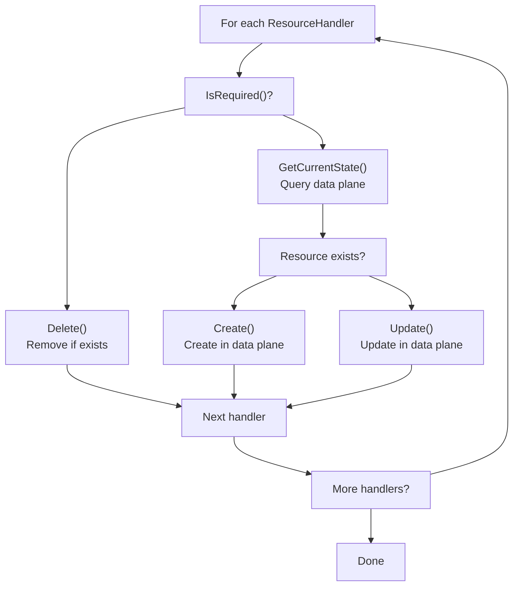
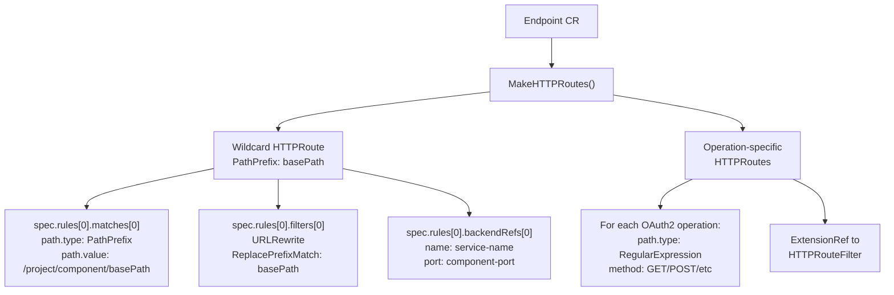
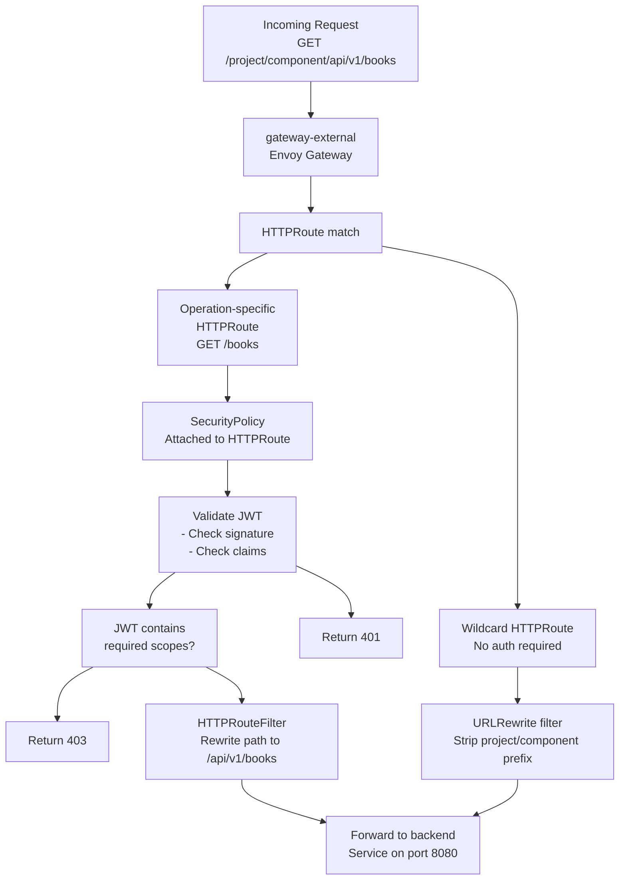
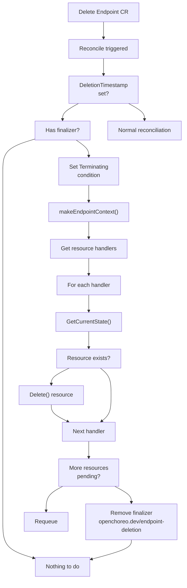

# Endpoint Controller

> **Relevant source files**
> * [internal/controller/annotations.go](https://github.com/openchoreo/openchoreo/blob/a577e969/internal/controller/annotations.go)
> * [internal/controller/deployment/controller.go](https://github.com/openchoreo/openchoreo/blob/a577e969/internal/controller/deployment/controller.go)
> * [internal/controller/deployment/controller_endpoints.go](https://github.com/openchoreo/openchoreo/blob/a577e969/internal/controller/deployment/controller_endpoints.go)
> * [internal/controller/deployment/controller_endpoints_test.go](https://github.com/openchoreo/openchoreo/blob/a577e969/internal/controller/deployment/controller_endpoints_test.go)
> * [internal/controller/deployment/controller_finalize.go](https://github.com/openchoreo/openchoreo/blob/a577e969/internal/controller/deployment/controller_finalize.go)
> * [internal/controller/deployment/controller_test.go](https://github.com/openchoreo/openchoreo/blob/a577e969/internal/controller/deployment/controller_test.go)
> * [internal/controller/deployment/controller_watch.go](https://github.com/openchoreo/openchoreo/blob/a577e969/internal/controller/deployment/controller_watch.go)
> * [internal/controller/deployment/integrations/kubernetes/ports.go](https://github.com/openchoreo/openchoreo/blob/a577e969/internal/controller/deployment/integrations/kubernetes/ports.go)
> * [internal/controller/endpoint/controller.go](https://github.com/openchoreo/openchoreo/blob/a577e969/internal/controller/endpoint/controller.go)
> * [internal/controller/endpoint/controller_conditions.go](https://github.com/openchoreo/openchoreo/blob/a577e969/internal/controller/endpoint/controller_conditions.go)
> * [internal/controller/endpoint/controller_finalize.go](https://github.com/openchoreo/openchoreo/blob/a577e969/internal/controller/endpoint/controller_finalize.go)
> * [internal/controller/endpoint/controller_test.go](https://github.com/openchoreo/openchoreo/blob/a577e969/internal/controller/endpoint/controller_test.go)
> * [internal/controller/endpoint/controller_watch.go](https://github.com/openchoreo/openchoreo/blob/a577e969/internal/controller/endpoint/controller_watch.go)
> * [internal/controller/endpoint/integrations/kubernetes/http_route.go](https://github.com/openchoreo/openchoreo/blob/a577e969/internal/controller/endpoint/integrations/kubernetes/http_route.go)
> * [internal/controller/endpoint/integrations/kubernetes/http_route_test.go](https://github.com/openchoreo/openchoreo/blob/a577e969/internal/controller/endpoint/integrations/kubernetes/http_route_test.go)
> * [internal/controller/endpoint/integrations/kubernetes/httproute_filters.go](https://github.com/openchoreo/openchoreo/blob/a577e969/internal/controller/endpoint/integrations/kubernetes/httproute_filters.go)
> * [internal/controller/endpoint/integrations/kubernetes/security_policy.go](https://github.com/openchoreo/openchoreo/blob/a577e969/internal/controller/endpoint/integrations/kubernetes/security_policy.go)
> * [internal/controller/endpoint/integrations/kubernetes/visibility/strategy.go](https://github.com/openchoreo/openchoreo/blob/a577e969/internal/controller/endpoint/integrations/kubernetes/visibility/strategy.go)
> * [internal/controller/hierarchy.go](https://github.com/openchoreo/openchoreo/blob/a577e969/internal/controller/hierarchy.go)
> * [internal/controller/release/controller.go](https://github.com/openchoreo/openchoreo/blob/a577e969/internal/controller/release/controller.go)
> * [internal/controller/watch.go](https://github.com/openchoreo/openchoreo/blob/a577e969/internal/controller/watch.go)

## Overview

The Endpoint Controller is responsible for translating `Endpoint` Custom Resources into Gateway API resources (HTTPRoute, SecurityPolicy, HTTPRouteFilter) in the data plane. It handles network visibility strategies (public vs organization) and enforces OAuth2 JWT-based authorization policies on a per-operation basis.

The controller watches Endpoint CRs created by the Deployment Controller and provisions the appropriate Gateway API resources based on the endpoint's visibility configuration and security policies.

Sources: [internal/controller/endpoint/controller.go L29-L35](https://github.com/openchoreo/openchoreo/blob/a577e969/internal/controller/endpoint/controller.go#L29-L35)

 [internal/controller/endpoint/controller.go L46-L120](https://github.com/openchoreo/openchoreo/blob/a577e969/internal/controller/endpoint/controller.go#L46-L120)

## Controller Structure

The Endpoint Controller (`Reconciler`) manages Endpoint resources and provisions Gateway API resources in the data plane cluster.

### Reconciler Components



The `Reconciler` struct contains:

* `client.Client`: Control plane Kubernetes client for reading Endpoint and hierarchy resources
* `k8sClientMgr`: Multi-cluster client manager for accessing the data plane
* `Scheme`: Runtime scheme for type registration
* `recorder`: Event recorder for emitting Kubernetes events

Sources: [internal/controller/endpoint/controller.go L29-L35](https://github.com/openchoreo/openchoreo/blob/a577e969/internal/controller/endpoint/controller.go#L29-L35)

 [internal/controller/endpoint/controller.go L211-L233](https://github.com/openchoreo/openchoreo/blob/a577e969/internal/controller/endpoint/controller.go#L211-L233)

### Endpoint Context Construction

The controller builds an `EndpointContext` struct containing all necessary hierarchy objects for resource generation:

```
type EndpointContext struct {
    Endpoint        *Endpoint
    Component       *Component
    Environment     *Environment
    Project         *Project
    Deployment      *Deployment
    DeploymentTrack *DeploymentTrack
    DataPlane       *DataPlane
}
```

The `makeEndpointContext()` function uses the hierarchy package to resolve parent resources based on labels:

* `GetComponent()` - retrieves component from endpoint labels
* `GetEnvironment()` - retrieves environment from endpoint labels
* `GetProject()` - retrieves project from endpoint labels
* `GetDeployment()` - retrieves deployment from endpoint labels
* `GetDeploymentTrack()` - retrieves deployment track from endpoint labels
* `GetDataPlane()` - retrieves data plane via environment reference

Sources: [internal/controller/endpoint/controller.go L62-L68](https://github.com/openchoreo/openchoreo/blob/a577e969/internal/controller/endpoint/controller.go#L62-L68)

 [internal/controller/hierarchy.go L134-L157](https://github.com/openchoreo/openchoreo/blob/a577e969/internal/controller/hierarchy.go#L134-L157)

 [internal/controller/hierarchy.go L214-L235](https://github.com/openchoreo/openchoreo/blob/a577e969/internal/controller/hierarchy.go#L214-L235)

## Reconciliation Loop

### Main Reconcile Flow



The `Reconcile()` function performs these steps:

1. Fetch the Endpoint CR from the control plane
2. Build endpoint context with hierarchy resolution
3. Handle deletion if `DeletionTimestamp` is set
4. Ensure finalizer `openchoreo.dev/endpoint-deletion` is present
5. Get data plane client via `getDPClient()`
6. Create resource handlers for Gateway API resources
7. Reconcile external resources using handlers
8. Update status with address and conditions
9. Emit event if endpoint transitions to Ready

Sources: [internal/controller/endpoint/controller.go L46-L120](https://github.com/openchoreo/openchoreo/blob/a577e969/internal/controller/endpoint/controller.go#L46-L120)

 [internal/controller/endpoint/controller.go L122-L134](https://github.com/openchoreo/openchoreo/blob/a577e969/internal/controller/endpoint/controller.go#L122-L134)

## Resource Handler Pattern

The controller uses the `ResourceHandler[EndpointContext]` interface to manage Gateway API resources:

```sql
type ResourceHandler[T any] interface {
    Name() string
    IsRequired(ctx *T) bool
    GetCurrentState(ctx context.Context, t *T) (interface{}, error)
    Create(ctx context.Context, t *T) error
    Update(ctx context.Context, t *T, currentState interface{}) error
    Delete(ctx context.Context, t *T) error
}
```

Six handlers are created, one for each combination of resource type and visibility:

| Handler | Visibility | Resource Type | Gateway Type |
| --- | --- | --- | --- |
| HTTPRouteHandler | Public | HTTPRoute | gateway-external |
| HTTPRouteHandler | Organization | HTTPRoute | gateway-internal |
| SecurityPolicyHandler | Public | SecurityPolicy | gateway-external |
| SecurityPolicyHandler | Organization | SecurityPolicy | gateway-internal |
| HTTPRouteFiltersHandler | Public | HTTPRouteFilter | gateway-external |
| HTTPRouteFiltersHandler | Organization | HTTPRouteFilter | gateway-internal |

Sources: [internal/controller/endpoint/controller.go L122-L134](https://github.com/openchoreo/openchoreo/blob/a577e969/internal/controller/endpoint/controller.go#L122-L134)

 [internal/controller/endpoint/controller.go L136-L180](https://github.com/openchoreo/openchoreo/blob/a577e969/internal/controller/endpoint/controller.go#L136-L180)

### Resource Reconciliation Algorithm

The `reconcileExternalResources()` function processes each handler:



The reconciliation logic:

1. Check if resource is required via `IsRequired()` (based on visibility config)
2. If not required, delete the resource if it exists
3. If required, get current state from data plane
4. If resource doesn't exist, create it
5. If resource exists, update it (comparing specs and labels)

Sources: [internal/controller/endpoint/controller.go L136-L180](https://github.com/openchoreo/openchoreo/blob/a577e969/internal/controller/endpoint/controller.go#L136-L180)

## Visibility Strategy Pattern

The controller uses a strategy pattern to handle different visibility configurations.

### Strategy Interface

```
type VisibilityStrategy interface {
    IsHTTPRouteRequired(epCtx *EndpointContext) bool
    IsHTTPRouteFilterRequired(epCtx *EndpointContext) bool
    IsSecurityPolicyRequired(epCtx *EndpointContext) bool
    GetGatewayType() GatewayType
}
```

### Gateway Types

```javascript
type GatewayType string

const (
    GatewayExternal GatewayType = "gateway-external"  // Public visibility
    GatewayInternal GatewayType = "gateway-internal"  // Organization visibility
)
```

### Strategy Implementations

#### PublicVisibilityStrategy

Handles endpoints with `spec.networkVisibilities.public.enable = true`:

* Routes to `gateway-external` in namespace `choreo-system`
* Hostname: `<env-dns-prefix>.choreoapis.localhost` (for services)
* Hostname: `<component>-<env>.choreoapps.localhost` (for web applications)
* Enforces OAuth2 policies if configured

#### OrganizationVisibilityStrategy

Handles endpoints with `spec.networkVisibilities.organization.enable = true`:

* Routes to `gateway-internal` in namespace `choreo-system`
* Hostname: `<env-dns-prefix>.internal.choreoapis.localhost`
* Not available for web applications (always returns false)
* Enforces OAuth2 policies if configured

Sources: [internal/controller/endpoint/integrations/kubernetes/visibility/strategy.go L35-L49](https://github.com/openchoreo/openchoreo/blob/a577e969/internal/controller/endpoint/integrations/kubernetes/visibility/strategy.go#L35-L49)

 [internal/controller/endpoint/integrations/kubernetes/visibility/strategy.go L55-L87](https://github.com/openchoreo/openchoreo/blob/a577e969/internal/controller/endpoint/integrations/kubernetes/visibility/strategy.go#L55-L87)

 [internal/controller/endpoint/integrations/kubernetes/visibility/strategy.go L93-L125](https://github.com/openchoreo/openchoreo/blob/a577e969/internal/controller/endpoint/integrations/kubernetes/visibility/strategy.go#L93-L125)

## Gateway API Resource Generation

### HTTPRoute Generation

The `HTTPRouteHandler` creates Gateway API HTTPRoute resources using `MakeHTTPRoutes()`:

#### Wildcard HTTPRoute

A wildcard route is always created to match all requests:



Example wildcard HTTPRoute for service component:

```html
apiVersion: gateway.networking.k8s.io/v1
kind: HTTPRoute
metadata:
  name: gateway-external-endpoint-<hash>
  namespace: dp-<org>-<project>-<env>-<hash>
spec:
  parentRefs:
  - name: gateway-external
    namespace: choreo-system
  hostnames:
  - prod.choreoapis.localhost
  rules:
  - matches:
    - path:
        type: PathPrefix
        value: /project-name/component-name/api/v1
    filters:
    - type: URLRewrite
      urlRewrite:
        path:
          type: PrefixMatchHTTPPathModifier
          replacePrefixMatch: /api/v1
    backendRefs:
    - name: component-svc
      port: 8080
```

Sources: [internal/controller/endpoint/integrations/kubernetes/http_route.go L150-L186](https://github.com/openchoreo/openchoreo/blob/a577e969/internal/controller/endpoint/integrations/kubernetes/http_route.go#L150-L186)

 [internal/controller/endpoint/integrations/kubernetes/http_route.go L235-L296](https://github.com/openchoreo/openchoreo/blob/a577e969/internal/controller/endpoint/integrations/kubernetes/http_route.go#L235-L296)

#### Operation-Specific HTTPRoutes

When OAuth2 policies are configured with operation-level scopes, the controller creates additional HTTPRoutes for each operation:

```yaml
apiVersion: gateway.networking.k8s.io/v1
kind: HTTPRoute
metadata:
  name: gateway-external-endpoint-get-books-<hash>
spec:
  rules:
  - matches:
    - path:
        type: RegularExpression
        value: ^/project/component(/api/v1/books)$
      method: GET
    filters:
    - type: ExtensionRef
      extensionRef:
        group: gateway.envoyproxy.io
        kind: HTTPRouteFilter
        name: gateway-external-endpoint-get-books-<hash>
```

The regex pattern is generated by `GenerateRegexWithCaptureGroup()` to:

1. Match the full path including project/component prefix
2. Capture the basePath + operation part in a group
3. Handle path parameters like `{id}` converted to `[^/]+`

Sources: [internal/controller/endpoint/integrations/kubernetes/http_route.go L298-L366](https://github.com/openchoreo/openchoreo/blob/a577e969/internal/controller/endpoint/integrations/kubernetes/http_route.go#L298-L366)

 [internal/controller/endpoint/integrations/kubernetes/http_route.go L391-L447](https://github.com/openchoreo/openchoreo/blob/a577e969/internal/controller/endpoint/integrations/kubernetes/http_route.go#L391-L447)

### HTTPRouteFilter Generation

For operation-specific routes, the controller creates `HTTPRouteFilter` resources for path rewriting:

```yaml
apiVersion: gateway.envoyproxy.io/v1alpha1
kind: HTTPRouteFilter
metadata:
  name: gateway-external-endpoint-get-books-<hash>
spec:
  urlRewrite:
    path:
      type: Regex
      replaceRegexMatch:
        pattern: ^/project/component(/api/v1/books)$
        substitution: \1
```

This filter:

1. Matches the full incoming path with regex
2. Replaces it with just the captured group (basePath + operation)
3. Removes the project/component prefix before forwarding to backend

Sources: [internal/controller/endpoint/integrations/kubernetes/httproute_filters.go L147-L206](https://github.com/openchoreo/openchoreo/blob/a577e969/internal/controller/endpoint/integrations/kubernetes/httproute_filters.go#L147-L206)

### SecurityPolicy Generation

When OAuth2 policies with operation scopes are configured, the controller creates Envoy Gateway `SecurityPolicy` resources:

```yaml
apiVersion: gateway.envoyproxy.io/v1alpha1
kind: SecurityPolicy
metadata:
  name: gateway-external-endpoint-get-books-<hash>
spec:
  jwt:
    providers:
    - name: default
      remoteJWKS:
        uri: https://idp.example.com/.well-known/jwks.json
  targetRefs:
  - group: gateway.networking.k8s.io
    kind: HTTPRoute
    name: gateway-external-endpoint-get-books-<hash>
  authorization:
    rules:
    - principal:
        jwt:
          provider: default
          scopes:
          - read:books
      action: Allow
    defaultAction: Deny
```

The SecurityPolicy:

1. Configures JWT validation using `remoteJWKS` URI from Environment spec
2. Targets the specific HTTPRoute for the operation
3. Defines authorization rules based on JWT scopes
4. Denies access by default if scopes don't match

Sources: [internal/controller/endpoint/integrations/kubernetes/security_policy.go L146-L233](https://github.com/openchoreo/openchoreo/blob/a577e969/internal/controller/endpoint/integrations/kubernetes/security_policy.go#L146-L233)

## OAuth2 Policy Enforcement

### Policy Structure

OAuth2 policies in the Endpoint spec define operation-level authorization:

```yaml
spec:
  networkVisibilities:
    public:
      enable: true
      policies:
      - name: oauth2-policy
        type: Oauth2
        policySpec:
          oauth2:
            jwt:
              claims:
              - key: aud
                values: ["choreoapis.localhost"]
              authorization:
                apiType: REST
                rest:
                  operations:
                  - target: /books
                    method: GET
                    scopes: ["read:books"]
                  - target: /books
                    method: POST
                    scopes: ["write:books"]
                  - target: /books/{id}
                    method: GET
                    scopes: ["read:books:all"]
```

### Enforcement Flow



When a request arrives:

1. Gateway matches against operation-specific routes first (more specific regex)
2. If matched and SecurityPolicy attached, JWT is validated
3. JWT scopes are checked against required operation scopes
4. If authorized, path is rewritten via HTTPRouteFilter
5. Request forwarded to backend service
6. If no operation match, wildcard route is used (no auth)

Sources: [internal/controller/endpoint/integrations/kubernetes/http_route.go L188-L227](https://github.com/openchoreo/openchoreo/blob/a577e969/internal/controller/endpoint/integrations/kubernetes/http_route.go#L188-L227)

 [internal/controller/endpoint/integrations/kubernetes/security_policy.go L175-L232](https://github.com/openchoreo/openchoreo/blob/a577e969/internal/controller/endpoint/integrations/kubernetes/security_policy.go#L175-L232)

### Scope Extraction

The `extractPoliciesFromCtx()` function retrieves policies based on gateway type:

```go
func extractPoliciesFromCtx(epCtx *EndpointContext, gwType GatewayType) []Policy {
    switch gwType {
    case GatewayExternal:
        return epCtx.Endpoint.Spec.NetworkVisibilities.Public.Policies
    case GatewayInternal:
        return epCtx.Endpoint.Spec.NetworkVisibilities.Organization.Policies
    }
}
```

Only policies of type `Oauth2PolicyType` with configured operations are processed. Each operation in the policy generates a separate HTTPRoute, HTTPRouteFilter, and SecurityPolicy triplet.

Sources: [internal/controller/endpoint/integrations/kubernetes/http_route.go L368-L389](https://github.com/openchoreo/openchoreo/blob/a577e969/internal/controller/endpoint/integrations/kubernetes/http_route.go#L368-L389)

## Finalization and Cleanup

When an Endpoint is deleted, the controller removes Gateway API resources:



The `finalize()` function:

1. Sets `Ready=False` condition with reason "Terminating"
2. Constructs endpoint context
3. Gets data plane client
4. For each resource handler, calls `Delete()`
5. Requeues if resources still exist
6. Removes finalizer when all resources deleted

Sources: [internal/controller/endpoint/controller_finalize.go L32-L91](https://github.com/openchoreo/openchoreo/blob/a577e969/internal/controller/endpoint/controller_finalize.go#L32-L91)

## Watches and Triggers

The controller watches multiple resource types to trigger reconciliation:

### Primary Watch

* **Endpoint**: Direct reconciliation when Endpoint CR changes

### Secondary Watches

* **DataPlane**: Reconciles all endpoints in environments using that data plane
* **Environment**: Reconciles all endpoints in that environment

### Watch Setup

```go
func (r *Reconciler) SetupWithManager(mgr ctrl.Manager) error {
    return ctrl.NewControllerManagedBy(mgr).
        For(&Endpoint{}).
        Named("endpoint").
        Watches(&DataPlane{}, 
            handler.EnqueueRequestsFromMapFunc(r.listEndpointsForDataplane)).
        Watches(&Environment{}, 
            handler.EnqueueRequestsFromMapFunc(r.listEndpointsForEnvironment)).
        Complete(r)
}
```

The `listEndpointsForDataplane()` function:

1. Lists all Environments referencing the DataPlane
2. For each Environment, lists all Endpoints by label
3. Enqueues reconcile requests for each Endpoint

The `listEndpointsForEnvironment()` function:

1. Lists all Endpoints with matching environment label
2. Enqueues reconcile request for each Endpoint

Sources: [internal/controller/endpoint/controller.go L183-L209](https://github.com/openchoreo/openchoreo/blob/a577e969/internal/controller/endpoint/controller.go#L183-L209)

 [internal/controller/endpoint/controller_watch.go L38-L104](https://github.com/openchoreo/openchoreo/blob/a577e969/internal/controller/endpoint/controller_watch.go#L38-L104)

## Status and Conditions

### Address Field

The controller sets `status.address` to the external URL:

```
ep.Status.Address = MakeAddress(epCtx, GatewayExternal)
```

Address format varies by component type:

* **Service/API**: `https://<env-dns-prefix>.choreoapis.localhost/<project>/<component>`
* **WebApplication**: `https://<component>-<env>.choreoapps.localhost`

Sources: [internal/controller/endpoint/controller.go L101](https://github.com/openchoreo/openchoreo/blob/a577e969/internal/controller/endpoint/controller.go#L101-L101)

### Condition Types

| Condition | Type | Status | Reason | Description |
| --- | --- | --- | --- | --- |
| Ready | Ready | True | EndpointReady | Endpoint successfully reconciled |
| Ready | Ready | False | EndpointReady | External resource reconciliation failed |
| Ready | Ready | False | EndpointReady | Endpoint is terminating |

Conditions are set using the standard `meta.SetStatusCondition()` function with generation-based observedGeneration tracking.

Sources: [internal/controller/endpoint/controller_conditions.go L26-L54](https://github.com/openchoreo/openchoreo/blob/a577e969/internal/controller/endpoint/controller_conditions.go#L26-L54)

 [internal/controller/endpoint/controller.go L91-L108](https://github.com/openchoreo/openchoreo/blob/a577e969/internal/controller/endpoint/controller.go#L91-L108)

### Events

The controller emits Kubernetes events:

* **EndpointReady** (Normal): Emitted when endpoint transitions to Ready
* **ContextResolutionFailed** (Warning): Emitted when hierarchy resolution fails
* **ExternalResourceReconciliationFailed** (Warning): Emitted when Gateway resource reconciliation fails

Sources: [internal/controller/endpoint/controller.go L65-L67](https://github.com/openchoreo/openchoreo/blob/a577e969/internal/controller/endpoint/controller.go#L65-L67)

 [internal/controller/endpoint/controller.go L93-L95](https://github.com/openchoreo/openchoreo/blob/a577e969/internal/controller/endpoint/controller.go#L93-L95)

 [internal/controller/endpoint/controller.go L115-L117](https://github.com/openchoreo/openchoreo/blob/a577e969/internal/controller/endpoint/controller.go#L115-L117)

## Common Usage Patterns

### Exposing a Component Service

The most common use case is exposing a service from a component deployment. The Endpoint resource typically references the Kubernetes service created by the Deployment controller:

```yaml
apiVersion: core.choreo.dev/v1
kind: Endpoint
metadata:
  name: my-service-endpoint
spec:
  type: REST
  service:
    basePath: /api/v1
    port: 8080
  networkVisibilities:
    organization:
      enable: true
    public:
      enable: true
      apiSettings:
        securitySchemes:
          - oauth
```

### Securing Endpoints with Different Visibility Levels

A common pattern is to apply different security settings based on visibility level:

* **Organization visibility**: Less restrictive security for internal services
* **Public visibility**: Stricter security controls, including authentication requirements

This can be achieved by configuring different API settings for each visibility level.

Sources: [api/v1/endpoint_types.go L142-L160](https://github.com/openchoreo/openchoreo/blob/a577e969/api/v1/endpoint_types.go#L142-L160)

 [docs/resource-kind-reference-guide.md L1400-L1446](https://github.com/openchoreo/openchoreo/blob/a577e969/docs/resource-kind-reference-guide.md#L1400-L1446)

## Integration with OpenChoreo Architecture

The Endpoint Management system integrates with several other components in the OpenChoreo architecture:

1. **Deployment System**: Creates and configures the initial Endpoint resources
2. **Cell Runtime Model**: Provides secure boundaries for endpoint communication
3. **DataPlane**: Provides the underlying gateway infrastructure
4. **Environment**: Determines the network domain for the endpoint

In the larger context, Endpoint Management enables the secure exposure of deployed components, allowing them to communicate with each other and with external systems while maintaining appropriate security controls.

Sources: [docs/resource-kind-reference-guide.md L1252-L1261](https://github.com/openchoreo/openchoreo/blob/a577e969/docs/resource-kind-reference-guide.md#L1252-L1261)