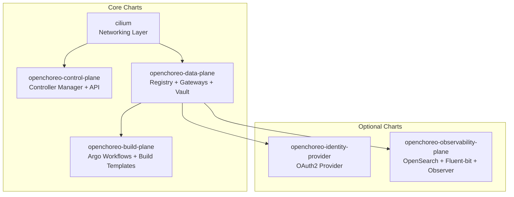
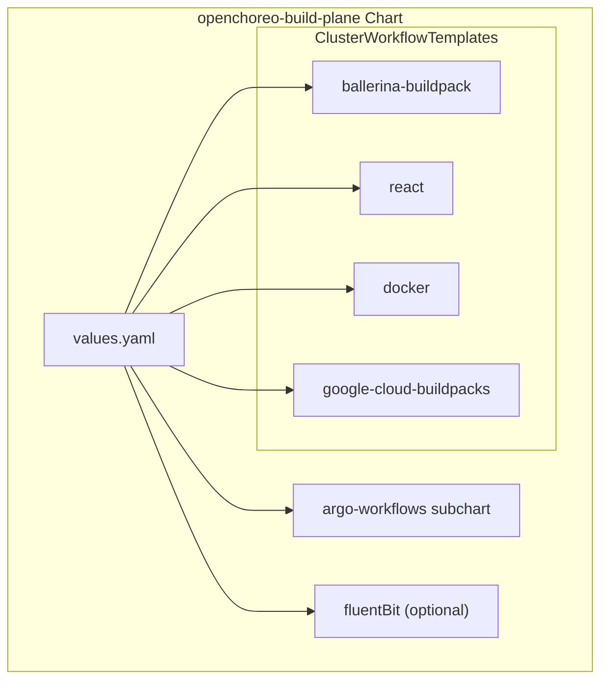
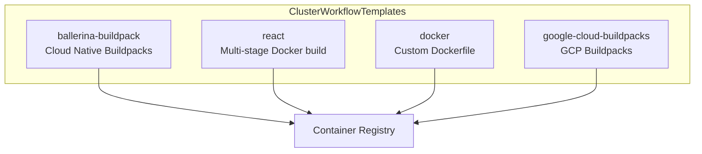

# Helm Charts and Configuration

> **Relevant source files**
> * [docs/configure-build-plane.md](https://github.com/openchoreo/openchoreo/blob/a577e969/docs/configure-build-plane.md)
> * [install/add-build-plane.sh](https://github.com/openchoreo/openchoreo/blob/a577e969/install/add-build-plane.sh)
> * [install/add-default-dataplane.sh](https://github.com/openchoreo/openchoreo/blob/a577e969/install/add-default-dataplane.sh)
> * [install/check-status.sh](https://github.com/openchoreo/openchoreo/blob/a577e969/install/check-status.sh)
> * [install/helm/cilium/.helmignore](https://github.com/openchoreo/openchoreo/blob/a577e969/install/helm/cilium/.helmignore)
> * [install/helm/cilium/templates/serviceaccount.yaml](https://github.com/openchoreo/openchoreo/blob/a577e969/install/helm/cilium/templates/serviceaccount.yaml)
> * [install/helm/cilium/templates/wait-for-cilium.yaml](https://github.com/openchoreo/openchoreo/blob/a577e969/install/helm/cilium/templates/wait-for-cilium.yaml)
> * [install/helm/openchoreo-build-plane/templates/_helpers.tpl](https://github.com/openchoreo/openchoreo/blob/a577e969/install/helm/openchoreo-build-plane/templates/_helpers.tpl)
> * [install/helm/openchoreo-build-plane/templates/workflow-templates/ballerina-buildpack.yaml](https://github.com/openchoreo/openchoreo/blob/a577e969/install/helm/openchoreo-build-plane/templates/workflow-templates/ballerina-buildpack.yaml)
> * [install/helm/openchoreo-build-plane/templates/workflow-templates/docker.yaml](https://github.com/openchoreo/openchoreo/blob/a577e969/install/helm/openchoreo-build-plane/templates/workflow-templates/docker.yaml)
> * [install/helm/openchoreo-build-plane/templates/workflow-templates/google-cloud-buildpacks.yaml](https://github.com/openchoreo/openchoreo/blob/a577e969/install/helm/openchoreo-build-plane/templates/workflow-templates/google-cloud-buildpacks.yaml)
> * [install/helm/openchoreo-build-plane/templates/workflow-templates/react.yaml](https://github.com/openchoreo/openchoreo/blob/a577e969/install/helm/openchoreo-build-plane/templates/workflow-templates/react.yaml)
> * [install/helm/openchoreo-build-plane/values.yaml](https://github.com/openchoreo/openchoreo/blob/a577e969/install/helm/openchoreo-build-plane/values.yaml)
> * [install/install-helpers-local.sh](https://github.com/openchoreo/openchoreo/blob/a577e969/install/install-helpers-local.sh)
> * [install/install.sh](https://github.com/openchoreo/openchoreo/blob/a577e969/install/install.sh)
> * [install/quick-start/install-helpers.sh](https://github.com/openchoreo/openchoreo/blob/a577e969/install/quick-start/install-helpers.sh)
> * [install/uninstall.sh](https://github.com/openchoreo/openchoreo/blob/a577e969/install/uninstall.sh)
> * [internal/choreoctl/cmd/logs/logs.go](https://github.com/openchoreo/openchoreo/blob/a577e969/internal/choreoctl/cmd/logs/logs.go)

OpenChoreo is deployed using multiple independent Helm charts, each responsible for a specific architectural plane. This modular approach allows flexible deployment topologies, including single-cluster and multi-cluster configurations.

This page documents the Helm chart structure, configuration values, and common deployment patterns.

## Chart Architecture

OpenChoreo consists of six primary Helm charts installed in a specific order:



**Chart Installation Order:**

| Order | Chart | Namespace | Purpose |
| --- | --- | --- | --- |
| 1 | `cilium` | `cilium` | CNI networking with eBPF-based network policies |
| 2 | `openchoreo-control-plane` | `openchoreo-control-plane` | Controller manager and API server |
| 3 | `openchoreo-data-plane` | `openchoreo-data-plane` | Container registry, gateways, Redis, Vault |
| 4 | `openchoreo-build-plane` | `openchoreo-build-plane` | Argo Workflows and build templates |
| 5 | `openchoreo-identity-provider` | `openchoreo-identity-system` | OAuth2 authentication (optional) |
| 6 | `openchoreo-observability-plane` | `openchoreo-observability-plane` | Logging and observability stack (optional) |

Sources: [install/install.sh L73-L124](https://github.com/openchoreo/openchoreo/blob/a577e969/install/install.sh#L73-L124)

 [install/install-helpers-local.sh L236-L273](https://github.com/openchoreo/openchoreo/blob/a577e969/install/install-helpers-local.sh#L236-L273)

## Chart Locations and Structure

All Helm charts are located in the `install/helm/` directory:

```
install/helm/
├── cilium/
├── openchoreo-control-plane/
├── openchoreo-data-plane/
├── openchoreo-build-plane/
│   ├── values.yaml
│   ├── templates/
│   │   └── workflow-templates/
│   │       ├── ballerina-buildpack.yaml
│   │       ├── react.yaml
│   │       ├── docker.yaml
│   │       └── google-cloud-buildpacks.yaml
│   └── Chart.yaml
├── openchoreo-identity-provider/
└── openchoreo-observability-plane/
```

Sources: [install/helm/openchoreo-build-plane/values.yaml L1-L129](https://github.com/openchoreo/openchoreo/blob/a577e969/install/helm/openchoreo-build-plane/values.yaml#L1-L129)

 [install/helm/openchoreo-build-plane/templates/workflow-templates/ballerina-buildpack.yaml L1-L310](https://github.com/openchoreo/openchoreo/blob/a577e969/install/helm/openchoreo-build-plane/templates/workflow-templates/ballerina-buildpack.yaml#L1-L310)

## Control Plane Chart

The `openchoreo-control-plane` chart deploys the controller manager and API server.

**Key Components:**

* Controller manager (reconciles all OpenChoreo CRDs)
* API server (HTTP REST interface)
* cert-manager (TLS certificate management)

**Installation Command:**

```csharp
helm install openchoreo-control-plane \
  install/helm/openchoreo-control-plane \
  --namespace openchoreo-control-plane \
  --create-namespace
```

Sources: [install/install-helpers-local.sh L252-L255](https://github.com/openchoreo/openchoreo/blob/a577e969/install/install-helpers-local.sh#L252-L255)

## Data Plane Chart

The `openchoreo-data-plane` chart provisions infrastructure for running application workloads.

**Key Components:**

* Container registry (for storing built images)
* Envoy Gateway (external and internal gateways)
* Redis (rate limiting backend)
* HashiCorp Vault (secrets management)
* Fluent-bit (log forwarding)

**Installation Command:**

```csharp
helm install openchoreo-data-plane \
  install/helm/openchoreo-data-plane \
  --namespace openchoreo-data-plane \
  --create-namespace \
  --set cert-manager.enabled=false \
  --set cert-manager.crds.enabled=false
```

The `cert-manager` flags disable embedded cert-manager if already installed by the control plane chart.

Sources: [install/install-helpers-local.sh L244-L249](https://github.com/openchoreo/openchoreo/blob/a577e969/install/install-helpers-local.sh#L244-L249)

## Build Plane Chart

The `openchoreo-build-plane` chart manages the build execution infrastructure using Argo Workflows.

### Chart Structure



### Core Configuration Values

The build plane chart uses the following key configuration structure:

```css
global:
  commonLabels: {}
  defaultResources:
    enabled: true    # Deploy ClusterWorkflowTemplates
    registry:
      type: local    # "local" or "external"
      local:
        pushEndpoint: "registry.openchoreo-data-plane:5000"
        pullEndpoint: "localhost:30003"
      external:
        endpoint: ""  # e.g., "gcr.io/my-project"

argo-workflows:
  fullnameOverride: argo
  controller:
    resources:
      limits:
        memory: 64Mi
        cpu: 50m
  workflowNamespaces:
    - argo-build

fluentBit:
  enabled: false  # Enable for observability integration
```

Sources: [install/helm/openchoreo-build-plane/values.yaml L1-L129](https://github.com/openchoreo/openchoreo/blob/a577e969/install/helm/openchoreo-build-plane/values.yaml#L1-L129)

### Registry Configuration

The build plane supports two registry modes:

| Mode | Use Case | Configuration |
| --- | --- | --- |
| `local` | Development, single-cluster | Uses built-in registry from data plane chart |
| `external` | Production, multi-cluster | Connects to external registry (GCR, DockerHub, Harbor, etc.) |

**Local Registry Configuration:**

For local mode, the build plane uses different endpoints for push and pull operations:

* **pushEndpoint**: Internal cluster DNS name used by build pods to push images
* **pullEndpoint**: External NodePort address used by kubelet to pull images

This dual-endpoint approach is necessary in Kind/development environments where the registry service is exposed via NodePort.

**External Registry Configuration:**

For external registries, set `registry.type: external` and provide the registry endpoint:

```yaml
global:
  defaultResources:
    registry:
      type: external
      external:
        endpoint: "gcr.io/my-project"
```

Sources: [install/helm/openchoreo-build-plane/values.yaml L10-L31](https://github.com/openchoreo/openchoreo/blob/a577e969/install/helm/openchoreo-build-plane/values.yaml#L10-L31)

 [install/helm/openchoreo-build-plane/templates/workflow-templates/ballerina-buildpack.yaml L175-L183](https://github.com/openchoreo/openchoreo/blob/a577e969/install/helm/openchoreo-build-plane/templates/workflow-templates/ballerina-buildpack.yaml#L175-L183)

### ClusterWorkflowTemplates

The build plane chart installs four `ClusterWorkflowTemplate` resources when `global.defaultResources.enabled: true`:



Each template implements a four-step workflow:

1. **clone-step**: Clones Git repository using `alpine/git`
2. **build-step**: Builds container image using `ghcr.io/openchoreo/podman-runner:v1.0`
3. **push-step**: Pushes image to registry using `ghcr.io/openchoreo/podman-runner:v1.0`
4. **workload-create-step**: Creates Workload CR using `ghcr.io/openchoreo/openchoreo-cli`

Sources: [install/helm/openchoreo-build-plane/templates/workflow-templates/ballerina-buildpack.yaml L14-L35](https://github.com/openchoreo/openchoreo/blob/a577e969/install/helm/openchoreo-build-plane/templates/workflow-templates/ballerina-buildpack.yaml#L14-L35)

 [install/helm/openchoreo-build-plane/templates/workflow-templates/react.yaml L17-L38](https://github.com/openchoreo/openchoreo/blob/a577e969/install/helm/openchoreo-build-plane/templates/workflow-templates/react.yaml#L17-L38)

 [install/helm/openchoreo-build-plane/templates/workflow-templates/docker.yaml L18-L39](https://github.com/openchoreo/openchoreo/blob/a577e969/install/helm/openchoreo-build-plane/templates/workflow-templates/docker.yaml#L18-L39)

 [install/helm/openchoreo-build-plane/templates/workflow-templates/google-cloud-buildpacks.yaml L14-L35](https://github.com/openchoreo/openchoreo/blob/a577e969/install/helm/openchoreo-build-plane/templates/workflow-templates/google-cloud-buildpacks.yaml#L14-L35)

### Ballerina Buildpack Template

The `ballerina-buildpack` template demonstrates the complete workflow structure:

**Workflow Parameters:**

```markdown
workflow.parameters:
  - branch          # Git branch to build
  - commit          # Specific commit SHA (optional)
  - git-repo        # Git repository URL
  - image-name      # Output image name
  - image-tag       # Output image tag
  - app-path        # Path within repository
  - project-name    # OpenChoreo project name
  - component-name  # OpenChoreo component name
```

**Build Step Implementation:**

The build step uses Podman with Cloud Native Buildpacks:

* Sets up Podman storage configuration at `/etc/containers/storage.conf`
* Starts Podman daemon
* Caches builder and run images at `/shared/podman/cache`
* Executes `/usr/local/bin/pack build` with Ballerina buildpack
* Saves built image as tar to `/mnt/vol/app-image.tar`

**Push Step Implementation:**

The push step handles registry type selection:

```
REGISTRY_TYPE="{{ .Values.global.defaultResources.registry.type | default "local" }}"

if [ "${REGISTRY_TYPE}" = "local" ]; then
  REGISTRY_PULL="{{ .Values.global.defaultResources.registry.local.pullEndpoint }}"
  REGISTRY_PUSH="{{ .Values.global.defaultResources.registry.local.pushEndpoint }}"
else
  REGISTRY_PULL="{{ .Values.global.defaultResources.registry.external.endpoint }}"
  REGISTRY_PUSH="{{ .Values.global.defaultResources.registry.external.endpoint }}"
fi
```

It loads the image tar, tags it, pushes to `REGISTRY_PUSH`, and outputs the `REGISTRY_PULL` reference for kubelet.

**Workload Create Step:**

Uses the `openchoreo-cli` image to generate a Workload CR:

```sql
podman run --rm --network=none \
  -v $DESCRIPTOR_PATH:/app:rw -w /app \
  ghcr.io/openchoreo/openchoreo-cli:{{ .Chart.AppVersion }} \
  create workload \
  --project "${PROJECT_NAME}" \
  --component "${COMPONENT_NAME}" \
  --image "${IMAGE}" \
  --descriptor "workload.yaml" \
  -o "workload-cr.yaml"
```

**Node Affinity:**

All workflow templates include node affinity for dedicated build nodes:

```yaml
affinity:
  nodeAffinity:
    requiredDuringSchedulingIgnoredDuringExecution:
      nodeSelectorTerms:
        - matchExpressions:
            - key: openchoreo.dev/noderole
              operator: In
              values:
                - workflow-runner
```

Sources: [install/helm/openchoreo-build-plane/templates/workflow-templates/ballerina-buildpack.yaml L36-L283](https://github.com/openchoreo/openchoreo/blob/a577e969/install/helm/openchoreo-build-plane/templates/workflow-templates/ballerina-buildpack.yaml#L36-L283)

 [install/helm/openchoreo-build-plane/templates/workflow-templates/ballerina-buildpack.yaml L284-L296](https://github.com/openchoreo/openchoreo/blob/a577e969/install/helm/openchoreo-build-plane/templates/workflow-templates/ballerina-buildpack.yaml#L284-L296)

### Fluent-bit Configuration (Optional)

The build plane chart includes optional Fluent-bit configuration for forwarding build logs to OpenSearch:

```yaml
fluentBit:
  enabled: false  # Enable when using observability plane
  config:
    input:
      path: "/var/log/containers/*_openchoreo-*_*.log,/var/log/containers/*_openchoreo-ci-*_*.log"
    output:
      name: opensearch
      match: "kube.*"
    opensearch:
      host: "opensearch.openchoreo-observability-plane.svc.cluster.local"
      port: "9200"
```

Sources: [install/helm/openchoreo-build-plane/values.yaml L55-L112](https://github.com/openchoreo/openchoreo/blob/a577e969/install/helm/openchoreo-build-plane/values.yaml#L55-L112)

**Installation Command:**

```csharp
helm install openchoreo-build-plane \
  install/helm/openchoreo-build-plane \
  --namespace openchoreo-build-plane \
  --create-namespace
```

Sources: [install/install-helpers-local.sh L258-L261](https://github.com/openchoreo/openchoreo/blob/a577e969/install/install-helpers-local.sh#L258-L261)

## Optional Charts

### Identity Provider Chart

The `openchoreo-identity-provider` chart provides OAuth2 authentication.

**Installation Command:**

```csharp
helm install openchoreo-identity-provider \
  install/helm/openchoreo-identity-provider \
  --namespace openchoreo-identity-system \
  --create-namespace
```

Sources: [install/install-helpers-local.sh L264-L267](https://github.com/openchoreo/openchoreo/blob/a577e969/install/install-helpers-local.sh#L264-L267)

### Observability Plane Chart

The `openchoreo-observability-plane` chart deploys the logging and observability stack:

* OpenSearch (log storage)
* OpenSearch Dashboard (log visualization)
* Observer service (log query API)

**Installation Command:**

```csharp
helm install openchoreo-observability-plane \
  install/helm/openchoreo-observability-plane \
  --namespace openchoreo-observability-plane \
  --create-namespace
```

Sources: [install/install-helpers-local.sh L270-L273](https://github.com/openchoreo/openchoreo/blob/a577e969/install/install-helpers-local.sh#L270-L273)

## Cilium Chart

The `cilium` chart provides eBPF-based networking and network policies.

**Chart Features:**

* Custom post-install wait job that ensures Cilium is ready before proceeding
* ServiceAccount `cilium-wait-sa` with RBAC permissions to watch pods

```yaml
# Wait job configuration
waitJob:
  enabled: true
  image: bitnami/kubectl:latest
```

The wait job uses `kubectl wait --for=condition=Ready pods --all` to ensure all Cilium pods are running before the installation proceeds.

**Installation Command:**

```csharp
helm install cilium \
  install/helm/cilium \
  --namespace cilium \
  --create-namespace
```

Sources: [install/helm/cilium/templates/wait-for-cilium.yaml L1-L26](https://github.com/openchoreo/openchoreo/blob/a577e969/install/helm/cilium/templates/wait-for-cilium.yaml#L1-L26)

 [install/helm/cilium/templates/serviceaccount.yaml L1-L31](https://github.com/openchoreo/openchoreo/blob/a577e969/install/helm/cilium/templates/serviceaccount.yaml#L1-L31)

 [install/install-helpers-local.sh L237-L241](https://github.com/openchoreo/openchoreo/blob/a577e969/install/install-helpers-local.sh#L237-L241)

## DataPlane and BuildPlane Resource Configuration

After installing the Helm charts, DataPlane and BuildPlane custom resources must be created to connect the control plane to the infrastructure.

### DataPlane Resource

The `add-default-dataplane.sh` script creates a DataPlane CR with cluster connection details:

```yaml
apiVersion: openchoreo.dev/v1alpha1
kind: DataPlane
metadata:
  name: default
  namespace: default
  labels:
    openchoreo.dev/organization: default
    openchoreo.dev/build-plane: "true"
spec:
  registry:
    prefix: registry.openchoreo-data-plane:5000
  gateway:
    organizationVirtualHost: openchoreoapis.internal
    publicVirtualHost: openchoreoapis.localhost
  kubernetesCluster:
    server: <kubernetes-api-server-url>
    tls:
      ca:
        value: <base64-encoded-ca-cert>
    auth:
      mtls:
        clientCert:
          value: <base64-encoded-client-cert>
        clientKey:
          value: <base64-encoded-client-key>
```

The script extracts cluster credentials from kubeconfig and supports both mTLS and bearer token authentication.

**Single-Cluster Mode:**

In single-cluster installations, the script automatically uses the current context:

```
bash install/add-default-dataplane.sh --single-cluster
```

**Multi-Cluster Mode:**

For multi-cluster setups, the script prompts for the data plane context:

```
bash install/add-default-dataplane.sh --multi-cluster
```

Sources: [install/add-default-dataplane.sh L107-L139](https://github.com/openchoreo/openchoreo/blob/a577e969/install/add-default-dataplane.sh#L107-L139)

 [install/add-default-dataplane.sh L18-L39](https://github.com/openchoreo/openchoreo/blob/a577e969/install/add-default-dataplane.sh#L18-L39)

### BuildPlane Resource

The `add-build-plane.sh` script creates a BuildPlane CR:

```yaml
apiVersion: openchoreo.dev/v1alpha1
kind: BuildPlane
metadata:
  name: default
  namespace: default
spec:
  kubernetesCluster:
    server: <kubernetes-api-server-url>
    tls:
      ca:
        value: <base64-encoded-ca-cert>
    auth:
      mtls:
        clientCert:
          value: <base64-encoded-client-cert>
        clientKey:
          value: <base64-encoded-client-key>
```

Similar to DataPlane, it supports both single-cluster and multi-cluster configurations.

Sources: [install/add-build-plane.sh L101-L124](https://github.com/openchoreo/openchoreo/blob/a577e969/install/add-build-plane.sh#L101-L124)

 [install/add-build-plane.sh L22-L35](https://github.com/openchoreo/openchoreo/blob/a577e969/install/add-build-plane.sh#L22-L35)

## Key Configuration Values

The following table describes the most important configuration values you may want to customize:

| Configuration Path | Default | Description |
| --- | --- | --- |
| controllerManager.manager.image.tag | latest-dev | Controller manager image tag |
| controllerManager.replicas | 1 | Number of controller manager replicas |
| choreoDefaultValues.enableDefaultOrgAndProject | true | Whether to create default org and project |
| choreoDefaultValues.dataPlane.externalGatewayVirtualHost | choreoapis.localhost | External gateway hostname |
| vault.server.dev.enabled | true | Whether to run Vault in dev mode |
| registry.service.nodePort | 30003 | NodePort for the container registry |
| registry.storage.size | 2Gi | Storage size for the container registry |

Sources: [install/helm/choreo/values.yaml](https://github.com/openchoreo/openchoreo/blob/a577e969/install/helm/choreo/values.yaml)

 [install/helm/choreo/choreo.values.yaml](https://github.com/openchoreo/openchoreo/blob/a577e969/install/helm/choreo/choreo.values.yaml)

## Installation Configuration Example

Below is an example of how to customize the configuration during installation:

```
helm install openchoreo ./install/helm/choreo \
  --set controllerManager.replicas=2 \
  --set choreoDefaultValues.dataPlane.externalGatewayVirtualHost=api.example.com \
  --set registry.storage.size=10Gi
```

Alternatively, you can create a custom values file:

```yaml
# custom-values.yaml
controllerManager:
  replicas: 2
choreoDefaultValues:
  dataPlane:
    externalGatewayVirtualHost: api.example.com
registry:
  storage:
    size: 10Gi
```

And install using:

```
helm install openchoreo ./install/helm/choreo -f custom-values.yaml
```

## Configuration Best Practices

1. **Use `choreo.values.yaml` for modifications**: Never modify the generated `values.yaml` file directly. Instead, make your changes in `choreo.values.yaml`.
2. **Resource Configuration**: Adjust resource requests and limits based on your cluster capacity and expected workload.
3. **Production Settings**: For production deployments: * Disable Vault dev mode and configure proper authentication * Increase resource allocations for critical components * Set up proper TLS certificates for gateways * Configure backup for persistent storage
4. **Multiple Environments**: When deploying across multiple environments (dev/test/prod), maintain separate value files for each environment.
5. **Security Considerations**: Review and adjust security settings, especially for Vault, before deploying to production.

Sources: [install/helm/choreo/values.yaml](https://github.com/openchoreo/openchoreo/blob/a577e969/install/helm/choreo/values.yaml)

 [install/helm/choreo/choreo.values.yaml](https://github.com/openchoreo/openchoreo/blob/a577e969/install/helm/choreo/choreo.values.yaml)

## Additional Resources

* For general OpenChoreo architecture information, see [Architecture](/openchoreo/openchoreo/2-architecture)
* For build system details, see [Build System](/openchoreo/openchoreo/3-build-system)
* For deployment system information, see [Deployment System](/openchoreo/openchoreo/4-deployment-system)
* For information about custom resources, see [Custom Resources](/openchoreo/openchoreo/5-api-and-services)