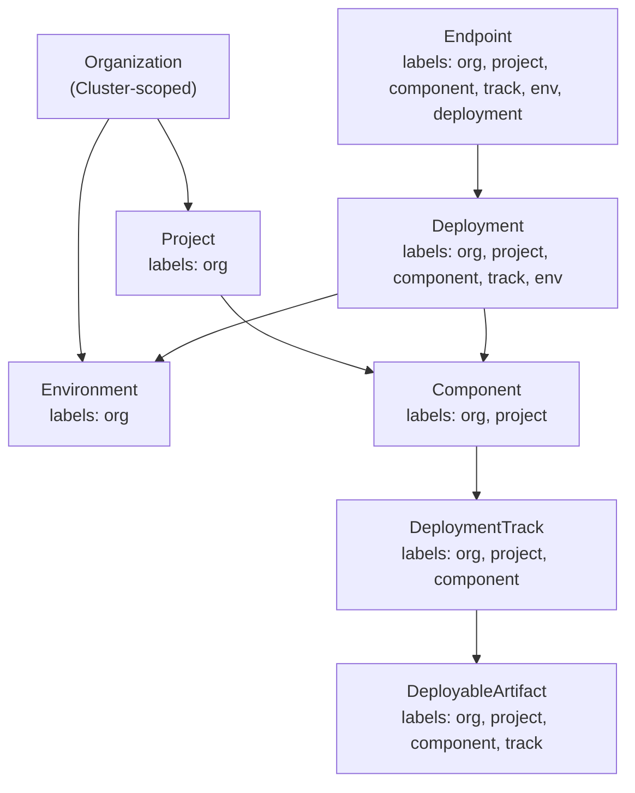
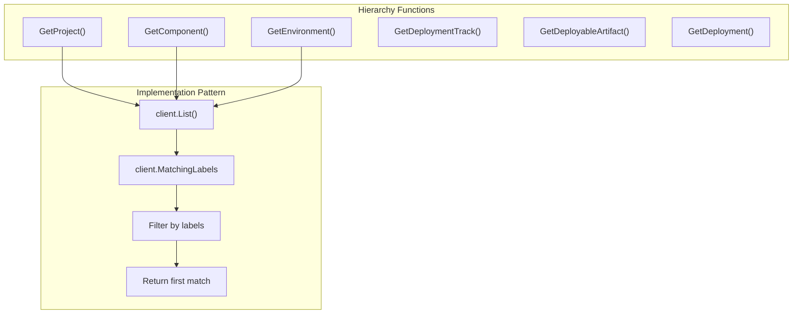
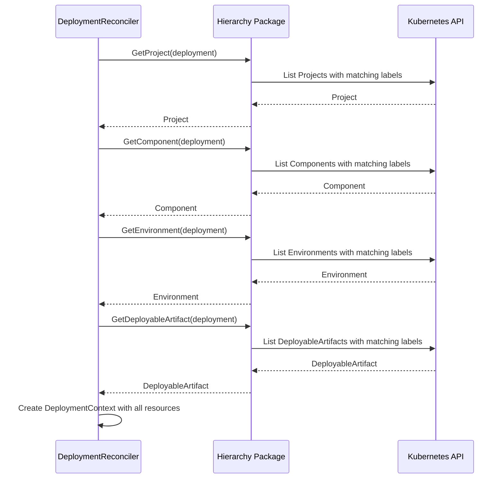
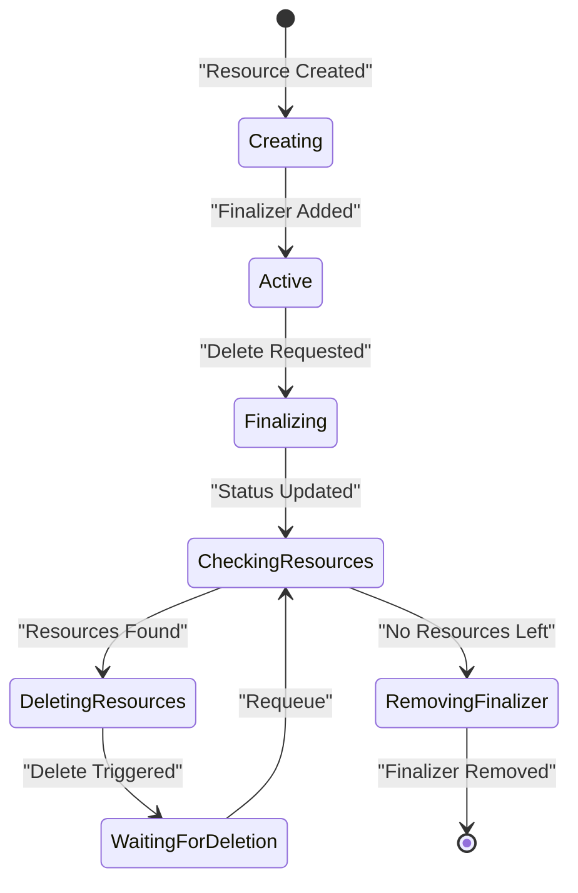
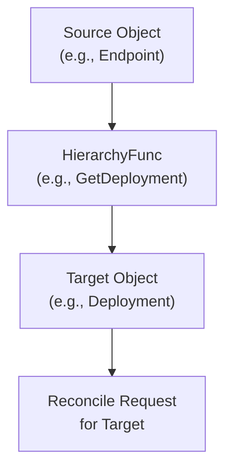
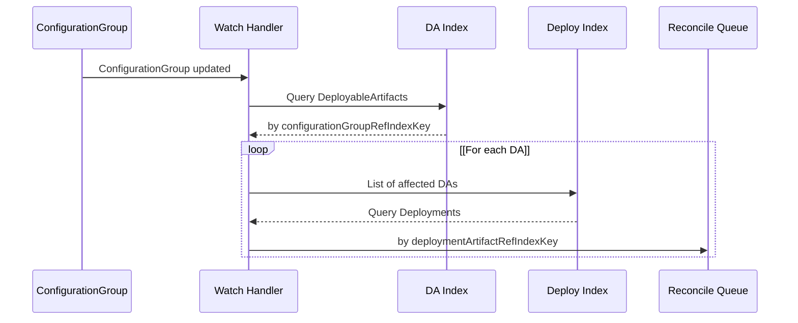

# Hierarchy and Finalization

> **Relevant source files**
> * [internal/controller/annotations.go](https://github.com/openchoreo/openchoreo/blob/a577e969/internal/controller/annotations.go)
> * [internal/controller/deployment/controller.go](https://github.com/openchoreo/openchoreo/blob/a577e969/internal/controller/deployment/controller.go)
> * [internal/controller/deployment/controller_endpoints.go](https://github.com/openchoreo/openchoreo/blob/a577e969/internal/controller/deployment/controller_endpoints.go)
> * [internal/controller/deployment/controller_endpoints_test.go](https://github.com/openchoreo/openchoreo/blob/a577e969/internal/controller/deployment/controller_endpoints_test.go)
> * [internal/controller/deployment/controller_finalize.go](https://github.com/openchoreo/openchoreo/blob/a577e969/internal/controller/deployment/controller_finalize.go)
> * [internal/controller/deployment/controller_test.go](https://github.com/openchoreo/openchoreo/blob/a577e969/internal/controller/deployment/controller_test.go)
> * [internal/controller/deployment/controller_watch.go](https://github.com/openchoreo/openchoreo/blob/a577e969/internal/controller/deployment/controller_watch.go)
> * [internal/controller/endpoint/controller.go](https://github.com/openchoreo/openchoreo/blob/a577e969/internal/controller/endpoint/controller.go)
> * [internal/controller/endpoint/controller_conditions.go](https://github.com/openchoreo/openchoreo/blob/a577e969/internal/controller/endpoint/controller_conditions.go)
> * [internal/controller/endpoint/controller_finalize.go](https://github.com/openchoreo/openchoreo/blob/a577e969/internal/controller/endpoint/controller_finalize.go)
> * [internal/controller/hierarchy.go](https://github.com/openchoreo/openchoreo/blob/a577e969/internal/controller/hierarchy.go)
> * [internal/controller/release/controller.go](https://github.com/openchoreo/openchoreo/blob/a577e969/internal/controller/release/controller.go)
> * [internal/controller/watch.go](https://github.com/openchoreo/openchoreo/blob/a577e969/internal/controller/watch.go)

This page documents OpenChoreo's hierarchy resolution system, finalizer patterns for resource cleanup, and cross-resource watch mechanisms. These foundational patterns enable controllers to navigate organizational structure, ensure proper cleanup of external resources, and react to changes in related resources.

## Overview

OpenChoreo uses three key patterns for managing resource relationships and lifecycle:

1. **Label-based Hierarchy Resolution** - Controllers use standardized labels to navigate parent-child relationships without owner references
2. **Finalizer Patterns** - Ensures external resources in data planes are cleaned up before control plane resources are deleted
3. **Cross-Resource Watches** - Controllers watch related resources to trigger reconciliation when dependencies change

### Label-Based Hierarchy Architecture



Sources: [internal/controller/hierarchy.go L1-L408](https://github.com/openchoreo/openchoreo/blob/a577e969/internal/controller/hierarchy.go#L1-L408)

## Label-Based Hierarchy Resolution

The hierarchy package in [internal/controller/hierarchy.go](https://github.com/openchoreo/openchoreo/blob/a577e969/internal/controller/hierarchy.go)

 provides functions for resolving parent resources using label-based queries. This approach avoids tight coupling through owner references and allows resources to reference parents across namespaces.

### Hierarchy Labels

Resources carry standardized labels that identify their position in the organizational hierarchy:

| Label | Purpose | Example Value |
| --- | --- | --- |
| `openchoreo.dev/organization` | Organization name | `default-org` |
| `openchoreo.dev/project` | Project name | `my-project` |
| `openchoreo.dev/component` | Component name | `api-service` |
| `openchoreo.dev/deployment-track` | Deployment track name | `main` |
| `openchoreo.dev/environment` | Environment name | `development` |
| `openchoreo.dev/deployment` | Deployment name | `api-service-v1` |
| `openchoreo.dev/name` | Resource's own name | varies by resource |

### Hierarchy Resolution Functions

The hierarchy package provides typed functions for navigating the resource hierarchy. Each function queries resources by matching labels:



**Example: GetComponent Function**

[internal/controller/hierarchy.go L134-L157](https://github.com/openchoreo/openchoreo/blob/a577e969/internal/controller/hierarchy.go#L134-L157)

 shows how `GetComponent` resolves a Component resource:

```go
func GetComponent(ctx context.Context, c client.Client, obj client.Object) (*openchoreov1alpha1.Component, error) {
    componentList := &openchoreov1alpha1.ComponentList{}
    listOpts := []client.ListOption{
        client.InNamespace(obj.GetNamespace()),
        client.MatchingLabels{
            labels.LabelKeyOrganizationName: GetOrganizationName(obj),
            labels.LabelKeyProjectName:      GetProjectName(obj),
            labels.LabelKeyName:             GetComponentName(obj),
        },
    }
    // ... list and return
}
```

The function extracts label values from the input object and queries for a Component matching those labels.

Sources: [internal/controller/hierarchy.go L111-L157](https://github.com/openchoreo/openchoreo/blob/a577e969/internal/controller/hierarchy.go#L111-L157)

 [internal/controller/hierarchy.go L214-L235](https://github.com/openchoreo/openchoreo/blob/a577e969/internal/controller/hierarchy.go#L214-L235)

### HierarchyNotFoundError

When a parent resource cannot be found, functions return a `HierarchyNotFoundError` that includes the full hierarchy path for debugging:

[internal/controller/hierarchy.go L22-L74](https://github.com/openchoreo/openchoreo/blob/a577e969/internal/controller/hierarchy.go#L22-L74)

 defines the error type:

| Field | Description |
| --- | --- |
| `objInfo` | The child object that triggered the query |
| `parentInfo` | The immediate parent that was not found |
| `parentHierarchyInfos` | Full hierarchy path from top to bottom |

**Error Message Format:**

```
deployment 'my-deployment' refers to a non-existent component 'my-component' on organization 'default-org' -> project 'my-project'
```

The `IgnoreHierarchyNotFoundError` function [internal/controller/hierarchy.go L63-L74](https://github.com/openchoreo/openchoreo/blob/a577e969/internal/controller/hierarchy.go#L63-L74)

 allows controllers to gracefully handle missing parents by returning `nil`, preventing reconciliation retries when parent resources are being created or deleted.

Sources: [internal/controller/hierarchy.go L22-L74](https://github.com/openchoreo/openchoreo/blob/a577e969/internal/controller/hierarchy.go#L22-L74)

## Hierarchy Usage in Controllers

Controllers use hierarchy functions to build context objects that contain all necessary parent resources for reconciliation.

### Building Deployment Context

The Deployment controller [internal/controller/deployment/controller.go L78-L87](https://github.com/openchoreo/openchoreo/blob/a577e969/internal/controller/deployment/controller.go#L78-L87)

 uses hierarchy functions to create a `DeploymentContext`:



The `makeDeploymentContext` function calls multiple hierarchy functions to gather all parent resources needed for provisioning data plane resources.

### Building Endpoint Context

Similarly, the Endpoint controller [internal/controller/endpoint/controller.go L62-L68](https://github.com/openchoreo/openchoreo/blob/a577e969/internal/controller/endpoint/controller.go#L62-L68)

 builds an `EndpointContext`:

* Calls `GetDeployment()` to get the parent Deployment
* Calls `GetEnvironment()` through the Deployment
* Calls `GetDataPlaneByEnvironment()` to get the target data plane

This context provides all information needed to provision Gateway API resources in the data plane.

Sources: [internal/controller/deployment/controller.go L78-L87](https://github.com/openchoreo/openchoreo/blob/a577e969/internal/controller/deployment/controller.go#L78-L87)

 [internal/controller/endpoint/controller.go L62-L68](https://github.com/openchoreo/openchoreo/blob/a577e969/internal/controller/endpoint/controller.go#L62-L68)

## Finalizer Patterns

Finalizers ensure that external resources are cleaned up before control plane resources are deleted. Both Deployment and Endpoint controllers implement finalizer patterns to clean up resources in data plane clusters.

### Finalizer Lifecycle



### Deployment Finalizer Implementation

The Deployment controller uses the `DataPlaneCleanupFinalizer` [internal/controller/deployment/controller_finalize.go L25](https://github.com/openchoreo/openchoreo/blob/a577e969/internal/controller/deployment/controller_finalize.go#L25-L25)

:

**Phase 1: Adding Finalizer**

[internal/controller/deployment/controller.go L69-L72](https://github.com/openchoreo/openchoreo/blob/a577e969/internal/controller/deployment/controller.go#L69-L72)

 ensures the finalizer is added when a Deployment is first created:

```
if finalizerAdded, err := r.ensureFinalizer(ctx, deployment); err != nil || finalizerAdded {
    return ctrl.Result{}, err
}
```

**Phase 2: Marking as Finalizing**

[internal/controller/deployment/controller_finalize.go L51-L58](https://github.com/openchoreo/openchoreo/blob/a577e969/internal/controller/deployment/controller_finalize.go#L51-L58)

 updates the status to indicate finalization has started:

```
if meta.SetStatusCondition(&deployment.Status.Conditions, NewDeploymentFinalizingCondition(deployment.Generation)) {
    if err := controller.UpdateStatusConditions(ctx, r.Client, old, deployment); err != nil {
        return ctrl.Result{}, err
    }
    return ctrl.Result{}, nil
}
```

**Phase 3: Deleting External Resources**

[internal/controller/deployment/controller_finalize.go L72-L98](https://github.com/openchoreo/openchoreo/blob/a577e969/internal/controller/deployment/controller_finalize.go#L72-L98)

 iterates through resource handlers to delete data plane resources:

* Gets current state of each resource
* Calls `Delete()` if resource exists
* Skips namespace (handled separately)
* Requeues if resources are still being deleted

**Phase 4: Cleaning Up Child Resources**

[internal/controller/deployment/controller_finalize.go L106-L116](https://github.com/openchoreo/openchoreo/blob/a577e969/internal/controller/deployment/controller_finalize.go#L106-L116)

 handles Endpoint cleanup:

* Lists all Endpoints with matching labels
* Deletes each Endpoint
* Returns if deletion is still in progress

**Phase 5: Removing Finalizer**

[internal/controller/deployment/controller_finalize.go L119-L123](https://github.com/openchoreo/openchoreo/blob/a577e969/internal/controller/deployment/controller_finalize.go#L119-L123)

 removes the finalizer after all resources are cleaned up, allowing Kubernetes to delete the Deployment.

Sources: [internal/controller/deployment/controller_finalize.go L23-L125](https://github.com/openchoreo/openchoreo/blob/a577e969/internal/controller/deployment/controller_finalize.go#L23-L125)

 [internal/controller/deployment/controller.go L63-L72](https://github.com/openchoreo/openchoreo/blob/a577e969/internal/controller/deployment/controller.go#L63-L72)

### Endpoint Finalizer Implementation

The Endpoint controller uses `EndpointDeletionFinalizer` [api/v1alpha1/endpoint_types.go](https://github.com/openchoreo/openchoreo/blob/a577e969/api/v1alpha1/endpoint_types.go)

 with a simpler cleanup process:

[internal/controller/endpoint/controller_finalize.go L31-L91](https://github.com/openchoreo/openchoreo/blob/a577e969/internal/controller/endpoint/controller_finalize.go#L31-L91)

 implements the finalization logic:

1. Marks endpoint as terminating in status
2. Builds endpoint context with hierarchy resolution
3. Iterates through resource handlers (HTTPRoute, SecurityPolicy, HTTPRouteFilter)
4. Deletes each resource if it exists
5. Requeues if deletion is still pending
6. Removes finalizer when all resources are gone

Unlike the Deployment controller, the Endpoint controller does not need to handle child resources since Endpoints are leaf nodes in the hierarchy.

Sources: [internal/controller/endpoint/controller_finalize.go L1-L92](https://github.com/openchoreo/openchoreo/blob/a577e969/internal/controller/endpoint/controller_finalize.go#L1-L92)

 [internal/controller/endpoint/controller.go L70-L79](https://github.com/openchoreo/openchoreo/blob/a577e969/internal/controller/endpoint/controller.go#L70-L79)

### Finalizer Requeue Strategy

Both controllers use different requeue strategies:

| Controller | Strategy | Reason |
| --- | --- | --- |
| Deployment | `RequeueAfter: 5 * time.Second` | Gives data plane time to delete heavy resources (Deployments, Services) |
| Endpoint | `Requeue: true` | Immediate requeue for lightweight Gateway API resources |

Sources: [internal/controller/deployment/controller_finalize.go L103](https://github.com/openchoreo/openchoreo/blob/a577e969/internal/controller/deployment/controller_finalize.go#L103-L103)

 [internal/controller/endpoint/controller_finalize.go L81](https://github.com/openchoreo/openchoreo/blob/a577e969/internal/controller/endpoint/controller_finalize.go#L81-L81)

## Cross-Resource Watches

Controllers watch related resources to trigger reconciliation when dependencies change. This ensures the system stays consistent as resources are created, updated, or deleted.

### Watch Handler Registration

Controllers register watch handlers during setup. The Deployment controller [internal/controller/deployment/controller.go L156-L176](https://github.com/openchoreo/openchoreo/blob/a577e969/internal/controller/deployment/controller.go#L156-L176)

 watches:

| Watched Resource | Handler Function | Purpose |
| --- | --- | --- |
| `DeployableArtifact` | `listDeploymentsForDeployableArtifact` | Reconcile when build artifact changes |
| `ConfigurationGroup` | `listDeploymentsForConfigurationGroup` | Reconcile when configuration changes |
| `Endpoint` | `HierarchyWatchHandler` | Reconcile when child endpoint changes |

The Endpoint controller [internal/controller/endpoint/controller.go L196-L209](https://github.com/openchoreo/openchoreo/blob/a577e969/internal/controller/endpoint/controller.go#L196-L209)

 watches:

| Watched Resource | Handler Function | Purpose |
| --- | --- | --- |
| `DataPlane` | `listEndpointsForDataplane` | Reconcile when data plane changes |
| `Environment` | `listEndpointsForEnvironment` | Reconcile when environment changes |

### Field Indexes for Efficient Queries

Controllers create field indexes to efficiently query resources by reference fields:

[internal/controller/deployment/controller_watch.go L28-L44](https://github.com/openchoreo/openchoreo/blob/a577e969/internal/controller/deployment/controller_watch.go#L28-L44)

 creates an index for `spec.deploymentArtifactRef`:

```
return mgr.GetFieldIndexer().IndexField(
    ctx,
    &openchoreov1alpha1.Deployment{},
    deploymentArtifactRefIndexKey,
    func(obj client.Object) []string {
        deployment, ok := obj.(*openchoreov1alpha1.Deployment)
        if !ok {
            return nil
        }
        return []string{deployment.Spec.DeploymentArtifactRef}
    },
)
```

This allows querying all Deployments that reference a specific DeployableArtifact using `client.MatchingFields`.

Sources: [internal/controller/deployment/controller.go L156-L176](https://github.com/openchoreo/openchoreo/blob/a577e969/internal/controller/deployment/controller.go#L156-L176)

 [internal/controller/deployment/controller_watch.go L28-L44](https://github.com/openchoreo/openchoreo/blob/a577e969/internal/controller/deployment/controller_watch.go#L28-L44)

### Generic Hierarchy Watch Handler

The `HierarchyWatchHandler` [internal/controller/watch.go L13-L38](https://github.com/openchoreo/openchoreo/blob/a577e969/internal/controller/watch.go#L13-L38)

 is a generic function that creates watch handlers for hierarchical relationships:



**Usage Example:**

[internal/controller/deployment/controller.go L171-L174](https://github.com/openchoreo/openchoreo/blob/a577e969/internal/controller/deployment/controller.go#L171-L174)

 uses it to watch Endpoints:

```xml
Watches(
    &openchoreov1alpha1.Endpoint{},
    handler.EnqueueRequestsFromMapFunc(controller.HierarchyWatchHandler<FileRef file-url="https://github.com/openchoreo/openchoreo/blob/a577e969/*openchoreov1alpha1.Endpoint, *openchoreov1alpha1.Deployment" undefined  file-path="*openchoreov1alpha1.Endpoint, *openchoreov1alpha1.Deployment">Hii</FileRef>),
)
```

When an Endpoint changes, the handler calls `GetDeployment()` to find its parent Deployment and enqueues a reconcile request for that Deployment.

Sources: [internal/controller/watch.go L13-L38](https://github.com/openchoreo/openchoreo/blob/a577e969/internal/controller/watch.go#L13-L38)

 [internal/controller/deployment/controller.go L171-L174](https://github.com/openchoreo/openchoreo/blob/a577e969/internal/controller/deployment/controller.go#L171-L174)

### Configuration Change Propagation Example

The Deployment controller watches ConfigurationGroups through a multi-step query:



[internal/controller/deployment/controller_watch.go L145-L188](https://github.com/openchoreo/openchoreo/blob/a577e969/internal/controller/deployment/controller_watch.go#L145-L188)

 implements this logic:

1. Lists all DeployableArtifacts that reference the ConfigurationGroup using the `configurationGroupRefIndexKey` index
2. For each DeployableArtifact, lists all Deployments that reference it using the `deploymentArtifactRefIndexKey` index
3. Enqueues reconcile requests for all affected Deployments

This ensures configuration changes propagate to all Deployments that depend on them.

Sources: [internal/controller/deployment/controller_watch.go L100-L188](https://github.com/openchoreo/openchoreo/blob/a577e969/internal/controller/deployment/controller_watch.go#L100-L188)

## Example: Managing Configuration for Multiple Environments

The following example demonstrates how to create and use a ConfigurationGroup that defines different configuration values for development, staging, and production environments:

```yaml
apiVersion: core.choreo.dev/v1
kind: ConfigurationGroup
metadata:
  name: database-config
  namespace: default-org
  labels:
    core.choreo.dev/organization: default-org
    core.choreo.dev/project: default-project
    core.choreo.dev/name: database-config
spec:
  configurations:
    - environment: development
      values:
        host: dev-mysql.internal
        port: "3306"
        user: dev-sql-user
        database: my-app-db
    - environment: staging
      values:
        host: stg-mysql.internal
        port: "3306"
        user: stg-sql-user
        database: my-app-db
    - environment: production
      values:
        host: prod-mysql.internal
        port: "3306"
        user: prod-sql-user
        database: my-app-db
```

When a deployment references this ConfigurationGroup, OpenChoreo will automatically select the appropriate configuration based on the target environment.

Sources: [samples/deploying-applications/use-prebuilt-image/github-issue-reporter-task/README.md L1-L267](https://github.com/openchoreo/openchoreo/blob/a577e969/samples/deploying-applications/use-prebuilt-image/github-issue-reporter-task/README.md#L1-L267)

## Best Practices

1. **Use ConfigurationGroups for common settings** - When multiple applications share the same configuration values, use a ConfigurationGroup to centralize management.
2. **Environment-specific configurations** - Define environment-specific values within ConfigurationGroups rather than hardcoding them in your application.
3. **Secret management** - Store sensitive information in Vault and reference it in your configurations instead of committing it to version control.
4. **Configuration naming** - Use consistent naming conventions for configuration keys across environments to make management easier.
5. **Minimize configuration** - Only include necessary configuration values to keep things simple and reduce errors.
6. **Validation** - Include validation logic in your application to verify required configuration values are present.
7. **Documentation** - Document the purpose and format of each configuration value to aid developers.

## Under the Hood

When a Deployment is reconciled, the controller processes configuration references and creates the necessary Kubernetes resources:

1. The `ConfigMapHandler` creates ConfigMaps for non-sensitive configuration values
2. The `SecretProviderClassHandler` creates resources for accessing vault secrets
3. The Kubernetes Deployment specification includes volumes and environment variables referencing these resources

The OpenChoreo controller provides a seamless experience by automatically resolving the correct configuration values based on the target environment, creating the appropriate Kubernetes resources, and ensuring that configuration changes are propagated to running applications.

Sources: [internal/controller/deployment/controller.go L182-L197](https://github.com/openchoreo/openchoreo/blob/a577e969/internal/controller/deployment/controller.go#L182-L197)

 [internal/controller/deployment/controller_finalize.go L1-L183](https://github.com/openchoreo/openchoreo/blob/a577e969/internal/controller/deployment/controller_finalize.go#L1-L183)