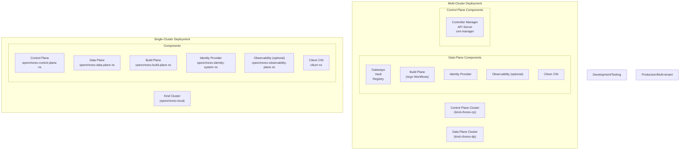
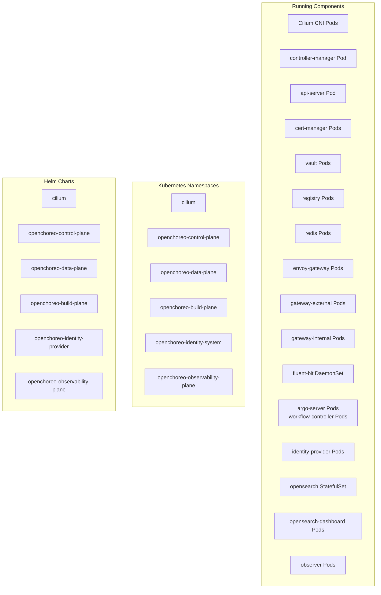
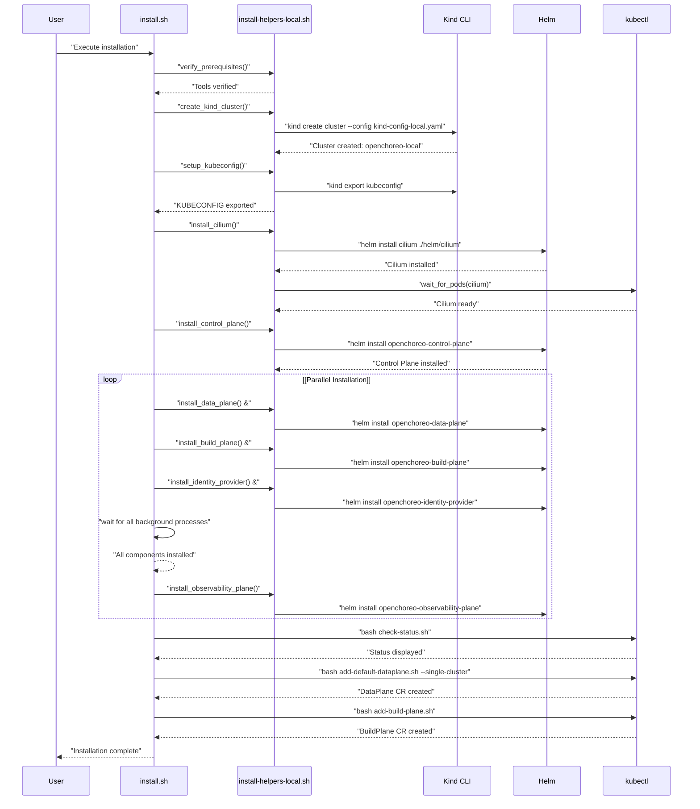
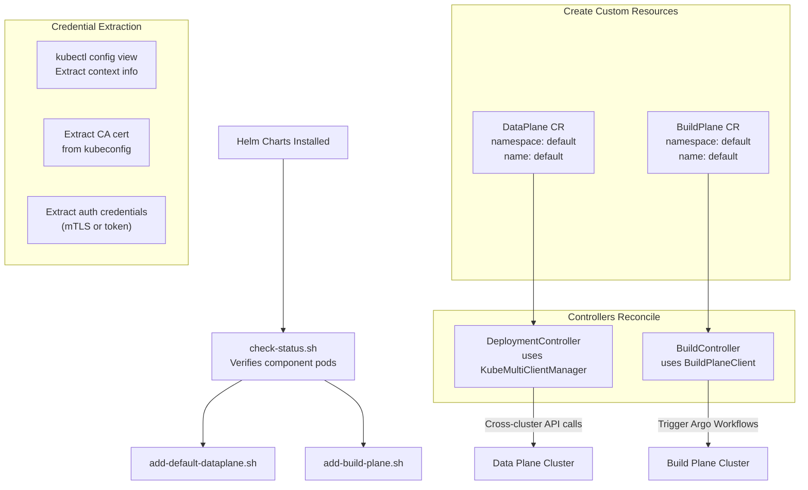

# Installation Overview

> **Relevant source files**
> * [.github/CODEOWNERS](https://github.com/openchoreo/openchoreo/blob/a577e969/.github/CODEOWNERS)
> * [.github/ISSUE_TEMPLATE/01-bug-report.yml](https://github.com/openchoreo/openchoreo/blob/a577e969/.github/ISSUE_TEMPLATE/01-bug-report.yml)
> * [.github/ISSUE_TEMPLATE/02-task.yml](https://github.com/openchoreo/openchoreo/blob/a577e969/.github/ISSUE_TEMPLATE/02-task.yml)
> * [.github/ISSUE_TEMPLATE/03-release.md](https://github.com/openchoreo/openchoreo/blob/a577e969/.github/ISSUE_TEMPLATE/03-release.md)
> * [.github/pull_request_template.md](https://github.com/openchoreo/openchoreo/blob/a577e969/.github/pull_request_template.md)
> * [docs/contributors/README.md](https://github.com/openchoreo/openchoreo/blob/a577e969/docs/contributors/README.md)
> * [docs/contributors/contribute.md](https://github.com/openchoreo/openchoreo/blob/a577e969/docs/contributors/contribute.md)
> * [docs/contributors/release.md](https://github.com/openchoreo/openchoreo/blob/a577e969/docs/contributors/release.md)
> * [docs/install-guide-multi-cluster.md](https://github.com/openchoreo/openchoreo/blob/a577e969/docs/install-guide-multi-cluster.md)
> * [install/add-build-plane.sh](https://github.com/openchoreo/openchoreo/blob/a577e969/install/add-build-plane.sh)
> * [install/add-default-dataplane.sh](https://github.com/openchoreo/openchoreo/blob/a577e969/install/add-default-dataplane.sh)
> * [install/check-status.sh](https://github.com/openchoreo/openchoreo/blob/a577e969/install/check-status.sh)
> * [install/helm/cilium/.helmignore](https://github.com/openchoreo/openchoreo/blob/a577e969/install/helm/cilium/.helmignore)
> * [install/helm/cilium/templates/serviceaccount.yaml](https://github.com/openchoreo/openchoreo/blob/a577e969/install/helm/cilium/templates/serviceaccount.yaml)
> * [install/helm/cilium/templates/wait-for-cilium.yaml](https://github.com/openchoreo/openchoreo/blob/a577e969/install/helm/cilium/templates/wait-for-cilium.yaml)
> * [install/install-helpers-local.sh](https://github.com/openchoreo/openchoreo/blob/a577e969/install/install-helpers-local.sh)
> * [install/install.sh](https://github.com/openchoreo/openchoreo/blob/a577e969/install/install.sh)
> * [install/uninstall.sh](https://github.com/openchoreo/openchoreo/blob/a577e969/install/uninstall.sh)

This document provides an overview of OpenChoreo installation approaches, prerequisites, component architecture, and the installation workflow. It serves as a guide to understanding the different deployment modes and what gets installed in each configuration.

For detailed step-by-step installation instructions, see:

* **Multi-Cluster Installation** ([7.2](/openchoreo/openchoreo/7.2-multi-cluster-installation)) - Production-like setup with separate Control Plane and Data Plane clusters
* **Quick Start Installation** ([7.3](/openchoreo/openchoreo/7.3-quick-start-installation)) - Simplified containerized environment for evaluation

For removing OpenChoreo installations, see **Uninstallation** ([7.4](/openchoreo/openchoreo/7.4-uninstallation)).

---

## Installation Approaches

OpenChoreo supports two primary installation approaches, each optimized for different use cases:

### Single-Cluster Deployment

A single Kubernetes cluster hosts all OpenChoreo components: Control Plane, Data Plane, Build Plane, Identity Provider, and optional Observability Plane. This approach simplifies resource management and networking, making it ideal for development, testing, and evaluation environments.

**Primary Script**: [install/install.sh L1-L159](https://github.com/openchoreo/openchoreo/blob/a577e969/install/install.sh#L1-L159)

**Use Cases**:

* Local development with Kind clusters
* Quick evaluation and testing
* Resource-constrained environments
* Learning OpenChoreo concepts

**Cluster Configuration**: [install/install-helpers-local.sh L117-L130](https://github.com/openchoreo/openchoreo/blob/a577e969/install/install-helpers-local.sh#L117-L130)

 defines a two-node Kind cluster with:

* One control-plane node
* One worker node labeled `openchoreo.dev/noderole: workflow-runner` for Argo Workflows
* Disabled default CNI (Cilium installed separately)
* Shared host path `/tmp/kind-shared` mounted to `/mnt/shared` for build caching

### Multi-Cluster Deployment

Separate Kubernetes clusters for Control Plane and Data Plane components, providing isolation and scalability similar to production environments. The Control Plane cluster manages Custom Resources and controllers, while the Data Plane cluster(s) run application workloads and build pipelines.

**Primary Documentation**: [docs/install-guide-multi-cluster.md L1-L296](https://github.com/openchoreo/openchoreo/blob/a577e969/docs/install-guide-multi-cluster.md#L1-L296)

**Use Cases**:

* Production deployments
* Multi-tenant environments
* Scalability testing
* Isolated development/staging/production environments

**Cluster Configuration**:

* Control Plane: Standard Kubernetes cluster (any CNI)
* Data Plane: Kubernetes cluster with Cilium CNI requirement

**Installation Approaches Comparison**



Sources: [install/install.sh L1-L159](https://github.com/openchoreo/openchoreo/blob/a577e969/install/install.sh#L1-L159)

 [install/install-helpers-local.sh L15-L19](https://github.com/openchoreo/openchoreo/blob/a577e969/install/install-helpers-local.sh#L15-L19)

 [docs/install-guide-multi-cluster.md L1-L10](https://github.com/openchoreo/openchoreo/blob/a577e969/docs/install-guide-multi-cluster.md#L1-L10)

---

## Prerequisites

The following tools are required before installing OpenChoreo:

| Tool | Minimum Version | Purpose | Verification Command |
| --- | --- | --- | --- |
| `kubectl` | v1.32.0 | Kubernetes cluster management | `kubectl version --client` |
| `helm` | v3.15+ | Package management | `helm version` |
| `kind` | v0.27.0+ | Local Kubernetes clusters (for local installations) | `kind version` |
| `docker` | 23.0+ | Container runtime | `docker version` |
| `go` | 1.23.5+ | Building choreoctl CLI | `go version` |

**Verification Scripts**:

* [install/install-helpers-local.sh L293-L321](https://github.com/openchoreo/openchoreo/blob/a577e969/install/install-helpers-local.sh#L293-L321)  - `verify_prerequisites()` function checks for required commands
* [docs/contributors/contribute.md L5-L16](https://github.com/openchoreo/openchoreo/blob/a577e969/docs/contributors/contribute.md#L5-L16)  - Development environment prerequisites

**Optional Tools**:

* `cloud-provider-kind` - For LoadBalancer service support in Kind clusters
* `git` - For cloning repository and building from source

**Network Requirements**:

* Internet access for pulling Helm charts and container images
* Port 443 available for gateway services (or alternative port for port-forwarding)
* Docker daemon running with sufficient resources (4GB+ RAM recommended)

Sources: [docs/install-guide-multi-cluster.md L20-L39](https://github.com/openchoreo/openchoreo/blob/a577e969/docs/install-guide-multi-cluster.md#L20-L39)

 [docs/contributors/contribute.md L3-L10](https://github.com/openchoreo/openchoreo/blob/a577e969/docs/contributors/contribute.md#L3-L10)

 [install/install-helpers-local.sh L293-L321](https://github.com/openchoreo/openchoreo/blob/a577e969/install/install-helpers-local.sh#L293-L321)

---

## Component Architecture

OpenChoreo installations consist of multiple subsystems, each installed as a Helm chart into dedicated namespaces. The component organization differs between single-cluster and multi-cluster deployments.

### Core Components

**Control Plane Components** (Namespace: `openchoreo-control-plane`)

Installed via Helm chart: `openchoreo-control-plane`

* **Controller Manager**: Binary `manager` that runs all reconcilers ([Architecture/Controller Manager](/openchoreo/openchoreo/2.4-controller-manager))
* **API Server**: HTTP REST service providing abstractions over Kubernetes CRs ([API and Services](/openchoreo/openchoreo/5-api-and-services))
* **cert-manager**: Certificate management for internal TLS

Installation: [install/install-helpers-local.sh L251-L254](https://github.com/openchoreo/openchoreo/blob/a577e969/install/install-helpers-local.sh#L251-L254)

**Data Plane Components** (Namespace: `openchoreo-data-plane`)

Installed via Helm chart: `openchoreo-data-plane`

* **Envoy Gateway**: Gateway controller implementing Kubernetes Gateway API
* **External Gateway** (`gateway-external`): Public ingress for applications
* **Internal Gateway** (`gateway-internal`): Organization-scoped ingress
* **HashiCorp Vault**: Secrets management
* **Registry**: Container image registry (`registry.openchoreo-data-plane:5000`)
* **Redis**: Caching and session management
* **Fluent Bit**: Log collection and forwarding

Installation: [install/install-helpers-local.sh L243-L249](https://github.com/openchoreo/openchoreo/blob/a577e969/install/install-helpers-local.sh#L243-L249)

**Build Plane Components** (Namespace: `openchoreo-build-plane`)

Installed via Helm chart: `openchoreo-build-plane`

* **Argo Workflows**: Workflow execution engine for builds
* **ClusterWorkflowTemplates**: Build templates for different languages/frameworks ([Build System/Workflow Templates](/openchoreo/openchoreo/3.3-workflow-templates))

Installation: [install/install-helpers-local.sh L257-L261](https://github.com/openchoreo/openchoreo/blob/a577e969/install/install-helpers-local.sh#L257-L261)

**Networking Layer** (Namespace: `cilium`)

Installed via Helm chart: `cilium`

* **Cilium CNI**: Container Network Interface with eBPF-based network policies
* Required for Data Plane cluster in all installation modes

Installation: [install/install-helpers-local.sh L236-L241](https://github.com/openchoreo/openchoreo/blob/a577e969/install/install-helpers-local.sh#L236-L241)

### Optional Components

**Identity Provider** (Namespace: `openchoreo-identity-system`)

Installed via Helm chart: `openchoreo-identity-provider`

* OAuth2/OIDC authentication and authorization
* User and service account management

Installation: [install/install-helpers-local.sh L263-L267](https://github.com/openchoreo/openchoreo/blob/a577e969/install/install-helpers-local.sh#L263-L267)

**Observability Plane** (Namespace: `openchoreo-observability-plane`)

Installed via Helm chart: `openchoreo-observability-plane`

Enabled with `--enable-observability` flag in [install/install.sh L16-L124](https://github.com/openchoreo/openchoreo/blob/a577e969/install/install.sh#L16-L124)

* **OpenSearch**: Log storage and search engine
* **OpenSearch Dashboard**: Log visualization UI
* **Observer Service**: API for querying logs ([Observability](/openchoreo/openchoreo/10-observability))

Installation: [install/install-helpers-local.sh L269-L273](https://github.com/openchoreo/openchoreo/blob/a577e969/install/install-helpers-local.sh#L269-L273)

**Component Deployment Mapping**



Sources: [install/install-helpers-local.sh L20-L27](https://github.com/openchoreo/openchoreo/blob/a577e969/install/install-helpers-local.sh#L20-L27)

 [install/check-status.sh L20-L93](https://github.com/openchoreo/openchoreo/blob/a577e969/install/check-status.sh#L20-L93)

---

## Installation Workflow

The installation process follows a specific sequence to ensure dependencies are met. Both single-cluster and multi-cluster installations follow similar workflows, with differences in target cluster contexts.

### Installation Phases

**Phase 1: Cluster Preparation**

Single-cluster mode: [install/install.sh L68-L71](https://github.com/openchoreo/openchoreo/blob/a577e969/install/install.sh#L68-L71)

* Create Kind cluster using configuration at [install/install-helpers-local.sh L105-L140](https://github.com/openchoreo/openchoreo/blob/a577e969/install/install-helpers-local.sh#L105-L140)
* Export kubeconfig: [install/install-helpers-local.sh L143-L156](https://github.com/openchoreo/openchoreo/blob/a577e969/install/install-helpers-local.sh#L143-L156)
* Cluster name: `openchoreo-local` (single-cluster) or `kind-choreo-cp`/`kind-choreo-dp` (multi-cluster)

Multi-cluster mode: [docs/install-guide-multi-cluster.md L42-L60](https://github.com/openchoreo/openchoreo/blob/a577e969/docs/install-guide-multi-cluster.md#L42-L60)

* Create Control Plane cluster from `kind-config-cp.yaml`
* Create Data Plane cluster from `kind-config-dp.yaml`

**Phase 2: Networking Installation**

[install/install.sh L73-L74](https://github.com/openchoreo/openchoreo/blob/a577e969/install/install.sh#L73-L74)

 [install/install-helpers-local.sh L236-L241](https://github.com/openchoreo/openchoreo/blob/a577e969/install/install-helpers-local.sh#L236-L241)

Install Cilium CNI into `cilium` namespace:

* Helm chart: `cilium`
* Wait for Cilium pods to be ready: [install/install-helpers-local.sh L70-L102](https://github.com/openchoreo/openchoreo/blob/a577e969/install/install-helpers-local.sh#L70-L102)  `wait_for_pods()` function
* Post-install hook: [install/helm/cilium/templates/wait-for-cilium.yaml L1-L27](https://github.com/openchoreo/openchoreo/blob/a577e969/install/helm/cilium/templates/wait-for-cilium.yaml#L1-L27)  job waits for all pods

**Phase 3: Control Plane Installation**

[install/install.sh L76-L77](https://github.com/openchoreo/openchoreo/blob/a577e969/install/install.sh#L76-L77)

 [install/install-helpers-local.sh L251-L254](https://github.com/openchoreo/openchoreo/blob/a577e969/install/install-helpers-local.sh#L251-L254)

Install controller manager and API server:

* Helm chart: `openchoreo-control-plane`
* Namespace: `openchoreo-control-plane`
* Components include cert-manager, controller-manager, api-server

**Phase 4: Parallel Component Installation**

[install/install.sh L79-L119](https://github.com/openchoreo/openchoreo/blob/a577e969/install/install.sh#L79-L119)

 runs three installations in parallel using background processes:

1. **Data Plane**: [install/install-helpers-local.sh L243-L249](https://github.com/openchoreo/openchoreo/blob/a577e969/install/install-helpers-local.sh#L243-L249) * Helm chart: `openchoreo-data-plane` * Disables cert-manager (uses Control Plane's cert-manager) * Process ID tracked as `DATA_PLANE_PID`
2. **Build Plane**: [install/install-helpers-local.sh L257-L261](https://github.com/openchoreo/openchoreo/blob/a577e969/install/install-helpers-local.sh#L257-L261) * Helm chart: `openchoreo-build-plane` * Installs Argo Workflows * Process ID tracked as `BUILD_PLANE_PID`
3. **Identity Provider**: [install/install-helpers-local.sh L263-L267](https://github.com/openchoreo/openchoreo/blob/a577e969/install/install-helpers-local.sh#L263-L267) * Helm chart: `openchoreo-identity-provider` * Process ID tracked as `IDENTITY_PROVIDER_PID`

All three must complete successfully before proceeding: [install/install.sh L103-L118](https://github.com/openchoreo/openchoreo/blob/a577e969/install/install.sh#L103-L118)

**Phase 5: Observability (Optional)**

[install/install.sh L122-L124](https://github.com/openchoreo/openchoreo/blob/a577e969/install/install.sh#L122-L124)

 [install/install-helpers-local.sh L269-L273](https://github.com/openchoreo/openchoreo/blob/a577e969/install/install-helpers-local.sh#L269-L273)

If `--enable-observability` flag provided:

* Install OpenSearch, OpenSearch Dashboard, and Observer service
* Enables log aggregation and querying capabilities

**Phase 6: Post-Installation Configuration**

[install/install.sh L129-L150](https://github.com/openchoreo/openchoreo/blob/a577e969/install/install.sh#L129-L150)

1. **Status Check**: [install/check-status.sh L1-L350](https://github.com/openchoreo/openchoreo/blob/a577e969/install/check-status.sh#L1-L350) * Verifies all component pods are running * Displays organized status by architectural layer
2. **DataPlane CR Creation**: [install/add-default-dataplane.sh L1-L140](https://github.com/openchoreo/openchoreo/blob/a577e969/install/add-default-dataplane.sh#L1-L140) * Creates `DataPlane` Custom Resource in `default` namespace * Configures kubeconfig credentials for cross-cluster communication * Registry prefix: `registry.openchoreo-data-plane:5000` * Virtual hosts for gateways
3. **BuildPlane CR Creation**: [install/add-build-plane.sh L1-L125](https://github.com/openchoreo/openchoreo/blob/a577e969/install/add-build-plane.sh#L1-L125) * Creates `BuildPlane` Custom Resource in `default` namespace * Configures kubeconfig credentials for Argo Workflows cluster

**Installation Workflow Sequence**



Sources: [install/install.sh L52-L159](https://github.com/openchoreo/openchoreo/blob/a577e969/install/install.sh#L52-L159)

 [install/install-helpers-local.sh L1-L331](https://github.com/openchoreo/openchoreo/blob/a577e969/install/install-helpers-local.sh#L1-L331)

---

## Post-Installation Configuration

After Helm charts are installed, Custom Resources must be created to configure cross-cluster communication and enable build/deployment functionality.

### DataPlane Custom Resource

The `DataPlane` CR informs the Control Plane how to connect to the Data Plane cluster for deploying applications and managing workloads.

**Creation Script**: [install/add-default-dataplane.sh L1-L140](https://github.com/openchoreo/openchoreo/blob/a577e969/install/add-default-dataplane.sh#L1-L140)

**Key Configuration Elements**:

| Field | Description | Example Value |
| --- | --- | --- |
| `spec.kubernetesCluster.server` | API server URL | Extracted from kubeconfig at [install/add-default-dataplane.sh L44](https://github.com/openchoreo/openchoreo/blob/a577e969/install/add-default-dataplane.sh#L44-L44) |
| `spec.kubernetesCluster.tls.ca.value` | Base64-encoded CA certificate | Extracted at [install/add-default-dataplane.sh L48-L59](https://github.com/openchoreo/openchoreo/blob/a577e969/install/add-default-dataplane.sh#L48-L59) |
| `spec.kubernetesCluster.auth` | Authentication method (mTLS or bearerToken) | Determined at [install/add-default-dataplane.sh L77-L96](https://github.com/openchoreo/openchoreo/blob/a577e969/install/add-default-dataplane.sh#L77-L96) |
| `spec.registry.prefix` | Container registry prefix | `registry.openchoreo-data-plane:5000` |
| `spec.gateway.publicVirtualHost` | Public gateway hostname | `openchoreoapis.localhost` |
| `spec.gateway.organizationVirtualHost` | Internal gateway hostname | `openchoreoapis.internal` |

**Single-Cluster Mode**: [install/add-default-dataplane.sh L25-L29](https://github.com/openchoreo/openchoreo/blob/a577e969/install/add-default-dataplane.sh#L25-L29)

* Uses current kubeconfig context
* DataPlane name: `default`
* Automatically configures for same-cluster deployment

**Multi-Cluster Mode**: [install/add-default-dataplane.sh L30-L39](https://github.com/openchoreo/openchoreo/blob/a577e969/install/add-default-dataplane.sh#L30-L39)

* Prompts for DataPlane context (default: `kind-openchoreo-dp`)
* Target context for CR creation (default: `kind-openchoreo-cp`)
* Prompts for DataPlane name (default: `default`)

### BuildPlane Custom Resource

The `BuildPlane` CR configures the cluster where Argo Workflows executes build jobs.

**Creation Script**: [install/add-build-plane.sh L1-L125](https://github.com/openchoreo/openchoreo/blob/a577e969/install/add-build-plane.sh#L1-L125)

**Key Configuration Elements**:

| Field | Description | Extraction |
| --- | --- | --- |
| `spec.kubernetesCluster.server` | API server URL | [install/add-build-plane.sh L40](https://github.com/openchoreo/openchoreo/blob/a577e969/install/add-build-plane.sh#L40-L40) |
| `spec.kubernetesCluster.tls.ca.value` | Base64-encoded CA certificate | [install/add-build-plane.sh L43-L54](https://github.com/openchoreo/openchoreo/blob/a577e969/install/add-build-plane.sh#L43-L54) |
| `spec.kubernetesCluster.auth` | Authentication (mTLS or bearerToken) | [install/add-build-plane.sh L72-L90](https://github.com/openchoreo/openchoreo/blob/a577e969/install/add-build-plane.sh#L72-L90) |

**Single-Cluster Mode** (default): [install/add-build-plane.sh L22-L25](https://github.com/openchoreo/openchoreo/blob/a577e969/install/add-build-plane.sh#L22-L25)

* Uses current kubeconfig context
* BuildPlane name: `default`

**Separate-Cluster Mode** (`--separate` flag): [install/add-build-plane.sh L18-L35](https://github.com/openchoreo/openchoreo/blob/a577e969/install/add-build-plane.sh#L18-L35)

* Prompts for BuildPlane context (default: `kind-openchoreo-dp`)
* Target context (default: `kind-openchoreo-cp`)

### Kubeconfig Credential Extraction

Both DataPlane and BuildPlane scripts extract authentication credentials from the kubeconfig:

**Authentication Methods** ([install/add-default-dataplane.sh L77-L96](https://github.com/openchoreo/openchoreo/blob/a577e969/install/add-default-dataplane.sh#L77-L96)

):

1. **mTLS Authentication**: If client certificate and key are present ```yaml auth:   mtls:     clientCert:       value: <base64-encoded-cert>     clientKey:       value: <base64-encoded-key> ```
2. **Bearer Token Authentication**: If user token is present ```yaml auth:   bearerToken:     value: <token> ```

**Extraction Logic**:

* Direct extraction of base64-encoded data: [install/add-default-dataplane.sh L47-L51](https://github.com/openchoreo/openchoreo/blob/a577e969/install/add-default-dataplane.sh#L47-L51)
* Fallback to file-based encoding: [install/add-default-dataplane.sh L53-L75](https://github.com/openchoreo/openchoreo/blob/a577e969/install/add-default-dataplane.sh#L53-L75)
* Validation ensures CA cert is present: [install/add-default-dataplane.sh L99-L102](https://github.com/openchoreo/openchoreo/blob/a577e969/install/add-default-dataplane.sh#L99-L102)

**Post-Installation Configuration Flow**



Sources: [install/install.sh L129-L150](https://github.com/openchoreo/openchoreo/blob/a577e969/install/install.sh#L129-L150)

 [install/add-default-dataplane.sh L16-L140](https://github.com/openchoreo/openchoreo/blob/a577e969/install/add-default-dataplane.sh#L16-L140)

 [install/add-build-plane.sh L16-L125](https://github.com/openchoreo/openchoreo/blob/a577e969/install/add-build-plane.sh#L16-L125)

---

## Installation Status Verification

The `check-status.sh` script provides comprehensive status monitoring for OpenChoreo installations.

**Script Location**: [install/check-status.sh L1-L350](https://github.com/openchoreo/openchoreo/blob/a577e969/install/check-status.sh#L1-L350)

### Component Groups

Status organized by architectural layers ([install/check-status.sh L29-L57](https://github.com/openchoreo/openchoreo/blob/a577e969/install/check-status.sh#L29-L57)

):

| Group | Components | Type |
| --- | --- | --- |
| **Networking** | cilium | Infrastructure |
| **Control Plane** | cert_manager_cp, controller_manager, api_server | Core |
| **Data Plane** | vault, registry, redis, envoy_gateway, external_gateway, internal_gateway, fluent_bit_dp | Core |
| **Build Plane** | build_plane (Argo Workflows) | Optional |
| **Identity Provider** | identity_provider | Optional |
| **Observability Plane** | opensearch, opensearch_dashboard, observer | Optional |

### Component Status Logic

**Status Check Function**: [install/check-status.sh L102-L141](https://github.com/openchoreo/openchoreo/blob/a577e969/install/check-status.sh#L102-L141)

Status determination:

1. **not installed**: Namespace doesn't exist
2. **not started**: No pods found for component
3. **pending**: Some pods not Ready
4. **ready**: All pods Ready
5. **unknown**: Unexpected state

**Component Configuration Mapping**: [install/check-status.sh L72-L93](https://github.com/openchoreo/openchoreo/blob/a577e969/install/check-status.sh#L72-L93)

Each component maps to `namespace:label` selector, for example:

* `cilium` → `cilium:k8s-app=cilium`
* `controller_manager` → `openchoreo-control-plane:app.kubernetes.io/name=openchoreo-control-plane,app.kubernetes.io/component=controller-manager`
* `external_gateway` → `openchoreo-data-plane:gateway.envoyproxy.io/owning-gateway-name=gateway-external`

### Usage Modes

**Single-Cluster Mode** (default): [install/check-status.sh L333-L337](https://github.com/openchoreo/openchoreo/blob/a577e969/install/check-status.sh#L333-L337)

```
./check-status.sh
```

Uses current kubeconfig context

**Multi-Cluster Mode**: [install/check-status.sh L338-L349](https://github.com/openchoreo/openchoreo/blob/a577e969/install/check-status.sh#L338-L349)

```
./check-status.sh --multi-cluster
```

Prompts for Control Plane and Data Plane contexts

### Output Format

Grouped display with visual indicators ([install/check-status.sh L170-L254](https://github.com/openchoreo/openchoreo/blob/a577e969/install/check-status.sh#L170-L254)

):

* ✅ Ready
* ⏳ Pending
* ⚠️  Not Installed
* ❌ Error
* ❓ Unknown

Sources: [install/check-status.sh L1-L350](https://github.com/openchoreo/openchoreo/blob/a577e969/install/check-status.sh#L1-L350)

---

## Version Management

OpenChoreo installations can specify versions or use the latest development builds.

### Version Specification

**Installation Script Parameter**: [install/install.sh L24-L28](https://github.com/openchoreo/openchoreo/blob/a577e969/install/install.sh#L24-L28)

```
./install.sh --openchoreo-version v1.2.3
```

**Environment Variable**: [install/install-helpers-local.sh L19](https://github.com/openchoreo/openchoreo/blob/a577e969/install/install-helpers-local.sh#L19-L19)

```javascript
export OPENCHOREO_VERSION="v1.2.3"
```

If not specified, uses latest available version.

### Helm Chart Sources

**Local Development**: [install/install-helpers-local.sh L18](https://github.com/openchoreo/openchoreo/blob/a577e969/install/install-helpers-local.sh#L18-L18)

```
HELM_REPO_BASE="${SCRIPT_DIR}/helm"
```

Charts loaded from local `install/helm/` directory

**Remote Installation** (multi-cluster guide): [docs/install-guide-multi-cluster.md L91-L102](https://github.com/openchoreo/openchoreo/blob/a577e969/docs/install-guide-multi-cluster.md#L91-L102)

```yaml
helm install choreo-control-plane \
  oci://ghcr.io/openchoreo/helm-charts/choreo-control-plane \
  --version 0.0.0-latest-dev
```

Charts pulled from GitHub Container Registry

### Version File

Repository version tracked in `VERSION` file, managed through release process documented in [Release Process](/openchoreo/openchoreo/9.4-release-process).

Sources: [install/install.sh L24-L28](https://github.com/openchoreo/openchoreo/blob/a577e969/install/install.sh#L24-L28)

 [install/install-helpers-local.sh L18-L19](https://github.com/openchoreo/openchoreo/blob/a577e969/install/install-helpers-local.sh#L18-L19)

 [docs/install-guide-multi-cluster.md L86-L102](https://github.com/openchoreo/openchoreo/blob/a577e969/docs/install-guide-multi-cluster.md#L86-L102)