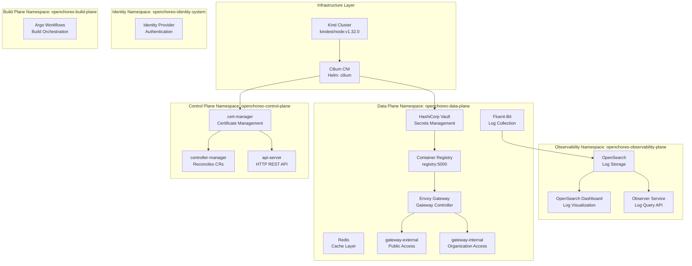
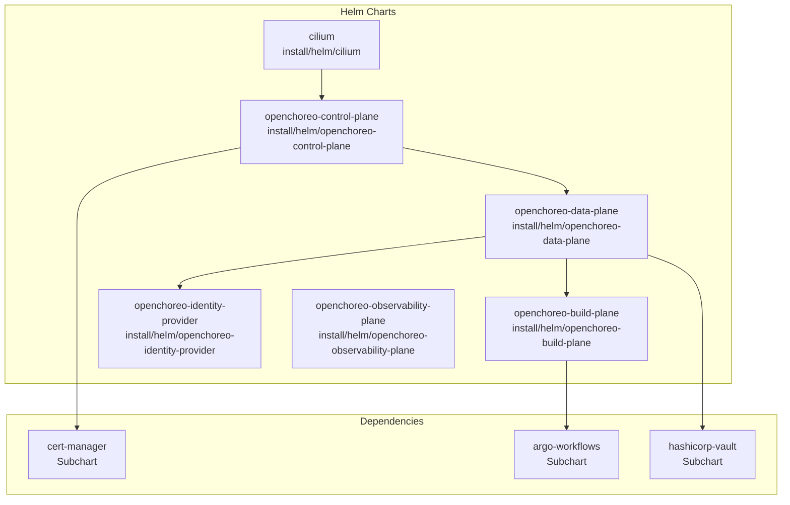
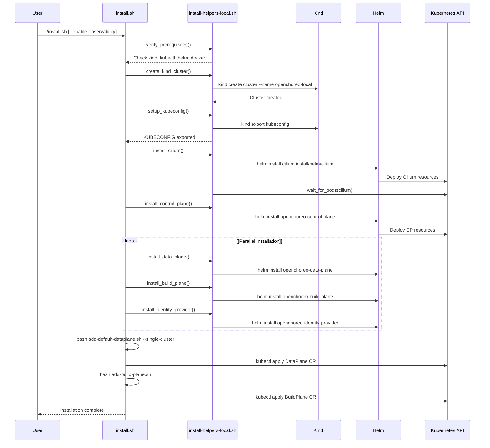
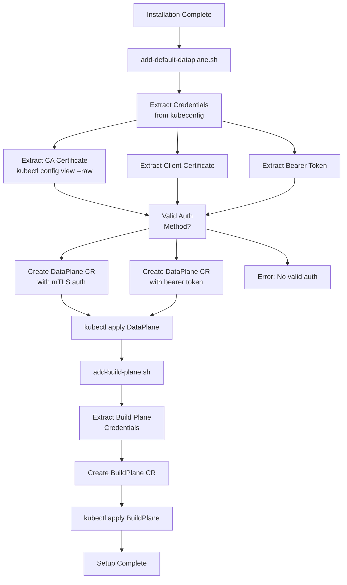
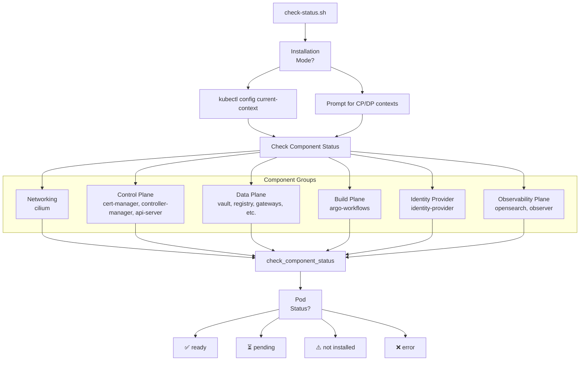

# Installation and Setup

> **Relevant source files**
> * [.github/CODEOWNERS](https://github.com/openchoreo/openchoreo/blob/a577e969/.github/CODEOWNERS)
> * [.github/ISSUE_TEMPLATE/01-bug-report.yml](https://github.com/openchoreo/openchoreo/blob/a577e969/.github/ISSUE_TEMPLATE/01-bug-report.yml)
> * [.github/ISSUE_TEMPLATE/02-task.yml](https://github.com/openchoreo/openchoreo/blob/a577e969/.github/ISSUE_TEMPLATE/02-task.yml)
> * [.github/ISSUE_TEMPLATE/03-release.md](https://github.com/openchoreo/openchoreo/blob/a577e969/.github/ISSUE_TEMPLATE/03-release.md)
> * [.github/pull_request_template.md](https://github.com/openchoreo/openchoreo/blob/a577e969/.github/pull_request_template.md)
> * [docs/contributors/README.md](https://github.com/openchoreo/openchoreo/blob/a577e969/docs/contributors/README.md)
> * [docs/contributors/contribute.md](https://github.com/openchoreo/openchoreo/blob/a577e969/docs/contributors/contribute.md)
> * [docs/contributors/release.md](https://github.com/openchoreo/openchoreo/blob/a577e969/docs/contributors/release.md)
> * [docs/install-guide-multi-cluster.md](https://github.com/openchoreo/openchoreo/blob/a577e969/docs/install-guide-multi-cluster.md)
> * [install/add-build-plane.sh](https://github.com/openchoreo/openchoreo/blob/a577e969/install/add-build-plane.sh)
> * [install/add-default-dataplane.sh](https://github.com/openchoreo/openchoreo/blob/a577e969/install/add-default-dataplane.sh)
> * [install/check-status.sh](https://github.com/openchoreo/openchoreo/blob/a577e969/install/check-status.sh)
> * [install/helm/cilium/.helmignore](https://github.com/openchoreo/openchoreo/blob/a577e969/install/helm/cilium/.helmignore)
> * [install/helm/cilium/templates/serviceaccount.yaml](https://github.com/openchoreo/openchoreo/blob/a577e969/install/helm/cilium/templates/serviceaccount.yaml)
> * [install/helm/cilium/templates/wait-for-cilium.yaml](https://github.com/openchoreo/openchoreo/blob/a577e969/install/helm/cilium/templates/wait-for-cilium.yaml)
> * [install/install-helpers-local.sh](https://github.com/openchoreo/openchoreo/blob/a577e969/install/install-helpers-local.sh)
> * [install/install.sh](https://github.com/openchoreo/openchoreo/blob/a577e969/install/install.sh)
> * [install/uninstall.sh](https://github.com/openchoreo/openchoreo/blob/a577e969/install/uninstall.sh)

## Purpose and Scope

This document provides an overview of OpenChoreo's installation and setup process, including the different installation approaches, component architecture, and post-installation configuration steps. It serves as a starting point for understanding how to deploy OpenChoreo in various environments.

For detailed step-by-step installation procedures, see:

* **[Installation Overview](/openchoreo/openchoreo/7.1-installation-overview)** - Prerequisites, installation approaches, and component details
* **[Multi-Cluster Installation](/openchoreo/openchoreo/7.2-multi-cluster-installation)** - Production-like setup with separate Control and Data Plane clusters
* **[Quick Start Installation](/openchoreo/openchoreo/7.3-quick-start-installation)** - Single-cluster containerized environment for evaluation
* **[Uninstallation](/openchoreo/openchoreo/7.4-uninstallation)** - Cleanup procedures

For setting up a development environment, see **[Development Environment Setup](/openchoreo/openchoreo/9.1-development-environment-setup)**.

## Installation Approaches

OpenChoreo supports three primary installation methods, each suited for different use cases:

| Approach | Use Case | Cluster Count | Script/Method |
| --- | --- | --- | --- |
| **Quick Start** | Evaluation, demos, learning | 1 (Kind) | `install/install.sh` |
| **Multi-Cluster** | Production-like, isolated planes | 2+ (Kind/K8s) | Manual Helm installation |
| **Development** | Local development, debugging | 1 (Kind) | `make dev-deploy` |

### Quick Start Installation

The quick start approach creates a single Kind cluster with all OpenChoreo components co-located. This method uses the installation script [install/install.sh L1-L159](https://github.com/openchoreo/openchoreo/blob/a577e969/install/install.sh#L1-L159)

 which orchestrates cluster creation, component installation, and configuration.

**Key characteristics:**

* Single Kind cluster named `openchoreo-local`
* All three planes (Control, Data, Build) in one cluster
* Automated setup with helper functions from [install/install-helpers-local.sh L1-L331](https://github.com/openchoreo/openchoreo/blob/a577e969/install/install-helpers-local.sh#L1-L331)
* Optional observability plane via `--enable-observability` flag
* Suitable for trying out samples and understanding OpenChoreo concepts

### Multi-Cluster Installation

The multi-cluster approach separates the Control Plane and Data Plane into distinct Kubernetes clusters, providing better isolation and mirroring production deployments. This method uses Helm charts directly and requires manual configuration.

**Key characteristics:**

* Separate clusters for Control Plane and Data Plane
* Cilium CNI required in Data Plane
* Manual Helm chart installation
* DataPlane and BuildPlane CRs configured via scripts
* Suitable for production-like testing and evaluation

### Development Installation

The development approach creates a single-cluster environment optimized for local development with hot-reloading capabilities. This method uses Makefile targets and allows running controllers locally.

**Key characteristics:**

* Kind cluster created via `kind create cluster --config=install/kind/kind-config.yaml`
* Components deployed via `make dev-deploy`
* Controllers can run locally outside the cluster
* Suitable for developing and debugging OpenChoreo itself

## Component Architecture

OpenChoreo installation involves deploying multiple components across different architectural planes. Understanding these components is essential for troubleshooting and configuration.

### Installation Component Diagram



**Sources:** [install/check-status.sh L20-L27](https://github.com/openchoreo/openchoreo/blob/a577e969/install/check-status.sh#L20-L27)

 [install/install-helpers-local.sh L22-L27](https://github.com/openchoreo/openchoreo/blob/a577e969/install/install-helpers-local.sh#L22-L27)

### Helm Chart Structure

OpenChoreo components are packaged as Helm charts with dependencies. The installation process deploys these charts in a specific order to satisfy dependencies.



**Sources:** [install/install.sh L73-L119](https://github.com/openchoreo/openchoreo/blob/a577e969/install/install.sh#L73-L119)

 [install/install-helpers-local.sh L236-L273](https://github.com/openchoreo/openchoreo/blob/a577e969/install/install-helpers-local.sh#L236-L273)

## Installation Flow

The installation process follows a structured flow with validation, cluster creation, component installation, and post-configuration steps.

### Quick Start Installation Flow



**Sources:** [install/install.sh L52-L159](https://github.com/openchoreo/openchoreo/blob/a577e969/install/install.sh#L52-L159)

 [install/install-helpers-local.sh L105-L273](https://github.com/openchoreo/openchoreo/blob/a577e969/install/install-helpers-local.sh#L105-L273)

### Installation Script Functions

The installation scripts are organized into modular functions that handle specific aspects of the setup:

| Function | File | Purpose |
| --- | --- | --- |
| `verify_prerequisites()` | [install/install-helpers-local.sh L294-L321](https://github.com/openchoreo/openchoreo/blob/a577e969/install/install-helpers-local.sh#L294-L321) | Validates required tools are installed |
| `create_kind_cluster()` | [install/install-helpers-local.sh L105-L140](https://github.com/openchoreo/openchoreo/blob/a577e969/install/install-helpers-local.sh#L105-L140) | Creates Kind cluster with configuration |
| `setup_kubeconfig()` | [install/install-helpers-local.sh L143-L156](https://github.com/openchoreo/openchoreo/blob/a577e969/install/install-helpers-local.sh#L143-L156) | Exports kubeconfig for cluster access |
| `install_helm_chart()` | [install/install-helpers-local.sh L159-L234](https://github.com/openchoreo/openchoreo/blob/a577e969/install/install-helpers-local.sh#L159-L234) | Generic Helm chart installation with idempotency |
| `wait_for_pods()` | [install/install-helpers-local.sh L70-L102](https://github.com/openchoreo/openchoreo/blob/a577e969/install/install-helpers-local.sh#L70-L102) | Polls until pods reach Ready state |
| `install_cilium()` | [install/install-helpers-local.sh L237-L241](https://github.com/openchoreo/openchoreo/blob/a577e969/install/install-helpers-local.sh#L237-L241) | Installs Cilium CNI |
| `install_control_plane()` | [install/install-helpers-local.sh L252-L255](https://github.com/openchoreo/openchoreo/blob/a577e969/install/install-helpers-local.sh#L252-L255) | Installs Control Plane components |
| `install_data_plane()` | [install/install-helpers-local.sh L244-L249](https://github.com/openchoreo/openchoreo/blob/a577e969/install/install-helpers-local.sh#L244-L249) | Installs Data Plane components |
| `install_build_plane()` | [install/install-helpers-local.sh L258-L261](https://github.com/openchoreo/openchoreo/blob/a577e969/install/install-helpers-local.sh#L258-L261) | Installs Build Plane components |
| `install_identity_provider()` | [install/install-helpers-local.sh L264-L267](https://github.com/openchoreo/openchoreo/blob/a577e969/install/install-helpers-local.sh#L264-L267) | Installs Identity Provider |
| `install_observability_plane()` | [install/install-helpers-local.sh L270-L273](https://github.com/openchoreo/openchoreo/blob/a577e969/install/install-helpers-local.sh#L270-L273) | Installs Observability stack (optional) |

**Sources:** [install/install-helpers-local.sh L29-L331](https://github.com/openchoreo/openchoreo/blob/a577e969/install/install-helpers-local.sh#L29-L331)

## Post-Installation Configuration

After component installation, OpenChoreo requires configuration of Custom Resources that define cluster connectivity and build capabilities.

### DataPlane Configuration

The DataPlane CR establishes connectivity between the Control Plane and Data Plane clusters. The script [install/add-default-dataplane.sh L1-L140](https://github.com/openchoreo/openchoreo/blob/a577e969/install/add-default-dataplane.sh#L1-L140)

 automates this by extracting credentials from kubeconfig and creating the CR.

**DataPlane CR Structure:**

```yaml
apiVersion: openchoreo.dev/v1alpha1
kind: DataPlane
metadata:
  name: default
  namespace: default
spec:
  registry:
    prefix: registry.openchoreo-data-plane:5000
  gateway:
    organizationVirtualHost: openchoreoapis.internal
    publicVirtualHost: openchoreoapis.localhost
  kubernetesCluster:
    server: <API_SERVER_URL>
    tls:
      ca:
        value: <BASE64_CA_CERT>
    auth:
      mtls:  # or bearerToken
        clientCert:
          value: <BASE64_CLIENT_CERT>
        clientKey:
          value: <BASE64_CLIENT_KEY>
```

**Configuration Modes:**

* **Single-cluster mode** (`--single-cluster`): Uses current kubeconfig context [install/add-default-dataplane.sh L25-L29](https://github.com/openchoreo/openchoreo/blob/a577e969/install/add-default-dataplane.sh#L25-L29)
* **Multi-cluster mode** (`--multi-cluster`): Prompts for DataPlane context [install/add-default-dataplane.sh L31-L39](https://github.com/openchoreo/openchoreo/blob/a577e969/install/add-default-dataplane.sh#L31-L39)

**Authentication Methods:**

* **mTLS**: Uses client certificates from kubeconfig [install/add-default-dataplane.sh L80-L87](https://github.com/openchoreo/openchoreo/blob/a577e969/install/add-default-dataplane.sh#L80-L87)
* **Bearer Token**: Uses service account token [install/add-default-dataplane.sh L88-L92](https://github.com/openchoreo/openchoreo/blob/a577e969/install/add-default-dataplane.sh#L88-L92)

### BuildPlane Configuration

The BuildPlane CR establishes connectivity to the cluster running Argo Workflows. The script [install/add-build-plane.sh L1-L125](https://github.com/openchoreo/openchoreo/blob/a577e969/install/add-build-plane.sh#L1-L125)

 follows a similar pattern to DataPlane configuration.

**BuildPlane CR Structure:**

```yaml
apiVersion: openchoreo.dev/v1alpha1
kind: BuildPlane
metadata:
  name: default
  namespace: default
spec:
  kubernetesCluster:
    server: <API_SERVER_URL>
    tls:
      ca:
        value: <BASE64_CA_CERT>
    auth:
      mtls:  # or bearerToken
        clientCert:
          value: <BASE64_CLIENT_CERT>
        clientKey:
          value: <BASE64_CLIENT_KEY>
```

**Sources:** [install/add-build-plane.sh L101-L118](https://github.com/openchoreo/openchoreo/blob/a577e969/install/add-build-plane.sh#L101-L118)

### Configuration Flow Diagram



**Sources:** [install/add-default-dataplane.sh L42-L96](https://github.com/openchoreo/openchoreo/blob/a577e969/install/add-default-dataplane.sh#L42-L96)

 [install/add-build-plane.sh L37-L96](https://github.com/openchoreo/openchoreo/blob/a577e969/install/add-build-plane.sh#L37-L96)

 [install/install.sh L139-L150](https://github.com/openchoreo/openchoreo/blob/a577e969/install/install.sh#L139-L150)

## Installation Validation

After installation, the system status can be verified using the status checking script, which inspects pod readiness across all namespaces.

### Status Checking Architecture



**Component Status Mapping:**
The script uses label selectors to identify components [install/check-status.sh L72-L93](https://github.com/openchoreo/openchoreo/blob/a577e969/install/check-status.sh#L72-L93)

:

| Component | Namespace | Label Selector |
| --- | --- | --- |
| `cilium` | `cilium` | `k8s-app=cilium` |
| `controller_manager` | `openchoreo-control-plane` | `app.kubernetes.io/component=controller-manager` |
| `api_server` | `openchoreo-control-plane` | `app.kubernetes.io/component=api-server` |
| `vault` | `openchoreo-data-plane` | `app.kubernetes.io/name=hashicorp-vault` |
| `registry` | `openchoreo-data-plane` | `app=registry` |
| `external_gateway` | `openchoreo-data-plane` | `gateway.envoyproxy.io/owning-gateway-name=gateway-external` |
| `build_plane` | `openchoreo-build-plane` | `app.kubernetes.io/name=argo` |

**Status Check Function:**
The `check_component_status()` function [install/check-status.sh L103-L141](https://github.com/openchoreo/openchoreo/blob/a577e969/install/check-status.sh#L103-L141)

 performs the following:

1. Retrieves component configuration (namespace and label selector)
2. Checks if namespace exists
3. Queries pods with matching labels
4. Evaluates pod Ready condition
5. Returns status: `ready`, `pending`, `not installed`, `not started`, or `unknown`

**Sources:** [install/check-status.sh L1-L349](https://github.com/openchoreo/openchoreo/blob/a577e969/install/check-status.sh#L1-L349)

## Prerequisites

All installation approaches require the following tools:

| Tool | Minimum Version | Used For |
| --- | --- | --- |
| `kind` | v0.27.0+ | Creating local Kubernetes clusters |
| `kubectl` | v1.32.0+ | Kubernetes cluster management |
| `helm` | v3.15+ | Installing OpenChoreo components |
| `docker` | 23.0+ | Container runtime for Kind |

The `verify_prerequisites()` function [install/install-helpers-local.sh L294-L321](https://github.com/openchoreo/openchoreo/blob/a577e969/install/install-helpers-local.sh#L294-L321)

 validates these tools are installed before proceeding.

For development, additional tools are required:

* Go v1.24.0+
* Make v3.81+

**Sources:** [install/install-helpers-local.sh L294-L321](https://github.com/openchoreo/openchoreo/blob/a577e969/install/install-helpers-local.sh#L294-L321)

 [docs/install-guide-multi-cluster.md L20-L39](https://github.com/openchoreo/openchoreo/blob/a577e969/docs/install-guide-multi-cluster.md#L20-L39)

 [docs/contributors/contribute.md L3-L10](https://github.com/openchoreo/openchoreo/blob/a577e969/docs/contributors/contribute.md#L3-L10)

## Common Configuration Parameters

The installation scripts accept several configuration parameters:

### install.sh Flags

| Flag | Description | Default |
| --- | --- | --- |
| `--enable-observability` | Install OpenSearch observability stack | `false` |
| `--skip-status-check` | Skip post-installation status verification | `false` |
| `--openchoreo-version` | Specify OpenChoreo version to install | `latest` |

**Sources:** [install/install.sh L11-L50](https://github.com/openchoreo/openchoreo/blob/a577e969/install/install.sh#L11-L50)

### Environment Variables

| Variable | Purpose | Default |
| --- | --- | --- |
| `CLUSTER_NAME` | Name of Kind cluster | `openchoreo-local` |
| `NODE_IMAGE` | Kind node image | `kindest/node:v1.32.0` |
| `KUBECONFIG_PATH` | Path for kubeconfig file | `~/.kube/config-openchoreo-local` |
| `OPENCHOREO_VERSION` | OpenChoreo version to install | `latest` |

**Sources:** [install/install-helpers-local.sh L15-L19](https://github.com/openchoreo/openchoreo/blob/a577e969/install/install-helpers-local.sh#L15-L19)

## Next Steps

After completing installation:

1. **Verify Installation**: Run the status check script to ensure all components are ready * Single-cluster: `bash install/check-status.sh` * Multi-cluster: `bash install/check-status.sh --multi-cluster`
2. **Install CLI**: Install `choreoctl` for interacting with OpenChoreo (see **[choreoctl Commands](/openchoreo/openchoreo/8.1-choreoctl-commands)**)
3. **Deploy Applications**: Try deploying sample applications (see **[Deploying Applications](/openchoreo/openchoreo/8.2-deploying-applications)**)
4. **Configure Observability**: Optionally enable logging and monitoring (see **[Observability](/openchoreo/openchoreo/10-observability)**)

For detailed installation instructions specific to your deployment approach, refer to the appropriate sub-page:

* **[Multi-Cluster Installation](/openchoreo/openchoreo/7.2-multi-cluster-installation)** for production-like setups
* **[Quick Start Installation](/openchoreo/openchoreo/7.3-quick-start-installation)** for evaluation environments
* **[Development Environment Setup](/openchoreo/openchoreo/9.1-development-environment-setup)** for contributing to OpenChoreo

**Sources:** [install/install.sh L129-L159](https://github.com/openchoreo/openchoreo/blob/a577e969/install/install.sh#L129-L159)

 [docs/install-guide-multi-cluster.md L107-L295](https://github.com/openchoreo/openchoreo/blob/a577e969/docs/install-guide-multi-cluster.md#L107-L295)