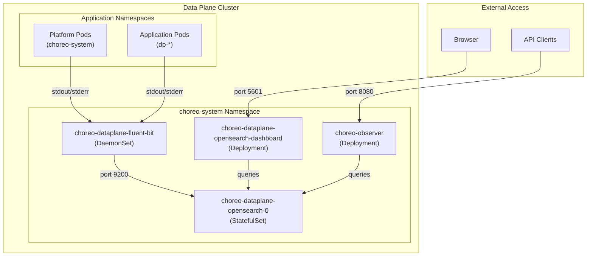
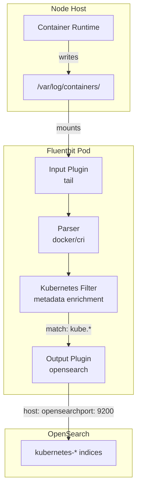
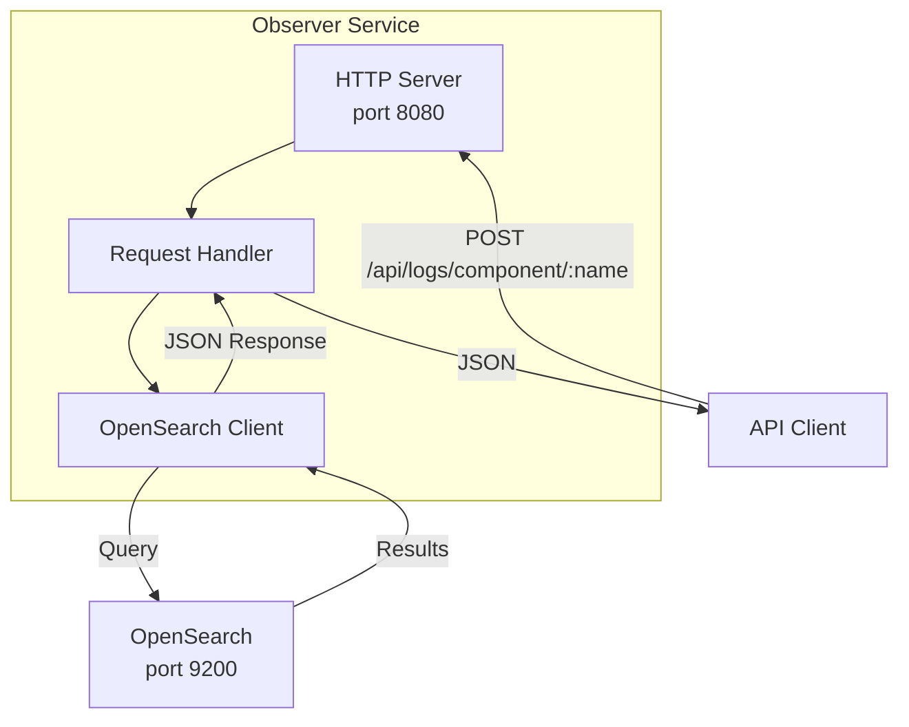

# Logging Architecture

> **Relevant source files**
> * [Makefile](https://github.com/openchoreo/openchoreo/blob/a577e969/Makefile)
> * [cmd/choreoctl/Dockerfile](https://github.com/openchoreo/openchoreo/blob/a577e969/cmd/choreoctl/Dockerfile)
> * [cmd/observer/Dockerfile](https://github.com/openchoreo/openchoreo/blob/a577e969/cmd/observer/Dockerfile)
> * [docs/observability-logging.md](https://github.com/openchoreo/openchoreo/blob/a577e969/docs/observability-logging.md)
> * [install/helm/openchoreo-identity-provider/templates/post-install-hook.yaml](https://github.com/openchoreo/openchoreo/blob/a577e969/install/helm/openchoreo-identity-provider/templates/post-install-hook.yaml)
> * [make/common.mk](https://github.com/openchoreo/openchoreo/blob/a577e969/make/common.mk)
> * [make/docker.mk](https://github.com/openchoreo/openchoreo/blob/a577e969/make/docker.mk)
> * [make/golang.mk](https://github.com/openchoreo/openchoreo/blob/a577e969/make/golang.mk)
> * [make/kube.mk](https://github.com/openchoreo/openchoreo/blob/a577e969/make/kube.mk)
> * [make/lint.mk](https://github.com/openchoreo/openchoreo/blob/a577e969/make/lint.mk)
> * [make/tools.mk](https://github.com/openchoreo/openchoreo/blob/a577e969/make/tools.mk)

## Purpose and Scope

This document describes OpenChoreo's logging architecture, which provides centralized log collection, storage, and querying capabilities for both platform components and deployed applications. The system uses Fluentbit for log collection, OpenSearch for storage and indexing, and a custom Observer service for programmatic log access.

For information about other observability features such as metrics and tracing, refer to the parent [Observability](/openchoreo/openchoreo/10-observability) section. For details on how to deploy and manage applications that generate logs, see [Deploying Applications](/openchoreo/openchoreo/8.2-deploying-applications).

## Architecture Overview

OpenChoreo's logging architecture consists of three primary components deployed in the Data Plane cluster:

| Component | Type | Purpose |
| --- | --- | --- |
| **Fluentbit** | DaemonSet | Collects logs from all pods and forwards to OpenSearch |
| **OpenSearch** | StatefulSet | Stores, indexes, and enables searching of logs |
| **Observer** | Deployment/Service | Provides REST API for programmatic log queries |

The logging stack is deployed as part of the `choreo-dataplane` Helm chart and can be enabled via the `observability.logging.enabled` value. By default, this feature is disabled to reduce resource consumption.



**Diagram: Overall Logging Architecture**

Sources: [docs/observability-logging.md L1-L171](https://github.com/openchoreo/openchoreo/blob/a577e969/docs/observability-logging.md#L1-L171)

 [make/docker.mk L32](https://github.com/openchoreo/openchoreo/blob/a577e969/make/docker.mk#L32-L32)

 [cmd/observer/Dockerfile L1-L26](https://github.com/openchoreo/openchoreo/blob/a577e969/cmd/observer/Dockerfile#L1-L26)

## Log Collection Pipeline

### Fluentbit Configuration

Fluentbit runs as a DaemonSet with one pod per node, collecting logs from `/var/log/containers/` on the host filesystem. The collection is configured to:

**Included Namespaces:**

* `choreo-system` - Captures all operational components of the choreo dataplane
* `dp-*` - Captures all application logs from deployed components

**Excluded Pods:**

* `*opensearch-0*` - Prevents recursive log collection from OpenSearch
* `*opensearch-dashboard*` - Excludes dashboard logs
* `*fluent-bit*` - Excludes Fluentbit's own logs

The configuration is defined in Helm templates at `install/helm/choreo-dataplane/templates` with values specified in `install/helm/choreo-dataplane/values.yaml`.



**Diagram: Log Collection Flow**

The Fluentbit configuration follows this pattern:

```yaml
input:
  path: "/var/log/containers/*_choreo-system_*.log,/var/log/containers/*_dp-*_*.log"
  excludePath: "/var/log/containers/*opensearch-0*_choreo-system_*.log,..."

output:
  name: opensearch
  match: "kube.*"
  host: opensearch
  port: 9200
```

Sources: [docs/observability-logging.md L34-L70](https://github.com/openchoreo/openchoreo/blob/a577e969/docs/observability-logging.md#L34-L70)

### Kubernetes Metadata Enrichment

Fluentbit's Kubernetes filter plugin automatically enriches each log entry with metadata:

| Field | Description |
| --- | --- |
| `kubernetes.namespace_name` | Namespace where the pod runs |
| `kubernetes.pod_name` | Name of the pod |
| `kubernetes.container_name` | Name of the container |
| `kubernetes.labels` | All pod labels as key-value pairs |
| `kubernetes.annotations` | All pod annotations |
| `@timestamp` | Timestamp when the log was collected |

This metadata enables filtering and searching logs by component, environment, or other organizational attributes.

Sources: [docs/observability-logging.md L122-L147](https://github.com/openchoreo/openchoreo/blob/a577e969/docs/observability-logging.md#L122-L147)

## OpenSearch Storage

### Deployment Architecture

OpenSearch is deployed as a StatefulSet with a single replica (`choreo-dataplane-opensearch-0`) in the `choreo-system` namespace. The service exposes:

* **Port 9200**: REST API for log ingestion and queries
* **Port 9600**: Performance analyzer metrics (internal)

Logs are stored in indices with the pattern `kubernetes-*`, created automatically by Fluentbit's OpenSearch output plugin.

### Index Pattern Configuration

To query logs through the OpenSearch Dashboard, an index pattern must be created:

* **Pattern**: `kubernetes*`
* **Time Field**: `@timestamp`

This can be created programmatically:

```
curl -X POST "http://localhost:5601/api/saved_objects/index-pattern" \
  -H "Content-Type: application/json" \
  -H "osd-xsrf: true" \
  -u "admin:admin" \
  -d '{
    "attributes": {
      "title": "kubernetes*",
      "timeFieldName": "@timestamp"
    }
  }'
```

Sources: [docs/observability-logging.md L86-L121](https://github.com/openchoreo/openchoreo/blob/a577e969/docs/observability-logging.md#L86-L121)

## Observer Service

### Service Architecture

The Observer service (`choreo-observer`) provides a REST API for programmatic access to logs. It is built as a separate Go binary and deployed as a Docker container.



**Diagram: Observer Service Architecture**

The Observer service is built using:

* Binary: `observer` from [cmd/observer/main.go](https://github.com/openchoreo/openchoreo/blob/a577e969/cmd/observer/main.go)
* Docker Image: `ghcr.io/openchoreo/observer`
* Exposed Port: 8080

Sources: [cmd/observer/Dockerfile L1-L26](https://github.com/openchoreo/openchoreo/blob/a577e969/cmd/observer/Dockerfile#L1-L26)

 [make/docker.mk L32](https://github.com/openchoreo/openchoreo/blob/a577e969/make/docker.mk#L32-L32)

### API Endpoints

#### Component Logs Query

**Endpoint**: `POST /api/logs/component/{componentName}`

**Request Body**:

```json
{
  "startTime": "2025-07-02T18:40:00Z",
  "endTime": "2025-07-02T18:50:00Z",
  "environmentId": "development",
  "logLevels": ["ERROR", "WARN", "INFO"],
  "limit": 10
}
```

**Query Parameters**:

| Parameter | Type | Required | Description |
| --- | --- | --- | --- |
| `startTime` | ISO8601 | Yes | Start of time window |
| `endTime` | ISO8601 | Yes | End of time window |
| `environmentId` | string | Yes | Environment identifier (e.g., "development") |
| `logLevels` | array[string] | No | Filter by log level |
| `limit` | integer | No | Maximum number of results |

**Example Usage**:

```go
kubectl port-forward svc/choreo-observer 8080:8080 -n choreo-system

curl -X POST http://localhost:8080/api/logs/component/greeting-service-go \
  -H "Content-Type: application/json" \
  -d '{
    "startTime": "2025-07-02T18:40:00Z",
    "endTime": "2025-07-02T18:50:00Z",
    "environmentId": "development",
    "logLevels": ["ERROR"],
    "limit": 10
  }'
```

The Observer service translates this request into an OpenSearch query that filters by:

1. Component name (from URL parameter)
2. Namespace derived from environment ID
3. Time range from `@timestamp` field
4. Log level (if specified)

Sources: [docs/observability-logging.md L148-L170](https://github.com/openchoreo/openchoreo/blob/a577e969/docs/observability-logging.md#L148-L170)

## OpenSearch Dashboard Access

The OpenSearch Dashboard provides a web-based interface for exploring logs interactively.

### Access Steps

1. **Identify the Dashboard Pod**:

```markdown
kubectl get pods -n choreo-system | grep opensearch-dashboard
# Output: choreo-dataplane-opensearch-dashboard-xxxxx-xxxxx
```

1. **Port Forward**:

```
kubectl port-forward pod/<dashboard-pod-name> 5601:5601 -n choreo-system
```

1. **Access**: Navigate to `http://localhost:5601`
2. **Default Credentials**: `admin:admin`

### Querying Application Logs

To view logs for a specific deployed application:

1. Determine the namespace pattern: `dp-<org>-<project>-<environment>-<hash>` ```markdown kubectl get namespaces | grep dp- # Example: dp-default-org-default-proje-development-39faf2d8 ```
2. In the Dashboard's "Discover" view, create a filter: ``` kubernetes.namespace_name:dp-default-org-default-proje-development-39faf2d8 ```
3. Use the search bar to filter by log content: ```yaml log:"Error" OR log:"Exception" ```
4. Adjust the time range selector to view logs within a specific window

Sources: [docs/observability-logging.md L86-L147](https://github.com/openchoreo/openchoreo/blob/a577e969/docs/observability-logging.md#L86-L147)

## Configuration and Customization

### Helm Chart Values

Logging is configured via the `choreo-dataplane` Helm chart. Key values:

```yaml
observability:
  logging:
    enabled: false  # Set to true to enable logging stack

observer:
  image:
    tag: latest-dev  # Observer service image tag
```

**Installation with Logging Enabled**:

Single cluster:

```csharp
helm upgrade --install choreo-dataplane oci://ghcr.io/openchoreo/helm-charts/choreo-dataplane \
  --kube-context kind-choreo \
  --namespace "choreo-system" \
  --create-namespace \
  --set observability.logging.enabled=true \
  --set observer.image.tag=latest-dev \
  --timeout 30m
```

Multi-cluster (requires minimum 4 CPU and 8GB memory):

```csharp
helm upgrade --install choreo-dataplane oci://ghcr.io/openchoreo/helm-charts/choreo-dataplane \
  --kube-context kind-choreo-dp \
  --namespace "choreo-system" \
  --create-namespace \
  --set observability.logging.enabled=true \
  --timeout 30m
```

Sources: [docs/observability-logging.md L6-L31](https://github.com/openchoreo/openchoreo/blob/a577e969/docs/observability-logging.md#L6-L31)

### Customizing Log Collection

The Fluentbit configuration can be customized by modifying values in `install/helm/choreo-dataplane/values.yaml`:

**Include/Exclude Paths**:

```yaml
fluentbit:
  input:
    path: "/var/log/containers/*_choreo-system_*.log,/var/log/containers/*_dp-*_*.log"
    excludePath: "/var/log/containers/*opensearch-0*_choreo-system_*.log,..."
```

**Output Configuration**:

```yaml
fluentbit:
  output:
    name: opensearch
    match: "kube.*"
    host: opensearch
    port: 9200
```

**Additional Filters**:
Custom Fluentbit filters can be added under the `fluentbit.filters` section to transform or enrich logs before they reach OpenSearch.

Sources: [docs/observability-logging.md L47-L70](https://github.com/openchoreo/openchoreo/blob/a577e969/docs/observability-logging.md#L47-L70)

## Deployment Verification

After installing the dataplane with logging enabled, verify the components are running:

```
kubectl get pods -n choreo-system
```

Expected pods:

```
NAME                                                  READY   STATUS
choreo-dataplane-fluent-bit-xxxxx                    1/1     Running
choreo-dataplane-opensearch-0                        1/1     Running
choreo-dataplane-opensearch-dashboard-xxxxx-xxxxx    1/1     Running
choreo-observer-xxxxx-xxxxx                          1/1     Running
```

All pods should be in `Running` status with `1/1` ready containers.

Sources: [docs/observability-logging.md L72-L84](https://github.com/openchoreo/openchoreo/blob/a577e969/docs/observability-logging.md#L72-L84)

## Resource Requirements

The logging stack has significant resource requirements:

* **Minimum for Multi-Cluster**: 4 CPU cores, 8GB memory
* **OpenSearch**: Primary consumer of resources (indexing, storage)
* **Fluentbit**: One pod per node (minimal overhead per pod)
* **Observer**: Lightweight Go service with minimal resource needs

For development or single-cluster setups, the logging feature is disabled by default to conserve resources. Enable it only when log analysis is required.

Sources: [docs/observability-logging.md L22-L24](https://github.com/openchoreo/openchoreo/blob/a577e969/docs/observability-logging.md#L22-L24)