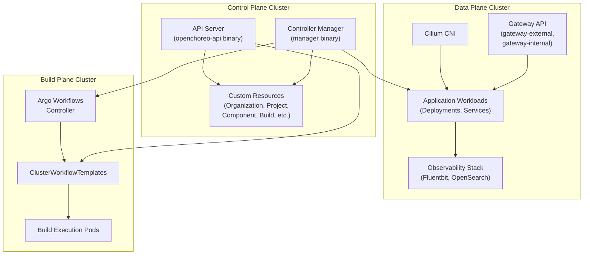
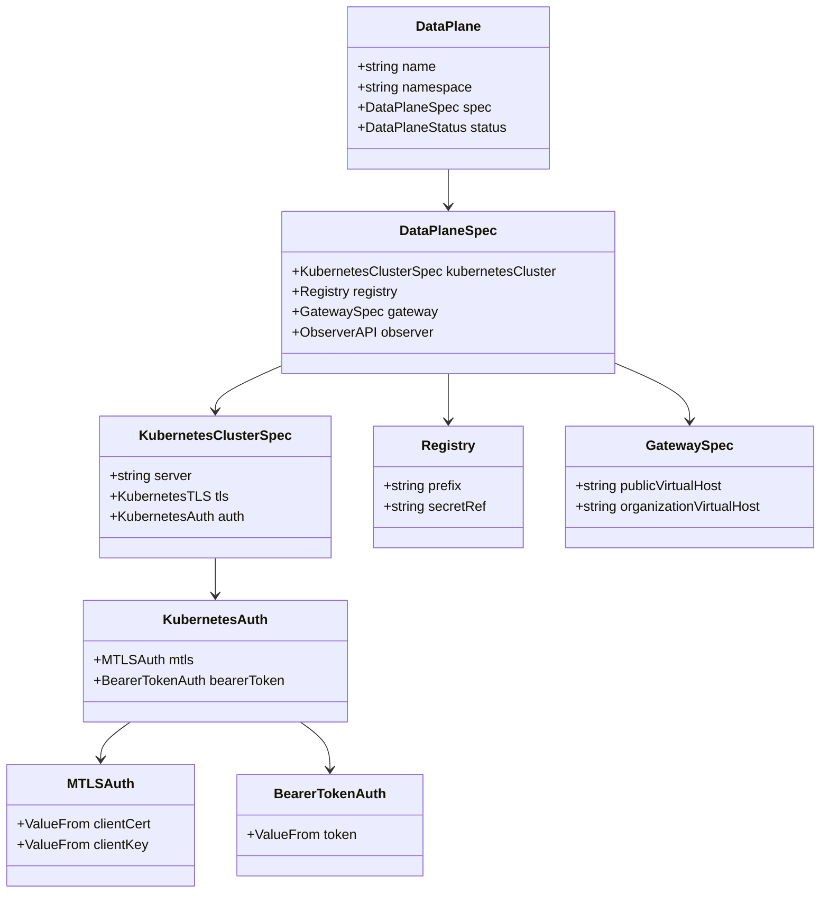
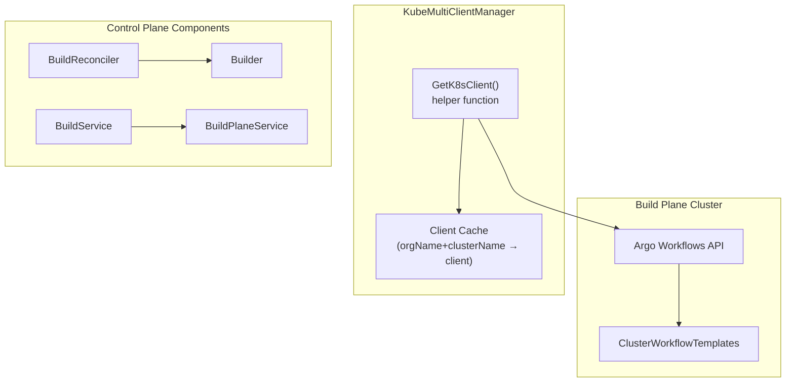
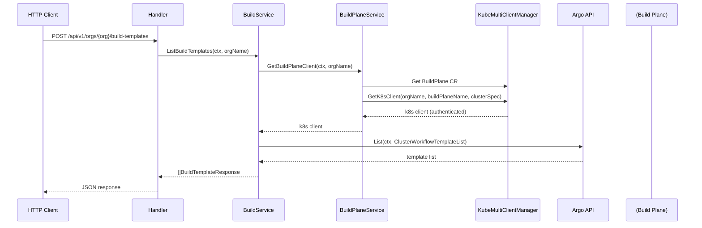
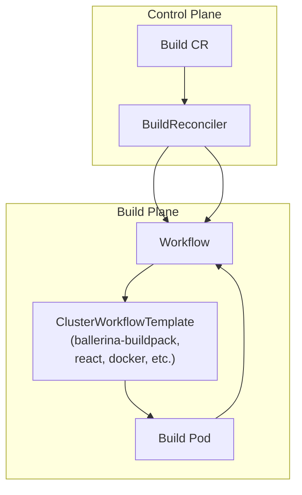
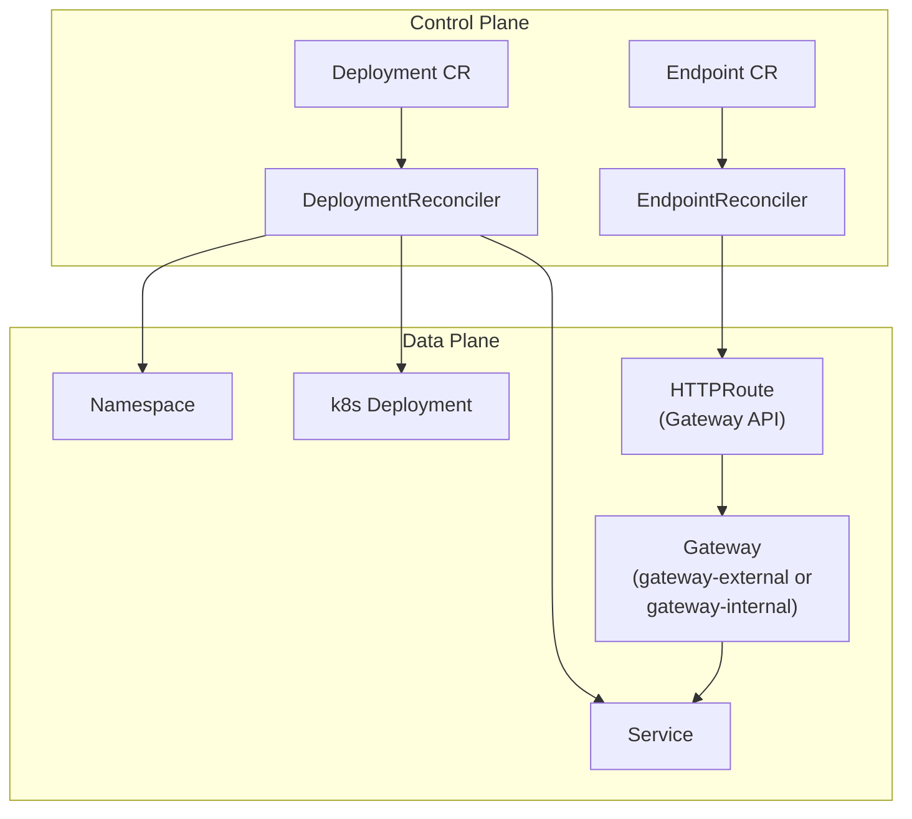

# Multi-Cluster Architecture

> **Relevant source files**
> * [.github/CODEOWNERS](https://github.com/openchoreo/openchoreo/blob/a577e969/.github/CODEOWNERS)
> * [.github/ISSUE_TEMPLATE/01-bug-report.yml](https://github.com/openchoreo/openchoreo/blob/a577e969/.github/ISSUE_TEMPLATE/01-bug-report.yml)
> * [.github/ISSUE_TEMPLATE/02-task.yml](https://github.com/openchoreo/openchoreo/blob/a577e969/.github/ISSUE_TEMPLATE/02-task.yml)
> * [.github/ISSUE_TEMPLATE/03-release.md](https://github.com/openchoreo/openchoreo/blob/a577e969/.github/ISSUE_TEMPLATE/03-release.md)
> * [.github/pull_request_template.md](https://github.com/openchoreo/openchoreo/blob/a577e969/.github/pull_request_template.md)
> * [cmd/openchoreo-api/main.go](https://github.com/openchoreo/openchoreo/blob/a577e969/cmd/openchoreo-api/main.go)
> * [docs/contributors/README.md](https://github.com/openchoreo/openchoreo/blob/a577e969/docs/contributors/README.md)
> * [docs/contributors/contribute.md](https://github.com/openchoreo/openchoreo/blob/a577e969/docs/contributors/contribute.md)
> * [docs/contributors/release.md](https://github.com/openchoreo/openchoreo/blob/a577e969/docs/contributors/release.md)
> * [docs/install-guide-multi-cluster.md](https://github.com/openchoreo/openchoreo/blob/a577e969/docs/install-guide-multi-cluster.md)
> * [install/add-build-plane.sh](https://github.com/openchoreo/openchoreo/blob/a577e969/install/add-build-plane.sh)
> * [install/add-default-dataplane.sh](https://github.com/openchoreo/openchoreo/blob/a577e969/install/add-default-dataplane.sh)
> * [install/check-status.sh](https://github.com/openchoreo/openchoreo/blob/a577e969/install/check-status.sh)
> * [install/helm/cilium/.helmignore](https://github.com/openchoreo/openchoreo/blob/a577e969/install/helm/cilium/.helmignore)
> * [install/helm/cilium/templates/serviceaccount.yaml](https://github.com/openchoreo/openchoreo/blob/a577e969/install/helm/cilium/templates/serviceaccount.yaml)
> * [install/helm/cilium/templates/wait-for-cilium.yaml](https://github.com/openchoreo/openchoreo/blob/a577e969/install/helm/cilium/templates/wait-for-cilium.yaml)
> * [install/install-helpers-local.sh](https://github.com/openchoreo/openchoreo/blob/a577e969/install/install-helpers-local.sh)
> * [install/install.sh](https://github.com/openchoreo/openchoreo/blob/a577e969/install/install.sh)
> * [install/uninstall.sh](https://github.com/openchoreo/openchoreo/blob/a577e969/install/uninstall.sh)
> * [internal/choreoctl/resources/kinds/dataplane.go](https://github.com/openchoreo/openchoreo/blob/a577e969/internal/choreoctl/resources/kinds/dataplane.go)
> * [internal/openchoreo-api/clients/k8s.go](https://github.com/openchoreo/openchoreo/blob/a577e969/internal/openchoreo-api/clients/k8s.go)
> * [internal/openchoreo-api/handlers/apply.go](https://github.com/openchoreo/openchoreo/blob/a577e969/internal/openchoreo-api/handlers/apply.go)
> * [internal/openchoreo-api/handlers/buildplanes.go](https://github.com/openchoreo/openchoreo/blob/a577e969/internal/openchoreo-api/handlers/buildplanes.go)
> * [internal/openchoreo-api/handlers/builds.go](https://github.com/openchoreo/openchoreo/blob/a577e969/internal/openchoreo-api/handlers/builds.go)
> * [internal/openchoreo-api/handlers/components.go](https://github.com/openchoreo/openchoreo/blob/a577e969/internal/openchoreo-api/handlers/components.go)
> * [internal/openchoreo-api/handlers/dataplanes.go](https://github.com/openchoreo/openchoreo/blob/a577e969/internal/openchoreo-api/handlers/dataplanes.go)
> * [internal/openchoreo-api/handlers/environments.go](https://github.com/openchoreo/openchoreo/blob/a577e969/internal/openchoreo-api/handlers/environments.go)
> * [internal/openchoreo-api/handlers/handlers.go](https://github.com/openchoreo/openchoreo/blob/a577e969/internal/openchoreo-api/handlers/handlers.go)
> * [internal/openchoreo-api/handlers/helpers.go](https://github.com/openchoreo/openchoreo/blob/a577e969/internal/openchoreo-api/handlers/helpers.go)
> * [internal/openchoreo-api/handlers/organizations.go](https://github.com/openchoreo/openchoreo/blob/a577e969/internal/openchoreo-api/handlers/organizations.go)
> * [internal/openchoreo-api/handlers/workloads.go](https://github.com/openchoreo/openchoreo/blob/a577e969/internal/openchoreo-api/handlers/workloads.go)
> * [internal/openchoreo-api/models/request.go](https://github.com/openchoreo/openchoreo/blob/a577e969/internal/openchoreo-api/models/request.go)
> * [internal/openchoreo-api/models/response.go](https://github.com/openchoreo/openchoreo/blob/a577e969/internal/openchoreo-api/models/response.go)
> * [internal/openchoreo-api/services/build_service.go](https://github.com/openchoreo/openchoreo/blob/a577e969/internal/openchoreo-api/services/build_service.go)
> * [internal/openchoreo-api/services/buildplane_service.go](https://github.com/openchoreo/openchoreo/blob/a577e969/internal/openchoreo-api/services/buildplane_service.go)
> * [internal/openchoreo-api/services/component_service.go](https://github.com/openchoreo/openchoreo/blob/a577e969/internal/openchoreo-api/services/component_service.go)
> * [internal/openchoreo-api/services/dataplane_service.go](https://github.com/openchoreo/openchoreo/blob/a577e969/internal/openchoreo-api/services/dataplane_service.go)
> * [internal/openchoreo-api/services/environment_service.go](https://github.com/openchoreo/openchoreo/blob/a577e969/internal/openchoreo-api/services/environment_service.go)
> * [internal/openchoreo-api/services/errors.go](https://github.com/openchoreo/openchoreo/blob/a577e969/internal/openchoreo-api/services/errors.go)
> * [internal/openchoreo-api/services/organization_service.go](https://github.com/openchoreo/openchoreo/blob/a577e969/internal/openchoreo-api/services/organization_service.go)
> * [internal/openchoreo-api/services/project_service.go](https://github.com/openchoreo/openchoreo/blob/a577e969/internal/openchoreo-api/services/project_service.go)
> * [internal/openchoreo-api/services/services.go](https://github.com/openchoreo/openchoreo/blob/a577e969/internal/openchoreo-api/services/services.go)

## Purpose and Scope

This document explains OpenChoreo's multi-cluster architecture, which separates concerns across three distinct Kubernetes clusters: the Control Plane, Build Plane, and Data Plane. It covers how these clusters communicate, the Custom Resource Definitions that represent remote clusters, and the client management system that enables cross-cluster operations.

For information about the individual controllers running in the Control Plane, see [Controller Manager](/openchoreo/openchoreo/2.4-controller-manager). For details about the Cell-based runtime model that executes in the Data Plane, see [Cell Runtime Model](/openchoreo/openchoreo/2.2-cell-runtime-model).

---

## Architectural Overview

OpenChoreo implements a **three-plane architecture** where each plane is physically isolated in its own Kubernetes cluster. This separation provides:

* **Isolation**: Build workloads, application workloads, and control logic run in separate failure domains
* **Security**: Each plane can have distinct network policies, RBAC configurations, and access controls
* **Scalability**: Each plane can be scaled independently based on workload characteristics
* **Multi-tenancy**: Multiple data planes can be managed by a single control plane, enabling tenant isolation



**Diagram 1: Three-Plane Architecture**

Sources: High-level diagrams from context, [internal/openchoreo-api/services/buildplane_service.go L60-L83](https://github.com/openchoreo/openchoreo/blob/a577e969/internal/openchoreo-api/services/buildplane_service.go#L60-L83)

 [internal/openchoreo-api/services/dataplane_service.go L1-L244](https://github.com/openchoreo/openchoreo/blob/a577e969/internal/openchoreo-api/services/dataplane_service.go#L1-L244)

---

## Cluster Specifications as Custom Resources

Remote clusters (Build Plane and Data Plane) are represented as Custom Resources in the Control Plane. This allows the control plane to maintain cluster credentials and configurations declaratively.

### DataPlane Custom Resource

The `DataPlane` CRD defines how the control plane connects to a data plane cluster:

| Field | Description |
| --- | --- |
| `spec.kubernetesCluster.server` | API server URL of the target cluster |
| `spec.kubernetesCluster.tls.ca` | Base64-encoded CA certificate |
| `spec.kubernetesCluster.auth` | Authentication configuration (mTLS or bearer token) |
| `spec.registry.prefix` | Container registry prefix for images |
| `spec.gateway.publicVirtualHost` | Virtual host for public endpoints |
| `spec.gateway.organizationVirtualHost` | Virtual host for organization-scoped endpoints |
| `spec.observer` | Optional observability endpoint configuration |



**Diagram 2: DataPlane CRD Structure**

Sources: [api/v1alpha1/dataplane_types.go](https://github.com/openchoreo/openchoreo/blob/a577e969/api/v1alpha1/dataplane_types.go)

 (implied from usage), [internal/openchoreo-api/services/dataplane_service.go L126-L199](https://github.com/openchoreo/openchoreo/blob/a577e969/internal/openchoreo-api/services/dataplane_service.go#L126-L199)

 [install/add-default-dataplane.sh L107-L139](https://github.com/openchoreo/openchoreo/blob/a577e969/install/add-default-dataplane.sh#L107-L139)

### BuildPlane Custom Resource

The `BuildPlane` CRD defines how the control plane connects to a build plane cluster. It has a similar structure to `DataPlane` but without the gateway and registry configurations:

| Field | Description |
| --- | --- |
| `spec.kubernetesCluster.server` | API server URL |
| `spec.kubernetesCluster.tls.ca` | Base64-encoded CA certificate |
| `spec.kubernetesCluster.auth` | Authentication configuration |
| `spec.observer` | Optional build observability endpoint |

Sources: [internal/openchoreo-api/services/buildplane_service.go L36-L58](https://github.com/openchoreo/openchoreo/blob/a577e969/internal/openchoreo-api/services/buildplane_service.go#L36-L58)

 [install/add-build-plane.sh L101-L124](https://github.com/openchoreo/openchoreo/blob/a577e969/install/add-build-plane.sh#L101-L124)

---

## Cross-Cluster Communication

The **KubeMultiClientManager** is the central abstraction that enables controllers and services to communicate with remote clusters. It manages a pool of Kubernetes clients, each authenticated to a specific cluster.

### KubeMultiClientManager Architecture



**Diagram 3: KubeMultiClientManager Flow**

The client manager follows this workflow:

1. A service (e.g., `BuildService`) needs to interact with a remote cluster
2. It calls `BuildPlaneService.GetBuildPlaneClient()` with an organization name
3. `BuildPlaneService` retrieves the `BuildPlane` CR from the control plane
4. It extracts `KubernetesClusterSpec` containing server URL and credentials
5. It calls `kubernetesClient.GetK8sClient()` with the client manager and cluster spec
6. The helper function creates or retrieves a cached Kubernetes client
7. The service uses this client to perform operations on the remote cluster

Sources: [internal/openchoreo-api/services/buildplane_service.go L60-L83](https://github.com/openchoreo/openchoreo/blob/a577e969/internal/openchoreo-api/services/buildplane_service.go#L60-L83)

 [internal/openchoreo-api/services/build_service.go L42-L58](https://github.com/openchoreo/openchoreo/blob/a577e969/internal/openchoreo-api/services/build_service.go#L42-L58)

 [internal/clients/kubernetes/client.go](https://github.com/openchoreo/openchoreo/blob/a577e969/internal/clients/kubernetes/client.go)

 (referenced but not shown)

### Authentication Methods

OpenChoreo supports two authentication methods for cross-cluster communication:

**1. mTLS (Mutual TLS)**

Used when the remote cluster is configured with client certificates:

```yaml
spec:
  kubernetesCluster:
    auth:
      mtls:
        clientCert:
          value: <base64-encoded-cert>
        clientKey:
          value: <base64-encoded-key>
```

**2. Bearer Token**

Used when the remote cluster is configured with service account tokens:

```yaml
spec:
  kubernetesCluster:
    auth:
      bearerToken:
        value: <base64-encoded-token>
```

The installation scripts automatically detect which method to use based on the kubeconfig:

Sources: [install/add-default-dataplane.sh L77-L96](https://github.com/openchoreo/openchoreo/blob/a577e969/install/add-default-dataplane.sh#L77-L96)

 [install/add-build-plane.sh L71-L90](https://github.com/openchoreo/openchoreo/blob/a577e969/install/add-build-plane.sh#L71-L90)

---

## Control Plane Operations

The control plane cluster hosts two main components:

### Controller Manager

The `manager` binary runs all reconciliation controllers. It connects to remote clusters via `KubeMultiClientManager` to:

* Trigger builds on the Build Plane (via `BuildReconciler`)
* Provision workloads on Data Planes (via `DeploymentReconciler`)
* Create Gateway API resources on Data Planes (via `EndpointReconciler`)

For details on individual controllers, see [Controller Manager](/openchoreo/openchoreo/2.4-controller-manager).

### API Server

The `openchoreo-api` binary provides an HTTP REST interface. Services use `KubeMultiClientManager` for operations requiring cross-cluster access:



**Diagram 4: Cross-Cluster API Call Flow**

Sources: [internal/openchoreo-api/services/build_service.go L42-L89](https://github.com/openchoreo/openchoreo/blob/a577e969/internal/openchoreo-api/services/build_service.go#L42-L89)

 [internal/openchoreo-api/services/buildplane_service.go L60-L83](https://github.com/openchoreo/openchoreo/blob/a577e969/internal/openchoreo-api/services/buildplane_service.go#L60-L83)

 [internal/openchoreo-api/handlers/builds.go L12-L34](https://github.com/openchoreo/openchoreo/blob/a577e969/internal/openchoreo-api/handlers/builds.go#L12-L34)

---

## Build Plane Operations

The Build Plane cluster runs Argo Workflows to execute container builds. The control plane interacts with it through:

### Build Triggering Flow

1. **User triggers build** via API or CLI
2. **BuildService** creates a `Build` CR in the control plane
3. **BuildReconciler** detects the new `Build` CR
4. **Builder** service retrieves `BuildPlane` credentials via `KubeMultiClientManager`
5. **Builder** creates an Argo `Workflow` resource in the build plane cluster
6. **Argo controller** executes the workflow using `ClusterWorkflowTemplates`
7. **Build pods** clone code, build container image, push to registry
8. **BuildReconciler** monitors workflow status and updates `Build` CR conditions



**Diagram 5: Build Execution Across Clusters**

Sources: [internal/controller/build/builder.go](https://github.com/openchoreo/openchoreo/blob/a577e969/internal/controller/build/builder.go)

 (implied), [internal/openchoreo-api/services/build_service.go L92-L161](https://github.com/openchoreo/openchoreo/blob/a577e969/internal/openchoreo-api/services/build_service.go#L92-L161)

### Build Templates

`ClusterWorkflowTemplates` define reusable build pipelines. Examples include:

* `ballerina-buildpack` - For Ballerina applications
* `react` - For React applications
* `docker` - For generic Docker builds
* `google-cloud-buildpacks` - For buildpack-based builds

Templates can be listed via the API to provide users with available build options:

Sources: [internal/openchoreo-api/services/build_service.go L42-L89](https://github.com/openchoreo/openchoreo/blob/a577e969/internal/openchoreo-api/services/build_service.go#L42-L89)

 [install/kind/multi-cluster-setup/kind-config-dp.yaml](https://github.com/openchoreo/openchoreo/blob/a577e969/install/kind/multi-cluster-setup/kind-config-dp.yaml)

 (referenced for workflow-runner label)

---

## Data Plane Operations

The Data Plane cluster hosts application workloads and provides:

### Workload Provisioning

Controllers in the control plane use `KubeMultiClientManager` to create resources in data planes:

| Controller | Creates in Data Plane |
| --- | --- |
| `DeploymentReconciler` | `Namespace`, `Deployment`, `Service`, `ConfigMap`, `NetworkPolicy` |
| `EndpointReconciler` | `HTTPRoute`, `SecurityPolicy`, `HTTPRouteFilter` (Gateway API) |
| `ReleaseReconciler` | Arbitrary resources defined in `Release` CRs |



**Diagram 6: Data Plane Resource Provisioning**

Sources: [internal/controller/deployment/deployment_controller.go](https://github.com/openchoreo/openchoreo/blob/a577e969/internal/controller/deployment/deployment_controller.go)

 (implied from architecture), [internal/controller/endpoint/endpoint_controller.go](https://github.com/openchoreo/openchoreo/blob/a577e969/internal/controller/endpoint/endpoint_controller.go)

 (implied)

### Gateway Configuration

The Data Plane exposes two gateways:

* **gateway-external**: For public-facing endpoints (`visibility: public`)
* **gateway-internal**: For organization-scoped endpoints (`visibility: organization`)

These are configured via `DataPlane.spec.gateway`:

```yaml
spec:
  gateway:
    publicVirtualHost: openchoreoapis.localhost
    organizationVirtualHost: openchoreoapis.internal
```

Sources: [internal/openchoreo-api/services/dataplane_service.go L162-L166](https://github.com/openchoreo/openchoreo/blob/a577e969/internal/openchoreo-api/services/dataplane_service.go#L162-L166)

 [install/add-default-dataplane.sh L123-L125](https://github.com/openchoreo/openchoreo/blob/a577e969/install/add-default-dataplane.sh#L123-L125)

### Observability Stack

Data Planes include an observability stack:

* **Fluentbit**: Collects logs from application pods
* **OpenSearch**: Stores and indexes logs
* **Observer Service**: Provides query API for logs

The observer endpoint is configured in `DataPlane.spec.observer`:

Sources: [internal/openchoreo-api/services/dataplane_service.go L168-L179](https://github.com/openchoreo/openchoreo/blob/a577e969/internal/openchoreo-api/services/dataplane_service.go#L168-L179)

---

## Installation and Configuration

### Single-Cluster vs Multi-Cluster

OpenChoreo supports two deployment modes:

**Single-Cluster Mode**

All three planes run in the same Kubernetes cluster. The `DataPlane` and `BuildPlane` CRs point to the same cluster using the same credentials. This is the default for local development and quick-start installations.

```markdown
# Install all components in single cluster
bash install/install.sh
```

**Multi-Cluster Mode**

Each plane runs in its own cluster. Requires separate cluster creation and configuration:

```csharp
# Create control plane cluster
curl -sL https://raw.githubusercontent.com/openchoreo/openchoreo/main/install/kind/multi-cluster-setup/kind-config-cp.yaml | \
  kind create cluster --config=-

# Create data plane cluster
curl -sL https://raw.githubusercontent.com/openchoreo/openchoreo/main/install/kind/multi-cluster-setup/kind-config-dp.yaml | \
  kind create cluster --config=-

# Install Cilium on data plane
helm install cilium oci://ghcr.io/openchoreo/helm-charts/cilium \
  --kube-context kind-choreo-dp --namespace "choreo-system" --create-namespace

# Install control plane
helm install choreo-control-plane oci://ghcr.io/openchoreo/helm-charts/choreo-control-plane \
  --kube-context kind-choreo-cp --namespace "choreo-system" --create-namespace

# Install data plane components
helm install choreo-dataplane oci://ghcr.io/openchoreo/helm-charts/choreo-dataplane \
  --kube-context kind-choreo-dp --namespace "choreo-system" --create-namespace
```

Sources: [docs/install-guide-multi-cluster.md L1-L296](https://github.com/openchoreo/openchoreo/blob/a577e969/docs/install-guide-multi-cluster.md#L1-L296)

 [install/install.sh L1-L159](https://github.com/openchoreo/openchoreo/blob/a577e969/install/install.sh#L1-L159)

 [install/check-status.sh L304-L349](https://github.com/openchoreo/openchoreo/blob/a577e969/install/check-status.sh#L304-L349)

### Registering Remote Clusters

After installation, remote clusters must be registered with the control plane:

**Register Data Plane**

```
bash install/add-default-dataplane.sh --multi-cluster
```

This script:

1. Extracts credentials from the data plane kubeconfig
2. Base64-encodes certificates or tokens
3. Creates a `DataPlane` CR in the control plane with connection details

**Register Build Plane**

```
bash install/add-build-plane.sh --separate
```

This creates a `BuildPlane` CR similarly.

Sources: [install/add-default-dataplane.sh L1-L140](https://github.com/openchoreo/openchoreo/blob/a577e969/install/add-default-dataplane.sh#L1-L140)

 [install/add-build-plane.sh L1-L125](https://github.com/openchoreo/openchoreo/blob/a577e969/install/add-build-plane.sh#L1-L125)

### Credential Extraction

The installation scripts automatically extract credentials from kubeconfig:

```python
# Extract cluster info
CLUSTER_NAME=$(kubectl config view -o jsonpath="{.contexts[?(@.name=='$CONTEXT')].context.cluster}")
SERVER_URL=$(kubectl config view -o jsonpath="{.clusters[?(@.name=='$CLUSTER_NAME')].cluster.server}")

# Try to get base64-encoded values directly from kubeconfig
CA_CERT=$(kubectl config view --raw -o jsonpath="{.clusters[?(@.name=='$CLUSTER_NAME')].cluster.certificate-authority-data}")
CLIENT_CERT=$(kubectl config view --raw -o jsonpath="{.users[?(@.name=='$USER_NAME')].user.client-certificate-data}")
CLIENT_KEY=$(kubectl config view --raw -o jsonpath="{.users[?(@.name=='$USER_NAME')].user.client-key-data}")
USER_TOKEN=$(kubectl config view --raw -o jsonpath="{.users[?(@.name=='$USER_NAME')].user.token}")

# Fallback: encode file contents if not in base64 format
if [ -z "$CA_CERT" ]; then
  CA_PATH=$(kubectl config view -o jsonpath="{.clusters[?(@.name=='$CLUSTER_NAME')].cluster.certificate-authority}")
  CA_CERT=$(base64 "$CA_PATH" | tr -d '\n')
fi
```

Sources: [install/add-default-dataplane.sh L42-L75](https://github.com/openchoreo/openchoreo/blob/a577e969/install/add-default-dataplane.sh#L42-L75)

 [install/add-build-plane.sh L37-L69](https://github.com/openchoreo/openchoreo/blob/a577e969/install/add-build-plane.sh#L37-L69)

---

## Development Configuration

For local development, developers run the controller manager locally while connecting to a Kind cluster. The `DataPlane` resource must be updated to use the local machine's API server URL:

```sql
# Scale down in-cluster controller manager
kubectl -n choreo-system scale deployment choreo-control-plane-controller-manager --replicas=0

# Update DataPlane to use local API server URL
kubectl get dataplane default-dataplane -n default-org -o json | \
  jq --arg url "$(kubectl config view --raw -o jsonpath="{.clusters[?(@.name=='kind-choreo')].cluster.server}")" \
  '.spec.kubernetesCluster.credentials.apiServerURL = $url' | \
  kubectl apply -f -
```

This allows the locally-running manager to connect to the same cluster but from outside the cluster network.

Sources: [docs/contributors/contribute.md L69-L82](https://github.com/openchoreo/openchoreo/blob/a577e969/docs/contributors/contribute.md#L69-L82)

---

## Summary

OpenChoreo's multi-cluster architecture separates concerns across three planes:

1. **Control Plane**: Manages all Custom Resources and orchestrates operations
2. **Build Plane**: Executes container builds via Argo Workflows
3. **Data Plane**: Runs application workloads with networking and observability

The `KubeMultiClientManager` enables controllers and API services to communicate with remote clusters using credentials stored in `DataPlane` and `BuildPlane` Custom Resources. This architecture provides isolation, scalability, and multi-tenancy while maintaining a unified control surface.