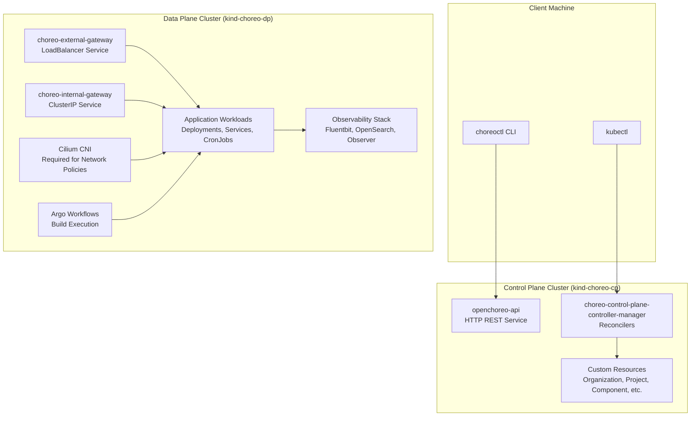
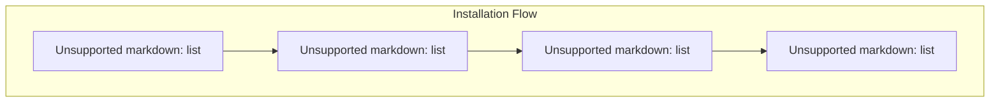
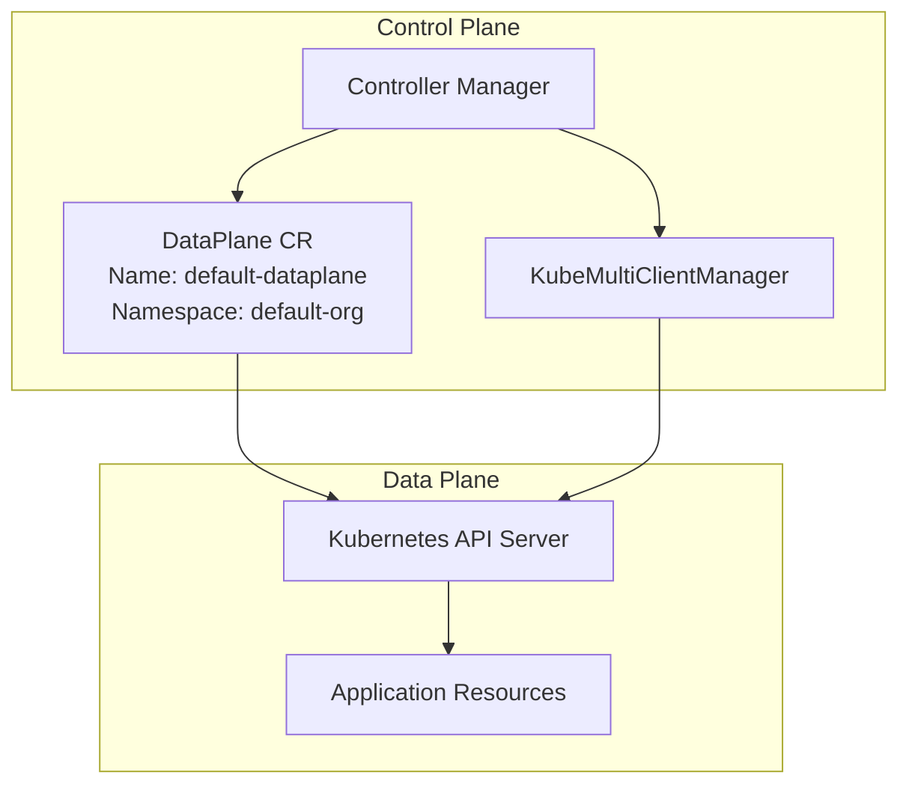
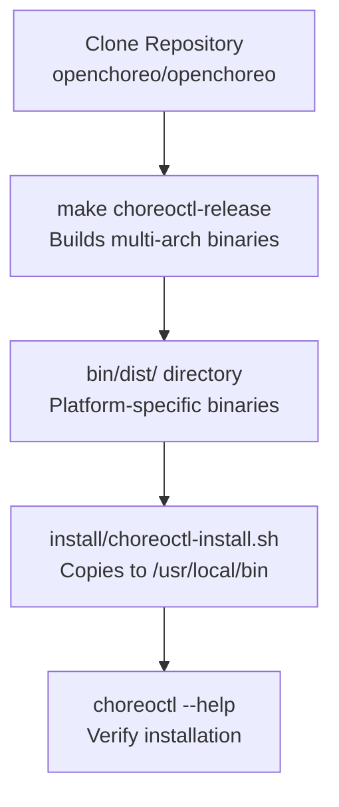
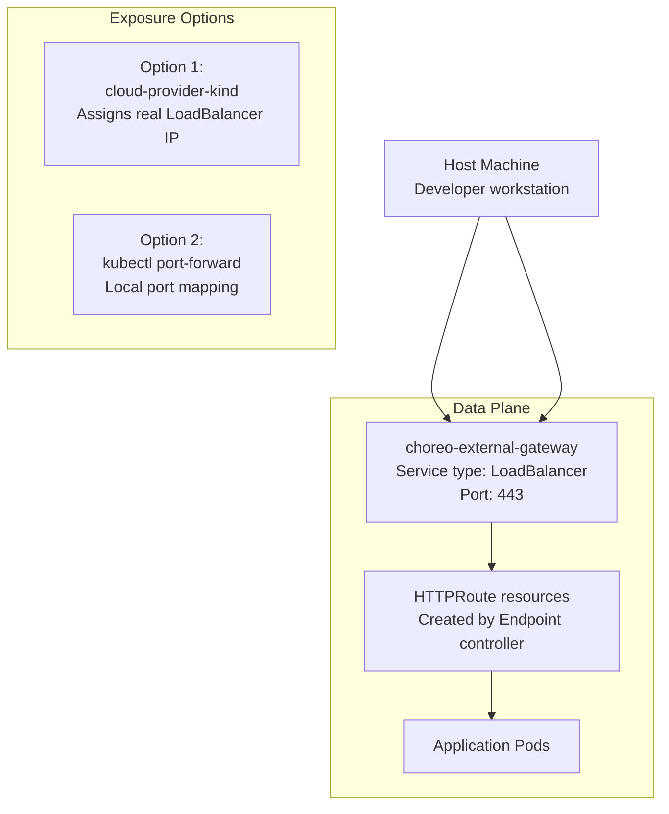

# Multi-Cluster Installation

> **Relevant source files**
> * [.github/CODEOWNERS](https://github.com/openchoreo/openchoreo/blob/a577e969/.github/CODEOWNERS)
> * [.github/ISSUE_TEMPLATE/01-bug-report.yml](https://github.com/openchoreo/openchoreo/blob/a577e969/.github/ISSUE_TEMPLATE/01-bug-report.yml)
> * [.github/ISSUE_TEMPLATE/02-task.yml](https://github.com/openchoreo/openchoreo/blob/a577e969/.github/ISSUE_TEMPLATE/02-task.yml)
> * [.github/ISSUE_TEMPLATE/03-release.md](https://github.com/openchoreo/openchoreo/blob/a577e969/.github/ISSUE_TEMPLATE/03-release.md)
> * [.github/pull_request_template.md](https://github.com/openchoreo/openchoreo/blob/a577e969/.github/pull_request_template.md)
> * [docs/contributors/README.md](https://github.com/openchoreo/openchoreo/blob/a577e969/docs/contributors/README.md)
> * [docs/contributors/contribute.md](https://github.com/openchoreo/openchoreo/blob/a577e969/docs/contributors/contribute.md)
> * [docs/contributors/release.md](https://github.com/openchoreo/openchoreo/blob/a577e969/docs/contributors/release.md)
> * [docs/install-guide-multi-cluster.md](https://github.com/openchoreo/openchoreo/blob/a577e969/docs/install-guide-multi-cluster.md)

## Purpose and Scope

This document provides a step-by-step guide for installing OpenChoreo in a multi-cluster configuration with separate Control Plane and Data Plane clusters. This setup represents OpenChoreo's production-ready architecture where control operations, build execution, and application workloads are isolated into distinct Kubernetes clusters.

For an overview of installation approaches and prerequisites, see [Installation Overview](/openchoreo/openchoreo/7.1-installation-overview). For a simplified single-cluster setup using Docker, see [Quick Start Installation](/openchoreo/openchoreo/7.3-quick-start-installation).

**Sources:** [docs/install-guide-multi-cluster.md L1-L8](https://github.com/openchoreo/openchoreo/blob/a577e969/docs/install-guide-multi-cluster.md#L1-L8)

## Multi-Cluster Architecture

In a multi-cluster deployment, OpenChoreo separates concerns across three logical planes:



**Architecture Details:**

* **Control Plane**: Hosts the controller manager and API service that manage Custom Resources and orchestrate operations
* **Data Plane**: Runs application workloads, build processes (Argo Workflows), and observability infrastructure
* **Network Requirements**: Data Plane must have Cilium CNI for network policy enforcement
* **Cross-Cluster Communication**: `KubeMultiClientManager` enables controllers to provision resources in remote clusters

**Sources:** [docs/install-guide-multi-cluster.md L1-L12](https://github.com/openchoreo/openchoreo/blob/a577e969/docs/install-guide-multi-cluster.md#L1-L12)

## Prerequisites

The following tools must be installed on your local machine:

| Tool | Version | Purpose |
| --- | --- | --- |
| `kind` | v0.27.0+ | Creates local Kubernetes clusters in Docker |
| `helm` | v3.15+ | Installs OpenChoreo via Helm charts |
| `kubectl` | v1.32.0+ | Interacts with Kubernetes clusters |
| `docker` | 23.0+ | Container runtime required by Kind |
| `go` | 1.23.5+ | Required for building `choreoctl` from source |

Verify installations with:

```go
kind version
helm version
kubectl version --client
docker version
go version
```

**Sources:** [docs/install-guide-multi-cluster.md L20-L39](https://github.com/openchoreo/openchoreo/blob/a577e969/docs/install-guide-multi-cluster.md#L20-L39)

 [docs/contributors/contribute.md L3-L16](https://github.com/openchoreo/openchoreo/blob/a577e969/docs/contributors/contribute.md#L3-L16)

## Creating Kind Clusters

### Control Plane Cluster

The Control Plane cluster is created using a Kind configuration that exposes the API server:

```sql
curl -sL https://raw.githubusercontent.com/openchoreo/openchoreo/main/install/kind/multi-cluster-setup/kind-config-cp.yaml | \
  kind create cluster --config=-
```

This creates a cluster with context name `kind-choreo-cp`.

**Sources:** [docs/install-guide-multi-cluster.md L41-L47](https://github.com/openchoreo/openchoreo/blob/a577e969/docs/install-guide-multi-cluster.md#L41-L47)

### Data Plane Cluster

The Data Plane cluster requires special node labels for Argo Workflows execution:

```sql
curl -sL https://raw.githubusercontent.com/openchoreo/openchoreo/main/install/kind/multi-cluster-setup/kind-config-dp.yaml | \
  kind create cluster --config=-
```

This creates a cluster with context name `kind-choreo-dp`.

**Important Node Label Requirement:**

* One node must be labeled `openchoreo.dev/noderole: workflow-runner`
* This label is used by Argo Workflows to schedule build pods
* The Kind configuration handles this automatically
* For manual cluster creation, you must apply this label manually

**Sources:** [docs/install-guide-multi-cluster.md L49-L61](https://github.com/openchoreo/openchoreo/blob/a577e969/docs/install-guide-multi-cluster.md#L49-L61)

## Installing Cilium

Cilium must be installed on the Data Plane cluster before installing OpenChoreo. Cilium provides the CNI (Container Network Interface) and enforces network policies that isolate workloads within the Cell-based runtime model.

```csharp
helm install cilium oci://ghcr.io/openchoreo/helm-charts/cilium \
  --kube-context kind-choreo-dp \
  --namespace "choreo-system" \
  --create-namespace \
  --timeout 30m
```

**Why Cilium is Required:**

* Enforces `NetworkPolicy` resources created by the Deployment controller
* Provides eBPF-based traffic filtering for Cell isolation
* Enables security policies between components
* Required for multi-tenancy and zero-trust networking

**Sources:** [docs/install-guide-multi-cluster.md L62-L69](https://github.com/openchoreo/openchoreo/blob/a577e969/docs/install-guide-multi-cluster.md#L62-L69)

## Installing OpenChoreo Components



### Control Plane Installation

The Control Plane chart deploys the controller manager and API service:

```csharp
helm install choreo-control-plane \
  oci://ghcr.io/openchoreo/helm-charts/choreo-control-plane \
  --kube-context kind-choreo-cp \
  --namespace "choreo-system" \
  --create-namespace \
  --timeout 30m \
  --version 0.0.0-latest-dev
```

**Deployed Components:**

* `choreo-control-plane-controller-manager` Deployment - Main reconciliation loop
* `openchoreo-api` Service - HTTP API for CLI and external clients
* CRD definitions for all OpenChoreo resource types
* RBAC roles and service accounts

**Sources:** [docs/install-guide-multi-cluster.md L84-L93](https://github.com/openchoreo/openchoreo/blob/a577e969/docs/install-guide-multi-cluster.md#L84-L93)

### Data Plane Installation

The Data Plane chart deploys runtime infrastructure and observability components:

```csharp
helm install choreo-dataplane \
  oci://ghcr.io/openchoreo/helm-charts/choreo-dataplane \
  --kube-context kind-choreo-dp \
  --namespace "choreo-system" \
  --create-namespace \
  --timeout 30m \
  --version 0.0.0-latest-dev
```

**Deployed Components:**

* `choreo-external-gateway` LoadBalancer - Public traffic ingress (Northbound)
* `choreo-internal-gateway` ClusterIP - Organization-internal traffic (Westbound)
* Argo Workflows controller and server
* `ClusterWorkflowTemplates` for build types (Ballerina, React, Docker, GCP)
* Fluentbit, OpenSearch, Observer for observability

**Optional: Disable Argo Workflows**
If build functionality is not needed, disable Argo during installation:

```
--set argo-workflows.enabled=false
```

**Sources:** [docs/install-guide-multi-cluster.md L95-L106](https://github.com/openchoreo/openchoreo/blob/a577e969/docs/install-guide-multi-cluster.md#L95-L106)

### Installation Verification

Verify all components are running using the status check script:

```
bash <(curl -sL https://raw.githubusercontent.com/openchoreo/openchoreo/main/install/check-status.sh) \
  --multi-cluster
```

**Prompts:**

* `Enter DataPlane kubernetes context (default: kind-choreo-dp):` - Press Enter for default
* `Enter Control Plane kubernetes context (default: kind-choreo-cp):` - Press Enter for default

The script checks:

* Pod status in both clusters
* Readiness of controller manager
* Availability of API service
* Argo Workflows components (if enabled)
* Gateway services

**Sources:** [docs/install-guide-multi-cluster.md L107-L122](https://github.com/openchoreo/openchoreo/blob/a577e969/docs/install-guide-multi-cluster.md#L107-L122)

## Configuring the DataPlane Resource

OpenChoreo requires a `DataPlane` Custom Resource that references the Data Plane cluster. This CR is stored in the Control Plane cluster and enables cross-cluster operations.



### Adding the Default DataPlane

Run the provided script to automatically create the `DataPlane` CR:

```
bash <(curl -sL https://raw.githubusercontent.com/openchoreo/openchoreo/main/install/add-default-dataplane.sh) \
  --multi-cluster
```

**Prompts:**

* `Enter DataPlane kubernetes context (default: kind-choreo-dp):` - Press Enter for default
* `Enter DataPlane kind name (default: default-dataplane):` - Press Enter for default

**What This Script Does:**

* Extracts API server URL and credentials from `kind-choreo-dp` kubeconfig
* Creates a `DataPlane` CR in namespace `default-org` on Control Plane cluster
* Populates `.spec.kubernetesCluster.credentials.apiServerURL`
* Stores authentication token as a Secret reference

**Manual Configuration (Non-Kind Clusters):**
For clusters not created with Kind, you must manually gather:

* API server URL
* CA certificate data
* Service account token or client certificate
* Create the `DataPlane` CR with these credentials

**Sources:** [docs/install-guide-multi-cluster.md L125-L142](https://github.com/openchoreo/openchoreo/blob/a577e969/docs/install-guide-multi-cluster.md#L125-L142)

## Installing the choreoctl CLI

The `choreoctl` command-line tool provides a user-friendly interface for managing OpenChoreo resources. It must be built from source.

### Build Process



### Step-by-Step Installation

1. **Clone the repository:**

```
git clone https://github.com/openchoreo/openchoreo.git
cd openchoreo
```

1. **Build the binary:**

```
make choreoctl-release
```

This compiles `choreoctl` for your OS and architecture, placing it in `bin/dist/`.

1. **Install to system path:**

```
./install/choreoctl-install.sh
```

This copies the binary to `/usr/local/bin/choreoctl`.

1. **Verify installation:**

```
choreoctl --help
```

Expected output shows available commands:

* `apply` - Apply resource configurations
* `create` - Create new resources
* `get` - Query resources
* `logs` - Retrieve logs
* `config` - Manage contexts
* `completion` - Shell autocompletion

**Uninstallation:**
To remove `choreoctl`:

```
curl -sL https://raw.githubusercontent.com/openchoreo/openchoreo/refs/heads/main/install/choreoctl-uninstall.sh | bash
```

**Sources:** [docs/install-guide-multi-cluster.md L143-L214](https://github.com/openchoreo/openchoreo/blob/a577e969/docs/install-guide-multi-cluster.md#L143-L214)

## Gateway Exposure

The `choreo-external-gateway` service must be exposed to your host machine to access deployed applications. This LoadBalancer service routes Northbound (public) traffic to components with `visibility: public` endpoints.



### Option 1: Using cloud-provider-kind

This tool assigns a real LoadBalancer IP to Kind clusters:

1. **Install cloud-provider-kind:** Follow instructions at: [https://github.com/kubernetes-sigs/cloud-provider-kind](https://github.com/kubernetes-sigs/cloud-provider-kind)
2. **Run the provider (requires sudo):**

```
sudo $(which cloud-provider-kind)
```

Keep this running in a separate terminal.

1. **Verify LoadBalancer IP assignment:**

```
kubectl --context=kind-choreo-dp get svc choreo-external-gateway -n choreo-system
```

Output should show an IP address in `EXTERNAL-IP` column (e.g., `172.19.0.4`).

1. **Extract the LoadBalancer IP:**

```
kubectl --context=kind-choreo-dp get svc/choreo-external-gateway \
  -n choreo-system -o=jsonpath='{.status.loadBalancer.ingress[0].ip}'
```

**DNS Configuration:**
Applications are accessed via hostname-based routing. For endpoint URL:

```yaml
https://default-org-default-project-hello-world-ea384b50-development.choreoapps.localhost
```

Add to `/etc/hosts`:

```
172.19.0.4 default-org-default-project-hello-world-ea384b50-development.choreoapps.localhost
```

**Sources:** [docs/install-guide-multi-cluster.md L244-L272](https://github.com/openchoreo/openchoreo/blob/a577e969/docs/install-guide-multi-cluster.md#L244-L272)

### Option 2: Port-Forwarding

For simpler setups or environments without LoadBalancer support:

```
kubectl --context=kind-choreo-dp port-forward \
  svc/choreo-external-gateway -n choreo-system 443:443
```

**Port Conflict Resolution:**
If port 443 is already in use:

```
kubectl --context=kind-choreo-dp port-forward \
  svc/choreo-external-gateway -n choreo-system 8443:443
```

**Hostname Resolution:**
Same `/etc/hosts` configuration is required, but use `127.0.0.1` as the IP address.

**Sources:** [docs/install-guide-multi-cluster.md L274-L290](https://github.com/openchoreo/openchoreo/blob/a577e969/docs/install-guide-multi-cluster.md#L274-L290)

## Post-Installation Verification

After completing the installation, verify the setup by deploying a sample application:

```csharp
# Set kubectl context to Control Plane
kubectl config use-context kind-choreo-cp

# Create an organization and project
kubectl apply -f samples/hello-world/organization.yaml
kubectl apply -f samples/hello-world/project.yaml

# Create a component
kubectl apply -f samples/hello-world/component.yaml

# Check component status
kubectl get component -n default-project

# Trigger a build
choreoctl create build --component hello-world --namespace default-project
```

**Expected Workflow:**

1. Component CR created in Control Plane
2. Build triggered, executes in Data Plane via Argo Workflows
3. Build produces `DeployableArtifact` with container image
4. Deployment controller provisions workload in Data Plane
5. Endpoint controller creates `HTTPRoute` resources
6. Application accessible via `choreo-external-gateway`

For detailed application deployment procedures, see [Deploying Applications](/openchoreo/openchoreo/8.2-deploying-applications).

**Observability:**
To view logs from deployed applications, see [Logging Architecture](/openchoreo/openchoreo/10.1-logging-architecture).

**Sources:** [docs/install-guide-multi-cluster.md L123-L124](https://github.com/openchoreo/openchoreo/blob/a577e969/docs/install-guide-multi-cluster.md#L123-L124)

 [docs/install-guide-multi-cluster.md L291-L296](https://github.com/openchoreo/openchoreo/blob/a577e969/docs/install-guide-multi-cluster.md#L291-L296)

## Cluster Resource Overview

The following table summarizes key resources deployed in each cluster:

| Resource | Control Plane | Data Plane | Purpose |
| --- | --- | --- | --- |
| `choreo-control-plane-controller-manager` | ✓ |  | Reconciles all CRDs |
| `openchoreo-api` | ✓ |  | HTTP REST API service |
| CRD definitions | ✓ |  | Organization, Project, Component, etc. |
| `choreo-external-gateway` |  | ✓ | Public traffic ingress |
| `choreo-internal-gateway` |  | ✓ | Organization-internal traffic |
| Cilium CNI |  | ✓ | Network policies and eBPF filtering |
| Argo Workflows |  | ✓ | Build execution engine |
| `ClusterWorkflowTemplates` |  | ✓ | Build type definitions |
| Fluentbit |  | ✓ | Log collection |
| OpenSearch |  | ✓ | Log storage and indexing |
| Observer service |  | ✓ | Log query API |
| Application workloads |  | ✓ | User-deployed components |

**Sources:** [docs/install-guide-multi-cluster.md L1-L296](https://github.com/openchoreo/openchoreo/blob/a577e969/docs/install-guide-multi-cluster.md#L1-L296)

## Troubleshooting

### Controller Manager Not Starting

**Symptom:** `choreo-control-plane-controller-manager` pod in `CrashLoopBackOff`

**Check logs:**

```
kubectl --context=kind-choreo-cp logs -n choreo-system \
  -l app.kubernetes.io/name=choreo-control-plane -c manager
```

**Common causes:**

* Missing CRD definitions - Verify with `kubectl get crds | grep choreo`
* RBAC permission issues - Check ServiceAccount and ClusterRoles
* API server unreachable - Verify network connectivity

### DataPlane Not Registered

**Symptom:** Deployments fail with "no DataPlane available"

**Verify DataPlane CR:**

```
kubectl --context=kind-choreo-cp get dataplane -n default-org default-dataplane -o yaml
```

**Check status fields:**

* `.status.conditions` should show `Ready: True`
* `.spec.kubernetesCluster.credentials` must contain valid API server URL

**Re-run configuration:**

```
bash ./install/add-default-dataplane.sh --multi-cluster
```

### Gateway Not Accessible

**Symptom:** Cannot reach deployed applications

**Verify LoadBalancer status:**

```
kubectl --context=kind-choreo-dp get svc choreo-external-gateway -n choreo-system
```

**Check endpoint routes:**

```
kubectl --context=kind-choreo-dp get httproute -A
```

**Verify DNS resolution:**

* Ensure `/etc/hosts` entries are correct
* Test with `curl -k https://<endpoint-url>`

**Sources:** [docs/install-guide-multi-cluster.md L1-L296](https://github.com/openchoreo/openchoreo/blob/a577e969/docs/install-guide-multi-cluster.md#L1-L296)

## Next Steps

After completing the multi-cluster installation:

1. **Explore the CLI** - See [choreoctl Commands](/openchoreo/openchoreo/8.1-choreoctl-commands) for detailed command reference
2. **Deploy Sample Applications** - Follow [Deploying Applications](/openchoreo/openchoreo/8.2-deploying-applications) to create your first component
3. **Configure Observability** - Set up log querying as described in [Logging Architecture](/openchoreo/openchoreo/10.1-logging-architecture)
4. **Understand the Architecture** - Review [Multi-Cluster Architecture](/openchoreo/openchoreo/2.3-multi-cluster-architecture) for design rationale
5. **Development Setup** - For contributing, see [Development Environment Setup](/openchoreo/openchoreo/9.1-development-environment-setup)

**Sources:** [docs/install-guide-multi-cluster.md L123-L124](https://github.com/openchoreo/openchoreo/blob/a577e969/docs/install-guide-multi-cluster.md#L123-L124)