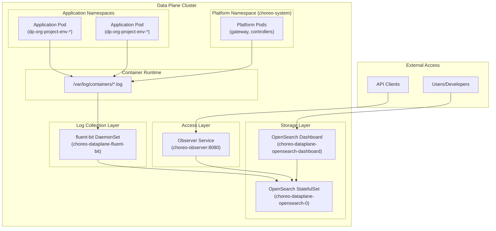
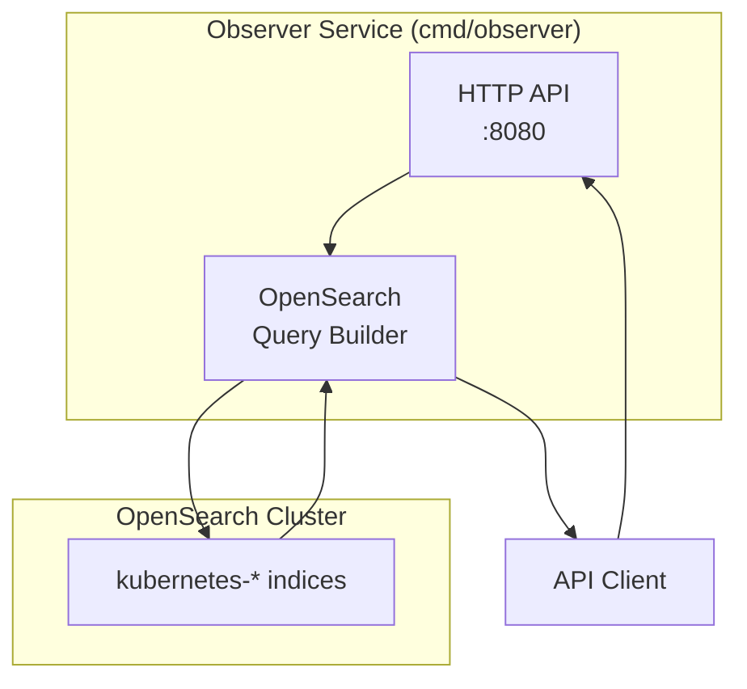
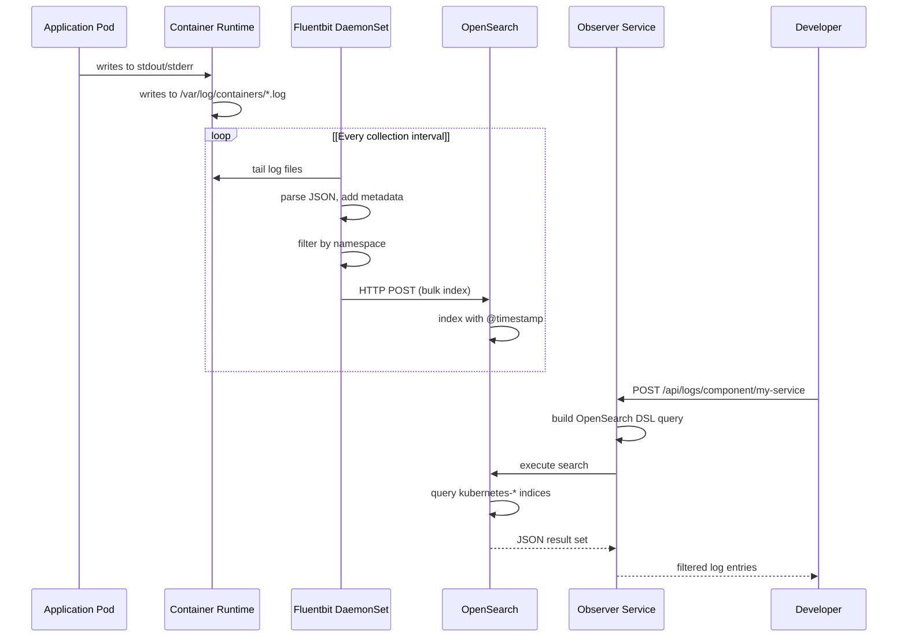
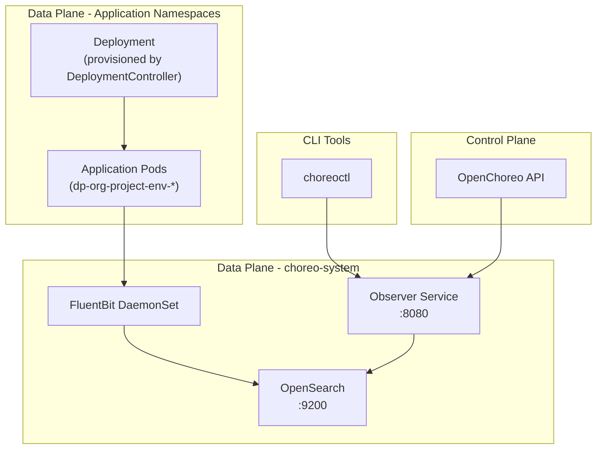

# Observability

> **Relevant source files**
> * [Makefile](https://github.com/openchoreo/openchoreo/blob/a577e969/Makefile)
> * [cmd/choreoctl/Dockerfile](https://github.com/openchoreo/openchoreo/blob/a577e969/cmd/choreoctl/Dockerfile)
> * [cmd/observer/Dockerfile](https://github.com/openchoreo/openchoreo/blob/a577e969/cmd/observer/Dockerfile)
> * [docs/observability-logging.md](https://github.com/openchoreo/openchoreo/blob/a577e969/docs/observability-logging.md)
> * [install/helm/openchoreo-identity-provider/templates/post-install-hook.yaml](https://github.com/openchoreo/openchoreo/blob/a577e969/install/helm/openchoreo-identity-provider/templates/post-install-hook.yaml)
> * [make/common.mk](https://github.com/openchoreo/openchoreo/blob/a577e969/make/common.mk)
> * [make/docker.mk](https://github.com/openchoreo/openchoreo/blob/a577e969/make/docker.mk)
> * [make/golang.mk](https://github.com/openchoreo/openchoreo/blob/a577e969/make/golang.mk)
> * [make/kube.mk](https://github.com/openchoreo/openchoreo/blob/a577e969/make/kube.mk)
> * [make/lint.mk](https://github.com/openchoreo/openchoreo/blob/a577e969/make/lint.mk)
> * [make/tools.mk](https://github.com/openchoreo/openchoreo/blob/a577e969/make/tools.mk)

## Purpose and Scope

This document describes OpenChoreo's built-in observability features, focusing on the logging infrastructure that provides visibility into both platform operations and application behavior. The observability stack consists of three primary components: Fluentbit for log collection, OpenSearch for log storage and indexing, and the Observer service for programmatic log access.

For information about deploying applications and accessing component logs through the CLI, see [Deploying Applications](/openchoreo/openchoreo/8.2-deploying-applications) and [Component Management](/openchoreo/openchoreo/8.3-component-management). For details on the Helm chart configuration that enables observability, see [Helm Charts and Configuration](/openchoreo/openchoreo/9.5-helm-charts-and-configuration).

---

## Observability Architecture Overview

OpenChoreo's observability system operates entirely within the Data Plane cluster, collecting logs from application workloads and platform components. The architecture follows a pipeline pattern: Fluentbit DaemonSets collect logs from container runtimes, forward them to OpenSearch for indexing and storage, and the Observer service provides both REST API and dashboard access to the stored logs.



**Sources:** [docs/observability-logging.md L1-L171](https://github.com/openchoreo/openchoreo/blob/a577e969/docs/observability-logging.md#L1-L171)

 [make/docker.mk L32](https://github.com/openchoreo/openchoreo/blob/a577e969/make/docker.mk#L32-L32)

 [cmd/observer/Dockerfile L1-L26](https://github.com/openchoreo/openchoreo/blob/a577e969/cmd/observer/Dockerfile#L1-L26)

---

## Component Architecture

### Fluentbit Log Collector

Fluentbit runs as a DaemonSet on every node in the Data Plane cluster, tailing log files from the container runtime. It is configured to collect logs from specific namespaces while excluding its own logs and OpenSearch logs to prevent circular collection.

**Default Collection Scope:**

| Namespace Pattern | Purpose | Example |
| --- | --- | --- |
| `choreo-system` | Platform operational logs | Gateway pods, controller logs |
| `dp-*` | Application logs | `dp-default-org-default-proje-development-39faf2d8` |

**Exclusions:**

* `/var/log/containers/*opensearch-0*_choreo-system_*.log`
* `/var/log/containers/*opensearch-dashboard*_choreo-system_*.log`
* `/var/log/containers/*fluent-bit*_choreo-system_*.log`

The Fluentbit configuration is templated in the Helm chart and forwards logs to the OpenSearch service on port 9200 using the OpenSearch output plugin.

**Sources:** [docs/observability-logging.md L34-L68](https://github.com/openchoreo/openchoreo/blob/a577e969/docs/observability-logging.md#L34-L68)

---

### OpenSearch Storage and Indexing

OpenSearch runs as a StatefulSet (`choreo-dataplane-opensearch-0`) providing persistent log storage and full-text search capabilities. It indexes logs with Kubernetes metadata including namespace, pod name, container name, and timestamps.

**Index Pattern:** `kubernetes*`
**Time Field:** `@timestamp`

The OpenSearch instance includes a companion Dashboard deployment that provides a web-based interface for exploring logs, creating visualizations, and building queries.

**Sources:** [docs/observability-logging.md L72-L84](https://github.com/openchoreo/openchoreo/blob/a577e969/docs/observability-logging.md#L72-L84)

 [docs/observability-logging.md L86-L108](https://github.com/openchoreo/openchoreo/blob/a577e969/docs/observability-logging.md#L86-L108)

---

### Observer Service

The Observer service is a REST API that provides programmatic access to logs stored in OpenSearch. It exposes endpoints for querying component-specific logs with filtering by time range, log level, and environment.



**Observer API Endpoint:**

```
POST /api/logs/component/{componentName}
```

**Request Body Schema:**

```json
{
  "startTime": "2025-07-02T18:40:00Z",
  "endTime": "2025-07-02T18:50:00Z",
  "environmentId": "development",
  "logLevels": ["ERROR", "WARN", "INFO"],
  "limit": 100
}
```

The Observer service is built as a separate binary and packaged in its own Docker image, as seen in the build configuration.

**Sources:** [docs/observability-logging.md L148-L171](https://github.com/openchoreo/openchoreo/blob/a577e969/docs/observability-logging.md#L148-L171)

 [make/docker.mk L32](https://github.com/openchoreo/openchoreo/blob/a577e969/make/docker.mk#L32-L32)

 [cmd/observer/Dockerfile L1-L26](https://github.com/openchoreo/openchoreo/blob/a577e969/cmd/observer/Dockerfile#L1-L26)

---

## Log Flow and Processing

The following sequence diagram illustrates how logs flow from application containers through the observability pipeline to end users:



**Metadata Enrichment:**

Fluentbit enriches each log entry with Kubernetes metadata including:

* `kubernetes.namespace_name` - Namespace where the pod runs
* `kubernetes.pod_name` - Pod identifier
* `kubernetes.container_name` - Container within the pod
* `kubernetes.labels` - All pod labels
* `@timestamp` - ISO 8601 timestamp

**Sources:** [docs/observability-logging.md L1-L68](https://github.com/openchoreo/openchoreo/blob/a577e969/docs/observability-logging.md#L1-L68)

---

## Installation and Configuration

### Enabling Observability

By default, observability logging is **disabled**. It can be enabled during Helm chart installation or upgrade using the `observability.logging.enabled` flag.

**Single-Cluster Installation:**

```csharp
helm upgrade --install choreo-dataplane oci://ghcr.io/openchoreo/helm-charts/choreo-dataplane \
   --kube-context kind-choreo \
   --namespace "choreo-system" \
   --create-namespace \
   --set certmanager.enabled=false \
   --set observability.logging.enabled=true \
   --set observer.image.tag=latest-dev \
   --timeout 30m
```

**Multi-Cluster Installation:**

```csharp
helm upgrade --install choreo-dataplane oci://ghcr.io/openchoreo/helm-charts/choreo-dataplane \
   --kube-context kind-choreo-dp \
   --namespace "choreo-system" \
   --create-namespace \
   --set observability.logging.enabled=true \
   --timeout 30m
```

**Note:** Multi-cluster setup with observability requires minimum 4 CPU and 8GB memory for stable operation.

**Sources:** [docs/observability-logging.md L6-L31](https://github.com/openchoreo/openchoreo/blob/a577e969/docs/observability-logging.md#L6-L31)

---

### Configuration Customization

Observability configuration is managed through Helm values located at:

* **Templates:** `install/helm/choreo-dataplane/templates/`
* **Values:** `install/helm/choreo-dataplane/values.yaml`

**Key Configuration Options:**

| Setting | Description | Default |
| --- | --- | --- |
| `input.path` | Log file patterns to collect | `/var/log/containers/*_choreo-system_*.log,/var/log/containers/*_dp-*_*.log` |
| `input.excludePath` | Log files to exclude | OpenSearch, Dashboard, Fluentbit logs |
| `output.name` | Output plugin | `opensearch` |
| `output.host` | OpenSearch service host | `opensearch` |
| `output.port` | OpenSearch service port | `9200` |

**Example Customization:**

```yaml
fluentbit:
  input:
    path: "/var/log/containers/*_choreo-system_*.log,/var/log/containers/*_dp-*_*.log,/var/log/containers/*_custom-namespace_*.log"
    excludePath: "/var/log/containers/*opensearch-0*_choreo-system_*.log"
  output:
    name: opensearch
    host: opensearch
    port: 9200
```

**Sources:** [docs/observability-logging.md L33-L70](https://github.com/openchoreo/openchoreo/blob/a577e969/docs/observability-logging.md#L33-L70)

---

## Verification and Access

### Verifying Installation

After installing the data plane Helm chart with observability enabled, verify that all components are running:

```
kubectl get pods -n choreo-system
```

Expected pods:

```
choreo-system choreo-dataplane-fluent-bit-xxxx    
choreo-system choreo-dataplane-opensearch-0
choreo-system choreo-dataplane-opensearch-dashboard-xxxxx-xxxxx
choreo-system choreo-observer-xxxxx-xxxxx
```

**Sources:** [docs/observability-logging.md L72-L84](https://github.com/openchoreo/openchoreo/blob/a577e969/docs/observability-logging.md#L72-L84)

---

### Accessing Logs via OpenSearch Dashboard

The OpenSearch Dashboard provides a web UI for interactive log exploration:

1. **Get the Dashboard pod name:** ``` kubectl get pods -n choreo-system | grep opensearch-dashboard ```
2. **Port-forward to local machine:** ``` kubectl port-forward pod/<dashboard-pod-name> 5601:5601 -n choreo-system ```
3. **Access the dashboard:** ```yaml http://localhost:5601 ```
4. **Create index pattern (first time only):** * Navigate to **Discover** → **Create Index Pattern** * Index pattern: `kubernetes*` * Time field: `@timestamp` * Click **Create Index Pattern**
5. **Or programmatically:** ``` curl -X POST "http://localhost:5601/api/saved_objects/index-pattern" \   -H "Content-Type: application/json" \   -H "osd-xsrf: true" \   -u "admin:admin" \   -d '{     "attributes": {       "title": "kubernetes*",       "timeFieldName": "@timestamp"     }   }' ```

**Sources:** [docs/observability-logging.md L86-L121](https://github.com/openchoreo/openchoreo/blob/a577e969/docs/observability-logging.md#L86-L121)

---

### Filtering Application Logs

To view logs for a specific application deployment:

1. **Identify the namespace:** ``` kubectl get namespaces | grep dp- ``` Example output: ``` dp-default-org-default-proje-development-39faf2d8 ```
2. **Create filter in Dashboard:** * In the Discover view, add filter: ``` kubernetes.namespace_name:dp-default-org-default-proje-development-39faf2d8 ```
3. **Search log content:** * Use the search bar to filter by message content * Example: `Current time` to find time logger output
4. **Adjust time range:** * Use the time picker to select the relevant time window

**Sources:** [docs/observability-logging.md L122-L147](https://github.com/openchoreo/openchoreo/blob/a577e969/docs/observability-logging.md#L122-L147)

---

### Accessing Logs via Observer API

The Observer service provides programmatic log access for integration with tools and scripts:

1. **Port-forward to Observer service:** ``` kubectl port-forward svc/choreo-observer 8080:8080 -n choreo-system ```
2. **Query component logs:** ```go curl -X POST http://localhost:8080/api/logs/component/greeting-service-go \      -H "Content-Type: application/json" \      -d '{        "startTime": "2025-07-02T18:40:00Z",        "endTime": "2025-07-02T18:50:00Z",        "environmentId": "development",        "logLevels": ["ERROR", "WARN", "INFO"],        "limit": 100      }' ```

**Query Parameters:**

| Field | Type | Required | Description |
| --- | --- | --- | --- |
| `startTime` | ISO 8601 | Yes | Beginning of time range |
| `endTime` | ISO 8601 | Yes | End of time range |
| `environmentId` | string | Yes | Environment name (e.g., "development") |
| `logLevels` | string[] | No | Filter by log levels |
| `limit` | integer | No | Maximum number of results |

**Response Format:**

```json
{
  "logs": [
    {
      "timestamp": "2025-07-02T18:45:23Z",
      "level": "ERROR",
      "message": "Connection timeout",
      "kubernetes": {
        "namespace_name": "dp-default-org-...",
        "pod_name": "greeting-service-go-...",
        "container_name": "greeting-service"
      }
    }
  ],
  "total": 42
}
```

**Sources:** [docs/observability-logging.md L148-L171](https://github.com/openchoreo/openchoreo/blob/a577e969/docs/observability-logging.md#L148-L171)

---

## Build and Deployment

The Observer service is built and deployed as part of the OpenChoreo platform:

**Build Configuration:**

* **Binary:** Built via `go.build.observer` target [make/golang.mk L18](https://github.com/openchoreo/openchoreo/blob/a577e969/make/golang.mk#L18-L18)
* **Docker Image:** `ghcr.io/openchoreo/observer:latest-dev` [make/docker.mk L32](https://github.com/openchoreo/openchoreo/blob/a577e969/make/docker.mk#L32-L32)
* **Dockerfile:** [cmd/observer/Dockerfile L1-L26](https://github.com/openchoreo/openchoreo/blob/a577e969/cmd/observer/Dockerfile#L1-L26)
* **Base Image:** `gcr.io/distroless/static:nonroot` for minimal attack surface

**Multi-Architecture Support:**

* Built for `linux/amd64` and `linux/arm64` [make/docker.mk L17](https://github.com/openchoreo/openchoreo/blob/a577e969/make/docker.mk#L17-L17)
* Uses cross-compilation for efficiency [make/golang.mk L9-L10](https://github.com/openchoreo/openchoreo/blob/a577e969/make/golang.mk#L9-L10)

The Observer service runs on port 8080 and is deployed as a Kubernetes Deployment in the `choreo-system` namespace when `observability.logging.enabled=true`.

**Sources:** [make/docker.mk L28-L33](https://github.com/openchoreo/openchoreo/blob/a577e969/make/docker.mk#L28-L33)

 [cmd/observer/Dockerfile L1-L26](https://github.com/openchoreo/openchoreo/blob/a577e969/cmd/observer/Dockerfile#L1-L26)

 [make/golang.mk L14-L19](https://github.com/openchoreo/openchoreo/blob/a577e969/make/golang.mk#L14-L19)

---

## Integration with Platform Components

The observability system integrates with other OpenChoreo components to provide comprehensive visibility:



**Future Integration Points:**

* **Component Service:** May expose Observer URLs via component status [Page 5.2](/openchoreo/openchoreo/5.2-component-service)
* **Build Logs:** Potential integration with Build Controller for build-time logs [Page 3.1](/openchoreo/openchoreo/3.1-build-controller)
* **Deployment Events:** Correlation with Deployment Controller events [Page 4.1](/openchoreo/openchoreo/4.1-deployment-controller)

**Sources:** [docs/observability-logging.md L148-L171](https://github.com/openchoreo/openchoreo/blob/a577e969/docs/observability-logging.md#L148-L171)

---

## Best Practices and Considerations

### Resource Requirements

| Component | CPU | Memory | Storage |
| --- | --- | --- | --- |
| Fluentbit (per node) | 100m | 128Mi | - |
| OpenSearch | 1000m | 2Gi | 10Gi PV |
| OpenSearch Dashboard | 500m | 512Mi | - |
| Observer | 100m | 128Mi | - |

**Total Additional:** ~2 CPU, ~3GB RAM, 10GB storage (plus scaling with log volume)

### Log Retention

* **Default Retention:** Managed by OpenSearch index lifecycle policies
* **Storage Growth:** Approximately 100-500 MB per day per active application
* **Recommended:** Configure index rotation and deletion policies for production

### Performance Tuning

* **Fluentbit Buffer:** Adjust `Mem_Buf_Limit` for high-volume applications
* **OpenSearch Shards:** Configure shard count based on data volume
* **Query Limits:** Use the `limit` parameter in Observer API to prevent large result sets

### Security Considerations

* **Dashboard Access:** Currently requires port-forwarding; consider Ingress with authentication
* **Observer API:** No authentication by default; should be secured in production
* **OpenSearch:** Default credentials (`admin:admin`) should be changed

**Sources:** [docs/observability-logging.md L22-L24](https://github.com/openchoreo/openchoreo/blob/a577e969/docs/observability-logging.md#L22-L24)

 [docs/observability-logging.md L33-L70](https://github.com/openchoreo/openchoreo/blob/a577e969/docs/observability-logging.md#L33-L70)