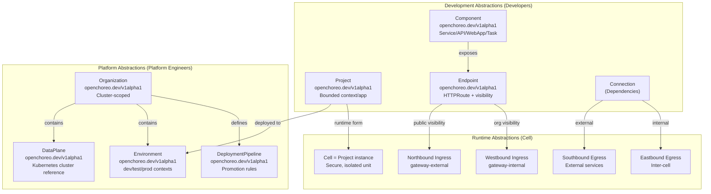
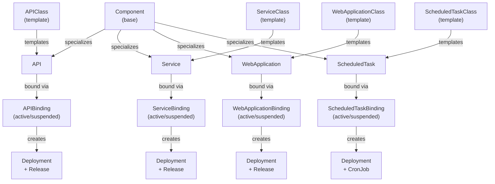
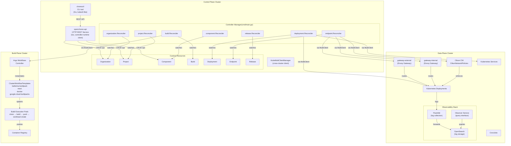
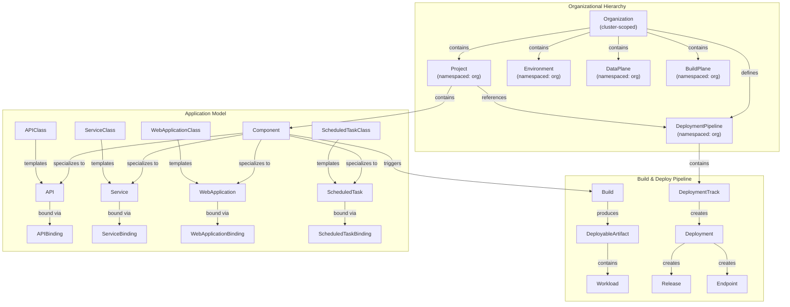
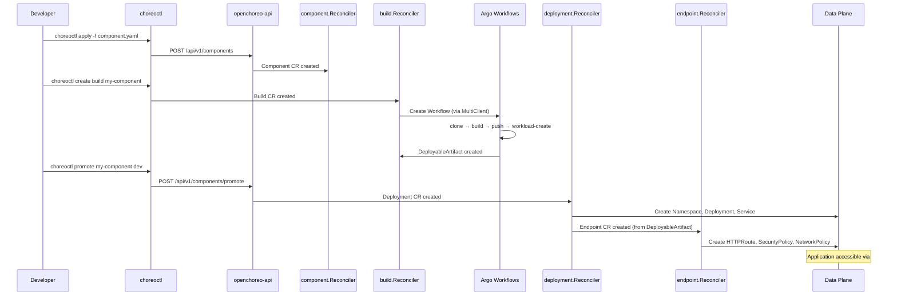

# OpenChoreo Overview

> **Relevant source files**
> * [PROJECT](https://github.com/openchoreo/openchoreo/blob/a577e969/PROJECT)
> * [README.md](https://github.com/openchoreo/openchoreo/blob/a577e969/README.md)
> * [cmd/main.go](https://github.com/openchoreo/openchoreo/blob/a577e969/cmd/main.go)
> * [config/crd/kustomization.yaml](https://github.com/openchoreo/openchoreo/blob/a577e969/config/crd/kustomization.yaml)
> * [config/rbac/kustomization.yaml](https://github.com/openchoreo/openchoreo/blob/a577e969/config/rbac/kustomization.yaml)
> * [config/rbac/role.yaml](https://github.com/openchoreo/openchoreo/blob/a577e969/config/rbac/role.yaml)
> * [config/samples/kustomization.yaml](https://github.com/openchoreo/openchoreo/blob/a577e969/config/samples/kustomization.yaml)
> * [docs/images/openchoreo-cell-runtime-view.png](https://github.com/openchoreo/openchoreo/blob/a577e969/docs/images/openchoreo-cell-runtime-view.png)
> * [docs/images/openchoreo-ddd-to-cell-mapping.png](https://github.com/openchoreo/openchoreo/blob/a577e969/docs/images/openchoreo-ddd-to-cell-mapping.png)
> * [docs/images/openchoreo-development-abstractions.png](https://github.com/openchoreo/openchoreo/blob/a577e969/docs/images/openchoreo-development-abstractions.png)
> * [docs/images/openchoreo-overall-architecture.png](https://github.com/openchoreo/openchoreo/blob/a577e969/docs/images/openchoreo-overall-architecture.png)
> * [docs/images/openchoreo-platform-abstractions.png](https://github.com/openchoreo/openchoreo/blob/a577e969/docs/images/openchoreo-platform-abstractions.png)

## Purpose and Scope

This page provides a high-level introduction to OpenChoreo: what it is, why it exists, its core abstractions, and how its architecture supports those abstractions. This document focuses on conceptual understanding rather than implementation details.

For detailed architectural patterns, see [Architecture](/openchoreo/openchoreo/2-architecture). For information about specific components like the Controller Manager, see [Controller Manager](/openchoreo/openchoreo/2.4-controller-manager). For deployment workflows, see [Deployment System](/openchoreo/openchoreo/4-deployment-system). For Custom Resource specifications, see [Custom Resources](/openchoreo/openchoreo/6-custom-resources).

## What is OpenChoreo?

OpenChoreo is an open-source **Internal Developer Platform (IDP)** designed to bridge the gap between Kubernetes primitives and developer workflows. While Kubernetes provides powerful low-level abstractions like Namespaces, Deployments, and NetworkPolicies, these are too granular for most application developers. OpenChoreo fills this gap by providing higher-level abstractions that align with Domain-Driven Design principles and modern cloud-native development practices.

### The Problem

Kubernetes gives platform engineers primitives to build infrastructure, but developers still need:

* **Higher-level abstractions** that map to business domains rather than infrastructure concerns
* **Self-service workflows** for building, deploying, and exposing applications
* **Security and observability by default** without manual configuration
* **Governance and standardization** across teams and environments

### The Solution

OpenChoreo orchestrates multiple CNCF and open-source projects (Argo Workflows, Cilium, Envoy Gateway, OpenSearch) into a cohesive platform with three key characteristics:

1. **Abstraction layers** that separate platform concerns from application concerns
2. **Cell-based runtime** that enforces domain boundaries through infrastructure
3. **Three-plane architecture** that separates control, build, and application execution

**Sources:** [README.md L1-L20](https://github.com/openchoreo/openchoreo/blob/a577e969/README.md#L1-L20)

 [README.md L89-L119](https://github.com/openchoreo/openchoreo/blob/a577e969/README.md#L89-L119)

## Core Abstractions

OpenChoreo introduces three layers of abstractions, each implemented as Kubernetes Custom Resources. These abstractions are managed by specialized controllers in the controller manager.



### Platform Abstractions

Platform engineers use these resources to configure the platform itself:

| Resource | CRD | Purpose | Controller |
| --- | --- | --- | --- |
| **Organization** | `organizations.openchoreo.dev` | Logical grouping of users/resources | `organization.Reconciler` |
| **DataPlane** | `dataplanes.openchoreo.dev` | Reference to Kubernetes cluster for workloads | `dataplane.Reconciler` |
| **Environment** | `environments.openchoreo.dev` | Runtime context (dev/test/prod) | `environment.Reconciler` |
| **DeploymentPipeline** | `deploymentpipelines.openchoreo.dev` | Promotion workflow rules | `deploymentpipeline.Reconciler` |

These resources are managed by controllers registered in [cmd/main.go L179-L213](https://github.com/openchoreo/openchoreo/blob/a577e969/cmd/main.go#L179-L213)

### Development Abstractions

Developers use these resources to define their applications:

| Resource | CRD | Maps To | Controller |
| --- | --- | --- | --- |
| **Project** | `projects.openchoreo.dev` | Bounded context, cloud-native app | `project.Reconciler` |
| **Component** | `components.openchoreo.dev` | Service/API/WebApp/ScheduledTask | `component.Reconciler` |
| **Endpoint** | `endpoints.openchoreo.dev` | HTTPRoute + SecurityPolicy + NetworkPolicy | `endpoint.Reconciler` |
| **Connection** | (via Component spec) | CiliumNetworkPolicy for outbound | - |

Components specialize into typed workloads through a Class-Instance-Binding pattern:



### Runtime Abstractions: The Cell Model

At runtime, each Project becomes a **Cell** — a secure, isolated, and observable unit with well-defined traffic paths:

* **Northbound Ingress**: Public internet traffic → Components (Endpoints with `visibility: public`)
* **Westbound Ingress**: Organization-internal traffic → Components (Endpoints with `visibility: organization`)
* **Southbound Egress**: Components → External services (via Connections)
* **Eastbound Egress**: Components → Other cells (inter-project communication)

All traffic is enforced by Cilium network policies and routed through Envoy gateways with mTLS encryption. This architecture reifies Domain-Driven Design boundaries at the infrastructure level.

**Sources:** [README.md L21-L88](https://github.com/openchoreo/openchoreo/blob/a577e969/README.md#L21-L88)

 [config/crd/kustomization.yaml L1-L48](https://github.com/openchoreo/openchoreo/blob/a577e969/config/crd/kustomization.yaml#L1-L48)

 [cmd/main.go L268-L357](https://github.com/openchoreo/openchoreo/blob/a577e969/cmd/main.go#L268-L357)

## Three-Plane Architecture

OpenChoreo separates concerns across three distinct Kubernetes clusters, enabling clear boundaries between platform control, build execution, and application runtime.



### Control Plane

The Control Plane hosts:

* **Controller Manager** ([cmd/main.go](https://github.com/openchoreo/openchoreo/blob/a577e969/cmd/main.go) ): Binary that registers all reconcilers and watches CRDs
* **OpenChoreo API** (HTTP REST service): Provides developer-friendly abstractions over CRDs
* **choreoctl** (CLI): kubectl-like interface for platform operations
* **KubeMultiClientManager**: Manages cross-cluster clients for Build and Data Planes

The manager registers the runtime scheme with all API types at startup ([cmd/main.go L66-L76](https://github.com/openchoreo/openchoreo/blob/a577e969/cmd/main.go#L66-L76)

):

```
utilruntime.Must(clientgoscheme.AddToScheme(scheme))
utilruntime.Must(ciliumv2.AddToScheme(scheme))
utilruntime.Must(openchoreov1alpha1.AddToScheme(scheme))
utilruntime.Must(gwapiv1.Install(scheme))
utilruntime.Must(egv1a1.AddToScheme(scheme))
utilruntime.Must(argo.AddToScheme(scheme))
```

### Build Plane

The Build Plane executes source-to-image builds using Argo Workflows. When a `Build` CR is created in the Control Plane, the `build.Reconciler` triggers a Workflow in the Build Plane cluster. The workflow executes a four-step pipeline:

1. **Clone**: `alpine/git` clones source from Git repository
2. **Build**: `podman-runner` builds container image using specified buildpack
3. **Push**: `podman-runner` pushes image to registry
4. **Workload-create**: `openchoreo-cli` generates `Workload` CR with image reference

ClusterWorkflowTemplates define build strategies for different project types:

* `ballerina-buildpack`: Ballerina applications
* `react`: React web applications
* `docker`: Dockerfile-based builds
* `google-cloud-buildpacks`: Google Cloud Buildpacks

### Data Plane

The Data Plane runs application workloads with comprehensive security and observability:

* **Kubernetes Workloads**: Deployments, Services, CronJobs provisioned by `deployment.Reconciler`
* **Gateway Layer**: Envoy Gateways (`gateway-external`, `gateway-internal`) with HTTPRoutes provisioned by `endpoint.Reconciler`
* **Network Security**: Cilium CNI with CiliumNetworkPolicies enforcing Cell boundaries
* **Observability**: Fluentbit → OpenSearch → Observer pipeline for unified logging

**Sources:** [cmd/main.go L1-L410](https://github.com/openchoreo/openchoreo/blob/a577e969/cmd/main.go#L1-L410)

 [README.md L120-L126](https://github.com/openchoreo/openchoreo/blob/a577e969/README.md#L120-L126)

 Diagram 1 from high-level architecture

## Custom Resource Ecosystem

OpenChoreo defines 32 Custom Resource Definitions across three categories. Controllers manage these resources through reconciliation loops.



All CRD definitions are registered in [config/crd/kustomization.yaml L4-L32](https://github.com/openchoreo/openchoreo/blob/a577e969/config/crd/kustomization.yaml#L4-L32)

 and RBAC permissions are defined in [config/rbac/role.yaml L103-L205](https://github.com/openchoreo/openchoreo/blob/a577e969/config/rbac/role.yaml#L103-L205)

**Controller Registration Pattern:**

Each controller follows the same registration pattern in `main.go`:

```sql
if err = (&controller.Reconciler{
    Client: mgr.GetClient(),
    Scheme: mgr.GetScheme(),
}).SetupWithManager(mgr); err != nil {
    setupLog.Error(err, "unable to create controller", "controller", "Name")
    os.Exit(1)
}
```

Controllers for legacy CRDs (Organization, Project, Environment, DataPlane, etc.) are gated by the `enableLegacyCRDs` flag ([cmd/main.go L178-L249](https://github.com/openchoreo/openchoreo/blob/a577e969/cmd/main.go#L178-L249)

), while newer specialized controllers (API, Service, WebApplication, ScheduledTask) are always enabled ([cmd/main.go L268-L357](https://github.com/openchoreo/openchoreo/blob/a577e969/cmd/main.go#L268-L357)

).

**Sources:** [config/crd/kustomization.yaml L1-L48](https://github.com/openchoreo/openchoreo/blob/a577e969/config/crd/kustomization.yaml#L1-L48)

 [config/rbac/role.yaml L103-L227](https://github.com/openchoreo/openchoreo/blob/a577e969/config/rbac/role.yaml#L103-L227)

 [cmd/main.go L174-L381](https://github.com/openchoreo/openchoreo/blob/a577e969/cmd/main.go#L174-L381)

 [PROJECT L1-L201](https://github.com/openchoreo/openchoreo/blob/a577e969/PROJECT#L1-L201)

 Diagram 2 from high-level architecture

## How It Works: End-to-End Flow

Here's how a typical application deployment flows through OpenChoreo:



### Step-by-Step Process

1. **Define Component**: Developer creates a `Component` CR specifying project, git repository, build configuration
2. **Trigger Build**: `build.Reconciler` creates Argo Workflow in Build Plane cluster
3. **Execute Build**: Workflow clones code, builds image, pushes to registry, creates `Workload` CR
4. **Create Deployment**: Developer (or API) promotes component, creating `Deployment` CR
5. **Provision Infrastructure**: `deployment.Reconciler` creates Namespace, Deployment, Service, ConfigMap in Data Plane
6. **Create Endpoints**: `deployment.Reconciler` creates `Endpoint` CRs from `DeployableArtifact` templates
7. **Configure Gateway**: `endpoint.Reconciler` creates HTTPRoute, SecurityPolicy, HTTPRouteFilter based on visibility
8. **Enforce Network Policies**: Cilium NetworkPolicies created to enforce Cell boundaries

Throughout this process, finalizers ensure proper cleanup ([cmd/main.go L143-L169](https://github.com/openchoreo/openchoreo/blob/a577e969/cmd/main.go#L143-L169)

), and status subresources track reconciliation state ([config/rbac/role.yaml L173-L205](https://github.com/openchoreo/openchoreo/blob/a577e969/config/rbac/role.yaml#L173-L205)

).

**Sources:** [README.md L120-L126](https://github.com/openchoreo/openchoreo/blob/a577e969/README.md#L120-L126)

 Diagram 5 from high-level architecture, [cmd/main.go L228-L365](https://github.com/openchoreo/openchoreo/blob/a577e969/cmd/main.go#L228-L365)

## Key Benefits

OpenChoreo's architecture delivers:

| Benefit | Implementation |
| --- | --- |
| **Design Clarity** | Projects/Components map to DDD bounded contexts, explicit service boundaries |
| **Infrastructure Abstraction** | Developers define intent (Component, Endpoint), not Kubernetes resources |
| **API Management** | Automatic ingress/egress via Envoy Gateways with routing, auth, rate limiting |
| **Service Catalog** | All APIs/endpoints auto-registered with metadata (path, visibility, owner) |
| **Zero Trust Security** | Cell boundaries enforced by Cilium, mTLS on all traffic, explicit declarations |
| **Built-in Observability** | Fluentbit → OpenSearch pipeline captures all logs, accessible via Observer API |
| **Separation of Concerns** | Platform team defines rules, app teams work within boundaries |

**Sources:** [README.md L89-L119](https://github.com/openchoreo/openchoreo/blob/a577e969/README.md#L89-L119)

## Installation and Next Steps

OpenChoreo can be deployed in multiple configurations:

* **Single-cluster**: All three planes on one cluster (development/testing)
* **Multi-cluster**: Separate clusters for Control, Build, Data planes (production)
* **Quick-start**: Containerized environment with sample applications

For installation instructions, see [Installation and Setup](/openchoreo/openchoreo/7-installation-and-setup). For a detailed walkthrough of deploying your first application, see [Deploying Applications](/openchoreo/openchoreo/8.2-deploying-applications).

To understand the architectural patterns in depth, start with [Platform Abstractions](/openchoreo/openchoreo/2.1-platform-abstractions) and [Cell Runtime Model](/openchoreo/openchoreo/2.2-cell-runtime-model).

**Sources:** [README.md L128-L154](https://github.com/openchoreo/openchoreo/blob/a577e969/README.md#L128-L154)