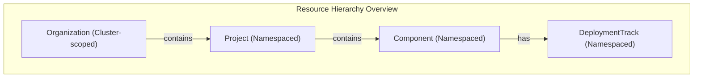
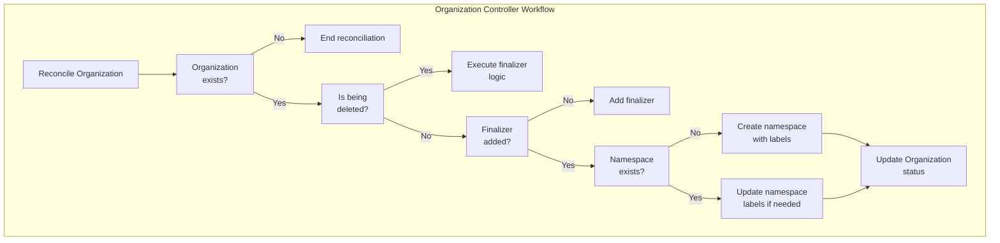
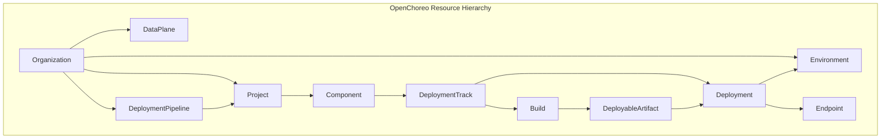
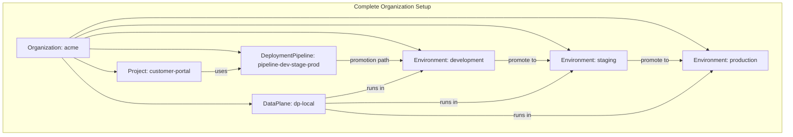

# Organization and Project

> **Relevant source files**
> * [PROJECT](https://github.com/openchoreo/openchoreo/blob/a577e969/PROJECT)
> * [cmd/main.go](https://github.com/openchoreo/openchoreo/blob/a577e969/cmd/main.go)
> * [config/crd/kustomization.yaml](https://github.com/openchoreo/openchoreo/blob/a577e969/config/crd/kustomization.yaml)
> * [config/rbac/kustomization.yaml](https://github.com/openchoreo/openchoreo/blob/a577e969/config/rbac/kustomization.yaml)
> * [config/rbac/role.yaml](https://github.com/openchoreo/openchoreo/blob/a577e969/config/rbac/role.yaml)
> * [config/samples/kustomization.yaml](https://github.com/openchoreo/openchoreo/blob/a577e969/config/samples/kustomization.yaml)

This document details the Organization and Project resources in OpenChoreo, which form the foundation of the resource hierarchy. These resources provide organizational structure for your applications and define how they are grouped and managed. For information about Components that run within Projects, see [Component and DeploymentTrack](/openchoreo/openchoreo/5.2-component-service).

## Introduction

OpenChoreo uses a hierarchical model for organizing resources, with Organization at the top level and Project as a grouping mechanism within an Organization. This structure enables logical separation of resources, access control, and promotion workflows across environments.



Sources: [samples/README.md L18-L20](https://github.com/openchoreo/openchoreo/blob/a577e969/samples/README.md#L18-L20)

 [internal/controller/project/controller_test.go L40-L265](https://github.com/openchoreo/openchoreo/blob/a577e969/internal/controller/project/controller_test.go#L40-L265)

## Organization Resource

The Organization is a cluster-scoped resource that serves as the top-level container for all other OpenChoreo resources. When an Organization is created, OpenChoreo automatically creates a Kubernetes namespace with the same name.

### Organization Resource Definition

An Organization resource is defined with the following structure:

```yaml
apiVersion: core.choreo.dev/v1
kind: Organization
metadata:
  name: acme
  annotations:
    core.choreo.dev/display-name: ACME Organization
    core.choreo.dev/description: Choreo Organization for ACME
  labels:
    core.choreo.dev/name: acme
spec: {}
```

Sources: [samples/configuring-choreo/create-new-organization/organization.yaml L1-L11](https://github.com/openchoreo/openchoreo/blob/a577e969/samples/configuring-choreo/create-new-organization/organization.yaml#L1-L11)

### Organization Controller Behavior

The Organization controller performs the following actions:

1. Creates a namespace with the same name as the organization
2. Adds standard labels to the namespace: * `core.choreo.dev/managed-by: choreo` * `core.choreo.dev/organization: <org-name>` * `core.choreo.dev/name: <org-name>`
3. Sets up owner references so that when the organization is deleted, the namespace is also deleted
4. Manages status conditions to reflect the current state of the organization



Sources: [internal/controller/organization/controller.go L39-L193](https://github.com/openchoreo/openchoreo/blob/a577e969/internal/controller/organization/controller.go#L39-L193)

 [internal/controller/organization/controller_finalize.go L18-L112](https://github.com/openchoreo/openchoreo/blob/a577e969/internal/controller/organization/controller_finalize.go#L18-L112)

### Organization Lifecycle Management

When an Organization is deleted, the controller:

1. Adds a "Deleting" condition to the organization status
2. Ensures the associated namespace is deleted
3. Removes the finalizer once cleanup is complete

This ensures that all resources associated with the organization are properly cleaned up.

Sources: [internal/controller/organization/controller_finalize.go L45-L112](https://github.com/openchoreo/openchoreo/blob/a577e969/internal/controller/organization/controller_finalize.go#L45-L112)

 [internal/controller/organization/controller_test.go L236-L308](https://github.com/openchoreo/openchoreo/blob/a577e969/internal/controller/organization/controller_test.go#L236-L308)

## Project Resource

A Project is a namespaced resource that belongs to an Organization and serves as a grouping mechanism for related components. Projects help organize applications and services that logically belong together.

### Project Resource Definition

A Project resource is defined with the following structure:

```yaml
apiVersion: core.choreo.dev/v1
kind: Project
metadata:
  name: customer-portal
  namespace: acme
  annotations:
    core.choreo.dev/display-name: Customer Portal
    core.choreo.dev/description: This project contains types that are used by Acme customer portal
  labels:
    core.choreo.dev/organization: acme
    core.choreo.dev/name: customer-portal
spec:
  deploymentPipelineRef: pipeline-dev-stage-prod
```

Sources: [samples/deploying-applications/add-new-project/project.yaml L1-L15](https://github.com/openchoreo/openchoreo/blob/a577e969/samples/deploying-applications/add-new-project/project.yaml#L1-L15)

### Project Controller Behavior

The Project controller performs the following actions:

1. Validates that the project belongs to a valid organization (through namespace)
2. Verifies that the referenced deployment pipeline exists
3. Manages the project's status conditions
4. Handles cleanup when a project is deleted

Sources: [internal/controller/project/controller_test.go L40-L265](https://github.com/openchoreo/openchoreo/blob/a577e969/internal/controller/project/controller_test.go#L40-L265)

## Resource Hierarchy and Relationships

The Organization and Project resources form part of a larger hierarchy in OpenChoreo, which controls how resources are organized and promoted through environments.



Sources: [samples/README.md L18-L23](https://github.com/openchoreo/openchoreo/blob/a577e969/samples/README.md#L18-L23)

 [internal/controller/component/controller_test.go L40-L318](https://github.com/openchoreo/openchoreo/blob/a577e969/internal/controller/component/controller_test.go#L40-L318)

 [internal/controller/project/controller_test.go L40-L265](https://github.com/openchoreo/openchoreo/blob/a577e969/internal/controller/project/controller_test.go#L40-L265)

### Key Relationships

1. **Organization to Project**: An organization contains multiple projects, each representing a logical grouping of components.
2. **Project to DeploymentPipeline**: A project references a deployment pipeline that defines how components are promoted across environments.
3. **Project to Component**: Components (services, web applications, tasks) are created within projects.

### Labels and Ownership

Resources in OpenChoreo use labels to establish relationships:

| Label | Purpose |
| --- | --- |
| `core.choreo.dev/organization` | Identifies which organization a resource belongs to |
| `core.choreo.dev/project` | Identifies which project a component belongs to |
| `core.choreo.dev/name` | Human-readable identifier for the resource |

These labels enable efficient querying and relationship management within the system.

Sources: [internal/controller/organization/controller.go L187-L193](https://github.com/openchoreo/openchoreo/blob/a577e969/internal/controller/organization/controller.go#L187-L193)

 [internal/controller/project/controller_test.go L183-L186](https://github.com/openchoreo/openchoreo/blob/a577e969/internal/controller/project/controller_test.go#L183-L186)

## Usage Examples

### Creating an Organization

To create a new organization named "acme":

```
choreoctl apply -f organization.yaml
```

Example organization.yaml:

```yaml
apiVersion: core.choreo.dev/v1
kind: Organization
metadata:
  name: acme
  annotations:
    core.choreo.dev/display-name: ACME Organization
    core.choreo.dev/description: Choreo Organization for ACME
  labels:
    core.choreo.dev/name: acme
spec: {}
```

Sources: [samples/configuring-choreo/create-new-organization/README.md L12-L22](https://github.com/openchoreo/openchoreo/blob/a577e969/samples/configuring-choreo/create-new-organization/README.md#L12-L22)

### Creating a Project

To create a new project within an organization:

```
choreoctl apply -f project.yaml
```

Example project.yaml:

```yaml
apiVersion: core.choreo.dev/v1
kind: Project
metadata:
  name: customer-portal
  namespace: acme
  annotations:
    core.choreo.dev/display-name: Customer Portal
    core.choreo.dev/description: This project contains types that are used by Acme customer portal
  labels:
    core.choreo.dev/organization: acme
    core.choreo.dev/name: customer-portal
spec:
  deploymentPipelineRef: pipeline-dev-stage-prod
```

Sources: [samples/deploying-applications/add-new-project/README.md L13-L24](https://github.com/openchoreo/openchoreo/blob/a577e969/samples/deploying-applications/add-new-project/README.md#L13-L24)

## Default Organization Setup

When OpenChoreo is installed, it automatically creates:

* A default organization
* A default data plane
* Three default environments (Dev, Staging, Prod)
* A default deployment pipeline connecting these environments
* A default project to organize applications

This default setup allows you to get started quickly. Once you're comfortable with the system, you can create your own organizations, projects, and other resources to match your specific needs.

Sources: [samples/README.md L10-L17](https://github.com/openchoreo/openchoreo/blob/a577e969/samples/README.md#L10-L17)

## Complete Organization Setup

For a complete organization setup that includes all necessary resources, you can create:

1. An Organization
2. A DataPlane
3. Environments (Development, Staging, Production)
4. A DeploymentPipeline connecting these environments
5. Projects within the organization

Here's a visual representation of a complete organization setup:



Sources: [samples/configuring-choreo/create-new-organization/complete-organization.yaml L1-L98](https://github.com/openchoreo/openchoreo/blob/a577e969/samples/configuring-choreo/create-new-organization/complete-organization.yaml#L1-L98)