# Platform Abstractions

> **Relevant source files**
> * [PROJECT](https://github.com/openchoreo/openchoreo/blob/a577e969/PROJECT)
> * [README.md](https://github.com/openchoreo/openchoreo/blob/a577e969/README.md)
> * [cmd/main.go](https://github.com/openchoreo/openchoreo/blob/a577e969/cmd/main.go)
> * [config/crd/kustomization.yaml](https://github.com/openchoreo/openchoreo/blob/a577e969/config/crd/kustomization.yaml)
> * [config/rbac/kustomization.yaml](https://github.com/openchoreo/openchoreo/blob/a577e969/config/rbac/kustomization.yaml)
> * [config/rbac/role.yaml](https://github.com/openchoreo/openchoreo/blob/a577e969/config/rbac/role.yaml)
> * [config/samples/kustomization.yaml](https://github.com/openchoreo/openchoreo/blob/a577e969/config/samples/kustomization.yaml)
> * [docs/images/openchoreo-cell-runtime-view.png](https://github.com/openchoreo/openchoreo/blob/a577e969/docs/images/openchoreo-cell-runtime-view.png)
> * [docs/images/openchoreo-ddd-to-cell-mapping.png](https://github.com/openchoreo/openchoreo/blob/a577e969/docs/images/openchoreo-ddd-to-cell-mapping.png)
> * [docs/images/openchoreo-development-abstractions.png](https://github.com/openchoreo/openchoreo/blob/a577e969/docs/images/openchoreo-development-abstractions.png)
> * [docs/images/openchoreo-overall-architecture.png](https://github.com/openchoreo/openchoreo/blob/a577e969/docs/images/openchoreo-overall-architecture.png)
> * [docs/images/openchoreo-platform-abstractions.png](https://github.com/openchoreo/openchoreo/blob/a577e969/docs/images/openchoreo-platform-abstractions.png)

## Purpose and Scope

This page explains OpenChoreo's three-layer abstraction model that transforms Kubernetes primitives into a developer-friendly Internal Developer Platform. These abstractions separate concerns between platform engineers (who define infrastructure), application developers (who build services), and runtime operations (how components execute).

For details on the Cell runtime model and traffic patterns, see [Cell Runtime Model](/openchoreo/openchoreo/2.2-cell-runtime-model). For information on how controllers manage these abstractions, see [Controller Manager](/openchoreo/openchoreo/2.4-controller-manager).

## Overview of the Three Layers

OpenChoreo organizes abstractions into three distinct layers:

| Layer | Managed By | Purpose | Key Resources |
| --- | --- | --- | --- |
| **Platform** | Platform Engineers | Define infrastructure topology, deployment environments, and promotion rules | Organization, DataPlane, BuildPlane, Environment, DeploymentPipeline |
| **Development** | Application Developers | Define application architecture, components, and their interfaces | Project, Component, Endpoint, Connection |
| **Runtime** | System (automated) | Execution model that enforces boundaries and observability | Cell (Project instance) |

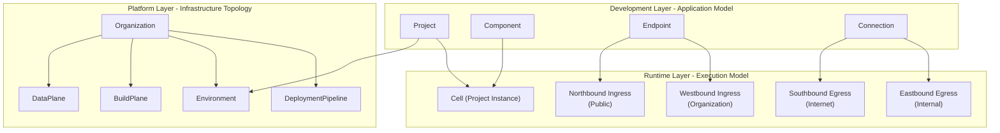

**Sources:** [README.md L21-L88](https://github.com/openchoreo/openchoreo/blob/a577e969/README.md#L21-L88)

## Platform Abstractions

Platform abstractions enable platform engineers to define the infrastructure topology and operational policies. These are **cluster-scoped or organization-scoped** resources that establish the foundation for application deployment.

### Organization

The `Organization` is a cluster-scoped Custom Resource representing a logical grouping of users and resources, typically aligned to a company, business unit, or team.

**CRD Definition:** `openchoreo.dev_organizations.yaml`

**Controller:** `organization.Reconciler`

**Key Characteristics:**

* Cluster-scoped (not namespaced)
* Acts as the root of the resource hierarchy
* Contains Projects, Environments, DataPlanes, and BuildPlanes
* Defines organizational boundaries for multi-tenancy

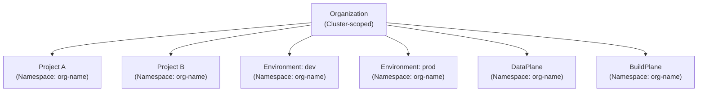

**Sources:** [cmd/main.go L179-L185](https://github.com/openchoreo/openchoreo/blob/a577e969/cmd/main.go#L179-L185)

 [config/crd/kustomization.yaml L5](https://github.com/openchoreo/openchoreo/blob/a577e969/config/crd/kustomization.yaml#L5-L5)

 [README.md L32-L33](https://github.com/openchoreo/openchoreo/blob/a577e969/README.md#L32-L33)

### DataPlane

The `DataPlane` resource represents a Kubernetes cluster that hosts application workloads. It defines connection details for the controller to provision resources in the target cluster.

**CRD Definition:** `openchoreo.dev_dataplanes.yaml`

**Controller:** `dataplane.Reconciler`

**Namespace:** Organization name (e.g., `org-name`)

**Purpose:**

* References a Kubernetes cluster where applications run
* Stores connection credentials (kubeconfig or service account)
* Enables multi-cluster deployments

**Status Fields:**

* Connectivity status
* Available resources
* Health checks

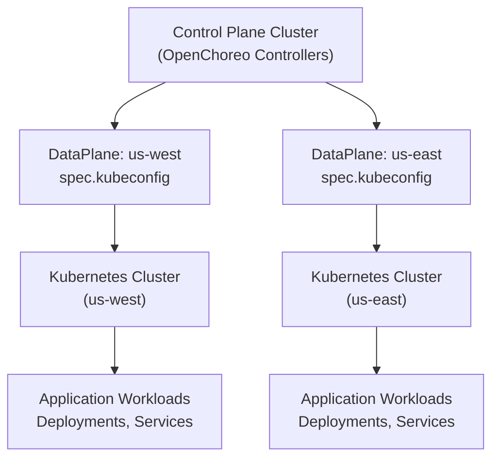

**Sources:** [cmd/main.go L200-L206](https://github.com/openchoreo/openchoreo/blob/a577e969/cmd/main.go#L200-L206)

 [config/crd/kustomization.yaml L8](https://github.com/openchoreo/openchoreo/blob/a577e969/config/crd/kustomization.yaml#L8-L8)

 [README.md L34-L35](https://github.com/openchoreo/openchoreo/blob/a577e969/README.md#L34-L35)

### BuildPlane

The `BuildPlane` resource represents a Kubernetes cluster configured with Argo Workflows for executing builds. This is where source code is compiled into container images.

**CRD Definition:** `openchoreo.dev_buildplanes.yaml`

**Controller:** `buildplane.BuildPlaneReconciler`

**Namespace:** Organization name

**Purpose:**

* References a Kubernetes cluster running Argo Workflows
* Defines build execution environment
* Separates build workloads from application workloads

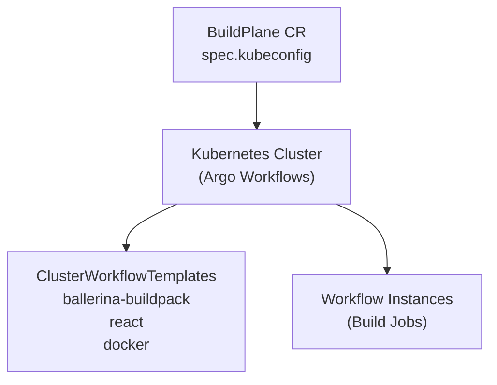

**Sources:** [cmd/main.go L374-L380](https://github.com/openchoreo/openchoreo/blob/a577e969/cmd/main.go#L374-L380)

 [config/crd/kustomization.yaml L32](https://github.com/openchoreo/openchoreo/blob/a577e969/config/crd/kustomization.yaml#L32-L32)

 [README.md L34-L35](https://github.com/openchoreo/openchoreo/blob/a577e969/README.md#L34-L35)

### Environment

The `Environment` resource represents a runtime context (e.g., dev, test, staging, prod) where workloads are deployed and executed.

**CRD Definition:** `openchoreo.dev_environments.yaml`

**Controller:** `environment.Reconciler`

**Namespace:** Organization name

**Key Attributes:**

* References a `DataPlane` for workload placement
* Defines environment-specific configuration
* Used for deployment targeting and promotion

**Namespace Mapping:**
Projects deployed to an Environment create a namespace in the DataPlane cluster following the pattern: `{project-name}-{environment-name}`

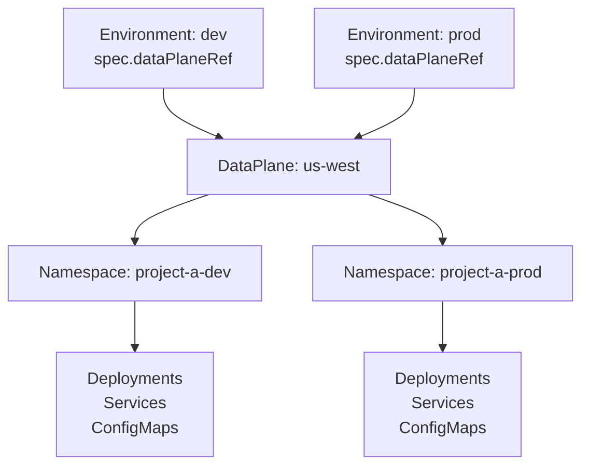

**Sources:** [cmd/main.go L193-L199](https://github.com/openchoreo/openchoreo/blob/a577e969/cmd/main.go#L193-L199)

 [config/crd/kustomization.yaml L7](https://github.com/openchoreo/openchoreo/blob/a577e969/config/crd/kustomization.yaml#L7-L7)

 [README.md L36-L37](https://github.com/openchoreo/openchoreo/blob/a577e969/README.md#L36-L37)

### DeploymentPipeline

The `DeploymentPipeline` resource defines the process governing how workloads are promoted across environments.

**CRD Definition:** `openchoreo.dev_deploymentpipelines.yaml`

**Controller:** `deploymentpipeline.Reconciler`

**Namespace:** Organization name

**Purpose:**

* Defines ordered sequence of Environments
* Specifies promotion rules and approval gates
* Enforces deployment topology (e.g., dev → test → staging → prod)

**Key Concepts:**

* **DeploymentTracks:** Ordered list of environment stages
* **Promotion Rules:** Conditions for moving between stages
* **Validation:** Enforced during component promotion API calls

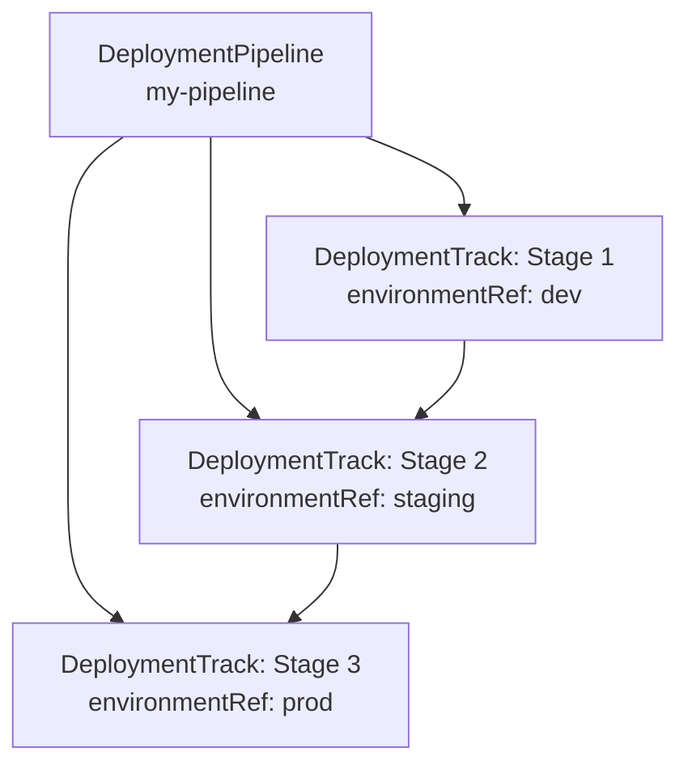

**Sources:** [cmd/main.go L207-L213](https://github.com/openchoreo/openchoreo/blob/a577e969/cmd/main.go#L207-L213)

 [config/crd/kustomization.yaml L9](https://github.com/openchoreo/openchoreo/blob/a577e969/config/crd/kustomization.yaml#L9-L9)

 [README.md L38-L39](https://github.com/openchoreo/openchoreo/blob/a577e969/README.md#L38-L39)

## Development Abstractions

Development abstractions enable application developers to define their services and APIs without dealing with Kubernetes primitives. These resources describe **application structure** and **intent**.

### Project

The `Project` represents a cloud-native application composed of multiple components. It serves as the unit of isolation and maps to a bounded context in Domain-Driven Design.

**CRD Definition:** `openchoreo.dev_projects.yaml`

**Controller:** `project.Reconciler`

**Namespace:** Organization name

**Key Characteristics:**

* Groups related Components
* Maps to a set of Namespaces (one per Environment) in DataPlanes
* Instantiated as a **Cell** at runtime
* References a `DeploymentPipeline` for promotion rules

**Kubernetes Mapping:**

```yaml
Project: "my-app"
Environment: "dev"
→ Namespace: "my-app-dev" (in DataPlane cluster)

Project: "my-app"
Environment: "prod"
→ Namespace: "my-app-prod" (in DataPlane cluster)
```

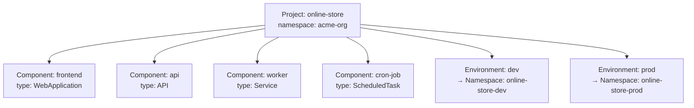

**Sources:** [cmd/main.go L186-L192](https://github.com/openchoreo/openchoreo/blob/a577e969/cmd/main.go#L186-L192)

 [config/crd/kustomization.yaml L6](https://github.com/openchoreo/openchoreo/blob/a577e969/config/crd/kustomization.yaml#L6-L6)

 [README.md L51-L53](https://github.com/openchoreo/openchoreo/blob/a577e969/README.md#L51-L53)

### Component

The `Component` is a deployable unit within a Project. OpenChoreo supports specialized component types through a **Class-Instance-Binding** pattern.

**Base CRD:** `openchoreo.dev_components.yaml`

**Controller:** `component.Reconciler`

**Namespace:** Project namespace (e.g., `project-name` within the organization namespace)

#### Component Types

OpenChoreo provides four specialized component types:

| Type | Purpose | Kubernetes Mapping | Controller |
| --- | --- | --- | --- |
| **API** | RESTful API service | Deployment + Service | `api.Reconciler` |
| **Service** | Backend service | Deployment + Service | `service.Reconciler` |
| **WebApplication** | Frontend web app | Deployment + Service | `webapplication.Reconciler` |
| **ScheduledTask** | Cron job | CronJob | `scheduledtask.Reconciler` |

Each type has three associated resources following the Class-Instance-Binding pattern:

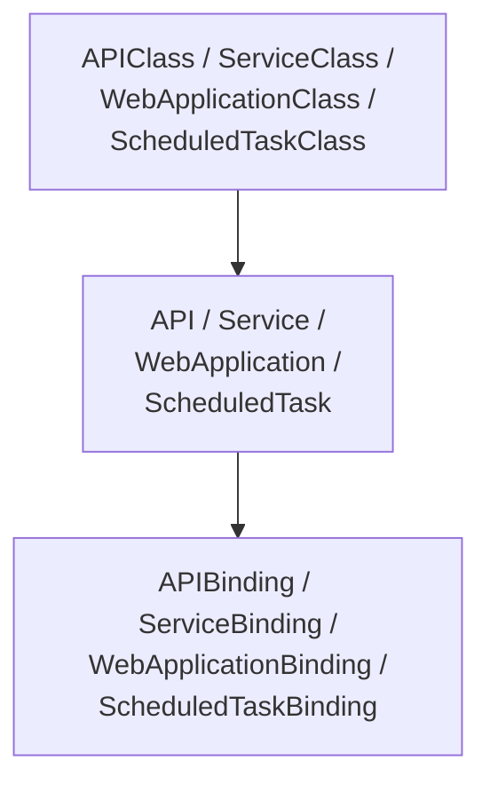

**Example - API Component:**

```yaml
apiVersion: openchoreo.dev/v1alpha1
kind: API
metadata:
  name: orders-api
  namespace: online-store
spec:
  # Source or image reference
  # Build configuration
  # Resource requirements
---
apiVersion: openchoreo.dev/v1alpha1
kind: APIBinding
metadata:
  name: orders-api-dev
  namespace: online-store
spec:
  apiRef: orders-api
  environmentRef: dev
  state: active  # active, suspend, undeploy
```

**Sources:** [cmd/main.go L251-L357](https://github.com/openchoreo/openchoreo/blob/a577e969/cmd/main.go#L251-L357)

 [config/crd/kustomization.yaml L10-L29](https://github.com/openchoreo/openchoreo/blob/a577e969/config/crd/kustomization.yaml#L10-L29)

 [README.md L54-L56](https://github.com/openchoreo/openchoreo/blob/a577e969/README.md#L54-L56)

### Endpoint

The `Endpoint` resource represents a network-accessible interface exposed by a Component. It defines routing rules, protocols, and **visibility scopes**.

**CRD Definition:** `openchoreo.dev_endpoints.yaml`

**Controller:** `endpoint.Reconciler`

**Namespace:** Project namespace

**Visibility Scopes:**

| Visibility | Ingress Path | Access Scope | Gateway |
| --- | --- | --- | --- |
| **public** | Northbound | Internet (external users) | `gateway-external` |
| **organization** | Westbound | Organization-internal only | `gateway-internal` |
| **project** | Intra-Cell | Same project components | Service mesh |

**Kubernetes Mapping:**

* `HTTPRoute` (Gateway API) for routing
* `SecurityPolicy` (Envoy Gateway) for authentication/authorization
* `HTTPRouteFilter` (Envoy Gateway) for transformations
* `CiliumNetworkPolicy` for zero-trust enforcement

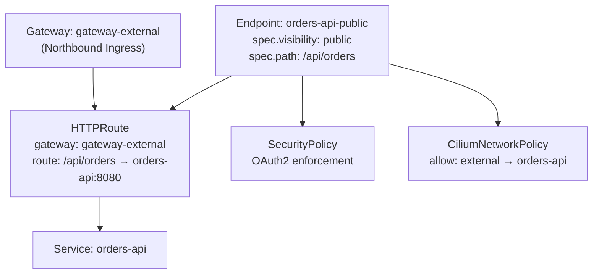

**Sources:** [cmd/main.go L235-L241](https://github.com/openchoreo/openchoreo/blob/a577e969/cmd/main.go#L235-L241)

 [config/crd/kustomization.yaml L14](https://github.com/openchoreo/openchoreo/blob/a577e969/config/crd/kustomization.yaml#L14-L14)

 [README.md L57-L59](https://github.com/openchoreo/openchoreo/blob/a577e969/README.md#L57-L59)

### Connection

The `Connection` represents an outbound service dependency defined by a Component, targeting either other components or external systems.

**Purpose:**

* Declares explicit dependencies
* Enables network policy generation
* Routes through appropriate egress gateways

**Kubernetes Mapping:**

* `CiliumNetworkPolicy` (egress rules)
* Envoy egress gateway routing

**Connection Types:**

| Target | Egress Path | Purpose |
| --- | --- | --- |
| **External Service** | Southbound | Internet-bound traffic (APIs, databases) |
| **Other Project** | Eastbound | Cross-project communication |
| **Same Project** | Intra-Cell | Component-to-component within project |

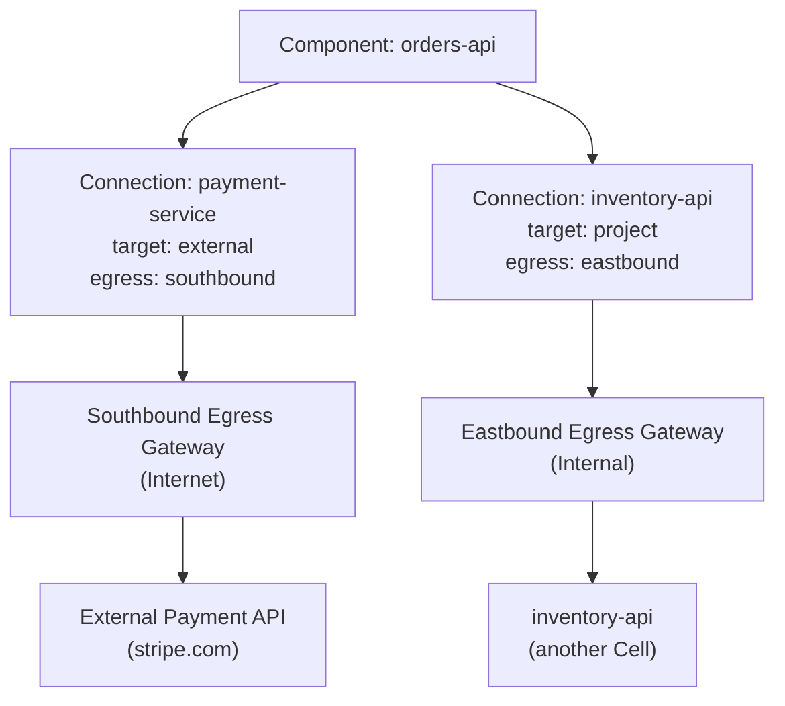

**Sources:** [README.md L60-L62](https://github.com/openchoreo/openchoreo/blob/a577e969/README.md#L60-L62)

## Runtime Abstraction: Cell

At runtime, OpenChoreo instantiates each Project as a **Cell** – a secure, isolated, and observable unit that enforces domain boundaries through infrastructure.

### Cell Characteristics

**Key Properties:**

* One Cell per Project per Environment
* Components within a Cell can communicate without interception
* All ingress/egress traffic passes through gateways
* Zero-trust enforcement via Cilium and eBPF
* mTLS encryption for all traffic
* Built-in observability (logs, metrics, traces)

**Cell Boundaries:**
Each Cell has four directional traffic paths:

| Path | Direction | Purpose | Gateway | Network Policy |
| --- | --- | --- | --- | --- |
| **Northbound** | Ingress | Public internet → Cell | `gateway-external` | Cilium (public endpoints) |
| **Westbound** | Ingress | Organization → Cell | `gateway-internal` | Cilium (org endpoints) |
| **Southbound** | Egress | Cell → Internet | Egress gateway | Cilium (external connections) |
| **Eastbound** | Egress | Cell → Other Cells | Egress gateway | Cilium (internal connections) |

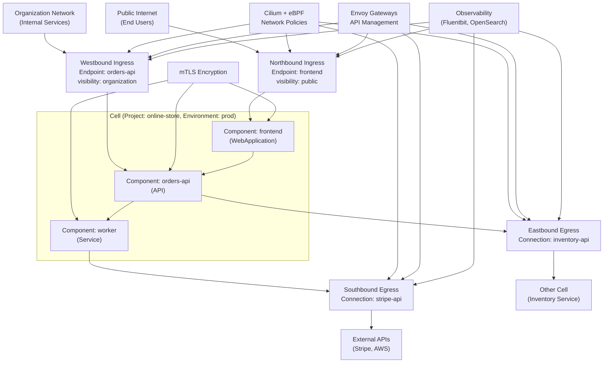

**Sources:** [README.md L72-L88](https://github.com/openchoreo/openchoreo/blob/a577e969/README.md#L72-L88)

## Abstraction Hierarchy and Relationships

The following diagram illustrates the complete hierarchy from Platform layer through Development layer to Runtime execution:

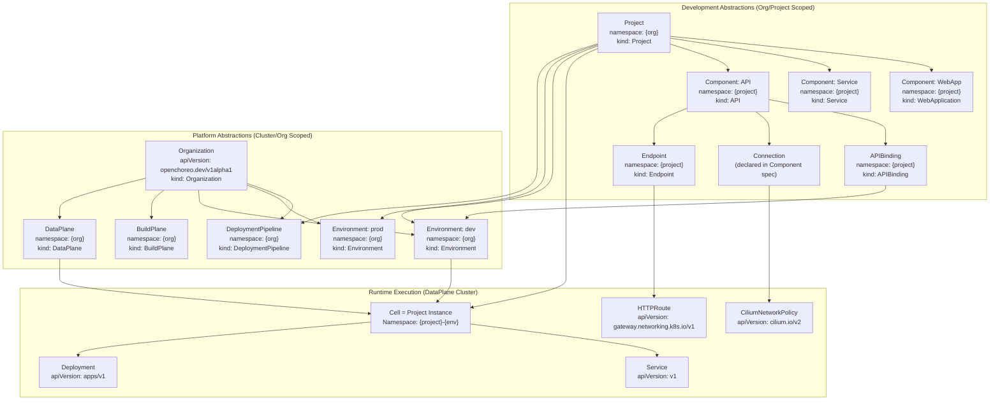

**Sources:** [README.md L21-L119](https://github.com/openchoreo/openchoreo/blob/a577e969/README.md#L21-L119)

 [cmd/main.go L62-L409](https://github.com/openchoreo/openchoreo/blob/a577e969/cmd/main.go#L62-L409)

## Controller Registration and Scheme Setup

All abstraction resources are registered with the controller manager at startup and added to the Kubernetes scheme.

**Scheme Setup:**

```go
// cmd/main.go:66-76
func init() {
    utilruntime.Must(clientgoscheme.AddToScheme(scheme))
    utilruntime.Must(ciliumv2.AddToScheme(scheme))
    utilruntime.Must(openchoreov1alpha1.AddToScheme(scheme))
    utilruntime.Must(gwapiv1.Install(scheme))
    utilruntime.Must(egv1a1.AddToScheme(scheme))
    utilruntime.Must(argo.AddToScheme(scheme))
    utilruntime.Must(csisecretv1.Install(scheme))
}
```

**Controller Registration:**
The main function registers reconcilers for each abstraction:

| Abstraction | Controller Type | Registration Code |
| --- | --- | --- |
| Organization | `organization.Reconciler` | [cmd/main.go L179-L185](https://github.com/openchoreo/openchoreo/blob/a577e969/cmd/main.go#L179-L185) |
| Project | `project.Reconciler` | [cmd/main.go L186-L192](https://github.com/openchoreo/openchoreo/blob/a577e969/cmd/main.go#L186-L192) |
| Environment | `environment.Reconciler` | [cmd/main.go L193-L199](https://github.com/openchoreo/openchoreo/blob/a577e969/cmd/main.go#L193-L199) |
| DataPlane | `dataplane.Reconciler` | [cmd/main.go L200-L206](https://github.com/openchoreo/openchoreo/blob/a577e969/cmd/main.go#L200-L206) |
| BuildPlane | `buildplane.BuildPlaneReconciler` | [cmd/main.go L374-L380](https://github.com/openchoreo/openchoreo/blob/a577e969/cmd/main.go#L374-L380) |
| DeploymentPipeline | `deploymentpipeline.Reconciler` | [cmd/main.go L207-L213](https://github.com/openchoreo/openchoreo/blob/a577e969/cmd/main.go#L207-L213) |
| Component | `component.Reconciler` | [cmd/main.go L251-L257](https://github.com/openchoreo/openchoreo/blob/a577e969/cmd/main.go#L251-L257) |
| API | `api.Reconciler` | [cmd/main.go L268-L274](https://github.com/openchoreo/openchoreo/blob/a577e969/cmd/main.go#L268-L274) |
| Service | `service.Reconciler` | [cmd/main.go L291-L297](https://github.com/openchoreo/openchoreo/blob/a577e969/cmd/main.go#L291-L297) |
| WebApplication | `webapplication.Reconciler` | [cmd/main.go L314-L320](https://github.com/openchoreo/openchoreo/blob/a577e969/cmd/main.go#L314-L320) |
| ScheduledTask | `scheduledtask.Reconciler` | [cmd/main.go L337-L343](https://github.com/openchoreo/openchoreo/blob/a577e969/cmd/main.go#L337-L343) |
| Endpoint | `endpoint.Reconciler` | [cmd/main.go L235-L241](https://github.com/openchoreo/openchoreo/blob/a577e969/cmd/main.go#L235-L241) |

**Sources:** [cmd/main.go L66-L409](https://github.com/openchoreo/openchoreo/blob/a577e969/cmd/main.go#L66-L409)

## RBAC Permissions

The controller manager requires permissions to manage all abstraction resources plus the underlying Kubernetes resources they provision.

**Key Permissions:**

* Full CRUD on all OpenChoreo CRDs (`openchoreo.dev/*`)
* Manage core resources: `namespaces`, `services`, `configmaps`
* Manage workload resources: `deployments`, `cronjobs`
* Manage network resources: `ciliumnetworkpolicies`, `httproutes`, `securitypolicies`

**Complete Permission Matrix:** [config/rbac/role.yaml L1-L227](https://github.com/openchoreo/openchoreo/blob/a577e969/config/rbac/role.yaml#L1-L227)

**Sources:** [config/rbac/role.yaml L1-L227](https://github.com/openchoreo/openchoreo/blob/a577e969/config/rbac/role.yaml#L1-L227)

 [config/rbac/kustomization.yaml L1-L101](https://github.com/openchoreo/openchoreo/blob/a577e969/config/rbac/kustomization.yaml#L1-L101)

## Summary

OpenChoreo's three-layer abstraction model provides:

1. **Platform Abstractions**: Infrastructure topology defined by platform engineers (Organization, DataPlane, Environment)
2. **Development Abstractions**: Application structure defined by developers (Project, Component, Endpoint, Connection)
3. **Runtime Abstractions**: Secure execution model enforced by the system (Cell)

This separation enables:

* Platform teams to define standards and enforce policies
* Development teams to focus on business logic without Kubernetes complexity
* Runtime system to enforce security, observability, and isolation automatically

The abstractions are implemented as Kubernetes Custom Resources with dedicated controllers that translate high-level intent into low-level Kubernetes primitives.

**Sources:** [README.md L1-L175](https://github.com/openchoreo/openchoreo/blob/a577e969/README.md#L1-L175)

 [cmd/main.go L1-L410](https://github.com/openchoreo/openchoreo/blob/a577e969/cmd/main.go#L1-L410)

 [PROJECT L1-L202](https://github.com/openchoreo/openchoreo/blob/a577e969/PROJECT#L1-L202)