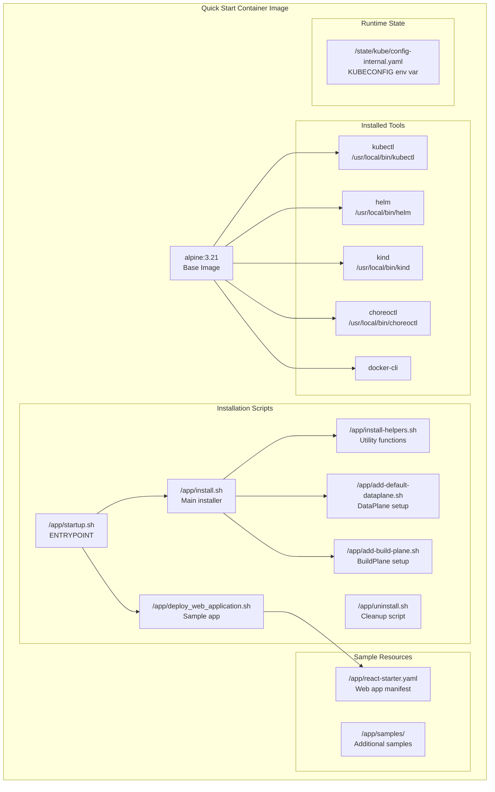
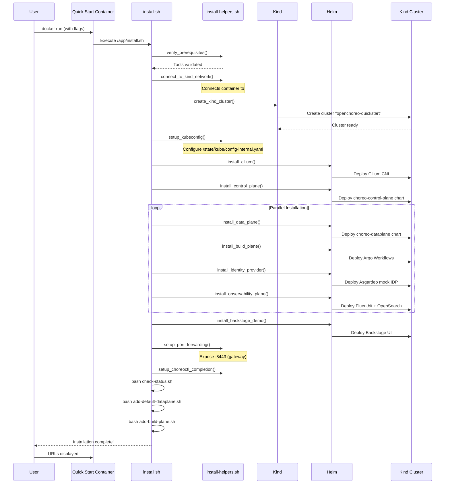
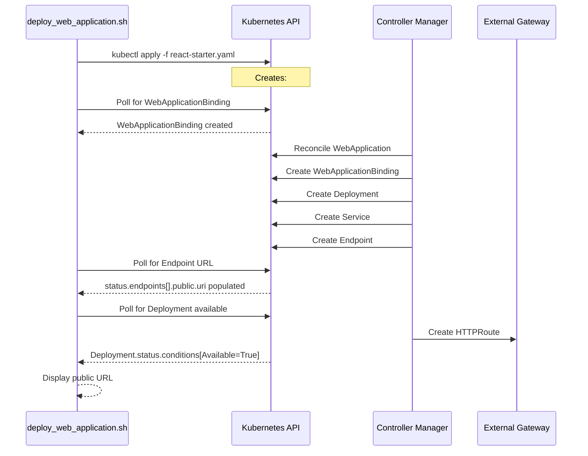

# Quick Start Installation

> **Relevant source files**
> * [.github/CODEOWNERS](https://github.com/openchoreo/openchoreo/blob/a577e969/.github/CODEOWNERS)
> * [.github/ISSUE_TEMPLATE/01-bug-report.yml](https://github.com/openchoreo/openchoreo/blob/a577e969/.github/ISSUE_TEMPLATE/01-bug-report.yml)
> * [.github/ISSUE_TEMPLATE/02-task.yml](https://github.com/openchoreo/openchoreo/blob/a577e969/.github/ISSUE_TEMPLATE/02-task.yml)
> * [.github/ISSUE_TEMPLATE/03-release.md](https://github.com/openchoreo/openchoreo/blob/a577e969/.github/ISSUE_TEMPLATE/03-release.md)
> * [.github/pull_request_template.md](https://github.com/openchoreo/openchoreo/blob/a577e969/.github/pull_request_template.md)
> * [docs/contributors/README.md](https://github.com/openchoreo/openchoreo/blob/a577e969/docs/contributors/README.md)
> * [docs/contributors/contribute.md](https://github.com/openchoreo/openchoreo/blob/a577e969/docs/contributors/contribute.md)
> * [docs/contributors/release.md](https://github.com/openchoreo/openchoreo/blob/a577e969/docs/contributors/release.md)
> * [docs/install-guide-multi-cluster.md](https://github.com/openchoreo/openchoreo/blob/a577e969/docs/install-guide-multi-cluster.md)
> * [install/quick-start/Dockerfile](https://github.com/openchoreo/openchoreo/blob/a577e969/install/quick-start/Dockerfile)
> * [install/quick-start/deploy_web_application.sh](https://github.com/openchoreo/openchoreo/blob/a577e969/install/quick-start/deploy_web_application.sh)
> * [install/quick-start/install.sh](https://github.com/openchoreo/openchoreo/blob/a577e969/install/quick-start/install.sh)
> * [install/quick-start/uninstall.sh](https://github.com/openchoreo/openchoreo/blob/a577e969/install/quick-start/uninstall.sh)

This document describes the containerized quick-start installation method for OpenChoreo, which provides a pre-packaged Docker environment with all necessary tools and automated installation scripts. This approach installs all OpenChoreo components (Control Plane, Data Plane, Build Plane) in a single Kubernetes cluster running inside a Docker container, making it ideal for evaluation, learning, and local development.

For multi-cluster installations with separate Control Plane and Data Plane clusters, see [Multi-Cluster Installation](/openchoreo/openchoreo/7.2-multi-cluster-installation). For an overview of installation approaches and prerequisites, see [Installation Overview](/openchoreo/openchoreo/7.1-installation-overview).

---

## Quick Start Container Overview

The quick-start installation uses a Docker image that packages all required tools and installation scripts into a single container. When started, the container automatically creates a Kind (Kubernetes in Docker) cluster and installs all OpenChoreo components.

### Container Components

The quick-start Docker image includes:

| Component | Version/Source | Purpose |
| --- | --- | --- |
| `kubectl` | Latest stable | Kubernetes CLI for cluster operations |
| `helm` | Latest stable (v3) | Package manager for Kubernetes |
| `kind` | v0.27.0 | Creates Kubernetes cluster in Docker |
| `docker-cli` | Alpine package | Docker client for container operations |
| `choreoctl` | Built from source | OpenChoreo CLI tool |
| Installation scripts | `/app/*.sh` | Automated installation orchestration |
| Sample applications | `/app/samples/` | Example deployments |

**Dockerfile Structure Diagram**



Sources: [install/quick-start/Dockerfile L1-L49](https://github.com/openchoreo/openchoreo/blob/a577e969/install/quick-start/Dockerfile#L1-L49)

---

## Prerequisites

### Host Machine Requirements

* **Docker**: Version 23.0+ with daemon running
* **Operating System**: Linux, macOS, or Windows with Docker Desktop
* **Resources**: * Minimum 4GB RAM available for Docker * 10GB disk space * CPU with at least 2 cores

### Verify Docker Installation

```
docker version
docker ps
```

No other tools (kubectl, helm, kind) need to be installed on the host machine, as they are included in the container.

Sources: [docs/contributors/contribute.md L4-L10](https://github.com/openchoreo/openchoreo/blob/a577e969/docs/contributors/contribute.md#L4-L10)

---

## Running the Quick Start Container

### Pull and Start the Container

```markdown
# Pull the latest quick-start image
docker pull ghcr.io/openchoreo/openchoreo-quick-start:latest

# Run the container with host Docker socket mounted
docker run -it --rm \
  --name openchoreo-quick-start \
  -v /var/run/docker.sock:/var/run/docker.sock \
  -v openchoreo-state:/state \
  -p 8443:8443 \
  -p 7007:7007 \
  ghcr.io/openchoreo/openchoreo-quick-start:latest
```

### Volume Mounts Explained

| Mount | Purpose |
| --- | --- |
| `/var/run/docker.sock` | Allows container to create Kind cluster using host Docker |
| `openchoreo-state:/state` | Persists kubeconfig and cluster state across container restarts |
| `-p 8443:8443` | Exposes external gateway for application access |
| `-p 7007:7007` | Exposes Backstage demo UI |

### Installation Options

The container accepts the following flags via the entrypoint:

```markdown
# Enable observability plane (Fluentbit + OpenSearch)
docker run -it --rm [...] \
  ghcr.io/openchoreo/openchoreo-quick-start:latest \
  --enable-observability

# Install specific OpenChoreo version
docker run -it --rm [...] \
  ghcr.io/openchoreo/openchoreo-quick-start:latest \
  --openchoreo-version v1.2.3

# Skip final status check
docker run -it --rm [...] \
  ghcr.io/openchoreo/openchoreo-quick-start:latest \
  --skip-status-check
```

Sources: [install/quick-start/Dockerfile L26-L48](https://github.com/openchoreo/openchoreo/blob/a577e969/install/quick-start/Dockerfile#L26-L48)

 [install/quick-start/install.sh L10-L50](https://github.com/openchoreo/openchoreo/blob/a577e969/install/quick-start/install.sh#L10-L50)

---

## Installation Process

When the container starts, the `startup.sh` entrypoint invokes `install.sh`, which orchestrates a multi-stage installation process.

### Installation Flow Diagram



### Installation Stages

The installation proceeds through these stages, implemented in `install.sh`:

#### 1. Prerequisites Verification

[install/quick-start/install.sh L64-L65](https://github.com/openchoreo/openchoreo/blob/a577e969/install/quick-start/install.sh#L64-L65)

Validates that required tools (kubectl, helm, kind, docker) are available in the container.

#### 2. Network Configuration

[install/quick-start/install.sh L67-L68](https://github.com/openchoreo/openchoreo/blob/a577e969/install/quick-start/install.sh#L67-L68)

Connects the quick-start container to Docker's `kind` network, enabling communication between the container and the Kind cluster's Docker containers.

#### 3. Kind Cluster Creation

[install/quick-start/install.sh L70-L71](https://github.com/openchoreo/openchoreo/blob/a577e969/install/quick-start/install.sh#L70-L71)

Creates a single-node Kubernetes cluster named `openchoreo-quickstart` using Kind with the node image `kindest/node:v1.32.0`.

#### 4. Kubeconfig Setup

[install/quick-start/install.sh L73-L74](https://github.com/openchoreo/openchoreo/blob/a577e969/install/quick-start/install.sh#L73-L74)

Configures `$KUBECONFIG` environment variable to point to `/state/kube/config-internal.yaml`, containing cluster credentials.

#### 5. Cilium Installation

[install/quick-start/install.sh L76-L77](https://github.com/openchoreo/openchoreo/blob/a577e969/install/quick-start/install.sh#L76-L77)

Installs Cilium CNI for networking, network policies, and service mesh capabilities.

#### 6. Control Plane Installation

[install/quick-start/install.sh L79-L80](https://github.com/openchoreo/openchoreo/blob/a577e969/install/quick-start/install.sh#L79-L80)

Deploys the `choreo-control-plane` Helm chart containing:

* Controller Manager with all reconcilers
* OpenChoreo API server
* Custom Resource Definitions (CRDs)

#### 7. Parallel Component Installation

[install/quick-start/install.sh L82-L122](https://github.com/openchoreo/openchoreo/blob/a577e969/install/quick-start/install.sh#L82-L122)

Three components are installed concurrently to reduce total installation time:

| Component | Chart/Resources | Purpose |
| --- | --- | --- |
| **Data Plane** | `choreo-dataplane` | Gateway infrastructure, network policies |
| **Build Plane** | `openchoreo-build-plane` (Argo Workflows) | Container build orchestration |
| **Identity Provider** | Asgardeo mock | OAuth2/OIDC authentication |

The script spawns each installation as a background process, waits for all to complete, and checks exit codes.

#### 8. Observability Plane (Optional)

[install/quick-start/install.sh L124-L127](https://github.com/openchoreo/openchoreo/blob/a577e969/install/quick-start/install.sh#L124-L127)

If `--enable-observability` flag is provided, installs:

* Fluentbit (log collection)
* OpenSearch (log storage and search)
* Observer service (log query API)

#### 9. Backstage Demo Installation

[install/quick-start/install.sh L129-L130](https://github.com/openchoreo/openchoreo/blob/a577e969/install/quick-start/install.sh#L129-L130)

Deploys Backstage developer portal UI for browsing OpenChoreo resources.

#### 10. Port Forwarding Setup

[install/quick-start/install.sh L132-L133](https://github.com/openchoreo/openchoreo/blob/a577e969/install/quick-start/install.sh#L132-L133)

Uses `socat` to forward ports from the container to the Kind cluster:

* Port 8443 → `choreo-external-gateway` service (application access)
* Port 7007 → `backstage` service (UI access)

#### 11. Default DataPlane Configuration

[install/quick-start/install.sh L143-L148](https://github.com/openchoreo/openchoreo/blob/a577e969/install/quick-start/install.sh#L143-L148)

Executes `add-default-dataplane.sh --single-cluster` to create a `DataPlane` custom resource pointing to the local cluster.

#### 12. Default BuildPlane Configuration

[install/quick-start/install.sh L150-L155](https://github.com/openchoreo/openchoreo/blob/a577e969/install/quick-start/install.sh#L150-L155)

Executes `add-build-plane.sh` to create a `BuildPlane` custom resource for Argo Workflows integration.

Sources: [install/quick-start/install.sh L52-L163](https://github.com/openchoreo/openchoreo/blob/a577e969/install/quick-start/install.sh#L52-L163)

---

## Installed Components Architecture

After installation completes, the Kind cluster contains all OpenChoreo components in a single-cluster configuration:

```

```

Sources: [install/quick-start/install.sh L79-L130](https://github.com/openchoreo/openchoreo/blob/a577e969/install/quick-start/install.sh#L79-L130)

 [docs/install-guide-multi-cluster.md L82-L102](https://github.com/openchoreo/openchoreo/blob/a577e969/docs/install-guide-multi-cluster.md#L82-L102)

---

## Accessing the System

Once installation completes, you are dropped into an interactive bash shell inside the container with the custom prompt `openchoreo-quick-start:/app#`.

### Verify Installation

```markdown
# Check cluster status
kubectl cluster-info

# List all pods in choreo-system namespace
kubectl get pods -n choreo-system

# Verify OpenChoreo CRDs are installed
kubectl get crds | grep openchoreo

# Check choreoctl is available
choreoctl --help
```

### Access URLs

After successful installation, these URLs are available on your host machine:

| Service | URL | Purpose |
| --- | --- | --- |
| **External Gateway** | [https://localhost:8443](https://localhost:8443) | Access deployed applications |
| **Backstage Demo** | [http://localhost:7007](http://localhost:7007) | Browse OpenChoreo resources via UI |

**Note**: The external gateway URL will be referenced as the base for application endpoints. Individual application URLs follow the pattern:

```html
https://<org>-<project>-<component>-<hash>-<env>.localhost:8443
```

Sources: [install/quick-start/install.sh L157-L161](https://github.com/openchoreo/openchoreo/blob/a577e969/install/quick-start/install.sh#L157-L161)

---

## Deploying Sample Applications

The quick-start container includes a sample React web application that can be deployed to verify the installation.

### Automatic Sample Deployment

The container can automatically deploy a sample application:

```markdown
# Inside the container, run:
bash /app/deploy_web_application.sh
```

### Sample Deployment Process

The `deploy_web_application.sh` script performs the following:



The script monitors the following resources and conditions:

1. **WebApplicationBinding creation**: [install/quick-start/deploy_web_application.sh L38-L49](https://github.com/openchoreo/openchoreo/blob/a577e969/install/quick-start/deploy_web_application.sh#L38-L49)
2. **Ready condition and public URL**: [install/quick-start/deploy_web_application.sh L51-L64](https://github.com/openchoreo/openchoreo/blob/a577e969/install/quick-start/deploy_web_application.sh#L51-L64)
3. **Deployment availability**: [install/quick-start/deploy_web_application.sh L66-L78](https://github.com/openchoreo/openchoreo/blob/a577e969/install/quick-start/deploy_web_application.sh#L66-L78)

### Manual Sample Deployment

Alternatively, deploy samples manually using `choreoctl`:

```markdown
# View available samples
ls /app/samples/

# Deploy using choreoctl
choreoctl apply -f /app/samples/from-image/react-starter-web-app/react-starter.yaml

# Check component status
choreoctl get components

# Get deployment status
kubectl get webapplicationbindings

# Access the application
# The URL will be displayed in the WebApplicationBinding status
kubectl get webapplicationbinding <name> -o jsonpath='{.status.endpoints[0].public.uri}'
```

Sources: [install/quick-start/deploy_web_application.sh L1-L83](https://github.com/openchoreo/openchoreo/blob/a577e969/install/quick-start/deploy_web_application.sh#L1-L83)

 [install/quick-start/Dockerfile L34-L36](https://github.com/openchoreo/openchoreo/blob/a577e969/install/quick-start/Dockerfile#L34-L36)

---

## Using choreoctl

The `choreoctl` CLI is pre-installed and configured in the container with bash completion enabled.

### Common Commands

```sql
# Create an organization
choreoctl create organization my-org

# Create a project
choreoctl create project my-project -n my-org

# Apply component manifest
choreoctl apply -f component.yaml

# Get component status
choreoctl get components -n my-org

# Trigger a build
choreoctl create build my-component --version 1.0.0

# View logs
choreoctl logs component my-component
```

### Bash Completion

Bash completion is automatically configured in the container environment [install/quick-start/install.sh L135-L136](https://github.com/openchoreo/openchoreo/blob/a577e969/install/quick-start/install.sh#L135-L136)

 Press Tab to autocomplete `choreoctl` commands and resource names.

Sources: [install/quick-start/Dockerfile L39-L44](https://github.com/openchoreo/openchoreo/blob/a577e969/install/quick-start/Dockerfile#L39-L44)

 [docs/install-guide-multi-cluster.md L143-L204](https://github.com/openchoreo/openchoreo/blob/a577e969/docs/install-guide-multi-cluster.md#L143-L204)

---

## Configuration Files

Key configuration files created during installation:

| File Path | Purpose | Content |
| --- | --- | --- |
| `/state/kube/config-internal.yaml` | Kubeconfig | Cluster credentials, referenced by `$KUBECONFIG` |
| `/etc/bash_completion.d/kubectl` | Shell completion | kubectl autocompletion |
| `/etc/bash_completion.d/helm` | Shell completion | helm autocompletion |
| `/usr/local/bin/choreoctl-completion` | Shell completion | choreoctl autocompletion |
| `/app/react-starter.yaml` | Sample manifest | React web application definition |

Sources: [install/quick-start/Dockerfile L26-L44](https://github.com/openchoreo/openchoreo/blob/a577e969/install/quick-start/Dockerfile#L26-L44)

---

## Troubleshooting

### Container Cannot Connect to Kind Network

**Symptom**: Installation fails with Docker network connection errors.

**Solution**: Ensure the Docker socket is properly mounted:

```
docker run -it --rm \
  -v /var/run/docker.sock:/var/run/docker.sock \
  ...
```

### Port Conflicts on Host

**Symptom**: Ports 8443 or 7007 are already in use on the host machine.

**Solution**: Map to different host ports:

```
docker run -it --rm \
  -p 9443:8443 \
  -p 8007:7007 \
  ...
```

Then access services at `https://localhost:9443` and `http://localhost:8007`.

### Installation Fails During Parallel Phase

**Symptom**: One of Data Plane, Build Plane, or Identity Provider installation fails.

**Diagnostics**:

```markdown
# Check installation logs
kubectl get pods -n choreo-system
kubectl logs -n choreo-system <failing-pod>

# Check Helm releases
helm list -A
```

**Recovery**:

```markdown
# Re-run installation with skip-status-check to avoid early exit
/app/install.sh --skip-status-check

# Manually install failed component
helm install <component> <chart-url> -n choreo-system
```

Sources: [install/quick-start/install.sh L106-L120](https://github.com/openchoreo/openchoreo/blob/a577e969/install/quick-start/install.sh#L106-L120)

### Kubeconfig Not Found

**Symptom**: `kubectl` or `choreoctl` commands fail with "unable to read client config".

**Solution**: Verify the `$KUBECONFIG` environment variable:

```javascript
echo $KUBECONFIG
# Should output: /state/kube/config-internal.yaml

# If not set, re-export:
export KUBECONFIG=/state/kube/config-internal.yaml
```

Sources: [install/quick-start/Dockerfile L26](https://github.com/openchoreo/openchoreo/blob/a577e969/install/quick-start/Dockerfile#L26-L26)

---

## Uninstallation

To remove the quick-start installation:

### From Within Container

```markdown
# Interactive uninstall (prompts for confirmation)
bash /app/uninstall.sh

# Force uninstall without confirmation
bash /app/uninstall.sh --force
```

### Uninstallation Process

The `uninstall.sh` script performs cleanup in this order:

1. **Stop port forwarding**: Kills all `socat` processes [install/quick-start/uninstall.sh L59-L60](https://github.com/openchoreo/openchoreo/blob/a577e969/install/quick-start/uninstall.sh#L59-L60)
2. **Delete Kind cluster**: Removes `openchoreo-quickstart` cluster [install/quick-start/uninstall.sh L63-L72](https://github.com/openchoreo/openchoreo/blob/a577e969/install/quick-start/uninstall.sh#L63-L72)
3. **Remove kubeconfig**: Deletes `/state/kube/config-internal.yaml` [install/quick-start/uninstall.sh L75-L89](https://github.com/openchoreo/openchoreo/blob/a577e969/install/quick-start/uninstall.sh#L75-L89)
4. **Clean completion files**: Removes choreoctl bash completion [install/quick-start/uninstall.sh L92-L100](https://github.com/openchoreo/openchoreo/blob/a577e969/install/quick-start/uninstall.sh#L92-L100)

### From Host Machine

To completely remove the quick-start environment from the host:

```markdown
# Stop and remove the container
docker stop openchoreo-quick-start
docker rm openchoreo-quick-start

# Remove the state volume
docker volume rm openchoreo-state

# Remove the image (optional)
docker rmi ghcr.io/openchoreo/openchoreo-quick-start:latest
```

For detailed uninstallation procedures, see [Uninstallation](/openchoreo/openchoreo/7.4-uninstallation).

Sources: [install/quick-start/uninstall.sh L39-L106](https://github.com/openchoreo/openchoreo/blob/a577e969/install/quick-start/uninstall.sh#L39-L106)

---

## Next Steps

After completing the quick-start installation:

1. **Explore Backstage UI**: Navigate to [http://localhost:7007](http://localhost:7007) to browse OpenChoreo resources visually
2. **Deploy more samples**: Review `/app/samples/` directory for additional example applications
3. **Learn choreoctl**: See [choreoctl Commands](/openchoreo/openchoreo/8.1-choreoctl-commands) for CLI usage details
4. **Deploy your application**: Follow [Deploying Applications](/openchoreo/openchoreo/8.2-deploying-applications) to deploy custom workloads
5. **Configure observability**: Re-run installation with `--enable-observability` to enable logging, then see [Logging Architecture](/openchoreo/openchoreo/10.1-logging-architecture)

For production deployments or separate Control/Data Plane clusters, proceed to [Multi-Cluster Installation](/openchoreo/openchoreo/7.2-multi-cluster-installation).

Sources: [install/quick-start/install.sh L157-L163](https://github.com/openchoreo/openchoreo/blob/a577e969/install/quick-start/install.sh#L157-L163)

 [docs/contributors/README.md L1-L19](https://github.com/openchoreo/openchoreo/blob/a577e969/docs/contributors/README.md#L1-L19)