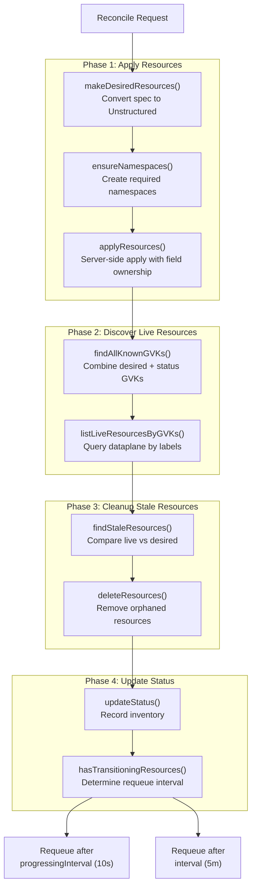
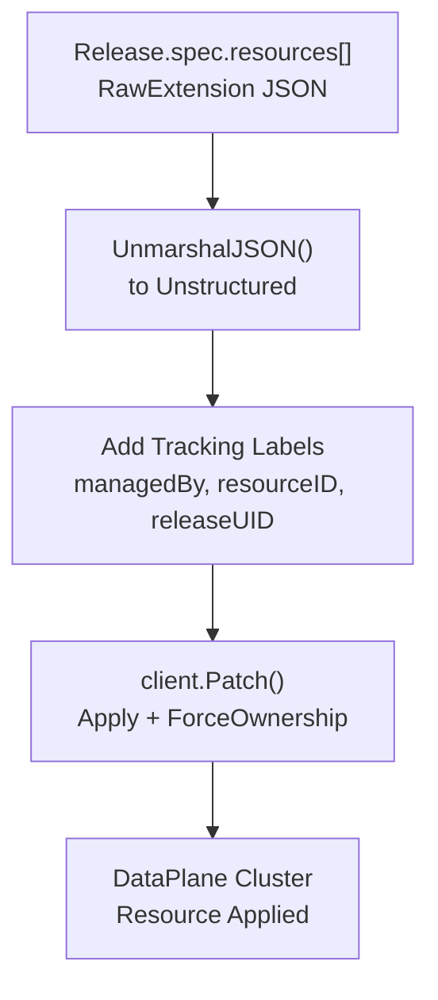
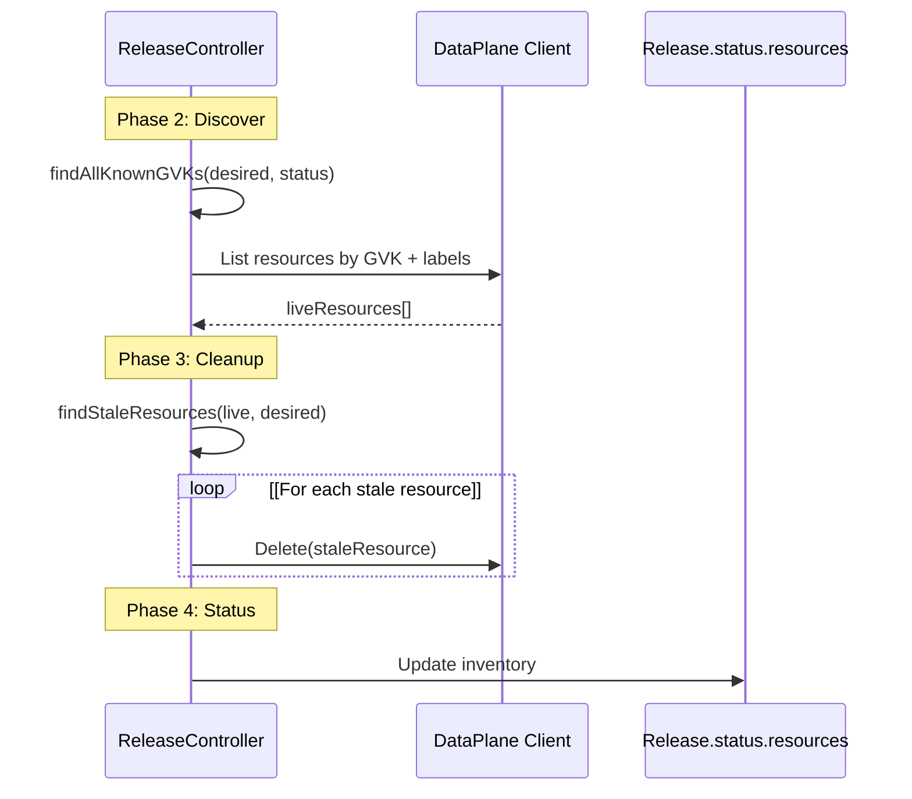
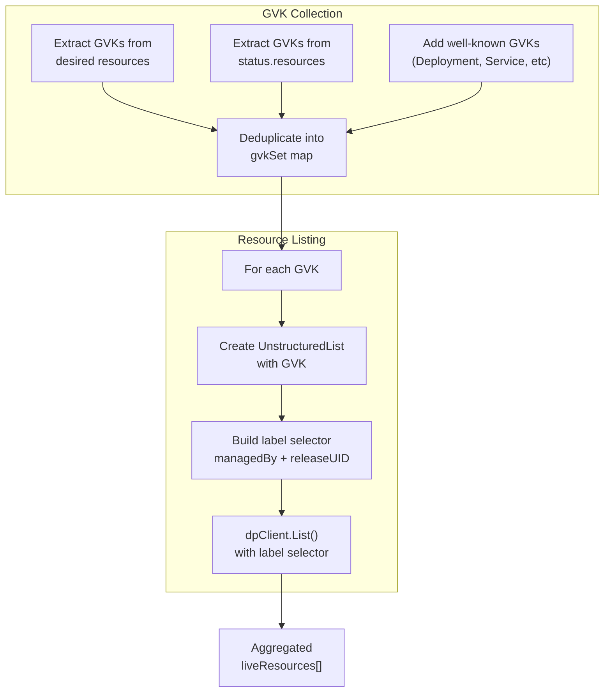
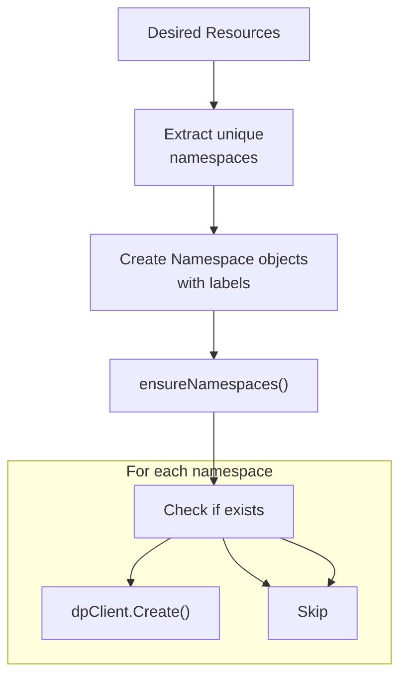
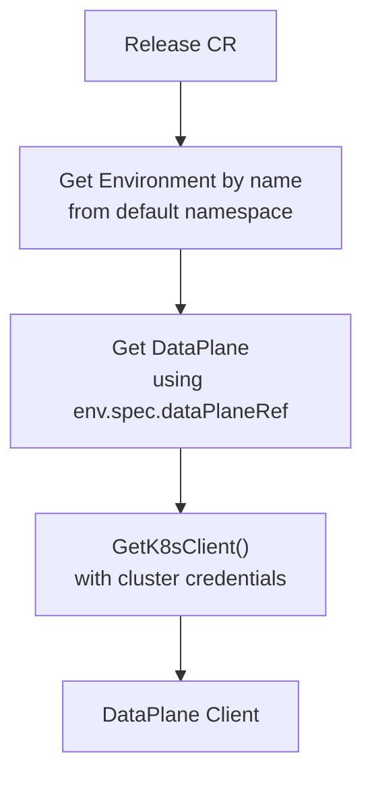
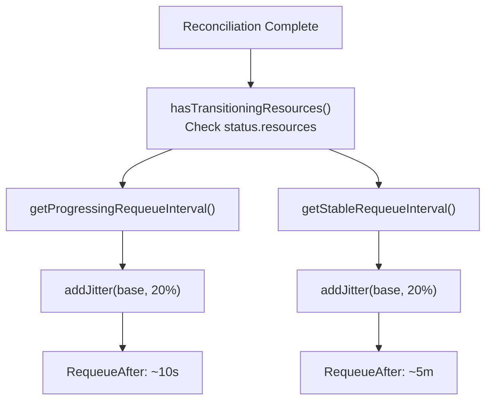
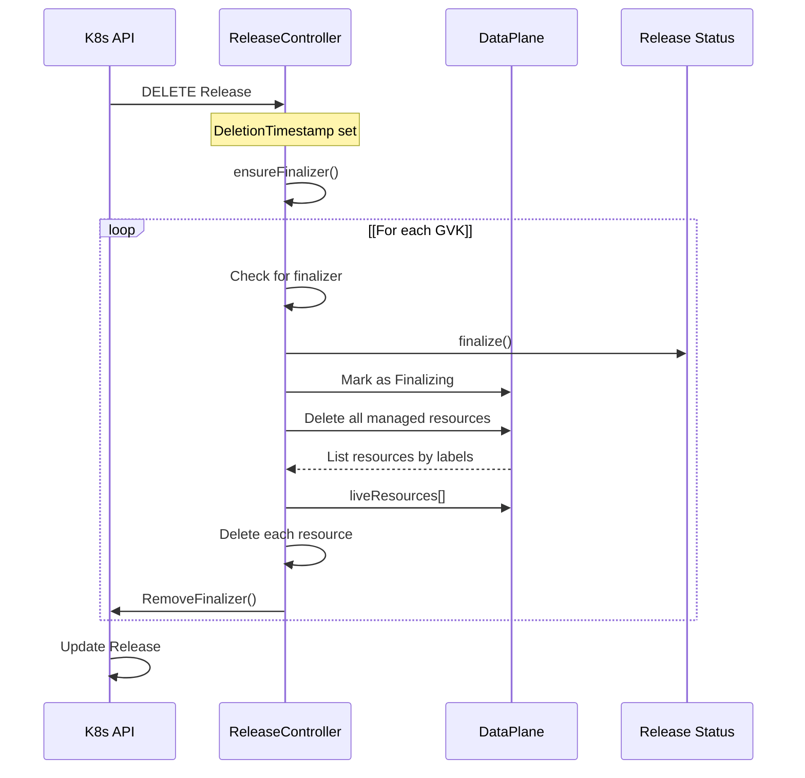
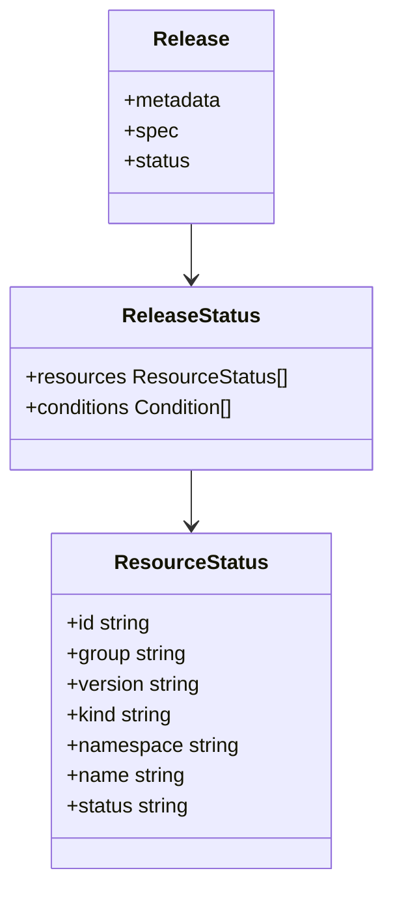
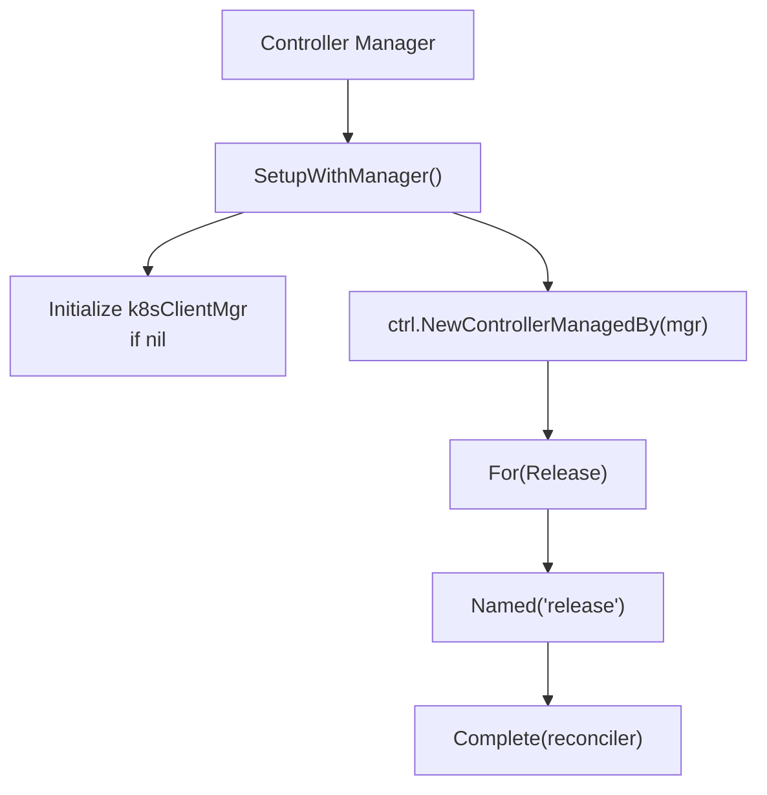

# Release Controller

> **Relevant source files**
> * [internal/controller/annotations.go](https://github.com/openchoreo/openchoreo/blob/a577e969/internal/controller/annotations.go)
> * [internal/controller/deployment/controller.go](https://github.com/openchoreo/openchoreo/blob/a577e969/internal/controller/deployment/controller.go)
> * [internal/controller/deployment/controller_endpoints.go](https://github.com/openchoreo/openchoreo/blob/a577e969/internal/controller/deployment/controller_endpoints.go)
> * [internal/controller/deployment/controller_endpoints_test.go](https://github.com/openchoreo/openchoreo/blob/a577e969/internal/controller/deployment/controller_endpoints_test.go)
> * [internal/controller/deployment/controller_finalize.go](https://github.com/openchoreo/openchoreo/blob/a577e969/internal/controller/deployment/controller_finalize.go)
> * [internal/controller/deployment/controller_test.go](https://github.com/openchoreo/openchoreo/blob/a577e969/internal/controller/deployment/controller_test.go)
> * [internal/controller/deployment/controller_watch.go](https://github.com/openchoreo/openchoreo/blob/a577e969/internal/controller/deployment/controller_watch.go)
> * [internal/controller/endpoint/controller.go](https://github.com/openchoreo/openchoreo/blob/a577e969/internal/controller/endpoint/controller.go)
> * [internal/controller/endpoint/controller_conditions.go](https://github.com/openchoreo/openchoreo/blob/a577e969/internal/controller/endpoint/controller_conditions.go)
> * [internal/controller/endpoint/controller_finalize.go](https://github.com/openchoreo/openchoreo/blob/a577e969/internal/controller/endpoint/controller_finalize.go)
> * [internal/controller/hierarchy.go](https://github.com/openchoreo/openchoreo/blob/a577e969/internal/controller/hierarchy.go)
> * [internal/controller/release/controller.go](https://github.com/openchoreo/openchoreo/blob/a577e969/internal/controller/release/controller.go)
> * [internal/controller/watch.go](https://github.com/openchoreo/openchoreo/blob/a577e969/internal/controller/watch.go)

## Purpose and Scope

The Release Controller manages the lifecycle of `Release` Custom Resources, which represent arbitrary collections of Kubernetes resources deployed to data plane clusters. This controller implements a server-side apply pattern with automatic inventory management and pruning, similar to Flux or ArgoCD's resource management approach.

The Release Controller differs from other deployment mechanisms in OpenChoreo:

* For standard component deployments with OpenChoreo's opinionated patterns, see [Deployment Controller](/openchoreo/openchoreo/4.1-deployment-controller)
* For network endpoint provisioning, see [Endpoint Controller](/openchoreo/openchoreo/4.3-endpoint-controller)
* For deployment resource management patterns, see [Resource Handlers](/openchoreo/openchoreo/4.2-resource-handlers)

**Sources:** [internal/controller/release/controller.go L1-L532](https://github.com/openchoreo/openchoreo/blob/a577e969/internal/controller/release/controller.go#L1-L532)

---

## Architecture Overview

The Release Controller follows a four-phase reconciliation pattern that ensures declarative resource management with automatic cleanup of stale resources.

### Reconciliation Phases



**Sources:** [internal/controller/release/controller.go L51-L147](https://github.com/openchoreo/openchoreo/blob/a577e969/internal/controller/release/controller.go#L51-L147)

---

## Core Components

### Reconciler Structure

The `Reconciler` struct manages the Release controller's operations:

| Field | Type | Purpose |
| --- | --- | --- |
| `Client` | `client.Client` | Control plane Kubernetes client |
| `k8sClientMgr` | `*KubeMultiClientManager` | Multi-cluster client manager |
| `Scheme` | `*runtime.Scheme` | Runtime scheme for type registration |

**Sources:** [internal/controller/release/controller.go L33-L37](https://github.com/openchoreo/openchoreo/blob/a577e969/internal/controller/release/controller.go#L33-L37)

### Controller Constants

```
ControllerName = "release-controller"
```

This constant is used as:

* The `FieldOwner` value in server-side apply operations
* The value for the `managedBy` label on managed resources

**Sources:** [internal/controller/release/controller.go L28-L30](https://github.com/openchoreo/openchoreo/blob/a577e969/internal/controller/release/controller.go#L28-L30)

---

## Server-Side Apply Pattern

The Release Controller uses Kubernetes server-side apply (SSA) to manage resources, providing declarative merging and field ownership tracking.

### Apply Process



The `applyResources()` method iterates through resources and applies each one:

```
dpClient.Patch(ctx, obj, client.Apply, client.ForceOwnership, client.FieldOwner(ControllerName))
```

**Sources:** [internal/controller/release/controller.go L172-L184](https://github.com/openchoreo/openchoreo/blob/a577e969/internal/controller/release/controller.go#L172-L184)

 [internal/controller/release/controller.go L186-L214](https://github.com/openchoreo/openchoreo/blob/a577e969/internal/controller/release/controller.go#L186-L214)

---

## Label-Based Resource Tracking

All managed resources receive tracking labels for identification and cleanup operations.

### Tracking Labels

| Label Key | Description | Example Value |
| --- | --- | --- |
| `labels.LabelKeyManagedBy` | Controller identifier | `"release-controller"` |
| `labels.LabelKeyReleaseResourceID` | Unique resource ID from spec | User-provided ID |
| `labels.LabelKeyReleaseUID` | Release CR UID | UID of Release CR |
| `labels.LabelKeyReleaseName` | Release name | Release CR name |
| `labels.LabelKeyReleaseNamespace` | Release namespace | Release CR namespace |

These labels enable:

1. **Resource Discovery**: Query all resources managed by a specific Release
2. **Ownership Verification**: Confirm which Release owns a resource
3. **Stale Resource Detection**: Compare live resources against desired spec

**Sources:** [internal/controller/release/controller.go L197-L207](https://github.com/openchoreo/openchoreo/blob/a577e969/internal/controller/release/controller.go#L197-L207)

---

## Inventory Management and Pruning

The Release Controller implements Flux-style inventory management to prevent resource accumulation over time.

### Inventory Cleanup Flow



### Why Query Both Desired and Status GVKs

The `findAllKnownGVKs()` function is critical for preventing resource leaks. It queries resource types from three sources:

1. **Desired Resources** (current spec): Resource types the user wants now
2. **Applied Resources** (previous status): Resource types managed before but may be removed
3. **Well-Known Types**: Common Kubernetes resources as a safety net

**Example Scenario:**

* Previous reconciliation: Applied ConfigMap + Secret
* Current reconciliation: User removed ConfigMap from spec
* Without status tracking: Would only query Secret, miss orphaned ConfigMap
* With status tracking: Queries both Secret + ConfigMap, finds and deletes orphaned ConfigMap

**Sources:** [internal/controller/release/controller.go L110-L120](https://github.com/openchoreo/openchoreo/blob/a577e969/internal/controller/release/controller.go#L110-L120)

 [internal/controller/release/controller.go L326-L428](https://github.com/openchoreo/openchoreo/blob/a577e969/internal/controller/release/controller.go#L326-L428)

---

## Resource Discovery by GroupVersionKind

The controller dynamically discovers managed resources across multiple resource types.

### Discovery Process



### Well-Known Resource Types

The controller includes a comprehensive list of well-known Kubernetes and CRD types to handle edge cases where status updates failed:

* **Core**: Service, ConfigMap, Secret, ServiceAccount, Namespace, PersistentVolumeClaim
* **Apps**: Deployment, StatefulSet
* **Batch**: Job, CronJob
* **Networking**: NetworkPolicy, Ingress
* **RBAC**: Role, RoleBinding, ClusterRole, ClusterRoleBinding
* **Gateway API**: HTTPRoute, Gateway
* **Envoy Gateway**: SecurityPolicy, BackendTrafficPolicy, HTTPRouteFilter
* **Third-party**: CiliumNetworkPolicy, SecretProviderClass

**Sources:** [internal/controller/release/controller.go L430-L473](https://github.com/openchoreo/openchoreo/blob/a577e969/internal/controller/release/controller.go#L430-L473)

 [internal/controller/release/controller.go L379-L426](https://github.com/openchoreo/openchoreo/blob/a577e969/internal/controller/release/controller.go#L379-L426)

---

## Namespace Management

The Release Controller automatically creates required namespaces before applying resources.

### Namespace Creation Flow



### Namespace Labels

Created namespaces receive audit and identification labels:

| Label | Purpose | Source |
| --- | --- | --- |
| `labels.LabelKeyCreatedBy` | Track controller that created namespace | `"release-controller"` |
| `labels.LabelKeyReleaseName` | Associate with Release | Release name |
| `labels.LabelKeyReleaseNamespace` | Release namespace | Release namespace |
| `labels.LabelKeyReleaseUID` | Release UID | Release UID |
| `labels.LabelKeyEnvironmentName` | Environment context | `release.spec.environmentName` |
| `labels.LabelKeyProjectName` | Project context | `release.spec.owner.projectName` |

**Sources:** [internal/controller/release/controller.go L93-L98](https://github.com/openchoreo/openchoreo/blob/a577e969/internal/controller/release/controller.go#L93-L98)

 [internal/controller/release/controller.go L216-L284](https://github.com/openchoreo/openchoreo/blob/a577e969/internal/controller/release/controller.go#L216-L284)

---

## DataPlane Client Acquisition

The Release Controller uses the multi-cluster client manager to access data plane clusters.

### Client Resolution



The `getDPClient()` method:

1. Fetches the `Environment` CR from the default namespace using `release.spec.environmentName`
2. Retrieves the `DataPlane` CR using the environment's `dataPlaneRef`
3. Uses `kubernetesClient.GetK8sClient()` with the dataplane's Kubernetes cluster configuration

**Sources:** [internal/controller/release/controller.go L149-L170](https://github.com/openchoreo/openchoreo/blob/a577e969/internal/controller/release/controller.go#L149-L170)

---

## Requeue Strategy and Jitter

The controller uses different requeue intervals based on resource state to balance responsiveness and load.

### Interval Configuration

| State | Default Interval | Configurable Via | Purpose |
| --- | --- | --- | --- |
| **Stable** | 5 minutes | `release.spec.interval` | Resources are not transitioning |
| **Progressing** | 10 seconds | `release.spec.progressingInterval` | Resources are transitioning (e.g., Pods starting) |

### Jitter Implementation

The controller adds 20% randomized jitter to prevent thundering herd:

```
base + random(0 to maxJitter)
where maxJitter = base * 0.2
```

Example: 10s base becomes 10-12s with jitter

### Requeue Decision Flow



**Setting Interval to Zero:**
If either interval is set to `0`, the controller will not requeue for that state (one-time reconciliation).

**Sources:** [internal/controller/release/controller.go L136-L146](https://github.com/openchoreo/openchoreo/blob/a577e969/internal/controller/release/controller.go#L136-L146)

 [internal/controller/release/controller.go L475-L519](https://github.com/openchoreo/openchoreo/blob/a577e969/internal/controller/release/controller.go#L475-L519)

---

## Finalization and Cleanup

The Release Controller implements finalizers to ensure proper cleanup of data plane resources when a Release is deleted.

### Finalization Flow



**Finalizer Name:** The specific finalizer name is not shown in the provided code excerpts but follows the pattern similar to other controllers.

**Sources:** [internal/controller/release/controller.go L68-L77](https://github.com/openchoreo/openchoreo/blob/a577e969/internal/controller/release/controller.go#L68-L77)

 (Note: The finalization implementation details are referenced but the full finalize method wasn't included in the provided excerpts)

---

## Status Management

The Release Controller maintains an inventory of applied resources in the status field.

### Status Structure



### Status Update Process

The `updateStatus()` method:

1. Records the inventory of all applied resources with their GVK, namespace, and name
2. Updates conditions based on reconciliation results
3. Tracks resource state transitions (for determining requeue interval)

This inventory is crucial for:

* Discovering resource types to query in future reconciliations
* Implementing cleanup of removed resources
* Providing visibility into what the Release manages

**Sources:** [internal/controller/release/controller.go L128-L131](https://github.com/openchoreo/openchoreo/blob/a577e969/internal/controller/release/controller.go#L128-L131)

---

## Controller Setup and Watches

The Release Controller registers with the controller manager and sets up watches for Release resources.

### Setup Configuration



The controller:

* Watches `Release` CRs directly (primary resource)
* Does not set up additional watches for dependent resources
* Relies on periodic requeuing for status updates

**Sources:** [internal/controller/release/controller.go L521-L531](https://github.com/openchoreo/openchoreo/blob/a577e969/internal/controller/release/controller.go#L521-L531)

---

## Key Differences from Other Controllers

The Release Controller has distinct characteristics compared to other OpenChoreo controllers:

| Aspect | Release Controller | Deployment/Endpoint Controllers |
| --- | --- | --- |
| **Resource Type** | Arbitrary Kubernetes resources | Opinionated OpenChoreo resources |
| **Apply Pattern** | Server-side apply (SSA) | Create/Update/Delete pattern via ResourceHandlers |
| **Inventory** | Explicit status tracking | Implicit via owner references |
| **Pruning** | Label-based discovery and deletion | ResourceHandler-driven cleanup |
| **Multi-GVK** | Supports any GVK | Fixed set of resource types |
| **Namespace Creation** | Automatic from resource namespaces | Handled by NamespaceHandler |

**Sources:** [internal/controller/release/controller.go L172-L184](https://github.com/openchoreo/openchoreo/blob/a577e969/internal/controller/release/controller.go#L172-L184)

 [internal/controller/deployment/controller.go L216-L261](https://github.com/openchoreo/openchoreo/blob/a577e969/internal/controller/deployment/controller.go#L216-L261)

 [internal/controller/endpoint/controller.go L122-L180](https://github.com/openchoreo/openchoreo/blob/a577e969/internal/controller/endpoint/controller.go#L122-L180)

---

## Error Handling and Resilience

The Release Controller implements several patterns for robust error handling:

### Resource Listing Resilience

When listing resources by GVK, the controller continues processing other GVKs if one fails:

```
if err := dpClient.List(ctx, list, ...); err != nil {
    logger.Error(err, "Failed to list resources", "gvk", gvk.String())
    continue // Continue with other GVKs instead of failing
}
```

This prevents a single misconfigured or unavailable resource type from blocking the entire reconciliation.

### Namespace Creation Concurrency

The `ensureNamespaces()` method handles concurrent namespace creation:

```
if apierrors.IsAlreadyExists(err) {
    // Another controller/release created it concurrently - that's fine
    continue
}
```

Multiple Releases can safely create the same namespace simultaneously.

**Sources:** [internal/controller/release/controller.go L459-L464](https://github.com/openchoreo/openchoreo/blob/a577e969/internal/controller/release/controller.go#L459-L464)

 [internal/controller/release/controller.go L270-L274](https://github.com/openchoreo/openchoreo/blob/a577e969/internal/controller/release/controller.go#L270-L274)

---

## Related Systems

* **[Deployment Controller](/openchoreo/openchoreo/4.1-deployment-controller)**: Manages standard component deployments with OpenChoreo's patterns
* **[Endpoint Controller](/openchoreo/openchoreo/4.3-endpoint-controller)**: Provisions Gateway API resources for network endpoints
* **[Resource Handlers](/openchoreo/openchoreo/4.2-resource-handlers)**: Defines the Create/Update/Delete pattern used by Deployment/Endpoint controllers
* **[Hierarchy and Finalization](/openchoreo/openchoreo/4.5-hierarchy-and-finalization)**: Label-based resource resolution and cleanup patterns

The Release Controller provides a lower-level, more flexible alternative to the opinionated Deployment Controller, suitable for managing arbitrary Kubernetes manifests outside OpenChoreo's standard component model.