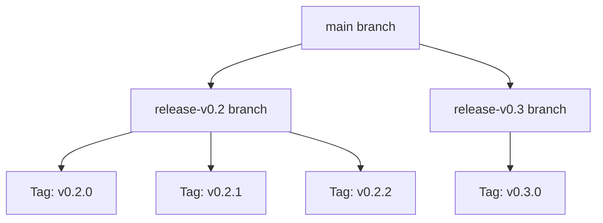
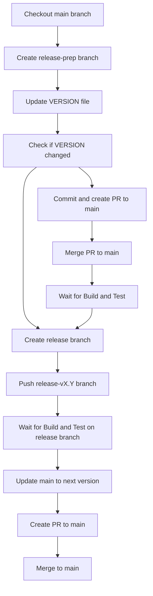
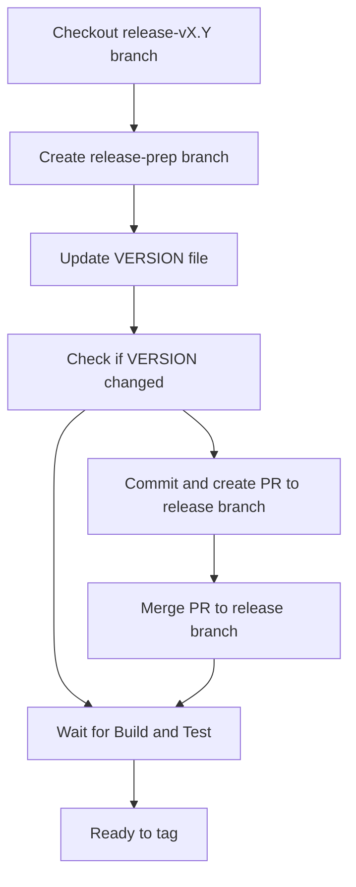
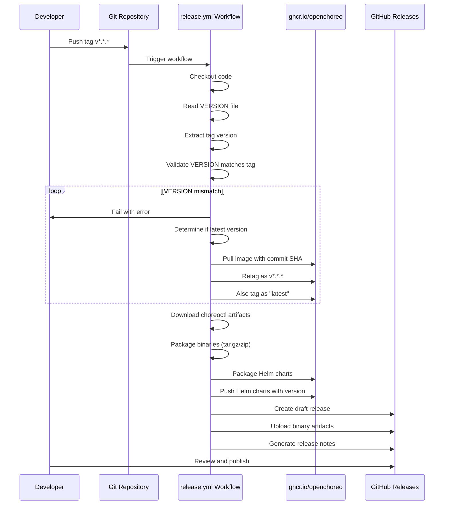

# Release Process

> **Relevant source files**
> * [.github/CODEOWNERS](https://github.com/openchoreo/openchoreo/blob/a577e969/.github/CODEOWNERS)
> * [.github/ISSUE_TEMPLATE/01-bug-report.yml](https://github.com/openchoreo/openchoreo/blob/a577e969/.github/ISSUE_TEMPLATE/01-bug-report.yml)
> * [.github/ISSUE_TEMPLATE/02-task.yml](https://github.com/openchoreo/openchoreo/blob/a577e969/.github/ISSUE_TEMPLATE/02-task.yml)
> * [.github/ISSUE_TEMPLATE/03-release.md](https://github.com/openchoreo/openchoreo/blob/a577e969/.github/ISSUE_TEMPLATE/03-release.md)
> * [.github/pull_request_template.md](https://github.com/openchoreo/openchoreo/blob/a577e969/.github/pull_request_template.md)
> * [docs/contributors/README.md](https://github.com/openchoreo/openchoreo/blob/a577e969/docs/contributors/README.md)
> * [docs/contributors/contribute.md](https://github.com/openchoreo/openchoreo/blob/a577e969/docs/contributors/contribute.md)
> * [docs/contributors/release.md](https://github.com/openchoreo/openchoreo/blob/a577e969/docs/contributors/release.md)
> * [docs/install-guide-multi-cluster.md](https://github.com/openchoreo/openchoreo/blob/a577e969/docs/install-guide-multi-cluster.md)

## Overview

This document describes the release workflow for OpenChoreo, including version management, branch creation, tagging, and GitHub Actions automation. The release process is designed to ensure consistent, reliable releases with properly versioned artifacts including container images, CLI binaries, and Helm charts.

For information about building from source and testing, see pages 9.2 and 9.3 respectively.

## Version Management

OpenChoreo follows semantic versioning (MAJOR.MINOR.PATCH) to track releases:

| Version Component | Description | Example |
| --- | --- | --- |
| MAJOR | Incompatible API changes | v2.0.0 |
| MINOR | New functionality, backward compatible | v1.4.0 |
| PATCH | Bug fixes, backward compatible | v1.4.1 |

The version is maintained in the `VERSION` file at the repository root without the leading 'v' prefix. For example:

```
0.2.0
```

When creating a release, the version tag must match the content of the `VERSION` file. Release tags follow the format `v*.*.*` (e.g., `v0.2.0`).

Sources: [VERSION L1-L2](https://github.com/openchoreo/openchoreo/blob/a577e969/VERSION#L1-L2)

 [.github/ISSUE_TEMPLATE/03-release.md L18-L23](https://github.com/openchoreo/openchoreo/blob/a577e969/.github/ISSUE_TEMPLATE/03-release.md#L18-L23)

## Release Types and Branching Strategy

OpenChoreo uses a branching strategy that differentiates between major/minor releases and patch releases.

### Release Branches

Release branches follow the naming convention `release-vMAJOR.MINOR` (e.g., `release-v0.2`). These branches are created from `main` for major/minor releases and serve as the base for subsequent patch releases in that version series.

**Release Branch Lifecycle:**



Sources: [.github/ISSUE_TEMPLATE/03-release.md L25-L59](https://github.com/openchoreo/openchoreo/blob/a577e969/.github/ISSUE_TEMPLATE/03-release.md#L25-L59)

### Major/Minor Releases

Major or minor releases (e.g., v1.4.0) introduce new features or breaking changes and follow this workflow:

1. Create a release preparation branch from `main`
2. Update the `VERSION` file with the new version
3. Merge changes to `main`
4. Create and push a new release branch (e.g., `release-v1.4`)
5. Update `main` to the next anticipated version

### Patch Releases

Patch releases (e.g., v1.4.1) contain bug fixes and follow this workflow:

1. Create a release preparation branch from the existing release branch
2. Cherry-pick or merge bug fixes into the release branch
3. Update the `VERSION` file with the new patch version
4. Merge changes to the release branch

Sources: [.github/ISSUE_TEMPLATE/03-release.md L25-L97](https://github.com/openchoreo/openchoreo/blob/a577e969/.github/ISSUE_TEMPLATE/03-release.md#L25-L97)

## Step-by-Step Release Workflow

The OpenChoreo release process is managed through a GitHub issue template that provides a comprehensive checklist. This section details the steps involved.

### Preparation Phase

Before starting a release, prepare your environment:

```javascript
# Export version variables
export MAJOR_VERSION=<MAJOR>
export MINOR_VERSION=<MINOR>
export PATCH_VERSION=<PATCH>
export GIT_REMOTE=upstream  # Remote pointing to github.com/openchoreo/openchoreo
```

Check existing releases to avoid version conflicts at [github.com/openchoreo/openchoreo/releases](https://github.com/openchoreo/openchoreo/blob/a577e969/github.com/openchoreo/openchoreo/releases)

Sources: [.github/ISSUE_TEMPLATE/03-release.md L14-L23](https://github.com/openchoreo/openchoreo/blob/a577e969/.github/ISSUE_TEMPLATE/03-release.md#L14-L23)

### Major/Minor Release Process

For creating a new major or minor release (e.g., v1.4.0):

**Create Release Preparation Branch:**



**Commands:**

```python
# Create release preparation branch from main
git checkout -b release-prep-v${MAJOR_VERSION}.${MINOR_VERSION}.${PATCH_VERSION} ${GIT_REMOTE}/main

# Update VERSION file
echo "${MAJOR_VERSION}.${MINOR_VERSION}.${PATCH_VERSION}" > VERSION

# If VERSION changed, commit and create PR to main
git add VERSION
git commit -m "Bump version to ${MAJOR_VERSION}.${MINOR_VERSION}.${PATCH_VERSION}"

# After PR is merged, create release branch
git checkout -b release-v${MAJOR_VERSION}.${MINOR_VERSION}
git push ${GIT_REMOTE} release-v${MAJOR_VERSION}.${MINOR_VERSION}

# Update main to next version
git checkout -b release-next-v${MAJOR_VERSION}.$((MINOR_VERSION + 1)).${PATCH_VERSION} ${GIT_REMOTE}/main
echo "${MAJOR_VERSION}.$((MINOR_VERSION + 1)).${PATCH_VERSION}" > VERSION
git add VERSION
git commit -m "Bump version to ${MAJOR_VERSION}.$((MINOR_VERSION + 1)).${PATCH_VERSION}"
```

Sources: [.github/ISSUE_TEMPLATE/03-release.md L25-L69](https://github.com/openchoreo/openchoreo/blob/a577e969/.github/ISSUE_TEMPLATE/03-release.md#L25-L69)

### Patch Release Process

For creating a patch release (e.g., v1.4.1):

**Workflow Diagram:**



**Commands:**

```python
# Create release preparation branch from existing release branch
git checkout -b release-prep-v${MAJOR_VERSION}.${MINOR_VERSION}.${PATCH_VERSION} ${GIT_REMOTE}/release-v${MAJOR_VERSION}.${MINOR_VERSION}

# Update VERSION file
echo "${MAJOR_VERSION}.${MINOR_VERSION}.${PATCH_VERSION}" > VERSION

# If VERSION changed, commit and create PR to release branch
git add VERSION
git commit -m "Bump version to ${MAJOR_VERSION}.${MINOR_VERSION}.${PATCH_VERSION}"

# After PR is merged, wait for Build and Test workflow to pass
```

Sources: [.github/ISSUE_TEMPLATE/03-release.md L71-L97](https://github.com/openchoreo/openchoreo/blob/a577e969/.github/ISSUE_TEMPLATE/03-release.md#L71-L97)

### Tagging the Release

Once the VERSION file is updated and all tests pass:

```sql
# Verify you're on the correct branch
git branch

# Create annotated tag
git tag -a v${MAJOR_VERSION}.${MINOR_VERSION}.${PATCH_VERSION} -m "Release v${MAJOR_VERSION}.${MINOR_VERSION}.${PATCH_VERSION}"

# Push tag to trigger release workflow
git push ${GIT_REMOTE} v${MAJOR_VERSION}.${MINOR_VERSION}.${PATCH_VERSION}
```

Pushing the tag triggers the automated Release workflow in GitHub Actions.

Sources: [.github/ISSUE_TEMPLATE/03-release.md L99-L113](https://github.com/openchoreo/openchoreo/blob/a577e969/.github/ISSUE_TEMPLATE/03-release.md#L99-L113)

### Publishing the Release

After the tag is pushed:

1. Wait for the [Release workflow](https://github.com/openchoreo/openchoreo/blob/a577e969/Release workflow)  to complete
2. Navigate to [GitHub Releases](https://github.com/openchoreo/openchoreo/blob/a577e969/GitHub Releases)  to find the draft release
3. Review the automatically generated release notes and attached artifacts
4. Mark as "Latest" if this is the most recent version (skip if releasing an older patch version)
5. Publish the release

Sources: [.github/ISSUE_TEMPLATE/03-release.md L114-L117](https://github.com/openchoreo/openchoreo/blob/a577e969/.github/ISSUE_TEMPLATE/03-release.md#L114-L117)

## GitHub Actions Release Automation

The release process is automated through the `.github/workflows/release.yml` workflow, which is triggered when a version tag matching `v*.*.*` is pushed.

### Release Workflow Overview

**Release Workflow Trigger and Execution:**



Sources: [.github/workflows/release.yml L1-L106](https://github.com/openchoreo/openchoreo/blob/a577e969/.github/workflows/release.yml#L1-L106)

### Version Validation

The workflow validates that the git tag matches the VERSION file to ensure consistency:

| Input | Source | Format |
| --- | --- | --- |
| Tag Version | `github.ref_name` | `v0.2.0` |
| File Version | `VERSION` file | `0.2.0` |

The workflow extracts the version without the 'v' prefix from the tag and compares it to the VERSION file content. If they don't match, the workflow fails.

Sources: [.github/workflows/release.yml L41-L49](https://github.com/openchoreo/openchoreo/blob/a577e969/.github/workflows/release.yml#L41-L49)

### Container Image Management

The workflow manages container images through a retagging process:

1. **Pull Development Image**: Fetches the image built during the commit's CI run (tagged with commit SHA)
2. **Retag with Version**: Tags the image with the release version (e.g., `v0.2.0`)
3. **Tag as Latest**: If this is the latest release, also tags it as `latest`

The workflow determines "latest" by checking if there are any tags in the repository with a higher version number using `git tag -l 'v*.*.*' --sort=-version:refname`.

**Container Images Published:**

* `ghcr.io/openchoreo/controller:<version>` (and `latest`)
* `ghcr.io/openchoreo/quick-start:<version>` (and `latest`)

Sources: [.github/workflows/release.yml L50-L106](https://github.com/openchoreo/openchoreo/blob/a577e969/.github/workflows/release.yml#L50-L106)

### CLI Binary Packaging

The workflow packages the `choreoctl` CLI binaries for multiple platforms:

**Supported Platforms:**

| Operating System | Architecture | Package Format |
| --- | --- | --- |
| Linux | amd64, arm64 | tar.gz |
| macOS (Darwin) | amd64, arm64 | tar.gz |
| Windows | amd64, arm64 | zip |

The binaries are downloaded from the artifacts of the Build and Test workflow, packaged with the appropriate format for each platform, and uploaded to the GitHub release.

Sources: [.github/workflows/release.yml L1-L106](https://github.com/openchoreo/openchoreo/blob/a577e969/.github/workflows/release.yml#L1-L106)

### Helm Chart Publishing

The workflow packages and publishes Helm charts to the GitHub Container Registry:

1. **Package Charts**: Creates Helm chart packages with the release version
2. **Push to OCI Registry**: Pushes charts to `ghcr.io/openchoreo/helm-charts/`

The following Helm charts are published:

* `choreo-control-plane` - Control plane components
* `choreo-dataplane` - Data plane components
* `openchoreo-build-plane` - Build plane components
* `cilium` - CNI configuration

Sources: [.github/workflows/release.yml L1-L106](https://github.com/openchoreo/openchoreo/blob/a577e969/.github/workflows/release.yml#L1-L106)

## Environment Setup for CI/CD

The OpenChoreo CI/CD pipelines use GitHub-hosted runners (Ubuntu 24.04) with Go development environments. The pipelines leverage reusable actions for environment setup:

* `.github/actions/setup-go` is used to configure the Go environment consistently

These environments are configured with the necessary permissions for:

* Reading repository content
* Writing to GitHub Packages (for container images)
* Writing to repository contents (for releases)

Sources: [.github/workflows/build-and-test.yml L15-L22](https://github.com/openchoreo/openchoreo/blob/a577e969/.github/workflows/build-and-test.yml#L15-L22)

 [.github/workflows/release.yml L13-L22](https://github.com/openchoreo/openchoreo/blob/a577e969/.github/workflows/release.yml#L13-L22)

## Key Components

The CI/CD pipeline interacts with these key components:

1. **Container Images**: * Controller image - The main OpenChoreo controller * Quick-start image - For setting up development environments
2. **CLI Tool**: * `choreoctl` - Command-line tool for interacting with OpenChoreo
3. **Helm Charts**: * Used for deploying OpenChoreo to Kubernetes clusters

## Summary

The OpenChoreo CI/CD and release process ensures that:

1. All code changes are thoroughly tested before merging
2. Development artifacts are continuously built and published
3. Releases follow a consistent versioning scheme
4. Release artifacts are properly tagged and published
5. The process is transparent and automated through GitHub Actions

This approach helps maintain code quality while providing a clear path from development to release.