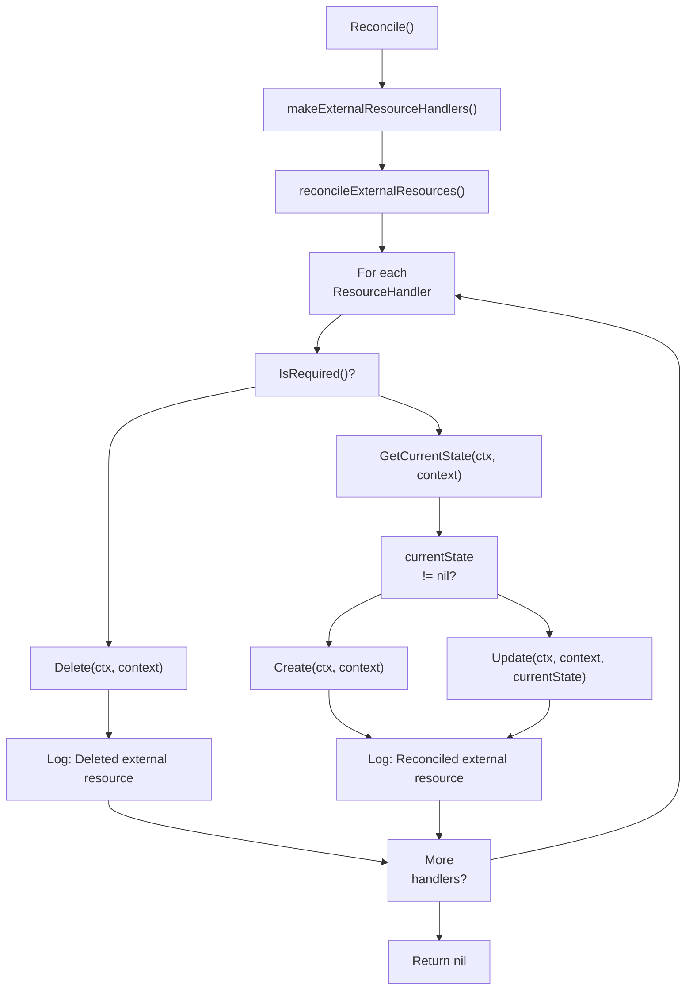
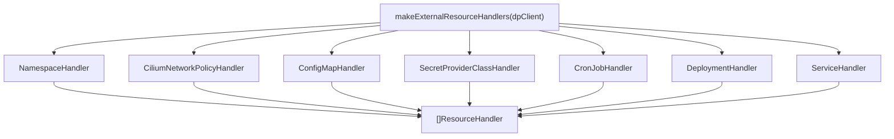
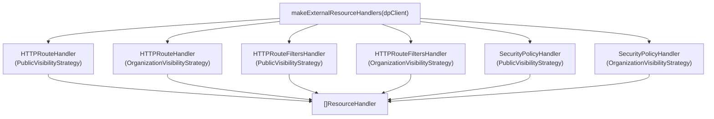
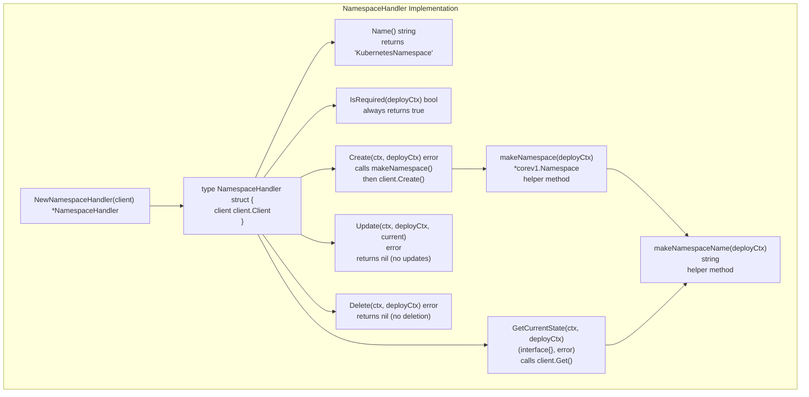
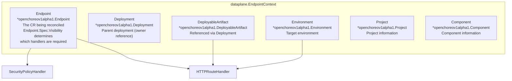
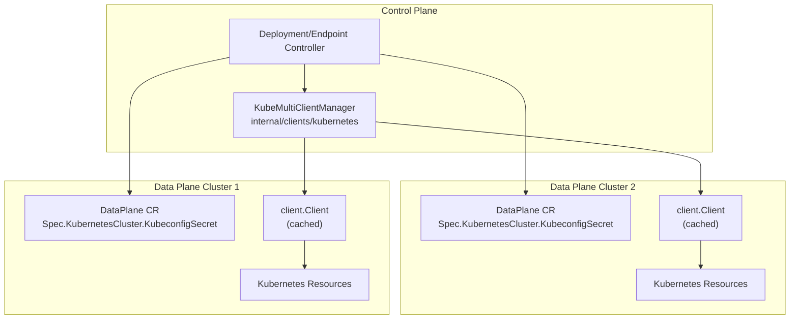
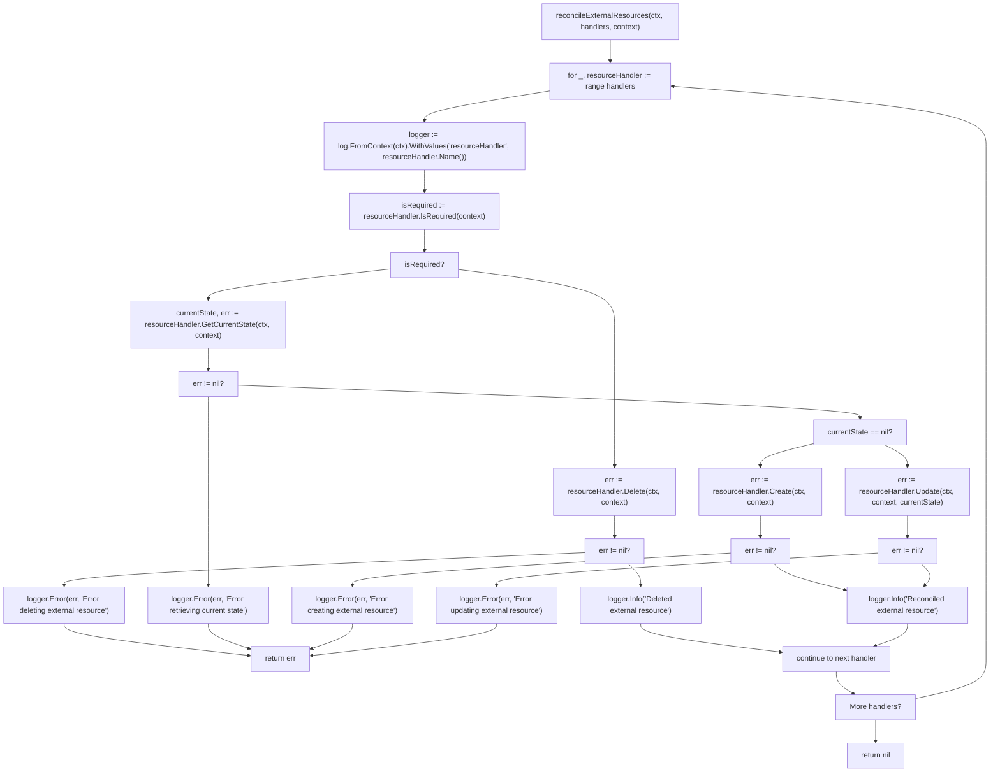

# Resource Handlers

> **Relevant source files**
> * [internal/controller/annotations.go](https://github.com/openchoreo/openchoreo/blob/a577e969/internal/controller/annotations.go)
> * [internal/controller/deployment/controller.go](https://github.com/openchoreo/openchoreo/blob/a577e969/internal/controller/deployment/controller.go)
> * [internal/controller/deployment/controller_endpoints.go](https://github.com/openchoreo/openchoreo/blob/a577e969/internal/controller/deployment/controller_endpoints.go)
> * [internal/controller/deployment/controller_endpoints_test.go](https://github.com/openchoreo/openchoreo/blob/a577e969/internal/controller/deployment/controller_endpoints_test.go)
> * [internal/controller/deployment/controller_finalize.go](https://github.com/openchoreo/openchoreo/blob/a577e969/internal/controller/deployment/controller_finalize.go)
> * [internal/controller/deployment/controller_test.go](https://github.com/openchoreo/openchoreo/blob/a577e969/internal/controller/deployment/controller_test.go)
> * [internal/controller/deployment/controller_watch.go](https://github.com/openchoreo/openchoreo/blob/a577e969/internal/controller/deployment/controller_watch.go)
> * [internal/controller/endpoint/controller.go](https://github.com/openchoreo/openchoreo/blob/a577e969/internal/controller/endpoint/controller.go)
> * [internal/controller/endpoint/controller_conditions.go](https://github.com/openchoreo/openchoreo/blob/a577e969/internal/controller/endpoint/controller_conditions.go)
> * [internal/controller/endpoint/controller_finalize.go](https://github.com/openchoreo/openchoreo/blob/a577e969/internal/controller/endpoint/controller_finalize.go)
> * [internal/controller/hierarchy.go](https://github.com/openchoreo/openchoreo/blob/a577e969/internal/controller/hierarchy.go)
> * [internal/controller/release/controller.go](https://github.com/openchoreo/openchoreo/blob/a577e969/internal/controller/release/controller.go)
> * [internal/controller/watch.go](https://github.com/openchoreo/openchoreo/blob/a577e969/internal/controller/watch.go)

## Purpose and Scope

Resource Handlers are a foundational pattern in OpenChoreo that abstract the management of external Kubernetes resources. Both the Deployment Controller and Endpoint Controller use this pattern to provision resources in the data plane cluster. This page explains the `ResourceHandler[T]` interface, its implementation pattern, and how the `reconcileExternalResources()` workflow manages resource lifecycle.

The ResourceHandler pattern enables controllers to:

* Create external resources when they don't exist
* Update external resources when configuration changes
* Delete external resources when they're no longer required
* Maintain consistent reconciliation logic across different resource types

For information about how these handlers are used in the deployment workflow, see [Deployment Controller](/openchoreo/openchoreo/4.1-deployment-controller). For endpoint-specific usage, see [Endpoint Controller](/openchoreo/openchoreo/4.3-endpoint-controller).

## ResourceHandler Interface

The `dataplane.ResourceHandler[T]` interface is defined in the `internal/dataplane` package and provides a generic contract for managing external Kubernetes resources. The type parameter `T` represents the context type (e.g., `DeploymentContext` or `EndpointContext`).

### Interface Definition

```

```

Sources:

* [internal/controller/deployment/controller.go L216-L261](https://github.com/openchoreo/openchoreo/blob/a577e969/internal/controller/deployment/controller.go#L216-L261)
* [internal/controller/endpoint/controller.go L136-L180](https://github.com/openchoreo/openchoreo/blob/a577e969/internal/controller/endpoint/controller.go#L136-L180)

### Interface Methods

| Method | Return Type | Description |
| --- | --- | --- |
| `Name()` | `string` | Returns a unique identifier for the handler (e.g., "KubernetesDeployment", "HTTPRoute-Public") |
| `IsRequired(context *T)` | `bool` | Determines whether the resource should exist based on the context. Returns `false` when the resource should be deleted |
| `GetCurrentState(ctx, context *T)` | `(interface{}, error)` | Retrieves the current state of the resource from the data plane. Returns `nil` if the resource doesn't exist |
| `Create(ctx, context *T)` | `error` | Creates the resource in the data plane |
| `Update(ctx, context *T, currentState interface{})` | `error` | Updates the existing resource to match the desired state |
| `Delete(ctx, context *T)` | `error` | Removes the resource from the data plane |

## reconcileExternalResources Workflow

Both the Deployment Controller and Endpoint Controller use a common `reconcileExternalResources()` method to orchestrate the handler chain. This method iterates through handlers and applies a consistent reconciliation pattern.

### Title: Resource Handler Reconciliation Workflow



Sources:

* [internal/controller/deployment/controller.go L216-L261](https://github.com/openchoreo/openchoreo/blob/a577e969/internal/controller/deployment/controller.go#L216-L261)
* [internal/controller/endpoint/controller.go L136-L180](https://github.com/openchoreo/openchoreo/blob/a577e969/internal/controller/endpoint/controller.go#L136-L180)

### Title: Handler Chain Initialization

Both controllers create their handler chains in `makeExternalResourceHandlers()`:

**Deployment Controller Handler Chain** (in order):



Sources:

* [internal/controller/deployment/controller.go L180-L194](https://github.com/openchoreo/openchoreo/blob/a577e969/internal/controller/deployment/controller.go#L180-L194)

**Endpoint Controller Handler Chain** (visibility-based):



Sources:

* [internal/controller/endpoint/controller.go L122-L134](https://github.com/openchoreo/openchoreo/blob/a577e969/internal/controller/endpoint/controller.go#L122-L134)

### Reconciliation Logic

The reconciliation workflow in both controllers follows this pattern:

1. **Check Requirement**: Call `IsRequired(context)` to determine if the resource should exist
2. **Conditional Delete**: If not required, call `Delete()` and continue to next handler
3. **Get Current State**: If required, retrieve current state via `GetCurrentState()`
4. **Create or Update**: * If `currentState == nil`, the resource doesn't exist → call `Create()` * If `currentState != nil`, the resource exists → call `Update()` with current state
5. **Continue Chain**: Proceed to the next handler in the chain

This pattern ensures idempotent reconciliation where resources are created, updated, or deleted based on the desired state expressed in the Custom Resource.

## Handler Implementation Pattern

Resource Handlers in the `internal/controller/deployment/integrations/kubernetes` and `internal/controller/endpoint/integrations/kubernetes` packages follow a consistent structure. Each handler is a struct containing a `client.Client` for data plane operations and implements all six interface methods.

### Title: Resource Handler Implementation Structure



Sources:

* Files in [internal/controller/deployment/integrations/kubernetes/](https://github.com/openchoreo/openchoreo/blob/a577e969/internal/controller/deployment/integrations/kubernetes/)  directory
* Files in [internal/controller/endpoint/integrations/kubernetes/](https://github.com/openchoreo/openchoreo/blob/a577e969/internal/controller/endpoint/integrations/kubernetes/)  directory

### Common Helper Methods

Most handlers implement helper methods to construct resources:

| Helper Method Pattern | Purpose | Example |
| --- | --- | --- |
| `makeX(context)` | Constructs the complete Kubernetes resource object | `makeDeployment()`, `makeService()`, `makeHTTPRoute()` |
| `makeXName(context)` | Generates a deterministic name for the resource | `makeNamespaceName()`, `makeDeploymentName()` |
| `makeXLabels(context)` | Creates label set with hierarchy information | `makeLabels()`, `makeEndpointLabels()` |
| `makeXSpec(context)` | Builds the resource's spec section | `makeDeploymentSpec()`, `makePodSpec()` |
| `shouldUpdate(current, desired)` | Compares states to determine if update is needed | Used in `Update()` methods |

### IsRequired Logic Patterns

Handlers use different strategies to determine if a resource is required:

**Always Required**: Resources like NamespaceHandler return `true` unconditionally.

**Component Type Based**: DeploymentHandler and ServiceHandler check component type:

```
IsRequired(deployCtx) returns true if:
  - Component.Spec.Type == "WebApplication" OR
  - Component.Spec.Type == "Service"
```

**Conditional Based**: CronJobHandler checks component type specifically:

```
IsRequired(deployCtx) returns true if:
  - Component.Spec.Type == "ScheduledTask"
```

**Configuration Based**: ConfigMapHandler and SecretProviderClassHandler check for configuration existence:

```
IsRequired(deployCtx) returns true if:
  - len(ConfigurationGroups) > 0 OR
  - len(FileMounts) > 0
```

**Visibility Based**: Endpoint handlers check endpoint visibility and path configuration:

```
IsRequired(endpointCtx) returns true if:
  - Endpoint.Spec.Visibility matches strategy AND
  - Endpoint.Spec.Path is configured
```

## Built-in Resource Handlers

OpenChoreo provides two sets of handlers: deployment-related handlers for application workloads and endpoint-related handlers for network ingress.

### Deployment Resource Handlers

These handlers are instantiated by the Deployment Controller to provision application workloads in the data plane.

| Handler | Resource Kind | IsRequired Condition | Order |
| --- | --- | --- | --- |
| `NamespaceHandler` | `Namespace` | Always (for all components) | 1st |
| `CiliumNetworkPolicyHandler` | `CiliumNetworkPolicy` | Always (for all components) | 2nd |
| `ConfigMapHandler` | `ConfigMap` | When ConfigurationGroups or FileMounts exist | 3rd |
| `SecretProviderClassHandler` | `SecretProviderClass` | When secret-type ConfigurationGroups exist | 4th |
| `CronJobHandler` | `CronJob` | When Component.Spec.Type == "ScheduledTask" | 5th |
| `DeploymentHandler` | `Deployment` | When Component.Spec.Type in ["WebApplication", "Service"] | 6th |
| `ServiceHandler` | `Service` | When Component.Spec.Type in ["WebApplication", "Service"] | 7th |

Sources:

* [internal/controller/deployment/controller.go L180-L194](https://github.com/openchoreo/openchoreo/blob/a577e969/internal/controller/deployment/controller.go#L180-L194)

**Handler Order Significance**: The order matters because later handlers may depend on resources created by earlier ones. For example, `DeploymentHandler` assumes the namespace exists (created by `NamespaceHandler`) and may reference ConfigMaps (created by `ConfigMapHandler`).

### Endpoint Resource Handlers

These handlers are instantiated by the Endpoint Controller to configure network ingress using Gateway API resources.

| Handler | Resource Kind | Visibility Strategy | Purpose |
| --- | --- | --- | --- |
| `HTTPRouteHandler` | `HTTPRoute` | Public | Routes external traffic via `gateway-external` |
| `HTTPRouteHandler` | `HTTPRoute` | Organization | Routes internal traffic via `gateway-internal` |
| `HTTPRouteFiltersHandler` | `HTTPRouteFilter` | Public | Configures request/response filters for public endpoints |
| `HTTPRouteFiltersHandler` | `HTTPRouteFilter` | Organization | Configures request/response filters for organization endpoints |
| `SecurityPolicyHandler` | `SecurityPolicy` | Public | Applies security policies (OAuth2, CORS) for public endpoints |
| `SecurityPolicyHandler` | `SecurityPolicy` | Organization | Applies security policies for organization endpoints |

Sources:

* [internal/controller/endpoint/controller.go L122-L134](https://github.com/openchoreo/openchoreo/blob/a577e969/internal/controller/endpoint/controller.go#L122-L134)

**Visibility Strategies**: Each endpoint handler is instantiated with either `PublicVisibilityStrategy` or `OrganizationVisibilityStrategy`. The strategy determines:

* Which Gateway to target (`gateway-external` vs `gateway-internal`)
* Whether the handler's `IsRequired()` returns true based on the endpoint's `Spec.Visibility` field
* The naming convention for created resources

### Key Handler Behaviors

#### NamespaceHandler

**Naming Pattern**: `dp-<organization>-<project>-<environment>-<hash>`

**Special Behavior**: The `Delete()` method returns `nil` without performing deletion. Namespace cleanup is handled by the Project controller through owner references, not by individual deployments.

**Why First**: All other resources require a namespace to exist before they can be created.

#### ConfigMapHandler

**Multiple Resources**: Unlike other handlers that manage a single resource, ConfigMapHandler can create multiple ConfigMaps:

* One ConfigMap per ConfigurationGroup referenced in the DeployableArtifact
* Additional ConfigMaps for file mounts specified in `Spec.Configuration.FileMounts`

**Reconciliation**: The `GetCurrentState()` method returns all ConfigMaps matching the deployment's label selector, and `Update()` performs a diff to determine which ConfigMaps to create, update, or delete.

#### DeploymentHandler and CronJobHandler

**Mutually Exclusive**: Based on component type, either DeploymentHandler or CronJobHandler will have `IsRequired() == true`, but never both.

**Pod Configuration**: Both handlers use shared helper functions like `makePodSpec()` to construct pod specifications with environment variables, volume mounts, and container configuration.

#### HTTPRouteHandler

**Gateway Selection**: Uses the `VisibilityStrategy` to determine which Gateway to reference in the HTTPRoute's `ParentRefs` field.

**Path Matching**: The handler constructs HTTPRoute rules based on `Endpoint.Spec.Path`, supporting both exact and prefix path matching.

#### SecurityPolicyHandler

**OAuth2 Integration**: When `Endpoint.Spec.Security.OAuth2` is configured, the handler creates a SecurityPolicy with JWT authentication rules, targeting the appropriate Gateway.

## Context Objects

Resource Handlers receive context objects that encapsulate all information needed for resource reconciliation. The context type depends on the controller.

### DeploymentContext

The Deployment Controller constructs a `dataplane.DeploymentContext` via `makeDeploymentContext()` and passes it to deployment-related handlers:

```mermaid
flowchart TD

Component["Component<br>*openchoreov1alpha1.Component<br>Component.Spec.Type determines<br>which handlers are required"]
DeploymentTrack["DeploymentTrack<br>*openchoreov1alpha1.DeploymentTrack<br>Provides track-level configuration"]
Deployment["Deployment<br>*openchoreov1alpha1.Deployment<br>The CR being reconciled"]
DeployableArtifact["DeployableArtifact<br>*openchoreov1alpha1.DeployableArtifact<br>Contains Configuration.Application,<br>Configuration.EndpointTemplates,<br>Configuration.FileMounts"]
Environment["Environment<br>*openchoreov1alpha1.Environment<br>Target environment for deployment"]
Project["Project<br>*openchoreov1alpha1.Project<br>Parent project information"]
ContainerImage["ContainerImage<br>string<br>Image URI from build artifact"]
ConfigurationGroups["ConfigurationGroups<br>[]*openchoreov1alpha1.ConfigurationGroup<br>Environment-specific config values"]
DeploymentHandler["DeploymentHandler"]
CronJobHandler["CronJobHandler"]
ConfigMapHandler["ConfigMapHandler"]
SecretProviderClassHandler["SecretProviderClassHandler"]
NamespaceHandler["NamespaceHandler"]

Component --> DeploymentHandler
Component --> CronJobHandler
DeployableArtifact --> ConfigMapHandler
ConfigurationGroups --> SecretProviderClassHandler
Environment --> NamespaceHandler
ContainerImage --> DeploymentHandler

subgraph dataplane.DeploymentContext ["dataplane.DeploymentContext"]
    Component
    DeploymentTrack
    Deployment
    DeployableArtifact
    Environment
    Project
    ContainerImage
    ConfigurationGroups
end
```



Sources:

* [internal/controller/deployment/controller.go L78-L87](https://github.com/openchoreo/openchoreo/blob/a577e969/internal/controller/deployment/controller.go#L78-L87)

**Context Construction**: The controller calls hierarchy helper functions to resolve the full resource hierarchy from the Deployment's labels. For example:

* `controller.GetComponent(ctx, r.Client, deployment)` → Component
* `controller.GetEnvironment(ctx, r.Client, deployment)` → Environment
* `controller.GetProject(ctx, r.Client, deployment)` → Project

### EndpointContext

The Endpoint Controller constructs a `dataplane.EndpointContext` via `makeEndpointContext()` and passes it to endpoint-related handlers:



Sources:

* [internal/controller/endpoint/controller.go L62-L68](https://github.com/openchoreo/openchoreo/blob/a577e969/internal/controller/endpoint/controller.go#L62-L68)

**Visibility Determination**: The handlers use `Endpoint.Spec.Visibility` to determine if they should create resources:

* `visibility: public` → Public handlers activate
* `visibility: organization` → Organization handlers activate

## Data Plane Client Management

Resource Handlers interact with external clusters through the `KubeMultiClientManager`, which maintains a cache of Kubernetes clients for different data plane clusters.

### Title: Multi-Cluster Client Architecture



Sources:

* [internal/controller/deployment/controller.go L196-L214](https://github.com/openchoreo/openchoreo/blob/a577e969/internal/controller/deployment/controller.go#L196-L214)
* [internal/controller/endpoint/controller.go L211-L233](https://github.com/openchoreo/openchoreo/blob/a577e969/internal/controller/endpoint/controller.go#L211-L233)

### Client Retrieval Process

Both controllers follow the same pattern to get a data plane client:

1. **Resolve Environment**: Use hierarchy helpers to get the Environment CR
2. **Get DataPlane Reference**: Extract `Environment.Spec.DataPlaneRef`
3. **Fetch DataPlane CR**: Retrieve the DataPlane resource by name
4. **Extract Credentials**: Get kubeconfig from `DataPlane.Spec.KubernetesCluster.KubeconfigSecret`
5. **Get Cached Client**: Call `kubernetesClient.GetK8sClient(mgr, namespace, name, cluster)`
6. **Return Client**: Pass the client to `makeExternalResourceHandlers(dpClient)`

The `KubeMultiClientManager` caches clients by their credentials, avoiding unnecessary client recreation for repeated reconciliations.

### Handler Isolation

Each handler receives only the data plane client in its constructor:

```
NewNamespaceHandler(dpClient client.Client) *NamespaceHandler
NewHTTPRouteHandler(dpClient client.Client, strategy VisibilityStrategy) *HTTPRouteHandler
```

This ensures handlers:

* Cannot accidentally modify control plane resources
* Operate exclusively within the target data plane cluster
* Are stateless and can be reused across reconciliations

## Error Handling and Logging

The `reconcileExternalResources()` method provides consistent error handling across all handlers.

### Title: Error Handling Flow



Sources:

* [internal/controller/deployment/controller.go L216-L261](https://github.com/openchoreo/openchoreo/blob/a577e969/internal/controller/deployment/controller.go#L216-L261)
* [internal/controller/endpoint/controller.go L136-L180](https://github.com/openchoreo/openchoreo/blob/a577e969/internal/controller/endpoint/controller.go#L136-L180)

### Logging Structure

All handlers benefit from structured logging via the `handlerNameLogKey` context value:

```
logger := log.FromContext(ctx).WithValues("resourceHandler", resourceHandler.Name())
```

This produces log entries like:

```
INFO Reconciled external resource {"resourceHandler": "KubernetesDeployment"}
ERROR Error creating external resource {"resourceHandler": "HTTPRoute-Public"}
INFO Deleted external resource {"resourceHandler": "KubernetesService"}
```

### Early Return on Error

If any handler returns an error, the reconciliation stops immediately and returns the error to the controller's main `Reconcile()` loop. This ensures:

* Failed resource operations don't cascade
* The controller will retry the entire reconciliation on the next sync
* Status conditions accurately reflect the failure state

## Finalization and Cleanup

Resource Handlers play a critical role during resource deletion through finalizers.

### Title: Finalizer-based Cleanup Flow

```mermaid
sequenceDiagram
  participant User
  participant Deployment/Endpoint
  participant Controller
  participant finalize() method
  participant Resource Handlers
  participant Data Plane Cluster

  User->>Deployment/Endpoint: kubectl delete deployment/endpoint
  note over Deployment/Endpoint,Controller: DeletionTimestamp set
  Deployment/Endpoint->>Deployment/Endpoint: Reconcile() detects DeletionTimestamp != nil
  Deployment/Endpoint->>finalize() method: finalize(ctx, old, resource)
  finalize() method->>finalize() method: Check finalizer exists
  note over finalize() method: openchoreo.dev/data-plane-cleanup
  finalize() method->>finalize() method: Set status condition to "Finalizing"
  finalize() method->>Deployment/Endpoint: Return (triggers next reconcile)
  Deployment/Endpoint->>finalize() method: finalize() called again
  finalize() method->>finalize() method: makeExternalResourceHandlers()
  finalize() method->>Resource Handlers: for each handler
  loop [Resource exists]
    Resource Handlers->>Data Plane Cluster: GetCurrentState(ctx, context)
    Data Plane Cluster-->>Resource Handlers: currentState
    Resource Handlers->>Data Plane Cluster: Delete(ctx, context)
    Data Plane Cluster-->>Resource Handlers: resource marked for deletion
    Resource Handlers-->>finalize() method: All handlers processed
    finalize() method->>finalize() method: Check pending deletions
    finalize() method->>Deployment/Endpoint: Return with RequeueAfter: 5s
    finalize() method->>finalize() method: Remove finalizer
    finalize() method->>Deployment/Endpoint: Update resource (remove finalizer)
    Deployment/Endpoint-->>User: Resource deleted from control plane
  end
```

Sources:

* [internal/controller/deployment/controller_finalize.go L43-L125](https://github.com/openchoreo/openchoreo/blob/a577e969/internal/controller/deployment/controller_finalize.go#L43-L125)
* [internal/controller/endpoint/controller_finalize.go L32-L91](https://github.com/openchoreo/openchoreo/blob/a577e969/internal/controller/endpoint/controller_finalize.go#L32-L91)

### Finalizer Pattern

Both controllers use the same finalizer pattern:

**Deployment Controller**:

* Finalizer name: `openchoreo.dev/data-plane-cleanup`
* Defined in [internal/controller/deployment/controller_finalize.go L25](https://github.com/openchoreo/openchoreo/blob/a577e969/internal/controller/deployment/controller_finalize.go#L25-L25)

**Endpoint Controller**:

* Finalizer name: `openchoreov1alpha1.EndpointDeletionFinalizer`
* Defined in [api/v1alpha1/endpoint_types.go](https://github.com/openchoreo/openchoreo/blob/a577e969/api/v1alpha1/endpoint_types.go)

### Finalization Steps

1. **Mark as Finalizing**: Set status condition to indicate finalization is in progress
2. **Construct Context**: Build the appropriate context (DeploymentContext or EndpointContext)
3. **Get Data Plane Client**: Retrieve the client for the target data plane cluster
4. **Create Handler Chain**: Call `makeExternalResourceHandlers(dpClient)`
5. **Iterate Handlers**: For each handler, check `GetCurrentState()` and call `Delete()` if resource exists
6. **Check Completion**: Verify all resources are fully deleted (not just marked for deletion)
7. **Requeue if Needed**: If resources are still deleting, requeue after 5 seconds
8. **Remove Finalizer**: Once all resources are deleted, remove the finalizer to allow CR deletion

### Special Namespace Handling

During finalization, the Deployment Controller skips the NamespaceHandler:

```
if resourceHandler.Name() == "KubernetesNamespace" {
    continue
}
```

This prevents infinite retry loops, as namespaces are not deleted by individual deployments. The namespace cleanup is handled by the Project controller through owner references.

Sources:

* [internal/controller/deployment/controller_finalize.go L76-L81](https://github.com/openchoreo/openchoreo/blob/a577e969/internal/controller/deployment/controller_finalize.go#L76-L81)

## Conclusion

Resource Handlers provide a clean abstraction layer for managing Kubernetes resources in the OpenChoreo platform. By following a consistent interface pattern, they enable the deployment controller to create, update and delete various resource types without knowing the specifics of each resource kind.

This architecture supports extending the platform with new resource types by implementing new handlers that conform to the same interface, making the system highly extensible.

For implementation details of the overall deployment process, see [Deployment Controller](/openchoreo/openchoreo/4.1-deployment-controller) and [Deployment System](/openchoreo/openchoreo/4-deployment-system).