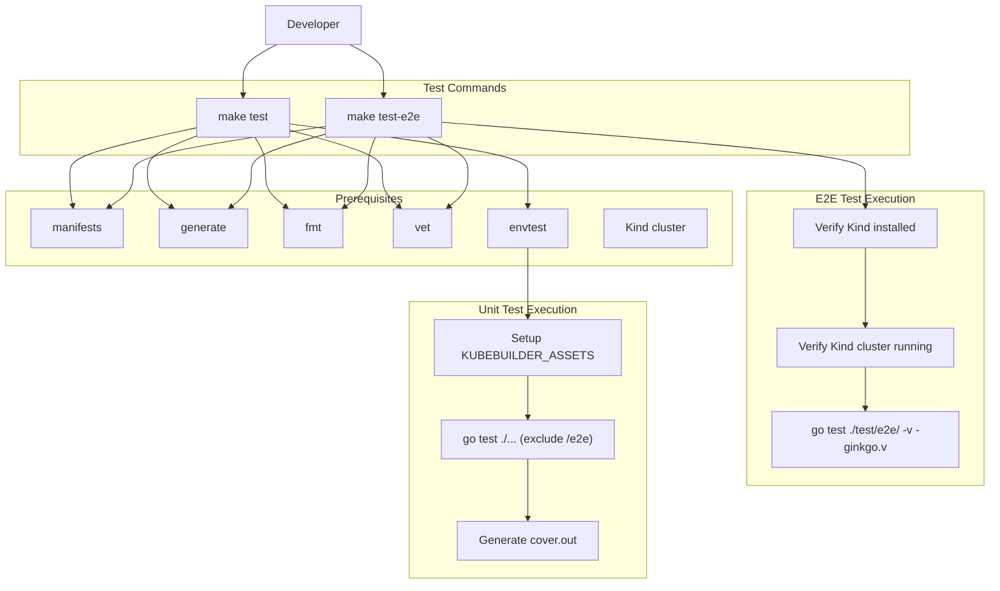
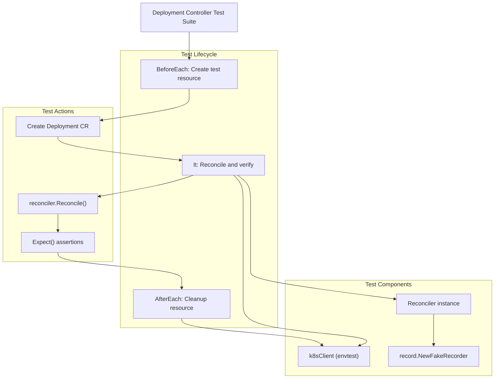
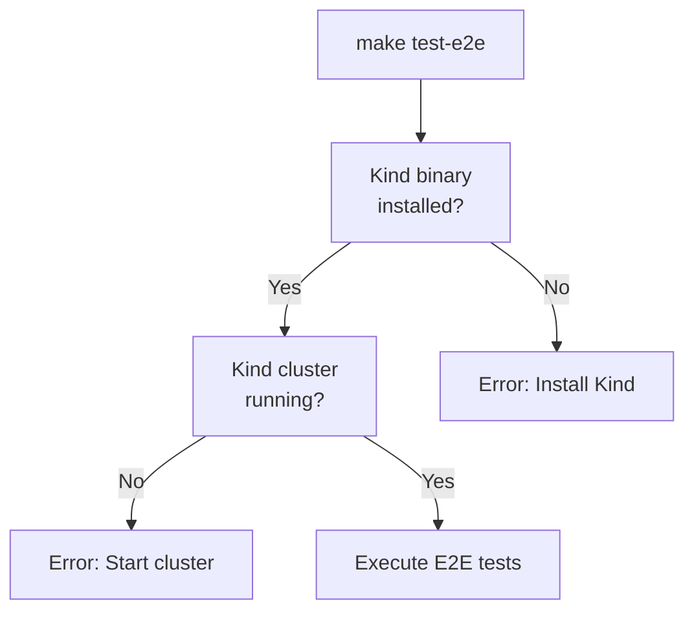
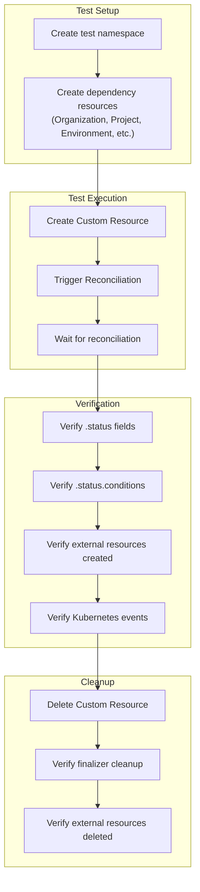
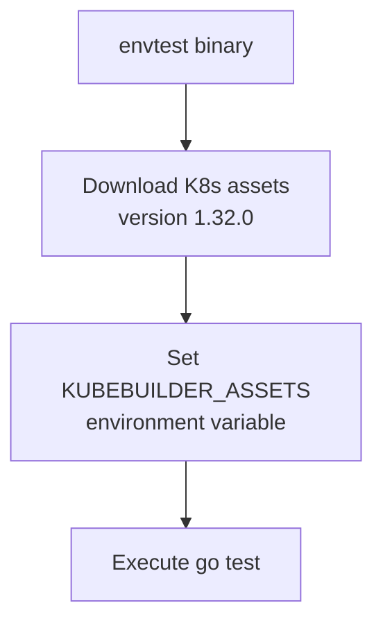
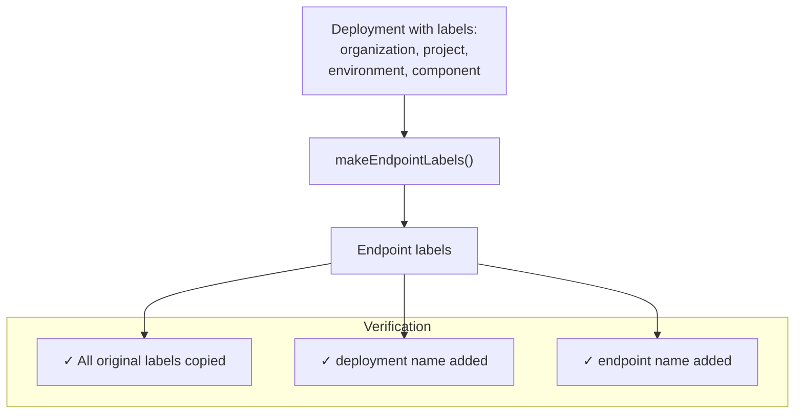

# Testing

> **Relevant source files**
> * [Makefile](https://github.com/openchoreo/openchoreo/blob/a577e969/Makefile)
> * [cmd/choreoctl/Dockerfile](https://github.com/openchoreo/openchoreo/blob/a577e969/cmd/choreoctl/Dockerfile)
> * [cmd/observer/Dockerfile](https://github.com/openchoreo/openchoreo/blob/a577e969/cmd/observer/Dockerfile)
> * [docs/observability-logging.md](https://github.com/openchoreo/openchoreo/blob/a577e969/docs/observability-logging.md)
> * [install/helm/openchoreo-identity-provider/templates/post-install-hook.yaml](https://github.com/openchoreo/openchoreo/blob/a577e969/install/helm/openchoreo-identity-provider/templates/post-install-hook.yaml)
> * [internal/controller/annotations.go](https://github.com/openchoreo/openchoreo/blob/a577e969/internal/controller/annotations.go)
> * [internal/controller/deployment/controller.go](https://github.com/openchoreo/openchoreo/blob/a577e969/internal/controller/deployment/controller.go)
> * [internal/controller/deployment/controller_endpoints.go](https://github.com/openchoreo/openchoreo/blob/a577e969/internal/controller/deployment/controller_endpoints.go)
> * [internal/controller/deployment/controller_endpoints_test.go](https://github.com/openchoreo/openchoreo/blob/a577e969/internal/controller/deployment/controller_endpoints_test.go)
> * [internal/controller/deployment/controller_finalize.go](https://github.com/openchoreo/openchoreo/blob/a577e969/internal/controller/deployment/controller_finalize.go)
> * [internal/controller/deployment/controller_test.go](https://github.com/openchoreo/openchoreo/blob/a577e969/internal/controller/deployment/controller_test.go)
> * [internal/controller/deployment/controller_watch.go](https://github.com/openchoreo/openchoreo/blob/a577e969/internal/controller/deployment/controller_watch.go)
> * [internal/controller/endpoint/controller.go](https://github.com/openchoreo/openchoreo/blob/a577e969/internal/controller/endpoint/controller.go)
> * [internal/controller/endpoint/controller_conditions.go](https://github.com/openchoreo/openchoreo/blob/a577e969/internal/controller/endpoint/controller_conditions.go)
> * [internal/controller/endpoint/controller_finalize.go](https://github.com/openchoreo/openchoreo/blob/a577e969/internal/controller/endpoint/controller_finalize.go)
> * [internal/controller/hierarchy.go](https://github.com/openchoreo/openchoreo/blob/a577e969/internal/controller/hierarchy.go)
> * [internal/controller/release/controller.go](https://github.com/openchoreo/openchoreo/blob/a577e969/internal/controller/release/controller.go)
> * [internal/controller/watch.go](https://github.com/openchoreo/openchoreo/blob/a577e969/internal/controller/watch.go)
> * [make/common.mk](https://github.com/openchoreo/openchoreo/blob/a577e969/make/common.mk)
> * [make/docker.mk](https://github.com/openchoreo/openchoreo/blob/a577e969/make/docker.mk)
> * [make/golang.mk](https://github.com/openchoreo/openchoreo/blob/a577e969/make/golang.mk)
> * [make/kube.mk](https://github.com/openchoreo/openchoreo/blob/a577e969/make/kube.mk)
> * [make/lint.mk](https://github.com/openchoreo/openchoreo/blob/a577e969/make/lint.mk)
> * [make/tools.mk](https://github.com/openchoreo/openchoreo/blob/a577e969/make/tools.mk)

This document describes the testing strategies, frameworks, and procedures used in the OpenChoreo project. It covers unit tests, controller tests with envtest, and end-to-end tests in Kind clusters. For information about setting up a development environment, see [Development Environment Setup](/openchoreo/openchoreo/9.1-development-environment-setup). For building the project from source, see [Building from Source](/openchoreo/openchoreo/9.2-building-from-source).

---

## Testing Strategy Overview

OpenChoreo employs a multi-layered testing approach to ensure correctness at different levels of the system:

| Test Type | Framework | Execution Environment | Target |
| --- | --- | --- | --- |
| **Unit Tests** | Go testing + Ginkgo/Gomega | Local with mocked dependencies | Individual functions, business logic |
| **Controller Tests** | envtest (controller-runtime) | Simulated Kubernetes API server | Controller reconciliation logic |
| **End-to-End Tests** | Ginkgo/Gomega | Kind cluster | Full system workflows |

The test execution excludes certain paths from unit test coverage (e.g., `/e2e` directory) while the E2E tests run in isolated Kind clusters to validate complete deployment and operational workflows.

**Sources:** [make/golang.mk L164-L169](https://github.com/openchoreo/openchoreo/blob/a577e969/make/golang.mk#L164-L169)

 [make/kube.mk L24-L34](https://github.com/openchoreo/openchoreo/blob/a577e969/make/kube.mk#L24-L34)

---

## Test Execution Flow



**Sources:** [make/golang.mk L164-L169](https://github.com/openchoreo/openchoreo/blob/a577e969/make/golang.mk#L164-L169)

 [make/kube.mk L24-L34](https://github.com/openchoreo/openchoreo/blob/a577e969/make/kube.mk#L24-L34)

---

## Unit and Controller Tests

### Test Framework

OpenChoreo uses the Ginkgo BDD testing framework with Gomega matchers for writing expressive, readable tests. Controllers are tested using envtest, which provides a real Kubernetes API server without requiring a full cluster.

The `envtest` tool downloads and manages Kubernetes API server binaries locally. The current configured version is `1.32.0` as specified in [make/golang.mk L165](https://github.com/openchoreo/openchoreo/blob/a577e969/make/golang.mk#L165-L165)

### Running Unit Tests

Execute all unit tests with coverage reporting:

```
make test
```

This command performs the following steps:

1. Generates manifests and code via `manifests` and `generate` targets
2. Runs `go fmt` and `go vet` for code quality checks
3. Sets up envtest with Kubernetes API server binaries
4. Executes all Go tests except those in `/e2e` directory
5. Produces `cover.out` coverage report

**Sources:** [make/golang.mk L164-L169](https://github.com/openchoreo/openchoreo/blob/a577e969/make/golang.mk#L164-L169)

### Controller Test Structure

Controller tests use a suite setup pattern with Ginkgo. Example from the Deployment controller:



**Sources:** [internal/controller/deployment/controller_test.go L1-L73](https://github.com/openchoreo/openchoreo/blob/a577e969/internal/controller/deployment/controller_test.go#L1-L73)

### Example: Endpoint Label Generation Test

The endpoint label generation test demonstrates testing business logic without full reconciliation:

The test structure follows this pattern:

* **BeforeEach**: Prepares fresh test data (DeploymentContext, EndpointTemplate)
* **JustBeforeEach**: Executes the function under test (`makeEndpointLabels`)
* **It blocks**: Contains assertions using Gomega matchers

Key test pattern from [internal/controller/deployment/controller_endpoints_test.go L16-L66](https://github.com/openchoreo/openchoreo/blob/a577e969/internal/controller/deployment/controller_endpoints_test.go#L16-L66)

:

| Setup Phase | Test Data |
| --- | --- |
| DeploymentContext | Deployment with labels for organization, project, environment, component, track |
| EndpointTemplate | Template with name "my-endpoint" |
| Expected Behavior | Generated labels include all deployment labels plus deployment name and endpoint name |

The test verifies:

1. Original deployment labels are preserved
2. Parent deployment name is added with key `openchoreo.dev/deployment`
3. Endpoint name is set with key `openchoreo.dev/name`

**Sources:** [internal/controller/deployment/controller_endpoints_test.go L16-L66](https://github.com/openchoreo/openchoreo/blob/a577e969/internal/controller/deployment/controller_endpoints_test.go#L16-L66)

---

## End-to-End Tests

### Prerequisites

E2E tests require a running Kind cluster. The test target includes automatic verification:



**Sources:** [make/kube.mk L24-L34](https://github.com/openchoreo/openchoreo/blob/a577e969/make/kube.mk#L24-L34)

### Execution

Run E2E tests against an existing Kind cluster:

```
make test-e2e
```

The command:

1. Verifies `kind` binary is installed
2. Confirms a Kind cluster is running (any cluster named `kind-*`)
3. Executes tests in `./test/e2e/` directory with verbose Ginkgo output

E2E tests validate complete workflows including:

* Resource creation and reconciliation across control/data planes
* Multi-cluster resource management
* Gateway API and network policy provisioning
* Build pipeline execution
* Deployment and endpoint lifecycle

**Sources:** [make/kube.mk L24-L34](https://github.com/openchoreo/openchoreo/blob/a577e969/make/kube.mk#L24-L34)

---

## Test Pattern: Controller Reconciliation

### Standard Controller Test Pattern

Controllers in OpenChoreo follow a consistent test pattern:



**Sources:** [internal/controller/deployment/controller_test.go L20-L72](https://github.com/openchoreo/openchoreo/blob/a577e969/internal/controller/deployment/controller_test.go#L20-L72)

 [internal/controller/deployment/controller.go L44-L129](https://github.com/openchoreo/openchoreo/blob/a577e969/internal/controller/deployment/controller.go#L44-L129)

### Mock and Fake Objects

Controllers use several mock/fake patterns:

| Component | Implementation | Purpose |
| --- | --- | --- |
| `k8sClient` | envtest client | Real Kubernetes API interactions |
| `record.EventRecorder` | `record.NewFakeRecorder(100)` | Capture emitted events without actual event API calls |
| `KubeMultiClientManager` | nil (controller creates default) | Multi-cluster client management |

Example from [internal/controller/deployment/controller_test.go L58-L62](https://github.com/openchoreo/openchoreo/blob/a577e969/internal/controller/deployment/controller_test.go#L58-L62)

:

```yaml
controllerReconciler := &Reconciler{
    Client:   k8sClient,
    Scheme:   k8sClient.Scheme(),
    recorder: record.NewFakeRecorder(100),
}
```

**Sources:** [internal/controller/deployment/controller_test.go L58-L62](https://github.com/openchoreo/openchoreo/blob/a577e969/internal/controller/deployment/controller_test.go#L58-L62)

 [internal/controller/deployment/controller.go L27-L33](https://github.com/openchoreo/openchoreo/blob/a577e969/internal/controller/deployment/controller.go#L27-L33)

---

## Test Coverage and Quality Gates

### Code Quality Targets

Before tests run, the following quality gates execute:

| Target | Purpose | Tool |
| --- | --- | --- |
| `manifests` | Generate CRDs and RBAC | controller-gen |
| `generate` | Generate DeepCopy methods | controller-gen |
| `fmt` | Format Go code | go fmt |
| `vet` | Static analysis | go vet |

**Sources:** [make/golang.mk L156-L163](https://github.com/openchoreo/openchoreo/blob/a577e969/make/golang.mk#L156-L163)

 [make/golang.mk L164-L169](https://github.com/openchoreo/openchoreo/blob/a577e969/make/golang.mk#L164-L169)

### Coverage Output

Unit tests generate a coverage profile at `cover.out` which can be analyzed:

```go
# View coverage in browser
go tool cover -html=cover.out

# View coverage summary
go tool cover -func=cover.out
```

**Sources:** [make/golang.mk L169](https://github.com/openchoreo/openchoreo/blob/a577e969/make/golang.mk#L169-L169)

---

## Test Infrastructure Components

### envtest Setup

The `envtest` binary manages Kubernetes API server assets:



The `envtest` tool is installed to `$(TOOL_BIN)/setup-envtest` via the go install mechanism defined in [make/tools.mk L54-L57](https://github.com/openchoreo/openchoreo/blob/a577e969/make/tools.mk#L54-L57)

Version configuration: `ENVTEST_K8S_VERSION := 1.32.0`

**Sources:** [make/golang.mk L165-L169](https://github.com/openchoreo/openchoreo/blob/a577e969/make/golang.mk#L165-L169)

 [make/tools.mk L30-L57](https://github.com/openchoreo/openchoreo/blob/a577e969/make/tools.mk#L30-L57)

### Test Exclusions

The test command explicitly excludes E2E tests from unit test runs:

```go
go test $$(go list ./... | grep -v /e2e) -coverprofile cover.out
```

This ensures:

* Unit tests run without cluster dependencies
* E2E tests only execute in controlled cluster environments
* Coverage reports reflect unit/controller test coverage only

**Sources:** [make/golang.mk L169](https://github.com/openchoreo/openchoreo/blob/a577e969/make/golang.mk#L169-L169)

---

## Common Test Patterns

### Pattern: Label Verification

Tests frequently verify label propagation through resource hierarchies:



Example assertion pattern from [internal/controller/deployment/controller_endpoints_test.go L51-L65](https://github.com/openchoreo/openchoreo/blob/a577e969/internal/controller/deployment/controller_endpoints_test.go#L51-L65)

:

```
Expect(generatedLabels).To(HaveKeyWithValue("openchoreo.dev/organization", "test-organization"))
Expect(generatedLabels).To(HaveKeyWithValue("openchoreo.dev/deployment", "my-deployment"))
Expect(generatedLabels).To(HaveKeyWithValue("openchoreo.dev/name", "my-endpoint"))
```

**Sources:** [internal/controller/deployment/controller_endpoints_test.go L16-L66](https://github.com/openchoreo/openchoreo/blob/a577e969/internal/controller/deployment/controller_endpoints_test.go#L16-L66)

### Pattern: Reconciliation Verification

Standard pattern for testing reconciliation loops:

1. **Setup**: Create all prerequisite resources (hierarchy objects)
2. **Trigger**: Create the primary resource to trigger reconciliation
3. **Invoke**: Call `Reconcile()` method directly
4. **Assert**: Verify expected outcomes using Gomega matchers
5. **Cleanup**: Delete resources and verify finalizers execute

**Sources:** [internal/controller/deployment/controller_test.go L56-L71](https://github.com/openchoreo/openchoreo/blob/a577e969/internal/controller/deployment/controller_test.go#L56-L71)

### Pattern: Error Handling

Tests verify controller error handling for missing hierarchy objects:

* Controllers use `IgnoreHierarchyNotFoundError()` to avoid retries when parent resources don't exist
* Tests should verify reconciliation returns without error when hierarchy is incomplete
* Event recorders should capture warnings about context resolution failures

Example from controller reconciliation logic [internal/controller/deployment/controller.go L78-L87](https://github.com/openchoreo/openchoreo/blob/a577e969/internal/controller/deployment/controller.go#L78-L87)

:

```sql
deploymentCtx, err := r.makeDeploymentContext(ctx, deployment)
if err != nil {
    logger.Error(err, "Error creating deployment context")
    r.recorder.Eventf(deployment, corev1.EventTypeWarning, "ContextResolutionFailed",
        "Context resolution failed: %s", err)
    // ... status update ...
    return ctrl.Result{}, controller.IgnoreHierarchyNotFoundError(err)
}
```

**Sources:** [internal/controller/deployment/controller.go L78-L87](https://github.com/openchoreo/openchoreo/blob/a577e969/internal/controller/deployment/controller.go#L78-L87)

 [internal/controller/hierarchy.go L63-L74](https://github.com/openchoreo/openchoreo/blob/a577e969/internal/controller/hierarchy.go#L63-L74)

---

## Running Specific Test Subsets

### Running Tests for Specific Packages

Execute tests for a specific controller:

```go
go test ./internal/controller/deployment/... -v
```

### Running Individual Test Cases

Execute a specific Ginkgo test case:

```go
go test ./internal/controller/deployment/... -ginkgo.focus="should include all the original deployment labels"
```

### Running with Race Detection

Enable race detection for concurrent code:

```go
go test -race ./...
```

**Sources:** [make/golang.mk L164-L169](https://github.com/openchoreo/openchoreo/blob/a577e969/make/golang.mk#L164-L169)

---

## Summary

OpenChoreo's testing strategy provides comprehensive coverage through:

| Test Layer | Key Tool | Execution Context | Primary Focus |
| --- | --- | --- | --- |
| Unit Tests | Ginkgo/Gomega | Local process | Business logic, data transformations |
| Controller Tests | envtest | Simulated K8s API | Reconciliation loops, status updates |
| E2E Tests | Kind cluster | Full system | Multi-cluster workflows, real deployments |

All tests follow consistent patterns using Ginkgo's BDD style, Gomega matchers for assertions, and the fake recorder for event verification. The test infrastructure automatically ensures code generation is current and code quality gates pass before test execution.

**Sources:** [make/golang.mk L164-L169](https://github.com/openchoreo/openchoreo/blob/a577e969/make/golang.mk#L164-L169)

 [make/kube.mk L24-L34](https://github.com/openchoreo/openchoreo/blob/a577e969/make/kube.mk#L24-L34)

 [internal/controller/deployment/controller_test.go L1-L73](https://github.com/openchoreo/openchoreo/blob/a577e969/internal/controller/deployment/controller_test.go#L1-L73)

 [internal/controller/deployment/controller_endpoints_test.go L1-L66](https://github.com/openchoreo/openchoreo/blob/a577e969/internal/controller/deployment/controller_endpoints_test.go#L1-L66)