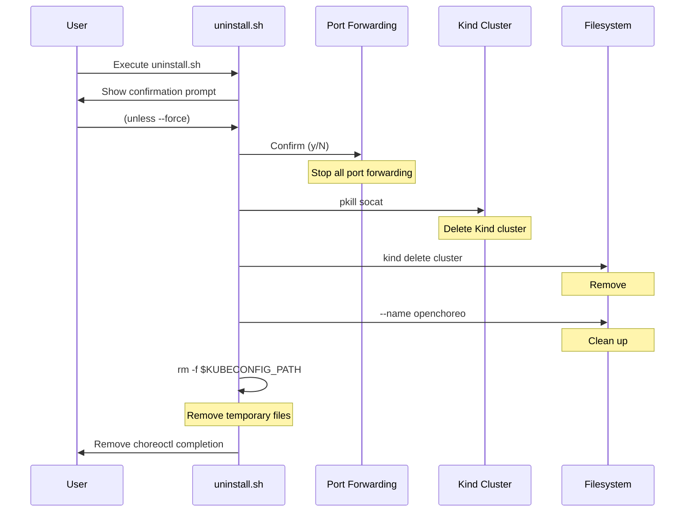
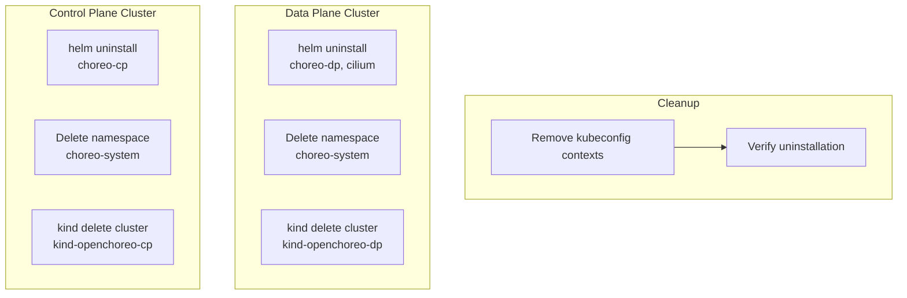
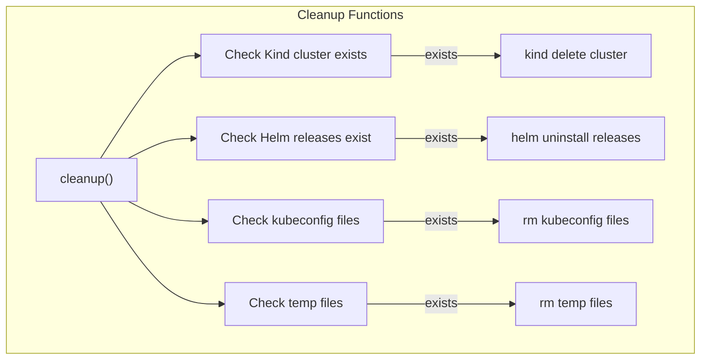

# Uninstallation

> **Relevant source files**
> * [install/add-build-plane.sh](https://github.com/openchoreo/openchoreo/blob/a577e969/install/add-build-plane.sh)
> * [install/add-default-dataplane.sh](https://github.com/openchoreo/openchoreo/blob/a577e969/install/add-default-dataplane.sh)
> * [install/check-status.sh](https://github.com/openchoreo/openchoreo/blob/a577e969/install/check-status.sh)
> * [install/helm/cilium/.helmignore](https://github.com/openchoreo/openchoreo/blob/a577e969/install/helm/cilium/.helmignore)
> * [install/helm/cilium/templates/serviceaccount.yaml](https://github.com/openchoreo/openchoreo/blob/a577e969/install/helm/cilium/templates/serviceaccount.yaml)
> * [install/helm/cilium/templates/wait-for-cilium.yaml](https://github.com/openchoreo/openchoreo/blob/a577e969/install/helm/cilium/templates/wait-for-cilium.yaml)
> * [install/install-helpers-local.sh](https://github.com/openchoreo/openchoreo/blob/a577e969/install/install-helpers-local.sh)
> * [install/install.sh](https://github.com/openchoreo/openchoreo/blob/a577e969/install/install.sh)
> * [install/quick-start/Dockerfile](https://github.com/openchoreo/openchoreo/blob/a577e969/install/quick-start/Dockerfile)
> * [install/quick-start/deploy_web_application.sh](https://github.com/openchoreo/openchoreo/blob/a577e969/install/quick-start/deploy_web_application.sh)
> * [install/quick-start/install.sh](https://github.com/openchoreo/openchoreo/blob/a577e969/install/quick-start/install.sh)
> * [install/quick-start/uninstall.sh](https://github.com/openchoreo/openchoreo/blob/a577e969/install/quick-start/uninstall.sh)
> * [install/uninstall.sh](https://github.com/openchoreo/openchoreo/blob/a577e969/install/uninstall.sh)

## Purpose and Scope

This document describes how to cleanly remove OpenChoreo installations from your system. It covers uninstallation procedures for all supported deployment modes: containerized quick-start environments, local single-cluster installations, and multi-cluster setups. The document includes automated uninstallation scripts, manual cleanup procedures, and verification steps.

For installation procedures, see [Installation Overview](/openchoreo/openchoreo/7.1-installation-overview). For multi-cluster installation details, see [Multi-Cluster Installation](/openchoreo/openchoreo/7.2-multi-cluster-installation). For quick-start installation, see [Quick Start Installation](/openchoreo/openchoreo/7.3-quick-start-installation).

---

## Uninstallation Scenarios

OpenChoreo supports three primary uninstallation scenarios depending on how the platform was installed:

```mermaid
flowchart TD

QS["Quick-Start<br>Containerized Environment"]
Local["Local Single-Cluster<br>Kind Installation"]
Multi["Multi-Cluster<br>Separate CP/DP Clusters"]
QS_Script["install/quick-start/uninstall.sh"]
QS_Stop["Stop socat port forwards"]
QS_Delete["kind delete cluster"]
QS_Clean["Remove kubeconfig"]
Local_Delete["kind delete cluster<br>openchoreo-local"]
Local_Kube["Remove kubeconfig-openchoreo-local"]
Local_Complete["Remove choreoctl completion"]
Multi_Helm["helm uninstall releases"]
Multi_NS["Delete namespaces"]
Multi_Clusters["kind delete cluster<br>(CP and DP)"]
Multi_Context["Remove kubeconfig contexts"]

QS --> QS_Script
Local --> Local_Delete
Multi --> Multi_Helm

subgraph subGraph3 ["Multi-Cluster Uninstall Process"]
    Multi_Helm
    Multi_NS
    Multi_Clusters
    Multi_Context
end

subgraph subGraph2 ["Local Uninstall Process"]
    Local_Delete
    Local_Kube
    Local_Complete
end

subgraph subGraph1 ["Quick-Start Uninstall Process"]
    QS_Script
    QS_Stop
    QS_Delete
    QS_Clean
end

subgraph subGraph0 ["Uninstallation Scenarios"]
    QS
    Local
    Multi
end
```



**Diagram: OpenChoreo Uninstallation Scenarios and Cleanup Flows**

**Sources:** [install/quick-start/uninstall.sh L1-L107](https://github.com/openchoreo/openchoreo/blob/a577e969/install/quick-start/uninstall.sh#L1-L107)

 [install/uninstall.sh L1-L29](https://github.com/openchoreo/openchoreo/blob/a577e969/install/uninstall.sh#L1-L29)

 [install/install-helpers-local.sh L323-L330](https://github.com/openchoreo/openchoreo/blob/a577e969/install/install-helpers-local.sh#L323-L330)

---

## Quick-Start Environment Uninstallation

The quick-start containerized environment includes an automated uninstallation script that removes all resources created during installation.

### Running the Uninstall Script

The quick-start uninstall script is located at `install/quick-start/uninstall.sh` and provides two modes of operation:

| Mode | Command | Description |
| --- | --- | --- |
| Interactive | `./uninstall.sh` | Prompts for confirmation before proceeding |
| Force | `./uninstall.sh --force` | Skips confirmation prompt |

**Sources:** [install/quick-start/uninstall.sh L10-L37](https://github.com/openchoreo/openchoreo/blob/a577e969/install/quick-start/uninstall.sh#L10-L37)

### Uninstallation Process Flow



**Diagram: Quick-Start Uninstallation Sequence**

**Sources:** [install/quick-start/uninstall.sh L39-L106](https://github.com/openchoreo/openchoreo/blob/a577e969/install/quick-start/uninstall.sh#L39-L106)

### Resources Removed

The quick-start uninstall process removes the following resources:

1. **Port Forwarding Processes**: All `socat` processes used for port forwarding are terminated [install/quick-start/uninstall.sh L59-L60](https://github.com/openchoreo/openchoreo/blob/a577e969/install/quick-start/uninstall.sh#L59-L60)
2. **Kind Cluster**: The `openchoreo` Kind cluster is deleted using the `cluster_exists` and `kind delete cluster` commands [install/quick-start/uninstall.sh L63-L72](https://github.com/openchoreo/openchoreo/blob/a577e969/install/quick-start/uninstall.sh#L63-L72)
3. **Kubeconfig Files**: The kubeconfig at `$KUBECONFIG_PATH` (typically `/state/kube/config.yaml`) is removed [install/quick-start/uninstall.sh L74-L81](https://github.com/openchoreo/openchoreo/blob/a577e969/install/quick-start/uninstall.sh#L74-L81)
4. **Empty Directories**: The kubeconfig directory is removed if empty [install/quick-start/uninstall.sh L83-L89](https://github.com/openchoreo/openchoreo/blob/a577e969/install/quick-start/uninstall.sh#L83-L89)
5. **Shell Completion**: The `choreoctl` completion script at `/usr/local/bin/choreoctl-completion` is removed and references are cleaned from `/etc/profile` [install/quick-start/uninstall.sh L91-L100](https://github.com/openchoreo/openchoreo/blob/a577e969/install/quick-start/uninstall.sh#L91-L100)
6. **Temporary Files**: The `cleanup()` function removes temporary configuration files [install/quick-start/uninstall.sh L103](https://github.com/openchoreo/openchoreo/blob/a577e969/install/quick-start/uninstall.sh#L103-L103)

**Sources:** [install/quick-start/uninstall.sh L56-L106](https://github.com/openchoreo/openchoreo/blob/a577e969/install/quick-start/uninstall.sh#L56-L106)

---

## Local Single-Cluster Uninstallation

For local installations created using `install/install.sh`, the uninstallation process involves deleting the Kind cluster and cleaning up configuration files.

### Manual Uninstallation Steps

Since the local installation script doesn't provide a dedicated uninstall script, follow these manual steps:

```sql
# 1. Delete the Kind cluster
kind delete cluster --name openchoreo-local

# 2. Remove the kubeconfig file
rm -f ~/.kube/config-openchoreo-local

# 3. Remove choreoctl completion (if configured)
rm -f ~/.choreoctl-completion
sed -i '/source ~\/.choreoctl-completion/d' ~/.bashrc

# 4. Clean up temporary files
rm -f /tmp/kind-config-local.yaml
```

### Cluster and Resource Verification

The `cluster_exists` function from `install-helpers-local.sh` can be used to verify cluster deletion:

```markdown
# Check if cluster exists
kind get clusters 2>/dev/null | grep -q "^openchoreo-local$"
```

**Sources:** [install/install-helpers-local.sh L51-L54](https://github.com/openchoreo/openchoreo/blob/a577e969/install/install-helpers-local.sh#L51-L54)

 [install/install-helpers-local.sh L15-L19](https://github.com/openchoreo/openchoreo/blob/a577e969/install/install-helpers-local.sh#L15-L19)

### Components Removed

The following components are removed when the Kind cluster is deleted:

| Component | Namespace | Description |
| --- | --- | --- |
| Cilium | `cilium` | CNI networking plugin |
| Control Plane | `openchoreo-control-plane` | Controller manager and API server |
| Data Plane | `openchoreo-data-plane` | Gateway, registry, vault, redis |
| Build Plane | `openchoreo-build-plane` | Argo Workflows |
| Identity Provider | `openchoreo-identity-system` | OpenChoreo identity provider |
| Observability | `openchoreo-observability-plane` | OpenSearch, Observer (if enabled) |

**Sources:** [install/install-helpers-local.sh L21-L27](https://github.com/openchoreo/openchoreo/blob/a577e969/install/install-helpers-local.sh#L21-L27)

---

## Multi-Cluster Uninstallation

Multi-cluster installations require uninstalling Helm releases from both the Control Plane and Data Plane clusters before deleting the clusters themselves.

### Uninstallation Sequence



**Diagram: Multi-Cluster Uninstallation Flow**

**Sources:** [install/uninstall.sh L1-L29](https://github.com/openchoreo/openchoreo/blob/a577e969/install/uninstall.sh#L1-L29)

### Using the Uninstall Script

The basic uninstall script at `install/uninstall.sh` handles multi-cluster Helm release cleanup:

```csharp
#!/bin/bash
set -e

# Uninstall Control Plane
helm uninstall choreo-cp --namespace choreo-system

# Uninstall Data Plane
helm uninstall choreo-dp --namespace choreo-system

# Uninstall Cilium
helm uninstall cilium --namespace choreo-system

# Clean up namespace
kubectl delete namespace choreo-system
```

**Sources:** [install/uninstall.sh L6-L28](https://github.com/openchoreo/openchoreo/blob/a577e969/install/uninstall.sh#L6-L28)

### Manual Multi-Cluster Cleanup

For complete cleanup of a multi-cluster installation:

```sql
# 1. Set context to Control Plane cluster
kubectl config use-context kind-openchoreo-cp

# 2. Uninstall Control Plane Helm releases
helm uninstall openchoreo-control-plane -n openchoreo-control-plane || true

# 3. Delete Control Plane cluster
kind delete cluster --name openchoreo-cp

# 4. Set context to Data Plane cluster
kubectl config use-context kind-openchoreo-dp

# 5. Uninstall Data Plane Helm releases
helm uninstall openchoreo-data-plane -n openchoreo-data-plane || true
helm uninstall openchoreo-build-plane -n openchoreo-build-plane || true
helm uninstall cilium -n cilium || true

# 6. Delete Data Plane cluster
kind delete cluster --name openchoreo-dp

# 7. Remove kubeconfig contexts
kubectl config delete-context kind-openchoreo-cp
kubectl config delete-context kind-openchoreo-dp
kubectl config delete-cluster kind-openchoreo-cp
kubectl config delete-cluster kind-openchoreo-dp
```

**Sources:** [install/uninstall.sh L17-L21](https://github.com/openchoreo/openchoreo/blob/a577e969/install/uninstall.sh#L17-L21)

---

## Manual Cleanup Procedures

In some cases, automated uninstallation may not complete successfully, requiring manual cleanup.

### Cleanup Function Reference



**Diagram: Cleanup Function Flow**

**Sources:** [install/install-helpers-local.sh L323-L330](https://github.com/openchoreo/openchoreo/blob/a577e969/install/install-helpers-local.sh#L323-L330)

### Forcing Cluster Deletion

If a cluster won't delete cleanly:

```php
# Force delete the Docker containers
docker ps -a | grep "openchoreo-local" | awk '{print $1}' | xargs -r docker rm -f

# Force delete the cluster
kind delete cluster --name openchoreo-local

# Verify deletion
kind get clusters
```

### Cleaning Up Helm Releases

If Helm releases are stuck in a pending state:

```sql
# List all releases
helm list -A

# Force uninstall with deletion timeout
helm uninstall RELEASE_NAME -n NAMESPACE --timeout 5m

# If still stuck, delete the Helm secret directly
kubectl delete secret -n NAMESPACE -l owner=helm,name=RELEASE_NAME
```

### Removing Custom Resources

OpenChoreo Custom Resources may need manual deletion if finalizers are blocking:

```sql
# List all OpenChoreo custom resources
kubectl get organizations,projects,components,builds,deployments -A

# Remove finalizers if stuck
kubectl patch organization ORG_NAME -p '{"metadata":{"finalizers":[]}}' --type=merge

# Force delete resources
kubectl delete organizations,projects,components,builds,deployments -A --force --grace-period=0
```

**Sources:** [install/add-default-dataplane.sh L107-L139](https://github.com/openchoreo/openchoreo/blob/a577e969/install/add-default-dataplane.sh#L107-L139)

 [install/add-build-plane.sh L101-L124](https://github.com/openchoreo/openchoreo/blob/a577e969/install/add-build-plane.sh#L101-L124)

### Cleaning Up DataPlane and BuildPlane Custom Resources

DataPlane and BuildPlane resources created by the setup scripts should be removed:

```sql
# Delete DataPlane resource
kubectl delete dataplane default -n default

# Delete BuildPlane resource
kubectl delete buildplane default -n default

# Verify deletion
kubectl get dataplanes,buildplanes -A
```

**Sources:** [install/add-default-dataplane.sh L107-L139](https://github.com/openchoreo/openchoreo/blob/a577e969/install/add-default-dataplane.sh#L107-L139)

 [install/add-build-plane.sh L101-L124](https://github.com/openchoreo/openchoreo/blob/a577e969/install/add-build-plane.sh#L101-L124)

---

## Verification

After uninstallation, verify that all resources have been removed.

### Cluster Verification

```markdown
# Verify no Kind clusters remain
kind get clusters

# Expected output (if all removed):
# (empty)
```

### Kubeconfig Verification

```python
# Check for OpenChoreo kubeconfig files
ls -la ~/.kube/config-openchoreo-local
ls -la ~/.kube/config

# Check for quick-start kubeconfig
ls -la /state/kube/config.yaml

# Verify contexts removed from kubeconfig
kubectl config get-contexts | grep openchoreo
```

### Docker Container Verification

For quick-start installations, verify the Docker container was removed:

```markdown
# List Docker containers
docker ps -a | grep openchoreo

# List Kind Docker containers
docker ps -a | grep "kindest/node"
```

### Process Verification

Verify that port forwarding processes have been stopped:

```markdown
# Check for socat processes
ps aux | grep socat

# Check for kubectl port-forward processes
ps aux | grep "kubectl port-forward"
```

**Sources:** [install/quick-start/uninstall.sh L59-L60](https://github.com/openchoreo/openchoreo/blob/a577e969/install/quick-start/uninstall.sh#L59-L60)

### Using check-status.sh

The status check script can verify that components are no longer running:

```markdown
# Run status check (should show "not installed" for all components)
bash install/check-status.sh

# Expected output: All components should show "not installed" status
```

The script checks for components using the `check_component_status` function which queries pod status by namespace and label:

```css
check_component_status() {
    local component="$1"
    local context="$2"
    # Returns: "not installed", "not started", "pending", "ready", or "unknown"
}
```

**Sources:** [install/check-status.sh L103-L141](https://github.com/openchoreo/openchoreo/blob/a577e969/install/check-status.sh#L103-L141)

 [install/check-status.sh L95-L100](https://github.com/openchoreo/openchoreo/blob/a577e969/install/check-status.sh#L95-L100)

### Final Verification Checklist

| Resource Type | Verification Command | Expected Result |
| --- | --- | --- |
| Kind Clusters | `kind get clusters` | No openchoreo clusters listed |
| Kubeconfig Files | `ls ~/.kube/config-openchoreo*` | Files not found |
| Docker Containers | `docker ps -a \| grep openchoreo` | No containers found |
| Helm Releases | `helm list -A` | No openchoreo releases |
| Custom Resources | `kubectl get crd \| grep openchoreo` | No CRDs found (if cluster exists) |
| Port Forwards | `ps aux \| grep socat` | No socat processes |
| Completion Scripts | `ls /usr/local/bin/choreoctl-completion` | File not found |

**Sources:** [install/check-status.sh L21-L27](https://github.com/openchoreo/openchoreo/blob/a577e969/install/check-status.sh#L21-L27)

 [install/quick-start/uninstall.sh L74-L100](https://github.com/openchoreo/openchoreo/blob/a577e969/install/quick-start/uninstall.sh#L74-L100)

---

## Troubleshooting Common Uninstallation Issues

### Issue: Cluster Won't Delete

**Symptom**: `kind delete cluster` hangs or fails

**Solution**:

```php
# Force stop all containers for the cluster
docker ps -a | grep "openchoreo" | awk '{print $1}' | xargs -r docker stop -t 5
docker ps -a | grep "openchoreo" | awk '{print $1}' | xargs -r docker rm -f

# Retry cluster deletion
kind delete cluster --name openchoreo-local
```

### Issue: Helm Release Stuck in Pending-Uninstall

**Symptom**: `helm list` shows release in "pending-uninstall" or "uninstalling" state

**Solution**:

```sql
# Delete Helm secret directly
kubectl delete secret -l owner=helm,name=RELEASE_NAME -n NAMESPACE

# Or force uninstall with no hooks
helm uninstall RELEASE_NAME -n NAMESPACE --no-hooks
```

### Issue: Custom Resources Won't Delete

**Symptom**: CR deletion hangs due to finalizers

**Solution**:

```sql
# Remove finalizers to allow deletion
kubectl patch RESOURCE_TYPE RESOURCE_NAME -n NAMESPACE \
  -p '{"metadata":{"finalizers":[]}}' --type=merge

# Force delete
kubectl delete RESOURCE_TYPE RESOURCE_NAME -n NAMESPACE --force --grace-period=0
```

**Sources:** [install/uninstall.sh L6-L15](https://github.com/openchoreo/openchoreo/blob/a577e969/install/uninstall.sh#L6-L15)

### Issue: choreoctl Command Still Available

**Symptom**: `choreoctl` command still works after uninstallation

**Solution**:

```markdown
# Remove choreoctl binary
rm -f /usr/local/bin/choreoctl

# Remove completion script
rm -f ~/.choreoctl-completion
rm -f /usr/local/bin/choreoctl-completion

# Clean up shell configuration
sed -i '/choreoctl-completion/d' ~/.bashrc
```

**Sources:** [install/quick-start/uninstall.sh L91-L100](https://github.com/openchoreo/openchoreo/blob/a577e969/install/quick-start/uninstall.sh#L91-L100)

---

**Sources:** [install/uninstall.sh L1-L29](https://github.com/openchoreo/openchoreo/blob/a577e969/install/uninstall.sh#L1-L29)

 [install/quick-start/uninstall.sh L1-L107](https://github.com/openchoreo/openchoreo/blob/a577e969/install/quick-start/uninstall.sh#L1-L107)

 [install/install-helpers-local.sh L1-L331](https://github.com/openchoreo/openchoreo/blob/a577e969/install/install-helpers-local.sh#L1-L331)

 [install/check-status.sh L1-L350](https://github.com/openchoreo/openchoreo/blob/a577e969/install/check-status.sh#L1-L350)

 [install/add-default-dataplane.sh L1-L140](https://github.com/openchoreo/openchoreo/blob/a577e969/install/add-default-dataplane.sh#L1-L140)

 [install/add-build-plane.sh L1-L125](https://github.com/openchoreo/openchoreo/blob/a577e969/install/add-build-plane.sh#L1-L125)