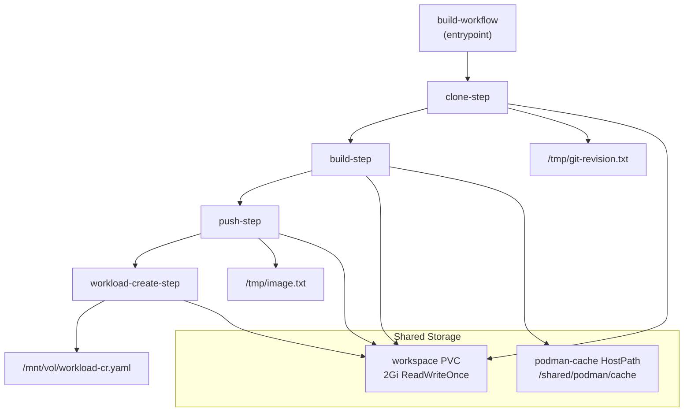

# Workflow Templates

> **Relevant source files**
> * [docs/configure-build-plane.md](https://github.com/openchoreo/openchoreo/blob/a577e969/docs/configure-build-plane.md)
> * [install/helm/openchoreo-build-plane/templates/_helpers.tpl](https://github.com/openchoreo/openchoreo/blob/a577e969/install/helm/openchoreo-build-plane/templates/_helpers.tpl)
> * [install/helm/openchoreo-build-plane/templates/workflow-templates/ballerina-buildpack.yaml](https://github.com/openchoreo/openchoreo/blob/a577e969/install/helm/openchoreo-build-plane/templates/workflow-templates/ballerina-buildpack.yaml)
> * [install/helm/openchoreo-build-plane/templates/workflow-templates/docker.yaml](https://github.com/openchoreo/openchoreo/blob/a577e969/install/helm/openchoreo-build-plane/templates/workflow-templates/docker.yaml)
> * [install/helm/openchoreo-build-plane/templates/workflow-templates/google-cloud-buildpacks.yaml](https://github.com/openchoreo/openchoreo/blob/a577e969/install/helm/openchoreo-build-plane/templates/workflow-templates/google-cloud-buildpacks.yaml)
> * [install/helm/openchoreo-build-plane/templates/workflow-templates/react.yaml](https://github.com/openchoreo/openchoreo/blob/a577e969/install/helm/openchoreo-build-plane/templates/workflow-templates/react.yaml)
> * [install/helm/openchoreo-build-plane/values.yaml](https://github.com/openchoreo/openchoreo/blob/a577e969/install/helm/openchoreo-build-plane/values.yaml)
> * [install/quick-start/install-helpers.sh](https://github.com/openchoreo/openchoreo/blob/a577e969/install/quick-start/install-helpers.sh)
> * [internal/choreoctl/cmd/logs/logs.go](https://github.com/openchoreo/openchoreo/blob/a577e969/internal/choreoctl/cmd/logs/logs.go)

## Overview

OpenChoreo uses Argo Workflows ClusterWorkflowTemplates to execute builds in the Build Plane. Each template defines a standardized four-step pipeline that clones source code, builds a container image, pushes it to a registry, and generates a Workload Custom Resource. These templates are installed as part of the Build Plane Helm chart and are referenced by Build CRs during execution.

This page documents the structure and implementation of these workflow templates, including the supported build types, the four-step process, caching strategies, and volume management.

For information about how builds are triggered and managed, see [Build Controller](/openchoreo/openchoreo/3.1-build-controller). For details on the Build Plane architecture, see [Build Plane and Argo Integration](/openchoreo/openchoreo/3.2-build-plane-and-argo-integration).

## Available Workflow Templates

OpenChoreo provides four ClusterWorkflowTemplates, each optimized for different build scenarios:

| Template Name | Purpose | Key Features |
| --- | --- | --- |
| `ballerina-buildpack` | Builds Ballerina applications using Cloud Native Buildpacks | Uses `pack` CLI with Ballerina builder and run images, caches builder images |
| `react` | Builds React/Node.js applications | Creates multi-stage Dockerfile with Node.js builder and nginx runtime, supports npm/yarn/pnpm |
| `docker` | Builds from existing Dockerfiles | Uses user-provided Dockerfile, supports custom build context and dockerfile paths |
| `google-cloud-buildpacks` | Builds applications using Google Cloud Buildpacks | Uses `pack` CLI with Google's builder, auto-detects language (Go, Node.js, Python, etc.) |

All templates are deployed to the Build Plane cluster and use the label selector `openchoreo.dev/noderole: workflow-runner` to ensure execution on designated build nodes.

Sources: [install/helm/openchoreo-build-plane/templates/workflow-templates/ballerina-buildpack.yaml L1-L310](https://github.com/openchoreo/openchoreo/blob/a577e969/install/helm/openchoreo-build-plane/templates/workflow-templates/ballerina-buildpack.yaml#L1-L310)

 [install/helm/openchoreo-build-plane/templates/workflow-templates/react.yaml L1-L315](https://github.com/openchoreo/openchoreo/blob/a577e969/install/helm/openchoreo-build-plane/templates/workflow-templates/react.yaml#L1-L315)

 [install/helm/openchoreo-build-plane/templates/workflow-templates/docker.yaml L1-L281](https://github.com/openchoreo/openchoreo/blob/a577e969/install/helm/openchoreo-build-plane/templates/workflow-templates/docker.yaml#L1-L281)

 [install/helm/openchoreo-build-plane/templates/workflow-templates/google-cloud-buildpacks.yaml L1-L310](https://github.com/openchoreo/openchoreo/blob/a577e969/install/helm/openchoreo-build-plane/templates/workflow-templates/google-cloud-buildpacks.yaml#L1-L310)

## Four-Step Workflow Pipeline

All workflow templates follow an identical four-step pipeline structure, executed sequentially with parameter passing between steps:

### Workflow Step Architecture



Sources: [install/helm/openchoreo-build-plane/templates/workflow-templates/ballerina-buildpack.yaml L14-L35](https://github.com/openchoreo/openchoreo/blob/a577e969/install/helm/openchoreo-build-plane/templates/workflow-templates/ballerina-buildpack.yaml#L14-L35)

 [install/helm/openchoreo-build-plane/templates/workflow-templates/react.yaml L17-L38](https://github.com/openchoreo/openchoreo/blob/a577e969/install/helm/openchoreo-build-plane/templates/workflow-templates/react.yaml#L17-L38)

### Step 1: clone-step

The `clone-step` clones the Git repository to the shared workspace volume and outputs the git revision (8-character commit SHA).

**Container Image**: `alpine/git`

**Key Operations**:

* Checks if a specific commit SHA is provided via `workflow.parameters.commit`
* If commit is specified: performs a shallow clone and checks out the specific commit
* If no commit: clones the branch specified in `workflow.parameters.branch`
* Extracts the first 8 characters of the commit SHA
* Writes git revision to `/tmp/git-revision.txt` (used as output parameter)
* Clones repository to `/mnt/vol/source` on the workspace volume

**Output Parameters**:

* `git-revision`: 8-character commit SHA

Sources: [install/helm/openchoreo-build-plane/templates/workflow-templates/ballerina-buildpack.yaml L36-L73](https://github.com/openchoreo/openchoreo/blob/a577e969/install/helm/openchoreo-build-plane/templates/workflow-templates/ballerina-buildpack.yaml#L36-L73)

 [install/helm/openchoreo-build-plane/templates/workflow-templates/react.yaml L39-L76](https://github.com/openchoreo/openchoreo/blob/a577e969/install/helm/openchoreo-build-plane/templates/workflow-templates/react.yaml#L39-L76)

### Step 2: build-step

The `build-step` builds the container image using the appropriate build method. Implementation varies by template type.

**Container Image**: `ghcr.io/openchoreo/podman-runner:v1.0`

**Security Context**: `privileged: true` (required for Podman daemon)

**Common Operations**:

1. Configures Podman storage with fuse-overlayfs driver
2. Writes `/etc/containers/storage.conf` with overlay storage configuration
3. Builds container image with tag format: `{image-name}:{image-tag}-{git-revision}`
4. Saves built image to `/mnt/vol/app-image.tar` on workspace volume

**Template-Specific Build Methods**:

| Template | Build Method |
| --- | --- |
| `ballerina-buildpack` | Starts Podman daemon, caches builder/run images, runs `pack build` with Ballerina buildpacks |
| `react` | Creates multi-stage Dockerfile (Node.js builder + nginx runtime), runs `podman build` |
| `docker` | Runs `podman build` with user-provided Dockerfile and build context |
| `google-cloud-buildpacks` | Starts Podman daemon, caches Google builder/run images, runs `pack build` with auto-detection |

**Input Parameters**:

* `git-revision`: Used to tag the image

Sources: [install/helm/openchoreo-build-plane/templates/workflow-templates/ballerina-buildpack.yaml L74-L148](https://github.com/openchoreo/openchoreo/blob/a577e969/install/helm/openchoreo-build-plane/templates/workflow-templates/ballerina-buildpack.yaml#L74-L148)

 [install/helm/openchoreo-build-plane/templates/workflow-templates/react.yaml L77-L151](https://github.com/openchoreo/openchoreo/blob/a577e969/install/helm/openchoreo-build-plane/templates/workflow-templates/react.yaml#L77-L151)

 [install/helm/openchoreo-build-plane/templates/workflow-templates/docker.yaml L78-L120](https://github.com/openchoreo/openchoreo/blob/a577e969/install/helm/openchoreo-build-plane/templates/workflow-templates/docker.yaml#L78-L120)

### Step 3: push-step

The `push-step` loads the built image from the workspace volume, tags it with registry prefixes, and pushes it to the configured container registry.

**Container Image**: `ghcr.io/openchoreo/podman-runner:v1.0`

**Security Context**: `privileged: true`

**Registry Configuration**:

The template uses Helm values to determine registry endpoints:

```yaml
# From values.yaml
global.defaultResources.registry.type: "local" | "external"

# For local registry (default)
global.defaultResources.registry.local:
  pushEndpoint: "registry.openchoreo-data-plane:5000"
  pullEndpoint: "localhost:30003"

# For external registry
global.defaultResources.registry.external:
  endpoint: "gcr.io/my-project"
```

**Key Operations**:

1. Reads `REGISTRY_TYPE` from Helm values (injected at chart installation)
2. Determines `REGISTRY_PUSH` and `REGISTRY_PULL` endpoints based on type
3. Configures Podman storage
4. Loads image from `/mnt/vol/app-image.tar`
5. Tags image with `REGISTRY_PUSH` prefix
6. Pushes image with `--tls-verify=false` (suitable for local registries)
7. Writes `REGISTRY_PULL` prefixed image reference to `/tmp/image.txt` (used by kubelet for pulling)

**Output Parameters**:

* `image`: Full image reference with pull endpoint (e.g., `localhost:30003/myorg/myapp:v1.0-abc12345`)

Sources: [install/helm/openchoreo-build-plane/templates/workflow-templates/ballerina-buildpack.yaml L149-L219](https://github.com/openchoreo/openchoreo/blob/a577e969/install/helm/openchoreo-build-plane/templates/workflow-templates/ballerina-buildpack.yaml#L149-L219)

 [install/helm/openchoreo-build-plane/templates/workflow-templates/react.yaml L152-L223](https://github.com/openchoreo/openchoreo/blob/a577e969/install/helm/openchoreo-build-plane/templates/workflow-templates/react.yaml#L152-L223)

 [install/helm/openchoreo-build-plane/values.yaml L9-L31](https://github.com/openchoreo/openchoreo/blob/a577e969/install/helm/openchoreo-build-plane/values.yaml#L9-L31)

### Step 4: workload-create-step

The `workload-create-step` generates a Workload Custom Resource using the `openchoreo-cli` tool.

**Container Image**: `ghcr.io/openchoreo/podman-runner:v1.0` (uses Podman to run CLI container)

**Security Context**: `privileged: true`

**Key Operations**:

1. Configures Podman storage
2. Constructs `DESCRIPTOR_PATH` by combining `/mnt/vol/source` with `workflow.parameters.app-path`
3. Runs `openchoreo-cli create workload` command inside a Podman container: * Mounts descriptor path to `/app` in container * Passes project name, component name, and image reference * Reads `workload.yaml` descriptor from the repository * Outputs Workload CR to `workload-cr.yaml`
4. Copies generated CR to `/mnt/vol/workload-cr.yaml` for retrieval by Build Controller

**Input Parameters**:

* `image`: Full image reference from push-step

**Output Parameters**:

* `workload-cr`: Path to generated Workload CR YAML file

**CLI Invocation**:

```sql
podman run --rm --network=none \
  -v $DESCRIPTOR_PATH:/app:rw -w /app \
  ghcr.io/openchoreo/openchoreo-cli:${CHART_VERSION} \
    create workload \
    --project "${PROJECT_NAME}" \
    --component "${COMPONENT_NAME}" \
    --image "${IMAGE}" \
    --descriptor "workload.yaml" \
    -o "workload-cr.yaml"
```

Sources: [install/helm/openchoreo-build-plane/templates/workflow-templates/ballerina-buildpack.yaml L220-L282](https://github.com/openchoreo/openchoreo/blob/a577e969/install/helm/openchoreo-build-plane/templates/workflow-templates/ballerina-buildpack.yaml#L220-L282)

 [install/helm/openchoreo-build-plane/templates/workflow-templates/react.yaml L224-L287](https://github.com/openchoreo/openchoreo/blob/a577e969/install/helm/openchoreo-build-plane/templates/workflow-templates/react.yaml#L224-L287)

## Caching Strategies

OpenChoreo implements caching at multiple levels to optimize build performance:

### Image Caching via HostPath Volume

All templates mount a `podman-cache` HostPath volume at `/shared/podman/cache` to cache build artifacts across workflow runs:

```yaml
volumes:
  - hostPath:
      path: /shared/podman/cache
      type: DirectoryOrCreate
    name: podman-cache
```

This volume is mounted in the `build-step` container to persist:

* Builder and runtime images (for buildpack templates)
* Intermediate layer caches
* Downloaded dependencies

**Node Affinity Requirement**: Workflows must run on nodes with the label `openchoreo.dev/noderole: workflow-runner` to ensure cache locality:

```yaml
affinity:
  nodeAffinity:
    requiredDuringSchedulingIgnoredDuringExecution:
      nodeSelectorTerms:
        - matchExpressions:
            - key: openchoreo.dev/noderole
              operator: In
              values:
                - workflow-runner
```

Sources: [install/helm/openchoreo-build-plane/templates/workflow-templates/ballerina-buildpack.yaml L284-L309](https://github.com/openchoreo/openchoreo/blob/a577e969/install/helm/openchoreo-build-plane/templates/workflow-templates/ballerina-buildpack.yaml#L284-L309)

 [install/helm/openchoreo-build-plane/templates/workflow-templates/react.yaml L288-L314](https://github.com/openchoreo/openchoreo/blob/a577e969/install/helm/openchoreo-build-plane/templates/workflow-templates/react.yaml#L288-L314)

### Buildpack Image Caching

The `ballerina-buildpack` and `google-cloud-buildpacks` templates implement an `ensure_cached` function to cache builder and runtime images:

```
ensure_cached() {
  local image=$1 tar=$2
  if [[ ! -f "$tar" ]]; then
    podman pull "$image"
    podman save -o "$tar" "$image"
  else
    podman load -i "$tar" 2>/dev/null || {
      podman pull "$image"
      podman save -o "$tar" "$image"
    }
  fi
}
```

This function:

1. Checks if the image tar exists in the cache directory
2. If not found: pulls the image and saves it to a tar file
3. If found: attempts to load from tar; re-pulls only on load failure

**Cached Images**:

* Ballerina: `ghcr.io/openchoreo/buildpack/ballerina:18` (builder), `ghcr.io/openchoreo/buildpack/ballerina:18-run` (runtime)
* Google Cloud: `gcr.io/buildpacks/builder@sha256:...` (builder), `gcr.io/buildpacks/google-22/run:latest` (runtime)

Sources: [install/helm/openchoreo-build-plane/templates/workflow-templates/ballerina-buildpack.yaml L111-L136](https://github.com/openchoreo/openchoreo/blob/a577e969/install/helm/openchoreo-build-plane/templates/workflow-templates/ballerina-buildpack.yaml#L111-L136)

 [install/helm/openchoreo-build-plane/templates/workflow-templates/google-cloud-buildpacks.yaml L111-L136](https://github.com/openchoreo/openchoreo/blob/a577e969/install/helm/openchoreo-build-plane/templates/workflow-templates/google-cloud-buildpacks.yaml#L111-L136)

### Workspace Volume Cleanup

Workflows use a TTL strategy to automatically delete completed workflow pods and their workspace PVCs:

```yaml
ttlStrategy:
  secondsAfterFailure: 3600  # 1 hour
  secondsAfterSuccess: 3600  # 1 hour
```

This ensures that completed builds don't consume cluster resources indefinitely while providing a window for debugging failed builds.

Sources: [install/helm/openchoreo-build-plane/templates/workflow-templates/ballerina-buildpack.yaml L293-L295](https://github.com/openchoreo/openchoreo/blob/a577e969/install/helm/openchoreo-build-plane/templates/workflow-templates/ballerina-buildpack.yaml#L293-L295)

## Volume Management

Workflows use two types of volumes to share data between steps and persist caches:

### Workspace Volume

A dynamically provisioned PersistentVolume created for each workflow execution:

```yaml
volumeClaimTemplates:
  - metadata:
      name: workspace
    spec:
      accessModes:
        - ReadWriteOnce
      resources:
        requests:
          storage: 2Gi
```

**Mount Points**:

* `/mnt/vol` in all steps

**Contents**:

* `/mnt/vol/source/` - Cloned Git repository
* `/mnt/vol/app-image.tar` - Built container image (intermediate)
* `/mnt/vol/workload-cr.yaml` - Generated Workload CR

This volume is automatically deleted based on the TTL strategy after workflow completion.

Sources: [install/helm/openchoreo-build-plane/templates/workflow-templates/ballerina-buildpack.yaml L296-L304](https://github.com/openchoreo/openchoreo/blob/a577e969/install/helm/openchoreo-build-plane/templates/workflow-templates/ballerina-buildpack.yaml#L296-L304)

### Podman Cache Volume

A HostPath volume that persists across workflow runs:

```yaml
volumes:
  - hostPath:
      path: /shared/podman/cache
      type: DirectoryOrCreate
    name: podman-cache
```

**Mount Points**:

* `/shared/podman/cache` in the `build-step` (only)

**Contents**:

* `ballerina-builder.tar`, `ballerina-run.tar` - Cached Ballerina buildpack images
* `google-builder.tar`, `google-run.tar` - Cached Google buildpack images
* Podman layer caches and other build artifacts

This volume is shared across all workflows running on the same node, significantly reducing build times for subsequent builds.

Sources: [install/helm/openchoreo-build-plane/templates/workflow-templates/ballerina-buildpack.yaml L305-L309](https://github.com/openchoreo/openchoreo/blob/a577e969/install/helm/openchoreo-build-plane/templates/workflow-templates/ballerina-buildpack.yaml#L305-L309)

## Troubleshooting Buildpack Issues

When a buildpack build fails, you should check:

1. **Language Detection**: Ensure your repository has the necessary files for the buildpack to detect the language (e.g., package.json for Node.js, go.mod for Go).
2. **Version Compatibility**: Verify that your code is compatible with the buildpack version you specified.
3. **Build Logs**: Check the build logs for specific errors that occurred during the build process.
4. **Dependencies**: Ensure all dependencies are correctly specified in your project's dependency management files.

## Best Practices

* **Specify Versions**: Always specify the buildpack version to ensure build reproducibility.
* **Use Lock Files**: Include dependency lock files (package-lock.json, go.sum, Pipfile.lock, etc.) in your repository to ensure consistent builds.
* **Keep Build Context Clean**: Use .gitignore to exclude unnecessary files from the build context.
* **Follow Language Conventions**: Structure your project according to the standard conventions for the language/framework you're using.