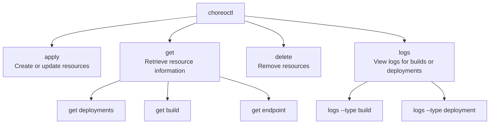
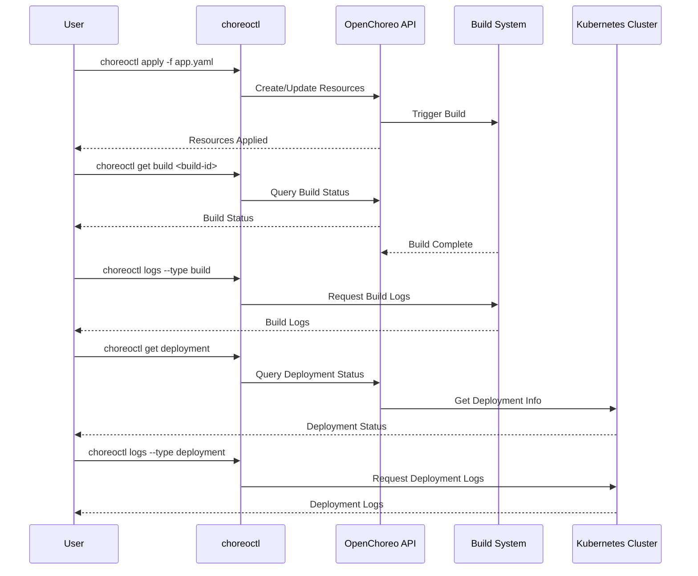
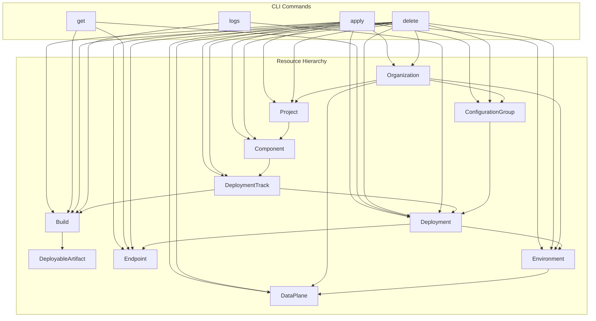

# choreoctl Commands

> **Relevant source files**
> * [Makefile](https://github.com/openchoreo/openchoreo/blob/a577e969/Makefile)
> * [cmd/choreoctl/Dockerfile](https://github.com/openchoreo/openchoreo/blob/a577e969/cmd/choreoctl/Dockerfile)
> * [cmd/observer/Dockerfile](https://github.com/openchoreo/openchoreo/blob/a577e969/cmd/observer/Dockerfile)
> * [cmd/openchoreo-api/main.go](https://github.com/openchoreo/openchoreo/blob/a577e969/cmd/openchoreo-api/main.go)
> * [docs/observability-logging.md](https://github.com/openchoreo/openchoreo/blob/a577e969/docs/observability-logging.md)
> * [install/helm/openchoreo-identity-provider/templates/post-install-hook.yaml](https://github.com/openchoreo/openchoreo/blob/a577e969/install/helm/openchoreo-identity-provider/templates/post-install-hook.yaml)
> * [internal/choreoctl/resources/kinds/dataplane.go](https://github.com/openchoreo/openchoreo/blob/a577e969/internal/choreoctl/resources/kinds/dataplane.go)
> * [internal/openchoreo-api/clients/k8s.go](https://github.com/openchoreo/openchoreo/blob/a577e969/internal/openchoreo-api/clients/k8s.go)
> * [internal/openchoreo-api/handlers/apply.go](https://github.com/openchoreo/openchoreo/blob/a577e969/internal/openchoreo-api/handlers/apply.go)
> * [internal/openchoreo-api/handlers/buildplanes.go](https://github.com/openchoreo/openchoreo/blob/a577e969/internal/openchoreo-api/handlers/buildplanes.go)
> * [internal/openchoreo-api/handlers/builds.go](https://github.com/openchoreo/openchoreo/blob/a577e969/internal/openchoreo-api/handlers/builds.go)
> * [internal/openchoreo-api/handlers/components.go](https://github.com/openchoreo/openchoreo/blob/a577e969/internal/openchoreo-api/handlers/components.go)
> * [internal/openchoreo-api/handlers/dataplanes.go](https://github.com/openchoreo/openchoreo/blob/a577e969/internal/openchoreo-api/handlers/dataplanes.go)
> * [internal/openchoreo-api/handlers/environments.go](https://github.com/openchoreo/openchoreo/blob/a577e969/internal/openchoreo-api/handlers/environments.go)
> * [internal/openchoreo-api/handlers/handlers.go](https://github.com/openchoreo/openchoreo/blob/a577e969/internal/openchoreo-api/handlers/handlers.go)
> * [internal/openchoreo-api/handlers/helpers.go](https://github.com/openchoreo/openchoreo/blob/a577e969/internal/openchoreo-api/handlers/helpers.go)
> * [internal/openchoreo-api/handlers/organizations.go](https://github.com/openchoreo/openchoreo/blob/a577e969/internal/openchoreo-api/handlers/organizations.go)
> * [internal/openchoreo-api/handlers/workloads.go](https://github.com/openchoreo/openchoreo/blob/a577e969/internal/openchoreo-api/handlers/workloads.go)
> * [internal/openchoreo-api/models/request.go](https://github.com/openchoreo/openchoreo/blob/a577e969/internal/openchoreo-api/models/request.go)
> * [internal/openchoreo-api/models/response.go](https://github.com/openchoreo/openchoreo/blob/a577e969/internal/openchoreo-api/models/response.go)
> * [internal/openchoreo-api/services/build_service.go](https://github.com/openchoreo/openchoreo/blob/a577e969/internal/openchoreo-api/services/build_service.go)
> * [internal/openchoreo-api/services/buildplane_service.go](https://github.com/openchoreo/openchoreo/blob/a577e969/internal/openchoreo-api/services/buildplane_service.go)
> * [internal/openchoreo-api/services/component_service.go](https://github.com/openchoreo/openchoreo/blob/a577e969/internal/openchoreo-api/services/component_service.go)
> * [internal/openchoreo-api/services/dataplane_service.go](https://github.com/openchoreo/openchoreo/blob/a577e969/internal/openchoreo-api/services/dataplane_service.go)
> * [internal/openchoreo-api/services/environment_service.go](https://github.com/openchoreo/openchoreo/blob/a577e969/internal/openchoreo-api/services/environment_service.go)
> * [internal/openchoreo-api/services/errors.go](https://github.com/openchoreo/openchoreo/blob/a577e969/internal/openchoreo-api/services/errors.go)
> * [internal/openchoreo-api/services/organization_service.go](https://github.com/openchoreo/openchoreo/blob/a577e969/internal/openchoreo-api/services/organization_service.go)
> * [internal/openchoreo-api/services/project_service.go](https://github.com/openchoreo/openchoreo/blob/a577e969/internal/openchoreo-api/services/project_service.go)
> * [internal/openchoreo-api/services/services.go](https://github.com/openchoreo/openchoreo/blob/a577e969/internal/openchoreo-api/services/services.go)
> * [make/common.mk](https://github.com/openchoreo/openchoreo/blob/a577e969/make/common.mk)
> * [make/docker.mk](https://github.com/openchoreo/openchoreo/blob/a577e969/make/docker.mk)
> * [make/golang.mk](https://github.com/openchoreo/openchoreo/blob/a577e969/make/golang.mk)
> * [make/kube.mk](https://github.com/openchoreo/openchoreo/blob/a577e969/make/kube.mk)
> * [make/lint.mk](https://github.com/openchoreo/openchoreo/blob/a577e969/make/lint.mk)
> * [make/tools.mk](https://github.com/openchoreo/openchoreo/blob/a577e969/make/tools.mk)

This page provides a comprehensive reference for the `choreoctl` command-line interface (CLI), which is the primary tool for interacting with the OpenChoreo platform. The CLI allows you to create, manage, and monitor resources within the platform, from organizations and projects to deployments and configurations.

For information about the larger OpenChoreo system architecture, see [OpenChoreo Overview](/openchoreo/openchoreo/1-openchoreo-overview) and [Architecture](/openchoreo/openchoreo/2-architecture).

## Command Overview



Sources: samples/deploying-applications/use-prebuilt-image/github-issue-reporter-task/README.md, samples/deploying-applications/build-from-source/time-logger-task/README.md

## Global Options

These options can be used with any `choreoctl` command:

| Option | Description | Example |
| --- | --- | --- |
| `--organization`, `-o` | Specify the organization | `--organization default-org` |
| `--project`, `-p` | Specify the project | `--project default-project` |
| `--component`, `-c` | Specify the component | `--component hello-world-web-application-php` |
| `--environment`, `-e` | Specify the environment | `--environment development` |

Sources: samples/deploying-applications/use-prebuilt-image/github-issue-reporter-task/README.md, samples/deploying-applications/languages/php/README.md

## Resource Management Commands

### apply

The `apply` command creates or updates resources defined in YAML files. This is the primary way to deploy applications, create configuration groups, and manage other OpenChoreo resources.

```
choreoctl apply -f <filename-or-url>
```

**Examples:**

Create a new component with deployment track and build:

```
choreoctl apply -f https://raw.githubusercontent.com/openchoreo/openchoreo/main/samples/deploying-applications/languages/php/hello-world-web-app.yaml
```

Create a new organization:

```sql
choreoctl apply -f https://raw.githubusercontent.com/openchoreo/openchoreo/main/samples/configuring-choreo/create-new-organization/organization.yaml
```

Create a deployment pipeline:

```sql
choreoctl apply -f https://raw.githubusercontent.com/openchoreo/openchoreo/main/samples/configuring-choreo/create-new-deployment-pipeline/deployment-pipeline.yaml
```

Sources: samples/deploying-applications/languages/php/README.md, samples/configuring-choreo/create-new-organization/README.md, samples/configuring-choreo/create-new-deployment-pipeline/README.md

### delete

The `delete` command removes resources defined in YAML files or specific resources by name.

```sql
choreoctl delete -f <filename-or-url>
```

**Examples:**

Delete a component and associated resources:

```sql
choreoctl delete -f https://raw.githubusercontent.com/openchoreo/openchoreo/main/samples/deploying-applications/languages/php/hello-world-web-app.yaml
```

Sources: samples/deploying-applications/languages/php/README.md, samples/configuring-choreo/create-new-organization/README.md

### get

The `get` command retrieves information about resources. It can be used to check the status of builds, deployments, and endpoints.

```
choreoctl get <resource-type> [resource-name] [options]
```

**Resource Types:**

* `build` - Get information about builds
* `deployment` - Get information about deployments
* `endpoint` - Get information about endpoints

**Examples:**

Get a specific build:

```
choreoctl get build time-logger-build-01 --component time-logger
```

Get all deployments for a component:

```
choreoctl get deployment --component time-logger
```

Get all deployments for a component in a specific environment:

```
choreoctl get deployments --environment=development
```

Get endpoints for a component:

```
choreoctl get endpoint --organization default-org --project default-project --component react-starter-image
```

Sources: samples/deploying-applications/build-from-source/time-logger-task/README.md, samples/deploying-applications/use-prebuilt-image/react-spa-webapp/README.md

### logs

The `logs` command retrieves logs for builds or deployments.

```
choreoctl logs --type <log-type> --<resource-type> <resource-name> [options]
```

**Log Types:**

* `build` - View build logs
* `deployment` - View deployment logs

**Examples:**

View build logs:

```
choreoctl logs --type build --build time-logger-build-01 --organization default-org --project default-project --component time-logger
```

View deployment logs:

```
choreoctl logs --type deployment --deployment time-logger-development-deployment --component time-logger
```

Sources: samples/deploying-applications/build-from-source/time-logger-task/README.md, samples/deploying-applications/languages/ballerina/README.md

## Command Usage in Deployment Workflows



Sources: samples/deploying-applications/build-from-source/reading-list-service/README.md, samples/deploying-applications/use-prebuilt-image/react-spa-webapp/README.md

## Common Workflows

### Deploying a New Application

1. Create a YAML file defining the component, deployment track, and build configuration
2. Apply the configuration: ``` choreoctl apply -f application.yaml ```
3. Check the build status: ``` choreoctl get build <build-name> --component <component-name> ```
4. View build logs: ``` choreoctl logs --type build --build <build-name> --component <component-name> ```
5. Check deployment status: ``` choreoctl get deployment --component <component-name> ```
6. View deployment logs: ``` choreoctl logs --type deployment --deployment <deployment-name> --component <component-name> ```

Sources: samples/deploying-applications/build-from-source/reading-list-service/README.md, samples/deploying-applications/languages/go/README.md

### Working with Configuration Groups

Configuration groups allow you to define environment-specific configurations that can be shared across multiple applications. The GitHub Issue Reporter example demonstrates this capability:

1. Create a YAML file defining the configuration groups and application
2. Apply the configuration: ``` choreoctl apply -f config-groups.yaml ```
3. Deploy applications that reference these configuration groups
4. Verify configuration in each environment using logs: ``` choreoctl logs --type deployment --deployment <deployment-name> --environment <environment> --component <component-name> ```

Sources: samples/deploying-applications/use-prebuilt-image/github-issue-reporter-task/README.md

### Creating Organizational Resources

1. Create a YAML file defining the organization structure
2. Apply the configuration: ``` choreoctl apply -f organization.yaml ```
3. Create environments: ``` choreoctl apply -f environment.yaml ```
4. Create deployment pipeline: ``` choreoctl apply -f deployment-pipeline.yaml ```
5. Create projects: ``` choreoctl apply -f project.yaml ```

Sources: samples/configuring-choreo/create-new-organization/README.md, samples/configuring-choreo/create-new-environments/README.md, samples/configuring-choreo/create-new-deployment-pipeline/README.md

## Resource Relationships and Command Context



Sources: samples/configuring-choreo/create-new-organization/README.md, samples/deploying-applications/add-new-project/README.md

## Command Examples by Resource Type

### Components and Deployments

Components are the core building blocks in OpenChoreo, representing services, web applications, or scheduled tasks.

| Command | Description | Example |
| --- | --- | --- |
| Create component | Create a new component | `choreoctl apply -f component.yaml` |
| Get deployments | List all deployments for a component | `choreoctl get deployments --component reading-list-service` |
| Get deployment logs | View logs for a deployment | `choreoctl logs --type deployment --deployment reading-list-service-development-deployment-01 --component reading-list-service` |

Sources: samples/deploying-applications/build-from-source/reading-list-service/README.md

### Builds

Builds create container images from source code or use pre-built images.

| Command | Description | Example |
| --- | --- | --- |
| Create build | Create a new build | `choreoctl apply -f build.yaml` |
| Get build status | Check the status of a build | `choreoctl get build reading-list-service-build-01 --component reading-list-service` |
| Get build logs | View logs for a build | `choreoctl logs --type build --build reading-list-service-build-01 --component reading-list-service` |

Sources: samples/deploying-applications/build-from-source/reading-list-service/README.md

### Organizations and Projects

Organizations are the top-level grouping for resources, while projects organize components.

| Command | Description | Example |
| --- | --- | --- |
| Create organization | Create a new organization | `choreoctl apply -f organization.yaml` |
| Create project | Create a new project | `choreoctl apply -f project.yaml` |

Sources: samples/configuring-choreo/create-new-organization/README.md, samples/deploying-applications/add-new-project/README.md

### Environments and Deployment Pipelines

Environments represent deployment targets, while deployment pipelines define promotion paths.

| Command | Description | Example |
| --- | --- | --- |
| Create environment | Create a new environment | `choreoctl apply -f environment.yaml` |
| Create deployment pipeline | Create a new deployment pipeline | `choreoctl apply -f deployment-pipeline.yaml` |
| Update deployment pipeline | Update an existing deployment pipeline | `choreoctl apply -f updated-pipeline.yaml` |

Sources: samples/configuring-choreo/create-new-environments/README.md, samples/configuring-choreo/create-new-deployment-pipeline/README.md, samples/configuring-choreo/update-deployment-pipeline/README.md

## Command Output Format

Most `choreoctl` commands output tabular data showing resource information:

```
NAME                     ARTIFACT                       ENVIRONMENT   STATUS                    AGE   COMPONENT               PROJECT           ORGANIZATION
development-deployment   github-issue-reporter-latest   development   Ready (DeploymentReady)   12m   github-issue-reporter   default-project   default-org
```

This output includes key information such as resource name, status, age, and related resources.

Sources: samples/deploying-applications/use-prebuilt-image/github-issue-reporter-task/README.md

## Simplifying Commands with Aliases

For frequently used command combinations, you can create aliases:

```
alias choreoctl='choreoctl --organization default-org --project default-project --component github-issue-reporter'
```

This allows shorter commands:

```
choreoctl get deployments --environment=development
```

Instead of:

```
choreoctl get deployments --organization default-org --project default-project --component github-issue-reporter --environment=development
```

Sources: samples/deploying-applications/use-prebuilt-image/github-issue-reporter-task/README.md

## Conclusion

The `choreoctl` command-line interface is the primary tool for interacting with the OpenChoreo platform. It provides commands for creating, managing, and monitoring resources, making it essential for deploying and managing applications within the platform.

For more details on deploying applications, see [Deploying Applications](/openchoreo/openchoreo/6.2-application-resources), and for a quick introduction to OpenChoreo, see [Quick Start Guide](/openchoreo/openchoreo/6.3-build-and-deployment-resources).