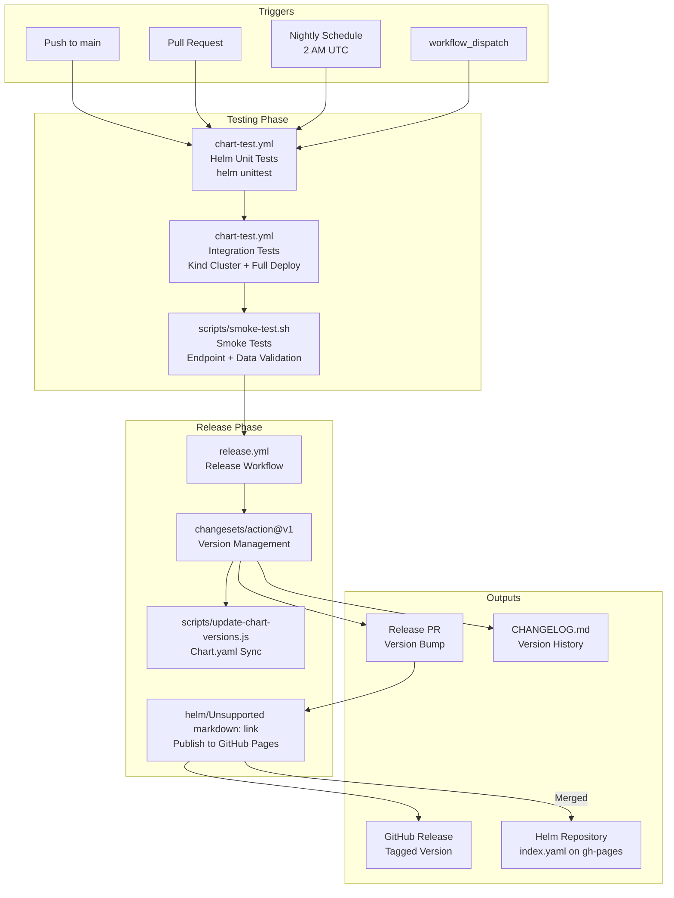
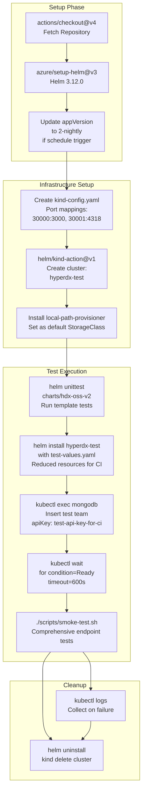
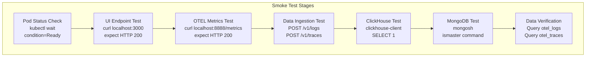
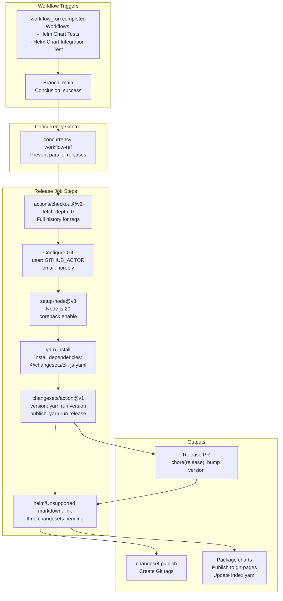
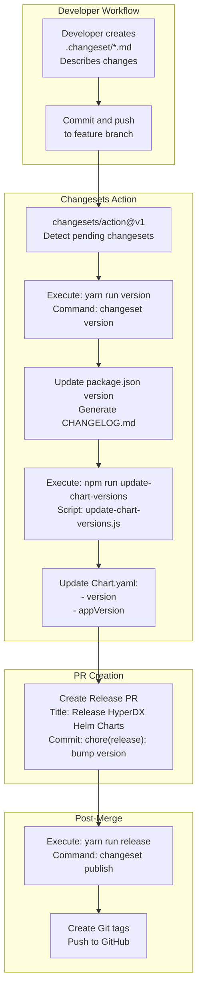
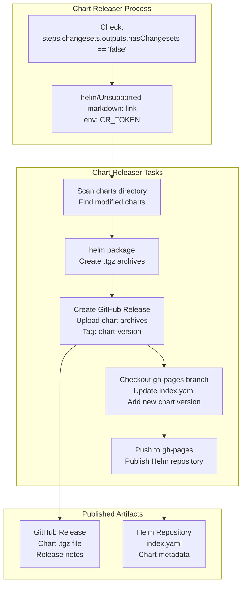
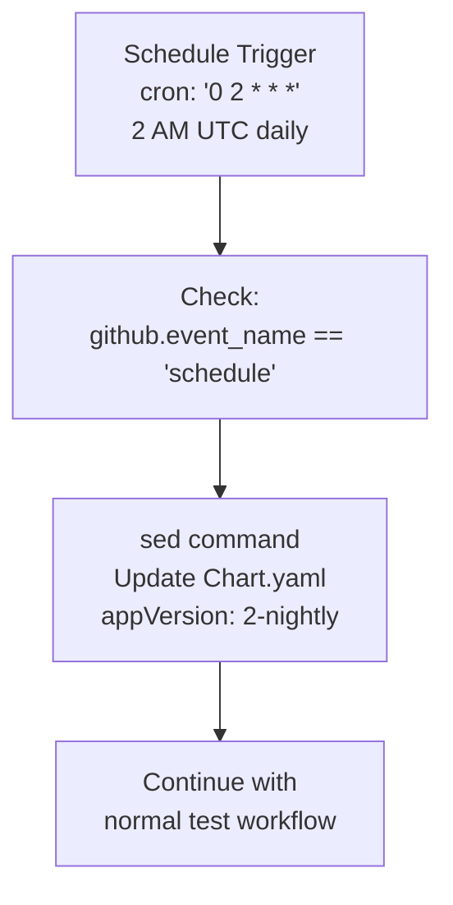

# CI/CD Pipeline

> **Relevant source files**
> * [.github/workflows/chart-test.yml](https://github.com/hyperdxio/helm-charts/blob/845dd482/.github/workflows/chart-test.yml)
> * [.github/workflows/release.yml](https://github.com/hyperdxio/helm-charts/blob/845dd482/.github/workflows/release.yml)
> * [charts/hdx-oss-v2/tests/helpers_test.yaml](https://github.com/hyperdxio/helm-charts/blob/845dd482/charts/hdx-oss-v2/tests/helpers_test.yaml)
> * [package.json](https://github.com/hyperdxio/helm-charts/blob/845dd482/package.json)
> * [scripts/smoke-test.sh](https://github.com/hyperdxio/helm-charts/blob/845dd482/scripts/smoke-test.sh)

## Purpose and Scope

This document describes the continuous integration and continuous deployment (CI/CD) pipeline for the HyperDX Helm Charts repository. The pipeline automates testing, versioning, and publishing of Helm charts using GitHub Actions workflows. The system uses the Changesets tool for semantic versioning and the Helm Chart Releaser for distribution via GitHub Pages.

For information about the chart versioning strategy and metadata, see [Chart Metadata and Packaging](/hyperdxio/helm-charts/9.5-chart-metadata-and-packaging). For details on the testing methodology, see [Testing](/hyperdxio/helm-charts/9.2-testing). For the overall release management process, see [Release Management](/hyperdxio/helm-charts/9.3-release-management).

## Pipeline Architecture

The CI/CD pipeline consists of three primary workflows that work together to ensure code quality and automate releases:



**Sources:** [.github/workflows/chart-test.yml L1-L184](https://github.com/hyperdxio/helm-charts/blob/845dd482/.github/workflows/chart-test.yml#L1-L184)

 [.github/workflows/release.yml L1-L51](https://github.com/hyperdxio/helm-charts/blob/845dd482/.github/workflows/release.yml#L1-L51)

 [package.json L1-L19](https://github.com/hyperdxio/helm-charts/blob/845dd482/package.json#L1-L19)

## Testing Workflows

### Chart Test Workflow

The `chart-test.yml` workflow provides comprehensive testing of the Helm chart across multiple stages. It is triggered by pushes to main, pull requests, nightly schedules, and manual invocations.



**Key configuration details:**

| Configuration | Value | Purpose |
| --- | --- | --- |
| Kind cluster name | `hyperdx-test` | Test cluster identifier |
| Port mappings | 30000→3000, 30001→4318 | Expose UI and OTEL endpoints |
| Storage class | `local-path` | PVC provisioning in Kind |
| Test API key | `test-api-key-for-ci` | Authentication for test telemetry |
| Helm timeout | 5m | Chart installation timeout |
| Pod wait timeout | 600s | Maximum time for pods to become ready |

**Sources:** [.github/workflows/chart-test.yml L16-L184](https://github.com/hyperdxio/helm-charts/blob/845dd482/.github/workflows/chart-test.yml#L16-L184)

### Unit Tests

The workflow runs Helm unit tests using the `helm-unittest` plugin, which validates template rendering with various values configurations:

```markdown
# Executed at .github/workflows/chart-test.yml:64-67
helm plugin install https://github.com/helm-unittest/helm-unittest.git
helm unittest charts/hdx-oss-v2
```

Test files are located at `charts/hdx-oss-v2/tests/` and validate helper templates, resource generation, and configuration injection patterns.

**Sources:** [.github/workflows/chart-test.yml L64-L67](https://github.com/hyperdxio/helm-charts/blob/845dd482/.github/workflows/chart-test.yml#L64-L67)

 [charts/hdx-oss-v2/tests/helpers_test.yaml L1-L50](https://github.com/hyperdxio/helm-charts/blob/845dd482/charts/hdx-oss-v2/tests/helpers_test.yaml#L1-L50)

### Integration Tests

The integration test phase deploys a complete HyperDX stack to a Kind Kubernetes cluster with optimized test values:

```yaml
# Test values used for CI deployment
hyperdx:
  apiKey: "test-api-key-for-ci"
  frontendUrl: "http://localhost:3000"
  replicas: 1
  service:
    type: NodePort
    nodePort: 30000

clickhouse:
  persistence:
    enabled: true
    dataSize: 2Gi
    logSize: 1Gi

mongodb:
  persistence:
    enabled: true
    dataSize: 2Gi

otel:
  resources:
    requests:
      memory: "128Mi"
      cpu: "100m"
    limits:
      memory: "256Mi"
      cpu: "200m"
```

The test includes MongoDB bootstrapping to create a test team, which is required for the OpAMP server to configure collectors properly.

**Sources:** [.github/workflows/chart-test.yml L69-L138](https://github.com/hyperdxio/helm-charts/blob/845dd482/.github/workflows/chart-test.yml#L69-L138)

### Smoke Tests

The smoke test script validates the deployed system through multiple checks:



The smoke test script uses `kubectl port-forward` to access internal services and validates end-to-end telemetry flow by sending test OTLP data and querying ClickHouse for ingested records.

**Sources:** [scripts/smoke-test.sh L1-L202](https://github.com/hyperdxio/helm-charts/blob/845dd482/scripts/smoke-test.sh#L1-L202)

 [.github/workflows/chart-test.yml L152-L156](https://github.com/hyperdxio/helm-charts/blob/845dd482/.github/workflows/chart-test.yml#L152-L156)

## Release Workflow

The `release.yml` workflow automates chart publishing and is triggered only after successful test workflow completion on the main branch.



**Sources:** [.github/workflows/release.yml L1-L51](https://github.com/hyperdxio/helm-charts/blob/845dd482/.github/workflows/release.yml#L1-L51)

### Workflow Configuration

| Setting | Value | Purpose |
| --- | --- | --- |
| Trigger | `workflow_run` | Run after test workflows complete |
| Condition | `conclusion == 'success'` | Only proceed if tests pass |
| Branch | `main` | Only release from main branch |
| Concurrency group | `${{ github.workflow }}-${{ github.ref }}` | Prevent parallel releases |
| Permissions | `contents: write``pull-requests: write` | Create releases and PRs |
| Node version | 20 | Required for changesets CLI |

**Sources:** [.github/workflows/release.yml L2-L15](https://github.com/hyperdxio/helm-charts/blob/845dd482/.github/workflows/release.yml#L2-L15)

## Version Management with Changesets

The pipeline uses the Changesets tool for semantic versioning. This provides a structured approach to version bumping and changelog generation.



**Sources:** [.github/workflows/release.yml L36-L45](https://github.com/hyperdxio/helm-charts/blob/845dd482/.github/workflows/release.yml#L36-L45)

 [package.json L9-L12](https://github.com/hyperdxio/helm-charts/blob/845dd482/package.json#L9-L12)

### Version Script

The `update-chart-versions.js` script synchronizes the Helm chart version with the package.json version:

```sql
// Executed by: npm run update-chart-versions
// Script location: scripts/update-chart-versions.js
// Purpose: Keep Chart.yaml version in sync with package.json
```

This script reads the version from `package.json`, parses `charts/hdx-oss-v2/Chart.yaml` using `js-yaml`, updates the `version` field, and writes the file back.

**Sources:** [package.json L12](https://github.com/hyperdxio/helm-charts/blob/845dd482/package.json#L12-L12)

### Package.json Scripts

The npm scripts coordinate the version management process:

| Script | Command | Purpose |
| --- | --- | --- |
| `version` | `changeset version && npm run update-chart-versions` | Bump versions and sync Chart.yaml |
| `release` | `changeset publish` | Create Git tags and publish |
| `update-chart-versions` | `node scripts/update-chart-versions.js` | Sync Chart.yaml with package.json |

**Sources:** [package.json L9-L12](https://github.com/hyperdxio/helm-charts/blob/845dd482/package.json#L9-L12)

## Chart Publishing with Chart Releaser

After a release PR is merged and there are no pending changesets, the workflow publishes charts using the Helm Chart Releaser action.



The Chart Releaser action automates:

* Packaging changed charts into `.tgz` archives
* Creating GitHub Releases with semantic version tags
* Updating the Helm repository `index.yaml` on the `gh-pages` branch
* Publishing charts for consumption via `helm repo add`

**Sources:** [.github/workflows/release.yml L46-L50](https://github.com/hyperdxio/helm-charts/blob/845dd482/.github/workflows/release.yml#L46-L50)

### Chart Releaser Configuration

| Setting | Value | Purpose |
| --- | --- | --- |
| Action version | `v1.7.0` | Helm Chart Releaser version |
| Token | `${{ secrets.GITHUB_TOKEN }}` | Authenticate with GitHub API |
| Condition | `hasChangesets == 'false'` | Only run after versions are bumped |

**Sources:** [.github/workflows/release.yml L47-L50](https://github.com/hyperdxio/helm-charts/blob/845dd482/.github/workflows/release.yml#L47-L50)

## Nightly Builds

The testing workflow includes special handling for nightly scheduled builds to test against the latest development versions:



This ensures the chart is tested against the `2-nightly` Docker image tag, which contains the latest development build of the HyperDX application.

**Sources:** [.github/workflows/chart-test.yml L11-L35](https://github.com/hyperdxio/helm-charts/blob/845dd482/.github/workflows/chart-test.yml#L11-L35)

## Workflow Permissions

The workflows require specific GitHub permissions to perform their operations:

| Workflow | Permission | Purpose |
| --- | --- | --- |
| `chart-test.yml` | Default | Read repository, run tests |
| `release.yml` | `contents: write` | Create releases, push tags |
| `release.yml` | `pull-requests: write` | Create and update PRs |

**Sources:** [.github/workflows/release.yml L12-L14](https://github.com/hyperdxio/helm-charts/blob/845dd482/.github/workflows/release.yml#L12-L14)

## Environment Variables and Secrets

The CI/CD pipeline uses the following environment variables and secrets:

| Name | Type | Usage | Source |
| --- | --- | --- | --- |
| `GITHUB_TOKEN` | Secret | Authenticate GitHub API | Automatically provided by GitHub Actions |
| `GITHUB_ACTOR` | Variable | Git commit author | Automatically provided by GitHub Actions |
| `CR_TOKEN` | Environment | Chart Releaser authentication | Set from `GITHUB_TOKEN` |
| `RELEASE_NAME` | Variable | Helm release name in tests | Set to `hyperdx-test` |
| `NAMESPACE` | Variable | Kubernetes namespace | Set to `default` |

**Sources:** [.github/workflows/release.yml L45-L50](https://github.com/hyperdxio/helm-charts/blob/845dd482/.github/workflows/release.yml#L45-L50)

 [scripts/smoke-test.sh L5-L6](https://github.com/hyperdxio/helm-charts/blob/845dd482/scripts/smoke-test.sh#L5-L6)

## Failure Handling

The testing workflow includes comprehensive failure handling to aid debugging:

```markdown
# Log collection on test failure
# .github/workflows/chart-test.yml:158-177

echo "=== Pod Status ==="
kubectl get pods -o wide

echo "=== Events ==="
kubectl get events --sort-by=.metadata.creationTimestamp

echo "=== HyperDX App Logs ==="
kubectl logs -l app=app --tail=100

echo "=== ClickHouse Logs ==="
kubectl logs -l app=clickhouse --tail=100

echo "=== MongoDB Logs ==="
kubectl logs -l app=mongodb --tail=100

echo "=== OTEL Collector Logs ==="
kubectl logs -l app=otel-collector --tail=100
```

The workflow always cleans up resources, regardless of success or failure, to prevent resource leaks in the CI environment.

**Sources:** [.github/workflows/chart-test.yml L158-L183](https://github.com/hyperdxio/helm-charts/blob/845dd482/.github/workflows/chart-test.yml#L158-L183)

## Summary of CI/CD Components

| Component | File/Action | Purpose |
| --- | --- | --- |
| Test Workflow | `.github/workflows/chart-test.yml` | Run unit, integration, and smoke tests |
| Release Workflow | `.github/workflows/release.yml` | Automate version bumping and publishing |
| Changesets CLI | `@changesets/cli` | Semantic versioning and changelog |
| Version Sync Script | `scripts/update-chart-versions.js` | Keep Chart.yaml synchronized |
| Smoke Test Script | `scripts/smoke-test.sh` | Validate deployed system |
| Chart Releaser | `helm/chart-releaser-action` | Publish charts to GitHub Pages |
| Helm Unit Test | `helm-unittest` plugin | Validate Helm templates |
| Unit Test Specs | `charts/hdx-oss-v2/tests/*.yaml` | Template validation tests |

**Sources:** [.github/workflows/chart-test.yml L1-L184](https://github.com/hyperdxio/helm-charts/blob/845dd482/.github/workflows/chart-test.yml#L1-L184)

 [.github/workflows/release.yml L1-L51](https://github.com/hyperdxio/helm-charts/blob/845dd482/.github/workflows/release.yml#L1-L51)

 [package.json L1-L19](https://github.com/hyperdxio/helm-charts/blob/845dd482/package.json#L1-L19)

 [scripts/smoke-test.sh L1-L202](https://github.com/hyperdxio/helm-charts/blob/845dd482/scripts/smoke-test.sh#L1-L202)

 [charts/hdx-oss-v2/tests/helpers_test.yaml L1-L50](https://github.com/hyperdxio/helm-charts/blob/845dd482/charts/hdx-oss-v2/tests/helpers_test.yaml#L1-L50)