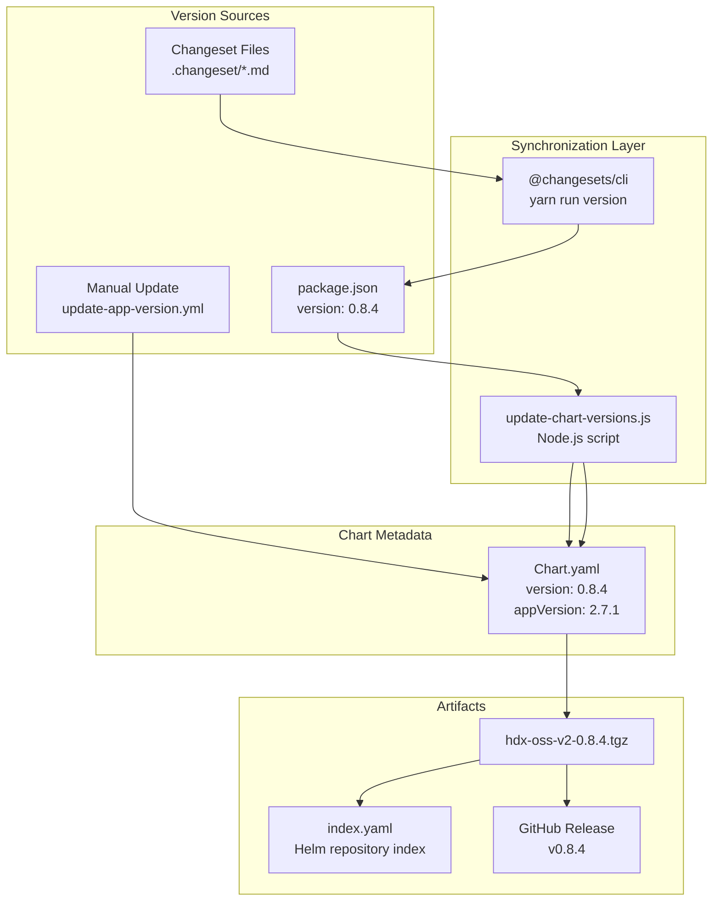
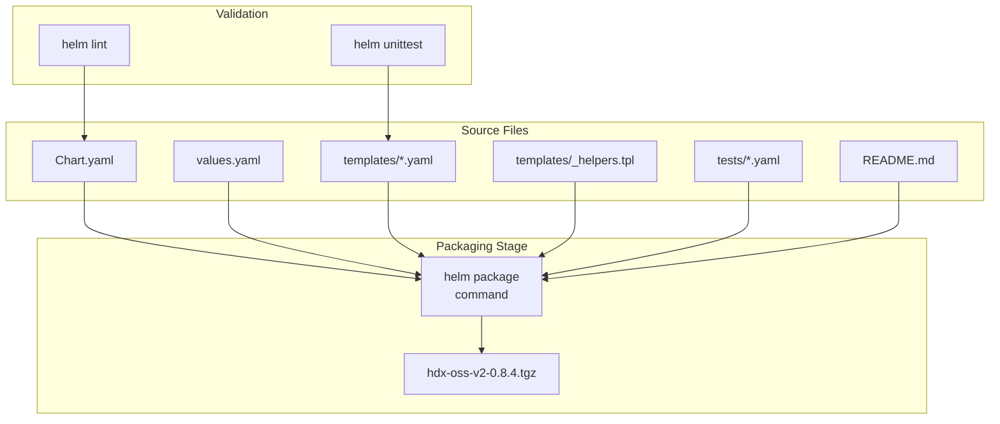
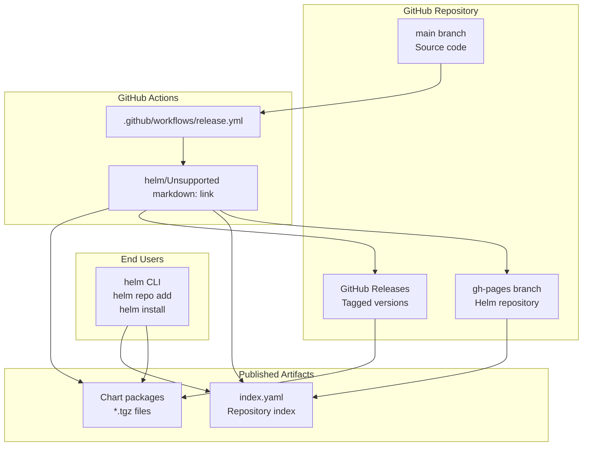

# Chart Metadata and Packaging

> **Relevant source files**
> * [.github/workflows/release.yml](https://github.com/hyperdxio/helm-charts/blob/845dd482/.github/workflows/release.yml)
> * [charts/hdx-oss-v2/Chart.yaml](https://github.com/hyperdxio/helm-charts/blob/845dd482/charts/hdx-oss-v2/Chart.yaml)
> * [charts/hdx-oss-v2/tests/helpers_test.yaml](https://github.com/hyperdxio/helm-charts/blob/845dd482/charts/hdx-oss-v2/tests/helpers_test.yaml)
> * [package.json](https://github.com/hyperdxio/helm-charts/blob/845dd482/package.json)

This document explains the structure and management of Helm chart metadata, the versioning strategy employed, and the packaging and distribution process for the HyperDX Helm charts. It covers the `Chart.yaml` specification, version synchronization mechanisms, and how charts are packaged and published to the Helm repository.

For information about the overall release workflow and changesets, see [Release Management](/hyperdxio/helm-charts/9.3-release-management). For details on the CI/CD automation that executes packaging and publishing, see [CI/CD Pipeline](/hyperdxio/helm-charts/9.4-cicd-pipeline).

## Chart.yaml Structure

The `Chart.yaml` file is the primary metadata descriptor for the Helm chart. It defines essential information about the chart itself and the application it deploys.

### Core Metadata Fields

The HyperDX chart metadata follows the Helm v2 API specification:

```yaml
apiVersion: v2
name: hdx-oss-v2
description: A Helm chart for HyperDX OSS V2
type: application
version: 0.8.4
appVersion: 2.7.1
```

| Field | Purpose | Current Value | Management |
| --- | --- | --- | --- |
| `apiVersion` | Helm API version | `v2` | Static - defines Chart API schema |
| `name` | Chart name | `hdx-oss-v2` | Static - unique identifier for the chart |
| `description` | Human-readable description | `A Helm chart for HyperDX OSS V2` | Static - describes chart purpose |
| `type` | Chart type | `application` | Static - indicates deployable application vs library |
| `version` | Chart version | `0.8.4` | Dynamic - bumped for chart changes |
| `appVersion` | Application version | `2.7.1` | Dynamic - tracks HyperDX app version |

The `version` field represents the version of the chart packaging, templates, and configuration options. It follows semantic versioning (MAJOR.MINOR.PATCH) and is incremented when:

* Chart templates are modified
* Configuration options are added/changed
* Dependencies are updated
* Documentation is updated

The `appVersion` field represents the version of the HyperDX application being deployed. It corresponds to the Docker image tags used in the deployment and is updated when the upstream HyperDX application releases a new version.

Sources: [charts/hdx-oss-v2/Chart.yaml L1-L7](https://github.com/hyperdxio/helm-charts/blob/845dd482/charts/hdx-oss-v2/Chart.yaml#L1-L7)

## Versioning Architecture

The chart employs a dual-versioning strategy where chart packaging and application versions are managed independently but synchronized through automation.

### Version Flow Diagram



**Version Synchronization Flow**: Changesets manage version bumping through the `@changesets/cli` tool, which updates `package.json`. The custom `update-chart-versions.js` script then synchronizes this version to `Chart.yaml`. For application version updates, the `update-app-version.yml` workflow allows manual updates to the `appVersion` field.

Sources: [package.json L1-L19](https://github.com/hyperdxio/helm-charts/blob/845dd482/package.json#L1-L19)

 [charts/hdx-oss-v2/Chart.yaml L1-L7](https://github.com/hyperdxio/helm-charts/blob/845dd482/charts/hdx-oss-v2/Chart.yaml#L1-L7)

### Version Synchronization Script

The `update-chart-versions.js` script maintains consistency between `package.json` and `Chart.yaml`:

**Script Location**: `scripts/update-chart-versions.js`

**Execution**: Automatically run via the `version` npm script: `yarn run version` calls `changeset version && npm run update-chart-versions`

**Function**: The script reads the version from `package.json` and updates the `version` field in `Chart.yaml`, ensuring that chart version and package version remain synchronized after changeset version bumping.

This approach separates concerns:

* Chart packaging changes (templates, values, structure) increment the chart `version`
* Application upgrades increment the `appVersion`
* The synchronization script prevents version drift

Sources: [package.json L10-L12](https://github.com/hyperdxio/helm-charts/blob/845dd482/package.json#L10-L12)

## Chart Packaging Process

Helm packages charts into compressed archives (`.tgz` files) containing all chart files and templates. The packaging process is automated through the CI/CD pipeline.

### Packaging Pipeline



**Chart Packaging**: The `helm package` command bundles all chart resources into a versioned archive. The archive name follows the pattern `{chart-name}-{version}.tgz` (e.g., `hdx-oss-v2-0.8.4.tgz`).

**Included Files**:

* `Chart.yaml` - Chart metadata
* `values.yaml` - Default configuration values
* `templates/` - Kubernetes resource templates
* `templates/_helpers.tpl` - Template helpers and functions
* `tests/` - Helm unit tests (not deployed, used for validation)
* `README.md` - Chart documentation

**Excluded Files**:

* `.helmignore` patterns (if present)
* Development files (`.git`, `node_modules`, etc.)

Sources: [charts/hdx-oss-v2/Chart.yaml L1-L7](https://github.com/hyperdxio/helm-charts/blob/845dd482/charts/hdx-oss-v2/Chart.yaml#L1-L7)

### Package Contents and Structure

The packaged chart archive maintains a specific directory structure:

```
hdx-oss-v2-0.8.4.tgz
├── hdx-oss-v2/
│   ├── Chart.yaml
│   ├── values.yaml
│   ├── templates/
│   │   ├── _helpers.tpl
│   │   ├── hyperdx-deployment.yaml
│   │   ├── hyperdx-service.yaml
│   │   ├── hyperdx-ingress.yaml
│   │   ├── otel-deployment.yaml
│   │   ├── clickhouse-statefulset.yaml
│   │   ├── mongodb-statefulset.yaml
│   │   ├── app-configmap.yaml
│   │   ├── app-secret.yaml
│   │   └── ...
│   ├── tests/
│   │   ├── helpers_test.yaml
│   │   └── ...
│   └── README.md
```

## Distribution via GitHub Pages

The HyperDX Helm charts are distributed through a Helm repository hosted on GitHub Pages. This provides a standard Helm repository interface for users to install and upgrade charts.

### Distribution Architecture



**Chart Distribution Flow**: The `helm/chart-releaser-action` automates the entire distribution process. It packages charts, creates GitHub Releases with attached chart archives, generates the `index.yaml` repository index, and publishes it to the `gh-pages` branch.

Sources: [.github/workflows/release.yml L46-L50](https://github.com/hyperdxio/helm-charts/blob/845dd482/.github/workflows/release.yml#L46-L50)

### Helm Repository Index

The `index.yaml` file serves as the repository catalog, listing all available chart versions:

**Location**: `https://hyperdxio.github.io/helm-charts/index.yaml`

**Structure**: The index contains metadata for each chart version:

```yaml
apiVersion: v1
entries:
  hdx-oss-v2:
    - name: hdx-oss-v2
      version: 0.8.4
      appVersion: 2.7.1
      description: A Helm chart for HyperDX OSS V2
      urls:
        - https://github.com/hyperdxio/helm-charts/releases/download/hdx-oss-v2-0.8.4/hdx-oss-v2-0.8.4.tgz
      created: 2024-01-15T10:30:00.000Z
      digest: sha256:abc123...
```

**Usage**: Users add the repository with `helm repo add hyperdx https://hyperdxio.github.io/helm-charts`, which downloads and caches the `index.yaml` file. Helm uses this index to resolve chart versions and download URLs.

Sources: [.github/workflows/release.yml L46-L50](https://github.com/hyperdxio/helm-charts/blob/845dd482/.github/workflows/release.yml#L46-L50)

## Release Workflow Integration

The chart packaging and distribution is integrated into the automated release workflow that triggers after successful test completion.

### Release Job Configuration

The release workflow executes packaging and publishing when tests pass on the main branch:

**Workflow File**: `.github/workflows/release.yml`

**Key Steps**:

1. **Version Management**: `changesets/action@v1` creates version bump PRs * Runs `yarn run version` to update versions * Runs `yarn run release` for publishing
2. **Chart Release**: `helm/chart-releaser-action@v1.7.0` packages and publishes * Only runs when `hasChangesets == 'false'` (after PR merge) * Uses `CR_TOKEN` for GitHub authentication * Automatically creates GitHub Releases and updates gh-pages

**Trigger Conditions**:

* Runs after "Helm Chart Tests" and "Helm Chart Integration Test" workflows complete successfully
* Only executes on the `main` branch
* Requires workflow run conclusion to be `success`

**Concurrency Control**: Uses `concurrency: ${{ github.workflow }}-${{ github.ref }}` to prevent parallel executions

Sources: [.github/workflows/release.yml L1-L51](https://github.com/hyperdxio/helm-charts/blob/845dd482/.github/workflows/release.yml#L1-L51)

## Metadata Usage in Templates

Chart metadata from `Chart.yaml` is available in all templates through the `.Chart` object and is used to generate consistent labels and identifiers.

### Template Helper Functions

The `_helpers.tpl` file defines functions that incorporate chart metadata:

**Chart Label**: Combines name and version

```
{{- define "hdx-oss-v2.chart" -}}
{{- printf "%s-%s" .Chart.Name .Chart.Version | replace "+" "_" | trunc 63 | trimSuffix "-" }}
{{- end }}
```

**Common Labels**: Applied to all resources

```
{{- define "hdx-oss-v2.labels" -}}
helm.sh/chart: {{ include "hdx-oss-v2.chart" . }}
{{ include "hdx-oss-v2.selectorLabels" . }}
{{- if .Chart.AppVersion }}
app.kubernetes.io/version: {{ .Chart.AppVersion | quote }}
{{- end }}
app.kubernetes.io/managed-by: {{ .Release.Service }}
{{- end }}
```

### Standard Label Application

Every Kubernetes resource receives consistent labels derived from chart metadata:

| Label | Source | Example Value | Purpose |
| --- | --- | --- | --- |
| `helm.sh/chart` | `.Chart.Name` + `.Chart.Version` | `hdx-oss-v2-0.8.4` | Tracks chart version deployed |
| `app.kubernetes.io/name` | `.Chart.Name` | `hdx-oss-v2` | Application identifier |
| `app.kubernetes.io/instance` | `.Release.Name` | `my-release` | Release instance name |
| `app.kubernetes.io/version` | `.Chart.AppVersion` | `2.7.1` | Application version |
| `app.kubernetes.io/managed-by` | `.Release.Service` | `Helm` | Management tool identifier |

These labels enable:

* **Version tracking**: Identify which chart version is deployed
* **Resource grouping**: Query all resources for a specific release
* **Upgrade management**: Helm uses labels to track resource ownership
* **Monitoring integration**: Labels can be used as Prometheus metrics dimensions

Sources: [charts/hdx-oss-v2/tests/helpers_test.yaml L27-L49](https://github.com/hyperdxio/helm-charts/blob/845dd482/charts/hdx-oss-v2/tests/helpers_test.yaml#L27-L49)

### Metadata Testing

The chart includes unit tests that validate metadata usage in templates:

**Test Suite**: `charts/hdx-oss-v2/tests/helpers_test.yaml`

**Tested Behaviors**:

* Chart version label format validation (`^hdx-oss-v2-\d+\.\d+\.\d+$`)
* Standard label presence (name, instance, managed-by)
* AppVersion label inclusion when available
* Name override functionality
* Full name override functionality

**Example Test**:

```yaml
- it: should render chart version in labels when available
  asserts:
    - matchRegex:
        path: metadata.labels["app.kubernetes.io/version"]
        pattern: ^\d+\.\d+\.\d+$
```

These tests ensure that chart metadata is correctly propagated to all generated Kubernetes resources and that template helper functions produce expected output.

Sources: [charts/hdx-oss-v2/tests/helpers_test.yaml L1-L50](https://github.com/hyperdxio/helm-charts/blob/845dd482/charts/hdx-oss-v2/tests/helpers_test.yaml#L1-L50)

## Version Management Best Practices

The chart follows specific practices for managing versions:

### Chart Version Increments

**PATCH version** (0.8.3 → 0.8.4):

* Bug fixes in templates
* Documentation updates
* Non-breaking configuration adjustments
* Test improvements

**MINOR version** (0.8.4 → 0.9.0):

* New configuration options
* New optional features
* Backward-compatible template changes
* New optional components

**MAJOR version** (0.9.0 → 1.0.0):

* Breaking changes in configuration structure
* Removal of deprecated features
* Required migration steps
* Incompatible template changes

### AppVersion Management

The `appVersion` field tracks the HyperDX application version independently:

**Update Triggers**:

* New HyperDX application releases
* Security patches to application images
* Feature updates in the application

**Update Process**:

1. Manual workflow trigger via `update-app-version.yml` (referenced in related pages)
2. Creates PR with updated `appVersion`
3. Maintains chart version unless templates need changes
4. Triggers new chart release with updated app version

**Backward Compatibility**: Chart version remains stable even when `appVersion` changes, ensuring users can update the application without changing chart configuration.

Sources: [charts/hdx-oss-v2/Chart.yaml L5-L6](https://github.com/hyperdxio/helm-charts/blob/845dd482/charts/hdx-oss-v2/Chart.yaml#L5-L6)

## Chart Package Distribution

### Package Naming Convention

Chart packages follow a strict naming pattern:

**Format**: `{chart-name}-{chart-version}.tgz`

**Example**: `hdx-oss-v2-0.8.4.tgz`

**Components**:

* Chart name: `hdx-oss-v2` (from `Chart.yaml` `name` field)
* Chart version: `0.8.4` (from `Chart.yaml` `version` field)
* Extension: `.tgz` (gzipped tar archive)

This naming convention allows:

* Multiple versions to coexist in the repository
* Helm to automatically resolve version constraints
* Clear identification of package contents

### Download URLs

Chart packages are hosted in GitHub Releases with predictable URLs:

**Pattern**: `https://github.com/hyperdxio/helm-charts/releases/download/{chart-name}-{version}/{chart-name}-{version}.tgz`

**Example**: `https://github.com/hyperdxio/helm-charts/releases/download/hdx-oss-v2-0.8.4/hdx-oss-v2-0.8.4.tgz`

**Resolution**: The `index.yaml` file contains the complete download URL for each chart version, eliminating the need for users to construct URLs manually.

Sources: [.github/workflows/release.yml L46-L50](https://github.com/hyperdxio/helm-charts/blob/845dd482/.github/workflows/release.yml#L46-L50)

## Checksum and Integrity

The `index.yaml` file includes SHA256 digests for each chart package, enabling integrity verification:

**Digest Generation**: Automatically computed by `helm/chart-releaser-action` during packaging

**Verification**: Helm CLI automatically verifies checksums when downloading charts

**Format**: `sha256:{64-character-hex-digest}`

This ensures that downloaded chart packages haven't been tampered with or corrupted during transmission.

Sources: [.github/workflows/release.yml L46-L50](https://github.com/hyperdxio/helm-charts/blob/845dd482/.github/workflows/release.yml#L46-L50)