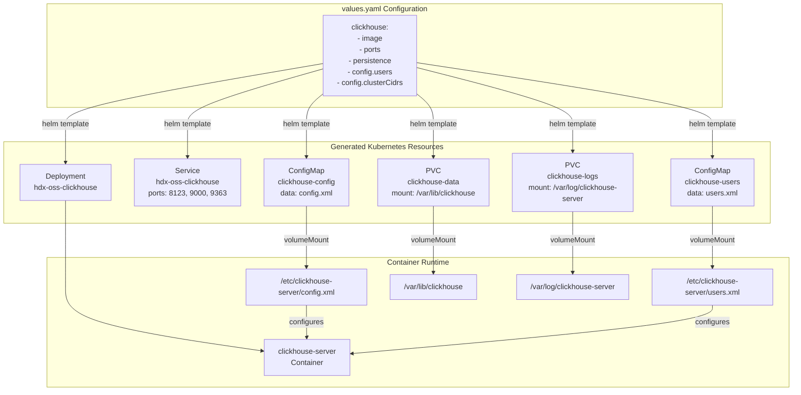
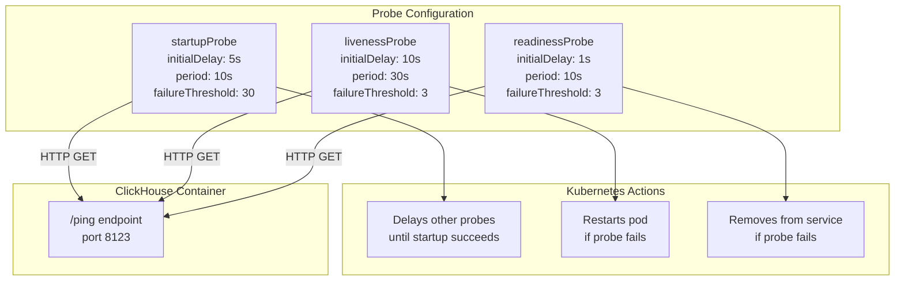
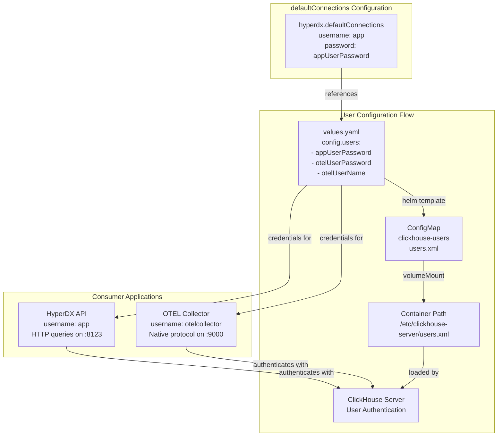
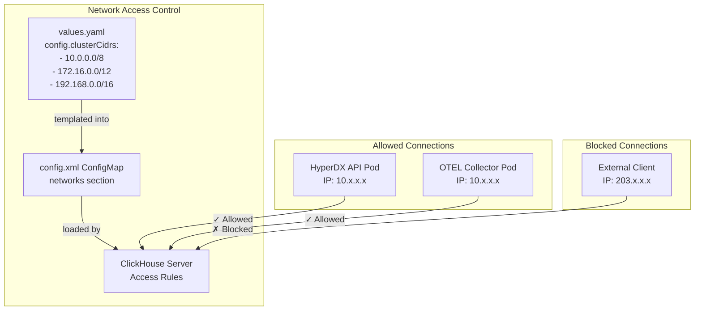

# ClickHouse Configuration

> **Relevant source files**
> * [charts/hdx-oss-v2/templates/clickhouse-deployment.yaml](https://github.com/hyperdxio/helm-charts/blob/845dd482/charts/hdx-oss-v2/templates/clickhouse-deployment.yaml)
> * [charts/hdx-oss-v2/values.yaml](https://github.com/hyperdxio/helm-charts/blob/845dd482/charts/hdx-oss-v2/values.yaml)

This page documents the ClickHouse database configuration options available in the Helm chart's `values.yaml`. ClickHouse serves as the primary storage backend for logs, traces, metrics, and session data in HyperDX.

For detailed information about ClickHouse's deployment architecture, initialization process, and operational characteristics, see [ClickHouse Database](/hyperdxio/helm-charts/5.2-clickhouse-database). For information about connecting HyperDX to an external ClickHouse cluster, see [External ClickHouse](/hyperdxio/helm-charts/4.2-external-clickhouse).

## Overview

The ClickHouse configuration is defined under the `clickhouse` key in [charts/hdx-oss-v2/values.yaml L289-L367](https://github.com/hyperdxio/helm-charts/blob/845dd482/charts/hdx-oss-v2/values.yaml#L289-L367)

 When `clickhouse.enabled` is set to `true` (default), the chart deploys a single-replica ClickHouse instance with two ConfigMaps (`clickhouse-config` and `clickhouse-users`) that configure the database server.



**Sources:** [charts/hdx-oss-v2/values.yaml L289-L367](https://github.com/hyperdxio/helm-charts/blob/845dd482/charts/hdx-oss-v2/values.yaml#L289-L367)

 [charts/hdx-oss-v2/templates/clickhouse-deployment.yaml L1-L217](https://github.com/hyperdxio/helm-charts/blob/845dd482/charts/hdx-oss-v2/templates/clickhouse-deployment.yaml#L1-L217)

## Basic Configuration

### Image and Version

The ClickHouse image is specified at [charts/hdx-oss-v2/values.yaml L290](https://github.com/hyperdxio/helm-charts/blob/845dd482/charts/hdx-oss-v2/values.yaml#L290-L290)

:

```yaml
clickhouse:
  image: "clickhouse/clickhouse-server:25.7-alpine"
```

The deployment uses this image directly without tag overrides. To use a different version or custom image, modify this value.

**Sources:** [charts/hdx-oss-v2/values.yaml L290](https://github.com/hyperdxio/helm-charts/blob/845dd482/charts/hdx-oss-v2/values.yaml#L290-L290)

 [charts/hdx-oss-v2/templates/clickhouse-deployment.yaml L38](https://github.com/hyperdxio/helm-charts/blob/845dd482/charts/hdx-oss-v2/templates/clickhouse-deployment.yaml#L38-L38)

### Port Configuration

ClickHouse exposes three ports, configured at [charts/hdx-oss-v2/values.yaml L291-L292](https://github.com/hyperdxio/helm-charts/blob/845dd482/charts/hdx-oss-v2/values.yaml#L291-L292)

:

| Port | Default | Protocol | Purpose | Configuration Key |
| --- | --- | --- | --- | --- |
| HTTP | 8123 | HTTP | Query interface, health checks | `clickhouse.port` |
| Native | 9000 | TCP | Native ClickHouse protocol (OTEL Collector) | `clickhouse.nativePort` |
| Prometheus | 9363 | HTTP | Metrics endpoint (if enabled) | `clickhouse.prometheus.port` |

The service definition at [charts/hdx-oss-v2/templates/clickhouse-deployment.yaml L138-L149](https://github.com/hyperdxio/helm-charts/blob/845dd482/charts/hdx-oss-v2/templates/clickhouse-deployment.yaml#L138-L149)

 exposes these ports as ClusterIP services.

**Example: Custom Port Configuration**

```yaml
clickhouse:
  port: 8124        # Custom HTTP port
  nativePort: 9001  # Custom native port
  prometheus:
    enabled: true
    port: 9364      # Custom Prometheus port
```

**Sources:** [charts/hdx-oss-v2/values.yaml L291-L292](https://github.com/hyperdxio/helm-charts/blob/845dd482/charts/hdx-oss-v2/values.yaml#L291-L292)

 [charts/hdx-oss-v2/values.yaml L350-L353](https://github.com/hyperdxio/helm-charts/blob/845dd482/charts/hdx-oss-v2/values.yaml#L350-L353)

 [charts/hdx-oss-v2/templates/clickhouse-deployment.yaml L138-L149](https://github.com/hyperdxio/helm-charts/blob/845dd482/charts/hdx-oss-v2/templates/clickhouse-deployment.yaml#L138-L149)

### Termination Grace Period

The termination grace period controls how long Kubernetes waits for ClickHouse to shut down gracefully before force-killing the pod. The default is 90 seconds, configured at [charts/hdx-oss-v2/values.yaml L293](https://github.com/hyperdxio/helm-charts/blob/845dd482/charts/hdx-oss-v2/values.yaml#L293-L293)

The deployment includes a `preStop` lifecycle hook at [charts/hdx-oss-v2/templates/clickhouse-deployment.yaml L50-L60](https://github.com/hyperdxio/helm-charts/blob/845dd482/charts/hdx-oss-v2/templates/clickhouse-deployment.yaml#L50-L60)

 that executes:

* `SYSTEM STOP MERGES` - Stops background merge operations
* `SYSTEM STOP MOVES` - Stops data movement operations
* `SYSTEM FLUSH LOGS` - Flushes in-memory logs to disk
* `sleep 5` - Brief wait for operations to complete

**Sources:** [charts/hdx-oss-v2/values.yaml L293](https://github.com/hyperdxio/helm-charts/blob/845dd482/charts/hdx-oss-v2/values.yaml#L293-L293)

 [charts/hdx-oss-v2/templates/clickhouse-deployment.yaml L23](https://github.com/hyperdxio/helm-charts/blob/845dd482/charts/hdx-oss-v2/templates/clickhouse-deployment.yaml#L23-L23)

 [charts/hdx-oss-v2/templates/clickhouse-deployment.yaml L50-L60](https://github.com/hyperdxio/helm-charts/blob/845dd482/charts/hdx-oss-v2/templates/clickhouse-deployment.yaml#L50-L60)

## Resource Configuration

Resource limits and requests are configured at [charts/hdx-oss-v2/values.yaml L294-L302](https://github.com/hyperdxio/helm-charts/blob/845dd482/charts/hdx-oss-v2/values.yaml#L294-L302)

:

```css
clickhouse:
  resources: {}
    # Example:
    # requests:
    #   memory: "512Mi"
    #   cpu: "500m"
    # limits:
    #   memory: "2Gi"
    #   cpu: "2000m"
```

By default, no resource constraints are applied. For production deployments, resource limits should be configured based on workload characteristics.

**Recommended Production Configuration:**

```yaml
clickhouse:
  resources:
    requests:
      memory: "2Gi"
      cpu: "1000m"
    limits:
      memory: "8Gi"
      cpu: "4000m"
```

The resources specification is applied to the container at [charts/hdx-oss-v2/templates/clickhouse-deployment.yaml L46-L49](https://github.com/hyperdxio/helm-charts/blob/845dd482/charts/hdx-oss-v2/templates/clickhouse-deployment.yaml#L46-L49)

**Sources:** [charts/hdx-oss-v2/values.yaml L294-L302](https://github.com/hyperdxio/helm-charts/blob/845dd482/charts/hdx-oss-v2/values.yaml#L294-L302)

 [charts/hdx-oss-v2/templates/clickhouse-deployment.yaml L46-L49](https://github.com/hyperdxio/helm-charts/blob/845dd482/charts/hdx-oss-v2/templates/clickhouse-deployment.yaml#L46-L49)

## Health Probes

ClickHouse includes three types of health probes that use the `/ping` HTTP endpoint on port 8123:



### Startup Probe

Configured at [charts/hdx-oss-v2/values.yaml L315-L320](https://github.com/hyperdxio/helm-charts/blob/845dd482/charts/hdx-oss-v2/values.yaml#L315-L320)

 and implemented at [charts/hdx-oss-v2/templates/clickhouse-deployment.yaml L81-L90](https://github.com/hyperdxio/helm-charts/blob/845dd482/charts/hdx-oss-v2/templates/clickhouse-deployment.yaml#L81-L90)

 Allows up to 5 minutes (30 failures × 10s period) for ClickHouse to start before other probes begin.

### Liveness Probe

Configured at [charts/hdx-oss-v2/values.yaml L303-L308](https://github.com/hyperdxio/helm-charts/blob/845dd482/charts/hdx-oss-v2/values.yaml#L303-L308)

 and implemented at [charts/hdx-oss-v2/templates/clickhouse-deployment.yaml L61-L70](https://github.com/hyperdxio/helm-charts/blob/845dd482/charts/hdx-oss-v2/templates/clickhouse-deployment.yaml#L61-L70)

 Kubernetes restarts the container if this probe fails 3 consecutive times.

### Readiness Probe

Configured at [charts/hdx-oss-v2/values.yaml L309-L314](https://github.com/hyperdxio/helm-charts/blob/845dd482/charts/hdx-oss-v2/values.yaml#L309-L314)

 and implemented at [charts/hdx-oss-v2/templates/clickhouse-deployment.yaml L71-L80](https://github.com/hyperdxio/helm-charts/blob/845dd482/charts/hdx-oss-v2/templates/clickhouse-deployment.yaml#L71-L80)

 Controls whether the pod receives traffic from the service.

All probes can be disabled by setting `enabled: false` in their respective configuration sections.

**Sources:** [charts/hdx-oss-v2/values.yaml L303-L320](https://github.com/hyperdxio/helm-charts/blob/845dd482/charts/hdx-oss-v2/values.yaml#L303-L320)

 [charts/hdx-oss-v2/templates/clickhouse-deployment.yaml L61-L90](https://github.com/hyperdxio/helm-charts/blob/845dd482/charts/hdx-oss-v2/templates/clickhouse-deployment.yaml#L61-L90)

## Persistence Configuration

ClickHouse requires persistent storage for data and logs. The persistence configuration is defined at [charts/hdx-oss-v2/values.yaml L346-L349](https://github.com/hyperdxio/helm-charts/blob/845dd482/charts/hdx-oss-v2/values.yaml#L346-L349)

:

```yaml
clickhouse:
  persistence:
    enabled: true
    dataSize: 10Gi
    logSize: 5Gi
```

When `persistence.enabled` is `true`, two PersistentVolumeClaims are created:

| PVC Name | Mount Path | Purpose | Size Configuration |
| --- | --- | --- | --- |
| `clickhouse-data` | `/var/lib/clickhouse` | Database files, tables, metadata | `persistence.dataSize` |
| `clickhouse-logs` | `/var/log/clickhouse-server` | ClickHouse server logs | `persistence.logSize` |

The PVC specifications are generated at [charts/hdx-oss-v2/templates/clickhouse-deployment.yaml L175-L216](https://github.com/hyperdxio/helm-charts/blob/845dd482/charts/hdx-oss-v2/templates/clickhouse-deployment.yaml#L175-L216)

 and use the global `storageClassName` if specified ([charts/hdx-oss-v2/values.yaml L10](https://github.com/hyperdxio/helm-charts/blob/845dd482/charts/hdx-oss-v2/values.yaml#L10-L10)

).

**PVC Retention:** If `global.keepPVC` is set to `true` ([charts/hdx-oss-v2/values.yaml L12](https://github.com/hyperdxio/helm-charts/blob/845dd482/charts/hdx-oss-v2/values.yaml#L12-L12)

), the PVCs are annotated with `helm.sh/resource-policy: keep` at [charts/hdx-oss-v2/templates/clickhouse-deployment.yaml L183-L186](https://github.com/hyperdxio/helm-charts/blob/845dd482/charts/hdx-oss-v2/templates/clickhouse-deployment.yaml#L183-L186)

 and [charts/hdx-oss-v2/templates/clickhouse-deployment.yaml L203-L206](https://github.com/hyperdxio/helm-charts/blob/845dd482/charts/hdx-oss-v2/templates/clickhouse-deployment.yaml#L203-L206)

 preserving data across Helm uninstalls.

**Disabling Persistence:**

```yaml
clickhouse:
  persistence:
    enabled: false
```

When disabled, `emptyDir` volumes are used instead, mounted at [charts/hdx-oss-v2/templates/clickhouse-deployment.yaml L109-L122](https://github.com/hyperdxio/helm-charts/blob/845dd482/charts/hdx-oss-v2/templates/clickhouse-deployment.yaml#L109-L122)

 Data is lost when the pod restarts.

**Sources:** [charts/hdx-oss-v2/values.yaml L346-L349](https://github.com/hyperdxio/helm-charts/blob/845dd482/charts/hdx-oss-v2/values.yaml#L346-L349)

 [charts/hdx-oss-v2/templates/clickhouse-deployment.yaml L91-L122](https://github.com/hyperdxio/helm-charts/blob/845dd482/charts/hdx-oss-v2/templates/clickhouse-deployment.yaml#L91-L122)

 [charts/hdx-oss-v2/templates/clickhouse-deployment.yaml L175-L216](https://github.com/hyperdxio/helm-charts/blob/845dd482/charts/hdx-oss-v2/templates/clickhouse-deployment.yaml#L175-L216)

## User Management and Security

ClickHouse user credentials are configured at [charts/hdx-oss-v2/values.yaml L354-L358](https://github.com/hyperdxio/helm-charts/blob/845dd482/charts/hdx-oss-v2/values.yaml#L354-L358)

:

```yaml
clickhouse:
  config:
    users:
      appUserPassword: "hyperdx"
      otelUserPassword: "otelcollectorpass"
      otelUserName: "otelcollector"
```



### User Accounts

Two user accounts are created:

1. **`app` user** (HyperDX API) * Password: `appUserPassword` * Used by the HyperDX API for HTTP queries * Referenced in `hyperdx.defaultConnections` at [charts/hdx-oss-v2/values.yaml L92-L101](https://github.com/hyperdxio/helm-charts/blob/845dd482/charts/hdx-oss-v2/values.yaml#L92-L101) * Connects via HTTP port 8123
2. **`otelcollector` user** (OTEL Collector) * Username: `otelUserName` (default: `otelcollector`) * Password: `otelUserPassword` * Used by the OpenTelemetry Collector for data ingestion * Connects via native TCP port 9000

The `users.xml` ConfigMap is generated at [charts/hdx-oss-v2/templates/clickhouse-deployment.yaml L164-L173](https://github.com/hyperdxio/helm-charts/blob/845dd482/charts/hdx-oss-v2/templates/clickhouse-deployment.yaml#L164-L173)

 using the template file `data/users.xml`, which is populated with these values through Helm's templating engine.

**Security Recommendation:** Change default passwords in production:

```yaml
clickhouse:
  config:
    users:
      appUserPassword: "strong-random-password-1"
      otelUserPassword: "strong-random-password-2"
```

**Sources:** [charts/hdx-oss-v2/values.yaml L354-L358](https://github.com/hyperdxio/helm-charts/blob/845dd482/charts/hdx-oss-v2/values.yaml#L354-L358)

 [charts/hdx-oss-v2/values.yaml L92-L101](https://github.com/hyperdxio/helm-charts/blob/845dd482/charts/hdx-oss-v2/values.yaml#L92-L101)

 [charts/hdx-oss-v2/templates/clickhouse-deployment.yaml L164-L173](https://github.com/hyperdxio/helm-charts/blob/845dd482/charts/hdx-oss-v2/templates/clickhouse-deployment.yaml#L164-L173)

## Network Access Control

ClickHouse implements network-level access control through the `clusterCidrs` configuration at [charts/hdx-oss-v2/values.yaml L359-L366](https://github.com/hyperdxio/helm-charts/blob/845dd482/charts/hdx-oss-v2/values.yaml#L359-L366)

:

```yaml
clickhouse:
  config:
    clusterCidrs:
      - "10.0.0.0/8"         # Most Kubernetes clusters
      - "172.16.0.0/12"      # Some cloud providers and Docker Desktop
      - "192.168.0.0/16"     # OrbStack, Minikube, local development
```

These CIDR blocks are injected into the `config.xml` file to restrict ClickHouse connections to specific network ranges, typically the Kubernetes cluster's pod network.



### Default CIDR Ranges

The default configuration includes three common CIDR ranges to support various Kubernetes distributions:

| CIDR Range | Purpose |
| --- | --- |
| `10.0.0.0/8` | GKE, EKS, AKS, most managed Kubernetes clusters |
| `172.16.0.0/12` | Docker Desktop, some cloud providers |
| `192.168.0.0/16` | OrbStack, Minikube, local development clusters |

### Production Configuration

For production deployments, restrict access to only your cluster's specific CIDR:

```yaml
clickhouse:
  config:
    clusterCidrs:
      - "10.8.0.0/16"  # GKE cluster-specific CIDR
```

To determine your cluster's pod CIDR:

```
kubectl cluster-info dump | grep -m 1 cluster-cidr
```

**Sources:** [charts/hdx-oss-v2/values.yaml L359-L366](https://github.com/hyperdxio/helm-charts/blob/845dd482/charts/hdx-oss-v2/values.yaml#L359-L366)

 [charts/hdx-oss-v2/templates/clickhouse-deployment.yaml L155-L162](https://github.com/hyperdxio/helm-charts/blob/845dd482/charts/hdx-oss-v2/templates/clickhouse-deployment.yaml#L155-L162)

## Prometheus Metrics

ClickHouse can expose Prometheus-compatible metrics, configured at [charts/hdx-oss-v2/values.yaml L350-L353](https://github.com/hyperdxio/helm-charts/blob/845dd482/charts/hdx-oss-v2/values.yaml#L350-L353)

:

```yaml
clickhouse:
  prometheus:
    enabled: true
    port: 9363
    endpoint: "/metrics"
```

When enabled, the ClickHouse service exposes an additional port at [charts/hdx-oss-v2/templates/clickhouse-deployment.yaml L145-L149](https://github.com/hyperdxio/helm-charts/blob/845dd482/charts/hdx-oss-v2/templates/clickhouse-deployment.yaml#L145-L149)

:

```yaml
- port: 9363
  targetPort: 9363
  name: prometheus
```

The OTEL Collector can be configured to scrape these metrics using the `clickhousePrometheusEndpoint` setting at [charts/hdx-oss-v2/values.yaml L447-L450](https://github.com/hyperdxio/helm-charts/blob/845dd482/charts/hdx-oss-v2/values.yaml#L447-L450)

 This allows monitoring ClickHouse performance metrics (queries, merges, disk usage, etc.) through the HyperDX observability stack.

**Disabling Prometheus Metrics:**

```yaml
clickhouse:
  prometheus:
    enabled: false
```

**Sources:** [charts/hdx-oss-v2/values.yaml L350-L353](https://github.com/hyperdxio/helm-charts/blob/845dd482/charts/hdx-oss-v2/values.yaml#L350-L353)

 [charts/hdx-oss-v2/templates/clickhouse-deployment.yaml L145-L149](https://github.com/hyperdxio/helm-charts/blob/845dd482/charts/hdx-oss-v2/templates/clickhouse-deployment.yaml#L145-L149)

## Service Configuration

The ClickHouse Kubernetes service is configured at [charts/hdx-oss-v2/values.yaml L336-L344](https://github.com/hyperdxio/helm-charts/blob/845dd482/charts/hdx-oss-v2/values.yaml#L336-L344)

:

```css
clickhouse:
  service:
    type: ClusterIP
    annotations: {}
      # service.beta.kubernetes.io/aws-load-balancer-internal: "true"
      # cloud.google.com/load-balancer-type: "Internal"
```

The service specification at [charts/hdx-oss-v2/templates/clickhouse-deployment.yaml L124-L152](https://github.com/hyperdxio/helm-charts/blob/845dd482/charts/hdx-oss-v2/templates/clickhouse-deployment.yaml#L124-L152)

 creates a ClusterIP service named `{{ include "hdx-oss.fullname" . }}-clickhouse` that exposes:

* Port 8123 (HTTP)
* Port 9000 (Native)
* Port 9363 (Prometheus, if enabled)

**Service Type:** Defaults to `ClusterIP` for security. ClickHouse should not be directly exposed externally. For external access, use port-forwarding or configure ingress with authentication.

**Service Annotations:** Cloud-specific annotations can be added for internal load balancers or other cloud provider features:

```yaml
clickhouse:
  service:
    type: ClusterIP
    annotations:
      service.beta.kubernetes.io/aws-load-balancer-internal: "true"
```

**Sources:** [charts/hdx-oss-v2/values.yaml L336-L344](https://github.com/hyperdxio/helm-charts/blob/845dd482/charts/hdx-oss-v2/values.yaml#L336-L344)

 [charts/hdx-oss-v2/templates/clickhouse-deployment.yaml L124-L152](https://github.com/hyperdxio/helm-charts/blob/845dd482/charts/hdx-oss-v2/templates/clickhouse-deployment.yaml#L124-L152)

## Node Scheduling

ClickHouse supports node selection and tolerations for controlling pod placement, configured at [charts/hdx-oss-v2/values.yaml L322-L334](https://github.com/hyperdxio/helm-charts/blob/845dd482/charts/hdx-oss-v2/values.yaml#L322-L334)

:

```css
clickhouse:
  nodeSelector: {}
    # kubernetes.io/os: linux
    # node-role.kubernetes.io/worker: "true"
  
  tolerations: []
    # - key: "key1"
    #   operator: "Equal"
    #   value: "value1"
    #   effect: "NoSchedule"
```

These values are applied to the pod spec at [charts/hdx-oss-v2/templates/clickhouse-deployment.yaml L24-L31](https://github.com/hyperdxio/helm-charts/blob/845dd482/charts/hdx-oss-v2/templates/clickhouse-deployment.yaml#L24-L31)

**Example: Scheduling ClickHouse on Specific Nodes**

```yaml
clickhouse:
  nodeSelector:
    workload-type: database
    disk-type: ssd
  
  tolerations:
    - key: "dedicated"
      operator: "Equal"
      value: "database"
      effect: "NoSchedule"
```

This configuration ensures ClickHouse runs on nodes labeled for database workloads with SSD storage and tolerates dedicated database node taints.

**Sources:** [charts/hdx-oss-v2/values.yaml L322-L334](https://github.com/hyperdxio/helm-charts/blob/845dd482/charts/hdx-oss-v2/values.yaml#L322-L334)

 [charts/hdx-oss-v2/templates/clickhouse-deployment.yaml L24-L31](https://github.com/hyperdxio/helm-charts/blob/845dd482/charts/hdx-oss-v2/templates/clickhouse-deployment.yaml#L24-L31)

## Configuration Files

ClickHouse uses two XML configuration files mounted from ConfigMaps:

### config.xml

Generated at [charts/hdx-oss-v2/templates/clickhouse-deployment.yaml L154-L162](https://github.com/hyperdxio/helm-charts/blob/845dd482/charts/hdx-oss-v2/templates/clickhouse-deployment.yaml#L154-L162)

 from `data/config.xml`, mounted at `/etc/clickhouse-server/config.xml` via [charts/hdx-oss-v2/templates/clickhouse-deployment.yaml L92-L94](https://github.com/hyperdxio/helm-charts/blob/845dd482/charts/hdx-oss-v2/templates/clickhouse-deployment.yaml#L92-L94)

Contains:

* Network listen addresses
* Port configurations
* Cluster CIDR restrictions
* Prometheus metrics settings
* Logging configuration

### users.xml

Generated at [charts/hdx-oss-v2/templates/clickhouse-deployment.yaml L164-L173](https://github.com/hyperdxio/helm-charts/blob/845dd482/charts/hdx-oss-v2/templates/clickhouse-deployment.yaml#L164-L173)

 from `data/users.xml`, mounted at `/etc/clickhouse-server/users.xml` via [charts/hdx-oss-v2/templates/clickhouse-deployment.yaml L95-L97](https://github.com/hyperdxio/helm-charts/blob/845dd482/charts/hdx-oss-v2/templates/clickhouse-deployment.yaml#L95-L97)

Contains:

* User account definitions
* Password hashes
* Access permissions
* Query restrictions

Both files are templated using Helm's `tpl` function, allowing values.yaml settings to be interpolated into the configuration files.

**Sources:** [charts/hdx-oss-v2/templates/clickhouse-deployment.yaml L92-L97](https://github.com/hyperdxio/helm-charts/blob/845dd482/charts/hdx-oss-v2/templates/clickhouse-deployment.yaml#L92-L97)

 [charts/hdx-oss-v2/templates/clickhouse-deployment.yaml L154-L173](https://github.com/hyperdxio/helm-charts/blob/845dd482/charts/hdx-oss-v2/templates/clickhouse-deployment.yaml#L154-L173)

## Common Configuration Patterns

### Minimal Development Configuration

```css
clickhouse:
  enabled: true
  persistence:
    enabled: false  # Use emptyDir for quick testing
  resources: {}     # No resource limits
  config:
    clusterCidrs:
      - "10.0.0.0/8"
      - "172.16.0.0/12"
      - "192.168.0.0/16"
```

### Production Configuration

```yaml
clickhouse:
  enabled: true
  image: "clickhouse/clickhouse-server:25.7-alpine"
  terminationGracePeriodSeconds: 120
  
  persistence:
    enabled: true
    dataSize: 100Gi
    logSize: 20Gi
  
  resources:
    requests:
      memory: "4Gi"
      cpu: "2000m"
    limits:
      memory: "16Gi"
      cpu: "8000m"
  
  config:
    users:
      appUserPassword: "<strong-random-password>"
      otelUserPassword: "<strong-random-password>"
    clusterCidrs:
      - "10.8.0.0/16"  # Specific cluster CIDR
  
  prometheus:
    enabled: true
  
  nodeSelector:
    workload-type: database
    disk-type: ssd
```

### High-Availability Configuration (External ClickHouse)

For production environments requiring high availability, disable the built-in ClickHouse and connect to an external cluster:

```css
clickhouse:
  enabled: false  # Disable built-in ClickHouse

hyperdx:
  defaultConnections: |
    [
      {
        "name": "Production ClickHouse Cluster",
        "host": "https://clickhouse-cluster.prod.internal",
        "port": 8123,
        "username": "app",
        "password": "<secret-password>"
      }
    ]
```

See [External ClickHouse](/hyperdxio/helm-charts/4.2-external-clickhouse) for detailed configuration.

**Sources:** [charts/hdx-oss-v2/values.yaml L289-L367](https://github.com/hyperdxio/helm-charts/blob/845dd482/charts/hdx-oss-v2/values.yaml#L289-L367)

 [charts/hdx-oss-v2/values.yaml L92-L101](https://github.com/hyperdxio/helm-charts/blob/845dd482/charts/hdx-oss-v2/values.yaml#L92-L101)

## Configuration Reference Table

| Configuration Key | Type | Default | Description |
| --- | --- | --- | --- |
| `clickhouse.enabled` | boolean | `true` | Enable/disable ClickHouse deployment |
| `clickhouse.image` | string | `clickhouse/clickhouse-server:25.7-alpine` | ClickHouse Docker image |
| `clickhouse.port` | integer | `8123` | HTTP port for queries |
| `clickhouse.nativePort` | integer | `9000` | Native TCP protocol port |
| `clickhouse.terminationGracePeriodSeconds` | integer | `90` | Pod termination grace period |
| `clickhouse.resources` | object | `{}` | CPU/memory limits and requests |
| `clickhouse.persistence.enabled` | boolean | `true` | Enable persistent storage |
| `clickhouse.persistence.dataSize` | string | `10Gi` | PVC size for data volume |
| `clickhouse.persistence.logSize` | string | `5Gi` | PVC size for logs volume |
| `clickhouse.config.users.appUserPassword` | string | `hyperdx` | Password for `app` user |
| `clickhouse.config.users.otelUserPassword` | string | `otelcollectorpass` | Password for OTEL user |
| `clickhouse.config.users.otelUserName` | string | `otelcollector` | Username for OTEL user |
| `clickhouse.config.clusterCidrs` | array | `[10.0.0.0/8, ...]` | Allowed network CIDR ranges |
| `clickhouse.prometheus.enabled` | boolean | `true` | Enable Prometheus metrics endpoint |
| `clickhouse.prometheus.port` | integer | `9363` | Prometheus metrics port |
| `clickhouse.service.type` | string | `ClusterIP` | Kubernetes service type |
| `clickhouse.nodeSelector` | object | `{}` | Node selection labels |
| `clickhouse.tolerations` | array | `[]` | Pod tolerations |
| `clickhouse.livenessProbe.enabled` | boolean | `true` | Enable liveness probe |
| `clickhouse.readinessProbe.enabled` | boolean | `true` | Enable readiness probe |
| `clickhouse.startupProbe.enabled` | boolean | `true` | Enable startup probe |

**Sources:** [charts/hdx-oss-v2/values.yaml L289-L367](https://github.com/hyperdxio/helm-charts/blob/845dd482/charts/hdx-oss-v2/values.yaml#L289-L367)