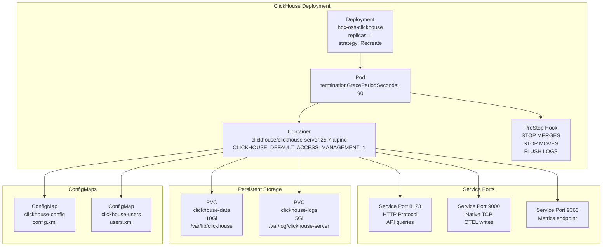
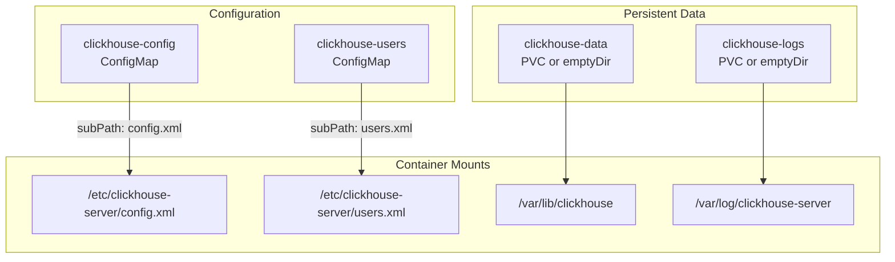
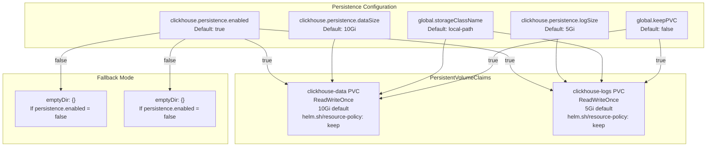
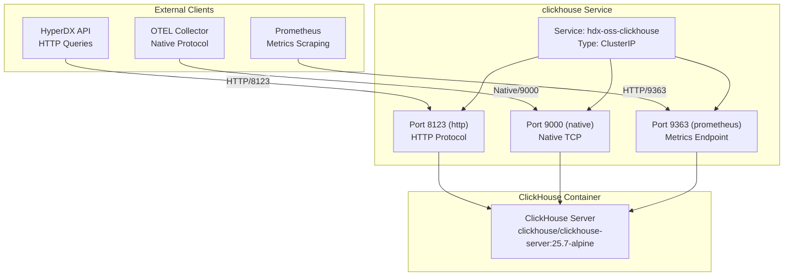
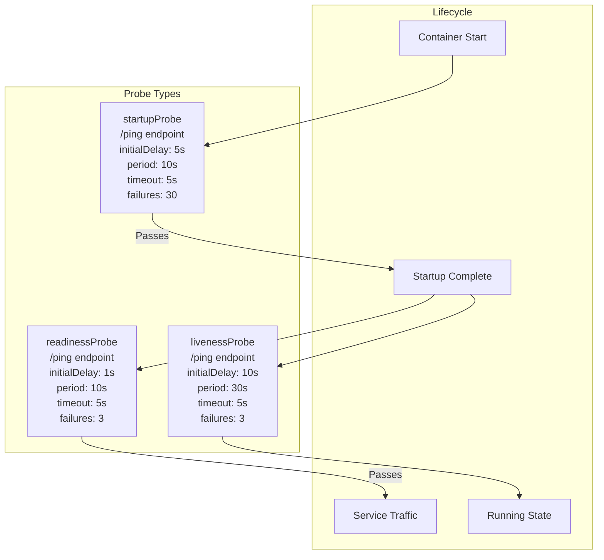
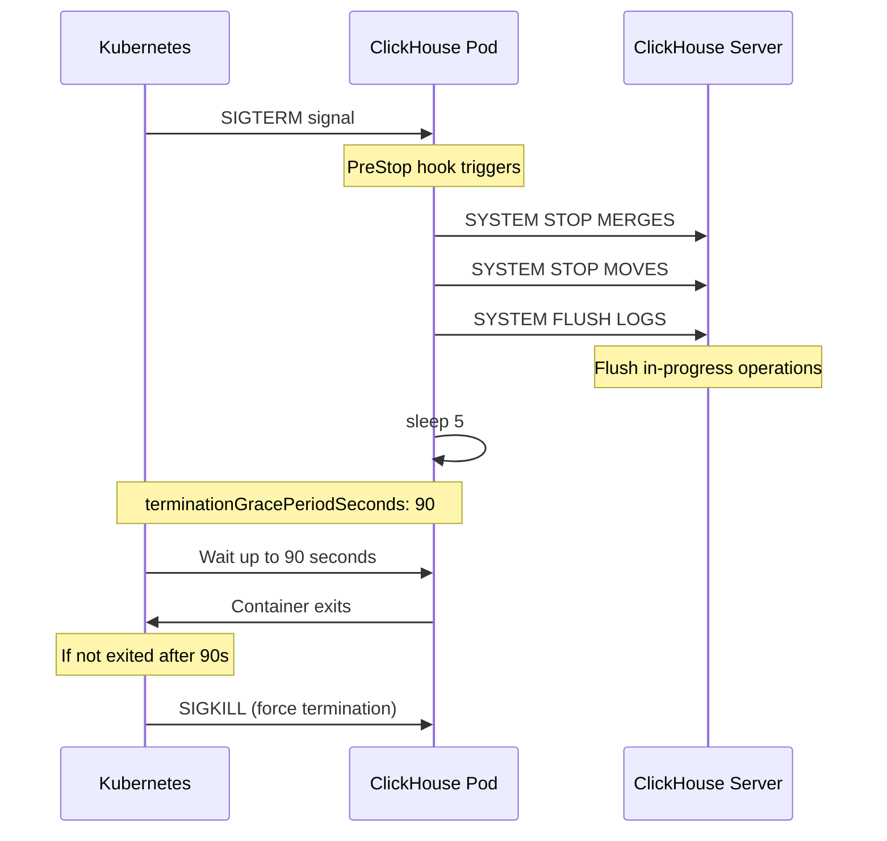
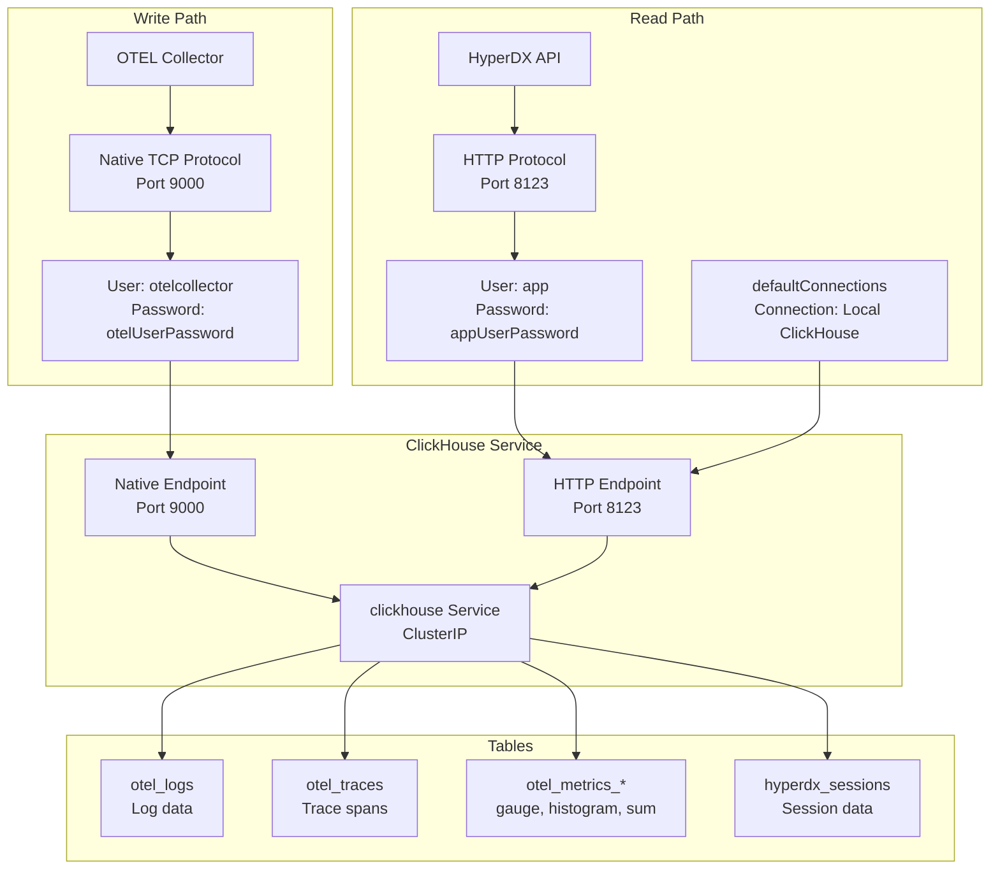

# ClickHouse Database

> **Relevant source files**
> * [CHANGELOG.md](https://github.com/hyperdxio/helm-charts/blob/845dd482/CHANGELOG.md)
> * [charts/hdx-oss-v2/templates/clickhouse-deployment.yaml](https://github.com/hyperdxio/helm-charts/blob/845dd482/charts/hdx-oss-v2/templates/clickhouse-deployment.yaml)
> * [charts/hdx-oss-v2/values.yaml](https://github.com/hyperdxio/helm-charts/blob/845dd482/charts/hdx-oss-v2/values.yaml)

## Purpose and Scope

This document covers the ClickHouse database deployment within the HyperDX Helm chart. ClickHouse serves as the primary storage backend for all telemetry data including logs, traces, metrics, and session data. It stores data in the `otel_logs`, `otel_traces`, `otel_metrics_*`, and `hyperdx_sessions` tables.

For information about configuring ClickHouse connections and querying, see [Data Sources and Connections](/hyperdxio/helm-charts/6.2-data-sources-and-connections). For information about external ClickHouse deployments, see [External ClickHouse](/hyperdxio/helm-charts/4.2-external-clickhouse). For general configuration reference, see [ClickHouse Configuration](/hyperdxio/helm-charts/3.3-clickhouse-configuration).

**Sources:** [charts/hdx-oss-v2/values.yaml L289-L367](https://github.com/hyperdxio/helm-charts/blob/845dd482/charts/hdx-oss-v2/values.yaml#L289-L367)

 High-level architecture diagrams

---

## Deployment Architecture

ClickHouse is deployed as a Kubernetes Deployment with a single replica and `Recreate` strategy to ensure data consistency during updates. The deployment cannot be enabled/disabled via the `clickhouse.enabled` value.

### Component Structure



**Sources:** [charts/hdx-oss-v2/templates/clickhouse-deployment.yaml L1-L123](https://github.com/hyperdxio/helm-charts/blob/845dd482/charts/hdx-oss-v2/templates/clickhouse-deployment.yaml#L1-L123)

 [charts/hdx-oss-v2/values.yaml L289-L321](https://github.com/hyperdxio/helm-charts/blob/845dd482/charts/hdx-oss-v2/values.yaml#L289-L321)

### Container Configuration

The ClickHouse container is configured with the following settings:

| Setting | Default Value | Configuration Path |
| --- | --- | --- |
| Image | `clickhouse/clickhouse-server:25.7-alpine` | `clickhouse.image` |
| Pull Policy | `IfNotPresent` | Hard-coded |
| HTTP Port | 8123 | `clickhouse.port` |
| Native Port | 9000 | `clickhouse.nativePort` |
| Prometheus Port | 9363 | `clickhouse.prometheus.port` |
| Termination Grace Period | 90 seconds | `clickhouse.terminationGracePeriodSeconds` |

The container sets the environment variable `CLICKHOUSE_DEFAULT_ACCESS_MANAGEMENT=1` to enable role-based access control.

**Sources:** [charts/hdx-oss-v2/templates/clickhouse-deployment.yaml L36-L49](https://github.com/hyperdxio/helm-charts/blob/845dd482/charts/hdx-oss-v2/templates/clickhouse-deployment.yaml#L36-L49)

 [charts/hdx-oss-v2/values.yaml L290-L293](https://github.com/hyperdxio/helm-charts/blob/845dd482/charts/hdx-oss-v2/values.yaml#L290-L293)

### Volume Mounts

The deployment mounts the following volumes:



**Sources:** [charts/hdx-oss-v2/templates/clickhouse-deployment.yaml L91-L122](https://github.com/hyperdxio/helm-charts/blob/845dd482/charts/hdx-oss-v2/templates/clickhouse-deployment.yaml#L91-L122)

---

## Configuration Files

ClickHouse configuration is managed through two ConfigMaps that are mounted into the container at startup.

### config.xml ConfigMap

The `clickhouse-config` ConfigMap contains the main server configuration file. The template renders the file from `data/config.xml` with Helm template processing:

```yaml
apiVersion: v1
kind: ConfigMap
metadata:
  name: {{ include "hdx-oss.fullname" . }}-clickhouse-config
data:
  config.xml: |-
    {{- tpl (.Files.Get "data/config.xml") . | nindent 4 }}
```

This ConfigMap is mounted at `/etc/clickhouse-server/config.xml` using a `subPath` mount to avoid overwriting the entire directory.

**Sources:** [charts/hdx-oss-v2/templates/clickhouse-deployment.yaml L154-L163](https://github.com/hyperdxio/helm-charts/blob/845dd482/charts/hdx-oss-v2/templates/clickhouse-deployment.yaml#L154-L163)

 [charts/hdx-oss-v2/templates/clickhouse-deployment.yaml L92-L94](https://github.com/hyperdxio/helm-charts/blob/845dd482/charts/hdx-oss-v2/templates/clickhouse-deployment.yaml#L92-L94)

### users.xml ConfigMap

The `clickhouse-users` ConfigMap contains user authentication and access control configuration. The template renders the file from `data/users.xml`:

```yaml
apiVersion: v1
kind: ConfigMap
metadata:
  name: {{ include "hdx-oss.fullname" . }}-clickhouse-users
data:
  users.xml: |-
    {{- tpl (.Files.Get "data/users.xml") . | nindent 4 }}
```

The configuration defines three users:

| User | Purpose | Password Configuration |
| --- | --- | --- |
| `default` | Default administrative user | Hard-coded |
| `app` | HyperDX API queries | `clickhouse.config.users.appUserPassword` (default: "hyperdx") |
| `otelcollector` | OTEL Collector writes | `clickhouse.config.users.otelUserPassword` (default: "otelcollectorpass") |

**Sources:** [charts/hdx-oss-v2/templates/clickhouse-deployment.yaml L165-L173](https://github.com/hyperdxio/helm-charts/blob/845dd482/charts/hdx-oss-v2/templates/clickhouse-deployment.yaml#L165-L173)

 [charts/hdx-oss-v2/values.yaml L354-L358](https://github.com/hyperdxio/helm-charts/blob/845dd482/charts/hdx-oss-v2/values.yaml#L354-L358)

---

## Persistent Storage

ClickHouse requires persistent storage for database data and logs. The chart creates two separate PersistentVolumeClaims when `clickhouse.persistence.enabled` is `true` (default).

### Storage Architecture



**Sources:** [charts/hdx-oss-v2/values.yaml L346-L349](https://github.com/hyperdxio/helm-charts/blob/845dd482/charts/hdx-oss-v2/values.yaml#L346-L349)

 [charts/hdx-oss-v2/values.yaml L10-L12](https://github.com/hyperdxio/helm-charts/blob/845dd482/charts/hdx-oss-v2/values.yaml#L10-L12)

 [charts/hdx-oss-v2/templates/clickhouse-deployment.yaml L175-L216](https://github.com/hyperdxio/helm-charts/blob/845dd482/charts/hdx-oss-v2/templates/clickhouse-deployment.yaml#L175-L216)

### Data PVC

The `clickhouse-data` PVC stores all database tables and data:

* **Mount Path:** `/var/lib/clickhouse`
* **Default Size:** 10Gi
* **Access Mode:** ReadWriteOnce
* **Retention:** Configurable via `global.keepPVC` annotation

When `global.keepPVC` is `true`, the PVC is annotated with `helm.sh/resource-policy: keep`, preventing deletion during Helm uninstall.

**Sources:** [charts/hdx-oss-v2/templates/clickhouse-deployment.yaml L177-L196](https://github.com/hyperdxio/helm-charts/blob/845dd482/charts/hdx-oss-v2/templates/clickhouse-deployment.yaml#L177-L196)

 [charts/hdx-oss-v2/templates/clickhouse-deployment.yaml L98-L99](https://github.com/hyperdxio/helm-charts/blob/845dd482/charts/hdx-oss-v2/templates/clickhouse-deployment.yaml#L98-L99)

### Logs PVC

The `clickhouse-logs` PVC stores server logs:

* **Mount Path:** `/var/log/clickhouse-server`
* **Default Size:** 5Gi
* **Access Mode:** ReadWriteOnce
* **Retention:** Configurable via `global.keepPVC` annotation

**Sources:** [charts/hdx-oss-v2/templates/clickhouse-deployment.yaml L197-L216](https://github.com/hyperdxio/helm-charts/blob/845dd482/charts/hdx-oss-v2/templates/clickhouse-deployment.yaml#L197-L216)

 [charts/hdx-oss-v2/templates/clickhouse-deployment.yaml L100-L101](https://github.com/hyperdxio/helm-charts/blob/845dd482/charts/hdx-oss-v2/templates/clickhouse-deployment.yaml#L100-L101)

### emptyDir Fallback

When `clickhouse.persistence.enabled` is `false`, both volumes use `emptyDir: {}`, which means data is stored on the node's filesystem and will be lost when the pod is deleted or rescheduled.

**Sources:** [charts/hdx-oss-v2/templates/clickhouse-deployment.yaml L109-L122](https://github.com/hyperdxio/helm-charts/blob/845dd482/charts/hdx-oss-v2/templates/clickhouse-deployment.yaml#L109-L122)

---

## Network Architecture and Service Configuration

ClickHouse exposes multiple ports through a Kubernetes ClusterIP Service for different types of access.

### Service Port Mapping



**Sources:** [charts/hdx-oss-v2/templates/clickhouse-deployment.yaml L124-L152](https://github.com/hyperdxio/helm-charts/blob/845dd482/charts/hdx-oss-v2/templates/clickhouse-deployment.yaml#L124-L152)

 [charts/hdx-oss-v2/values.yaml L289-L293](https://github.com/hyperdxio/helm-charts/blob/845dd482/charts/hdx-oss-v2/values.yaml#L289-L293)

 [charts/hdx-oss-v2/values.yaml L350-L353](https://github.com/hyperdxio/helm-charts/blob/845dd482/charts/hdx-oss-v2/values.yaml#L350-L353)

### Service Configuration

The ClickHouse service is defined with the following characteristics:

| Property | Default Value | Configuration Path |
| --- | --- | --- |
| Type | `ClusterIP` | `clickhouse.service.type` |
| HTTP Port | 8123 | `clickhouse.port` |
| Native Port | 9000 | `clickhouse.nativePort` |
| Prometheus Port | 9363 (conditional) | `clickhouse.prometheus.port` |
| Annotations | `{}` | `clickhouse.service.annotations` |

The service type defaults to `ClusterIP` for security. External access should be configured through Ingress with proper TLS and authentication rather than exposing the service directly.

**Sources:** [charts/hdx-oss-v2/templates/clickhouse-deployment.yaml L124-L152](https://github.com/hyperdxio/helm-charts/blob/845dd482/charts/hdx-oss-v2/templates/clickhouse-deployment.yaml#L124-L152)

 [charts/hdx-oss-v2/values.yaml L336-L344](https://github.com/hyperdxio/helm-charts/blob/845dd482/charts/hdx-oss-v2/values.yaml#L336-L344)

### Network Access Control

ClickHouse implements network-based access control via the `clusterCidrs` configuration. This restricts connections to specific IP ranges:

```yaml
clickhouse:
  config:
    clusterCidrs:
      - "10.0.0.0/8"        # Most Kubernetes clusters (GKE, EKS, AKS)
      - "172.16.0.0/12"     # Some cloud providers and Docker Desktop
      - "192.168.0.0/16"    # OrbStack, Minikube, local development
```

**Production Recommendation:** Remove development CIDRs and specify only your cluster's specific CIDR range to restrict access to intra-cluster communication only.

**Sources:** [charts/hdx-oss-v2/values.yaml L359-L366](https://github.com/hyperdxio/helm-charts/blob/845dd482/charts/hdx-oss-v2/values.yaml#L359-L366)

---

## Health Monitoring

ClickHouse includes three types of health probes to ensure availability and proper startup sequencing.

### Health Probe Configuration



**Sources:** [charts/hdx-oss-v2/templates/clickhouse-deployment.yaml L61-L90](https://github.com/hyperdxio/helm-charts/blob/845dd482/charts/hdx-oss-v2/templates/clickhouse-deployment.yaml#L61-L90)

 [charts/hdx-oss-v2/values.yaml L303-L320](https://github.com/hyperdxio/helm-charts/blob/845dd482/charts/hdx-oss-v2/values.yaml#L303-L320)

### Startup Probe

The startup probe allows ClickHouse up to 5 minutes (30 failures × 10s period) to complete initialization before other probes take effect:

* **Enabled:** `clickhouse.startupProbe.enabled` (default: `true`)
* **Endpoint:** HTTP GET `/ping` on port 8123
* **Initial Delay:** 5 seconds
* **Period:** 10 seconds
* **Timeout:** 5 seconds
* **Failure Threshold:** 30

This is especially important after upgrades when ClickHouse may need to perform schema migrations.

**Sources:** [charts/hdx-oss-v2/templates/clickhouse-deployment.yaml L81-L90](https://github.com/hyperdxio/helm-charts/blob/845dd482/charts/hdx-oss-v2/templates/clickhouse-deployment.yaml#L81-L90)

 [charts/hdx-oss-v2/values.yaml L315-L320](https://github.com/hyperdxio/helm-charts/blob/845dd482/charts/hdx-oss-v2/values.yaml#L315-L320)

### Liveness Probe

The liveness probe restarts the container if ClickHouse becomes unresponsive:

* **Enabled:** `clickhouse.livenessProbe.enabled` (default: `true`)
* **Endpoint:** HTTP GET `/ping` on port 8123
* **Initial Delay:** 10 seconds
* **Period:** 30 seconds
* **Timeout:** 5 seconds
* **Failure Threshold:** 3

**Sources:** [charts/hdx-oss-v2/templates/clickhouse-deployment.yaml L61-L70](https://github.com/hyperdxio/helm-charts/blob/845dd482/charts/hdx-oss-v2/templates/clickhouse-deployment.yaml#L61-L70)

 [charts/hdx-oss-v2/values.yaml L303-L308](https://github.com/hyperdxio/helm-charts/blob/845dd482/charts/hdx-oss-v2/values.yaml#L303-L308)

### Readiness Probe

The readiness probe controls when the pod receives traffic from the Service:

* **Enabled:** `clickhouse.readinessProbe.enabled` (default: `true`)
* **Endpoint:** HTTP GET `/ping` on port 8123
* **Initial Delay:** 1 second
* **Period:** 10 seconds
* **Timeout:** 5 seconds
* **Failure Threshold:** 3

**Sources:** [charts/hdx-oss-v2/templates/clickhouse-deployment.yaml L71-L80](https://github.com/hyperdxio/helm-charts/blob/845dd482/charts/hdx-oss-v2/templates/clickhouse-deployment.yaml#L71-L80)

 [charts/hdx-oss-v2/values.yaml L309-L314](https://github.com/hyperdxio/helm-charts/blob/845dd482/charts/hdx-oss-v2/values.yaml#L309-L314)

### Prometheus Metrics

When enabled, ClickHouse exposes Prometheus metrics on port 9363 at the `/metrics` endpoint:

```yaml
clickhouse:
  prometheus:
    enabled: true     # Default
    port: 9363
    endpoint: "/metrics"
```

The metrics port is automatically added to the Service when `clickhouse.prometheus.enabled` is `true`.

**Sources:** [charts/hdx-oss-v2/values.yaml L350-L353](https://github.com/hyperdxio/helm-charts/blob/845dd482/charts/hdx-oss-v2/values.yaml#L350-L353)

 [charts/hdx-oss-v2/templates/clickhouse-deployment.yaml L145-L149](https://github.com/hyperdxio/helm-charts/blob/845dd482/charts/hdx-oss-v2/templates/clickhouse-deployment.yaml#L145-L149)

---

## Lifecycle Management

ClickHouse implements a graceful shutdown process to ensure data consistency during pod termination.

### Graceful Shutdown Process



**Sources:** [charts/hdx-oss-v2/templates/clickhouse-deployment.yaml L50-L61](https://github.com/hyperdxio/helm-charts/blob/845dd482/charts/hdx-oss-v2/templates/clickhouse-deployment.yaml#L50-L61)

 [charts/hdx-oss-v2/templates/clickhouse-deployment.yaml L23](https://github.com/hyperdxio/helm-charts/blob/845dd482/charts/hdx-oss-v2/templates/clickhouse-deployment.yaml#L23-L23)

### PreStop Hook

The PreStop hook executes the following commands before the container is terminated:

```
clickhouse-client --query "SYSTEM STOP MERGES" || true
clickhouse-client --query "SYSTEM STOP MOVES" || true
clickhouse-client --query "SYSTEM FLUSH LOGS" || true
sleep 5
```

These commands ensure:

1. Background merge operations are stopped
2. Data moves between storage tiers are halted
3. All logs are flushed to disk
4. A 5-second grace period for operations to complete

The `|| true` suffix ensures the hook doesn't fail if ClickHouse is already stopped.

**Sources:** [charts/hdx-oss-v2/templates/clickhouse-deployment.yaml L50-L61](https://github.com/hyperdxio/helm-charts/blob/845dd482/charts/hdx-oss-v2/templates/clickhouse-deployment.yaml#L50-L61)

### Termination Grace Period

The pod is configured with `terminationGracePeriodSeconds: 90`, giving ClickHouse up to 90 seconds to shut down gracefully after the PreStop hook completes. This is important for:

* Completing in-flight queries
* Flushing buffers to disk
* Closing network connections properly

**Sources:** [charts/hdx-oss-v2/templates/clickhouse-deployment.yaml L23](https://github.com/hyperdxio/helm-charts/blob/845dd482/charts/hdx-oss-v2/templates/clickhouse-deployment.yaml#L23-L23)

 [charts/hdx-oss-v2/values.yaml L293](https://github.com/hyperdxio/helm-charts/blob/845dd482/charts/hdx-oss-v2/values.yaml#L293-L293)

---

## Performance Tuning and Resource Management

ClickHouse performance can be tuned through resource allocation and configuration.

### Resource Allocation

CPU and memory limits/requests can be configured via `clickhouse.resources`:

```yaml
clickhouse:
  resources:
    requests:
      memory: "512Mi"
      cpu: "500m"
    limits:
      memory: "2Gi"
      cpu: "2000m"
```

When specified, these values are applied to the container's resource configuration:

```yaml
resources:
  {{- toYaml .Values.clickhouse.resources | nindent 12 }}
```

**Default:** No resource limits are set by default (empty `{}`), allowing ClickHouse to use available node resources.

**Sources:** [charts/hdx-oss-v2/values.yaml L294-L302](https://github.com/hyperdxio/helm-charts/blob/845dd482/charts/hdx-oss-v2/values.yaml#L294-L302)

 [charts/hdx-oss-v2/templates/clickhouse-deployment.yaml L46-L49](https://github.com/hyperdxio/helm-charts/blob/845dd482/charts/hdx-oss-v2/templates/clickhouse-deployment.yaml#L46-L49)

### Node Scheduling

ClickHouse pods can be scheduled to specific nodes using `nodeSelector` and `tolerations`:

```yaml
clickhouse:
  nodeSelector:
    kubernetes.io/os: linux
    node-role.kubernetes.io/worker: "true"
  tolerations:
    - key: "database"
      operator: "Equal"
      value: "clickhouse"
      effect: "NoSchedule"
```

**Sources:** [charts/hdx-oss-v2/values.yaml L322-L334](https://github.com/hyperdxio/helm-charts/blob/845dd482/charts/hdx-oss-v2/values.yaml#L322-L334)

 [charts/hdx-oss-v2/templates/clickhouse-deployment.yaml L24-L31](https://github.com/hyperdxio/helm-charts/blob/845dd482/charts/hdx-oss-v2/templates/clickhouse-deployment.yaml#L24-L31)

### Deployment Strategy

The deployment uses `strategy.type: Recreate` which ensures:

* The old pod is terminated before a new one is created
* No two ClickHouse instances run simultaneously
* Data consistency is maintained during updates
* Zero-downtime updates are not possible (brief outage expected)

This is required because ClickHouse does not support running multiple instances with shared storage in this configuration.

**Sources:** [charts/hdx-oss-v2/templates/clickhouse-deployment.yaml L11-L12](https://github.com/hyperdxio/helm-charts/blob/845dd482/charts/hdx-oss-v2/templates/clickhouse-deployment.yaml#L11-L12)

---

## Safe Upgrade Process

Starting with chart version 0.8.0, ClickHouse includes a safe upgrade process to minimize data loss during version updates.

### Upgrade Workflow

The safe upgrade process was introduced when ClickHouse was bumped to version 25.7. The upgrade process leverages:

1. **PreStop Hook:** Stops merges, moves, and flushes logs before termination
2. **Extended Grace Period:** 90-second termination grace period allows operations to complete
3. **Startup Probe:** Extended startup probe (30 failures × 10s = 5 minutes) accommodates schema migrations
4. **Recreate Strategy:** Ensures old instance fully terminates before new one starts

**Sources:** [CHANGELOG.md L32-L34](https://github.com/hyperdxio/helm-charts/blob/845dd482/CHANGELOG.md#L32-L34)

### Upgrade Considerations

| Consideration | Recommendation |
| --- | --- |
| Downtime | Brief downtime is expected due to Recreate strategy |
| Data Persistence | Ensure `clickhouse.persistence.enabled: true` |
| Resource Limits | Monitor and adjust based on upgrade requirements |
| Backup | Recommended before major version upgrades |
| Schema Changes | Startup probe allows up to 5 minutes for migrations |

**Sources:** [CHANGELOG.md L32-L34](https://github.com/hyperdxio/helm-charts/blob/845dd482/CHANGELOG.md#L32-L34)

 [charts/hdx-oss-v2/templates/clickhouse-deployment.yaml L11-L12](https://github.com/hyperdxio/helm-charts/blob/845dd482/charts/hdx-oss-v2/templates/clickhouse-deployment.yaml#L11-L12)

 [charts/hdx-oss-v2/templates/clickhouse-deployment.yaml L81-L90](https://github.com/hyperdxio/helm-charts/blob/845dd482/charts/hdx-oss-v2/templates/clickhouse-deployment.yaml#L81-L90)

---

## Integration Points

ClickHouse integrates with other HyperDX components through well-defined connection patterns.

### Connection Architecture



**Sources:** [charts/hdx-oss-v2/values.yaml L92-L101](https://github.com/hyperdxio/helm-charts/blob/845dd482/charts/hdx-oss-v2/values.yaml#L92-L101)

 [charts/hdx-oss-v2/values.yaml L104-L202](https://github.com/hyperdxio/helm-charts/blob/845dd482/charts/hdx-oss-v2/values.yaml#L104-L202)

 [charts/hdx-oss-v2/values.yaml L354-L358](https://github.com/hyperdxio/helm-charts/blob/845dd482/charts/hdx-oss-v2/values.yaml#L354-L358)

### OTEL Collector Integration

The OTEL Collector writes telemetry data to ClickHouse using the native TCP protocol (port 9000):

* **Connection:** `tcp://{{ include "hdx-oss.fullname" . }}-clickhouse:9000`
* **Username:** Configured via `clickhouse.config.users.otelUserName` (default: "otelcollector")
* **Password:** Configured via `clickhouse.config.users.otelUserPassword` (default: "otelcollectorpass")
* **Database:** Configured via `otel.clickhouseDatabase` (default: "default")

The native protocol is used because it provides better performance for bulk inserts compared to HTTP.

**Sources:** [charts/hdx-oss-v2/values.yaml L354-L358](https://github.com/hyperdxio/helm-charts/blob/845dd482/charts/hdx-oss-v2/values.yaml#L354-L358)

 [charts/hdx-oss-v2/values.yaml L441-L452](https://github.com/hyperdxio/helm-charts/blob/845dd482/charts/hdx-oss-v2/values.yaml#L441-L452)

### HyperDX API Integration

The HyperDX API queries ClickHouse using HTTP protocol (port 8123) via the `defaultConnections` configuration:

```yaml
defaultConnections: |
  [
    {
      "name": "Local ClickHouse",
      "host": "http://{{ include "hdx-oss.fullname" . }}-clickhouse:8123",
      "port": 8123,
      "username": "app",
      "password": "{{ .Values.clickhouse.config.users.appUserPassword }}"
    }
  ]
```

This connection is referenced by name ("Local ClickHouse") in the `defaultSources` configuration for all data source types (logs, traces, metrics, sessions).

**Sources:** [charts/hdx-oss-v2/values.yaml L92-L101](https://github.com/hyperdxio/helm-charts/blob/845dd482/charts/hdx-oss-v2/values.yaml#L92-L101)

 [charts/hdx-oss-v2/values.yaml L354-L358](https://github.com/hyperdxio/helm-charts/blob/845dd482/charts/hdx-oss-v2/values.yaml#L354-L358)

### Data Sources Configuration

Each telemetry data type has a corresponding source definition that specifies the ClickHouse table and query expressions:

| Source Type | Table Name | Connection | Key Expressions |
| --- | --- | --- | --- |
| Logs | `otel_logs` | Local ClickHouse | `TimestampTime`, `ServiceName`, `Body` |
| Traces | `otel_traces` | Local ClickHouse | `Timestamp`, `TraceId`, `SpanId`, `Duration` |
| Metrics | `otel_metrics_gauge/histogram/sum` | Local ClickHouse | `TimeUnix`, `ResourceAttributes` |
| Sessions | `hyperdx_sessions` | Local ClickHouse | `TimestampTime`, `ServiceName` |

**Sources:** [charts/hdx-oss-v2/values.yaml L104-L202](https://github.com/hyperdxio/helm-charts/blob/845dd482/charts/hdx-oss-v2/values.yaml#L104-L202)

---

## Disabling ClickHouse

To use an external ClickHouse cluster instead of the chart-managed instance, set `clickhouse.enabled: false` and configure external connection details in `hyperdx.defaultConnections`.

For detailed instructions on external ClickHouse configuration, see [External ClickHouse](/hyperdxio/helm-charts/4.2-external-clickhouse).

**Sources:** [charts/hdx-oss-v2/values.yaml L321](https://github.com/hyperdxio/helm-charts/blob/845dd482/charts/hdx-oss-v2/values.yaml#L321-L321)

 [charts/hdx-oss-v2/values.yaml L92-L101](https://github.com/hyperdxio/helm-charts/blob/845dd482/charts/hdx-oss-v2/values.yaml#L92-L101)