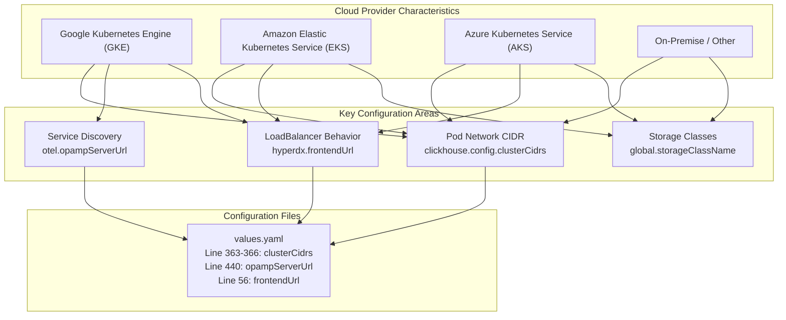
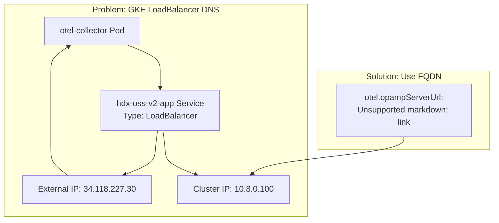
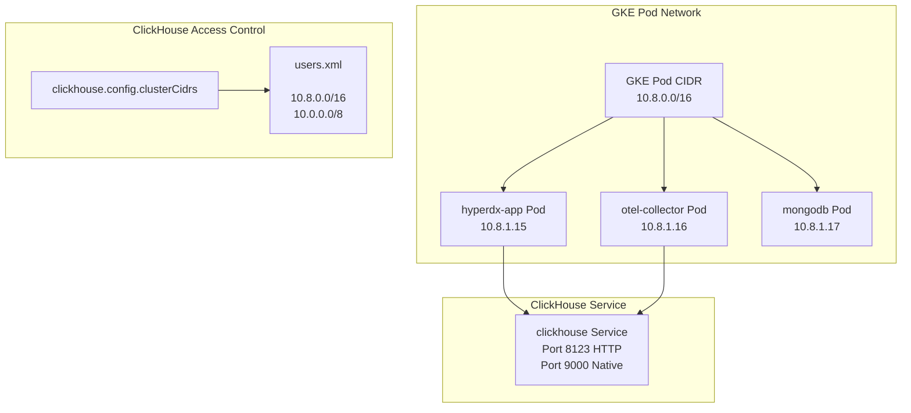
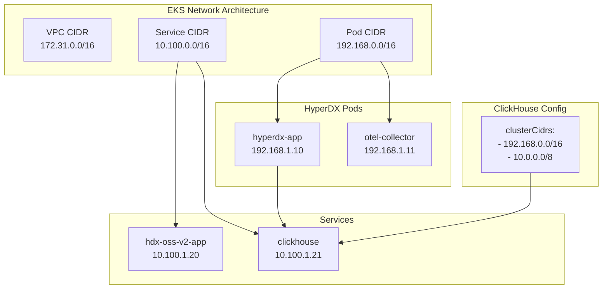
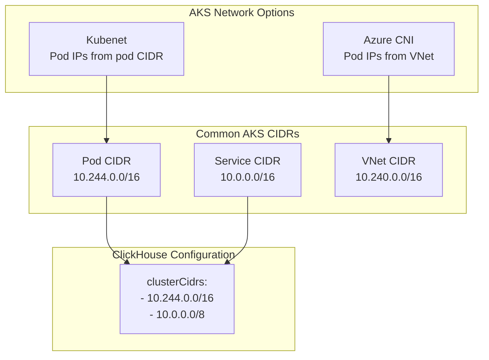
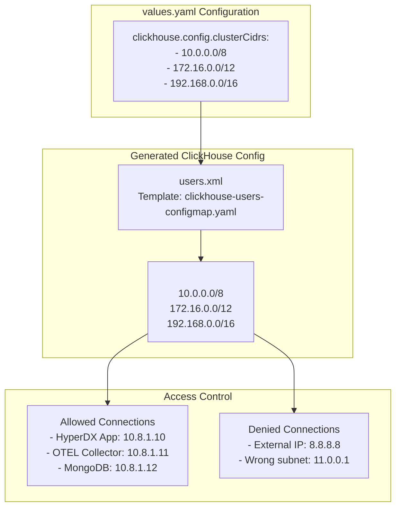
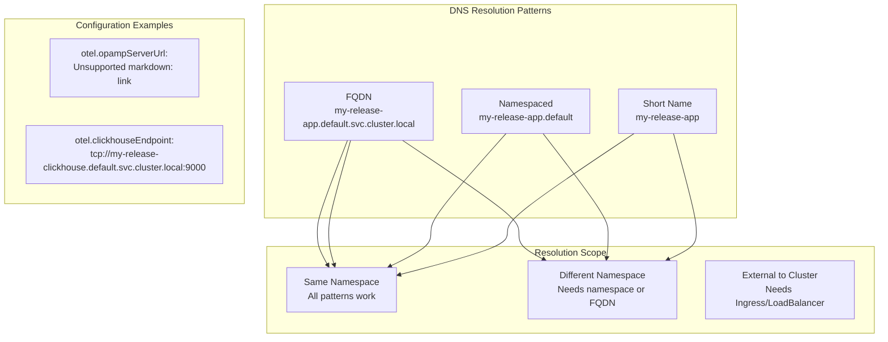

# Cloud Provider Specific Configurations

> **Relevant source files**
> * [CHANGELOG.md](https://github.com/hyperdxio/helm-charts/blob/845dd482/CHANGELOG.md)
> * [README.md](https://github.com/hyperdxio/helm-charts/blob/845dd482/README.md)
> * [charts/hdx-oss-v2/values.yaml](https://github.com/hyperdxio/helm-charts/blob/845dd482/charts/hdx-oss-v2/values.yaml)

## Purpose and Scope

This document covers cloud provider-specific configurations and considerations when deploying HyperDX on Google Kubernetes Engine (GKE), Amazon Elastic Kubernetes Service (EKS), Azure Kubernetes Service (AKS), and other Kubernetes distributions. It focuses on networking quirks, service discovery issues, and proper CIDR configuration that are unique to each cloud platform.

For general deployment procedures, see [Getting Started](/hyperdxio/helm-charts/2-getting-started). For network architecture and service discovery patterns, see [Networking and Security](/hyperdxio/helm-charts/7-networking-and-security).

---

## Cloud Provider Differences Overview

Each cloud provider implements Kubernetes networking with specific characteristics that affect HyperDX deployment:



**Sources:** [charts/hdx-oss-v2/values.yaml L363-L366](https://github.com/hyperdxio/helm-charts/blob/845dd482/charts/hdx-oss-v2/values.yaml#L363-L366)

 [charts/hdx-oss-v2/values.yaml L440](https://github.com/hyperdxio/helm-charts/blob/845dd482/charts/hdx-oss-v2/values.yaml#L440-L440)

 [README.md L530-L609](https://github.com/hyperdxio/helm-charts/blob/845dd482/README.md#L530-L609)

---

## Google Kubernetes Engine (GKE) Configuration

### GKE LoadBalancer DNS Resolution Issue

GKE has a specific networking behavior where LoadBalancer services can cause internal DNS resolution to return external IPs instead of cluster-internal addresses. This affects the OTEL collector's connection to the OpAMP server.



**Symptoms:**

* OTEL collector logs showing connection errors: `dial tcp 34.118.227.30:4320: connect: connection refused`
* OpAMP connection failures preventing dynamic configuration

**Solution Configuration:**

```yaml
# values-gke.yaml
hyperdx:
  frontendUrl: "http://34.123.61.99"  # External LoadBalancer IP
  service:
    type: LoadBalancer

otel:
  # Override with FQDN to force cluster-internal DNS resolution
  opampServerUrl: "http://my-hyperdx-hdx-oss-v2-app.default.svc.cluster.local:4320"

clickhouse:
  config:
    clusterCidrs:
      - "10.8.0.0/16"   # GKE default pod CIDR
      - "10.0.0.0/8"    # Fallback for custom configurations
```

**FQDN Pattern:** `<service-name>.<namespace>.svc.cluster.local:<port>`

**Sources:** [README.md L534-L568](https://github.com/hyperdxio/helm-charts/blob/845dd482/README.md#L534-L568)

 [charts/hdx-oss-v2/values.yaml L440](https://github.com/hyperdxio/helm-charts/blob/845dd482/charts/hdx-oss-v2/values.yaml#L440-L440)

---

### GKE Pod Network Configuration

GKE typically uses specific CIDR ranges for pod networking that must be configured in ClickHouse access control:



**Sources:** [charts/hdx-oss-v2/values.yaml L363-L366](https://github.com/hyperdxio/helm-charts/blob/845dd482/charts/hdx-oss-v2/values.yaml#L363-L366)

 [README.md L562-L566](https://github.com/hyperdxio/helm-charts/blob/845dd482/README.md#L562-L566)

---

### GKE Deployment Example

```yaml
# Full GKE deployment configuration
global:
  storageClassName: "standard-rwo"  # GKE default storage class

hyperdx:
  frontendUrl: "http://34.123.61.99"  # LoadBalancer external IP
  ingress:
    enabled: false  # Using LoadBalancer instead
  service:
    type: LoadBalancer
    annotations:
      cloud.google.com/load-balancer-type: "External"

otel:
  opampServerUrl: "http://my-hyperdx-hdx-oss-v2-app.default.svc.cluster.local:4320"
  replicas: 2  # Scale for production

clickhouse:
  config:
    clusterCidrs:
      - "10.8.0.0/16"   # GKE pod network
      - "10.0.0.0/8"    # Additional fallback
  persistence:
    enabled: true
  resources:
    requests:
      memory: "4Gi"
      cpu: "2000m"
```

**Sources:** [README.md L530-L568](https://github.com/hyperdxio/helm-charts/blob/845dd482/README.md#L530-L568)

 [charts/hdx-oss-v2/values.yaml L10](https://github.com/hyperdxio/helm-charts/blob/845dd482/charts/hdx-oss-v2/values.yaml#L10-L10)

 [charts/hdx-oss-v2/values.yaml L247-L254](https://github.com/hyperdxio/helm-charts/blob/845dd482/charts/hdx-oss-v2/values.yaml#L247-L254)

---

## Amazon Elastic Kubernetes Service (EKS) Configuration

### EKS Network Configuration

EKS uses different default CIDR ranges compared to GKE:

| Configuration | Default Value | Purpose |
| --- | --- | --- |
| VPC CIDR | `172.31.0.0/16` | AWS VPC network |
| Pod CIDR | `192.168.0.0/16` | Pod IP allocation |
| Service CIDR | `10.100.0.0/16` | Service IP allocation |



**Sources:** [README.md L570-L593](https://github.com/hyperdxio/helm-charts/blob/845dd482/README.md#L570-L593)

 [charts/hdx-oss-v2/values.yaml L363-L366](https://github.com/hyperdxio/helm-charts/blob/845dd482/charts/hdx-oss-v2/values.yaml#L363-L366)

---

### EKS with Application Load Balancer (ALB)

For production EKS deployments, configure ingress with AWS Application Load Balancer:

```css
# values-eks.yaml
hyperdx:
  frontendUrl: "https://hyperdx.yourdomain.com"
  ingress:
    enabled: true
    ingressClassName: alb
    host: "hyperdx.yourdomain.com"
    annotations:
      alb.ingress.kubernetes.io/scheme: internet-facing
      alb.ingress.kubernetes.io/target-type: ip
      alb.ingress.kubernetes.io/listen-ports: '[{"HTTP": 80}, {"HTTPS": 443}]'
      alb.ingress.kubernetes.io/ssl-redirect: "443"
      alb.ingress.kubernetes.io/certificate-arn: "arn:aws:acm:region:account:certificate/xxx"
    tls:
      enabled: true
      secretName: "hyperdx-tls"

clickhouse:
  config:
    clusterCidrs:
      - "192.168.0.0/16"  # EKS pod CIDR
      - "10.0.0.0/8"      # Fallback
  persistence:
    enabled: true
  resources:
    requests:
      memory: "4Gi"
      cpu: "2000m"

global:
  storageClassName: "gp3"  # EKS GP3 storage class
```

**Sources:** [README.md L570-L593](https://github.com/hyperdxio/helm-charts/blob/845dd482/README.md#L570-L593)

 [charts/hdx-oss-v2/values.yaml L207-L221](https://github.com/hyperdxio/helm-charts/blob/845dd482/charts/hdx-oss-v2/values.yaml#L207-L221)

---

## Azure Kubernetes Service (AKS) Configuration

### AKS Network Configuration

AKS uses Azure CNI or kubenet networking with specific CIDR ranges:



**Sources:** [README.md L595-L609](https://github.com/hyperdxio/helm-charts/blob/845dd482/README.md#L595-L609)

 [charts/hdx-oss-v2/values.yaml L363-L366](https://github.com/hyperdxio/helm-charts/blob/845dd482/charts/hdx-oss-v2/values.yaml#L363-L366)

---

### AKS Deployment Example

```yaml
# values-aks.yaml
hyperdx:
  frontendUrl: "http://your-azure-lb.eastus.cloudapp.azure.com"
  ingress:
    enabled: true
    ingressClassName: nginx
    host: "hyperdx.yourdomain.com"
    tls:
      enabled: true
  service:
    type: LoadBalancer
    annotations:
      service.beta.kubernetes.io/azure-load-balancer-internal: "false"

clickhouse:
  config:
    clusterCidrs:
      - "10.244.0.0/16"  # AKS kubenet default
      - "10.0.0.0/8"     # Covers Azure CNI ranges
  persistence:
    enabled: true

global:
  storageClassName: "managed-premium"  # AKS premium storage

mongodb:
  persistence:
    enabled: true
```

**Sources:** [README.md L595-L609](https://github.com/hyperdxio/helm-charts/blob/845dd482/README.md#L595-L609)

 [charts/hdx-oss-v2/values.yaml L10](https://github.com/hyperdxio/helm-charts/blob/845dd482/charts/hdx-oss-v2/values.yaml#L10-L10)

---

## ClickHouse Network Access Control

### CIDR Configuration Explained

The `clickhouse.config.clusterCidrs` setting controls which IP addresses can connect to ClickHouse. This is critical for security and proper operation:



**Default Development CIDRs:**

* `10.0.0.0/8` - Most Kubernetes clusters (GKE, EKS, AKS)
* `172.16.0.0/12` - Some cloud providers and Docker Desktop
* `192.168.0.0/16` - OrbStack, Minikube, local development

**Production Security Note:** Remove development CIDRs and use only your cluster's specific CIDR to lock down access.

**Sources:** [charts/hdx-oss-v2/values.yaml L359-L366](https://github.com/hyperdxio/helm-charts/blob/845dd482/charts/hdx-oss-v2/values.yaml#L359-L366)

---

## Common Cloud Provider Pitfalls

### Issue 1: OTEL Collector Cannot Connect to OpAMP Server

**Symptom:**

```yaml
Error: dial tcp 34.118.227.30:4320: connect: connection refused
```

**Root Cause:** LoadBalancer DNS resolving to external IP instead of cluster IP

**Solution:**

```yaml
otel:
  opampServerUrl: "http://{{ .Release.Name }}-hdx-oss-v2-app.{{ .Release.Namespace }}.svc.cluster.local:4320"
```

---

### Issue 2: ClickHouse Rejects Connections

**Symptom:**

```yaml
Code: 516. DB::Exception: default: Authentication failed: password is incorrect or there is no user with such name
```

**Root Cause:** Pod IP not in `clusterCidrs` whitelist

**Solution:**

1. Check pod IP: `kubectl get pod <pod-name> -o wide`
2. Verify CIDR coverage:

```yaml
clickhouse:
  config:
    clusterCidrs:
      - "10.0.0.0/8"  # Ensure this covers your pod IP
```

---

### Issue 3: Incorrect Storage Class

**Symptom:**

```
PersistentVolumeClaim is stuck in Pending state
```

**Root Cause:** Using wrong storage class for cloud provider

**Solutions:**

| Cloud Provider | Storage Class | Configuration |
| --- | --- | --- |
| GKE | `standard-rwo` | `global.storageClassName: "standard-rwo"` |
| EKS | `gp2` or `gp3` | `global.storageClassName: "gp3"` |
| AKS | `managed-premium` | `global.storageClassName: "managed-premium"` |
| On-Premise | `local-path` | `global.storageClassName: "local-path"` |

**Sources:** [charts/hdx-oss-v2/values.yaml L10](https://github.com/hyperdxio/helm-charts/blob/845dd482/charts/hdx-oss-v2/values.yaml#L10-L10)

 [README.md L611-L619](https://github.com/hyperdxio/helm-charts/blob/845dd482/README.md#L611-L619)

---

## Service Discovery Patterns

### Kubernetes DNS Resolution

Understanding service DNS patterns is crucial for cloud deployments:



**Best Practice:** Always use FQDN for cross-namespace references or when experiencing DNS issues on cloud providers.

**Sources:** [charts/hdx-oss-v2/values.yaml L60](https://github.com/hyperdxio/helm-charts/blob/845dd482/charts/hdx-oss-v2/values.yaml#L60-L60)

 [charts/hdx-oss-v2/values.yaml L440-L444](https://github.com/hyperdxio/helm-charts/blob/845dd482/charts/hdx-oss-v2/values.yaml#L440-L444)

 [README.md L534-L549](https://github.com/hyperdxio/helm-charts/blob/845dd482/README.md#L534-L549)

---

## Production Deployment Checklist

Use this checklist when deploying to production cloud environments:

### Pre-Deployment

* Identify cloud provider and pod network CIDR
* Configure `clickhouse.config.clusterCidrs` with cluster-specific CIDR
* Remove unnecessary development CIDRs from production config
* Set appropriate `global.storageClassName` for cloud provider
* Configure `hyperdx.frontendUrl` with production domain

### GKE-Specific

* Override `otel.opampServerUrl` with FQDN
* Verify pod CIDR is `10.8.0.0/16` or adjust accordingly
* Configure LoadBalancer or Ingress for external access

### EKS-Specific

* Verify pod CIDR is `192.168.0.0/16` or adjust accordingly
* Configure ALB ingress controller if using ingress
* Set up ACM certificate for HTTPS
* Configure `gp3` storage class

### AKS-Specific

* Verify pod CIDR based on CNI choice (kubenet vs Azure CNI)
* Configure Azure LoadBalancer annotations if needed
* Set up managed-premium storage class

### Post-Deployment

* Verify all pods are running: `kubectl get pods`
* Check OTEL collector can connect to OpAMP: `kubectl logs -l app.kubernetes.io/name=otel-collector`
* Test ClickHouse connectivity from app pod
* Verify persistent volumes are bound
* Test external access via ingress/LoadBalancer

**Sources:** [README.md L611-L619](https://github.com/hyperdxio/helm-charts/blob/845dd482/README.md#L611-L619)

 [charts/hdx-oss-v2/values.yaml L363-L366](https://github.com/hyperdxio/helm-charts/blob/845dd482/charts/hdx-oss-v2/values.yaml#L363-L366)

---

## Environment-Specific Values Files

### Development (Local)

```yaml
# values-dev.yaml
global:
  storageClassName: "local-path"

clickhouse:
  config:
    clusterCidrs:
      - "10.0.0.0/8"
      - "172.16.0.0/12"
      - "192.168.0.0/16"
  persistence:
    enabled: true
    dataSize: 5Gi

hyperdx:
  frontendUrl: "http://localhost:3000"
```

### Production GKE

```yaml
# values-prod-gke.yaml
global:
  storageClassName: "standard-rwo"

clickhouse:
  config:
    clusterCidrs:
      - "10.8.0.0/16"  # GKE only
  persistence:
    enabled: true
    dataSize: 100Gi
  resources:
    requests:
      memory: "8Gi"
      cpu: "4000m"

hyperdx:
  frontendUrl: "https://hyperdx.production.com"
  ingress:
    enabled: true
    host: "hyperdx.production.com"
    tls:
      enabled: true

otel:
  opampServerUrl: "http://prod-hyperdx-app.hyperdx.svc.cluster.local:4320"
  replicas: 3
```

### Production EKS

```yaml
# values-prod-eks.yaml
global:
  storageClassName: "gp3"

clickhouse:
  config:
    clusterCidrs:
      - "192.168.0.0/16"  # EKS only
  persistence:
    enabled: true
    dataSize: 100Gi

hyperdx:
  frontendUrl: "https://hyperdx.company.com"
  ingress:
    enabled: true
    ingressClassName: alb
    annotations:
      alb.ingress.kubernetes.io/scheme: internet-facing
      alb.ingress.kubernetes.io/target-type: ip
```

**Sources:** [charts/hdx-oss-v2/values.yaml L1-L477](https://github.com/hyperdxio/helm-charts/blob/845dd482/charts/hdx-oss-v2/values.yaml#L1-L477)

 [README.md L530-L624](https://github.com/hyperdxio/helm-charts/blob/845dd482/README.md#L530-L624)