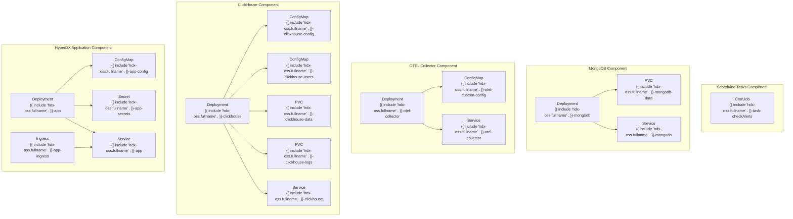
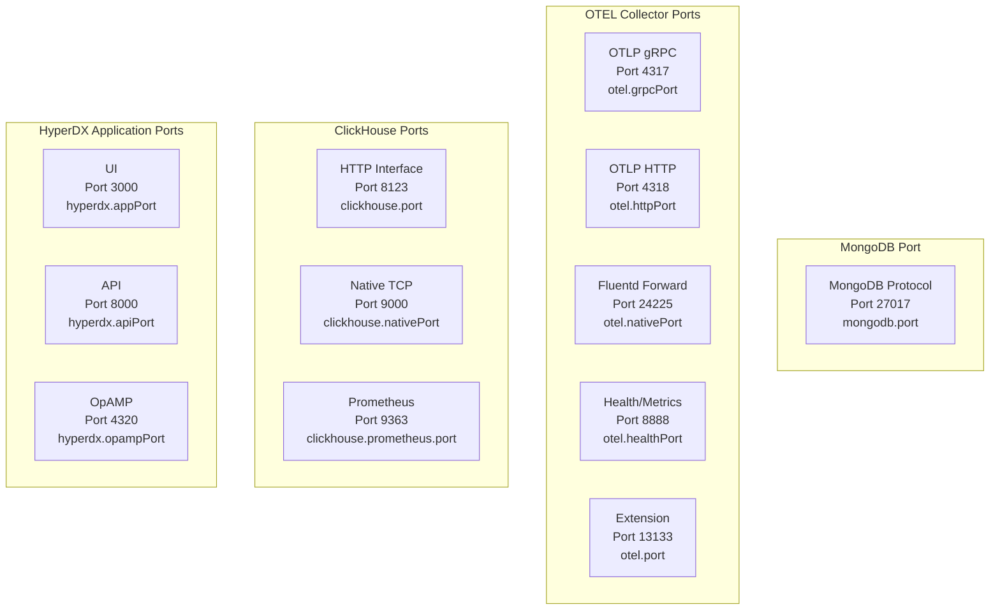
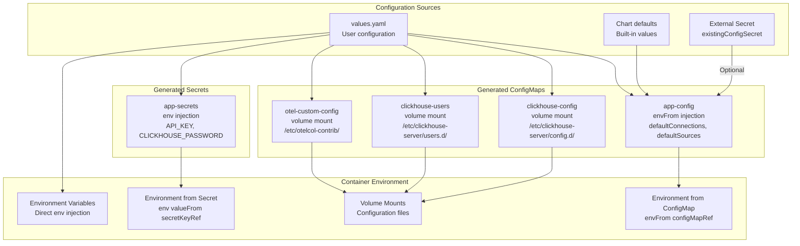
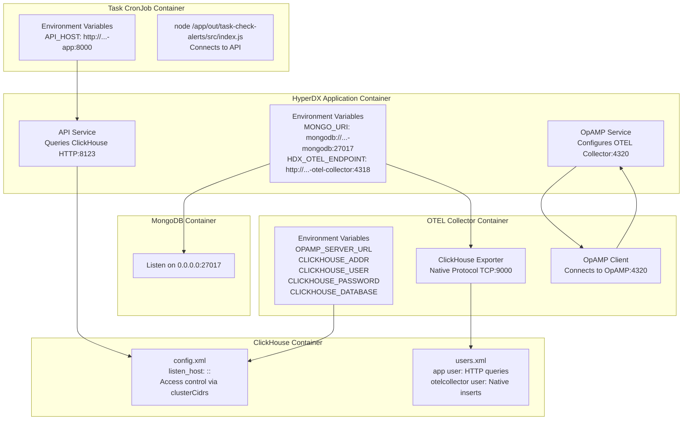
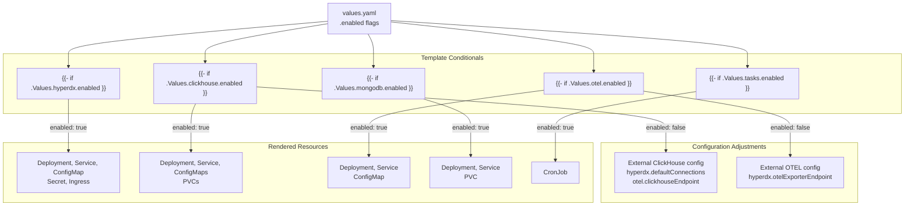
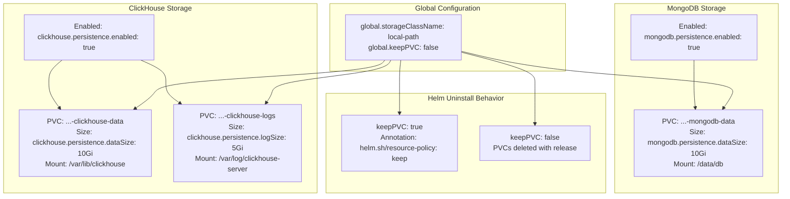
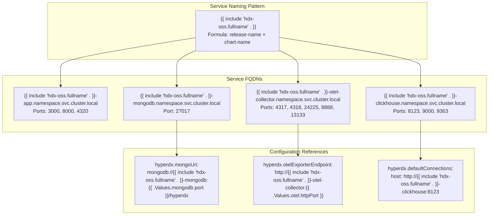
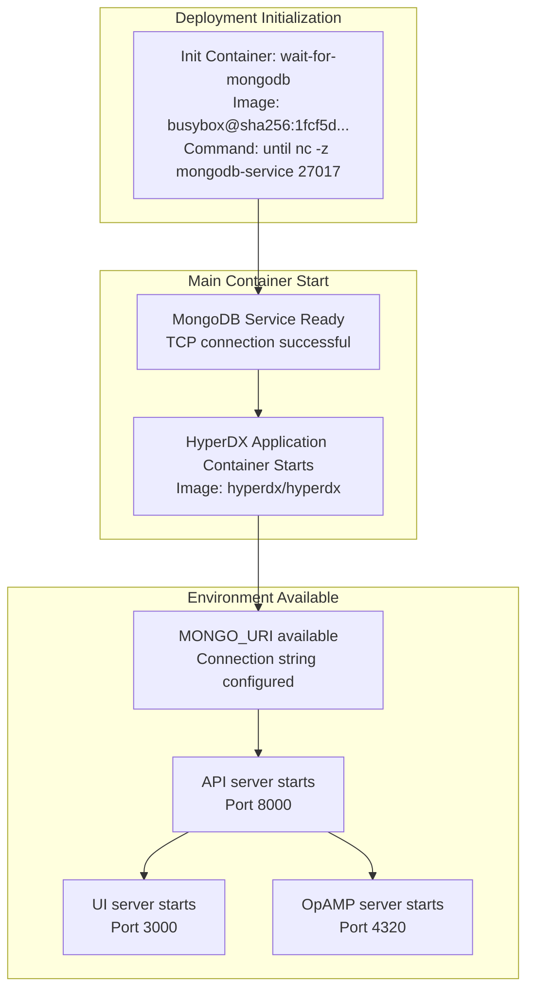
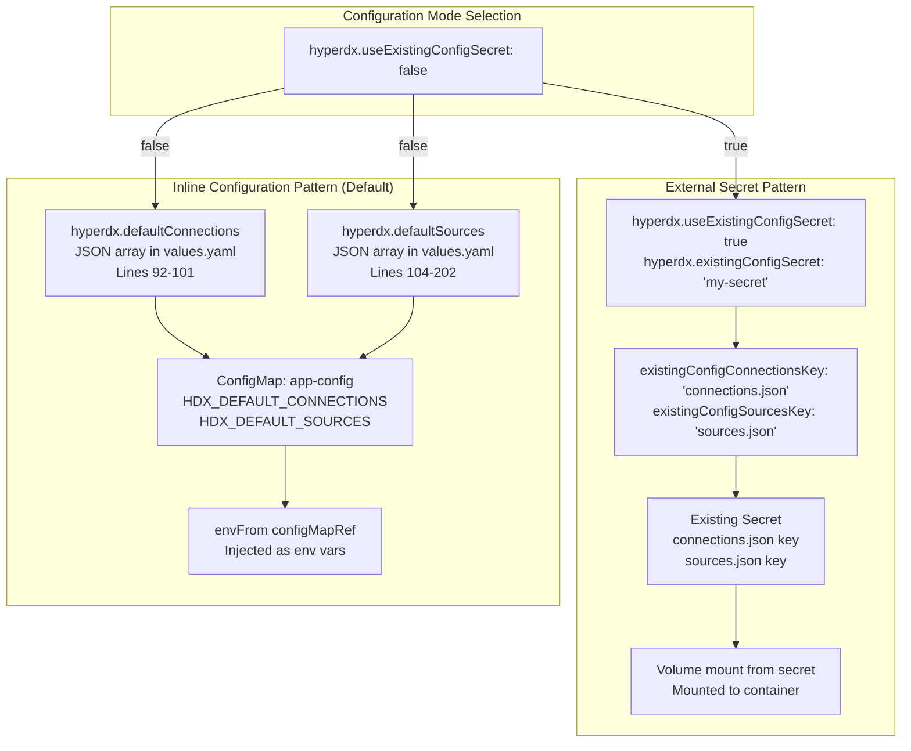

# Component Deep Dives

> **Relevant source files**
> * [README.md](https://github.com/hyperdxio/helm-charts/blob/845dd482/README.md)
> * [charts/hdx-oss-v2/values.yaml](https://github.com/hyperdxio/helm-charts/blob/845dd482/charts/hdx-oss-v2/values.yaml)

This section provides detailed technical documentation of each major component in the HyperDX Helm chart deployment. Each component is examined at the implementation level, covering deployment templates, configuration mechanisms, resource definitions, and inter-component dependencies.

For step-by-step installation and basic configuration, see [Getting Started](/hyperdxio/helm-charts/2-getting-started). For comprehensive configuration options, see [Configuration Reference](/hyperdxio/helm-charts/3-configuration-reference). For deployment patterns, see [Deployment Scenarios](/hyperdxio/helm-charts/4-deployment-scenarios).

## Component Overview

The HyperDX Helm chart deploys five primary components, each implemented as separate Kubernetes resources with distinct configuration requirements:

| Component | Primary Function | Kubernetes Resource Type | Template Path |
| --- | --- | --- | --- |
| HyperDX Application | UI, API, OpAMP server | Deployment | `templates/deployment.yaml` |
| ClickHouse | Telemetry data storage | StatefulSet/Deployment | `templates/clickhouse-*.yaml` |
| OpenTelemetry Collector | Telemetry ingestion & processing | Deployment | `templates/otel-collector-*.yaml` |
| MongoDB | Metadata storage | Deployment | `templates/mongodb-*.yaml` |
| Scheduled Tasks | Background processing | CronJob | `templates/cronjob-*.yaml` |

Each component can be enabled or disabled independently through the `enabled` flag in [values.yaml L259-L467](https://github.com/hyperdxio/helm-charts/blob/845dd482/values.yaml#L259-L467)

 supporting flexible deployment scenarios from full-stack to minimal configurations.

## Component Architecture Mapping

The following diagram maps natural language component names to their actual Kubernetes resource implementations:



**Sources:** [values.yaml L1-L476](https://github.com/hyperdxio/helm-charts/blob/845dd482/values.yaml#L1-L476)

## Component Port Architecture

Each component exposes specific ports for different protocols and purposes:



**Sources:** [values.yaml L49-L404](https://github.com/hyperdxio/helm-charts/blob/845dd482/values.yaml#L49-L404)

## Configuration Injection Mechanisms

Components receive configuration through multiple injection patterns, each serving different security and flexibility requirements:



**Sources:** [values.yaml L72-L436](https://github.com/hyperdxio/helm-charts/blob/845dd482/values.yaml#L72-L436)

## Inter-Component Communication Patterns

Components communicate using Kubernetes service discovery with specific connection patterns:



**Sources:** [values.yaml L60-L446](https://github.com/hyperdxio/helm-charts/blob/845dd482/values.yaml#L60-L446)

## Component Enablement and Conditional Rendering

Each component uses conditional template rendering based on the `enabled` flag:



**Sources:** [values.yaml L259-L467](https://github.com/hyperdxio/helm-charts/blob/845dd482/values.yaml#L259-L467)

## Container Image Configuration

Each component uses specific container images with configurable repositories and tags:

| Component | Image Repository | Tag Source | Pull Policy |
| --- | --- | --- | --- |
| HyperDX Application | `docker.hyperdx.io/hyperdx/hyperdx` | `hyperdx.image.tag` or Chart `appVersion` | `hyperdx.image.pullPolicy` |
| HyperDX Init (MongoDB wait) | `busybox@sha256:1fcf5d...` | Pinned digest | `hyperdx.waitForMongodb.pullPolicy` |
| ClickHouse | `clickhouse/clickhouse-server:25.7-alpine` | Fixed in values | N/A |
| OpenTelemetry Collector | `docker.hyperdx.io/hyperdx/hyperdx-otel-collector` | `otel.image.tag` or Chart `appVersion` | `otel.image.pullPolicy` |
| MongoDB | `mongo:5.0.14-focal` | Fixed in values | N/A |

**Sources:** [values.yaml L15-L372](https://github.com/hyperdxio/helm-charts/blob/845dd482/values.yaml#L15-L372)

## Health Probe Configuration

All deployable components implement Kubernetes health probes with consistent configuration patterns:

```mermaid
flowchart TD

LivenessProbe["Liveness Probe<br>Restart container if failing"]
ReadinessProbe["Readiness Probe<br>Remove from service endpoints"]
StartupProbe["Startup Probe<br>Delay other probes until ready"]
HyperdxLive["HTTP GET /:3000<br>initialDelaySeconds: 10<br>periodSeconds: 30"]
HyperdxReady["HTTP GET /:3000<br>initialDelaySeconds: 1<br>periodSeconds: 10"]
CHLive["HTTP GET /:8123/ping<br>initialDelaySeconds: 10<br>periodSeconds: 30"]
CHReady["HTTP GET /:8123/ping<br>initialDelaySeconds: 1<br>periodSeconds: 10"]
CHStartup["HTTP GET /:8123/ping<br>initialDelaySeconds: 5<br>failureThreshold: 30"]
OTELLive["HTTP GET /:13133<br>initialDelaySeconds: 10<br>periodSeconds: 30"]
OTELReady["HTTP GET /:13133<br>initialDelaySeconds: 5<br>periodSeconds: 10"]
MongoLive["Exec: mongosh --eval db.adminCommand('ping')<br>initialDelaySeconds: 10<br>periodSeconds: 30"]
MongoReady["Exec: mongosh --eval db.adminCommand('ping')<br>initialDelaySeconds: 1<br>periodSeconds: 10"]

LivenessProbe --> HyperdxLive
LivenessProbe --> CHLive
LivenessProbe --> OTELLive
LivenessProbe --> MongoLive
ReadinessProbe --> HyperdxReady
ReadinessProbe --> CHReady
ReadinessProbe --> OTELReady
ReadinessProbe --> MongoReady
StartupProbe --> CHStartup

subgraph MongoDB ["MongoDB"]
    MongoLive
    MongoReady
end

subgraph subGraph3 ["OTEL Collector"]
    OTELLive
    OTELReady
end

subgraph ClickHouse ["ClickHouse"]
    CHLive
    CHReady
    CHStartup
end

subgraph subGraph1 ["HyperDX Application"]
    HyperdxLive
    HyperdxReady
end

subgraph subGraph0 ["Probe Types"]
    LivenessProbe
    ReadinessProbe
    StartupProbe
end
```



**Sources:** [values.yaml L23-L464](https://github.com/hyperdxio/helm-charts/blob/845dd482/values.yaml#L23-L464)

## Persistence Architecture

Storage components implement persistent volume claims with configurable sizes and storage classes:



**Sources:** [values.yaml L10-L349](https://github.com/hyperdxio/helm-charts/blob/845dd482/values.yaml#L10-L349)

## Node Scheduling Configuration

All deployable components support node affinity, tolerations, and resource constraints:

| Component | Node Selector Config | Tolerations Config | Resources Config |
| --- | --- | --- | --- |
| HyperDX Application | `hyperdx.nodeSelector` | `hyperdx.tolerations` | Not exposed in values |
| ClickHouse | `clickhouse.nodeSelector` | `clickhouse.tolerations` | `clickhouse.resources` |
| OpenTelemetry Collector | `otel.nodeSelector` | `otel.tolerations` | `otel.resources` |
| MongoDB | `mongodb.nodeSelector` | `mongodb.tolerations` | Not exposed in values |

**Example configuration:**

```yaml
clickhouse:
  nodeSelector:
    kubernetes.io/os: linux
    node-role.kubernetes.io/worker: "true"
  tolerations:
    - key: "key1"
      operator: "Equal"
      value: "value1"
      effect: "NoSchedule"
  resources:
    requests:
      memory: "512Mi"
      cpu: "500m"
    limits:
      memory: "2Gi"
      cpu: "2000m"
```

**Sources:** [values.yaml L35-L399](https://github.com/hyperdxio/helm-charts/blob/845dd482/values.yaml#L35-L399)

## Service Discovery and DNS

Components use Kubernetes service discovery with predictable naming patterns:



**Sources:** [values.yaml L60-L100](https://github.com/hyperdxio/helm-charts/blob/845dd482/values.yaml#L60-L100)

## Component Dependencies and Initialization

The HyperDX application deployment includes an init container to ensure MongoDB availability before starting:



**Sources:** [values.yaml L19-L22](https://github.com/hyperdxio/helm-charts/blob/845dd482/values.yaml#L19-L22)

## Default Configuration vs External Configuration

The chart supports two configuration patterns for connections and sources:



**Sources:** [values.yaml L77-L202](https://github.com/hyperdxio/helm-charts/blob/845dd482/values.yaml#L77-L202)

## Component-Specific Details

For detailed technical documentation of individual components, see the following pages:

* **[HyperDX Application](/hyperdxio/helm-charts/5.1-hyperdx-application)**: Deployment structure, multi-container architecture (UI, API, OpAMP), environment configuration, ingress setup
* **[ClickHouse Database](/hyperdxio/helm-charts/5.2-clickhouse-database)**: Persistence configuration, `config.xml` and `users.xml` structure, network access control via `clusterCidrs`, performance tuning
* **[OpenTelemetry Collector](/hyperdxio/helm-charts/5.3-opentelemetry-collector)**: Port architecture, custom config injection via `customConfig`, OpAMP integration, ClickHouse exporter configuration
* **[MongoDB](/hyperdxio/helm-charts/5.4-mongodb)**: Initialization, persistence setup, connection strings
* **[Scheduled Tasks System](/hyperdxio/helm-charts/5.5-scheduled-tasks-system)**: CronJob implementation, version-specific command paths, environment configuration for tasks

**Sources:** [values.yaml L1-L476](https://github.com/hyperdxio/helm-charts/blob/845dd482/values.yaml#L1-L476)