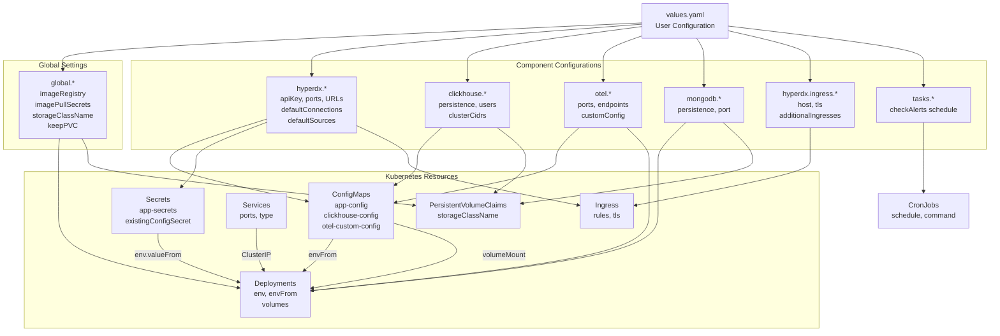
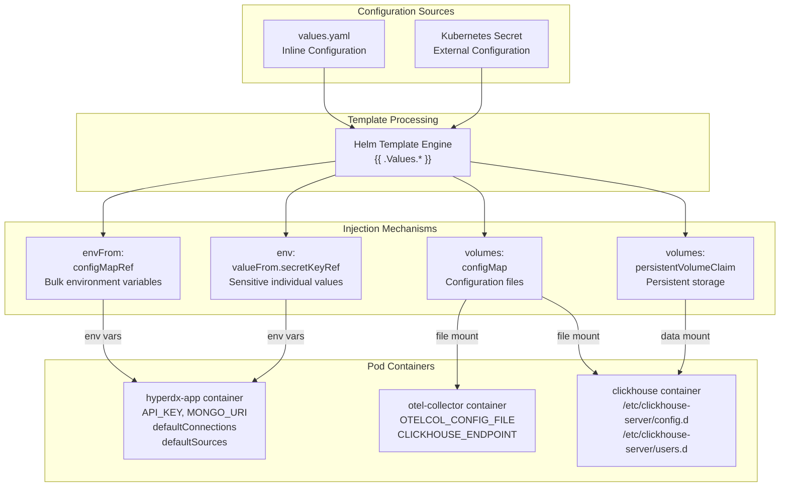
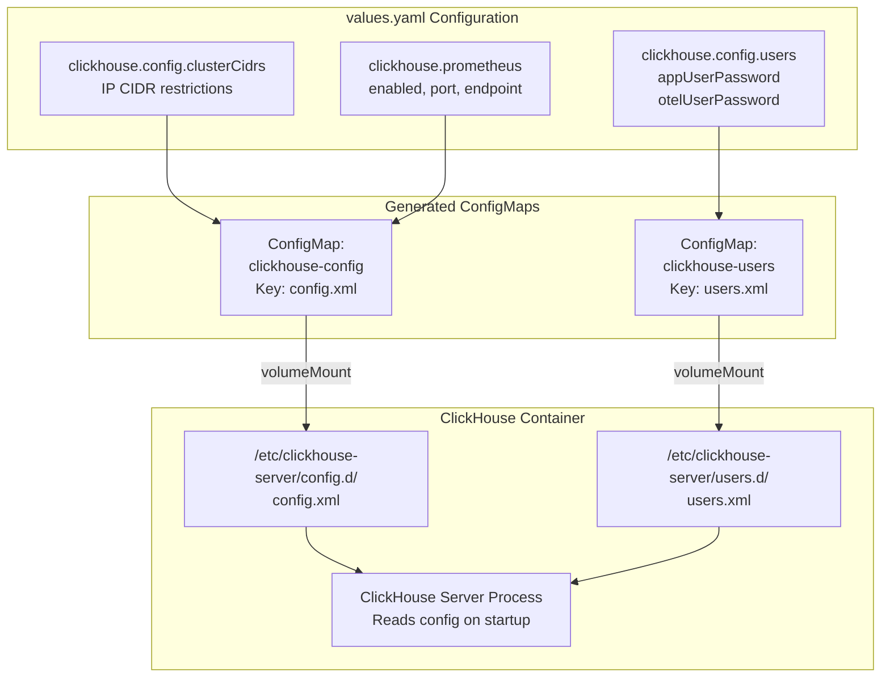
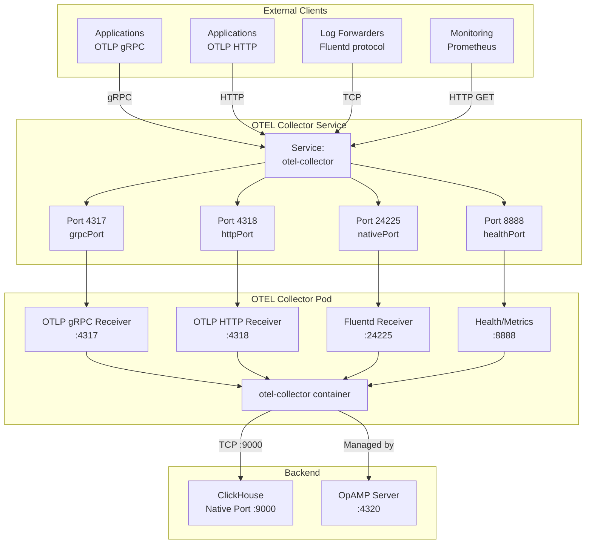
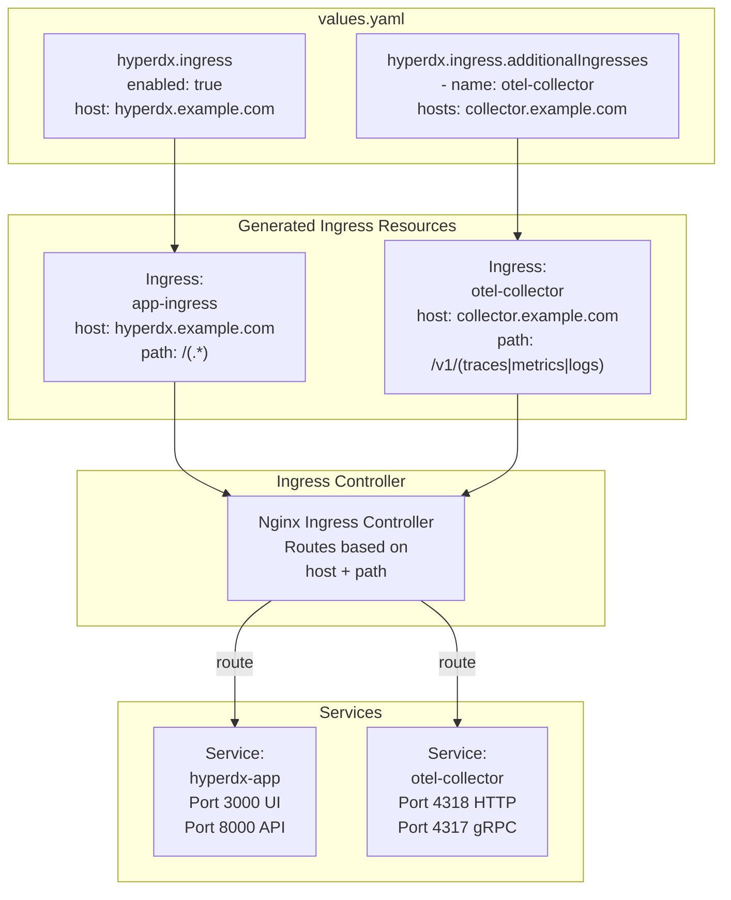

# Configuration Reference

> **Relevant source files**
> * [README.md](https://github.com/hyperdxio/helm-charts/blob/845dd482/README.md)
> * [charts/hdx-oss-v2/values.yaml](https://github.com/hyperdxio/helm-charts/blob/845dd482/charts/hdx-oss-v2/values.yaml)

This document provides a comprehensive reference for all configuration options available in the HyperDX Helm chart's `values.yaml` file. Each configuration section documents the parameters, their types, default values, and usage examples.

For step-by-step deployment instructions using these configurations, see [Getting Started](/hyperdxio/helm-charts/2-getting-started). For detailed explanations of how components use these configurations, see [Component Deep Dives](/hyperdxio/helm-charts/5-component-deep-dives). For production deployment patterns, see [Deployment Scenarios](/hyperdxio/helm-charts/4-deployment-scenarios).

**Sources:** [charts/hdx-oss-v2/values.yaml L1-L477](https://github.com/hyperdxio/helm-charts/blob/845dd482/charts/hdx-oss-v2/values.yaml#L1-L477)

---

## Configuration Architecture

The Helm chart uses a hierarchical configuration structure where values cascade from global settings down to component-specific settings. Configuration is consumed through multiple mechanisms: environment variables, ConfigMaps, Secrets, and volume mounts.

### Configuration Flow Diagram



**Sources:** [charts/hdx-oss-v2/values.yaml L1-L477](https://github.com/hyperdxio/helm-charts/blob/845dd482/charts/hdx-oss-v2/values.yaml#L1-L477)

---

## Configuration Injection Patterns

The chart uses multiple patterns to inject configuration into pods. Understanding these patterns helps when troubleshooting configuration issues or extending the chart.



**Sources:** [charts/hdx-oss-v2/values.yaml L1-L477](https://github.com/hyperdxio/helm-charts/blob/845dd482/charts/hdx-oss-v2/values.yaml#L1-L477)

 README sections on using secrets

---

## Global Configuration

Global settings apply to all components in the chart. These settings control image registry, pull secrets, storage, and PVC retention policies.

**Configuration Path:** `global.*`

| Parameter | Type | Default | Description |
| --- | --- | --- | --- |
| `global.imageRegistry` | string | `""` | Override image registry for all images. Useful for air-gapped environments or private registries. |
| `global.imagePullSecrets` | array | `[]` | List of image pull secrets for private registries. Helps avoid Docker Hub rate limiting (429 errors). |
| `global.storageClassName` | string | `"local-path"` | Default storage class for all PersistentVolumeClaims. |
| `global.keepPVC` | boolean | `false` | When `true`, retains PVCs after helm uninstall to preserve data. |

### Examples

**Using a private registry:**

```yaml
global:
  imageRegistry: "my-registry.example.com"
  imagePullSecrets:
    - name: regcred
    - name: docker-hub-secret
```

**Configuring production storage:**

```yaml
global:
  storageClassName: "gp3-encrypted"  # AWS EBS gp3 with encryption
  keepPVC: true  # Preserve data during upgrades
```

**Sources:** [charts/hdx-oss-v2/values.yaml L1-L12](https://github.com/hyperdxio/helm-charts/blob/845dd482/charts/hdx-oss-v2/values.yaml#L1-L12)

---

## HyperDX Application Configuration

The HyperDX application is the core component consisting of the API server, UI, and OpAMP server. This section controls application behavior, connectivity, and data source configuration.

**Configuration Path:** `hyperdx.*`

### Image Configuration

| Parameter | Type | Default | Description |
| --- | --- | --- | --- |
| `hyperdx.image.repository` | string | `"docker.hyperdx.io/hyperdx/hyperdx"` | HyperDX container image repository. |
| `hyperdx.image.tag` | string | `""` | Image tag. Defaults to chart's `appVersion` if empty. |
| `hyperdx.image.pullPolicy` | string | `"IfNotPresent"` | Image pull policy. |

### Service Ports

| Parameter | Type | Default | Description |
| --- | --- | --- | --- |
| `hyperdx.apiPort` | integer | `8000` | API server port. Maps to `API_SERVER_PORT` environment variable. |
| `hyperdx.appPort` | integer | `3000` | Frontend/UI port. Maps to `NEXT_PUBLIC_SERVER_URL` port. |
| `hyperdx.opampPort` | integer | `4320` | OpAMP server port for OTEL Collector management. |

### URLs and Endpoints

| Parameter | Type | Default | Description |
| --- | --- | --- | --- |
| `hyperdx.appUrl` | string | `"http://localhost"` | **Deprecated.** Use `frontendUrl` instead. |
| `hyperdx.frontendUrl` | string | `"{{ .Values.hyperdx.appUrl }}:{{ .Values.hyperdx.appPort }}"` | Frontend URL with protocol. Must match ingress host for production. |
| `hyperdx.otelExporterEndpoint` | string | `http://{{ include "hdx-oss.fullname" . }}-otel-collector:{{ .Values.otel.httpPort }}` | OTLP endpoint for sending HyperDX's own telemetry. |
| `hyperdx.mongoUri` | string | `mongodb://{{ include "hdx-oss.fullname" . }}-mongodb:{{ .Values.mongodb.port }}/hyperdx` | MongoDB connection string for metadata storage. |

### API Configuration

| Parameter | Type | Default | Description |
| --- | --- | --- | --- |
| `hyperdx.apiKey` | string | `"xxxxxxxx-xxxx-xxxx-xxxx-xxxxxxxxxxxx"` | API key for telemetry ingestion. Generated from HyperDX Team settings. |
| `hyperdx.logLevel` | string | `"info"` | Application log level. Options: `debug`, `info`, `warn`, `error`. |
| `hyperdx.usageStatsEnabled` | boolean | `true` | Enable anonymous usage statistics. |

### Data Sources Configuration

The chart supports two methods for configuring ClickHouse connections and data sources: inline configuration (simple) or external secrets (production).

#### Inline Configuration (Default)

| Parameter | Type | Default | Description |
| --- | --- | --- | --- |
| `hyperdx.defaultConnections` | string (JSON) | See [values.yaml L92-L101](https://github.com/hyperdxio/helm-charts/blob/845dd482/values.yaml#L92-L101) | JSON array defining ClickHouse connections. Set to `""` to disable. |
| `hyperdx.defaultSources` | string (JSON) | See [values.yaml L104-L202](https://github.com/hyperdxio/helm-charts/blob/845dd482/values.yaml#L104-L202) | JSON array defining data sources (logs, traces, metrics, sessions). Set to `""` to disable. |

#### External Secret Configuration (Production)

| Parameter | Type | Default | Description |
| --- | --- | --- | --- |
| `hyperdx.useExistingConfigSecret` | boolean | `false` | When `true`, use external Kubernetes secret instead of inline configuration. |
| `hyperdx.existingConfigSecret` | string | `""` | Name of existing Kubernetes secret containing connections and sources JSON. |
| `hyperdx.existingConfigConnectionsKey` | string | `"connections.json"` | Key in secret containing connections JSON array. |
| `hyperdx.existingConfigSourcesKey` | string | `"sources.json"` | Key in secret containing sources JSON array. |

### Health Probes

| Parameter | Type | Default | Description |
| --- | --- | --- | --- |
| `hyperdx.livenessProbe.enabled` | boolean | `true` | Enable liveness probe. |
| `hyperdx.livenessProbe.initialDelaySeconds` | integer | `10` | Initial delay before probing. |
| `hyperdx.livenessProbe.periodSeconds` | integer | `30` | Probe frequency. |
| `hyperdx.livenessProbe.timeoutSeconds` | integer | `5` | Probe timeout. |
| `hyperdx.livenessProbe.failureThreshold` | integer | `3` | Failures before restart. |
| `hyperdx.readinessProbe.*` | object | See [values.yaml L29-L34](https://github.com/hyperdxio/helm-charts/blob/845dd482/values.yaml#L29-L34) | Readiness probe configuration with similar structure. |

### Deployment Configuration

| Parameter | Type | Default | Description |
| --- | --- | --- | --- |
| `hyperdx.replicas` | integer | `1` | Number of HyperDX application replicas. |
| `hyperdx.nodeSelector` | object | `{}` | Node selector for pod placement. |
| `hyperdx.tolerations` | array | `[]` | Tolerations for pod scheduling. |
| `hyperdx.annotations` | object | `{}` | Pod-level annotations. |
| `hyperdx.labels` | object | `{}` | Pod-level labels. |
| `hyperdx.env` | array | `[]` | Additional environment variables. Preserved for backward compatibility. |

### Service Configuration

| Parameter | Type | Default | Description |
| --- | --- | --- | --- |
| `hyperdx.service.type` | string | `"ClusterIP"` | Service type. Use `ClusterIP` for security; access via ingress. |
| `hyperdx.service.annotations` | object | `{}` | Service-level annotations (e.g., cloud load balancer annotations). |

### Pod Disruption Budget

| Parameter | Type | Default | Description |
| --- | --- | --- | --- |
| `hyperdx.podDisruptionBudget.enabled` | boolean | `false` | Enable PodDisruptionBudget for high availability. |

### Wait for MongoDB Init Container

| Parameter | Type | Default | Description |
| --- | --- | --- | --- |
| `hyperdx.waitForMongodb.image` | string | `"busybox@sha256:1fcf5df..."` | Image used by init container that waits for MongoDB. |
| `hyperdx.waitForMongodb.pullPolicy` | string | `"IfNotPresent"` | Pull policy for wait container. |

### Data Sources JSON Structure

The `defaultConnections` and `defaultSources` fields expect JSON arrays. Here's the structure:

**Connections:**

```json
[
  {
    "name": "Local ClickHouse",
    "host": "http://my-release-clickhouse:8123",
    "port": 8123,
    "username": "app",
    "password": "hyperdx"
  }
]
```

**Sources (abbreviated):**

```json
[
  {
    "kind": "log",
    "name": "Logs",
    "from": {
      "databaseName": "default",
      "tableName": "otel_logs"
    },
    "timestampValueExpression": "TimestampTime",
    "serviceNameExpression": "ServiceName",
    "connection": "Local ClickHouse"
  }
]
```

For complete source structure examples, see [values.yaml L104-L202](https://github.com/hyperdxio/helm-charts/blob/845dd482/values.yaml#L104-L202)

 and the [Auto Provision documentation](https://github.com/hyperdxio/helm-charts/blob/845dd482/Auto Provision documentation)

**Sources:** [charts/hdx-oss-v2/values.yaml L14-L255](https://github.com/hyperdxio/helm-charts/blob/845dd482/charts/hdx-oss-v2/values.yaml#L14-L255)

 [README.md L70-L234](https://github.com/hyperdxio/helm-charts/blob/845dd482/README.md#L70-L234)

---

## ClickHouse Configuration

ClickHouse stores all telemetry data (logs, traces, metrics) and sessions. This section controls ClickHouse deployment, persistence, users, and network access.

**Configuration Path:** `clickhouse.*`

### Image and Deployment

| Parameter | Type | Default | Description |
| --- | --- | --- | --- |
| `clickhouse.enabled` | boolean | `true` | Deploy ClickHouse. Set to `false` for external ClickHouse. |
| `clickhouse.image` | string | `"clickhouse/clickhouse-server:25.7-alpine"` | ClickHouse container image. |
| `clickhouse.port` | integer | `8123` | HTTP port for queries. |
| `clickhouse.nativePort` | integer | `9000` | Native TCP port for OTEL Collector. |
| `clickhouse.terminationGracePeriodSeconds` | integer | `90` | Grace period for graceful shutdown. |

### Resource Management

| Parameter | Type | Default | Description |
| --- | --- | --- | --- |
| `clickhouse.resources` | object | `{}` | CPU and memory requests/limits. See example in [values.yaml L294-L302](https://github.com/hyperdxio/helm-charts/blob/845dd482/values.yaml#L294-L302) |

**Example:**

```yaml
clickhouse:
  resources:
    requests:
      memory: "512Mi"
      cpu: "500m"
    limits:
      memory: "2Gi"
      cpu: "2000m"
```

### Persistence

| Parameter | Type | Default | Description |
| --- | --- | --- | --- |
| `clickhouse.persistence.enabled` | boolean | `true` | Enable persistent storage for ClickHouse data. |
| `clickhouse.persistence.dataSize` | string | `"10Gi"` | Size of data PVC. |
| `clickhouse.persistence.logSize` | string | `"5Gi"` | Size of logs PVC. |

### Health Probes

| Parameter | Type | Default | Description |
| --- | --- | --- | --- |
| `clickhouse.livenessProbe.*` | object | See [values.yaml L303-L308](https://github.com/hyperdxio/helm-charts/blob/845dd482/values.yaml#L303-L308) | Liveness probe configuration. |
| `clickhouse.readinessProbe.*` | object | See [values.yaml L309-L314](https://github.com/hyperdxio/helm-charts/blob/845dd482/values.yaml#L309-L314) | Readiness probe configuration. |
| `clickhouse.startupProbe.enabled` | boolean | `true` | Enable startup probe for initial startup detection. |
| `clickhouse.startupProbe.failureThreshold` | integer | `30` | Allows up to 5 minutes for startup (30 * 10s). |

### User Configuration

| Parameter | Type | Default | Description |
| --- | --- | --- | --- |
| `clickhouse.config.users.appUserPassword` | string | `"hyperdx"` | Password for `app` user (used by HyperDX API). |
| `clickhouse.config.users.otelUserName` | string | `"otelcollector"` | Username for OTEL Collector. |
| `clickhouse.config.users.otelUserPassword` | string | `"otelcollectorpass"` | Password for OTEL Collector user. |

### Network Access Control

| Parameter | Type | Default | Description |
| --- | --- | --- | --- |
| `clickhouse.config.clusterCidrs` | array | See [values.yaml L363-L366](https://github.com/hyperdxio/helm-charts/blob/845dd482/values.yaml#L363-L366) | IP CIDRs allowed to connect to ClickHouse. Restricts access to cluster-internal IPs. |

**Default CIDRs (for development convenience):**

```yaml
clusterCidrs:
  - "10.0.0.0/8"       # Most K8s clusters (GKE, EKS, AKS)
  - "172.16.0.0/12"    # Some clouds, Docker Desktop
  - "192.168.0.0/16"   # OrbStack, Minikube, local dev
```

**Production recommendation:** Narrow this to your cluster's specific CIDR (e.g., `10.8.0.0/16` for GKE).

### Prometheus Metrics

| Parameter | Type | Default | Description |
| --- | --- | --- | --- |
| `clickhouse.prometheus.enabled` | boolean | `true` | Enable Prometheus metrics endpoint. |
| `clickhouse.prometheus.port` | integer | `9363` | Prometheus metrics port. |
| `clickhouse.prometheus.endpoint` | string | `"/metrics"` | Metrics endpoint path. |

### Service Configuration

| Parameter | Type | Default | Description |
| --- | --- | --- | --- |
| `clickhouse.service.type` | string | `"ClusterIP"` | Service type. Use `ClusterIP` for security. |
| `clickhouse.service.annotations` | object | `{}` | Service-level annotations. |

### Scheduling

| Parameter | Type | Default | Description |
| --- | --- | --- | --- |
| `clickhouse.nodeSelector` | object | `{}` | Node selector for ClickHouse pods. |
| `clickhouse.tolerations` | array | `[]` | Tolerations for pod scheduling. |

### ClickHouse Configuration Files Mapping



**Sources:** [charts/hdx-oss-v2/values.yaml L289-L367](https://github.com/hyperdxio/helm-charts/blob/845dd482/charts/hdx-oss-v2/values.yaml#L289-L367)

---

## OpenTelemetry Collector Configuration

The OTEL Collector receives telemetry data from instrumented applications and forwards it to ClickHouse. It's managed via OpAMP protocol by the HyperDX application.

**Configuration Path:** `otel.*`

### Image and Deployment

| Parameter | Type | Default | Description |
| --- | --- | --- | --- |
| `otel.enabled` | boolean | `true` | Deploy OTEL Collector. Set to `false` for external collector. |
| `otel.image.repository` | string | `"docker.hyperdx.io/hyperdx/hyperdx-otel-collector"` | OTEL Collector image repository. |
| `otel.image.tag` | string | `""` | Image tag. Defaults to chart's `appVersion` if empty. |
| `otel.image.pullPolicy` | string | `"IfNotPresent"` | Image pull policy. |
| `otel.replicas` | integer | `1` | Number of OTEL Collector replicas. |

### Port Configuration

| Parameter | Type | Default | Description |
| --- | --- | --- | --- |
| `otel.grpcPort` | integer | `4317` | OTLP gRPC receiver port. |
| `otel.httpPort` | integer | `4318` | OTLP HTTP receiver port. |
| `otel.nativePort` | integer | `24225` | Fluentd receiver port. |
| `otel.healthPort` | integer | `8888` | Health check and metrics port. |
| `otel.port` | integer | `13133` | Extension health check port. |

### ClickHouse Connection

| Parameter | Type | Default | Description |
| --- | --- | --- | --- |
| `otel.clickhouseEndpoint` | string | `""` | ClickHouse TCP endpoint. Defaults to chart's ClickHouse service at port 9000. |
| `otel.clickhouseUser` | string | `""` | ClickHouse username. Defaults to `otelcollector`. |
| `otel.clickhousePassword` | string | `""` | ClickHouse password. Defaults to `clickhouse.config.users.otelUserPassword`. |
| `otel.clickhouseDatabase` | string | `"default"` | ClickHouse database for telemetry tables. |
| `otel.clickhousePrometheusEndpoint` | string | `""` | ClickHouse Prometheus endpoint. Auto-configured if prometheus enabled. |

### OpAMP Configuration

| Parameter | Type | Default | Description |
| --- | --- | --- | --- |
| `otel.opampServerUrl` | string | `""` | OpAMP server URL. Defaults to HyperDX app service. Override with FQDN for GKE. |

**GKE-specific example:**

```yaml
otel:
  opampServerUrl: "http://my-release-hdx-oss-v2-app.default.svc.cluster.local:4320"
```

### Custom Configuration

| Parameter | Type | Default | Description |
| --- | --- | --- | --- |
| `otel.customConfig` | string | `""` | Custom OTEL Collector configuration YAML. Mounted as `/etc/otelcol-contrib/custom.config.yaml`. |

**Example:**

```yaml
otel:
  customConfig: |
    receivers:
      hostmetrics:
        collection_interval: 5s
        scrapers:
          cpu:
          memory:
    service:
      pipelines:
        metrics/hostmetrics:
          receivers: [hostmetrics]
          processors: [batch]
          exporters: [clickhouse]
```

The environment variable `CUSTOM_OTELCOL_CONFIG_FILE` points to this file.

### Resource Management

| Parameter | Type | Default | Description |
| --- | --- | --- | --- |
| `otel.resources` | object | `{}` | CPU and memory requests/limits. See example in [values.yaml L374-L382](https://github.com/hyperdxio/helm-charts/blob/845dd482/values.yaml#L374-L382) |

### Environment Variables

| Parameter | Type | Default | Description |
| --- | --- | --- | --- |
| `otel.env` | array | `[]` | Additional environment variables for OTEL Collector container. |

**Example:**

```yaml
otel:
  env:
    - name: CUSTOM_VAR
      value: "my-value"
    - name: SECRET_VAR
      valueFrom:
        secretKeyRef:
          name: my-secret
          key: secret-key
```

### Health Probes

| Parameter | Type | Default | Description |
| --- | --- | --- | --- |
| `otel.livenessProbe.*` | object | See [values.yaml L453-L458](https://github.com/hyperdxio/helm-charts/blob/845dd482/values.yaml#L453-L458) | Liveness probe configuration. |
| `otel.readinessProbe.*` | object | See [values.yaml L459-L464](https://github.com/hyperdxio/helm-charts/blob/845dd482/values.yaml#L459-L464) | Readiness probe configuration. |

### Scheduling

| Parameter | Type | Default | Description |
| --- | --- | --- | --- |
| `otel.nodeSelector` | object | `{}` | Node selector for OTEL Collector pods. |
| `otel.tolerations` | array | `[]` | Tolerations for pod scheduling. |
| `otel.annotations` | object | `{}` | Pod-level annotations. |

### OTEL Collector Port Mapping



**Sources:** [charts/hdx-oss-v2/values.yaml L368-L465](https://github.com/hyperdxio/helm-charts/blob/845dd482/charts/hdx-oss-v2/values.yaml#L368-L465)

---

## MongoDB Configuration

MongoDB stores HyperDX application metadata including users, teams, alerts, and dashboards.

**Configuration Path:** `mongodb.*`

### Image and Deployment

| Parameter | Type | Default | Description |
| --- | --- | --- | --- |
| `mongodb.enabled` | boolean | `true` | Deploy MongoDB. Set to `false` for external MongoDB. |
| `mongodb.image` | string | `"mongo:5.0.14-focal"` | MongoDB container image. |
| `mongodb.port` | integer | `27017` | MongoDB port. |

### Persistence

| Parameter | Type | Default | Description |
| --- | --- | --- | --- |
| `mongodb.persistence.enabled` | boolean | `true` | Enable persistent storage for MongoDB data. |
| `mongodb.persistence.dataSize` | string | `"10Gi"` | Size of MongoDB data PVC. |

### Health Probes

| Parameter | Type | Default | Description |
| --- | --- | --- | --- |
| `mongodb.livenessProbe.*` | object | See [values.yaml L276-L281](https://github.com/hyperdxio/helm-charts/blob/845dd482/values.yaml#L276-L281) | Liveness probe configuration. |
| `mongodb.readinessProbe.*` | object | See [values.yaml L282-L287](https://github.com/hyperdxio/helm-charts/blob/845dd482/values.yaml#L282-L287) | Readiness probe configuration. |

### Scheduling

| Parameter | Type | Default | Description |
| --- | --- | --- | --- |
| `mongodb.nodeSelector` | object | `{}` | Node selector for MongoDB pods. |
| `mongodb.tolerations` | array | `[]` | Tolerations for pod scheduling. |

**Sources:** [charts/hdx-oss-v2/values.yaml L256-L287](https://github.com/hyperdxio/helm-charts/blob/845dd482/charts/hdx-oss-v2/values.yaml#L256-L287)

---

## Ingress Configuration

Ingress resources provide external access to HyperDX components. The chart supports a main ingress for the UI/API and additional ingresses for other services like the OTEL Collector.

**Configuration Path:** `hyperdx.ingress.*`

### Main Ingress

| Parameter | Type | Default | Description |
| --- | --- | --- | --- |
| `hyperdx.ingress.enabled` | boolean | `false` | Enable ingress resource. |
| `hyperdx.ingress.ingressClassName` | string | `"nginx"` | Ingress class name. |
| `hyperdx.ingress.host` | string | `"localhost"` | Hostname for ingress. **Must update `hyperdx.frontendUrl` to match.** |
| `hyperdx.ingress.path` | string | `"/(.*)"` | Path pattern. Uses regex for Next.js routing. |
| `hyperdx.ingress.pathType` | string | `"ImplementationSpecific"` | Path type for regex support. |
| `hyperdx.ingress.annotations` | object | `{}` | Additional annotations for ingress. |

### Proxy Configuration

| Parameter | Type | Default | Description |
| --- | --- | --- | --- |
| `hyperdx.ingress.proxyBodySize` | string | `"100m"` | Maximum request body size. Set via annotation. |
| `hyperdx.ingress.proxyConnectTimeout` | string | `"60"` | Connection timeout in seconds. |
| `hyperdx.ingress.proxySendTimeout` | string | `"60"` | Send timeout in seconds. |
| `hyperdx.ingress.proxyReadTimeout` | string | `"60"` | Read timeout in seconds. |

### TLS Configuration

| Parameter | Type | Default | Description |
| --- | --- | --- | --- |
| `hyperdx.ingress.tls.enabled` | boolean | `false` | Enable TLS/HTTPS. |
| `hyperdx.ingress.tls.secretName` | string | `"hyperdx-tls"` | Name of Kubernetes TLS secret. |

**TLS Secret Example:**

```sql
kubectl create secret tls hyperdx-tls \
  --cert=path/to/tls.crt \
  --key=path/to/tls.key
```

### Additional Ingresses

| Parameter | Type | Default | Description |
| --- | --- | --- | --- |
| `hyperdx.ingress.additionalIngresses` | array | `[]` | List of additional ingress resources. Used to expose OTEL Collector, etc. |

**Structure:**

```css
additionalIngresses:
  - name: otel-collector
    annotations: {}
    ingressClassName: nginx
    hosts:
      - host: collector.example.com
        paths:
          - path: /v1/(traces|metrics|logs)
            pathType: Prefix
            port: 4318
            name: otel-collector  # Service name
    tls:
      - secretName: collector-tls
        hosts:
          - collector.example.com
```

### Ingress Resource Mapping



**Sources:** [charts/hdx-oss-v2/values.yaml L207-L239](https://github.com/hyperdxio/helm-charts/blob/845dd482/charts/hdx-oss-v2/values.yaml#L207-L239)

 [README.md L335-L499](https://github.com/hyperdxio/helm-charts/blob/845dd482/README.md#L335-L499)

---

## Scheduled Tasks Configuration

Scheduled tasks run as Kubernetes CronJobs to perform background operations like alert checking.

**Configuration Path:** `tasks.*`

### Task Control

| Parameter | Type | Default | Description |
| --- | --- | --- | --- |
| `tasks.enabled` | boolean | `false` | Enable CronJob-based tasks. When `false`, tasks run intra-process in the app container. |

**Note:** By default, the HyperDX application runs scheduled tasks within the app process (`tasks.enabled: false`). Set to `true` to run tasks as separate CronJobs in the cluster.

### Check Alerts Task

| Parameter | Type | Default | Description |
| --- | --- | --- | --- |
| `tasks.checkAlerts.schedule` | string | `"*/1 * * * *"` | Cron schedule (every 1 minute). |
| `tasks.checkAlerts.resources.requests.cpu` | string | `"100m"` | CPU request for alert checking job. |
| `tasks.checkAlerts.resources.requests.memory` | string | `"128Mi"` | Memory request for alert checking job. |
| `tasks.checkAlerts.resources.limits.cpu` | string | `"200m"` | CPU limit for alert checking job. |
| `tasks.checkAlerts.resources.limits.memory` | string | `"256Mi"` | Memory limit for alert checking job. |

### Task Command Path by Version

The chart automatically selects the correct command path based on the HyperDX application version:

* **Version < 2.7.0:** `/app/packages/api/build/tasks/checkAlerts`
* **Version >= 2.7.0:** `/app/dist/packages/api/tasks/checkAlerts`

This is handled automatically by the templates via version comparison logic.

**Sources:** [charts/hdx-oss-v2/values.yaml L466-L477](https://github.com/hyperdxio/helm-charts/blob/845dd482/charts/hdx-oss-v2/values.yaml#L466-L477)

 [README.md L324-L333](https://github.com/hyperdxio/helm-charts/blob/845dd482/README.md#L324-L333)

---

## Configuration Examples

### Example 1: Development Setup

```yaml
# values-dev.yaml
global:
  storageClassName: "local-path"
  keepPVC: false

hyperdx:
  frontendUrl: "http://localhost:3000"
  logLevel: "debug"
  
clickhouse:
  persistence:
    enabled: true
    dataSize: "5Gi"
  resources:
    requests:
      memory: "256Mi"
      cpu: "250m"

otel:
  resources:
    requests:
      memory: "128Mi"
      cpu: "100m"
```

### Example 2: Production with External ClickHouse

```yaml
# values-prod.yaml
global:
  storageClassName: "gp3-encrypted"
  keepPVC: true
  imagePullSecrets:
    - name: docker-registry-secret

hyperdx:
  frontendUrl: "https://hyperdx.mycompany.com"
  logLevel: "info"
  replicas: 3
  
  useExistingConfigSecret: true
  existingConfigSecret: "hyperdx-config-prod"
  
  ingress:
    enabled: true
    host: "hyperdx.mycompany.com"
    tls:
      enabled: true
      secretName: "hyperdx-tls-prod"
  
  podDisruptionBudget:
    enabled: true

clickhouse:
  enabled: false  # Using external ClickHouse

otel:
  replicas: 3
  clickhouseEndpoint: "tcp://prod-clickhouse.example.com:9000"
  clickhouseUser: "otelcollector"
  clickhousePassword: "secure-password"
  resources:
    requests:
      memory: "512Mi"
      cpu: "500m"
    limits:
      memory: "1Gi"
      cpu: "1000m"

tasks:
  enabled: true
```

### Example 3: GKE Deployment

```yaml
# values-gke.yaml
hyperdx:
  frontendUrl: "http://34.123.61.99"

otel:
  # Use FQDN to avoid GKE LoadBalancer DNS issues
  opampServerUrl: "http://my-release-hdx-oss-v2-app.default.svc.cluster.local:4320"

clickhouse:
  config:
    clusterCidrs:
      - "10.8.0.0/16"  # GKE pod CIDR
  persistence:
    dataSize: "100Gi"
  resources:
    requests:
      memory: "2Gi"
      cpu: "1000m"
    limits:
      memory: "4Gi"
      cpu: "2000m"
```

**Sources:** [README.md L66-L610](https://github.com/hyperdxio/helm-charts/blob/845dd482/README.md#L66-L610)

---

## Configuration Validation

When deploying with custom values, the chart performs validation through Helm's template rendering. Common validation checks include:

1. **Port conflicts:** Ensuring no duplicate ports across services
2. **Required fields:** `hyperdx.apiKey` must be set for production
3. **URL consistency:** `hyperdx.frontendUrl` should match `hyperdx.ingress.host` when ingress is enabled
4. **Storage class existence:** `global.storageClassName` must exist in cluster (when persistence enabled)
5. **Secret references:** `existingConfigSecret` must exist when `useExistingConfigSecret: true`

### Validating Configuration Before Deployment

```markdown
# Render templates without installing (dry-run)
helm template my-release hyperdx/hdx-oss-v2 \
  -f values-custom.yaml \
  --debug

# Lint the chart with your values
helm lint charts/hdx-oss-v2 -f values-custom.yaml

# Install with dry-run to validate against Kubernetes API
helm install my-release hyperdx/hdx-oss-v2 \
  -f values-custom.yaml \
  --dry-run --debug
```

**Sources:** General Helm best practices

---

## Environment Variable Reference

The following table maps configuration values to environment variables injected into pods:

| values.yaml Path | Environment Variable | Pod/Container | Description |
| --- | --- | --- | --- |
| `hyperdx.apiKey` | `HDX_API_KEY` | hyperdx-app | API key for telemetry ingestion |
| `hyperdx.apiPort` | `API_SERVER_PORT` | hyperdx-app | API server port |
| `hyperdx.appPort` | `NEXT_PUBLIC_SERVER_URL` port | hyperdx-app | Frontend port component |
| `hyperdx.frontendUrl` | `NEXT_PUBLIC_SERVER_URL` | hyperdx-app | Full frontend URL |
| `hyperdx.mongoUri` | `MONGO_URI` | hyperdx-app | MongoDB connection string |
| `hyperdx.otelExporterEndpoint` | `OTEL_EXPORTER_OTLP_ENDPOINT` | hyperdx-app | OTLP endpoint for app's telemetry |
| `otel.clickhouseEndpoint` | `CLICKHOUSE_ENDPOINT` | otel-collector | ClickHouse TCP endpoint |
| `otel.clickhouseUser` | `CLICKHOUSE_USER` | otel-collector | ClickHouse username |
| `otel.clickhousePassword` | `CLICKHOUSE_PASSWORD` | otel-collector | ClickHouse password |
| `otel.opampServerUrl` | `OPAMP_SERVER_URL` | otel-collector | OpAMP server URL |
| `otel.customConfig` | `CUSTOM_OTELCOL_CONFIG_FILE` | otel-collector | Path to custom config file |

**Sources:** [charts/hdx-oss-v2/values.yaml L1-L477](https://github.com/hyperdxio/helm-charts/blob/845dd482/charts/hdx-oss-v2/values.yaml#L1-L477)

 template file environment variable sections

---

## Configuration Precedence

When multiple configuration sources exist, they follow this precedence order (highest to lowest):

1. **Helm `--set` flags:** Command-line overrides
2. **User values files:** `-f values-custom.yaml`
3. **Chart `values.yaml`:** Default values in [charts/hdx-oss-v2/values.yaml L1-L477](https://github.com/hyperdxio/helm-charts/blob/845dd482/charts/hdx-oss-v2/values.yaml#L1-L477)
4. **Template defaults:** Fallback values in template `{{ .Values.x | default "y" }}`

**Example:**

```markdown
# Command-line --set has highest precedence
helm install my-release hyperdx/hdx-oss-v2 \
  -f values-base.yaml \
  -f values-prod.yaml \
  --set hyperdx.apiKey="override-key"
```

**Sources:** Helm documentation and chart structure